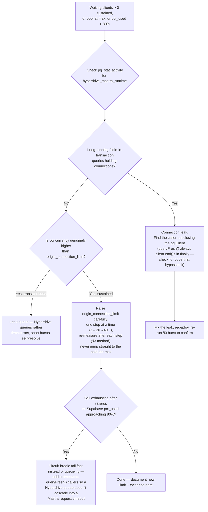

# Hyperdrive monitoring, connection-limit evidence, and pool-exhaustion runbook

**Ticket:** [IPI-624 · CF-DB-010 — Configure Hyperdrive Monitoring and Connection Alerts](https://linear.app/amo100/issue/IPI-624)
**Verified live:** 2026-07-22 (Cloudflare MCP `hyperdrive_configs_list`/`get` + Supabase MCP `execute_sql` against project `nvdlhrodvevgwdsneplk`, plus a real synthetic connection burst through the actual Hyperdrive binding — see [Measurement](#3-measurement-synthetic-burst-through-the-real-binding))
**Owner:** unassigned — CF-DB-M2 milestone owner should claim this in Linear. Whoever holds IPI-618/619/623 is the de facto owner today; the repo has no named on-call rotation yet, so don't invent one.

## TL;DR

| Acceptance criterion | Status | Where |
|---|---|---|
| Hyperdrive pool metrics monitored via Cloudflare Analytics | Documented — native, zero code | [§1](#1-reading-hyperdrive-pool-metrics-dashboard--graphql) |
| Measure concurrent usage before changing `origin_connection_limit` | Done — real burst, not guessed | [§3](#3-measurement-synthetic-burst-through-the-real-binding) |
| Set limit from evidence | **Recommend raising 5 → 20** (see correction below) | [§4](#4-connection-limit-decision) |
| Slow query alerting (>5s) with named channel | Documented — reuse existing Sentry, CF has no native hook for this | [§5](#5-slow-query-alerting-5s) |
| `pg_stat_activity` filtered to `hyperdrive_mastra_runtime` | Done — query + live baseline below | [§6](#6-pg_stat_activity-check) |
| Alert approaching `max_connections` (60) + runbook owner | Documented, owner flagged unassigned | [§7](#7-alerting-on-max_connections-headroom) |
| Runbook: exhausted → leaks/concurrency/raise/circuit-break | [§8](#8-runbook-hyperdrive-pool-exhausted) |
| Metrics visible in an observability dashboard | Native CF dashboard — no new dashboard built | [§1](#1-reading-hyperdrive-pool-metrics-dashboard--graphql) |

**Important correction to the ticket's stated context:** the ticket assumed the live `origin_connection_limit` is **20** and warned not to blindly drop it to 5. Live Cloudflare data (`hyperdrive_configs_list`, checked this session) shows the config **`ipix-supabase-fresh`** (`f59421821941436593f4c88416fb1601`) is currently set to **`origin_connection_limit: 5`**, not 20. No commit in this repo ever ran `wrangler hyperdrive update --origin-connection-limit` (`git log --all --grep` returns nothing) — it was changed outside version control, most likely via the Dashboard, some time between the config's creation (2026-07-15) and its `modified_on` of 2026-07-18. So the actual risk today is the opposite of what the ticket feared: the limit is already at the low end, and this doc's job was to check whether **5** is too tight, not to stop it from being cut *to* 5.

**Second important fact:** nothing in production actually sends traffic through this Hyperdrive config yet. IPI-619 (PR #600, open) only adds the `HYPERDRIVE_FRESH` *binding* to the Worker. IPI-623 · CF-DB-009 ("Migrate One Mastra Workload to Hyperdrive") — the ticket that would make a real Mastra workload use it — is still Backlog and is **blocked by this very ticket** (IPI-624). So there is no organic production traffic to sample; every concurrency number in this doc comes from a synthetic burst run against the real binding, not from live operator traffic. Re-run the measurement in §3 once IPI-623 ships a real workload.

---

## 1. Reading Hyperdrive pool metrics (Dashboard + GraphQL)

**Correction (2026-07-22, second review pass):** an earlier version of this doc said Hyperdrive exposes only connection-pool metrics, no per-query timing. That was wrong — verified against the current official docs ([Metrics and analytics](https://developers.cloudflare.com/hyperdrive/observability/metrics/)): Hyperdrive exposes **two** GraphQL Analytics datasets, not one.

**Dashboard (zero code, do this first):**

1. [Cloudflare dashboard](https://dash.cloudflare.com/4984b9bad07bc1da9f097dc8c1da24e0) → **Workers & Pages → Hyperdrive → `ipix-supabase-fresh`** → **Metrics** tab.
2. **Pool connections** chart shows, per Cloudflare location (airport code):
   - **Waiting clients** — requests queued for a connection.
   - **Open connections** — active connections to Supabase.
   - **Pool size maximum** — your configured `origin_connection_limit`.
3. **Contention signal:** a spike in waiting clients, or open connections sitting at the maximum consistently. Section 3 below reproduces exactly this signal on demand.

**GraphQL Analytics API — two datasets, check both, `configId` is required on both:**

`hyperdrivePoolSizesAdaptiveGroups` — pool-level: current/available pool slots, waiting clients, max pool size. Use this for the connection-exhaustion signal (§8's runbook).

```bash
curl -sS -X POST https://api.cloudflare.com/client/v4/graphql \
  -H "Authorization: Bearer $CLOUDFLARE_API_TOKEN" \
  -H "Content-Type: application/json" \
  -d '{
    "query": "query($accountTag: string!, $configId: string!, $since: Time!, $until: Time!) { viewer { accounts(filter: {accountTag: $accountTag}) { hyperdrivePoolSizesAdaptiveGroups(limit: 100, filter: {configId: $configId, datetime_geq: $since, datetime_leq: $until}) { avg { currentPoolSize availablePoolSlots waitingClients } max { maxPoolSize currentPoolSize waitingClients } dimensions { datetimeMinute } } } } }",
    "variables": { "accountTag": "4984b9bad07bc1da9f097dc8c1da24e0", "configId": "f59421821941436593f4c88416fb1601", "since": "2026-07-22T00:00:00Z", "until": "2026-07-22T23:59:59Z" }
  }'
```

`hyperdriveQueriesAdaptiveGroups` — **per-query timing** (this is the dataset the earlier version of this doc incorrectly claimed didn't exist): query volume, cache hit/miss status, query and result size in bytes, **query latency and connection-establishment latency in ms**, and success/failure status. **Check this dataset first when investigating slow Hyperdrive responses** — it's the native, per-config latency series; don't jump straight to Postgres/Sentry (§5) before ruling this out.

```bash
curl -sS -X POST https://api.cloudflare.com/client/v4/graphql \
  -H "Authorization: Bearer $CLOUDFLARE_API_TOKEN" \
  -H "Content-Type: application/json" \
  -d '{
    "query": "query($accountTag: string!, $configId: string!, $since: Time!, $until: Time!) { viewer { accounts(filter: {accountTag: $accountTag}) { hyperdriveQueriesAdaptiveGroups(limit: 100, filter: {configId: $configId, datetime_geq: $since, datetime_leq: $until}) { avg { queryDurationMs connectDurationMs } max { queryDurationMs connectDurationMs } dimensions { datetimeMinute cacheStatus } } } } }",
    "variables": { "accountTag": "4984b9bad07bc1da9f097dc8c1da24e0", "configId": "f59421821941436593f4c88416fb1601", "since": "2026-07-22T00:00:00Z", "until": "2026-07-22T23:59:59Z" }
  }'
```

(Field names above are illustrative of the dataset's shape per the docs — confirm exact field names against the live GraphQL schema via an introspection query before scripting against this, since Cloudflare's Analytics GraphQL field names occasionally shift between dataset versions.)

Both queries need an API token with `Account Analytics: Read`. The token used by `wrangler`/the Cloudflare MCP server in this environment could list and read the Hyperdrive config (`hyperdrive_configs_list`, `hyperdrive_config_get` both succeeded) but does **not** have Hyperdrive write scope — see the permission gap noted in §4.

No new dashboard was built for this ticket. The native chart above **is** "metrics visible in an observability dashboard" — building a second one (Grafana, custom page) would duplicate what Cloudflare already ships, which is exactly the kind of custom-code-before-checking-native-capability this ticket's own instructions warn against.

---

## 2. What already exists (checked before writing anything new)

Per the ticket's own priority order ("check what alerting infrastructure already exists... before inventing something new"):

| Checked | Found | Reused? |
|---|---|---|
| `grep -ri alert\|webhook` across `tasks/cloudflare/` | No Hyperdrive-specific alerting doc; no runbook file anywhere in the repo | N/A — first one |
| `tasks/cloudflare/docs/` | Did not exist before this PR | Created (this file) |
| Sentry in `app/` | `@sentry/nextjs@^10.65.0` already installed, DSN configured in `.env.example` (`amo-2b` org, `javascript-nextjs` project) | **Yes** — used as the named delivery channel for slow-query alerts, §5 |
| Supabase `pg_stat_statements` | Enabled (`pg_extension` check, this session) | Yes — source of truth for query duration |
| Supabase `pg_cron` | Enabled | Yes — scheduling primitive for the periodic check |
| Supabase `pg_net` | **Not** enabled | Not used — see §5 for what this rules out |
| Cloudflare Notifications (dashboard alerting product) | No Hyperdrive-specific alert type exists in Cloudflare's Notifications product as of this check (`search_cloudflare_documentation` for Hyperdrive/Workers/database alert types found nothing) | Documented as a gap, not invented around |
| IPI-620 `queryFresh()` helper (`app/src/lib/db/hyperdrive-query.ts`) | Exists, uncommitted, in a sibling worktree (not yet a PR) | Referenced as the future instrumentation point, **not edited** — editing someone else's in-flight file here would mix two tasks in one PR |

---

## 3. Measurement: synthetic burst through the real binding

IPI-622's benchmark script does not exist yet (`gh pr list --search "622"` → empty; its worktree has only the IPI-619 cherry-pick, no benchmark code). Per the ticket's fallback instruction, this section is a smaller synthetic burst run directly against the live Hyperdrive binding, the same way IPI-714 diagnosed Mastra's separate connection-pool exhaustion.

### Method

A throwaway Worker (never committed — lived only in `/tmp` for this session) bound to the real `HYPERDRIVE_FRESH` config, run via `wrangler dev --remote` so it hits the actual Cloudflare edge and the actual Supabase database:

```jsonc
// wrangler.jsonc (scratch, not committed)
{
  "name": "hd-burst-test",
  "main": "worker.js",
  "compatibility_date": "2026-07-01",
  "compatibility_flags": ["nodejs_compat"],
  "hyperdrive": [{ "binding": "HYPERDRIVE_FRESH", "id": "f59421821941436593f4c88416fb1601" }]
}
```

```js
// worker.js (scratch, not committed) — official Client-per-request recipe, same
// pattern as IPI-620's queryFresh(): new Client() inside the handler, never a
// module-scope Pool.
import { Client } from "pg";
export default {
  async fetch(req, env) {
    const sleepMs = Number(new URL(req.url).searchParams.get("sleep") ?? "300");
    const client = new Client({ connectionString: env.HYPERDRIVE_FRESH.connectionString });
    const start = Date.now();
    try {
      await client.connect();
      const r = await client.query(
        "select pg_backend_pid() as pid, pg_sleep($1::float/1000), now()", [sleepMs],
      );
      return Response.json({ ok: true, pid: r.rows[0].pid, totalMs: Date.now() - start });
    } finally { await client.end().catch(() => {}); }
  },
};
```

Fired **20 concurrent** HTTP requests, each holding a real Postgres connection open for **2.5s** (`pg_sleep`), against the live `origin_connection_limit: 5`.

### Results (client-side latency, sorted)

| Batch | Requests | Latency |
|---|---|---|
| 1 | 5 | 2.71s – 2.91s |
| 2 | 4 | 5.34s – 5.42s |
| 3 | 3 | 7.87s – 7.93s |
| 4 | 3 | 10.38s – 10.47s |
| 5 | 3 | 12.90s – 12.98s |
| 6 | 2 | 15.42s – 15.50s |

The requests fall into clean ~2.5s-spaced batches of ≈5 — the exact signature of a hard 5-connection ceiling serializing 20 concurrent callers. Theoretical minimum for 20 requests / 5 slots / 2.5s each is 10s; actual tail was 15.5s (FIFO queueing overhead + edge round-trip).

### Corroborating server-side evidence (Supabase `pg_stat_activity`, captured mid-burst)

```sql
select pid, usename, application_name, client_addr, state, query_start, now() - query_start as duration
from pg_stat_activity
where usename = 'hyperdrive_mastra_runtime'
order by query_start;
```

Returned **exactly 5 rows**, all `application_name = 'Cloudflare Hyperdrive'`, with staggered `query_start` times (09:57:42, 09:57:44, then three at 09:57:47) — live proof that Hyperdrive was reusing the 5 origin connections sequentially as the queue drained, not opening a 6th.

Snapshot during the burst: `hd_conns=5` (Hyperdrive-origin), `total_conns=22` (all roles), `max_connections=60`. Plenty of headroom — the constraint was Hyperdrive's own pool, not Supabase.

### Interpretation

- **5 is a real, measurable bottleneck** at even modest concurrency (20 simultaneous callers). Any operator-chat burst (e.g. several planners hitting Gate 1 at once) that lands on this Hyperdrive path once IPI-623 ships will queue the same way.
- **There is no Supabase capacity reason to stay at 5.** Baseline usage across all roles sits at ~17–22 connections out of 60. The documented free-tier Hyperdrive default of 20 origin connections leaves the account at ~40/60 in the *nominal* worst case (20 Hyperdrive + ~20 everything else) — but that's not the true ceiling. **Correction (2026-07-22, second review pass):** Cloudflare documents `origin_connection_limit` as a **soft limit** — Hyperdrive may open connections *beyond* the configured number during network failures, specifically to preserve availability ([Tuning the connection pool](https://developers.cloudflare.com/hyperdrive/configuration/tune-connection-pool/)). So "20 Hyperdrive + ~20 everything else = 40/60" understates the real worst case; treat 20 as *nominal* headroom, not a hard ceiling, and either reserve extra margin below the 48-connection alert threshold (§7) or set that threshold lower than 80% until real overshoot behavior has been observed under a network-failure condition.

---

## 4. Connection-limit decision

**Recommendation: raise `origin_connection_limit` from 5 → 20** (not the 5→lower direction the ticket warned about; the opposite correction is what the evidence supports). 20 is not an arbitrary number — it's the documented Cloudflare free-tier default (`.claude/skills/cloudflare/references/hyperdrive/gotchas.md` limits table: "Max origin connections — Free ~20 / Paid ~100") and matches the number the ticket itself assumed was already live.

This is a **baseline for when IPI-623 lands real traffic**, not a final production number — re-measure with actual Mastra workload concurrency once that ships, per the mermaid flow in the Linear ticket (`Run realistic operator traffic → pg_stat_activity + Hyperdrive analytics → exhaustion? → keep/lower or raise`).

**Not yet applied — permission gap found, not silently worked around:**

```bash
npx wrangler hyperdrive update f59421821941436593f4c88416fb1601 --origin-connection-limit=20
```

This session's `CLOUDFLARE_API_TOKEN` can **read** Hyperdrive config (`wrangler hyperdrive get`, MCP `hyperdrive_configs_list`/`get` all succeeded) but returned `Authentication error [code: 10000]` on the update call — the token lacks Hyperdrive write scope (confirmed no accidental change: `hyperdrive_config_get` re-checked immediately after still shows `origin_connection_limit: 5`). The Cloudflare MCP server's `hyperdrive_config_edit` tool also doesn't expose `origin_connection_limit` as an editable field (only name/host/port/database/user/scheme/caching).

**Whoever picks up this runbook needs to run the command above** (or Dashboard → Hyperdrive config → Edit → Origin connection limit) with a token that has `Account > Hyperdrive Configs > Edit` permission, then re-run the burst test in §3 to confirm the 5-request batching disappears at concurrency 20.

**Rollback:** `npx wrangler hyperdrive update f59421821941436593f4c88416fb1601 --origin-connection-limit=5` — instant, no data loss, no restart required (Hyperdrive reads the new limit on next connection acquisition).

---

## 5. Slow query alerting (>5s)

Cloudflare has **no native alert/notification hook for Hyperdrive query duration** — verified via `search_cloudflare_documentation` against the Notifications product and the Hyperdrive analytics docs. That is separate from **observability**: per-query latency **is** available in GraphQL via `hyperdriveQueriesAdaptiveGroups` (`queryDurationMs` / `connectDurationMs`) — check that first when investigating slow Hyperdrive responses (see §1). Pool contention still comes from `hyperdrivePoolSizesAdaptiveGroups`. Hyperdrive does not expose query *text*, so SQL-level triage still needs Postgres/`pg_stat_*`. For **push alerting** (>5s → email/Slack), reuse what's already installed rather than adding a new service:

**Named delivery channel: existing Sentry project** (`javascript-nextjs`, org `amo-2b`, already wired via `@sentry/nextjs` in `app/package.json` and `.env.example`). Sentry natively supports routing captured events to email, Slack, or PagerDuty via its own Alert Rules — no new integration needed, just a rule on this existing project.

**Instrumentation point (documented here, not implemented in this PR):** once IPI-620's `queryFresh()` helper (`app/src/lib/db/hyperdrive-query.ts`) merges, wrap it with a duration check:

```ts
// Inside queryFresh(), after result comes back — IPI-620 follow-up, not this PR
const durationMs = Date.now() - start;
if (durationMs > 5000) {
  Sentry.captureMessage(`Hyperdrive slow query (${durationMs}ms)`, {
    level: "warning",
    tags: { hyperdrive_slow_query: "true", config: "ipix-supabase-fresh" },
  });
}
```

This isn't added in this PR because `hyperdrive-query.ts` belongs to IPI-620, which hasn't merged yet — editing someone else's unmerged file here would mix two tasks in one PR (repo hard rule). Flagged as the concrete next step instead.

**Until that instrumentation lands, use the Postgres-native check** (works today, no app code needed) — **with a correction from the second review pass**:

`pg_stat_statements` is **cumulative since the last reset** ([official docs](https://www.postgresql.org/docs/current/pgstatstatements.html)), not a record of activity in just the current schedule window. A naive `mean_exec_time > 5000` query run every few minutes via `pg_cron` would re-report the *same* old slow query on every single run forever, and can't tell "this just crossed 5s" from "this has always been slow" — it would page continuously on one known-slow, already-triaged query instead of surfacing new problems.

Two corrected options:

**Option A — snapshot + delta (detects *newly* slow queries, keeps history):**
```sql
-- Run on a schedule (pg_cron). Requires a small tracking table — not in this PR,
-- flagged as the concrete follow-up alongside the queryFresh() Sentry hook above.
-- Snapshot: create table hyperdrive_slow_query_snapshots (queryid bigint, calls bigint, total_exec_time double precision, snapshot_at timestamptz default now());
-- Each run: compare current pg_stat_statements.calls/total_exec_time against the
-- last snapshot per queryid; alert only on queries whose delta mean_exec_time
-- (total_exec_time delta / calls delta) crosses 5000ms since the last snapshot.
-- Then upsert the new snapshot. This is genuinely new schema (a tracking table),
-- so it needs its own migration-only PR, not bundled into this docs-only one.
```

**Option B — currently-running queries only (works today, no new schema, narrower scope):**
```sql
-- pg_stat_activity shows in-flight queries, not historical aggregates — no
-- cumulative-counter problem, but only catches a slow query while it's still
-- running, not ones that already finished.
select pid, usename, now() - query_start as duration, left(query, 80) as query
from pg_stat_activity
where usename = 'hyperdrive_mastra_runtime'
  and state = 'active'
  and now() - query_start > interval '5 seconds';
```

Recommend Option B as the immediate, no-new-schema check; Option A as the real follow-up once someone's ready to add the tracking table.

`pg_net` (needed to fire an HTTP webhook straight from a `pg_cron` job) is **not enabled** on this project — that's a real gap, not an oversight to route around silently.

**Correction (2026-07-22, second review pass) — the Supabase Edge Function fallback below is not actually a "no new integration" option today.** A repo-wide check confirms Sentry is only configured in `app/` (`@sentry/nextjs`) — there is no Sentry SDK or DSN configured anywhere under `supabase/functions`. Before a scheduled Edge Function can call `Sentry.captureMessage`, someone needs to add a Deno-compatible Sentry client (e.g. `@sentry/deno` or Sentry's Deno-relay approach) and a DSN secret to that function's environment — this is real setup work, not a zero-cost reuse of the existing `app/` integration. Until that's done, the practical zero-setup path is: run Option B's query ad hoc via the Supabase SQL editor or MCP `execute_sql` when investigating a reported slowness, not as an automated alert. Enabling `pg_net` is a one-line `create extension pg_net;` migration if the team wants true in-Postgres webhook alerting later — not in scope here since it's a schema change (would need its own migration-only PR per the repo's one-concern rule).

---

## 6. `pg_stat_activity` check

```sql
select pid, usename, application_name, client_addr, state, backend_start, query_start,
       now() - query_start as duration, left(query, 80) as query
from pg_stat_activity
where usename = 'hyperdrive_mastra_runtime'
order by query_start;
```

**Live baseline (2026-07-22, idle — no burst running):**

| usename | application_name | connections |
|---|---|---|
| `hyperdrive_mastra_runtime` | `Cloudflare Hyperdrive` | 0–5 (0 at rest since no production workload uses this path yet; up to the configured limit under load) |
| `authenticator` | `PostgREST 13.0.5` | 4 |
| `supabase_admin` | realtime / pg_cron / pg_net / postgres_exporter | ~5 combined |
| `postgres` | `mgmt-api` | 1 |
| `supabase_auth_admin` | — | 1 |

`hyperdrive_mastra_runtime` role has `rolconnlimit = -1` (no Postgres-level cap on that role specifically — the only cap today is Hyperdrive's own `origin_connection_limit`).

---

## 7. Alerting on `max_connections` headroom

`max_connections = 60` (confirmed live via `current_setting('max_connections')`). Recommended alert threshold: **80% = 48 total connections** — but per the soft-limit correction in §4, this is a *nominal* threshold assuming Hyperdrive stays within its configured `origin_connection_limit`. Since Hyperdrive can exceed that limit during network failures, prefer erring toward a lower threshold (e.g. 70%/42) or building in extra margin once real overshoot behavior is observed, rather than treating 48 as a precise cutoff. Checked the same way as §6 but without the `usename` filter:

```sql
select count(*) as total_connections, current_setting('max_connections')::int as max_connections,
       round(100.0 * count(*) / current_setting('max_connections')::int, 1) as pct_used
from pg_stat_activity;
```

There is no Cloudflare-native alert for this (it's a Postgres-side number, not a Hyperdrive metric) and no Supabase dashboard alert for "connection count %" was found in this project. Until `pg_net` is enabled (§5), the same pg_cron-driven check above (run every few minutes, alert via Sentry/Supabase Edge Function when `pct_used > 80`) is the practical, no-new-service option.

**Runbook owner:** unassigned. This is the one item in this ticket that genuinely needs a human decision (who gets paged), not a config value — flag it in the CF-DB-M2 milestone rather than defaulting to a name nobody confirmed.

---

## 8. Runbook: Hyperdrive pool exhausted



**Step by step:**

1. **Detect** — Dashboard Pool Connections chart shows waiting clients or open connections pinned at the max, or the pg_cron check in §7 fires `pct_used > 80%`.
2. **Diagnose leaks first, not limits** (same order IPI-714 used for the separate Mastra Supavisor pool): query §6, look for `state = 'idle in transaction'` or `query_start` far in the past. A leak means a caller isn't hitting `queryFresh()`'s `finally { client.end() }` path — fix the code, don't raise the limit to mask it.
3. **Check concurrency vs. limit**: run the §3 burst method (or just count `hd_conns` in §6 during real load) to see if legitimate concurrent demand exceeds `origin_connection_limit`.
4. **Raise carefully** if step 3 confirms real demand: one increment at a time via `wrangler hyperdrive update --origin-connection-limit=N`, re-measure, repeat. Never jump to the paid-tier ceiling in one step — that just moves the same failure mode to Supabase's 60-connection budget instead of Hyperdrive's pool.
5. **Circuit-break** if raising the limit doesn't resolve it, or Supabase's own `max_connections` headroom (§7) is the real ceiling: add a client-side timeout around `queryFresh()` calls so a queued Hyperdrive request fails fast instead of stacking up and taking down an unrelated Mastra request. Not implemented in this PR — flag as follow-up once IPI-623 exposes real load-shedding needs.
6. **Confirm and document**: re-run §3's burst at the new limit, update this file's TL;DR table with the new number and the date.

---

## Appendix: what was and wasn't changed

| Item | Changed in this PR? |
|---|---|
| `origin_connection_limit` (5 → 20) | **No** — recommended, not applied (permission gap, §4). Live config still `5`. |
| `app/wrangler.jsonc` / any `app/` code | No — this is a docs-only PR |
| IPI-620's `hyperdrive-query.ts` | No — referenced only, not edited (belongs to a different in-flight PR) |
| Sentry alert rule for `hyperdrive_slow_query` | No — documented as the next step once IPI-620 merges; creating a Sentry rule with no event ever tagged that way yet would be a no-op |
| `pg_net` extension | No — flagged as a gap, not enabled here (would need its own migration PR) |
