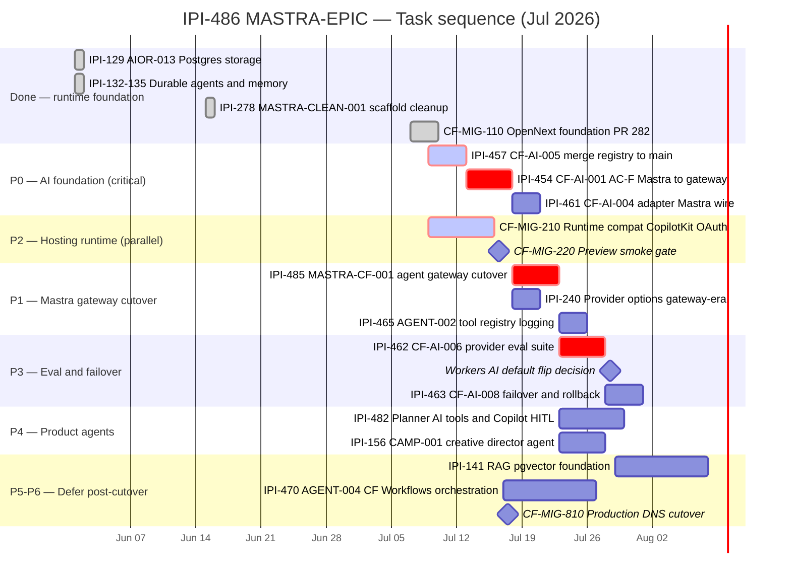
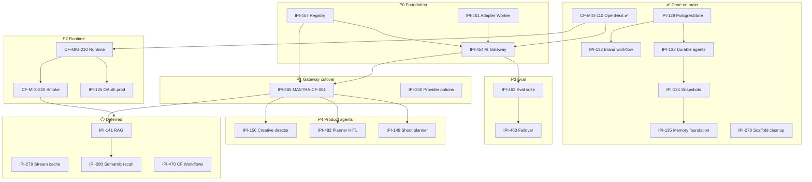

# MASTRA-EPIC · Mastra × Cloudflare Operating System

**SSOT for all Mastra work at iPix** · **Last updated:** 2026-07-09  
**Companion:** [`mastra-audit.md`](./mastra-audit.md) (forensic) · [`../todo.md`](../todo.md) (CF platform spine)  
**Linear epic:** [IPI-486 · MASTRA-EPIC](https://linear.app/amo100/issue/IPI-486) — attach child issues per §9

---

## 1. Executive summary

**Verdict:** Keep Mastra as the **in-process agent/workflow brain** inside the OpenNext Worker. Cloudflare owns **routing, inference, deployment, and observability** via AI Gateway + Workers AI OpenAI-compatible REST. **Not production-ready** until **IPI-457**, **IPI-454 AC-F**, **CF-MIG-210**, and **IPI-462** are complete.

| Area | Score | Status |
|------|------:|:------:|
| Architecture | 92% | 🟢 |
| Official docs alignment | 88% | 🟢 |
| Task sequencing | 84% | 🟡 |
| Linear status accuracy | 65% | 🔴 |
| Production readiness | 58% | 🔴 |
| **Overall Mastra epic correctness** | **84%** | 🟡 → **95%** after gateway wire + Linear cleanup |

**Main answer:** Epic strategy is strong. The core blocker is **not Mastra itself** — it is **one gateway-first model path** (`resolveModel()` → AI Gateway REST) and **Linear status honesty**.

**Do not treat as production-ready until:** IPI-457 merged · IPI-454 AC-F shipped · CF-MIG-210 green · IPI-462 eval signed off.

**Doc verification (2026-07-09):**

| Claim | Official source | Verified |
|-------|-----------------|:--------:|
| Workers AI OpenAI-compat `/v1/chat/completions` + `/v1/embeddings` at `api.cloudflare.com/client/v4/accounts/{ACCOUNT_ID}/ai/v1` | [Workers AI OpenAI compat](https://developers.cloudflare.com/workers-ai/configuration/open-ai-compatibility/) | 🟢 |
| AI Gateway legacy `/compat/chat/completions` **deprecated** — use REST only | [AI Gateway unified API](https://developers.cloudflare.com/ai-gateway/usage/chat-completion/) | 🟢 **Do not implement new code against `/compat`** |
| Mastra Workers AI model IDs (`cloudflare-workers-ai/@cf/...`) | [Mastra CF Workers AI](https://mastra.ai/models/providers/cloudflare-workers-ai) | 🟢 — route via gateway for registry/logging |
| Mastra on CF: no LibSQL `file:` on Workers; use remote Postgres | [Mastra deploy CF](https://mastra.ai/guides/deployment/cloudflare) | 🟢 — iPix uses `PostgresStore` (IPI-129 ✅) |
| CF Workflows for durable multi-step external orchestration | [Cloudflare Workflows](https://developers.cloudflare.com/workflows/) | 🟢 |
| Mastra CF deploy: web framework path preferred over standalone deployer | [Mastra deploy CF](https://mastra.ai/guides/deployment/cloudflare) | 🟢 — supports OpenNext in-process SSOT |
| CopilotKit v2 + Mastra in-process | [CopilotKit Mastra integration](https://docs.copilotkit.ai/mastra) | 🟢 — operator path blocked by CF-MIG-210 |

**MCP note:** No dedicated **Cloudflare MCP** is enabled in this workspace (`mcps/` has Supabase, Linear, Mastra, CopilotKit — not Cloudflare). Verification used **official Cloudflare docs (WebFetch)** + **`.claude/skills/cloudflare/references/`** + repo forensic. **Mastra MCP** (`searchMastraDocs`) returned no Cloudflare deployment hits in `app/node_modules` — use [mastra.ai/llms.txt](https://mastra.ai/llms.txt) for deploy guidance.

**Do not:**

- Flip Workers AI default before **IPI-462** eval sign-off
- Use standalone `@mastra/deployer-cloudflare` as primary path (reference only; SSOT = OpenNext in-process)
- Mark **IPI-457** Done until `app/src/lib/ai/model-registry.ts` is on `main`

**Execute next (critical path):**

```text
1. CF-MIG-110 · OpenNext Foundation ✅ PR #282 merged
2. IPI-457 · CF-AI-005 — Unified AI Provider Types & Registry → merge to main
3. IPI-454 · CF-AI-001 AC-F — Mastra resolveModel → AI Gateway REST
4. CF-MIG-210 · Runtime Compatibility — CopilotKit, OAuth, Groq JSON  (∥ can start after step 1)
5. IPI-485 · MASTRA-CF-001 — Mastra Provider Gateway Cutover
6. IPI-462 · CF-AI-006 — AI Provider Evaluation Suite
7. Workers AI default flip — only if IPI-462 passes
8. CF-MIG-220 smoke → CF-MIG-810 DNS last
```

### 🔴 Red flags (status / API)

| Issue | Problem | Fix |
|-------|---------|-----|
| **IPI-457 · CF-AI-005 — Unified AI Provider Types & Registry** | Branch-only — `model-registry.ts` not on `main` | Merge before Done |
| **IPI-461 · CF-AI-004 — AI Provider Adapter Layer** | Worker on main but Mastra unwired | Keep **In Progress** until AC-F lands |
| **IPI-454 · CF-AI-001 — AI Gateway — Cloudflare Provider Routing** | AC-F open | Wire `resolveModel()` → gateway REST |
| **CF-MIG-210 · Runtime Compatibility — Hono, Groq JSON, OAuth, Bundle** | Blocks operator on Workers | Fix CopilotKit, OAuth, groq bundle |
| **AI Gateway `/compat` URLs** | Deprecated path | New code: REST `.../accounts/{ACCOUNT_ID}/ai/v1/...` only |

### Engineering gates (IPI-485 + hygiene)

1. **Rename** all Gemini-first task ACs → **gateway-first** (`resolveModel(tier)`).
2. **Keep** **IPI-485 · MASTRA-CF-001 — Mastra Provider Gateway Cutover** as the agent cleanup gate.
3. **CI grep** — fail if `app/src/mastra/**` imports `@google/generative-ai` or `@ai-sdk/groq` directly.
4. **Integration test** — `resolveModel("fast")` with `AI_GATEWAY_URL` set sends to gateway base URL.
5. **Docs banner** — `deploy-cloudflare.md` / `cloudfalre-deployer.md` marked **reference only**; SSOT = OpenNext in-process.

**Hard dependency:**

```text
IPI-457 · CF-AI-005 — Unified AI Provider Types & Registry
    blocks
IPI-485 · MASTRA-CF-001 — Mastra Provider Gateway Cutover
    (also blocked by IPI-454 · CF-AI-001 AC-F)
```

---

## 2. Mastra architecture overview

### 2.1 Target runtime

```text
                    ┌─────────────────────────────────────┐
                    │  Cloudflare Workers (OpenNext)      │
                    │  CF-MIG-110 (#282)                  │
                    └─────────────────┬───────────────────┘
                                      │
          ┌───────────────────────────┼───────────────────────────┐
          │                           │                           │
          ▼                           ▼                           ▼
   CopilotKit v2              Mastra (in-process)          Next.js App Router
   /api/copilotkit/*           getMastra() Proxy            operator + marketing
          │                           │
          │              ┌────────────┴────────────┐
          │              │ agents (9+)           │
          │              │ workflows (2 HTTP)    │
          │              │ tools (agentTools)    │
          │              │ PostgresStore memory  │
          │              └────────────┬────────────┘
          │                           │
          │                           ▼
          │              resolveModel(tier)  ← SSOT (IPI-457)
          │              app/src/lib/ai/provider.ts
          │                           │
          └───────────────────────────┼───────────────────────────┐
                                      ▼                           │
                         AI Gateway REST (preferred)              │
              api.cloudflare.com/.../ai/v1/chat/completions       │
              OR managed gateway.ai.cloudflare.com (BYOK)         │
                                      │                           │
                    ┌─────────────────┼─────────────────┐         │
                    ▼                 ▼                 ▼         │
              Workers AI         Google AI          Groq          │
              @cf/meta/...       (vision/fallback)  (fast tier)   │
                                                                  │
     services/cloudflare-worker/  ← scaffold on main; not wired ──┘
     (merge into app provider OR call as internal service)
```

### 2.2 Current state on `main` (forensic)

| Component | Path | Status |
|-----------|------|:------:|
| Mastra registry | `app/src/mastra/index.ts` | 🟢 9 agents + 2 workflows |
| Model resolution | `app/src/lib/ai/provider.ts` | 🔴 gemini/groq only; no `AI_GATEWAY_URL` |
| App model registry | `app/src/lib/ai/model-registry.ts` | 🔴 **branch only** (`ai/ipi-471-...`) |
| Worker registry | `services/cloudflare-worker/model-registry.ts` | 🟢 on main |
| Gateway router | `services/cloudflare-worker/router.ts` | 🟡 unit-tested; not called by Mastra |
| Storage | `getMastraStorage()` → Postgres | 🟢 IPI-129 |
| Durable agents | `app/src/mastra/durable.ts` | 🟢 IPI-133–135 |
| CopilotKit | marketing-chat 🟢 · operator 🔴 | CF-MIG-210 |

### 2.3 Agent inventory (Mastra)

| Agent ID | File | Primary use | Model today |
|----------|------|-------------|-------------|
| `default` | `agents/index.ts` | CopilotKit default | Gemini |
| `production-planner` | `agents/index.ts` | Shoot planning | Gemini |
| `creative-director` | `agents/index.ts` | Campaigns (IPI-156) | Gemini |
| `brand-intelligence` | `brand-intelligence-agent.ts` | Onboarding / crawl | Gemini + edge BI |
| `visual-identity` | `visual-identity.ts` | Brand visuals | Gemini (vision) |
| `social-discovery` | `social-discovery.ts` | Social intel | Gemini |
| `model-match` | `model-match-agent.ts` | Talent matching | Gemini |
| `crm-assistant` | `crm-assistant-agent.ts` | CRM panel | Gemini |
| `booking` | `booking-agent.ts` | Model booking | Gemini |

**HTTP workflows:** `shoot-wizard`, `brand-intelligence` (no `brand-approval` — IPI-278 ✅)

### 2.4 Layer responsibilities

| Layer | Owner | Responsibility |
|-------|-------|----------------|
| **Mastra** | iPix `app/src/mastra/` | Agents, tools, workflows, memory threads, HITL suspend/resume |
| **AI Gateway** | Cloudflare (IPI-454) | Unified routing, logging, fallbacks, rate limits |
| **Workers AI** | Cloudflare | Default inference **after IPI-462** |
| **Gemini** | Google | Vision, grounding, structured fallback |
| **Groq** | Groq | Fast tier until Workers AI passes eval |
| **CF Workflows** | Cloudflare (IPI-470) | Cross-system durable jobs (>30s, webhooks) — **not** Mastra replacement |
| **Supabase** | Platform | RLS data, `ai_agent_logs`, pgvector (defer IPI-141+) |
| **CopilotKit** | UI transport | v2 runtime; maps `agentId` → Mastra agents |

---

## 3. Epic roadmap (phases)

| Phase | Name | Goal | Exit criteria |
|:-----:|------|------|---------------|
| **P0** | Foundation & honesty | OpenNext + honest Linear status | CF-MIG-110 ✅; IPI-457 on main; IPI-454 AC-F started |
| **P1** | Gateway-first inference | One model path for all agents | IPI-485 done; no direct Gemini/Groq in agents |
| **P2** | Runtime production | Operator on Workers preview | CF-MIG-210 green; CF-MIG-220 smoke |
| **P3** | Eval & default flip | Data-driven provider choice | IPI-462 sign-off; Workers AI default if passes |
| **P4** | Product AI spine | Planner, events, operator UX | IPI-482 planner tools; shoot/campaign unification |
| **P5** | Memory & RAG | pgvector + semantic recall | IPI-141–145, IPI-280 (post-cutover) |
| **P6** | Expansion | Workflows, browser, cost | IPI-470, IPI-467, IPI-460 |

---

## 4. Phase-by-phase implementation plan

### P0 — Foundation & Linear hygiene (week 1)

| Step | Issue | Action |
|------|-------|--------|
| 0.1 | CF-MIG-110 / #282 | ✅ **Done** — OpenNext foundation merged |
| 0.2 | IPI-457 | Merge `app/src/lib/ai/model-registry.ts` from `ai/ipi-471-agent-001-ai-agent-architecture` |
| 0.3 | IPI-461 | Keep **In Progress** — Worker adapter on main; Mastra wire = IPI-454 AC-F |
| 0.4 | IPI-454 | Complete AC-F: `resolveModel()` → `@ai-sdk/openai-compatible` + gateway base URL |
| 0.5 | `.claude/skills/mastra/SKILL.md` | Update gateway-first wording (not Gemini-first) |

**Acceptance:** `resolveModel('fast')` hits gateway in integration test; dual registry eliminated.

### P1 — MASTRA-CF-001 gateway cutover (week 2)

| Step | Issue | Action |
|------|-------|--------|
| 1.1 | IPI-485 | Enforce: no `@google/generative-ai` / `@ai-sdk/groq` in `app/src/mastra/**` |
| 1.2 | IPI-485 | CI grep gate + `resolveModel("fast")` → `AI_GATEWAY_URL` integration test |
| 1.3 | IPI-240 | Align `resolveProviderOptions()` for gateway-era models |
| 1.4 | IPI-156,259,261–263,369 | Rewrite ACs: `resolveModel(tier)` not `resolveGeminiModel()` |
| 1.5 | IPI-465 | Tool logs include gateway request IDs |

**Blocked by:** `IPI-457` (registry SSOT) **and** `IPI-454 AC-F` (gateway wire) — both must land before IPI-485 Done.

**Acceptance:**

```bash
# CI grep (add to app test or lint script)
! rg '@google/generative-ai|@ai-sdk/groq' app/src/mastra/

# Integration test (provider.test.ts)
resolveModel('fast') with AI_GATEWAY_URL → openai-compatible client base URL
```

Gemini only for vision/fallback env; Workers AI default blocked by IPI-462.

### P2 — CF-MIG-210 runtime (parallel week 2–3)

| Step | Issue | Action |
|------|-------|--------|
| 2.1 | CF-MIG-210 | `hono/vercel` → CF adapter for operator CopilotKit |
| 2.2 | CF-MIG-210 | Supabase OAuth allowlist for `*.workers.dev` |
| 2.3 | CF-MIG-210 | Bundle `config/groq-models.json` (no `readFileSync` on Workers) |
| 2.4 | IPI-125 | Prod Copilot auth URLs (related) |

**Acceptance:** Operator shell chat works on preview Worker; CF-MIG-220 smoke script green.

### P3 — Eval & provider default (week 3–4)

| Step | Issue | Action |
|------|-------|--------|
| 3.1 | IPI-462 | Run eval suite: brand BI, DNA, shoot planner, CRM tools |
| 3.2 | IPI-463 | Failover/rollback patterns via gateway |
| 3.3 | IPI-454 | Flip Workers AI default **only** if IPI-462 passes |

### P4 — Product AI spine (week 4+)

| Step | Issue | Action |
|------|-------|--------|
| 4.1 | IPI-482 | Mastra planner AI tools + CopilotKit HITL |
| 4.2 | IPI-475 | Global context-aware chat engine |
| 4.3 | IPI-148,184 | Shoot planner + shot library tools |
| 4.4 | Universal planner | `app/src/lib/planner/` — separate PR epic (PLN) |

### P5 — Memory & RAG (defer until P1–P3)

| Issue | Notes |
|-------|-------|
| IPI-141–145 | pgvector, ingestion, RAG — valid, not migration blockers |
| IPI-279 | Durable stream cache — only if Workers replay fails |
| IPI-280 | Semantic recall — after pgvector RLS |
| IPI-474,177 | AI Search / RAG stack evaluation |

### P6 — Expansion (post-cutover)

| Issue | Notes |
|-------|-------|
| IPI-470 | CF Workflows for external orchestration only |
| IPI-467,139 | Browser automation via CF Browser Rendering |
| IPI-460 | Cost tracking via gateway analytics |
| IPI-455 | Brand intelligence migration to Workers path |
| IPI-333 | Extra agents — after tool surface stable |

---

## 5. Task dependency table

| Issue | Spec ID | Phase | Depends on | Blocks |
|-------|---------|:-----:|------------|--------|
| CF-MIG-110 | OpenNext foundation | P0 | — | CF-MIG-210, IPI-454 AC-I |
| IPI-457 | CF-AI-005 Registry | P0 | — | **IPI-485** (hard), IPI-454 AC-F |
| IPI-461 | CF-AI-004 Adapter | P0 | IPI-457 (types) | IPI-454 AC-F |
| IPI-454 | CF-AI-001 Gateway | P0–P1 | IPI-457, #282 | IPI-485, IPI-462 |
| IPI-485 | MASTRA-CF-001 Cutover | P1 | **IPI-457** (required), IPI-454 AC-F | IPI-156+, product agents |
| CF-MIG-210 | Runtime compat | P2 | CF-MIG-110 | CF-MIG-220, operator MVP |
| IPI-462 | CF-AI-006 Eval | P3 | IPI-454 AC-F | Workers AI default |
| IPI-463 | CF-AI-008 Failover | P3 | IPI-454 | prod hardening |
| IPI-129 | AIOR-013 Postgres storage | ✅ | — | all Mastra memory |
| IPI-132–135 | Durable + memory | ✅ | IPI-129 | brand workflow |
| IPI-278 | Scaffold cleanup | ✅ | — | — |
| IPI-470 | AGENT-004 CF Workflows | P6 | IPI-485, CF-MIG-220 | long-running external jobs |
| IPI-141–145 | RAG epic | P5 | IPI-485, pgvector | IPI-280 |
| IPI-279,280,333,139 | Defer | P5–P6 | P1–P3 | — |
| IPI-156,259,261–263,369 | Agent features | P4 | IPI-485 | campaign/shoot UX |
| IPI-240 | Provider options | P1 | IPI-457 | agent tools with thinking budgets |
| IPI-482 | Planner + HITL | P4 | IPI-485, planner schema | shoot/campaign brain |
| IPI-125 | OAuth prod | P2 | CF-MIG-210 | prod Copilot |

---

## 6. Critical path

```text
CF-MIG-110 ✅ (#282 merged)
    ├── CF-MIG-210 (operator runtime) ── parallel hosting track
    │       └── CF-MIG-220 (smoke gate)
    │               └── CF-MIG-810 (DNS cutover — LAST)
    └── IPI-457 merge (registry SSOT)
            └── IPI-454 AC-F (Mastra → gateway REST)
                    ├── IPI-485 (agent cutover)
                    │       └── IPI-156 / IPI-482 / shoot agents
                    └── IPI-462 (eval)
                            └── Workers AI default flip (optional)
```

**Parallel tracks (non-blocking):**

- IPI-465 tool registry hardening
- IPI-482 planner (separate PR concern)
- Docs PR #280 (migration audits — docs-only)

---

## 7. Mermaid Gantt chart — task sequence

**How to read this:** Bars run left → right in time. **Red (crit)** = on the critical path. **Diamond** = gate you must pass before the next phase. Hosting (CopilotKit on Workers) and AI (gateway wiring) run in **parallel** after OpenNext lands.

### 7.1 Gantt (matches Linear child issues)



### 7.2 Plain-English guide (what each bar means)

| Order | Gantt bar | Full Linear / spec name | What you ship | Who cares |
|:-----:|-----------|-------------------------|---------------|-----------|
| ✅ | IPI-129 | **IPI-129 · AIOR-013 — Mastra Durable Storage (Postgres)** | Mastra memory uses Supabase Postgres, not local files | All agents |
| ✅ | IPI-132–135 | **IPI-132–135 · AIOR-003/017/018/019 — Durable agents + memory** | Workflows can suspend/resume; memory threads work | Brand onboarding |
| ✅ | IPI-278 | **IPI-278 · MASTRA-CLEAN-001 — Unregister Brand Approval Scaffold** | Removed dead brand-approval agent route | Cleaner registry |
| ✅ | CF-MIG-110 | **CF-MIG-110 · OpenNext Foundation — Wrangler + OpenNext Scaffold** | Next.js builds as a Cloudflare Worker; preview on :8787 | Everyone |
| **1** | IPI-457 | **IPI-457 · CF-AI-005 — Unified AI Provider Types & Registry** | One `model-registry.ts` on `main` — no split brain | AI + Mastra |
| **2** | IPI-454 AC-F | **IPI-454 · CF-AI-001 — AI Gateway — Cloudflare Provider Routing** (AC-F) | `resolveModel()` calls AI Gateway REST, not Gemini direct | All inference |
| **3** | IPI-461 | **IPI-461 · CF-AI-004 — AI Provider Adapter Layer** | Gateway Worker wired into Mastra path | Platform |
| ∥ | CF-MIG-210 | **CF-MIG-210 · Runtime Compatibility — Hono, Groq JSON, OAuth, Bundle** | Operator CopilotKit works on `*.workers.dev` | Operator UX |
| ∥ | CF-MIG-220 | **CF-MIG-220 · Preview Smoke Gate — End-to-End workers.dev Validation** | Scripted proof preview matches Vercel | Release |
| **4** | IPI-485 | **IPI-485 · MASTRA-CF-001 — Mastra Provider Gateway Cutover** | No agent imports Gemini/Groq SDK directly | Mastra hygiene |
| **5** | IPI-462 | **IPI-462 · CF-AI-006 — AI Provider Evaluation Suite** | Data proves Workers AI quality before default flip | Product + AI |
| ◆ | Workers AI flip | *(gate, not a separate issue)* | Only if IPI-462 passes — switch fast tier to `@cf/meta/...` | Cost + latency |
| **6** | IPI-463 | **IPI-463 · CF-AI-008 — AI Provider Failover & Rollback** | Runbook when gateway or provider fails | Ops |
| later | IPI-482 | **IPI-482 · Mastra Planner AI Tools + CopilotKit HITL** | Unified shoot/campaign planner in operator shell | MVP #6–8 |
| later | IPI-156 | **IPI-156 · CAMP-001 — Creative Director Agent** | Campaign brain agent on gateway models | Campaigns |
| defer | IPI-141 | **IPI-141+ · RAG / pgvector** | Semantic memory — after gateway stable | Knowledge |
| defer | IPI-470 | **IPI-470 · AGENT-004 — Cloudflare Workflows & Orchestration** | Long external jobs only — not Mastra replacement | Platform |
| last | CF-MIG-810 | **CF-MIG-810 · Production Cutover — DNS + Rollback** | Point DNS to Cloudflare — **only after CF-MIG-220 green** | Leadership |

**∥** = can run in parallel with the row above. **◆** = decision gate, not a standalone issue.

### 7.3 Current position (Jul 9)

```text
✅ CF-MIG-110 done (#282 merged)
→ NEXT (pick one PR each):
   • CF-MIG-210 · Runtime Compatibility  (hosting)
   • IPI-457 · CF-AI-005 registry merge  (AI)
Then: IPI-454 AC-F → IPI-485 → IPI-462 → CF-MIG-220 → CF-MIG-810
```

---

## 8. Mermaid dependency diagram



---

## 9. Recommended Linear updates

### Epic parent (created — children attached in Linear)

| Field | Value |
|-------|-------|
| **Issue** | [IPI-486 · MASTRA-EPIC · Mastra × Cloudflare Operating System](https://linear.app/amo100/issue/IPI-486) |
| **Local spec** | `linear/issues/IPI-486-mastra-epic.md` |
| **Doc** | `tasks/cloudflare/mastra/MASTRA-EPIC.md` |
| **Children** | IPI-454, 457, 461, 485, 462, 463, 465, 470, 482, 240, 129, 132–135, 278 ✅ parent set |

CF-MIG hosting tasks (**CF-MIG-110/210/220/810**) are under **[IPI-487 · CLOUDFLARE-EPIC](https://linear.app/amo100/issue/IPI-487)** — not duplicated here.

### Reopen / correct status

| Issue | Action | Correct title |
|-------|--------|---------------|
| **IPI-461** | Keep **In Progress** (not Complete) | CF-AI-004 — AI Provider Adapter Layer |
| **IPI-457** | Keep **In Progress** (was false Done) | CF-AI-005 — Unified AI Provider Types Registry |
| **IPI-454** | Keep **In Progress** | CF-AI-001 — AI Gateway — Cloudflare provider routing |

### Rename / reword (no new issues)

| Issue | Action |
|-------|--------|
| **IPI-240** | ✅ Renamed — Provider options alignment (gateway-era) |
| **IPI-156,259,261,262,263,369** | ✅ Provider block prepended — verify AC checkboxes |
| **IPI-470** | ✅ CF Workflows scope clarified vs Mastra |

### Add (already created — do not duplicate)

| Issue | Title |
|-------|-------|
| **IPI-485** | MASTRA-CF-001 · Mastra provider gateway cutover |

### Defer (add comment, do not cancel)

| Issues | Rationale |
|--------|-----------|
| IPI-141–145 | RAG/pgvector — post gateway cutover |
| IPI-279,280,333,139 | Stream cache, semantic recall, extra agents, browser — not CF blockers |

### Mark Done (verify on main first)

| Issue | Verify |
|-------|--------|
| IPI-129 | `PostgresStore` in `app/src/mastra/storage.ts` |
| IPI-132–135 | brand workflow + durable agents |
| IPI-278 | no brand-approval route |
| IPI-471 | architecture doc — mark Done if proof path fixed |

### Cancel / no action

| Issue | Note |
|-------|------|
| IPI-354 GROQ epic | Already canceled — code merged, cleanup via IPI-459 after eval |
| Standalone Mastra CloudflareDeployer task | **Do not create** — document as defer in skill refs only |

---

## 10. Risks, blockers, and production readiness

### 🔴 Blockers

| # | Blocker | Mitigation |
|---|---------|------------|
| B1 | IPI-457 branch-only registry | Merge PR before any gateway Done |
| B2 | No `AI_GATEWAY_URL` in `resolveModel()` | IPI-454 AC-F |
| B3 | `readFileSync(groq-models.json)` on Workers | Bundle or KV in CF-MIG-210 |
| B4 | Operator CopilotKit `hono/vercel` | CF-MIG-210 adapter |
| B5 | OAuth on `*.workers.dev` | Supabase redirect allowlist |
| B6 | Workers AI default pre-eval | Hard gate IPI-462 |

### 🟡 Risks

| Risk | Impact | Mitigation |
|------|--------|------------|
| Dual registry drift | Wrong model per tier | Single SSOT after IPI-457 |
| `/compat` URL in old docs | Deprecated path still works but wrong for new code | Use REST `.../ai/v1/chat/completions` |
| Team forks to CloudflareDeployer | Double deploy, split brain | Banner in mastra CF refs |
| Gemini-only agent ACs | Wrong implementation | Batch reword + IPI-485 grep CI |
| Linear false Done | Wrong execution order | This epic + audit script |

### Production readiness checklist

```text
Hosting
[x] PR #282 merged — OpenNext builds and preview serves /
[ ] CF-MIG-210 green — operator CopilotKit on preview Worker
[ ] CF-MIG-220 smoke script passes end-to-end
[ ] Supabase OAuth works on *.workers.dev preview URL

Inference
[ ] IPI-457 model-registry.ts on main (single SSOT)
[ ] resolveModel() uses AI Gateway REST (not direct Gemini)
[ ] IPI-485 — no direct provider SDK imports in mastra/**
[ ] IPI-462 eval passed for brand, shoot, CRM, DNA tiers
[ ] Workers AI default only if eval sign-off documented

Mastra runtime
[ ] getMastra() only in handlers (not module top-level)
[ ] DATABASE_URL + PostgresStore in prod (port 6543)
[ ] Required agent IDs present for CopilotKit
[ ] ai_agent_logs receives gateway request metadata

Security
[ ] No GEMINI_API_KEY / SERVICE_ROLE in client bundles
[ ] Gateway BYOK or CF token server-side only
[ ] RLS unchanged on agent log tables

Observability
[ ] Gateway analytics visible for tier traffic
[ ] IPI-460 cost tracking (P6) or interim gateway dashboard

Cutover
[ ] CF-MIG-810 DNS only after CF-MIG-220 green
[ ] Rollback runbook tested (Vercel prod fallback)
```

---

## Appendix A — Issue phase map (Mastra-tagged Linear export)

| Phase | Issues |
|-------|--------|
| **P0** | IPI-454, IPI-457, IPI-461, CF-MIG-110, CF-MIG-111 |
| **P1** | IPI-485, IPI-240, IPI-465 (logging) |
| **P2** | CF-MIG-210, CF-MIG-220, IPI-125, IPI-472 |
| **P3** | IPI-462, IPI-463, IPI-460 |
| **P4** | IPI-156, IPI-148, IPI-184, IPI-482, IPI-475, IPI-259–263, IPI-369 |
| **P5** | IPI-141–145, IPI-174, IPI-177, IPI-279, IPI-280, IPI-474 |
| **P6** | IPI-470, IPI-467, IPI-466, IPI-455, IPI-456, IPI-333, IPI-139 |
| **Done** | IPI-129, IPI-132, IPI-133, IPI-134, IPI-135, IPI-227, IPI-278, IPI-428 |
| **Canceled** | IPI-354–361 (Groq epic — hosting unrelated) |

## Appendix B — Gateway URL patterns (verified)

**Preferred (new integrations):**

```text
https://api.cloudflare.com/client/v4/accounts/{ACCOUNT_ID}/ai/v1/chat/completions
https://api.cloudflare.com/client/v4/accounts/{ACCOUNT_ID}/ai/v1/embeddings
```

Auth: `Authorization: Bearer {CF_API_TOKEN}`

**Workers AI direct OpenAI-compat (without gateway logging):**

```text
https://api.cloudflare.com/client/v4/accounts/{ACCOUNT_ID}/ai/v1
```

**Legacy (deprecated by Cloudflare — do not use for new iPix code):**

```text
https://gateway.ai.cloudflare.com/v1/{account_id}/{gateway_id}/compat/chat/completions
```

Cloudflare marks `/compat/chat/completions` deprecated; existing integrations may keep working, but **all new Mastra/gateway wiring must use REST** `api.cloudflare.com/client/v4/accounts/{ACCOUNT_ID}/ai/v1/chat/completions`.

## Appendix C — References

- Repo: `app/src/mastra/`, `app/src/lib/ai/provider.ts`, `services/cloudflare-worker/`
- Audit: [`mastra-audit.md`](./mastra-audit.md)
- CF spine: [`../todo.md`](../todo.md), [`../migration/startup.md`](../migration/startup.md)
- Verification: [`../audits/ipi-454-457-462-463-verification.md`](../audits/ipi-454-457-462-463-verification.md)
- Skills: `.claude/skills/mastra/SKILL.md`, `.claude/skills/cloudflare/references/ai-gateway/`
- Linear: [IPI-485](https://linear.app/amo100/issue/IPI-485) · [IPI-454](https://linear.app/amo100/issue/IPI-454) · [IPI-457](https://linear.app/amo100/issue/IPI-457)

---

**Sign-off:** Epic is **84% correct** — strategy matches official CF + Mastra docs. **Not production-ready** until IPI-457, IPI-454 AC-F, CF-MIG-210, and IPI-462 complete. Framework choice needs no change.
