| ID | Team | Title | Description | Status | Estimate | Priority | Project ID | Project | Creator | Assignee | Labels | Cycle Number | Cycle Name | Cycle Start | Cycle End | Created | Updated | Started | Triaged | Completed | Canceled | Archived | Due Date | Parent issue | Initiatives | Project Milestone ID | Project Milestone | SLA Status | UUID | Time in status (minutes) | Related to | Blocked by | Duplicate of |
| --- | --- | --- | --- | --- | --- | --- | --- | --- | --- | --- | --- | --- | --- | --- | --- | --- | --- | --- | --- | --- | --- | --- | --- | --- | --- | --- | --- | --- | --- | --- | --- | --- | --- |
| IPI-461 | iPix1 | CF-AI-004 — AI Provider Adapter Layer | **Priority:** P0 — Foundation
**Status:** ✅ Complete
**Proof:** `app/src/lib/ai/provider-adapter.ts` + `provider-adapter.test.ts` — 9 tests passing
**Branch:** `ai/ipi-471-agent-001-ai-agent-architecture` (committed 84cf5ead)

## Deliverables

- [X] `AiProviderAdapter` interface: `chat()`, `chatStream()`, `structured()`, `embed()`
- [X] No Mastra agent imports provider SDKs directly (adapter uses direct fetch)
- [X] Provider selection is config-driven via `ModelTier`
- [X] Secrets stay in Cloudflare/Vercel secrets, not KV
- [X] Workers AI and Gemini-compatible adapters through single AI Gateway endpoint
- [X] 9 unit tests: chat params, empty response, error handling, streaming, structured JSON, embeddings, auth
- [X] Tool execution is explicit out of scope (delegated to [IPI-467](https://linear.app/amo100/issue/IPI-467/agent-006-browser-automation-architecture) · AGENT-002)

## Key Design Decisions

* **Fetch-based** — no `@ai-sdk/openai-compatible` import, no SDK coupling. Adapter talks pure OpenAI-compatible HTTP.
* **Secrets vs Config** — gateway URL and API key from env vars. Model tier selection from config (env overrides).
* **Streaming** — SSE parsing with `[DONE]` termination, cancellation support.
* **Embedding** — separate `/v1/embeddings` endpoint through the same gateway. | In Review |  | Urgent | a91ff388-772a-4b0a-b252-0068d6a1297c | AI Platform — LLM Providers | ai@socialmediaville.ca |  | AI, CLOUDFLARE, MASTRA |  |  |  |  | 2026-07-07T20:25:28.583Z | 2026-07-07T22:48:04.927Z | 2026-07-07T22:37:15.084Z |  |  |  |  | 2026-07-08T20:25:29.324Z |  | IPIX-INIT-001 — Operator Platform (Q3 2026) |  |  | Breached | ddd19656-3b37-4819-b072-8d48d6fa8123 | 1660 | IPI-455, IPI-454, IPI-456, IPI-469, IPI-463, IPI-462 |  |  |
| IPI-471 | iPix1 | AGENT-001 — AI Agent Architecture | **Priority:** P0 · **Type:** Architecture · **Estimate:** M
**Status:** ✅ Complete — document delivered
**Proof:** `docs/architecture/ai-agent-architecture.md` — 322 lines, 7 agents defined
**Branch:** `ai/ipi-471-agent-001-ai-agent-architecture` (committed 35f9dae0)

## Deliverable

Architecture document covering all 7 agents:

* **Brand Agent** — crawl → analyze → score → HITL approve
* **CRM Agent** — search → view → log activity → move deal (HITL on writes)
* **Booking Agent** — availability → draft quote → operatorConfirmed → create (draft-only)
* **Shoot Agent** — 6-step wizard with 3 HITL gates (existing production-planner)
* **Campaign Agent** — brief → deliverables → track (defined, not yet built)
* **Research Agent** — crawl → summarize → report (async, Workers-native)
* **Notification Agent** — system-triggered via Supabase triggers + Realtime

## Document sections

1. Architecture Principles (provider abstraction, tool registry, prompt registry, runtime placement, HITL)
2. Agent Inventory (current Mastra agents + planned Workers)
3. Agent Definitions (7 agents with full spec per agent)
4. Agent Communication Patterns (sync, async, workflow, queue)
5. Runtime Decision Matrix (which agents run where and why)
6. Current State vs Target
7. Next Steps | In Progress |  | Urgent | a91ff388-772a-4b0a-b252-0068d6a1297c | AI Platform — LLM Providers | ai@socialmediaville.ca | ai@socialmediaville.ca | AI, CLOUDFLARE, MASTRA |  |  |  |  | 2026-07-07T21:56:16.757Z | 2026-07-07T22:39:25.894Z | 2026-07-07T22:24:18.687Z |  |  |  |  | 2026-07-08T21:56:17.636Z |  | IPIX-INIT-001 — Operator Platform (Q3 2026) |  |  | Breached | 2639f769-5376-474e-972f-17b4200b9acc | 1672 | IPI-465 |  |  |
| IPI-465 | iPix1 | AGENT-002 — Shared AI Tool Registry | **Priority:** P0 · **Type:** Architecture · **Estimate:** M

Create one shared tool registry so Mastra agents, Cloudflare Workers, and future Cloudflare Agents do not duplicate tool definitions.

**Tools to include:** Firecrawl/crawl, Cloudinary, Supabase, Browser, Search, Email, Stripe/payments, MCP tools, CRM tools, Booking tools, Shoot tools, Brand tools, Notification tools

**Deliverables:**

* Tool registry design (interface, registration, lookup, invocation)
* Tool permission model (read vs write vs admin)
* Read/write classification per tool
* HITL requirements per tool
* Input/output schemas per tool
* Error handling patterns per tool
* Audit logging requirements

**Acceptance criteria:**

* Tools are declared once, used everywhere
* Dangerous tools (write, delete, pay, publish) require human approval
* Tools have typed input/output schemas (Zod)
* Tools are provider-independent — they call the provider adapter, not AI SDKs
* Every tool call is logged to Supabase `ai_agent_logs` | In Progress |  | Urgent | a91ff388-772a-4b0a-b252-0068d6a1297c | AI Platform — LLM Providers | ai@socialmediaville.ca |  | AI, CLOUDFLARE, MASTRA |  |  |  |  | 2026-07-07T21:56:05.712Z | 2026-07-07T22:54:44.208Z | 2026-07-07T22:54:44.194Z |  |  |  |  | 2026-07-08T21:56:06.215Z |  | IPIX-INIT-001 — Operator Platform (Q3 2026) |  |  | Breached | fd802975-25d2-45f1-8b60-e97924528184 | 1654 | IPI-473, IPI-472, IPI-471, IPI-470, IPI-468, IPI-467, IPI-466 |  |  |
| IPI-233 | iPix1 | FIX · Workflow runtime chains API→DB (V-005) | ## FIX · Phase 3.3 — API↔RPC↔DB runtime chains (V-005)

Execute each workflow; confirm DB rows + audit logs.

### Chains (checklist)

- [ ] Brand intake → `brands` + `organizations`
- [ ] Brand intelligence → `brand_crawls` → `brand_agent_results`
- [ ] HITL approval → `brand_scores`
- [ ] Shoot wizard steps 1–4
- [ ] Shoot commit → `shoot.shoots` via `/api/shoots/commit` (not edge fn)
- [ ] Social discovery → `brand_social_channels` (IPI-229)
- [ ] CopilotKit chat → no cross-tenant leak (post IPI-227)

### Test user matrix

| Persona | Expect |
| -- | -- |
| `qa@ipix.test` | Happy path all chains |
| Wrong tenant / foreign brand_id | 403 or empty |
| Unauthenticated | `/app` redirect; API 401 |

### Test (per-task)

| Type | Command | Pass when |
| -- | -- | -- |
| vitest spot | `cd app && npm test` | baseline green before manual chains |
| chain manual | Each checklist row + SQL row proof | document in ledger |
| negative | Foreign brand_id on workflow API | 403/empty |

Document failure at **exact chain link** (API → RPC → table).

### Skills to load

| Order | Skill | Why |
| -- | -- | -- |
| 1 | `mastra` | Workflow + tool chains |
| 2 | `copilotkit` | Chat + tenant isolation |
| 3 | `ipix-supabase` | Row verification SQL |
| 4 | `/user` or `agent-browser` | Manual journeys |
| 5 | `task-verifier` | V-005 evidence |

**Blocked by:** IPI-227, IPI-228 · **Recommend:** also IPI-229 before social chain sign-off | In Progress |  | Urgent | 73be1075-d57b-46ce-bdbe-563b896796af | AI Platform — Agents | ai@socialmediaville.ca |  | COPILOTKIT, FIX, MASTRA, SHOOT, SUPA, type:test |  |  |  |  | 2026-06-28T14:22:45.794Z | 2026-07-04T06:51:32.683Z | 2026-06-30T01:09:52.131Z |  |  |  |  | 2026-06-29T14:22:46.506Z | IPI-222 | IPIX-INIT-001 — Operator Platform (Q3 2026) | 57838497-c1a1-43e0-8c70-1ed3394e0ae9 | AGT-M2 · Operator Shell | Breached | d4a21486-5c98-4327-8302-13fe6c034822 | 13038 | IPI-228, IPI-227 |  |  |
| IPI-369 | iPix1 | CRM-AI-003 · crm-assistant agent — wave 2 (health scoring, summarization, drafting) + IntelligencePanel sections | ## CRM-AI-003 — crm-assistant agent — wave 2 (health scoring, summarization, drafting) + IntelligencePanel sections

**In plain terms:** Add the "intelligence" tools — deal health scoring, relationship summaries, follow-up drafts — and surface them in the IntelligencePanel.

**Blocked by:** IPI-368 (hard) · **IPI-365** (hard — Pipeline at-risk filter AC requires board) · **Unblocks:** IPI-370

**Skills:** `mastra` · `gemini` · `copilotkit` · `linear`

**Milestone:** CRM-M3 · crm-assistant Agent
**Spec:** `tasks/crm/04-reference-implementations-analysis.md` (deterministic scoring rationale) · `tasks/crm/plans/mastra-plan.md` · `tasks/crm/plans/copilotkit-plan.md`

---

### Flow

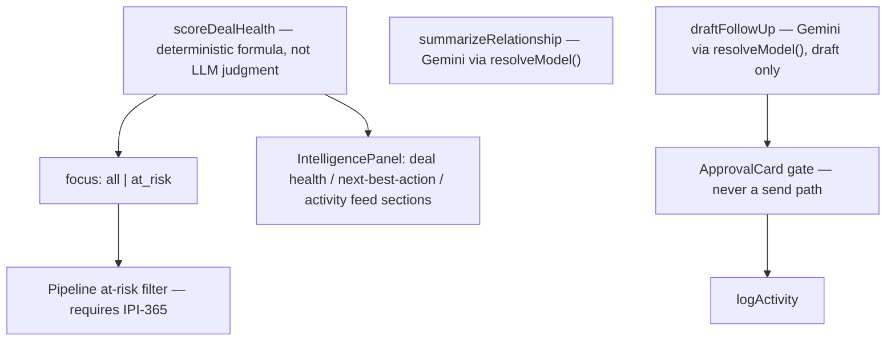

---

### Completion steps

#### A. Scope and setup

- [ ] **A1** Confirm IPI-368 merged — proof: `crm-assistant` responds in dev on `/app/crm/*`
- [ ] **A2** Confirm IPI-365 merged before Pipeline at-risk wiring (C1) — proof: board route exists

#### B. Implement

- [ ] **B1** `scoreDealHealth` as a pure, unit-testable formula — proof: unit test with no LLM call in the scoring path
- [ ] **B2** `summarizeRelationship`, `draftFollowUp` via `resolveModel()` — proof: code review, no raw Gemini client
- [ ] **B3** `draftFollowUp` output routed through existing `intel-approval-card`/`applyDraft` — proof: manual test
- [ ] **B4** IntelligencePanel sections in `panel-contract.ts`'s existing order (`context → approvals → tabs → evidence → activity`) — proof: screenshot

#### C. Integrate

- [ ] **C1** Pipeline board's "at risk" filter (IPI-365) wired to `scoreDealHealth(focus: at_risk)` — proof: manual test
- [ ] **C2** No tool loops per-deal to build a list — batched via `focus` param — proof: code review

#### D. Verify

- [ ] **D1** `cd app && npm test src/mastra` — proof: green
- [ ] **D2** `cd app && npx vitest run src/app/api/copilotkit` — proof: green

#### E. Ship

- [ ] **E1** Update `tasks/crm/todo.md` row #8 — proof: diff

---

### Gantt — IPI-369

```mermaid
gantt
  dateFormat YYYY-MM-DD
  section Build
  Wave-2 tools + panel :crit, b1, 2026-07-13, 2d
  section Verify
  Verify :crit, v1, after b1, 1d
  Done :milestone, m1, after v1, 0d
``` | Todo |  | Medium | 51b8b9e3-a396-4bcf-a531-ef8b1ea3dce7 | CRM — Relationship Layer | ai@socialmediaville.ca |  | AI, COPILOTKIT, CRM, GEMINI, MASTRA |  |  |  |  | 2026-07-04T07:01:38.298Z | 2026-07-07T18:07:14.610Z |  |  |  |  |  |  |  |  | 82d68607-87e5-4c4c-b0eb-1055e0e92c4c | CRM-M3 · crm-assistant Agent |  | 11f5d03b-dcf5-4d5b-aa01-4a83d5fdf978 | 6717 | IPI-395, IPI-368, IPI-379, IPI-378, IPI-375 |  |  |
| IPI-455 | iPix1 | Migrate Brand Intelligence to Cloudflare | **Priority:** P0 — Migration
**Depends on:** CF-000 (Platform Architecture), AGENT-001 (Agent Architecture), AGENT-002 (Shared Tool Registry), INFRA-001 (Deployment Pipeline), SEC-001 (AI Security)
**Architecture deps resolved:** Yes

Migrate `supabase/functions/brand-intelligence/` to Cloudflare Worker. This is the first real production workflow on Cloudflare.

**Scope:**

* Port handler.ts (666 lines) to Cloudflare Worker
* Replace npm:@google/genai with AI Gateway fetch via provider adapter
* Use Workers AI where possible
* Use Gemini only if Workers AI fails eval
* Route: [api.ipix.co/ai/brand-intelligence](<http://api.ipix.co/ai/brand-intelligence>)
* Wire through shared tool registry (AGENT-002) for crawl tools
* Deploy via INFRA-001 pipeline

**Verification:** Same brand URL → same structured profile output. Compare before/after. | Backlog |  | Urgent | a91ff388-772a-4b0a-b252-0068d6a1297c | AI Platform — LLM Providers | ai@socialmediaville.ca |  | AI, CLOUDFLARE, MASTRA, SUPA |  |  |  |  | 2026-07-07T20:16:14.819Z | 2026-07-07T22:11:38.542Z |  |  |  |  |  | 2026-07-08T20:16:15.401Z |  | IPIX-INIT-001 — Operator Platform (Q3 2026) |  |  | Breached | 20579dc8-24c1-4903-9d13-3ec13e270235 | 1812 | IPI-469, IPI-461 |  |  |
| IPI-172 | iPix1 | GEMINI-009 · Grounding metadata persistence (ai_agent_logs) | ## GEMINI-009 — Grounding metadata persistence (ai_agent_logs)

**Phase:** **Core (MVP)** — elevated 2026-06-30 Gemini + Mastra audit sync

**In plain terms:** Store `groundingMetadata` + `urlContextMetadata` from Gemini responses in `ai_agent_logs` so **EvidenceBlock** can render `evidence[]`, source links, and confidence — not just scores.

**Blocks EvidenceBlock screen wire (component Done on IPI-246):**

| Screen | Linear |
| -- | -- |
| Brand Detail | IPI-271 |
| Assets | IPI-248 |
| Campaigns | IPI-249 |
| Matching | IPI-250 |
| Channel Preview | IPI-269 |

**Do NOT reopen IPI-246** — component ships; this issue supplies the **payload contract**.

---

### Blocked by / Blocks (Linear)

| Type | Issues |
| -- | -- |
| **Blocked by** | IPI-167 (parser + schema extensions) · IPI-106 (logging — partial ✅) |
| **Blocks** | IPI-271 · IPI-248 · IPI-249 · IPI-250 · IPI-269 |

**Related:** IPI-246 · IPI-167 · IPI-154 · IPI-155

**Shipped upstream:** BI edge uses googleSearch + urlContext (IPI2-174) — metadata not yet persisted to UI.

---

### EvidenceBlock payload contract (required fields)

Every persisted grounding payload MUST include:

- [ ] `evidenceSchemaVersion` — semver string (e.g. `1.0.0`) for forward-compatible parsing
- [ ] `workflowId` — Mastra workflow id or edge fn name when applicable
- [ ] `agentId` — Mastra agent registry key (matches route-agent-map)
- [ ] `modelId` — resolved registry constant (never hardcoded in payload builder)
- [ ] `confidence` — 0–1 float or tier enum mapped to EvidenceBlock badge
- [ ] `citations[]` — `{ url, title?, snippet? }` from groundingMetadata / urlContextMetadata
- [ ] `timestamp` — ISO8601 UTC of inference
- [ ] `evidence[]` — pillar breakdown compatible with IPI-246 props
- [ ] **Backward compatibility** — readers accept rows missing new fields (graceful degrade)

---

### Acceptance criteria

- [ ] JSONB metadata shape documented for `groundingMetadata` + `urlContextMetadata`
- [ ] `insertAgentLog` accepts full EvidenceBlock payload contract above
- [ ] Brand Detail / Assets / Campaigns can map log payload → EvidenceBlock `evidence[]` props
- [ ] **Mastra:** workflow suspend payloads include typed `evidence[]` / confidence fields
- [ ] Source URLs render in operator UI (not lost after edge response)
- [ ] `npm run supabase:verify-brand-intelligence` still green

### Verification checklist

- [ ] Unit tests — payload mapper + backward-compat fixtures
- [ ] Integration — sample `ai_agent_logs` row after BI run contains full contract
- [ ] `infisical run -- npm run supabase:verify-brand-intelligence` green
- [ ] `infisical run -- npm run supabase:verify-rls` green (if schema touched)
- [ ] `cd app && npm test src/mastra` green
- [ ] Browser MCP — Brand Detail smoke: EvidenceBlock renders `evidence[]` from log
- [ ] Documentation updated — AI-EXPLAINABILITY.md payload contract
- [ ] Types regenerated if JSONB columns extended | Backlog | 2 | Urgent | 73be1075-d57b-46ce-bdbe-563b896796af | AI Platform — Agents | ai@socialmediaville.ca |  | AI, GEMINI, MASTRA |  |  |  |  | 2026-06-25T07:59:34.420Z | 2026-07-04T06:56:00.097Z |  |  |  |  |  | 2026-07-01T12:12:54.889Z |  | IPIX-INIT-001 — Operator Platform (Q3 2026) | ca3e82a3-edd5-42d9-9001-387c7d786e3d | AGT-M1 · Runtime Foundation | Breached | 344db2ab-1f61-4700-93a9-61fa4c0de311 | 14315 | IPI-271, IPI-269, IPI-246, IPI-81, IPI-167, IPI-106, IPI-244, IPI-262, IPI-261, IPI-107, IPI-263, IPI-282, IPI-160, IPI-152, IPI2-122, IPI-165 |  |  |
| IPI-475 | iPix1 | AI-CHAT-001 · Global Context-Aware AI Chat Context Engine | ## AI-CHAT-001 — Global Context-Aware AI Chat Context Engine

**Priority:** P2 · **Type:** Shared AI Infrastructure · **Complexity:** XL (cross-cutting refactor, not greenfield)

**This is not CRM-specific.** Today's chat dock heading logic already spans Brand/Shoot/CRM, but not uniformly — see Current State below. The goal is ONE reusable engine every entity/module calls into, replacing three overlapping, disconnected systems that exist today.

**⚠️ DC design files unavailable for this pass:** `Universal-design-prompt-new/` (all `.dc.html` sources) is no longer present in the repo checkout at spec-writing time — confirmed absent from both the main checkout and the authoring worktree. This ticket is grounded entirely in **live code** (cited file:line below), which is the substantive part for an infrastructure ticket. **Before implementation starts:** locate/restore the DC files and spot-check the chat-dock visual pattern on Brand Detail, Shoot Detail, and one Contact/Company Detail screen against what's built here.

---

## Current State (verified 2026-07-08 — read before estimating, this is not a greenfield build)

Three separate, non-communicating systems already exist:

| # | System | File | What it does | Gap |
| -- | -- | -- | -- | -- |
| 1 | Dock **heading** text | `src/lib/intelligence/use-route-welcome.ts` | Static `if/else` waterfall keyed on `normalizeRoutePath(pathname)`. Brand/shoot branches *can* interpolate a name via an optional `context` param; CRM branches (lines ~189-206) are 100% hardcoded literals (e.g. `"Contact record — log touchpoints and link to companies"`) and ignore `context` entirely. | Route-**type** aware, never entity-**instance** aware for CRM. Only `brandName` is actually wired through today. |
| 2 | Agent **context** (backend) | `src/components/crm/crm-record-context.tsx` | Resolves `companyId`/`contactId`/`dealId` from the pathname, pushes them into the Mastra agent via CopilotKit's `useAgentContext` (4 calls). Mounted once in `src/app/(operator)/app/crm/layout.tsx:6`. `crm-assistant-agent.ts` instructions explicitly rely on this. | Works today, but CRM-only, id-only (no name/status), and invisible to the dock UI — doesn't touch the heading or composer placeholder. |
| 3 | Panel **context** (UI) | `src/context/active-brand-context.tsx` + `src/context/intelligence-detail-context.tsx` | `ActiveBrandContext` holds an id only; `IntelligencePanel` re-resolves the name/status by looking the id up in an already-fetched list. `IntelligenceDetailContext` is a generic `ReactNode` override escape hatch, unused by any CRM page today. | Brand-only pattern; not entity-generic; doesn't touch the dock. |
| 4 | Composer **placeholder** | `operator-chat-dock.tsx` → CopilotKit's `<CopilotChat>` | Never configured — `"Type a message..."` is CopilotKit's own library default (`chatInputPlaceholder` prop is never set). | 100% unpersonalized everywhere, on every route, today. |

**Net effect:** an operator gets a route-*type*-aware heading (sometimes), a totally generic input placeholder (always), and the agent silently already knows the CRM entity id (but not weaved into anything the user sees). This ticket's job is to collapse 1–4 into one call site per page.

---

## Objective

Replace the unpersonalized chat composer + fragmented heading logic with one hook a page calls once:

```ts
useChatContext({
  entityType,     // registry key, e.g. 'crm-contact' | 'brand' | 'shoot'
  entityId,
  entityName,
  entityStatus,
  breadcrumbs,
})
```

The engine derives, from a per-`entityType` registry entry:

* Composer placeholder ("Ask about {entityName}…")
* Dock heading / conversation title
* Suggested prompts (2–4 per entity kind)
* Context chips (for `IntelligencePanel`, optional consumer)
* Breadcrumb rendering
* Agent context registration — **wraps** the existing `useAgentContext` mechanism, doesn't replace CopilotKit's own hook

Pages own zero placeholder/prompt/heading logic. One registry entry per entity kind; the engine itself never changes when a new entity kind is added.

---

## MVP scope vs. Phase 2 (grounded in the pages that actually exist today)

The request's full scope list includes several pages that **do not exist yet** in `app/src/app/(operator)/app/` (verified inventory below). Building registry entries for pages with no route is speculative — same discipline already applied when Profile360 was scoped down in [IPI-392](https://linear.app/amo100/issue/IPI-392/rf-04b-contact-detail-profile360-extract) (see that PR's Linear comment). Split accordingly:

### MVP — real pages today (build + migrate these)

| Module | Pages | entityType |
| -- | -- | -- |
| CRM | Companies List, **Company Detail**, Contacts List, **Contact Detail** | `crm-company`, `crm-contact` |
| Brand | Brand List, **Brand Detail** | `brand` |
| Shoot | Shoots List, **Shoot Detail**, Shoot Wizard (new) | `shoot` |
| Command Center | `app/page.tsx` | generic/no-entity fallback (route-type heading only, same as today) |

### Phase 2 — pages don't exist yet, or exist as stubs with no real entity data

| Module | Status today |
| -- | -- |
| CRM Pipeline / Deal Detail | `crm/pipeline/page.tsx` + `[id]/page.tsx` exist as **files** but render `CrmScreenGate` stubs ([IPI-395](https://linear.app/amo100/issue/IPI-395/scr-30-crm-pipeline-react-parity)/396, in progress separately) — no entity to pass yet |
| Campaigns Detail | Only `campaigns/page.tsx` (list) exists |
| Assets Detail / Channel Preview | Only `assets/page.tsx` (list) exists |
| Booking Detail/Wizard, Talent Profile/Availability/Role Dashboard | No pages exist — separate "Model Booking MVP" Linear project, in progress |
| Analytics Dashboard/Campaign Analytics | No pages exist |
| Profile360 (full `EntityConfig` engine), Event Management, Notifications | Aspirational — wire in as each ships, per this ticket's own registry pattern (zero core-engine changes needed) |

**Acceptance criteria below are written against the MVP set only.** Phase 2 rows get a registry entry the day their page ships — that's the whole point of the registry pattern (see diagram 7).

---

## Proposed architecture

### 1 — Overall architecture

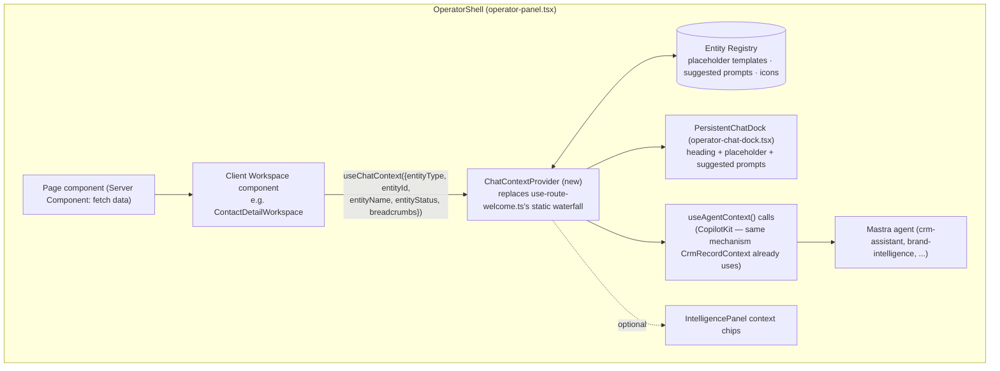

### 2 — Context resolution flow

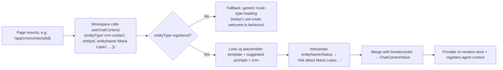

### 3 — AI request lifecycle

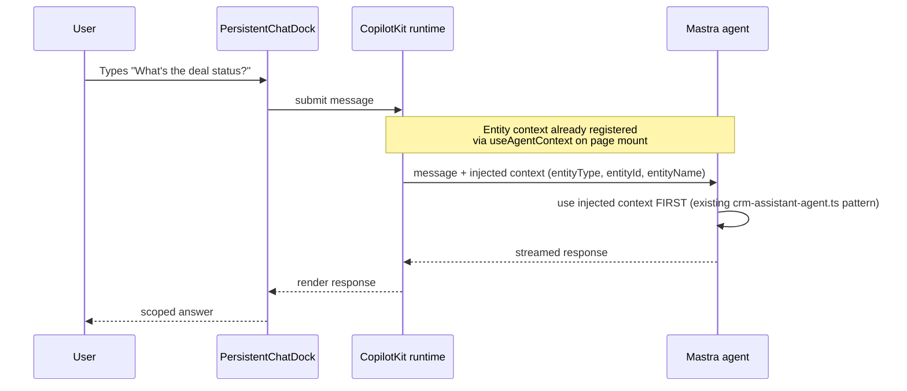

### 4 — User journey

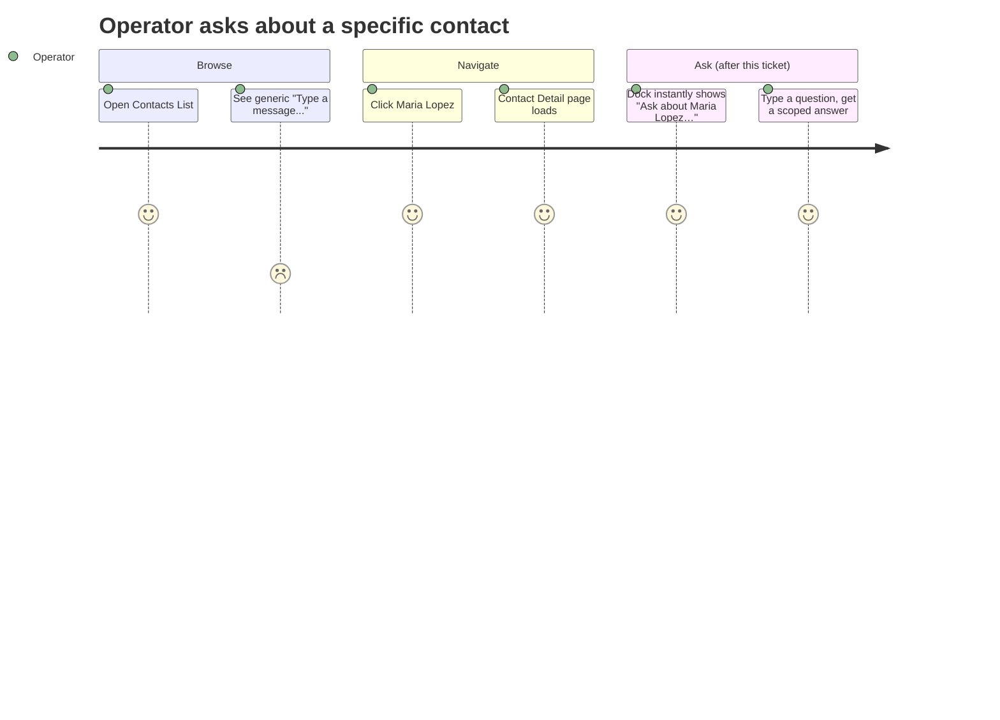

### 5 — Component hierarchy

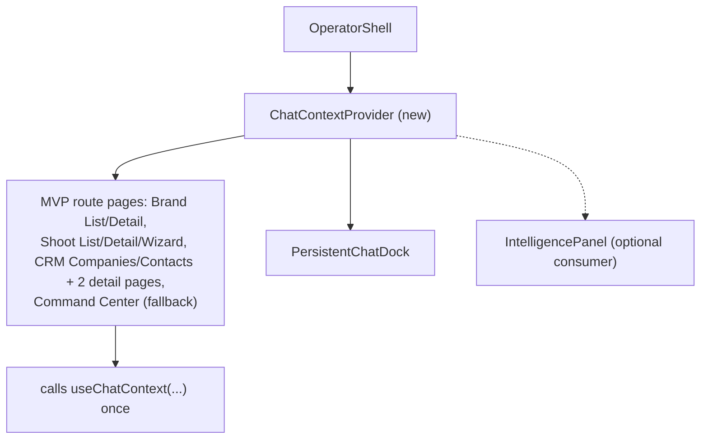

### 6 — Data flow

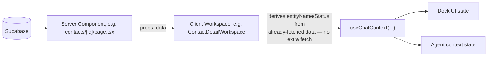

### 7 — Entity registration flow (onboarding a future entity kind)

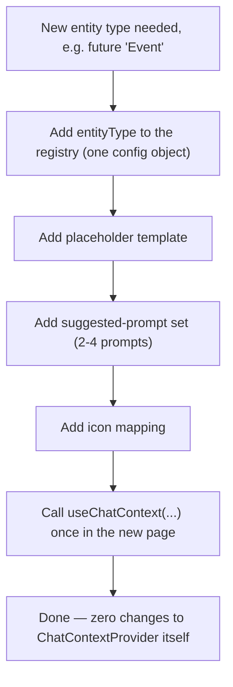

---

## Deliverables

- [ ] `ChatContextProvider` + `useChatContext` hook (`src/context/chat-context.tsx` or `src/lib/intelligence/chat-context/`)
- [ ] Entity registry (placeholder templates, suggested prompts, icon mapping) — one config object per MVP entityType
- [ ] Migration: `use-route-welcome.ts`'s CRM branches replaced by registry lookups (brand/shoot branches migrate too, once-only interpolation logic subsumed)
- [ ] Migration: `CrmRecordContext` generalized into the new engine's agent-context registration (CRM keeps working identically — same ids reach the same agent)
- [ ] `operator-chat-dock.tsx` wired to consume `chatInputPlaceholder` from context (currently unset)
- [ ] Suggested-prompts UI in the dock (net-new UI, doesn't exist today)
- [ ] Optional: `IntelligencePanel` context-chip consumer (stretch, not required for MVP acceptance)
- [ ] Tests: registry resolution, fallback-to-generic behavior, each MVP entityType's placeholder/prompt output, agent-context registration parity with today's `CrmRecordContext` behavior
- [ ] Migration plan doc (this ticket's own "Migration plan" section below, executed)

## Acceptance criteria (MVP set only)

| # | Criterion | Proof |
| -- | -- | -- |
| 1 | Visiting Contact/Company Detail, Brand Detail, or Shoot Detail shows a personalized composer placeholder ("Ask about {name}…") | Browser: navigate each, inspect placeholder text |
| 2 | Removing a page's `useChatContext()` call falls back to today's generic route-type heading, never a blank/broken dock | Unit test: unregistered entityType → fallback path |
| 3 | CRM agent still receives `companyId`/`contactId`/`dealId` exactly as it does today (no regression) | Unit test diffing before/after `useAgentContext` calls |
| 4 | Adding a new MVP-list entityType requires zero edits to `ChatContextProvider` itself — only a new registry entry | Code review: diff for e.g. re-adding `shoot` is registry-only |
| 5 | Suggested prompts render per entity kind, are clickable, and populate the composer | Browser: click a suggested prompt, composer fills |
| 6 | No page-specific placeholder/prompt logic remains outside the registry | grep for hardcoded "Ask about" / dock heading strings outside the registry file |

## Accessibility requirements

* Suggested-prompt buttons: real `<button>`s with accessible names, not `<div onClick>`
* Placeholder text changes must not steal focus or announce via `aria-live` on every keystroke — only on entity change (page navigation)
* Context chips (if built): text-labeled, never color-only (matches `docs/crm/PROFILE-360-template.md §8`'s existing "text, not color alone" rule for chips elsewhere in this codebase)

## Testing strategy

* Unit: registry resolution (known entityType → correct placeholder/prompts), unknown entityType → fallback, agent-context call parity vs. today's `CrmRecordContext` behavior (regression guard)
* Integration: one test per MVP page type asserting the composer placeholder text and at least one suggested prompt
* Browser (manual/preview): the 5 MVP detail pages + Command Center fallback, no console errors, no regression to existing CRM agent behavior

## Migration plan

1. Build `ChatContextProvider`/`useChatContext` + registry, additive only — no existing behavior removed yet.
2. Wire `operator-chat-dock.tsx` to read placeholder/prompts from the new context (falls back to current static behavior when absent — zero-risk rollout).
3. Migrate Brand Detail (already has a real `name` in scope via `ActiveBrandContext` — lowest-risk first migration).
4. Migrate Shoot Detail.
5. Migrate CRM Company/Contact Detail — this is where `CrmRecordContext`'s existing agent-context calls get absorbed into the new engine (verify parity via the regression test in AC #3 before removing the old component).
6. Delete now-dead CRM branches from `use-route-welcome.ts`; keep the file for any remaining non-entity generic routes (or fully retire it if none remain).
7. Confirm `route-briefing.ts` (`src/components/intelligence-panel/route-briefing.ts`) is genuinely dead code (no callers found in this session's research) — remove in the same pass or flag separately, don't let it linger as a second, now-triply-redundant system.

## Files likely to modify / create

* New: `src/context/chat-context.tsx` (or under `src/lib/intelligence/`), entity registry file, tests
* Modify: `src/components/operator-panel/operator-chat-dock.tsx`, `src/components/operator-panel/operator-panel.tsx`, `src/lib/intelligence/use-route-welcome.ts`, `src/components/crm/crm-record-context.tsx` (likely deleted, absorbed), `src/context/active-brand-context.tsx` (possibly wraps/composes into new context)
* Consumers to update: `crm/companies/[id]/page.tsx`, `crm/contacts/[id]/page.tsx`, `brand/[id]/page.tsx`, `shoots/[shootId]/page.tsx`, `shoots/new/page.tsx`

## Verification

```bash
cd app
npm run typecheck && npm run lint && npm test
CI=true npm run build
```

Browser proof: composer placeholder personalizes on all 5 MVP detail pages · fallback works on Command Center · CRM agent context regression test passes · no console errors.

## Success criteria (from original request)

* One reusable implementation, zero page-specific placeholder logic, no duplicated code, easily extensible (new entity = registry entry, not new logic), matches existing design system, KISS — no `EntityConfig`/`TabConfig`-style over-engineering for entity kinds with no real page yet (same restraint already applied in [IPI-392](https://linear.app/amo100/issue/IPI-392/rf-04b-contact-detail-profile360-extract)'s Profile360 scoping).

## Skills

`mastra` · `copilotkit` (if available) · `nextjs-developer` · `task-verifier` (pre-implementation gate) · `mermaid-diagrams` (this doc's diagrams) | Backlog | 8 | High | 73be1075-d57b-46ce-bdbe-563b896796af | AI Platform — Agents | ai@socialmediaville.ca |  | AI, COPILOTKIT, FRONTEND, INFRA, MASTRA |  |  |  |  | 2026-07-08T20:25:51.559Z | 2026-07-08T20:27:03.203Z |  |  |  |  |  | 2026-07-15T20:25:52.872Z |  | IPIX-INIT-001 — Operator Platform (Q3 2026) |  |  | MediumRisk | 5960dede-4729-4750-8d60-fdbbc83d4be6 | 362 | IPI-395, IPI-392 |  |  |
| IPI-470 | iPix1 | AGENT-004 — Cloudflare Workflows & Orchestration | **Priority:** P1 · **Type:** Architecture · **Estimate:** M

Decide how to orchestrate long-running iPix workflows. Compare Mastra workflows, Cloudflare Workflows, Queues, Durable Objects, and Supabase jobs.

**Workflows to design:**

* Brand Analysis (crawl → analyze → score → approve)
* CRM enrichment (import → match → enrich → store)
* Shoot workflow (brief → plan → shoot → deliver → review)
* Booking workflow (request → quote → approve → confirm)
* Notifications (event → route → deliver → read)
* Publishing (content → review → schedule → publish)
* Asset review (upload → analyze → score → approve)

**Acceptance criteria:**

* Choose MVP orchestration approach
* Identify which workflows need queues (async fan-out)
* Identify which workflows need Durable Objects (stateful coordination)
* Identify which workflows can stay in Supabase/Next.js
* Avoid Cloudflare Workflows unless they reduce complexity over Mastra | Backlog |  | High | a91ff388-772a-4b0a-b252-0068d6a1297c | AI Platform — LLM Providers | ai@socialmediaville.ca |  | AI, CLOUDFLARE, MASTRA |  |  |  |  | 2026-07-07T21:56:13.252Z | 2026-07-07T22:21:38.284Z |  |  |  |  |  | 2026-07-14T21:56:14.252Z |  | IPIX-INIT-001 — Operator Platform (Q3 2026) |  |  | MediumRisk | 65c28eec-9ded-4b46-8ec9-c040352c1b34 | 1712 | IPI-467, IPI-465, IPI-466 |  |  |
| IPI-311 | iPix1 | MODEL-P4 — Booking Wizard, Booking Agent, and Request Flow | **Bundles implementation tasks:** `MODEL-017`–`MODEL-020` from `06-model-booking-implementation-plan.md` Phase 4.

## Context

Lets a brand send a booking request in under 60 seconds. No shared `WizardStep` component exists (verified — Shoot Wizard itself inlines its own step-progress in an 824-line page.tsx) — this wizard gets a booking-local step-progress bar, not an import.

## Scope

* Booking Wizard route (standalone, no 3-panel shell — same convention as Shoot Wizard): dates + shoot link → rate → message → review → send
* Booking Agent (`booking`) registered — drafts only, **never confirms** (confirm is human-only, Phase 5)
* `checkTalentAvailability`/`draftBookingQuote`/`createBookingDraft` tools
* Quote/counter flow (API PATCH — only allows `requested→quoted` / `requested→declined`, confirm is a separate route entirely)
* Booking notification events wired on create/quote

## Out of scope

Any path that sets `status='confirmed'` from this phase's routes (reserved for the approve route only, Phase 5). Payment/deposit fields.

## Implementation steps

1. Booking tools (`checkTalentAvailability` etc.) — note in code that the availability check here is UX-level early feedback, not the DB-level safety net (that's the `EXCLUDE` constraint from `MODEL-P1`).
2. Register Booking Agent.
3. Booking Wizard UI (4 steps + booking-local step-progress).
4. API routes: create + read/quote booking.

## Files likely touched

`app/src/app/(operator)/app/matching/talent/[id]/book/page.tsx`, `app/src/components/booking/booking-wizard-context.tsx`, `app/src/mastra/agents/booking-agent.ts`, `app/src/mastra/tools/booking-tools.ts`, `app/src/app/api/bookings/route.ts`, `app/src/app/api/bookings/[id]/route.ts`.

## Required skills

`mastra`, `copilotkit`, `ipix-supabase`.

## Dependencies

Blocked by `MODEL-P1` (schema) and `MODEL-P3` (needs a talent profile to book from).

## User journey impact

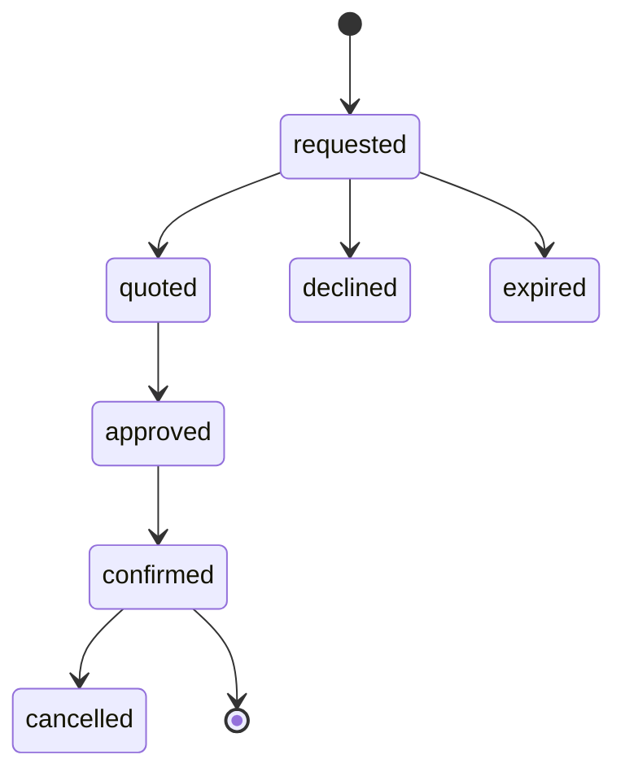

## Wireframe reference

`04-model-booking-wireframes.wire` (`booking-wizard` block). Design prompt: `tasks/models/design/11c-model-booking-wizard-detail.md`.

## Tests

```bash
cd app && npm run lint
cd app && npm run typecheck
cd app && npm test
```

Plus: assert a PATCH attempting `status='confirmed'` directly is rejected (400) — this route boundary is what keeps confirm human-only.

## Success criteria

* User can send a booking request end-to-end.
* Talent/agency can quote or decline.
* `booking_status_history` records every change.
* Booking events create notifications (wired from `MODEL-P1`'s table + `MODEL-P6`'s panel).

## Risk level

**Medium** — first booking-write path; confirm no client code can set `status` to anything but `requested` at creation, and that the PATCH route's transition allowlist is enforced server-side, not just hidden in the UI.

## Related docs

`06-model-booking-implementation-plan.md` Phase 4. | Backlog |  | High | 9f12c38f-b20d-492a-ba5b-dd886e8fafef | Model Booking MVP | ai@socialmediaville.ca |  | AI, COPILOTKIT, MASTRA, MODEL, phase:mvp, SUPA |  |  |  |  | 2026-07-01T17:41:26.069Z | 2026-07-06T09:37:17.796Z |  |  |  |  |  | 2026-07-08T17:41:27.523Z |  | IPIX-INIT-001 — Operator Platform (Q3 2026) | c39cab39-988b-4acc-a1e0-8e65ff7b5919 | M5 · Launch | Breached | 7510bc93-02d7-48a8-993c-515b5a6f3345 | 6957 | IPI-312, IPI-347, IPI-307, IPI-410, IPI-397 | IPI-309 |  |
| IPI-309 | iPix1 | MODEL-P3 — Talent Profile Detail and URL-Context Profile Creation | **Bundles implementation tasks:** `MODEL-014`–`MODEL-016e` from `06-model-booking-implementation-plan.md` Phase 3.

## Context

Talent Profile Detail is the "is this the right model?" screen; URL-Context Profile Creation mirrors the existing Brand Onboarding crawl→HITL-review pattern almost directly — this is proven machinery (`discoverSocialChannelsTool`), not new AI infrastructure.

## Scope

* Talent Profile Detail route: Portfolio (reuses `AssetCard`/Cloudinary pipeline), Details, Availability (read-only calendar), Reviews (**empty-state only** — no `talent_reviews` table in MVP)
* URL-Context profile onboarding: choose type → name/location → paste links (Instagram/Website/TikTok/Portfolio/Agency) → AI extraction → **AI Profile Review** (the HITL gate)
* `talent_profile_sources` — source URL + confidence per AI-filled field
* Per-field Approve/Edit/Reject — **nothing saves silently**; `[Approve all]` still shows every field before save
* Availability Editor (edit view, shares the calendar component with the read-only view via a `readOnly` prop, not a fork)

## Out of scope

Advanced portfolio AI (pose/style/luxury detection), populated reviews UI, contract/licensing fields.

## Implementation steps

1. `analyzeTalentUrls`/`draftTalentProfile`/`extractPortfolioTags` tools (mirrors `social-discovery.ts`'s shape).
2. Add tools to Model Match Agent (no new agent).
3. Profile Editor + AI Profile Review screens.
4. Portfolio Upload (reuses existing Cloudinary widget).
5. Talent Profile Detail screen + Availability Editor.

## Files likely touched

`app/src/app/(operator)/app/matching/talent/[id]/page.tsx`, `app/src/app/(operator)/app/talent/profile/page.tsx`, `app/src/components/talent/{talent-profile-detail,profile-editor,ai-profile-review,portfolio-upload,availability-calendar,availability-editor}.tsx`, `app/src/mastra/tools/talent-profile-tools.ts`.

## Required skills

`mastra`, `gemini`, `cloudinary`, `ipix-supabase`, `ipix-wireframe`.

## Dependencies

Blocked by `MODEL-P1` (`talent_profiles`, `talent_profile_sources`, `talent_availability`).

## User journey impact

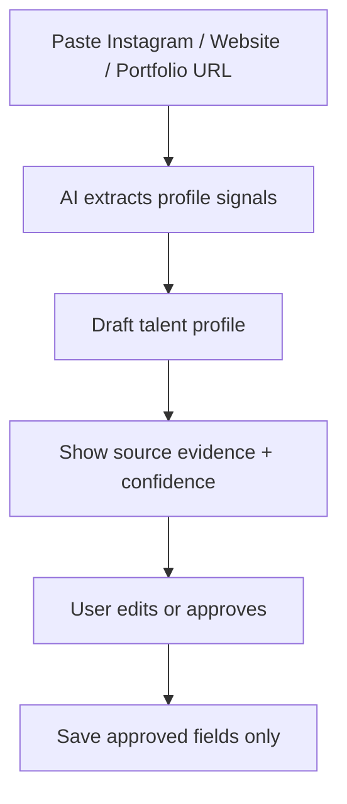

## Wireframe reference

`04-model-booking-wireframes.wire` (`talent-profile-detail`, `url-context-profile-creation`, `availability-editor` blocks). Design prompts: `tasks/models/design/11b-model-booking-profile.md`, `11f-profile-url-context-onboarding.md`.

## Tests

```bash
cd app && npm run typecheck
cd app && npm test
```

## Success criteria

* Profile fields are never saved silently.
* Every AI-filled field shows confidence and source together.
* Inaccessible URLs fall back to manual profile creation, never a dead end.
* Booked calendar cells are never directly editable (only cancel-the-booking frees a date).

## Risk level

**Medium** — the "never save silently" and "booked cells aren't directly editable" rules are correctness guards; test the negative cases explicitly.

## Related docs

`06-model-booking-implementation-plan.md` Phase 3, Blockers #1–#3 (booking-local component naming) · `tasks/models/notes-1.md` (URL-Context spec origin). | Backlog |  | High | 9f12c38f-b20d-492a-ba5b-dd886e8fafef | Model Booking MVP | ai@socialmediaville.ca |  | AI, COPILOTKIT, DESIGN, GEMINI, MASTRA, MODEL, phase:mvp, SUPA |  |  |  |  | 2026-07-01T17:40:51.084Z | 2026-07-04T06:55:52.734Z |  |  |  |  |  | 2026-07-08T17:40:51.862Z |  | IPIX-INIT-001 — Operator Platform (Q3 2026) | c39cab39-988b-4acc-a1e0-8e65ff7b5919 | M5 · Launch | Breached | 9a22293f-a769-4c8b-a538-84cc73aee38d | 6958 | IPI-347, IPI-307, IPI-344 |  |  |
| IPI-261 | iPix1 | DESIGN-077 · Creative Director Agent — Asset Intelligence Wiring | ## Overview

Wire **creative-director** agent on `/app/assets` — DNA advice, asset review, retake suggestions.

**Tracker:** DESIGN-077 · AGENT-MAP: `/app/assets` → creative-director

**Route parity:** [IPI-247](https://linear.app/amo100/issue/IPI-247) ✅ Done · PR #147

**Coordinate with:** [IPI-156](https://linear.app/amo100/issue/IPI-156) CAMP-001 (campaign-side tools — separate scope)

---

## Acceptance criteria

- [X] Route resolves creative-director via IPI-247 ✅
- [ ] Tools: explain DNA, suggest retake, bulk approve (HITL gated)
- [ ] Panel + dock context include selected assets
- [ ] EvidenceBlock integration (IPI-246 component Done; payload via [IPI-172](https://linear.app/amo100/issue/IPI-172))
- [ ] Tools work in dock before full masonry ([IPI-248](https://linear.app/amo100/issue/IPI-248) — soft)

---

### Gemini / structured output AC

- [ ] Agent tools use Zod schemas + structured tool results via Mastra
- [ ] No hardcoded model IDs — use `resolveGeminiModel()` / registry constants
- [ ] Tool outputs compatible with EvidenceBlock fields ([IPI-172](https://linear.app/amo100/issue/IPI-172) contract)
- [ ] `thinkingBudget: 0` on Mastra agent calls
- [ ] No Interactions API — `generateContent` / `generateObject` only through MVP

---

## Execution

**Hard blocked by:** none (route map shipped)

**Not blocked by IPI-268** — assets path does not require campaigns schema.

**Route:** `/app/assets` only

**SSOT:** AGENT-MAP · MASTER-DEPENDENCIES

---

# Implementation Prompt Pack (2026-06-30)

**Worktree:** `ipi/261-creative-director-assets` · `../wt-ipi-261-creative-director-assets`
**Skills:** mastra · gemini · copilotkit · cloudinary · task-verifier
**Design ref:** `Assets.v2.image-first.dc.html` · `AssetCard.dc.html` · `EvidenceBlock.dc.html`

## User stories

* As a **creative director**, I ask the agent to explain DNA scores and suggest retakes for selected assets.
* As an **operator**, bulk-selection context flows to the agent without re-stating IDs.

## Tool sequence

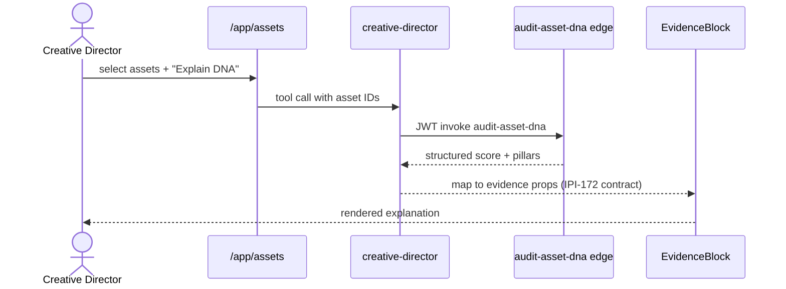

## Implementation steps (Test block each)

| Step | Prompt | Test / proof |
| -- | -- | -- |
| **A** | Add `explainDnaTool` wrapping edge fn (not new edge) | mastra test |
| **B** | Add `suggestRetakeTool` + `bulkApproveDraftTool` (HITL gated) | no persist without approval |
| **C** | Wire `useAgentContext` selected asset IDs | multi-select updates context |
| **D** | Structured outputs compatible with IPI-172 fields | schema test |
| **E** | Coordinate IPI-248 UI — tools work in dock before full masonry | manual smoke |

## Verification

```bash
cd app && npm test src/mastra
infisical run -- npm run supabase:verify-dna
``` | Backlog |  | High | 1adb08a8-6c36-4bc9-8b47-2c9ffb827a89 | DESIGN V2 — Operator React Parity | ai@socialmediaville.ca | ai@socialmediaville.ca | AI, COPILOTKIT, DESIGNV2, GEMINI, MASTRA |  |  |  |  | 2026-06-30T06:24:22.044Z | 2026-07-04T06:55:56.531Z |  |  |  |  |  | 2026-07-07T12:16:17.282Z | IPI-254 | IPIX-INIT-001 — Operator Platform (Q3 2026) | 564f6a39-e763-4067-aed2-0926e33c3d3e | DV2-M1 · Shared Spine | Breached | 5eae6d73-fa3a-44d3-a5dc-c07599852046 | 7053 | IPI-172, IPI-259, IPI-248, IPI-246, IPI-247, IPI-23, IPI-197, IPI-152, IPI-268, IPI-156 |  |  |
| IPI-265 | iPix1 | ASSET-UX-001 · Asset Upload, Bulk Selection & Drag Workflow | ## ASSET-UX-001 — Asset Upload, Bulk Selection & Drag Workflow

**In plain terms:** React port of Assets upload + bulk selection workflow from Claude Design DC prototype.

**Design status:** ✅ Complete in DC
**Code status:** `/app/assets` is SectionPlaceholder. IPI-246 EvidenceBlock component ✅ (PR #148).

---

## Blocks / Blocked by

| Type | Issue |
| -- | -- |
| **Hard blocked by** | [IPI-257](https://linear.app/amo100/issue/IPI-257) **074a+** signed upload API (074b PR #154 in flight — In Progress) |
| **Soft** | [IPI-248](https://linear.app/amo100/issue/IPI-248) full workspace umbrella · [IPI-172](https://linear.app/amo100/issue/IPI-172) EvidenceBlock payload |
| **Related** | [IPI-152](https://linear.app/amo100/issue/IPI-152) DNA agent · [IPI-154](https://linear.app/amo100/issue/IPI-154) compliance |

**Cannot ship upload flow until IPI-257 074a (signed upload) lands** — not the full 074a–f epic.

---

### Acceptance

- [ ] Upload modal with per-file progress (upload → tag → DNA → ready)
- [ ] D-DS5 selection: multi-select, bulk bar, drag-to-shoot/campaign dock
- [ ] EvidenceBlock wired on selected asset — **payload via IPI-172**, component via IPI-246 ✅
- [ ] Rights/usage/release metadata (D-AS3)
- [ ] Mobile bulk bar ≤1024px ([IPI-264](https://linear.app/amo100/issue/IPI-264))
- [ ] HITL: no silent DNA writes

### Verification checklist

- [ ] Blocked until `POST /api/assets/upload-sign` exists (IPI-257 074a)
- [ ] `cd app && npm test` — upload + selection tests
- [ ] Browser: upload → progress → EvidenceBlock explain
- [ ] `cd app && npm run build` green | Backlog |  | High | 73be1075-d57b-46ce-bdbe-563b896796af | AI Platform — Agents | ai@socialmediaville.ca |  | AI, COPILOTKIT, DESIGN, GEMINI, MASTRA, SUPA, UX |  |  |  |  | 2026-06-30T06:32:04.361Z | 2026-07-04T06:55:55.549Z |  |  |  |  |  | 2026-07-07T06:32:06.539Z |  | IPIX-INIT-001 — Operator Platform (Q3 2026) | 57838497-c1a1-43e0-8c70-1ed3394e0ae9 | AGT-M2 · Operator Shell | Breached | d76107da-d8de-4a69-95cf-864f3271160d | 6932 | IPI-246, IPI-264, IPI-248, IPI-154, IPI-152, IPI-257 |  |  |
| IPI-263 | iPix1 | DESIGN-079 · Social Discovery Agent — Creator Matching Wiring | ## Overview

Wire **social-discovery** agent on `/app/matching` — creator fit, invite copy, platform alignment.

**Tracker:** DESIGN-079 · Handoff §9 · AGENT-MAP

**Route parity:** [IPI-247](https://linear.app/amo100/issue/IPI-247) ✅ Done · PR #147

**Disk verified (2026-06-30):** No `creators` / `shortlists` / `invites` tables on disk — **hard blocked by IPI-268** until schema lands.

---

## Acceptance criteria

- [X] Route resolves social-discovery via IPI-247 ✅
- [ ] Tools: explain fit score, draft invite, compare creators
- [ ] Context: campaign + creator selection from Supabase (post IPI-268)
- [ ] EvidenceBlock on fit scores (IPI-246 component Done; payload via [IPI-172](https://linear.app/amo100/issue/IPI-172))
- [ ] Requires matching schema ([IPI-268](https://linear.app/amo100/issue/IPI-268)) for live data

---

### Gemini / structured output AC

- [ ] Agent tools use Zod schemas + structured tool results via Mastra
- [ ] No hardcoded model IDs — use `resolveGeminiModel()` / registry constants
- [ ] Tool outputs compatible with EvidenceBlock fields ([IPI-172](https://linear.app/amo100/issue/IPI-172) contract)
- [ ] `thinkingBudget: 0` on Mastra agent calls
- [ ] No Interactions API — `generateContent` / `generateObject` only through MVP

---

## Execution

**Hard blocked by:** [IPI-268](https://linear.app/amo100/issue/IPI-268) · SUPA-DV2-001 (no matching tables on disk)

**Soft:** [IPI-250](https://linear.app/amo100/issue/IPI-250) · [IPI-172](https://linear.app/amo100/issue/IPI-172)

**Coordinate:** [IPI-160](https://linear.app/amo100/issue/IPI-160) partner/venue — **no scope overlap**

**SSOT:** MASTER-DEPENDENCIES

---

# Implementation Prompt Pack (2026-06-30)

**Worktree:** `ipi/263-social-discovery-matching` · `../wt-ipi-263-social-discovery-matching`
**Skills:** mastra · gemini · copilotkit · task-verifier
**Design ref:** `Matching.v2.image-first.dc.html`

## User stories

* As a **brand manager**, social-discovery explains creator fit scores and drafts invite copy.
* As an **operator**, I compare two creators with evidence-backed rationale.

## Data dependency

```mermaid
flowchart TD
    I268[IPI-268 schema] --> DB[(creators shortlists invites)]
    DB --> T[social-discovery tools]
    T --> UI[/app/matching IPI-250]
    I172[IPI-172 payload] -.soft.-> EB[EvidenceBlock on fit]
```

## Implementation steps (Test block each)

| Step | Prompt | Test / proof |
| -- | -- | -- |
| **A** | Wait for IPI-268 merged + types regenerated | blocked until then |
| **B** | Add tools: explainFit · draftInvite · compareCreators | mastra test |
| **C** | Read campaign + creator context from Supabase | RLS smoke |
| **D** | Coordinate IPI-160 (partner/venue) — **no scope overlap** | spec review |
| **E** | Browser smoke `/app/matching` with seed data | manual |

## Verification

```bash
infisical run -- npm run supabase:verify-rls
cd app && npm test src/mastra
```

**Do not start Step B until IPI-268 is merged.** | Backlog |  | High | 1adb08a8-6c36-4bc9-8b47-2c9ffb827a89 | DESIGN V2 — Operator React Parity | ai@socialmediaville.ca | ai@socialmediaville.ca | AI, COPILOTKIT, DESIGNV2, GEMINI, MASTRA |  |  |  |  | 2026-06-30T06:24:33.252Z | 2026-07-04T06:55:55.809Z |  |  |  |  |  | 2026-07-07T12:12:51.706Z | IPI-254 | IPIX-INIT-001 — Operator Platform (Q3 2026) | 564f6a39-e763-4067-aed2-0926e33c3d3e | DV2-M1 · Shared Spine | Breached | e5d126d4-7e05-4419-aeeb-a10453ee2cc5 | 7053 | IPI-268, IPI-247, IPI-172, IPI-246, IPI-250, IPI-197, IPI-160 |  |  |
| IPI-262 | iPix1 | DESIGN-078 · Visual Identity Agent — Channel Preview Wiring | ## Overview

Wire **visual-identity** agent on `/app/preview` (Channel Preview) — channel specs, crop readiness, platform compliance.

**Tracker:** DESIGN-078 · Handoff §10 · AGENT-MAP

**Route parity:** [IPI-247](https://linear.app/amo100/issue/IPI-247) ✅ Done · PR #147

---

## Acceptance criteria

- [X] Route resolves visual-identity via IPI-247 ✅
- [ ] Tools: channel readiness score, safe-zone fix suggestions
- [ ] Context: selected channel + asset + specs API
- [ ] EvidenceBlock for readiness scores (IPI-246 component Done; payload via [IPI-172](https://linear.app/amo100/issue/IPI-172))

---

### Gemini / structured output AC

- [ ] Agent tools use Zod schemas + structured tool results via Mastra
- [ ] No hardcoded model IDs — use `resolveGeminiModel()` / registry constants
- [ ] Tool outputs compatible with EvidenceBlock fields ([IPI-172](https://linear.app/amo100/issue/IPI-172) contract)
- [ ] `thinkingBudget: 0` on Mastra agent calls
- [ ] No Interactions API — `generateContent` / `generateObject` only through MVP

---

## Execution

**Hard blocked by:** none (route map shipped)

**Soft:** [IPI-269](https://linear.app/amo100/issue/IPI-269) · [IPI-172](https://linear.app/amo100/issue/IPI-172)

**Route:** `/app/preview` only

**SSOT:** MASTER-DEPENDENCIES

---

# Implementation Prompt Pack (2026-06-30)

**Worktree:** `ipi/262-visual-identity-preview` · `../wt-ipi-262-visual-identity-preview`
**Skills:** mastra · gemini · copilotkit · task-verifier
**Design ref:** `Channel Preview.v2.image-first.dc.html` · handoff §10

## User stories

* As a **creative director**, I get channel readiness scores with safe-zone fix suggestions on `/app/preview`.
* As an **operator**, selected channel + asset context is automatic.

## Implementation steps (Test block each)

| Step | Prompt | Test / proof |
| -- | -- | -- |
| **A** | Add `channelReadinessTool` using `/api/media/specs` | tool test |
| **B** | Add `safeZoneFixTool` structured output | Zod schema test |
| **C** | `useAgentContext`: channel + asset selection | preview route smoke |
| **D** | EvidenceBlock readiness display (IPI-172 payload soft) | manual |
| **E** | Registry model constants only | grep no hardcoded gemini-* |

## Verification

```bash
cd app && npm test src/mastra && npm run build
# manual: /app/preview — readiness tool + greeting
``` | Backlog |  | High | 1adb08a8-6c36-4bc9-8b47-2c9ffb827a89 | DESIGN V2 — Operator React Parity | ai@socialmediaville.ca | ai@socialmediaville.ca | AI, COPILOTKIT, DESIGNV2, GEMINI, MASTRA |  |  |  |  | 2026-06-30T06:24:25.156Z | 2026-07-04T06:55:56.146Z |  |  |  |  |  | 2026-07-07T12:16:17.125Z | IPI-254 | IPIX-INIT-001 — Operator Platform (Q3 2026) | 564f6a39-e763-4067-aed2-0926e33c3d3e | DV2-M1 · Shared Spine | Breached | a70edc57-8c89-494e-9699-8e821d55395e | 7053 | IPI-269, IPI-247, IPI-172, IPI-259, IPI-246, IPI-188, IPI-191, IPI-338, IPI-197 |  |  |
| IPI-184 | iPix1 | SHOOT-DATA-002 · Library of shot types the AI can reference | # Purpose

Ground `generateShotListDraft` in a curated visual taxonomy instead of hallucinated text descriptions. A `shot_type_references` table stores 80–100 categorized shot types with Cloudinary reference images, metadata, and channel-fit scores. Every AI-suggested shot becomes a concrete, photographed example the operator can see and swap — not an invented description.

**Research source:** Squareshot DISCOVER library (527 images) — `docs/screenshots/squareshot/8G-shotlist-reference.png` · `docs/screenshots/squareshot/squareshot.md`

# Business Context

Squareshot's 527-image reference library is static and generic. iPix can build a living reference library that grows with every completed shoot — approved assets (DNA score ≥80) feed back as new reference rows. Over time, `lookupShotReferences` returns real brand photography from past iPix shoots, not stock examples. That's the moat.

# User Story

As a **Brand Manager**
I want to see a real photo example for each AI-suggested shot
So that I can approve or swap shots confidently without guessing what the description means

As a **Creative Director**
I want to browse a reference library by category and angle
So that I can add specific shot types to a shoot plan with visual precision

# Squareshot Taxonomy (source of truth for seeding)

Categories and subcategories to cover at launch:

| Category tab | Subcategory | Key angles |
| -- | -- | -- |
| Clothing | Ghost | Front, Back, Detail, Flat lay |
| Clothing | Model | Full body, Half body, Close-up, Lifestyle |
| Beauty | Product | Overhead white, 45°, Detail texture, Group |
| Beauty | Swatch | Macro, Spread, Color range |
| Beauty | Model | Hands in-use, Face close-up, Full body |
| Accessories | Product | Hero, Detail, Lifestyle styled |
| Home Goods | Product | Overhead styled, Lifestyle room, Detail |

**Launch target: 80–100 rows** covering all 7 category tabs. 527 is not needed to unlock AI value.

# Data Model

## New table: `shot_type_references`

```sql
CREATE TABLE shot_type_references (
  id            uuid PRIMARY KEY DEFAULT gen_random_uuid(),
  category      text NOT NULL,
  subcategory   text,
  angle         text NOT NULL,
  description   text NOT NULL,
  reference_url text NOT NULL,
  model_type    text,
  background    text,
  channel_fit   jsonb DEFAULT '[]',
  tags          text[] DEFAULT '{}',
  created_at    timestamptz DEFAULT now()
);

-- category values: 'clothing', 'beauty', 'accessories', 'home_goods'
-- subcategory: 'ghost', 'model', 'product', 'swatch'
-- model_type: 'full-body', 'half-body', 'hands-only', null
-- background: 'white', 'custom-backdrop', 'lifestyle', 'studio-gradient'
-- channel_fit: ["instagram_feed", "shopify_pdp", "amazon", "tiktok"]

CREATE INDEX idx_shot_type_refs_category ON shot_type_references(category);
CREATE INDEX idx_shot_type_refs_channel ON shot_type_references USING gin(channel_fit);
CREATE INDEX idx_shot_type_refs_tags ON shot_type_references USING gin(tags);
```

**RLS:** SELECT is public (no auth required — reference data, not brand data). INSERT/UPDATE/DELETE restricted to `service_role`.

## Cloudinary folder structure

```
ipix/shot-references/
  clothing/ghost/front.jpg
  clothing/ghost/back.jpg
  clothing/ghost/detail.jpg
  clothing/model/full-body-lifestyle.jpg
  clothing/model/close-up.jpg
  beauty/product/overhead-white.jpg
  beauty/product/45-degree-gradient.jpg
  beauty/product/detail-texture.jpg
  beauty/model/hands-in-use.jpg
  beauty/model/face-close-up.jpg
  accessories/hero.jpg
  accessories/detail.jpg
  accessories/lifestyle-styled.jpg
  home-goods/overhead-styled.jpg
  home-goods/lifestyle-room.jpg
```

Upload via Cloudinary MCP (`/cloudinary`). Store resulting URLs in `shot_type_references.reference_url`.

# AI Integration

## New Mastra tool: `lookupShotReferences`

```typescript
// tools/lookupShotReferences.ts
// Queries shot_type_references filtered by category + channel_fit
// Called by generateShotListDraft BEFORE generating shot descriptions

// Input
interface LookupShotRefsInput {
  product_type: 'clothing' | 'beauty' | 'accessories' | 'home_goods'
  subcategory?: string           // 'ghost' | 'model' | 'product' | 'swatch'
  channels: string[]             // ['instagram_feed', 'shopify_pdp', ...]
  style_profile?: string         // from brand_scores — 'minimal' | 'editorial' | 'luxury'
  shot_count: number             // how many to return
}

// Output
interface ShotTypeReference {
  id: string
  category: string
  subcategory: string | null
  angle: string
  description: string
  reference_url: string          // Cloudinary URL — render as thumbnail
  model_type: string | null
  background: string
  channel_fit: string[]
  tags: string[]
}
```

## Updated `generateShotListDraft` flow

**Before (current):** Generate shot descriptions → hallucinated text
**After:** `lookupShotReferences()` → returns anchored references → each shot in output carries `reference_id` + `reference_url`

```typescript
// generateShotListDraft now returns:
interface ShotListItem {
  description: string
  channel: string
  deliverable_ids: string[]
  reference_id: string           // NEW — FK to shot_type_references.id
  reference_url: string          // NEW — Cloudinary thumbnail URL
  angle: string                  // NEW — from reference taxonomy
}
```

The `reference_id` is stored in `shot_list.reference_id` — add this column to the migration ([IPI-183](https://linear.app/amo100/issue/IPI-183/shoot-data-001-ai-native-shoot-schema-rls-draft-table)).

# UI Changes

## Step 5 Wizard ([IPI-87](https://linear.app/amo100/issue/IPI-87/shoot-ux-004-shoot-wizard-6-step-ai-native-shoot-creation)) — visual shot picker

Each shot list row gains a thumbnail:

```
Shot # │ [thumbnail] │ Description          │ Angle      │ Channel
  1    │ [📷]        │ Model hands in-use   │ Close-up   │ IG ✓
  2    │ [📷]        │ Product hero 45°     │ 45°        │ SHP ✓
  3    │ [📷]        │ Lifestyle warm scene │ Full scene │ TT ✓

[Browse reference library →]
```

**"Browse reference library" modal** — DISCOVER-style UX:

* Category tabs: CLOTHING (GHOST) / CLOTHING (MODEL) / BEAUTY (PRODUCT) / BEAUTY (SWATCHES) / ACCESSORIES / HOME GOODS
* Image grid (3-column, hover shows angle + channel_fit)
* Click thumbnail → metadata panel slides in (like Squareshot's right panel)
* "SELECT A SHOT" button → replaces that row's reference in the shot list

## Shot List tab right panel ([IPI-86](https://linear.app/amo100/issue/IPI-86/shoot-ux-003-shoot-detail-page-ai-native-production-workspace))

When operator selects a shot row, right panel shows:

```
Selected: Shot #3 — Lifestyle warm
────────────────────────────────────
[reference thumbnail — 200px]

Angle:       Full scene
Background:  Lifestyle warm
Channel fit: TikTok, Instagram
Model type:  Full body

[Swap reference →]  ← opens DISCOVER modal
```

## New component: `ShotReferenceModal.tsx`

```
src/components/shoot/reference/
  ├── ShotReferenceModal.tsx     # full-screen DISCOVER browser
  ├── ReferenceCategoryTabs.tsx  # category filter tabs
  ├── ReferenceGrid.tsx          # image grid with hover state
  └── ReferenceDetailPanel.tsx   # metadata side panel + SELECT button
```

# Seeding Strategy

## Phase A — scaffold immediately (unblocks AI system)

Use Gemini to generate structured text descriptions for all 80–100 shot types. Upload placeholder/stock images to Cloudinary. `lookupShotReferences` works immediately with text-grounded suggestions even before real brand photography exists.

Seed script: `supabase/seed/shot-type-references.ts` — runs once, idempotent (`ON CONFLICT DO NOTHING`).

## Phase B — enrich over time (automatic flywheel)

Every completed shoot where assets reach DNA score ≥80 can feed back:

```sql
-- Operator marks an approved asset as "reference quality"
-- Edge fn: promote-to-reference
INSERT INTO shot_type_references (category, subcategory, angle, description, reference_url, ...)
SELECT ... FROM shoot_assets WHERE id = $asset_id AND dna_score >= 80;
```

After 10–20 shoots, `lookupShotReferences` returns real iPix-brand photography instead of stock. This is the flywheel Squareshot cannot replicate — their 527 images are static.

# Edge Functions

| Function | Purpose |
| -- | -- |
| `lookup-shot-references` | Query `shot_type_references` by category + channel_fit. Called by Mastra `lookupShotReferences` tool. |
| `promote-to-reference` | (Phase B) Promote an approved shoot asset to the reference library. Requires `dna_score >= 80` check. |

# Mastra Integration

`lookupShotReferences` is a new tool registered on `production-planner`. It must be called inside `generateShotListDraft` before any shot descriptions are generated.

```typescript
// In production-planner tool registration:
tools: {
  lookupShotReferences,    // NEW
  planDeliverables,
  generateShotListDraft,   // UPDATED — calls lookupShotReferences internally
  estimateShootBudget,
  explainShootDnaAlerts,
  explainProductLinkingGaps,
}
```

# Dependencies

* [IPI-183](https://linear.app/amo100/issue/IPI-183/shoot-data-001-ai-native-shoot-schema-rls-draft-table) **SHOOT-DATA-001** — core shoot schema migration. `shot_list` table must exist before adding `reference_id` column. Run this migration in the same PR or after [IPI-183](https://linear.app/amo100/issue/IPI-183/shoot-data-001-ai-native-shoot-schema-rls-draft-table) lands.
* [IPI-87](https://linear.app/amo100/issue/IPI-87/shoot-ux-004-shoot-wizard-6-step-ai-native-shoot-creation) **SHOOT-UX-004** — Wizard Step 5 visual picker requires `reference_url` in shot list items.
* [IPI-86](https://linear.app/amo100/issue/IPI-86/shoot-ux-003-shoot-detail-page-ai-native-production-workspace) **SHOOT-UX-003** — Shot List tab right panel reference panel.
* [IPI-148](https://linear.app/amo100/issue/IPI-148/shoot-ai-001-shoot-planner-agent) **SHOOT-AI-001** — `production-planner` tool registration.

# Acceptance Criteria

- [ ] `shot_type_references` table created with correct indexes and RLS
- [ ] 80+ rows seeded covering all 7 category tabs
- [ ] Reference images uploaded to `ipix/shot-references/` in Cloudinary
- [ ] `lookup-shot-references` edge fn deployed and queryable
- [ ] `lookupShotReferences` Mastra tool registered on `production-planner`
- [ ] `generateShotListDraft` output includes `reference_id` + `reference_url` per shot
- [ ] `shot_list` table has `reference_id` FK column
- [ ] Step 5 Wizard: each shot row shows reference thumbnail
- [ ] "Browse reference library" modal opens with category tabs + image grid
- [ ] Shot List detail tab right panel shows reference image for selected shot row
- [ ] Phase B: `promote-to-reference` edge fn validates `dna_score >= 80` before inserting

# Testing Checklist

- [ ] `lookupShotReferences({ product_type: 'beauty', channels: ['instagram_feed', 'shopify_pdp'] })` → returns ≥5 references with valid Cloudinary URLs
- [ ] `lookupShotReferences({ product_type: 'clothing', subcategory: 'ghost' })` → returns front/back/detail angles
- [ ] `generateShotListDraft` with beauty product → all shots have non-null `reference_url`
- [ ] Reference modal: click category tab → grid filters correctly
- [ ] "SELECT A SHOT" → shot list row updates with new reference thumbnail
- [ ] `promote-to-reference` with `dna_score: 55` → rejected
- [ ] `promote-to-reference` with `dna_score: 85` → inserts row
- [ ] RLS: anonymous SELECT on `shot_type_references` → succeeds
- [ ] RLS: anonymous INSERT on `shot_type_references` → blocked

# Definition of Done

- [ ] Migration applied (`npm run supabase:push`), types regenerated (`npm run supabase:types`)
- [ ] 80+ reference rows seeded with Cloudinary URLs
- [ ] `lookup-shot-references` edge fn passes `npm run supabase:verify-edge`
- [ ] `generateShotListDraft` returns `reference_url` on every shot item
- [ ] Step 5 wizard visual picker working — thumbnail visible per shot row
- [ ] Reference browser modal functional with category filter
- [ ] `npm run build` and `npm run test` pass
- [ ] `@qa-reviewer` verdict: SHIP

# Skills

Use: `/ipix-supabase` `/cloudinary` `/gemini` `/mastra` `/frontend-design` `/ipix-task-lifecycle`

**Blocked by:** [IPI-183](https://linear.app/amo100/issue/IPI-183/shoot-data-001-ai-native-shoot-schema-rls-draft-table) SHOOT-DATA-001 (core schema must land first)
**Blocks:** [IPI-87](https://linear.app/amo100/issue/IPI-87/shoot-ux-004-shoot-wizard-6-step-ai-native-shoot-creation) Step 5 visual picker, [IPI-86](https://linear.app/amo100/issue/IPI-86/shoot-ux-003-shoot-detail-page-ai-native-production-workspace) reference panel | Backlog | 5 | High | 73be1075-d57b-46ce-bdbe-563b896796af | AI Platform — Agents | ai@socialmediaville.ca |  | AI, CLOUDINARY, DESIGN, GEMINI, MASTRA, SHOOT, SUPA |  |  |  |  | 2026-06-25T17:42:52.737Z | 2026-07-04T06:51:37.779Z |  |  |  |  |  | 2026-07-02T17:42:53.726Z |  | IPIX-INIT-001 — Operator Platform (Q3 2026) | ca3e82a3-edd5-42d9-9001-387c7d786e3d | AGT-M1 · Runtime Foundation | Breached | fc657d59-2ef5-4e13-a846-904b3c36eeab | 19245 | IPI-274, IPI-148, IPI-183, IPI-209 |  |  |
| IPI-151 | iPix1 | SHOOT-AI-004 · Auto-tag shoot photos + AI gallery | ## SHOOT-AI-004 — Auto-tag shoot photos + AI gallery (umbrella)

**Parent epic** — split 2026-06-30 into two implementation children:

| Child | Scope | Estimate |
| -- | -- | -- |
| [IPI-281](https://linear.app/amo100/issue/IPI-281) | Shoot Gallery UI — tab, DNA badges, realtime | 3 pts |
| [IPI-282](https://linear.app/amo100/issue/IPI-282) | DNA Scoring Pipeline — edge trigger, Vision, `shoot_assets` | 3 pts |

**In plain terms:** After assets upload to a shoot gallery, operators see DNA scores inline, get AI explanations, and take HITL actions without leaving shoot detail.

**Phase:** 5 · **Priority:** High · **Estimate:** 6 (umbrella; children 3+3)

---

### Umbrella acceptance (Done when both children Done)

- [ ] [IPI-281](https://linear.app/amo100/issue/IPI-281) + [IPI-282](https://linear.app/amo100/issue/IPI-282) merged and verified together
- [ ] Upload 5 assets → DNA badges within 30s via realtime
- [ ] Explain action shows pillar breakdown without auto-mutation

**Blocked by (Linear):** [IPI-257](https://linear.app/amo100/issue/IPI-257) 074a+ (upload)

**Related:** [IPI-128](https://linear.app/amo100/issue/IPI-128) · [IPI-172](https://linear.app/amo100/issue/IPI-172) · [IPI-150](https://linear.app/amo100/issue/IPI-150) soft | Backlog | 5 | High | 73be1075-d57b-46ce-bdbe-563b896796af | AI Platform — Agents | ai@socialmediaville.ca |  | COPILOTKIT, GEMINI, MASTRA, SHOOT, SUPA |  |  |  |  | 2026-06-25T07:48:59.620Z | 2026-07-04T06:56:01.513Z |  |  |  |  |  | 2026-07-02T07:49:00.515Z |  | IPIX-INIT-001 — Operator Platform (Q3 2026) | 57838497-c1a1-43e0-8c70-1ed3394e0ae9 | AGT-M2 · Operator Shell | Breached | 8cc6f84e-c6c6-4813-a64b-79d058507cf5 | 6932 | IPI-282, IPI-257, IPI-128, IPI-281, IPI-150 |  |  |
| IPI-156 | iPix1 | CAMP-001 · Creative director agent | ## CAMP-001 — Creative Director Agent (Campaigns)

### Purpose

Campaign creative direction — mood, channels, asset briefs on `/app/campaigns`.

### Scope

* Extend `creative-director` Mastra agent with campaign-specific tools
* Read brand + campaign context from Supabase (after IPI-268)
* Route `/app/campaigns/*` via IPI-247 ✅

### Out of Scope

* Asset/DNA tools → IPI-261 (`/app/assets`)
* Campaign React workspace UI → IPI-249
* CAMP-002/003 workflows → IPI-157–159 (post-MVP)

### Acceptance Criteria

- [ ] Campaign tools on `creative-director` agent (mood, channels, briefs)
- [ ] Structured tool outputs (Zod) compatible with EvidenceBlock (IPI-172)
- [ ] No hardcoded model IDs — registry constants only
- [ ] `thinkingBudget: 0` · no Interactions API through MVP

### Verification

- [ ] Unit tests — `cd app && npm test src/mastra` creative-director tests
- [ ] Integration — `/app/campaigns` agent responds with campaign context (post IPI-268)
- [ ] `cd app && npm run build` green
- [ ] Documentation updated — AGENT-MAP

### Blocked By

IPI-268 (campaigns schema)

### Blocks

IPI-249 (Campaign workspace live data) · IPI-157 (workflow engine — soft)

### Related Issues

IPI-261 · IPI-247 ✅ · IPI-172 · IPI-197

### Files

`app/src/mastra/agents/creative-director/` · `app/src/lib/route-agent-map.ts`

### Risks

Schema delay blocks all campaign agent work — coordinate with IPI-268 PR

### Rollback

Revert agent tool registration; no migration in this PR

**Phase:** Tier 2 · **Priority:** P1 High · **Estimate:** 5 points

**SSOT:** `docs/prd/campaign-prd.md` · AGENT-MAP · MASTER-DEPENDENCIES | Backlog | 5 | High | 73be1075-d57b-46ce-bdbe-563b896796af | AI Platform — Agents | ai@socialmediaville.ca | ai@socialmediaville.ca | AI, GEMINI, MASTRA |  |  |  |  | 2026-06-25T07:49:06.936Z | 2026-07-04T06:56:00.335Z |  |  |  |  |  | 2026-07-07T12:12:49.139Z |  | IPIX-INIT-001 — Operator Platform (Q3 2026) | ca3e82a3-edd5-42d9-9001-387c7d786e3d | AGT-M1 · Runtime Foundation | Breached | 80ea6d07-c530-46d1-bfd1-b7088e3af9bd | 6932 | IPI-247, IPI-261, IPI-268, IPI-249, IPI-23, IPI-158 |  |  |
| IPI-136 | iPix1 | AIOR-021 · Agent goals framework | ## AIOR-021 — Agent Goals Framework

**In plain terms:** Declarative goals (e.g. DNA score > 80, N approved assets) that supervisor and workspace agents track across sessions.

**Business purpose:** Operators see progress toward brand health targets without manual tracking.
**Technical purpose:** Schema + persistence for agent-tracked goals that survive across chat sessions.

**Blocked by:** ~~IPI-51~~ → [IPI-247](https://linear.app/amo100/issue/IPI-247) (route-agent map parity — ✅ MERGED PR #147).

**MVP priority:** **P1** · **Estimate:** 3 points · **Phase:** 3

**Source:** `docs/prd/prd-intelligence.md` Phase 4 · `tasks/intelligence/ai/MASTER-DEPENDENCIES.md`

### Acceptance

- [ ] Goal schema in `app/src/mastra/goals.ts` (Zod)
- [ ] At least one pilot goal on Command Center (brand completeness %)
- [ ] Goals readable via CopilotKit context (`useAgentContext`)
- [ ] Persist goal progress in Supabase or Mastra storage

### Verification

- [ ] `cd app && npm test` — goals unit tests pass
- [ ] Browser: Command Center shows brand completeness goal with live progress
- [ ] `npm run build` green in `app/` | Backlog | 3 | High | 73be1075-d57b-46ce-bdbe-563b896796af | AI Platform — Agents | ai@socialmediaville.ca |  | MASTRA |  |  |  |  | 2026-06-25T07:48:30.650Z | 2026-07-04T06:56:05.293Z |  |  |  |  |  | 2026-07-02T07:48:31.290Z |  | IPIX-INIT-001 — Operator Platform (Q3 2026) | c95a614f-4733-48dc-810c-785fde8c940f | AGT-M3 · Workspaces + Supervisor | Breached | ab85b65d-989d-401a-b5aa-7b9aef7891d9 | 6932 | IPI-51, IPI-280, IPI-135 |  |  |
| IPI-131 | iPix1 | AIOR-015 · Onboarding auto-commit vs workflow HITL policy | ## AIOR-015 — Onboarding auto-commit vs workflow HITL policy

**Audit 2026-06-30:** Policy doc task — **execute before IPI-111/IPI-87 HITL expansion**. No code until table lands in `docs/brand-intelligence/19-brand-lifecycle.md`.

**Blocked by:** none (policy)

**Unblocks:** IPI-32 · IPI-111 · shoot-wizard HITL gates

**MVP priority:** P1 · **1 point**

### Policy (canonical)

| Flow | Persist | HITL |
| -- | -- | -- |
| `/app/onboarding` step 3 | Auto on edge success | ❌ No interrupt |
| Hub "Re-analyze" | After approval | ✅ `useInterrupt` |
| IPI-32 Mastra workflow | After suspend/resume | ✅ Workflow HITL step |
| Copilot "analyze my brand" | Same as re-analyze | ✅ |
| Shoot wizard (IPI-87) | After 3 gates | ✅ useInterrupt ×3 |

### Completion steps

- [ ] **A1** Add policy table to `docs/brand-intelligence/19-brand-lifecycle.md`
- [ ] **A2** Reference in IPI-32 and brand-intake AC
- [ ] **A3** Test: onboarding does not show ApprovalCard
- [ ] **A4** Test: re-analyze shows ApprovalCard before DB write | Backlog | 1 | High | 73be1075-d57b-46ce-bdbe-563b896796af | AI Platform — Agents | ai@socialmediaville.ca |  | MASTRA |  |  |  |  | 2026-06-25T07:14:00.845Z | 2026-07-04T06:56:05.525Z |  |  |  |  |  | 2026-07-02T07:14:01.280Z |  | IPIX-INIT-001 — Operator Platform (Q3 2026) | 57838497-c1a1-43e0-8c70-1ed3394e0ae9 | AGT-M2 · Operator Shell | Breached | eea4a06c-9723-46a2-b7a7-b0fd99f62a67 | 14425 | IPI-274, IPI-111, IPI2-181, IPI-162, IPI-159 |  |  |
| IPI-338 | iPix1 | DESIGN-060b · Channel Preview Phase B — Publish & Scheduling | # IPI-338 · DESIGN-060b — Channel Preview Phase B — Publish & Scheduling

**Repo SSOT:** `docs/linear/issues/IPI-338-design-060b-channel-preview-publish.md`
**Parent:** IPI-269 · **Route:** `/app/preview` publish modal flow
**Design:** `Channel Preview.v2.image-first.dc.html` (Publish confirm → progress → success)

## 1. Purpose

Wire Publish flow: IG/FB/TikTok multi-select, scheduling, durable queue, retry, history, analytics hooks — after IPI-269 Phase A preview parity.

## 2. User story

> As a **producer**, I select channels, publish or schedule, see per-channel progress, retry failures, and review history.

## 3. Business value

Closes Assets → Preview → Publish loop · HITL before external post · feeds IPI-296 metrics.

## 4. Scope

**In:** Publish modal · publish_jobs schema · edge worker · retry · history · Copilot suggestions
**Out:** Pinterest/YouTube · Postiz dashboard (IPI-195) · Phase A frames (IPI-269)

## 5. Features

Publish button · channel select · progress · success · publish_jobs + publish_job_channels · edge fn · history · analytics hooks

## 6. Frontend

PublishConfirmModal · PublishProgress · PublishSuccess · mobile full-screen sheet

## 7. Backend

Migration: publish_jobs · publish_job_channels · RLS
API: POST/GET /api/publish/jobs · retry
Edge: process-publish-job (idempotent)

## 8. CopilotKit

visual-identity agent · channel readiness context · HITL confirm required

## 9. Wireframe

Preview workspace + modal (channels checklist) + per-channel progress rows

## 10. Mermaid

Publish sequence diagram in repo spec

## 11. Testing

RLS · job state machine unit tests · Playwright publish modal flow (mock provider)

## 12. Acceptance

- [ ] DC modal flow parity
- [ ] IG + FB + TikTok in job
- [ ] Retry partial failure
- [ ] History last 20 jobs
- [ ] IPI-269 Phase A merged first

## 13. Production checklist

No platform tokens client-side · agent_log per attempt

## Related (not duplicate)

IPI-195 Postiz long-term · IPI-193 schedule UX

**Estimate:** 8 pts · **Risk:** High (external APIs) · **Ready:** No | Backlog | 8 | Medium | 1adb08a8-6c36-4bc9-8b47-2c9ffb827a89 | DESIGN V2 — Operator React Parity | ai@socialmediaville.ca |  | COPILOTKIT, DESIGNV2, FRONTEND, HTML, MASTRA, QA, SUPA |  |  |  |  | 2026-07-02T18:12:13.933Z | 2026-07-06T09:05:47.997Z |  |  |  |  |  |  | IPI-269 | IPIX-INIT-001 — Operator Platform (Q3 2026) | a3b8be45-5b64-4b60-92f2-c733831784b1 | DV2-M3 · Workspace Parity |  | baa5d82f-deaf-4f98-817c-04533de11281 | 9136 | IPI-262, IPI-195, IPI-269, IPI-257, IPI-190 |  |  |
| IPI-279 | iPix1 | AIOR-017b · Postgres Durable Stream Cache | ## AIOR-017b — Postgres Durable Stream Cache

**Audit sync 2026-06-30** · Mastra Plan v1.2

### Problem

**Not the same as** [IPI-129](https://linear.app/amo100/issue/IPI-129) **✅ Done.**

| Layer | Status | Issue |
| -- | -- | -- |
| Workflow + memory PostgresStore | ✅ Done | IPI-129 / IPI-134 |
| Durable agent **stream** event cache | 🟡 In-memory | This issue |

`app/src/mastra/durable.ts` uses `createDurableAgent` with default `InMemoryServerCache`. Stream replay (`observe(runId, offset)`) is lost on deploy/restart.

Code comment still says "Upgrade when IPI-129 lands" — **misleading**; IPI-129 shipped workflow PG only.

### Acceptance criteria

- [ ] Wire Postgres-backed cache (or Mastra-supported persistent cache) for durable agent stream events
- [ ] `observe(runId, offset)` survives app restart in staging with `DATABASE_URL`
- [ ] Update `durable.ts` comment — remove stale IPI-129 reference
- [ ] `durable.test.ts` + integration note in PR

### Dependencies

**Blocked by:** [IPI-133](https://linear.app/amo100/issue/IPI-133) durable agents ✅

**Requires:** `DATABASE_URL` in prod/staging (same pooler as IPI-129)

**Phase:** Post-MVP / P2 | Backlog | 3 | Medium | 73be1075-d57b-46ce-bdbe-563b896796af | AI Platform — Agents | ai@socialmediaville.ca |  | MASTRA |  |  |  |  | 2026-06-30T11:18:21.551Z | 2026-07-04T06:51:30.191Z |  |  |  |  |  |  |  | IPIX-INIT-001 — Operator Platform (Q3 2026) | c95a614f-4733-48dc-810c-785fde8c940f | AGT-M3 · Workspaces + Supervisor |  | 18f097df-8f89-49ce-a534-a4fdacb865a6 | 12430 | IPI-129, IPI-133 |  |  |
| IPI-249 | iPix1 | DESIGN-058 · Campaign Management — React Parity Workspace | # IPI-249 · DESIGN-058 — Campaign Management React Parity

**Parent:** [IPI-254](https://linear.app/amo100/issue/IPI-254) · **Repo spec:** `docs/linear/issues/IPI-249-campaigns-react-parity.md`

## 1. Purpose

Marketing campaigns grid with health scores, deliverables timeline, and explainable AI insights — replace `/app/campaigns` placeholder.

## 2. Design source

`Universal design prompt/Campaigns.v2.image-first.dc.html`

## 3. Route

`/app/campaigns`

## 4. User story

> As a **marketing lead**, I browse campaign cards with health scores and channel breakdown, click Explain to see why, and create campaigns without leaving the grid.

## 5. Frontend scope

OperatorShell · CampaignCard grid (D-DS5 selectable) · SearchBar · FilterBar · right-panel detail · bulk bar + drop dock · mobile sheet · 5 states

## 6. Backend / data wiring

**Blocked:** [IPI-268](https://linear.app/amo100/issue/IPI-268) · Step 0: `GET/POST /api/campaigns` after migration · RLS via `withOperatorAuth`

## 7. CopilotKit / Intelligence Panel

**Agent:** `creative-director` (IPI-247 ✅) · EvidenceBlock on "Explain campaign health" · HITL create (IPI-244 soft)

## 8. Wireframe

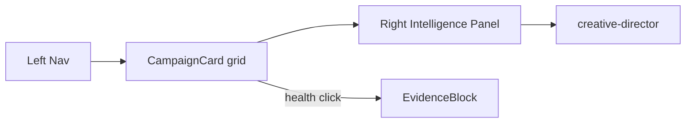

## 9. Implementation steps

| Step | Work | Proof |
| -- | -- | -- |
| 0 | Wait IPI-268 · API routes | curl JSON |
| A–E | Shell · grid · EvidenceBlock · create modal · states | see repo spec |

## 10. Testing

```bash
cd app && npm run lint && npm test && npx tsc --noEmit && CI=true npm run build && npx playwright test
```

Browser: DC HTML vs `/app/campaigns` · DevTools · screenshots

## 11. Production-ready definition

- [ ] lint · test · typecheck · build · no console errors · HTML parity · responsive verified

## 12. Acceptance criteria

- [ ] handoff/11 Campaigns checklist · CampaignCard · EvidenceBlock · all states · task-verifier

## Dependencies

**Hard:** IPI-268 · IPI-156 · **Done:** IPI-247 · IPI-246

---

## Wireframe (ASCII — must match DC)

**SSOT:** `Universal-design-prompt-new/tasks/screens/wireframes/SCR-07-campaigns.md`

# SCR-07 wireframe — Campaigns

> **SSOT:** [`Campaigns.v2.image-first.dc.html`](<../../../Pages/Campaigns.v2.image-first.dc.html>) · Method: [`ipix-wireframe`](<../../../../.claude/skills/ipix-wireframe/SKILL.md>)
> **Rule:** ASCII zones must match DC `grid-template-columns` and Workspace blocks — not invented layout.

## Shell archetype

| Field | Value |
| -- | -- |
| Archetype | `standard-v2` |
| DC grid | `auto | minmax(0,1fr) auto` |
| Intelligence width | 340px |

## ASCII layout (lo-fi)

```text
+----------+---------------------------+------------+
| NavSidebar| Workspace (flex)         | Intelligence|
| collapsible|                        | Panel 340px|
| auto width |                        |            |
+----------+---------------------------+------------+
|          | Header + filters                        |            |
|          | 3-col CampaignCard grid                 |  Digest /  |
|          | State toggles                           |  actions   |
|          |                                         |            |
+----------+---------------------------+------------+
DC grid: auto | minmax(0,1fr) auto
Mobile @1024: Nav→tab bar · Intel→bottom sheet
```

## Workspace zones (from DC)

| # | Zone | React target |
| -- | -- | -- |
| 1 | Header + filters | `*-workspace.tsx` region |
| 2 | 3-col CampaignCard grid | `*-workspace.tsx` region |
| 3 | State toggles | `*-workspace.tsx` region |

## States to implement

- [ ] grid
- [ ] empty
- [ ] blocked D1

## Zone spec table

| Zone | Interaction | Data | Empty |
| -- | -- | -- | -- |
| Header + filters | *from DC* | *§0 Prove* | *EmptyState* |
| 3-col CampaignCard grid | *from DC* | *§0 Prove* | *EmptyState* |
| State toggles | *from DC* | *§0 Prove* | *EmptyState* |
 | Backlog |  | Medium | 1adb08a8-6c36-4bc9-8b47-2c9ffb827a89 | DESIGN V2 — Operator React Parity | ai@socialmediaville.ca | ai@socialmediaville.ca | COPILOTKIT, DESIGN, DESIGNV2, FRONTEND, HTML, MASTRA, QA, SUPA, UX |  |  |  |  | 2026-06-30T06:08:41.237Z | 2026-07-06T09:51:13.245Z |  |  |  |  |  |  |  | IPIX-INIT-001 — Operator Platform (Q3 2026) | a3b8be45-5b64-4b60-92f2-c733831784b1 | DV2-M3 · Workspace Parity |  | 1e6beebb-daa1-4a40-9cd0-5ffd71e96b36 | 12551 | IPI-156, IPI-244, IPI-246, IPI-247, IPI-268, IPI-420, IPI-23 | IPI-172 |  |
| IPI-259 | iPix1 | DESIGN-075 · Production Planner Agent — Route Wiring | ## Overview

Wire **production-planner** agent: route context, tools, greetings on `/app`, `/app/shoots` per AGENT-MAP.

**Note:** `/app/campaigns` uses **creative-director** (IPI-156/IPI-261) — not production-planner.

**Tracker:** DESIGN-075 · Distinct from [IPI-247](https://linear.app/amo100/issue/IPI-247) (route map only)

**Greeting/chips:** Coordinate with [IPI-197](https://linear.app/amo100/issue/IPI-197) — this issue owns **Mastra tools + useAgentContext**, not welcome copy strings.

---

## Acceptance criteria

- [ ] Mastra tools registered for shoot planning
- [ ] useAgentContext injects shoot IDs (brandId + shootId from route)
- [ ] Coordinate greeting/chips with IPI-197 — no duplicate welcome strings in this PR
- [ ] Browser smoke on Command Center + Shoots

---

### Gemini / structured output AC

- [ ] Agent tools use Zod schemas + structured tool results via Mastra
- [ ] No hardcoded model IDs — use `resolveGeminiModel()` / registry constants
- [ ] Tool outputs compatible with EvidenceBlock fields ([IPI-172](https://linear.app/amo100/issue/IPI-172) contract)
- [ ] `thinkingBudget: 0` on Mastra agent calls
- [ ] No Interactions API — `generateContent` / `generateObject` only through MVP

---

## Execution

**Depends on:** IPI-247 ✅ route map · IPI-275 ✅ dock shell (soft)

**SSOT:** AGENT-MAP · MASTER-DEPENDENCIES

---

# Implementation Prompt Pack (2026-06-30)

**Worktree:** `ipi/259-production-planner-wiring` · `../wt-ipi-259-production-planner-wiring`
**Skills:** mastra · copilotkit · gemini · task-verifier · mermaid-diagrams
**Design ref:** `Shoots List.v2.image-first.dc.html` · `Shoot Wizard.v2.image-first.dc.html` · `Command Center.v2.image-first.dc.html`

## User stories

* As a **producer**, production-planner tools on Command Center and Shoots help me plan coverage and next actions.
* As a **developer**, `useAgentContext` injects active shoot IDs so the agent never asks "which shoot?".

## Agent wiring map

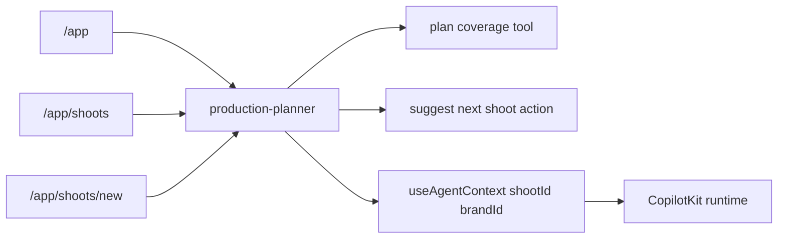

## Implementation steps (Test block each)

| Step | Prompt | Test / proof |
| -- | -- | -- |
| **A** | Register shoot planning tools on `production-planner` agent (Zod schemas) | `npm test src/mastra` |
| **B** | `useAgentContext` — brandId + shootId from route params | context in tool logs |
| **C** | Coordinate greeting/chips with IPI-197 — no duplicate welcome strings | operator-panel test |
| **D** | Browser smoke CC + `/app/shoots` | agent responds with context |
| **E** | No hardcoded model IDs | grep registry constants |

## Verification

```bash
cd app && npm run lint && npm test src/mastra && npx tsc --noEmit
# manual: /app + /app/shoots — contextual tool call
``` | Backlog |  | Medium | 1adb08a8-6c36-4bc9-8b47-2c9ffb827a89 | DESIGN V2 — Operator React Parity | ai@socialmediaville.ca | ai@socialmediaville.ca | COPILOTKIT, DESIGN, DESIGNV2, MASTRA |  |  |  |  | 2026-06-30T06:24:11.487Z | 2026-07-04T06:55:56.750Z |  |  |  |  |  |  | IPI-254 | IPIX-INIT-001 — Operator Platform (Q3 2026) | 564f6a39-e763-4067-aed2-0926e33c3d3e | DV2-M1 · Shared Spine |  | 5f2f5d62-3a8c-465d-820e-2a0358c3282c | 6932 | IPI-247, IPI-17, IPI-23, IPI-262, IPI-261, IPI-197 |  |  |
| IPI-248 | iPix1 | DESIGN-057 · Asset Library — React Parity Workspace | '> **⚠️ Reopened 2026-07-06 — wrongly marked Done.** `/app/assets` is still placeholder (~5%).
>
> **Active implementation tracker:** [IPI-404](https://linear.app/amo100/issue/IPI-404) SCR-08 · read-only masonry
>
> **SSOT:** `Universal-design-prompt-new/tasks/screens/SCR-08-assets.md` · Step 6
>
> This issue (DESIGN-057) remains the historical umbrella; ship work on [IPI-404](https://linear.app/amo100/issue/IPI-404/scr-08-assets-library-read-only-masonry).

---

## Overview

Replace `/app/assets` SectionPlaceholder with Claude Design **Asset Library** — masonry grid, DNA match, upload modal, bulk selection, EvidenceBlock explain flow.

**Tracker:** DESIGN-057 · Route: `/app/assets` · Agent: **creative-director**

**Disk verified (2026-06-30):**

* `/app/assets` is still `SectionPlaceholder` — no masonry UI
* **No** `GET /api/assets` **route on disk** — Step 0 must create API before grid fetch
* Upload route `POST /api/assets/upload-sign` also missing (expected — gated on [IPI-257](https://linear.app/amo100/issue/IPI-257/design-074-cloudinary-media-pipeline-upload-to-delivery))

---

## Dependency note (2026-06-30)

| Gate | Scope |
| -- | -- |
| [IPI-246](https://linear.app/amo100/issue/IPI-246/design-046-evidenceblock-ai-explainability-component) | Shared AssetCard, FilterBar, EvidenceBlock components |
| [IPI-247](https://linear.app/amo100/issue/IPI-247/design-070-route-agent-map-parity-assets-matching-preview) | Route → creative-director agent map ✅ |
| [IPI-276](https://linear.app/amo100/issue/IPI-276/supa-org-rls-org-member-rls-alignment-assets-cloudinary-assets) (soft) | Org-member RLS — org editors need read access before full library sign-off |
| [IPI-257](https://linear.app/amo100/issue/IPI-257/design-074-cloudinary-media-pipeline-upload-to-delivery) (upload only) | Cloudinary signed upload — read-only masonry can ship first |
| [IPI-172](https://linear.app/amo100/issue/IPI-172/gemini-009-grounding-metadata-persistence-ai-agent-logs) (soft) | EvidenceBlock payload contract — not a hard blocker for read-only grid |
| [IPI-404](https://linear.app/amo100/issue/IPI-404/scr-08-assets-library-read-only-masonry) | **SCR-08 read-only masonry — primary tracker (2026-07-06)** |
| [IPI-400](https://linear.app/amo100/issue/IPI-400/be-st1-storage-buckets) | BE-ST1 upload phase (parallel) |

**Read-only path:** Masonry + DNA display + bulk select can ship after Step 0 API + [IPI-246](https://linear.app/amo100/issue/IPI-246/design-046-evidenceblock-ai-explainability-component). Upload UX waits for [IPI-257](https://linear.app/amo100/issue/IPI-257/design-074-cloudinary-media-pipeline-upload-to-delivery).

---

## Acceptance criteria

- [ ] `GET /api/assets` route exists and returns `{ assets: AssetCardData[] }` with DNA scores
- [ ] Matches handoff/11 Assets checklist
- [ ] Uses shared AssetCard, FilterBar, EvidenceBlock ([IPI-246](https://linear.app/amo100/issue/IPI-246/design-046-evidenceblock-ai-explainability-component))
- [ ] Loading · empty · error · selected states
- [ ] Upload after [IPI-257](https://linear.app/amo100/issue/IPI-257/design-074-cloudinary-media-pipeline-upload-to-delivery) 074a
- [ ] Browser + Playwright verified

---

## Execution

**Blocked by (Linear):** [IPI-246](https://linear.app/amo100/issue/IPI-246/design-046-evidenceblock-ai-explainability-component) · [IPI-247](https://linear.app/amo100/issue/IPI-247/design-070-route-agent-map-parity-assets-matching-preview) · [IPI-276](https://linear.app/amo100/issue/IPI-276/supa-org-rls-org-member-rls-alignment-assets-cloudinary-assets) (org RLS — soft for read-only owner path)

**Soft:** [IPI-172](https://linear.app/amo100/issue/IPI-172/gemini-009-grounding-metadata-persistence-ai-agent-logs) (EvidenceBlock payload) · [IPI-257](https://linear.app/amo100/issue/IPI-257/design-074-cloudinary-media-pipeline-upload-to-delivery) (upload only)

**Implementation:** [IPI-404](https://linear.app/amo100/issue/IPI-404) SCR-08

**SSOT:** MASTER-DEPENDENCIES · `Universal-design-prompt-new/tasks/screens/SCR-08-assets.md`

---

## Wireframe (ASCII — must match DC)

**SSOT:** `Universal-design-prompt-new/tasks/screens/wireframes/SCR-08-assets.md`

# SCR-08 wireframe — Assets

> **SSOT:** [`Assets.v2.image-first.dc.html`](<../../../Pages/Assets.v2.image-first.dc.html>) · Method: [`ipix-wireframe`](<../../../../.claude/skills/ipix-wireframe/SKILL.md>)
> **Rule:** ASCII zones must match DC `grid-template-columns` and Workspace blocks — not invented layout.

## Shell archetype

| Field | Value |
| -- | -- |
| Archetype | `standard-v2` |
| DC grid | `auto | minmax(0,1fr) auto` |
| Intelligence width | 340px |

## ASCII layout (lo-fi)

```text
+----------+---------------------------+------------+
| NavSidebar| Workspace (flex)         | Intelligence|
| collapsible|                        | Panel 340px|
| auto width |                        |            |
+----------+---------------------------+------------+
|          | Brand/shoot scope header                |            |
|          | Filter chips                            |  Digest /  |
|          | Masonry AssetCard grid                  |  actions   |
|          |                                         |            |
+----------+---------------------------+------------+
DC grid: auto | minmax(0,1fr) auto
Mobile @1024: Nav→tab bar · Intel→bottom sheet
```

## Workspace zones (from DC)

| # | Zone | React target |
| -- | -- | -- |
| 1 | Brand/shoot scope header | `*-workspace.tsx` region |
| 2 | Filter chips | `*-workspace.tsx` region |
| 3 | Masonry AssetCard grid | `*-workspace.tsx` region |

## States to implement

- [ ] masonry
- [ ] empty
- [ ] read-only first

## Zone spec table

| Zone | Interaction | Data | Empty |
| -- | -- | -- | -- |
| Brand/shoot scope header | *from DC* | *§0 Prove* | *EmptyState* |
| Filter chips | *from DC* | *§0 Prove* | *EmptyState* |
| Masonry AssetCard grid | *from DC* | *§0 Prove* | *EmptyState* |
 | Backlog |  | Medium | 1adb08a8-6c36-4bc9-8b47-2c9ffb827a89 | DESIGN V2 — Operator React Parity | ai@socialmediaville.ca | ai@socialmediaville.ca | COPILOTKIT, DESIGN, DESIGNV2, FRONTEND, GEMINI, HTML, MASTRA, QA, SUPA, UX |  |  |  |  | 2026-06-30T06:08:28.972Z | 2026-07-07T06:27:13.015Z |  |  |  |  |  |  |  | IPIX-INIT-001 — Operator Platform (Q3 2026) | a3b8be45-5b64-4b60-92f2-c733831784b1 | DV2-M3 · Workspace Parity |  | 8efbf800-c53c-4fa2-8b43-4c68bfa6f87b | 3887 | IPI-246, IPI-276, IPI-257, IPI-247, IPI-435, IPI-426, IPI-404, IPI-400, IPI-271, IPI-128, IPI-261, IPI-152, IPI-265 | IPI-172 |  |
| IPI-250 | iPix1 | DESIGN-059 · Creator Matching — React Parity Workspace | # IPI-250 · DESIGN-059 — Creator Matching React Parity

**Parent:** [IPI-254](https://linear.app/amo100/issue/IPI-254) · **Repo spec:** `docs/linear/issues/IPI-250-matching-react-parity.md`

## 1. Purpose

Find creators via swipe deck or data table — fit scores, EvidenceBlock explain, shortlist + invite flow.

## 2. Design source

`Universal design prompt/Matching.v2.image-first.dc.html`

## 3. Route

`/app/matching`

## 4. User story

> As a **brand manager**, I swipe or browse creators, see fit scores with evidence, save to shortlist, and send invites.

## 5. Frontend scope

Swipe deck + table · FilterBar · Shortlist drawer · bulk row select · 5 states · mobile sheet

## 6. Backend / data wiring

**Blocked:** IPI-268 · Step 0: `GET /api/matching/creators`

## 7. CopilotKit / Intelligence Panel

**Agent:** `social-discovery` (IPI-247 ✅) · EvidenceBlock on fit score

## 8. Wireframe

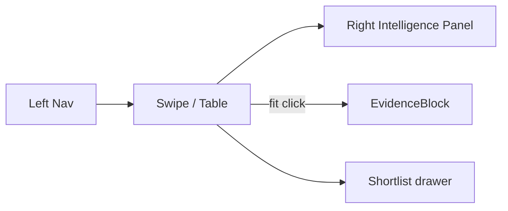

## 9–12. Implementation · Testing · Production-ready · Acceptance

See repo spec · QA: `cd app && npm run lint && npm test && npx tsc --noEmit && CI=true npm run build`

- [ ] handoff/11 Matching · shortlist persists · browser evidence

## Dependencies

IPI-268 · IPI-263 (soft) · IPI-247 ✅ · IPI-246 ✅ | Backlog |  | Medium | 9f12c38f-b20d-492a-ba5b-dd886e8fafef | Model Booking MVP | ai@socialmediaville.ca | ai@socialmediaville.ca | COPILOTKIT, DESIGN, DESIGNV2, FRONTEND, GEMINI, HTML, MASTRA, QA, SUPA, UX |  |  |  |  | 2026-06-30T06:08:42.893Z | 2026-07-06T09:36:59.850Z |  |  |  |  |  |  |  | IPIX-INIT-001 — Operator Platform (Q3 2026) | 28c6cce6-f013-403b-ab3a-e0784452558e | M2 · Matching |  | ce94268d-1d0c-4c08-8d33-3320f96d17aa | 12551 | IPI-246, IPI-247, IPI-268, IPI-405, IPI-23, IPI-160, IPI-263 | IPI-172 |  |
| IPI-245 | iPix1 | IPI-227B · Add Mastra RLS verification probes | Follow-up to IPI-227 (#134). Migration-only hardening shipped; add automated regression probes.

**Branch:** `ipi/227-verify-rls-mastra`

**Scope:** `scripts/verify-rls.mjs` only

* anon negative probe on `mastra_threads`
* authenticated negative probe on `mastra_threads`
* expect permission denied / no rows

**Pass when:**

```bash
infisical run -- npm run supabase:verify-rls
```

includes mastra probes green.

**Not in scope:** migration changes, app code.

**Source:** optibot PR #134 review (non-blocking tech debt). | Backlog |  | Medium | 73be1075-d57b-46ce-bdbe-563b896796af | AI Platform — Agents | ai@socialmediaville.ca |  | FIX, MASTRA, SUPA |  |  |  |  | 2026-06-28T18:34:36.093Z | 2026-07-04T06:51:31.369Z |  |  |  |  |  |  |  | IPIX-INIT-001 — Operator Platform (Q3 2026) | ca3e82a3-edd5-42d9-9001-387c7d786e3d | AGT-M1 · Runtime Foundation |  | 24f5e22e-c856-4422-8b6d-933880a20ac1 | 14874 | IPI-227 |  |  |
| IPI-240 | iPix1 | FIX · Align Gemini thinkingLevel across Mastra tools | ## FIX · Phase 4 — Gemini thinkingLevel alignment (Mastra app)

**Audit:** AI partial F-005 adjacent · **Branch:** `ipi/gemini-thinking-level` · **PR type:** app-only

**Blocked by:** IPI-223 (model registry stable first)

### Verified on disk (scope correction)

| Surface | thinking config | Action |
| -- | -- | -- |
| `app/.../suggestShootBrief.ts` | `thinkingBudget: 0` via AI SDK | 🔴 migrate to `thinkingLevel: "low"` |
| `visual-identity.ts`, `social-discovery.ts` | none set | 🟡 add per task complexity |
| `supabase/functions/_shared/gemini.ts` | ✅ `thinkingLevel` already | **Out of scope** |
| `brand-intelligence` edge | ✅ `thinkingLevel: low` | **Out of scope** |

### Steps

1. Add `resolveProviderOptions()` in `app/src/mastra/models.ts` (single helper)
2. Replace `thinkingBudget: 0` in `suggestShootBrief.ts`
3. Audit other `generateObject`/`generateText` in `app/src/mastra/` — set `medium` default, `high` for scoring
4. **Do not** mix `thinkingLevel` + `thinkingBudget` on same request (400 on Gemini 3)

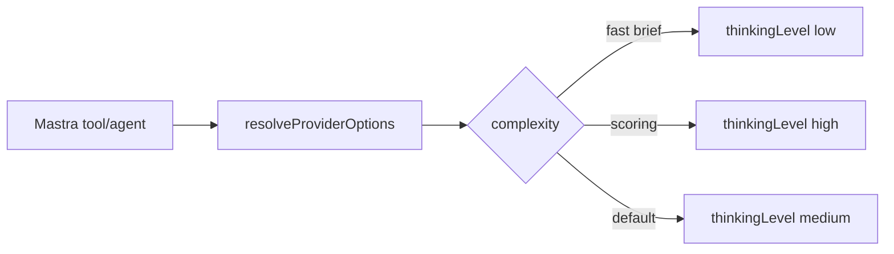

### Verify

```bash
cd app && npm test && npm run build
# Manual: suggestShootBrief returns text without timeout regression
```

**Skills:** `gemini` · **Related:** IPI-107, IPI-164 | Backlog |  | Medium | 73be1075-d57b-46ce-bdbe-563b896796af | AI Platform — Agents | ai@socialmediaville.ca |  | FIX, GEMINI, MASTRA |  |  |  |  | 2026-06-28T14:23:15.794Z | 2026-07-04T06:51:31.596Z |  |  |  |  |  |  | IPI-222 | IPIX-INIT-001 — Operator Platform (Q3 2026) | ca3e82a3-edd5-42d9-9001-387c7d786e3d | AGT-M1 · Runtime Foundation |  | fe959a37-f26b-43c7-a4b0-725ed0f7f5e2 | 15125 | IPI-223 |  |  |
| IPI-192 | iPix1 | MI-03b · AI checks each image's quality for its platform | Auto-flag problems on each preview frame: face/subject cropped, text outside safe zone, low contrast, wrong aspect, etc. Show "⚠ Face cropped → move up 15%" or "✅ Ready · Brand Score 96/100".

## Needs (real work — not just UI)

* A vision-capable check. Either a Mastra tool calling a vision model (Gemini) on the rendered asset, or a deterministic geometry check against `image_specs` safe zones for the cheap wins (text-in-safe-zone, aspect mismatch) before adding ML face detection.
* Tie the score to the existing `brand_scores` (brand intelligence) where relevant.

## Suggested phasing

1. Deterministic checks first (aspect/safe-zone/format vs `image_specs`) — no ML, ships value fast.
2. Vision model for subject/face crop detection — separate follow-up.

## Out of scope

"Regenerate" (generative image editing) — no such capability exists yet; track separately if wanted.

Blocked by MI-03a (needs the per-placement frame + selection model). | Backlog |  | Medium | 73be1075-d57b-46ce-bdbe-563b896796af | AI Platform — Agents | ai@socialmediaville.ca |  | GEMINI, MASTRA, MEDIA, SHOOT, SUPA |  |  |  |  | 2026-06-26T09:20:40.157Z | 2026-07-04T06:51:36.927Z |  |  |  |  |  |  |  | IPIX-INIT-001 — Operator Platform (Q3 2026) | ca3e82a3-edd5-42d9-9001-387c7d786e3d | AGT-M1 · Runtime Foundation |  | 8bf50405-65c9-4de6-a088-f9f25dd01372 | 18308 |  | IPI-191 |  |
| IPI-141 | iPix1 | AIOR-026 · RAG foundation (brand/asset/campaign KB) | ## AIOR-026 — RAG Foundation (brand/asset/campaign KB)

**Phase:** 9 · **Priority:** P2/P3 · **Estimate:** 5

Umbrella RAG epic — implement via MASTRA-RAG-001–003; Graph RAG deferred to MASTRA-RAG-004.

**Blocked by:** MASTRA-RAG-002 · content volume

### Acceptance

- [ ] Retrieval tool registered on `brand-intelligence` agent (guidelines only)
- [ ] Citations surfaced in operator UI
- [ ] No RAG until normal vector path proves value (per defer list) | Backlog | 5 | Medium | 73be1075-d57b-46ce-bdbe-563b896796af | AI Platform — Agents | ai@socialmediaville.ca |  | MASTRA |  |  |  |  | 2026-06-25T07:48:39.187Z | 2026-07-04T06:56:03.745Z |  |  |  |  |  |  |  | IPIX-INIT-001 — Operator Platform (Q3 2026) | baa4ce4c-1238-4ab5-a3c2-920b45056664 | AGT-M4 · Observability + RAG |  | 3c73685c-2ad6-413a-9937-24fe490c785e | 6932 |  |  |  |
| IPI-143 | iPix1 | MASTRA-RAG-002 · pgvector integration | ## MASTRA-RAG-002 — pgvector Integration

**Phase:** 4 · **Priority:** P2 · **Estimate:** 3

Mastra vector store on Supabase pgvector.

**Blocked by:** MASTRA-RAG-001 · migration approval

### Acceptance

- [ ] Migration: `vector` extension + embeddings table with RLS
- [ ] Mastra `PgVector` or equivalent wired in `app/src/mastra/rag/store.ts`
- [ ] Embed + query smoke test | Backlog | 3 | Medium | 73be1075-d57b-46ce-bdbe-563b896796af | AI Platform — Agents | ai@socialmediaville.ca |  | MASTRA |  |  |  |  | 2026-06-25T07:48:43.698Z | 2026-07-04T06:56:03.196Z |  |  |  |  |  |  |  | IPIX-INIT-001 — Operator Platform (Q3 2026) | baa4ce4c-1238-4ab5-a3c2-920b45056664 | AGT-M4 · Observability + RAG |  | 225c88b1-6614-497e-ba98-c3b0686ded23 | 6932 |  |  |  |
| IPI-138 | iPix1 | AIOR-023 · MCP registry foundation | ## AIOR-023 — MCP Registry Foundation

**Phase:** 9 · **Priority:** P2 · **Estimate:** 3

Dev/ops MCP registry (Cloudinary, Supabase, Linear, Mercur docs) — operator UI stays edge-first; no raw MCP writes from production agents.

**Blocked by:** Edge function patterns · AIOR-022

**Source:** `docs/copilotkit/12-mastra-plan.md` §10

### Acceptance

- [ ] `app/src/mastra/mcp/registry.ts` lists allowed MCP servers per environment
- [ ] Document which MCPs are dev-only vs future operator tools
- [ ] No secrets in client bundle | Backlog | 3 | Medium | 73be1075-d57b-46ce-bdbe-563b896796af | AI Platform — Agents | ai@socialmediaville.ca |  | CLOUDINARY, MASTRA |  |  |  |  | 2026-06-25T07:48:33.034Z | 2026-07-04T06:56:05.070Z |  |  |  |  |  |  |  | IPIX-INIT-001 — Operator Platform (Q3 2026) | c95a614f-4733-48dc-810c-785fde8c940f | AGT-M3 · Workspaces + Supervisor |  | f8f34e72-852b-44c2-b7ae-79cd8f8d57f6 | 6932 |  |  |  |
| IPI-144 | iPix1 | MASTRA-RAG-003 · Brand knowledge retrieval | ## MASTRA-RAG-003 — Brand Knowledge Retrieval

**Phase:** 4 · **Priority:** P2 · **Estimate:** 3

Retrieve brand guidelines / intake artifacts for agent context.

**Blocked by:** MASTRA-RAG-002

**Note:** Distinct from IPI-BI-011–015 (intelligence agents on BRAND project).

### Acceptance

- [ ] `retrieveBrandKnowledge` tool on brand agent
- [ ] Metadata filter by `brand_id`
- [ ] Fallback to edge `brand-intelligence` when index empty | Backlog | 3 | Medium | 73be1075-d57b-46ce-bdbe-563b896796af | AI Platform — Agents | ai@socialmediaville.ca |  | MASTRA |  |  |  |  | 2026-06-25T07:48:45.316Z | 2026-07-04T06:56:02.554Z |  |  |  |  |  |  |  | IPIX-INIT-001 — Operator Platform (Q3 2026) | baa4ce4c-1238-4ab5-a3c2-920b45056664 | AGT-M4 · Observability + RAG |  | ae8b2575-ffdc-4555-b16f-db12ad287502 | 6932 |  |  |  |
| IPI-142 | iPix1 | MASTRA-RAG-001 · Content chunking foundation | ## MASTRA-RAG-001 — Content Chunking Foundation

**In plain terms:** Chunking pipeline for brand docs, shoot briefs, campaign briefs.

**Business purpose:** Enable semantically accurate retrieval across brand knowledge without hitting Gemini context windows.
**Technical purpose:** Configurable chunk strategy (max tokens, overlap) in `app/src/mastra/rag/chunking.ts`.

**Blocked by:** ~~IPI-129~~ → IPI-129 ✅ **Done** (Mastra PG storage shipped in `app/src/mastra/storage.ts`)

**Phase:** 4/9 · **Priority:** P2 · **Estimate:** 3 points

**Source:** `docs/copilotkit/todo.md` · `tasks/intelligence/ai/MASTER-DEPENDENCIES.md`

### Acceptance

- [ ] Chunk strategy config (max tokens, overlap) in `app/src/mastra/rag/chunking.ts`
- [ ] Ingest script for sample brand PDF/markdown
- [ ] Unit test: stable chunk boundaries

### Verification

- [ ] `cd app && npm test` — chunking unit tests pass
- [ ] Manual: ingest sample brand brief → verify chunk boundaries stable
- [ ] `npm run build` green in `app/` | Backlog | 3 | Medium | 73be1075-d57b-46ce-bdbe-563b896796af | AI Platform — Agents | ai@socialmediaville.ca |  | MASTRA |  |  |  |  | 2026-06-25T07:48:41.442Z | 2026-07-04T06:56:03.420Z |  |  |  |  |  |  |  | IPIX-INIT-001 — Operator Platform (Q3 2026) | baa4ce4c-1238-4ab5-a3c2-920b45056664 | AGT-M4 · Observability + RAG |  | 4d6e2358-7db6-419a-b2b9-a55be8554b6f | 6932 | IPI-280 |  |  |
| IPI-147 | iPix1 | MASTRA-GOV-003 · Tool registry governance | ## MASTRA-GOV-003 — Tool Registry Governance

**In plain terms:** Governance for agents/tools/workflows registry — versioning, ownership, deprecations.

**Business purpose:** Ensure every agent tool has an explicit owner, deprecation policy, and CI gate so the registry doesn't accumulate orphan tools.
**Technical purpose:** `app/src/mastra/registry.manifest.ts` listing agents + tools + owners.

**Blocked by:** ~~IPI-113~~ → IPI-113 ✅ **Done** (tool registry shipped in `app/src/mastra/tools/index.ts`)

**Phase:** 5 · **Priority:** P2 · **Estimate:** 2 points

**Note:** MASTRA-GOV-001 guardrails = **AIOR-022** (single owner — IPI-137).

### Acceptance

- [ ] `app/src/mastra/registry.manifest.ts` lists agents + tools + owners
- [ ] CI check: new tool requires manifest entry
- [ ] Deprecation policy documented

### Verification

- [ ] `cd app && npm test` — manifest validation test passes
- [ ] CI: adding tool without manifest entry fails CI
- [ ] `npm run build` green | Backlog | 2 | Medium | 73be1075-d57b-46ce-bdbe-563b896796af | AI Platform — Agents | ai@socialmediaville.ca |  | MASTRA |  |  |  |  | 2026-06-25T07:48:52.694Z | 2026-07-04T06:56:01.741Z |  |  |  |  |  |  |  | IPIX-INIT-001 — Operator Platform (Q3 2026) | ca3e82a3-edd5-42d9-9001-387c7d786e3d | AGT-M1 · Runtime Foundation |  | 7f71e821-e2c7-4471-85ca-b519026a83d8 | 6932 | IPI-113 |  |  |
| IPI-140 | iPix1 | AIOR-025 · Observability 2.0 | ## AIOR-025 — Observability 2.0

**Phase:** 9 · **Priority:** P2 · **Estimate:** 3

Traces, token usage, tool latency beyond minimal `ai_agent_logs`.

**Blocked by:** [IPI-105 · AIOR-010](<https://linear.app/amo100/issue/IPI-105>) slice

### Acceptance

- [ ] Correlate CopilotKit thread id ↔ `ai_agent_logs` ↔ Mastra trace id
- [ ] Token + latency fields on agent log insert
- [ ] Dashboard query or script for last 24h agent errors | Backlog | 3 | Medium | 73be1075-d57b-46ce-bdbe-563b896796af | AI Platform — Agents | ai@socialmediaville.ca |  | MASTRA |  |  |  |  | 2026-06-25T07:48:37.438Z | 2026-07-04T06:56:03.957Z |  |  |  |  |  |  |  | IPIX-INIT-001 — Operator Platform (Q3 2026) | baa4ce4c-1238-4ab5-a3c2-920b45056664 | AGT-M4 · Observability + RAG |  | a80bf9e5-38ba-4df5-bb21-b2dd8af72b69 | 6932 | IPI-105 |  |  |
| IPI-152 | iPix1 | DNA-002 · Asset DNA agent | ## DNA-002 — Asset DNA Agent (Mastra wrapper)

**In plain terms:** Mastra agent tool wrapping `audit-asset-dna` **edge** (✅ shipped) — batch + explain DNA scores on `/app/assets`.

**Shipped upstream:** `audit-asset-dna` edge fn with structured JSON on `origin/main` — this issue is the **Mastra agent + CopilotKit Gen UI** layer, not edge creation.

**Blocked by:** ~~IPI-129~~ ✅ · ~~IPI-246~~ ✅ EvidenceBlock component

**Soft (not hard):** [IPI-137](https://linear.app/amo100/issue/IPI-137) guardrails — **deferred post-MVP**; workflow HITL already gates writes

**Coordinate with:** [IPI-261](https://linear.app/amo100/issue/IPI-261) creative-director assets wiring · [IPI-172](https://linear.app/amo100/issue/IPI-172) EvidenceBlock payload

**Phase:** 6 · **Estimate:** 5 points

### Acceptance

- [ ] Mastra tool calls `audit-asset-dna` with JWT
- [ ] Explain score tool → EvidenceBlock Gen UI (component IPI-246 ✅)
- [ ] No persist without approval workflow (DNA-005 / IPI-155)
- [ ] `thinkingBudget: 0` · registry model constants only

### Verification checklist

- [ ] `cd app && npm test src/mastra` — DNA tool tests
- [ ] Manual: `/app/assets` → "Explain DNA" → EvidenceBlock renders
- [ ] `infisical run -- npm run supabase:verify-dna` green | Backlog | 5 | Medium | 73be1075-d57b-46ce-bdbe-563b896796af | AI Platform — Agents | ai@socialmediaville.ca |  | AI, GEMINI, MASTRA |  |  |  |  | 2026-06-25T07:49:00.686Z | 2026-07-04T06:56:01.295Z |  |  |  |  |  |  |  | IPIX-INIT-001 — Operator Platform (Q3 2026) | ca3e82a3-edd5-42d9-9001-387c7d786e3d | AGT-M1 · Runtime Foundation |  | 4e3fd9c9-ae53-43cc-8171-7baa1ce8d8b6 | 6932 | IPI-170, IPI-155, IPI-261, IPI-172, IPI-248, IPI-246, IPI-129, IPI-265 |  |  |
| IPI-146 | iPix1 | MASTRA-GOV-002 · Multi-tenant memory isolation | ## MASTRA-GOV-002 — Multi-Tenant Memory Isolation

**Phase:** 5 · **Priority:** P2 · **Estimate:** 2

Audit memory threads and RLS so org A cannot read org B threads.

**Blocked by:** AIOR-019 · IPI-104

### Acceptance

- [ ] `resourceId` always includes org scope
- [ ] Test: two users, two orgs, no cross-thread leakage
- [ ] Document in `app/src/mastra/memory.ts` | Backlog | 2 | Medium | 73be1075-d57b-46ce-bdbe-563b896796af | AI Platform — Agents | ai@socialmediaville.ca |  | MASTRA |  |  |  |  | 2026-06-25T07:48:51.339Z | 2026-07-04T06:56:02.048Z |  |  |  |  |  |  |  | IPIX-INIT-001 — Operator Platform (Q3 2026) | ca3e82a3-edd5-42d9-9001-387c7d786e3d | AGT-M1 · Runtime Foundation |  | a514f020-737c-49f3-8bfd-cd022d2da8f0 | 6932 |  |  |  |
| IPI-139 | iPix1 | AIOR-024 · Browser automation foundation | ## AIOR-024 — Browser Automation Foundation

**Phase:** 9 · **Priority:** P2 · **Estimate:** 5

Stagehand / Mastra browser for competitor, sponsor, venue research — post-MVP.

**Blocked by:** AIOR-017 durable agents

**Source:** `docs/copilotkit/12-mastra-plan.md`

### Acceptance

- [ ] Spike: browser tool behind feature flag
- [ ] Results land in draft tables only (HITL before persist)
- [ ] Rate limits + audit log entry per run | Backlog | 5 | Medium | 73be1075-d57b-46ce-bdbe-563b896796af | AI Platform — Agents | ai@socialmediaville.ca |  | MASTRA |  |  |  |  | 2026-06-25T07:48:34.117Z | 2026-07-04T06:56:04.844Z |  |  |  |  |  |  |  | IPIX-INIT-001 — Operator Platform (Q3 2026) | c95a614f-4733-48dc-810c-785fde8c940f | AGT-M3 · Workspaces + Supervisor |  | 937c9a6a-6e5e-47c5-9a66-16cffe3ccfa7 | 6932 |  |  |  |
| IPI-105 | iPix1 | AIOR-010 · Agent Observability | ## AIOR-010 — Agent Observability

**In plain terms:** **Engineer** correlates Mastra traces with `ai_agent_logs` for failed agent/workflow runs.

**Blocked by:** [AIOR-001](<https://linear.app/amo100/issue/IPI2-81>) · [PLT-003](<https://linear.app/amo100/issue/IPI2-16>)

**Unblocks:** Production agent debugging, SLA on AI failures

**MVP priority:** **P2 Nice To Have**

**Estimate:** 5 points

**Source:** [docs/ai/mastra-linear-roadmap.md](<../../ai/mastra-linear-roadmap.md>) · [docs/intelligence/copilotkit-mastra-plan.md](<../../intelligence/copilotkit-mastra-plan.md>)

### Skills (load in order)

| # | Skill | Path |
| -- | -- | -- |
| 1 | ipix-task-lifecycle | `.claude/skills/ipix-task-lifecycle/SKILL.md` or `.agents/skills/ipix-task-lifecycle/` |
| 2 | mastra | `.claude/skills/mastra/SKILL.md` or `.agents/skills/mastra/` |

---

### Flow — AIOR-010


---

### Completion steps

#### A. Implement

- [ ] **A1** Mastra observability config → structured logs
- [ ] **A2** Correlate `ai_agent_logs.run_id` with Mastra trace id
- [ ] **A3** Failed-run export via Studio or dashboard stub
- [ ] **A4** PII redaction verified in logs

#### B. Verify + ship

- [ ] **B1** `npm run build` passes
- [ ] **B2** Agent server boots (`services/agent`) without errors
- [ ] **B3** CopilotKit SSE works on target dashboard route (if UI task)
- [ ] **B4** Linear **Done** · `todo.md` updated

**Spec score:** 84/100 — lifecycle-ready

---

### Gantt — IPI-90

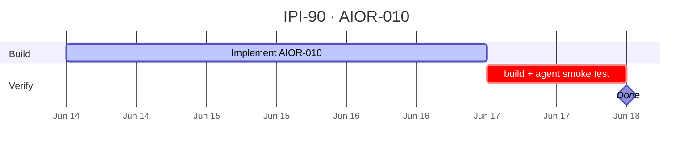

*Source:* `docs/linear/issues/IPI-90-AIOR-010.md` *· push via* `node scripts/linear-update-issue.mjs IPI-90` | Backlog | 5 | Medium | 73be1075-d57b-46ce-bdbe-563b896796af | AI Platform — Agents | ai@socialmediaville.ca |  | AI, MASTRA |  |  |  |  | 2026-06-14T12:18:20.921Z | 2026-07-04T06:51:59.092Z |  |  |  |  |  |  |  | IPIX-INIT-001 — Operator Platform (Q3 2026) | ca3e82a3-edd5-42d9-9001-387c7d786e3d | AGT-M1 · Runtime Foundation |  | a2011f60-62b3-4a2c-8a6c-9c4af1f3b8d1 | 35410 | IPI2-16, IPI-48, IPI-140, IPI2-128 |  |  |
| IPI-109 | iPix1 | AIOR-020 · Supervisor agent architecture | ## AIOR-020 — Supervisor Agent Architecture

**In plain terms:** `operator-supervisor` orchestrates Brand, Shoots, Assets, Campaigns, and Matching specialists via route map + delegation tools.

**Supersedes:** AIOR-009 (was [IPI-109](https://linear.app/amo100/issue/IPI-109))

**Blocked by:** 2+ workspace workflows live · AIOR-018 · AIOR-022

**MVP priority:** **P1** (Phase 4)

**Estimate:** 8 points

**Source:** `docs/prd/prd-intelligence.md` supervisor tree · `docs/copilotkit/12-mastra-plan.md`

---

### Acceptance

- [ ] Register `operator-supervisor` in `app/src/mastra/index.ts`
- [ ] Delegation tools call child agents (brand-intelligence, production-planner, …)
- [ ] Default route on `/app` Command Center uses supervisor `agentId`
- [ ] No direct DB writes — delegate to workflows / edge fns | Backlog | 8 | Medium | 73be1075-d57b-46ce-bdbe-563b896796af | AI Platform — Agents | ai@socialmediaville.ca |  | AI, MASTRA |  |  |  |  | 2026-06-14T12:18:20.325Z | 2026-07-04T06:51:59.308Z |  |  |  |  |  |  |  | IPIX-INIT-001 — Operator Platform (Q3 2026) | c95a614f-4733-48dc-810c-785fde8c940f | AGT-M3 · Workspaces + Supervisor |  | 2aff1adb-4265-4d67-87da-ee7cae8a0ada | 35410 | IPI-132, IPI-104, IPI2-128 | IPI2-87, IPI2-86 |  |
| IPI-333 | iPix1 | BOOK-211 — Additional Mastra Agents | Casting, Contract, Analytics, Notification, Pricing agents. Gate: only spin up a dedicated agent if the corresponding capability above ships **and** genuinely needs agent-level autonomy — default to adding a tool to Model Match/Booking Agent first, per the existing `production-planner` pattern. Source: `tasks/models/05-model-booking-post-mvp-and-advanced.md`. | Backlog |  | Low | 9f12c38f-b20d-492a-ba5b-dd886e8fafef | Model Booking MVP | ai@socialmediaville.ca |  | MASTRA, MODEL |  |  |  |  | 2026-07-01T18:09:55.708Z | 2026-07-04T06:52:16.533Z |  |  |  |  |  |  |  | IPIX-INIT-001 — Operator Platform (Q3 2026) | c39cab39-988b-4acc-a1e0-8e65ff7b5919 | M5 · Launch |  | d5c5ef2c-3da4-4cdf-96b8-3e2c5e7073a5 | 10578 |  |  |  |
| IPI-329 | iPix1 | BOOK-207 — Automation & Reminder Workflows | Follow-ups, review requests, post-shoot task automation. Gate: needs BOOK-102 (real notifications) first. Source: `tasks/models/05-model-booking-post-mvp-and-advanced.md`. | Backlog |  | Low | 9f12c38f-b20d-492a-ba5b-dd886e8fafef | Model Booking MVP | ai@socialmediaville.ca |  | MASTRA, MODEL |  |  |  |  | 2026-07-01T18:09:32.651Z | 2026-07-04T06:52:17.673Z |  |  |  |  |  |  |  | IPIX-INIT-001 — Operator Platform (Q3 2026) | c39cab39-988b-4acc-a1e0-8e65ff7b5919 | M5 · Launch |  | 72fe770b-4eed-4697-81f6-7746bbf00802 | 10579 |  |  |  |
| IPI-280 | iPix1 | MASTRA-MEM-001 · Semantic Recall / Observational Memory | ## MASTRA-MEM-001 — Semantic Recall / Observational Memory

**Audit sync 2026-06-30** · Mastra Plan v1.2

### Problem

[IPI-135](https://linear.app/amo100/issue/IPI-135) shipped message history + planner working memory ✅.

**Do NOT conflate with** [IPI-136](https://linear.app/amo100/issue/IPI-136) — that is **Agent Goals Framework**, not observational memory.

`memory.ts` comment defers "observational memory" to IPI-136 — **wrong target**. This issue owns semantic recall + observational memory.

### Scope (Post-MVP)

* Mastra semantic recall / observational memory patterns
* pgvector consumer after [IPI-143](https://linear.app/amo100/issue/IPI-143) MASTRA-RAG-002
* Cross-session recall scoped by `resourceId` / org

### Acceptance criteria

- [ ] Spike: Mastra memory config for semantic recall on planner (or dedicated agent)
- [ ] No cross-tenant leakage test
- [ ] Document deferral in `memory.ts` → this issue (not IPI-136)

### Dependencies

**Blocked by:** [IPI-143](https://linear.app/amo100/issue/IPI-143) pgvector · [MASTRA-RAG-001](<https://linear.app/amo100/issue/IPI-142>) chunking

**Phase:** Post-MVP | Backlog | 5 | Low | 73be1075-d57b-46ce-bdbe-563b896796af | AI Platform — Agents | ai@socialmediaville.ca |  | MASTRA |  |  |  |  | 2026-06-30T11:18:25.099Z | 2026-07-04T06:51:29.958Z |  |  |  |  |  |  |  | IPIX-INIT-001 — Operator Platform (Q3 2026) | ca3e82a3-edd5-42d9-9001-387c7d786e3d | AGT-M1 · Runtime Foundation |  | f97968d6-9c20-41ef-a641-c69858e444a9 | 12430 | IPI-136, IPI-142, IPI-135 | IPI-143 |  |
| IPI-215 | iPix1 | SHOOT-DETAIL-REGENERATE — AI-regenerate brief / shots / budget via Mastra HITL gate | ## Purpose

Trigger Mastra to rewrite a specific section (brief, shots, or budget) using brand context. Always draft-only — operator must confirm before any DB write.

## User story

As an operator I can regenerate any shoot section via AI so that I get an improved draft I can accept or discard without touching the original.

## HITL gate — mandatory

The API route returns a draft ONLY. No DB write until the operator clicks Accept. On Accept, the client calls `PATCH /api/shoots/[shootId]` (IPI-210). Reject = no action.

## API route

```
POST /api/shoots/[shootId]/regenerate
Auth: withOperatorAuth → 401
Body: { section: "brief" | "shots" | "budget" }
Response: 200 { draft: { brief? | shots? | budget_breakdown? } }
export const maxDuration = 60
```

* Calls Mastra tool via `mastra.getAgent("shoot-wizard").getTool("<name>").execute!(...)` — never raw `generateText` in route
* No DB write in this route

## Supabase

Read: `get_shoot_detail` RPC for context. Write: only via `PATCH /api/shoots/[shootId]` on operator confirm.

## Audit

`ai_agent_logs` row on every call (before confirm): `agent_name: "shoot-wizard"`, `input: { section, shoot_id }`. Non-blocking.

## Acceptance criteria

- [ ] A. Regenerate brief → non-empty draft text returned
- [ ] B. Regenerate shots → array with shot_number + description
- [ ] C. Regenerate budget → object with category keys + numeric values
- [ ] D. Draft shown inline; original unchanged until Accept clicked
- [ ] E. Accept → PATCH called, DB updated; Reject → no change
- [ ] F. Spinner during generation
- [ ] G. 403 if not owner; 400 if section invalid
- [ ] H. Audit log on every call
- [ ] I. No generateText in route handler

## Implementation prompt

```
Implement SHOOT-DETAIL-REGENERATE for the iPix operator app.

Key constraint: this is a HITL gate. The route returns a draft only.
DB is written only when the operator clicks Accept (calls PATCH /api/shoots/[shootId]).

1. Verify shoot-wizard agent tool names:
   cat app/src/mastra/agents/shoot-wizard.ts | grep "name:"

2. Create app/src/app/api/shoots/[shootId]/regenerate/route.ts

export const dynamic = "force-dynamic"
export const maxDuration = 60
export async function POST(req, { params }) {
  const operator = await withOperatorAuth(req) // → 401
  const { shootId } = await params
  const { section } = await req.json()
  if (!["brief","shots","budget"].includes(section)) return 400

  // brand check → 403
  const { data: context } = await svc.rpc("get_shoot_detail", { p_shoot_id: shootId, p_user_id: operator.id })
  if (!context) return 404

  const mastra = getMastra() // inside handler body only
  const toolName = { brief: "generateBrief", shots: "generateShotList", budget: "generateBudget" }[section]
  const tool = mastra.getAgent("shoot-wizard").getTool(toolName)
  const draft = await tool.execute!({ context: { shoot: context.shoot, brand: context.brand } })

  // Audit (non-blocking)
  try { await svc.from("ai_agent_logs").insert({ agent_name: "shoot-wizard", input: { section, shoot_id: shootId } }) } catch {}

  return NextResponse.json({ draft })
}

3. Add Regenerate button inside edit mode
   - Shows draft in preview panel
   - Accept → calls PATCH /api/shoots/[shootId]
   - Reject → clears draft, original unchanged

Branch: ipi/215-shoot-detail-regenerate
```

**Spec:** `docs/plan/tasks/03-shoot-detail-actions.md`
**Depends on:** IPI-210 merged

---

## Skills

| # | Skill | When |
| -- | -- | -- |
| 1 | `/worktrees` | Create `ipi/215-shoot-detail-regenerate` worktree |
| 2 | `/ipix-task-lifecycle` | Load ACs, confirm HITL gate requirement |
| 3 | `/mastra` | Before calling Mastra agent tools from route — verify tool names |
| 4 | `/gemini` | Confirm Gemini model used inside shoot-wizard tools |
| 5 | `/ipix-supabase` | Read `get_shoot_detail` RPC + audit log |
| 6 | `/frontend-design` | Draft preview panel + Accept/Reject buttons |
| 7 | `/verify` | Regenerate brief, confirm draft shown, Accept writes DB, Reject leaves original |
| 8 | `/ponytail` | No generateText in route — tool.execute!() only |
 | Backlog |  | Low | 73be1075-d57b-46ce-bdbe-563b896796af | AI Platform — Agents | ai@socialmediaville.ca |  | AI, GEMINI, MASTRA, SHOOT, SUPA |  |  |  |  | 2026-06-28T12:18:10.913Z | 2026-07-04T06:55:58.278Z |  |  |  |  |  |  |  | IPIX-INIT-001 — Operator Platform (Q3 2026) | ca3e82a3-edd5-42d9-9001-387c7d786e3d | AGT-M1 · Runtime Foundation |  | a7c3b628-bf86-495c-b65b-9219015ab0e5 | 6953 | IPI-337 |  |  |
| IPI-162 | iPix1 | MATCH-003 · Matching approval flow | ## MATCH-003 — Matching approval flow

**In plain terms:** HITL before outreach, CRM write, or partnership commit — operator approves partner/venue/sponsor shortlist.

**Phase:** 7+ (post-MVP) · **Estimate:** 3

---

### Scope

* Approval card for match shortlist ([IPI-111](https://linear.app/amo100/issue/IPI-111) pattern)
* Rejection reason required
* No outreach/CRM write without approval

### Out of scope

* Creator invite flow ([IPI-263](https://linear.app/amo100/issue/IPI-263))
* Match explorer UI ([IPI-163](https://linear.app/amo100/issue/IPI-163))

---

### Acceptance criteria

- [ ] `MatchShortlistApprovalCard` renders ranked candidates with scores
- [ ] Approve → edge fn commits shortlist; Reject → draft retained, no outreach
- [ ] Audit log with decision + reason
- [ ] Keyboard accessible

### Verification checklist

- [ ] Browser: approve → outreach-ready row; reject → no outreach row
- [ ] Audit log entries for both paths
- [ ] `cd app && npm run test` green

**Blocked by (Linear):** [IPI-161](https://linear.app/amo100/issue/IPI-161) · [IPI-111](https://linear.app/amo100/issue/IPI-111) · [IPI-131](https://linear.app/amo100/issue/IPI-131)

**Related:** [IPI-160](https://linear.app/amo100/issue/IPI-160) · [IPI-250](https://linear.app/amo100/issue/IPI-250) | Backlog | 3 | Low | 73be1075-d57b-46ce-bdbe-563b896796af | AI Platform — Agents | ai@socialmediaville.ca |  | AI, COPILOTKIT, MASTRA |  |  |  |  | 2026-06-25T07:49:13.196Z | 2026-07-04T06:51:38.849Z |  |  |  |  |  |  |  | IPIX-INIT-001 — Operator Platform (Q3 2026) | 57838497-c1a1-43e0-8c70-1ed3394e0ae9 | AGT-M2 · Operator Shell |  | 7b0285c4-55fb-4aa4-b759-cc8326913614 | 12378 | IPI-111, IPI-131, IPI-163 | IPI-161 |  |
| IPI-145 | iPix1 | MASTRA-RAG-004 · Graph RAG foundation | ## MASTRA-RAG-004 — Graph RAG Foundation

**Phase:** 5+ · **Priority:** P2 (defer production per roadmap)

Entity graph in Supabase → graph-augmented retrieval.

**Blocked by:** Stable brand/product entity graph · MASTRA-RAG-003

**Defer:** Graph RAG production until normal RAG proves value.

### Acceptance

- [ ] Spike doc only — no production ship in MVP
- [ ] Entity relationship model drafted in `docs/prd/prd-intelligence.md` | Backlog | 5 | Low | 73be1075-d57b-46ce-bdbe-563b896796af | AI Platform — Agents | ai@socialmediaville.ca |  | MASTRA |  |  |  |  | 2026-06-25T07:48:50.079Z | 2026-07-04T06:56:02.261Z |  |  |  |  |  |  |  | IPIX-INIT-001 — Operator Platform (Q3 2026) | baa4ce4c-1238-4ab5-a3c2-920b45056664 | AGT-M4 · Observability + RAG |  | 2d210c41-db07-42a9-b5d1-ba15ecb3a14a | 6932 |  |  |  |
| IPI-161 | iPix1 | MATCH-002 · Partner recommendation workflow | ## MATCH-002 — Partner recommendation workflow

**In plain terms:** Mastra workflow: criteria → candidate retrieval → rank → operator review suspend — for partners/venues/sponsors (not creators).

**Phase:** 7+ (post-MVP) · **Estimate:** 5

**Route:** `/app/matching` (partner tab)

---

### Scope

* Workflow with suspend/resume at operator review step
* Draft shortlist persisted until [IPI-162](https://linear.app/amo100/issue/IPI-162) approval
* Uses [IPI-160](https://linear.app/amo100/issue/IPI-160) agent tools for scoring

### Out of scope

* Creator workflow ([IPI-263](https://linear.app/amo100/issue/IPI-263))
* Explorer Gen UI ([IPI-163](https://linear.app/amo100/issue/IPI-163))

---

### Acceptance criteria

- [ ] `partner-match-workflow` registered in Mastra
- [ ] Steps: criteria input → fetch candidates → rank → suspend for review
- [ ] Draft shortlist in matching draft table ([IPI-268](https://linear.app/amo100/issue/IPI-268))
- [ ] Resume after approval writes outreach-ready shortlist only
- [ ] Workflow survives restart ([IPI-134](https://linear.app/amo100/issue/IPI-134) ✅)

### Verification checklist

- [ ] `cd app && npm run test` — workflow tests
- [ ] Suspend at review → no CRM/outreach write
- [ ] Approve → shortlist row persisted with RLS
- [ ] `npm run build` green

**Blocked by (Linear):** [IPI-160](https://linear.app/amo100/issue/IPI-160) · [IPI-268](https://linear.app/amo100/issue/IPI-268) · [IPI-134](https://linear.app/amo100/issue/IPI-134) ✅

**Blocks:** [IPI-162](https://linear.app/amo100/issue/IPI-162)

**Related:** [IPI-163](https://linear.app/amo100/issue/IPI-163) · [IPI-250](https://linear.app/amo100/issue/IPI-250) | Backlog | 5 | Low | 73be1075-d57b-46ce-bdbe-563b896796af | AI Platform — Agents | ai@socialmediaville.ca |  | AI, MASTRA |  |  |  |  | 2026-06-25T07:49:12.060Z | 2026-07-04T06:51:39.384Z |  |  |  |  |  |  |  | IPIX-INIT-001 — Operator Platform (Q3 2026) | ca3e82a3-edd5-42d9-9001-387c7d786e3d | AGT-M1 · Runtime Foundation |  | 1d7378b4-db94-4f5c-9a82-e6b02258ce14 | 12378 | IPI-268, IPI-134 | IPI-160 |  |
| IPI-160 | iPix1 | MATCH-001 · Partner/venue/sponsor matching agent | ## MATCH-001 — Partner / venue / sponsor matching agent

**Audit decision 2026-06-30:** **NARROW scope** — NOT duplicate of [IPI-263](https://linear.app/amo100/issue/IPI-263).

| Issue | Scope | Route | Agent |
| -- | -- | -- | -- |
| **IPI-263** | Creator/influencer matching | `/app/matching` | `social-discovery` |
| **IPI-160** (this) | Partner · venue · sponsor matching | `/app/matching` (partner tab) | TBD Mastra agent or tool on `social-discovery` |

**In plain terms:** Rank and explain brand↔partner, brand↔venue, brand↔sponsor fit — distinct from creator discovery.

**Phase:** 7+ (post-MVP) · **Estimate:** 5

---

### Scope

* Structured match scores for partners, venues, sponsors (not creators)
* Gemini structured output + EvidenceBlock fields ([IPI-172](https://linear.app/amo100/issue/IPI-172))
* No auto-commit partnerships or CRM writes

### Out of scope

* Creator matching ([IPI-263](https://linear.app/amo100/issue/IPI-263))
* Matching workspace UI ([IPI-250](https://linear.app/amo100/issue/IPI-250))

---

### Acceptance criteria

- [ ] Agent scope documented — no overlap with IPI-263 creator tools
- [ ] Tools: `scorePartnerFit`, `scoreVenueFit`, `scoreSponsorFit` (or equivalent)
- [ ] Structured output schema with confidence + rationale
- [ ] No hardcoded model IDs — `resolveGeminiModel()`
- [ ] Requires matching schema tables ([IPI-268](https://linear.app/amo100/issue/IPI-268))

### Verification checklist

- [ ] `cd app && npm run test` — agent tool unit tests
- [ ] Structured JSON validates against Zod schema
- [ ] No cross-tenant data leakage in match queries
- [ ] `infisical run -- npm run supabase:verify-rls` if new tables touched

**Blocked by (Linear):** [IPI-268](https://linear.app/amo100/issue/IPI-268) · [IPI-172](https://linear.app/amo100/issue/IPI-172) soft

**Blocks:** [IPI-161](https://linear.app/amo100/issue/IPI-161) · [IPI-163](https://linear.app/amo100/issue/IPI-163)

**Related:** [IPI-263](https://linear.app/amo100/issue/IPI-263) · [IPI-250](https://linear.app/amo100/issue/IPI-250) · [IPI-169](https://linear.app/amo100/issue/IPI-169) maps grounding | Backlog | 5 | Low | 73be1075-d57b-46ce-bdbe-563b896796af | AI Platform — Agents | ai@socialmediaville.ca |  | AI, GEMINI, MASTRA |  |  |  |  | 2026-06-25T07:49:11.045Z | 2026-07-04T06:51:39.732Z |  |  |  |  |  |  |  | IPIX-INIT-001 — Operator Platform (Q3 2026) | ca3e82a3-edd5-42d9-9001-387c7d786e3d | AGT-M1 · Runtime Foundation |  | 66ba10bc-b611-43be-82b4-1c33d96f68c0 | 12389 | IPI-169, IPI-172, IPI-250, IPI-263, IPI-268, IPI-163 |  |  |
| IPI-159 | iPix1 | CAMP-004 · Campaign approval workflow | ## CAMP-004 — Campaign Approval Workflow

**In plain terms:** HITL gates for campaign brief, budget, and channel mix before publish — reusable approval cards + edge-fn commit.

**Phase:** 7+ (post-MVP) · **Estimate:** 3

---

### Scope

* Three approval types: `campaign_brief`, `campaign_budget`, `channel_mix`
* Approve / edit / reject with reason ([IPI-111](https://linear.app/amo100/issue/IPI-111) shared shell)
* Final commit via edge fn only

### Out of scope

* Campaign workflow DSL ([IPI-157](https://linear.app/amo100/issue/IPI-157))
* Campaign workspace UI ([IPI-249](https://linear.app/amo100/issue/IPI-249))

---

### Acceptance criteria

- [ ] Approval cards render in operator panel or main workspace
- [ ] Approved payload commits via edge fn with JWT + RLS
- [ ] Rejected suggestions do not create durable records
- [ ] Audit log: user, timestamp, approval type, decision, reason
- [ ] Keyboard accessible approve/reject

### Verification checklist

- [ ] `cd app && npm run test` — approval flow tests
- [ ] Browser: approve brief → campaign row created; reject → no row
- [ ] Audit log row exists for approve and reject paths
- [ ] `npm run build` green

**Blocked by (Linear):** [IPI-157](https://linear.app/amo100/issue/IPI-157) · [IPI-111](https://linear.app/amo100/issue/IPI-111) · [IPI-131](https://linear.app/amo100/issue/IPI-131) HITL policy

**Related:** [IPI-156](https://linear.app/amo100/issue/IPI-156) · [IPI-268](https://linear.app/amo100/issue/IPI-268) | Backlog | 3 | Low | 73be1075-d57b-46ce-bdbe-563b896796af | AI Platform — Agents | ai@socialmediaville.ca |  | AI, COPILOTKIT, MASTRA |  |  |  |  | 2026-06-25T07:49:10.133Z | 2026-07-04T06:51:39.955Z |  |  |  |  |  |  |  | IPIX-INIT-001 — Operator Platform (Q3 2026) | 57838497-c1a1-43e0-8c70-1ed3394e0ae9 | AGT-M2 · Operator Shell |  | a515d179-2417-4901-999f-2bf2c2514181 | 12379 | IPI-131 | IPI-157, IPI-111 |  |
| IPI-157 | iPix1 | CAMP-002 · Campaign workflow engine | ## CAMP-002 — Campaign Workflow Engine

**In plain terms:** Mastra workflow for campaign lifecycle: Brief → Moodboard → Channel plan → Approval → Launch checklist.

**Phase:** 7+ (post-MVP) · **Estimate:** 5

**Route:** `/app/campaigns` · **Agent:** `creative-director`

---

### Scope

* Mastra workflow with suspend/resume HITL gates (pattern: `shoot-wizard`)
* Draft persistence in Supabase campaign tables (after IPI-268)
* No client-side writes to durable tables

### Out of scope

* Campaign workspace UI ([IPI-249](https://linear.app/amo100/issue/IPI-249))
* Moodboard Gen UI ([IPI-158](https://linear.app/amo100/issue/IPI-158))
* Agent tool wiring ([IPI-156](https://linear.app/amo100/issue/IPI-156))

---

### Acceptance criteria

- [ ] `campaign-workflow` registered in `app/src/mastra/workflows/`
- [ ] Steps: brief draft → moodboard suspend → channel plan → approval suspend → launch checklist
- [ ] Draft rows in campaign intake table; durable commit only after final gate
- [ ] Workflow survives server restart ([IPI-134](https://linear.app/amo100/issue/IPI-134) ✅ snapshots)
- [ ] `ai_agent_logs` entry per Gemini tool call

### Verification checklist

- [ ] `cd app && npm run test` — workflow unit tests green
- [ ] Integration: suspend at moodboard → restart → resume from same step
- [ ] Reject at approval gate → no durable campaign row
- [ ] `npm run build` green in `app/`

**Blocked by (Linear):** [IPI-156](https://linear.app/amo100/issue/IPI-156) · [IPI-268](https://linear.app/amo100/issue/IPI-268) · [IPI-134](https://linear.app/amo100/issue/IPI-134) ✅

**Blocks:** [IPI-159](https://linear.app/amo100/issue/IPI-159)

**Related:** [IPI-158](https://linear.app/amo100/issue/IPI-158) · [IPI-249](https://linear.app/amo100/issue/IPI-249)

**Source:** `docs/prd/campaign-prd.md` | Backlog | 5 | Low | 73be1075-d57b-46ce-bdbe-563b896796af | AI Platform — Agents | ai@socialmediaville.ca |  | AI, MASTRA |  |  |  |  | 2026-06-25T07:49:07.870Z | 2026-07-04T06:51:40.465Z |  |  |  |  |  |  |  | IPIX-INIT-001 — Operator Platform (Q3 2026) | ca3e82a3-edd5-42d9-9001-387c7d786e3d | AGT-M1 · Runtime Foundation |  | 624ebd7d-71b3-4fc2-9bd0-e10819b73ad0 | 12379 | IPI-158, IPI-268, IPI-134 | IPI-156 |  |
| IPI-137 | iPix1 | AIOR-022 · Agent guardrails framework | ## AIOR-022 — Agent Guardrails Framework

**⛔ DEFER — post-MVP 8/8 proofs** (mastra-plan v1.3 · notes-2.md)

**In plain terms:** Per-agent tool allowlists, write restrictions, and role boundaries.

**Note:** Partial write protection **already ships** via shoot-wizard + brand-intelligence workflow HITL suspend. This issue adds explicit guardrail config — not MVP-blocking.

**Blocked by:** IPI-113 ✅ Done (tool registry)

**Unblocks:** IPI-138 MCP registry (also deferred)

**Do not duplicate:** MASTRA-GOV-003 = [IPI-147](https://linear.app/amo100/issue/IPI-147) (manifest governance)

---

### Acceptance (when un-deferred)

- [ ] Guardrail config per agent id in `app/src/mastra/guardrails.ts`
- [ ] Write tools require HITL or `approved` flag
- [ ] Denied tool calls return structured error to CopilotKit UI
- [ ] Vitest: agent without write tool cannot invoke it

### Verification

- [ ] `cd app && npm test` — guardrail tests pass
- [ ] Browser: denied tool returns typed error
- [ ] `npm run build` green | Backlog | 3 | Low | 73be1075-d57b-46ce-bdbe-563b896796af | AI Platform — Agents | ai@socialmediaville.ca |  | MASTRA |  |  |  |  | 2026-06-25T07:48:31.867Z | 2026-07-04T06:51:46.080Z |  |  |  |  |  |  |  | IPIX-INIT-001 — Operator Platform (Q3 2026) | c95a614f-4733-48dc-810c-785fde8c940f | AGT-M3 · Workspaces + Supervisor |  | 51728e6e-bb3f-48b1-b252-ae80bef60126 | 12389 | IPI-113 |  |  |
| IPI-278 | iPix1 | MASTRA-CLEAN-001 · Unregister Brand Approval Scaffold | ## MASTRA-CLEAN-001 — Unregister Brand Approval Scaffold

**Audit sync 2026-06-30** · Mastra Plan v1.3 · **Next recommended code PR**

### Problem

`brand-approval` workflow is a **scaffold** registered alongside production `brand-intelligence` workflow:

* `app/src/mastra/workflows/brand-approval-workflow.ts` — `@ts-nocheck`, fake `brandId: "pending"`
* Registered in `app/src/mastra/index.ts` workflows map
* **No** `/api/workflows/brand-approval` route — dead code path

Real HITL: `brand-intelligence-workflow` suspend + `ApprovalCard` (**IPI-132** ✅).

**HTTP workflow routes (production):** `shoot-wizard` + `brand-intelligence` only.

### Acceptance criteria

- [ ] Remove `brand-approval` from Mastra registry (`index.ts` + `workflows/index.ts`)
- [ ] Delete scaffold workflow + test OR move to `_archive/` with comment
- [ ] Update `workflows/README.md` if referenced
- [ ] `cd app && npm test src/mastra` green
- [ ] No duplicate HITL story in docs

### Verification checklist

- [ ] `grep -r brand-approval app/src/mastra` — no registry entries
- [ ] `cd app && npm test src/mastra` — 99 passed | 1 skipped
- [ ] `cd app && npx tsc --noEmit` green

**One concern per PR** — code only, no docs in same PR. | Done | 1 | Urgent | 73be1075-d57b-46ce-bdbe-563b896796af | AI Platform — Agents | ai@socialmediaville.ca | ai@socialmediaville.ca | AI, MASTRA |  |  |  |  | 2026-06-30T11:18:15.598Z | 2026-07-04T06:51:30.663Z | 2026-06-30T12:21:53.853Z |  | 2026-06-30T12:59:53.807Z |  |  | 2026-07-01T12:13:04.252Z |  | IPIX-INIT-001 — Operator Platform (Q3 2026) | ca3e82a3-edd5-42d9-9001-387c7d786e3d | AGT-M1 · Runtime Foundation | Completed | b3f04f6d-1a03-4e82-8d11-931d071c3c88 | 12328 | IPI-257 |  |  |
| IPI-223 | iPix1 | FIX · GEMINI_MODEL env + registry (build blocker) | ## FIX · Phase 0.1 — GEMINI_MODEL env + registry ✅ SHIPPED

**PR:** `ipi/223-gemini-model-registry` · **Commit:** registry default lite, 2.5 retired

### Model policy (final)

| Tier | Model | Use |
| -- | -- | -- |
| **Default** | `gemini-3.1-flash-lite` | App + edge — [docs](<https://ai.google.dev/gemini-api/docs/models/gemini-3.1-flash-lite>) |
| **Pro override** | `gemini-3.5-flash` | `GEMINI_MODEL=gemini-3.5-flash` |
| ~~Legacy~~ | `~~gemini-2.5-flash~~` | **Removed** — override throws |

### Files

* `app/src/mastra/models.ts`
* `app/src/mastra/models.test.ts`
* `supabase/functions/_shared/gemini.ts`

### Verify

```bash
cd app && npx vitest run src/mastra/models.test.ts
cd app && npm test && npm run typecheck
node scripts/check-client-env.mjs
``` | Done |  | Urgent | 73be1075-d57b-46ce-bdbe-563b896796af | AI Platform — Agents | ai@socialmediaville.ca | ai@socialmediaville.ca | FIX, GEMINI, MASTRA, type:chore |  |  |  |  | 2026-06-28T14:22:02.435Z | 2026-07-04T06:51:36.233Z | 2026-06-28T14:49:36.262Z |  | 2026-06-28T15:26:00.801Z |  |  | 2026-06-29T14:22:02.760Z | IPI-222 | IPIX-INIT-001 — Operator Platform (Q3 2026) | ca3e82a3-edd5-42d9-9001-387c7d786e3d | AGT-M1 · Runtime Foundation | Completed | 34bee93a-503c-49c9-8ad5-013e12719399 | 15062 | IPI-240, IPI-232, IPI-107 |  |  |
| IPI-227 | iPix1 | FIX · Mastra public.mastra_* RLS hardening | ## FIX · Phase 2.1 — Mastra RLS hardening

**Audit:** App F-002 / Supa F-001 · **Branch:** `ipi/mastra-rls-hardening` · **PR type:** migration-only

**Problem:** 33 `public.mastra_*` tables — RLS disabled; anon + authenticated had full CRUD grants (PostgREST exposure).

### Fix

* `ENABLE ROW LEVEL SECURITY` on all 33 `public.mastra_*` tables
* `REVOKE ALL ON TABLE … FROM anon, authenticated` on each table
* **No anon/auth policies** — default deny (grants revoked + RLS with zero permissive policies)
* Mastra runtime uses `postgres` pooler via `DATABASE_URL` (`rolbypassrls = true`) — server-side access unchanged

**Migration:** `supabase/migrations/20260628173206_mastra_rls_hardening.sql`

### Rollback (required in PR body)

1. `DISABLE ROW LEVEL SECURITY` on all 33 `public.mastra_*` tables
2. Restore anon/auth grants only if emergency rollback requires exact prior state:

   ```sql
   GRANT SELECT, INSERT, UPDATE, DELETE, REFERENCES, TRIGGER, TRUNCATE
     ON TABLE public.mastra_<name> TO anon, authenticated;
   ```
3. If Mastra breaks: apply reverse within 15 min

---

## Testing to run

### 0. Pre-migration discovery (do not write migration blind)

Save outputs under `docs/audit/evidence/2026-06-28/ipi-227-mastra-rls/` (docs-only PR, separate from migration PR):

```bash
mkdir -p docs/audit/evidence/2026-06-28/ipi-227-mastra-rls

# Use DATABASE_URL from app/.env.local (pooler) or Supabase MCP execute_sql
psql "$DATABASE_URL" -c "
select tablename from pg_tables
where schemaname = 'public' and tablename like 'mastra_%'
order by tablename;
" | tee docs/audit/evidence/2026-06-28/ipi-227-mastra-rls/01-mastra-table-list.txt

psql "$DATABASE_URL" -c "
select tablename, rowsecurity from pg_tables
where schemaname = 'public' and tablename like 'mastra_%'
order by tablename;
" | tee docs/audit/evidence/2026-06-28/ipi-227-mastra-rls/02-rls-before.txt

psql "$DATABASE_URL" -c "
select grantee, table_name, privilege_type
from information_schema.role_table_grants
where table_schema = 'public' and table_name like 'mastra_%'
  and grantee in ('anon', 'authenticated')
order by table_name, grantee, privilege_type;
" | tee docs/audit/evidence/2026-06-28/ipi-227-mastra-rls/03-anon-auth-grants-before.txt

# Pre-push sanity: pooler role bypasses RLS
psql "$DATABASE_URL" -c "
select current_user, rolbypassrls from pg_roles where rolname = current_user;
"
```

**Pass when (before):**

* 33 `mastra_*` tables listed
* all `rowsecurity = f`
* anon + authenticated grant rows present (462 rows)
* `rolbypassrls = true` for pooler `postgres` role

### 1. Migration review (mandatory)

- [ ] `migration-reviewer` on new SQL file before push
- [ ] Table list in migration matches discovery (33/33)

### 2. Post-migration DB checks

```bash
psql "$DATABASE_URL" -c "
select tablename, rowsecurity from pg_tables
where schemaname = 'public' and tablename like 'mastra_%'
order by tablename;
" | tee docs/audit/evidence/2026-06-28/ipi-227-mastra-rls/04-rls-after.txt

psql "$DATABASE_URL" -c "
select count(*) as grant_count
from information_schema.role_table_grants
where table_schema = 'public' and table_name like 'mastra_%'
  and grantee in ('anon', 'authenticated');
" | tee docs/audit/evidence/2026-06-28/ipi-227-mastra-rls/05-anon-auth-grants-after.txt

# Mastra path still readable via pooler
psql "$DATABASE_URL" -c "select count(*) from public.mastra_threads;"
```

**Pass when (after):**

* all 33 tables `rowsecurity = t`
* `grant_count = 0` for anon/authenticated
* pooler `SELECT count(*)` on `mastra_threads` succeeds

### 3. Automated verify scripts

| Type | Command | Pass when |
| -- | -- | -- |
| RLS suite | `infisical run -- npm run supabase:verify-rls` | all checks green (65 probes) |
| Supabase health | `infisical run -- npm run supabase:verify` | linked remote OK |
| Security advisor | Supabase MCP `get_advisors` type=security | no CRITICAL on `mastra_*` exposure |

### 4. Anon REST negative test

```bash
SUPABASE_URL="$NEXT_PUBLIC_SUPABASE_URL"
ANON_KEY="$NEXT_PUBLIC_SUPABASE_ANON_KEY"

curl -s -w "\nHTTP_STATUS:%{http_code}\n" \
  "$SUPABASE_URL/rest/v1/mastra_threads?select=id&limit=1" \
  -H "apikey: $ANON_KEY" \
  -H "Authorization: Bearer $ANON_KEY" \
  | tee docs/audit/evidence/2026-06-28/ipi-227-mastra-rls/06-anon-rest-mastra_threads.txt
```

**Pass when:** `permission denied for table mastra_threads` (401/403) — not 200 with rows.

### 5. App unit tests

```bash
cd app && npm test
```

**Pass when:**

* `src/mastra/memory.test.ts` green
* `src/mastra/durable.test.ts` registry/alias tests green
* CopilotKit route tests green
* Note: `durable.test.ts` observe/replay + `brand-approval-workflow.test.ts` may flake locally with `GEMINI_API_KEY` set (same on main); CI is source of truth for those

### 6. Runtime smoke (manual — Done gate)

- [ ] `cd app && npm run dev` (port 3002)
- [ ] Log in as QA user (`qa@ipix.test`)
- [ ] Open operator CopilotKit sidebar → send one chat turn
- [ ] Confirm new/updated row in `mastra_threads` via pooler:

  ```sql
  select id, "resourceId", "createdAt" from mastra_threads order by "createdAt" desc limit 3;
  ```

**Pass when:** chat completes; thread row persists; no Mastra storage errors in server logs.

---

**TDD:** no new unit test file — migration + verify scripts + negative REST + runtime smoke.

### Skills to load

| Order | Skill / agent | Why |
| -- | -- | -- |
| 1 | `ipix-supabase` | RLS + grant patterns |
| 2 | `mastra` | DATABASE_URL role, PostgresStore |
| 3 | `migration-reviewer` | **Mandatory** |
| 4 | `security-reviewer` | Auth/RLS cross-check |
| 5 | `copilotkit` | Thread persist smoke |
| 6 | `task-verifier` | Done gate |

**Blocked by:** IPI-225 · **Blocks:** IPI-231, IPI-233 | Done |  | Urgent | 73be1075-d57b-46ce-bdbe-563b896796af | AI Platform — Agents | ai@socialmediaville.ca | ai@socialmediaville.ca | FIX, MASTRA, SUPA, type:data |  |  |  |  | 2026-06-28T14:22:20.959Z | 2026-07-04T06:51:35.970Z | 2026-06-28T16:41:41.296Z |  | 2026-06-28T18:34:28.881Z |  |  | 2026-06-29T14:22:21.345Z | IPI-222 | IPIX-INIT-001 — Operator Platform (Q3 2026) | ca3e82a3-edd5-42d9-9001-387c7d786e3d | AGT-M1 · Runtime Foundation | Completed | 80e55b49-b086-4dcb-b33f-a2c9bececa07 | 14874 | IPI-233, IPI-232, IPI-231, IPI-225, IPI-245 |  |  |
| IPI-228 | iPix1 | FIX · Shoot commit via /api/shoots/commit → RPC | ## FIX · Phase 2.2 — Shoot commit via Next.js API + RPC (**Path B only**)

**Status:** ✅ **Done** — merged [PR #136](<https://github.com/amo-tech-ai/lumina-studio/pull/136>) @ `9de36a8` (2026-06-28)
**Audit:** App F-003 · **Branch:** `ipi/shoot-commit-rpc`
**Verification:** [docs/audit/june-28-audt.md](<../../audit/june-28-audt.md>) — **94/100**

**Locked path (shipped):**

```text
Browser → POST /api/shoots/commit → withOperatorAuth → commitShootDraft → service_role RPC commit_shoot_draft → shoot.*
```

**Follow-up (not IPI-228 scope):**

* Retire `supabase/functions/save-approved-shoot-draft/` → **IPI-231** edge inventory
* V-005 live wizard smoke → **IPI-233** (blocked by environment)

---

## Shipped evidence (2026-06-28, `main` @ `9de36a8`)

| Probe | Result |
| -- | -- |
| `app/src/app/api/shoots/commit/route.ts` | ✅ `withOperatorAuth`, validation, brand RLS, RPC |
| `app/src/lib/shoot/commit-shoot-draft.ts` | ✅ shared helper (route + Mastra) |
| `app/src/app/(operator)/app/shoots/new/page.tsx` | ✅ POST `/api/shoots/commit` |
| `app/src/mastra/tools/saveApprovedShootDraft.ts` | ✅ `commitShootDraft` — **no** `callEdgeFunction` |
| Route + lib tests | ✅ **10/10** (6 route + 4 lib) |
| CI | ✅ `app-build` + `supabase-web015` green on merge |
| Edge fn directory | ⏭️ corpse remains in repo → IPI-231 |

---

## RPC argument map (SSOT: `app/src/types/supabase.ts`)

| HTTP body field | RPC arg | Type |
| -- | -- | -- |
| `brand_id` | `p_brand_id` | uuid |
| `shoot_name` | `p_name` | text |
| `brief` | `p_brief` | text? |
| `channels` | `p_target_channels` | text[] |
| `approved_budget` | `p_estimated_budget` | numeric |
| `budget_breakdown` | `p_budget_breakdown` | jsonb? |
| (from operator) | `p_created_by` | uuid? |
| `deliverables[]` | `p_deliverables` | jsonb |
| `shots[]` | `p_shots` | jsonb |

RPC returns: `{ shoot_id: uuid }` (jsonb).

**Auth pattern:**

* Brand access → user-scoped Supabase client (RLS)
* `commit_shoot_draft` → service_role client only

---

## HTTP response contract

Success **201**: `{ "shoot_id": "<uuid>" }`

| Status | When |
| -- | -- |
| 401 | `withOperatorAuth` fails |
| 400 | invalid JSON / payload |
| 403 | brand not found or RLS denied |
| 500 | RPC failure |

---

## Acceptance criteria

- [X] Route handler with operator auth
- [X] Shared `commitShootDraft` lib (route + Mastra tool)
- [X] Wizard POSTs `/api/shoots/commit`
- [X] Mastra tool off edge fn
- [X] Unit tests 10/10
- [X] CI green on PR #136
- [ ] Edge fn directory deleted → IPI-231
- [ ] V-005 live smoke → IPI-233

**Blocked by:** IPI-225 ✅
**Blocks:** IPI-231, IPI-232, IPI-233 (verification phase) | Done |  | Urgent | 73be1075-d57b-46ce-bdbe-563b896796af | AI Platform — Agents | ai@socialmediaville.ca | ai@socialmediaville.ca | FIX, MASTRA, SHOOT, SUPA |  |  |  |  | 2026-06-28T14:22:24.135Z | 2026-07-04T06:51:34.945Z | 2026-06-28T18:47:35.441Z |  | 2026-06-28T20:57:58.394Z |  |  | 2026-06-29T14:22:24.515Z | IPI-222 | IPIX-INIT-001 — Operator Platform (Q3 2026) | ca3e82a3-edd5-42d9-9001-387c7d786e3d | AGT-M1 · Runtime Foundation | Completed | c627eb8e-2a37-450b-91d1-b0f456ed4920 | 14727 | IPI-233, IPI-232, IPI-231, IPI-225, IPI-229 |  |  |
| IPI-133 | iPix1 | AIOR-017 · Durable agent foundation | ## AIOR-017 — Done ✅ (2026-06-25)

**Commit:** 486cfae

### What shipped

* `app/src/mastra/durable.ts` — `createDurableAgent` wraps `productionPlannerAgent` and `creativeDirectorAgent`; exports `durableAgents` registry with `default` + `production-planner` + `creative-director` keys
* `app/src/mastra/index.ts` — Mastra registry now uses `durableAgents` (durable agents replace raw agents)
* `app/src/mastra/durable.test.ts` — 6 tests: `isDurableAgent`, `default` alias, `observe(runId, offset:0)` reconnect simulation, `stream()` runId/cleanup contract

### Verification

* ✅ `createDurableAgent` wraps `productionPlannerAgent` in `durable.ts`
* ✅ Mastra registry exports durable agents
* ✅ Vitest: observe(runId, offset:0) reconnect test passes
* ✅ 365 tests pass (43 files)
* ✅ `npm run build` green
* 🟡 `cleanupTimeoutMs` not on `CreateDurableAgentOptions` factory (constructor-only) — using default 30s; raise when [IPI-129](https://linear.app/amo100/issue/IPI-129/aior-013-mastra-durable-storage-postgres) Postgres cache lands
* 🟡 Cache upgrade (Postgres-backed) deferred to [IPI-129](https://linear.app/amo100/issue/IPI-129/aior-013-mastra-durable-storage-postgres)

### User journeys unblocked

* Sofia's Wi-Fi drops mid-analysis → stream replays from `offset`
* Marcus: deploy fires mid-shoot-plan → `observe(runId)` reconnects
* Operator closes laptop → reopens within cache TTL → seamless continuation | Done | 5 | Urgent | 73be1075-d57b-46ce-bdbe-563b896796af | AI Platform — Agents | ai@socialmediaville.ca | ai@socialmediaville.ca | MASTRA |  |  |  |  | 2026-06-25T07:48:25.577Z | 2026-07-04T06:51:47.006Z | 2026-06-25T21:28:22.946Z |  | 2026-06-25T21:43:21.662Z |  |  | 2026-06-26T07:48:26.448Z |  | IPIX-INIT-001 — Operator Platform (Q3 2026) | ca3e82a3-edd5-42d9-9001-387c7d786e3d | AGT-M1 · Runtime Foundation | Completed | 3fae3e21-557a-4694-b506-38023d29da22 | 19020 | IPI-279, IPI-129 |  |  |
| IPI-135 | iPix1 | AIOR-019 · Agent memory foundation | ## AIOR-019 — Agent Memory Foundation ✅ Done

**In plain terms:** Unified memory architecture — working memory (wizard state), thread scoping per `resourceId`.

**MVP priority:** P0 — shipped PR #97/#100

---

## What's Deferred (not MVP)

| Feature | Why deferred | Ticket |
| -- | -- | -- |
| Observational memory | Requires background Observer/Reflector agents | [IPI-280](https://linear.app/amo100/issue/IPI-280) MASTRA-MEM-001 |
| Semantic recall | Needs vector index on messages | Phase 2 / IPI-280 |
| Multi-user threads | One user per thread is fine for MVP | Phase 2 |
| Memory processors (token trim) | Not needed until context overflow observed | Phase 2 |

**Note:** [IPI-136](https://linear.app/amo100/issue/IPI-136) is **agent goals framework** — not observational memory.

---

## Definition of Done ✅

- [X] `app/src/mastra/memory.ts` exists with `getMastraMemory()` + `makeThreadId()`
- [X] `production-planner` agent has `memory: getMastraMemory()` and working memory Zod schema
- [X] Thread ID format `{orgId}/{workspace}/{entityId}` used at call sites
- [X] No per-agent LibSQL anywhere in `app/src/mastra/`
- [X] `app/src/mastra/memory.test.ts` green

**Follow-up:** Durable stream cache → [IPI-279](https://linear.app/amo100/issue/IPI-279) (AIOR-017b) | Done | 5 | Urgent | 73be1075-d57b-46ce-bdbe-563b896796af | AI Platform — Agents | ai@socialmediaville.ca | ai@socialmediaville.ca | MASTRA |  |  |  |  | 2026-06-25T07:48:29.419Z | 2026-07-04T06:51:46.535Z | 2026-06-25T23:22:43.523Z |  | 2026-06-26T04:02:16.195Z |  |  | 2026-06-26T07:48:30.236Z |  | IPIX-INIT-001 — Operator Platform (Q3 2026) | ca3e82a3-edd5-42d9-9001-387c7d786e3d | AGT-M1 · Runtime Foundation | Completed | 2b6fb71b-7734-469b-9cbc-4937d6265165 | 18647 | IPI-136, IPI-129, IPI-104, IPI-280 |  |  |
| IPI-134 | iPix1 | AIOR-018 · Workflow snapshots + recovery | ## AIOR-018 — Workflow Snapshots + Recovery

**In plain terms:** Mastra workflows persist snapshot state so HITL gates resume at Step 3 after deploy, not from Step 1.

**Blocked by:** [IPI-129 · AIOR-013](<https://linear.app/amo100/issue/IPI-129>)

**Unblocks:** [AIOR-003](<https://linear.app/amo100/issue/IPI-83>) brand intake workflow · SHOOT-AI-003 · CAMP-004 · MATCH-003

**MVP priority:** **P0**

**Estimate:** 5 points

**Rule:** Do not ship AIOR-003 without AIOR-018.

**Source:** `docs/copilotkit/12-mastra-plan.md` · [Mastra snapshots](<https://mastra.ai/docs/workflows/snapshots>)

---

### Acceptance

- [ ] `mastra_workflow_snapshot` (or Mastra default table) on Supabase Postgres
- [ ] Sample workflow with `suspend()` / `resume()` survives server restart
- [ ] Snapshot ID exposed to CopilotKit for approval card correlation
- [ ] Document in `app/src/mastra/workflows/README.md` | Done | 5 | Urgent | 73be1075-d57b-46ce-bdbe-563b896796af | AI Platform — Agents | ai@socialmediaville.ca |  | MASTRA |  |  |  |  | 2026-06-25T07:48:26.640Z | 2026-07-04T06:51:46.757Z |  |  | 2026-06-25T23:21:43.616Z |  |  | 2026-06-26T07:48:29.106Z |  | IPIX-INIT-001 — Operator Platform (Q3 2026) | ca3e82a3-edd5-42d9-9001-387c7d786e3d | AGT-M1 · Runtime Foundation | Completed | e5dbe1b7-f288-46c8-8954-04daa4b9ac13 | 18907 | IPI-161, IPI-157, IPI-148, IPI-129, IPI-83, IPI-149 |  |  |
| IPI-132 | iPix1 | AIOR-003 · Brand intake workflow (suspend/resume) | ## AIOR-003 — Brand Intake Workflow (suspend/resume)

**Status: Done — shipped across PR #102, PR #109, PR #112**

### What was built

| Component | File | Status |
| -- | -- | -- |
| Mastra workflow (7 steps) | `app/src/mastra/workflows/brand-intelligence-workflow.ts` | ✅ |
| Start API route | `app/api/workflows/brand-intelligence/start/route.ts` | ✅ |
| Resume API route | `app/api/workflows/brand-intelligence/resume/route.ts` | ✅ |
| Approve/reject API route | `app/api/workflows/brand-intelligence/approve/route.ts` | ✅ |
| Approval card UI | `app/src/components/brand-hub/approval-card.tsx` | ✅ |
| Draft banner UI | `app/src/components/brand-hub/draft-banner.tsx` | ✅ |
| Brand page wiring | `app/src/app/(operator)/app/brand/[id]/page.tsx` | ✅ |
| `brand_intake_drafts` migration + RLS | `supabase/migrations/20260626000005_brand_intake_drafts_rls.sql` | ✅ |
| PostgresStore (suspend/resume persistence) | `app/src/mastra/storage.ts` via IPI-129 | ✅ |

### Flow implemented

`validate brand → start Firecrawl crawl → suspend/resume on webhook → Gemini profile (draft_mode) → social + visual enrichment → save draft + HITL suspend → operator approve/reject → commit or reject`

### Phase 6 (Mastra conversational path) deferred

CopilotKit approval cards wired to same commit edge — tracked separately if needed. | Done | 8 | Urgent | 73be1075-d57b-46ce-bdbe-563b896796af | AI Platform — Agents | ai@socialmediaville.ca |  | MASTRA |  |  |  |  | 2026-06-25T07:48:22.859Z | 2026-07-04T06:51:47.599Z |  |  | 2026-06-28T00:02:39.656Z |  |  | 2026-06-26T07:48:25.369Z |  | IPIX-INIT-001 — Operator Platform (Q3 2026) | ca3e82a3-edd5-42d9-9001-387c7d786e3d | AGT-M1 · Runtime Foundation | Failed | f19e2c3d-15a1-4fca-99d6-dc248199e7ea | 15986 | IPI-109, IPI-52, IPI-99, IPI-296, IPI2-18, IPI2-174, IPI2-23, IPI2-129, IPI-18, IPI-88, IPI-23, IPI-84, IPI-81, IPI-48, IPI-113, IPI-110, IPI-107, IPI2-86, IPI-111, IPI2-72, IPI2-128, IPI-29, IPI-25 |  |  |
| IPI-129 | iPix1 | AIOR-013 · Mastra durable storage (Postgres) | ## AIOR-013 — Mastra durable storage (Postgres, not :memory:)

**In plain terms:** **Engineer** replaces in-memory LibSQL with `@mastra/pg` so workflows survive deploy and support HITL suspend/resume.

**Blocked by:** [AIOR-001](<https://linear.app/amo100/issue/IPI-48>) reconciled

**Unblocks:** IPI-32 brand-intake workflow, AIOR-005 memory

**MVP priority:** **P0**

**Estimate:** 3 points

**Skills:** `mastra` → `references/memory.md` · `workflows.md`

---

### Flow

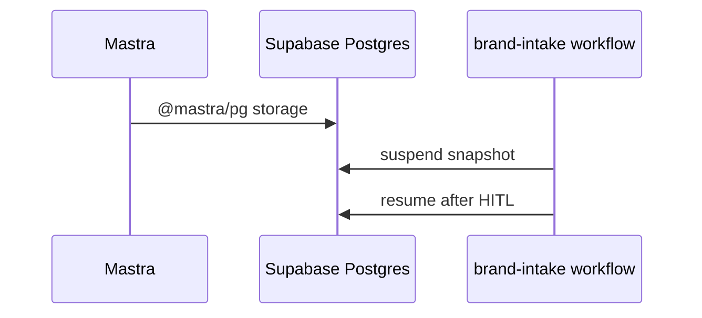

---

### Completion steps

- [ ] **A1** `SUPABASE_DB_URL` or pooler URL in Infisical for `app/`
- [ ] **A2** Configure Mastra storage in `app/src/mastra/index.ts`
- [ ] **A3** Workflow suspend/resume integration test
- [ ] **A4** Document rollback if migration fails

---

### Gantt

```mermaid
gantt
    title IPI-105 · AIOR-013
    dateFormat YYYY-MM-DD
    section Infra
    PG storage wiring    :crit, g1, 2026-06-28, 3d
```

*Source:* `docs/linear/issues/IPI-105-AIOR-013.md` | Done | 3 | Urgent | 73be1075-d57b-46ce-bdbe-563b896796af | AI Platform — Agents | ai@socialmediaville.ca | ai@socialmediaville.ca | MASTRA |  |  |  |  | 2026-06-25T07:13:56.452Z | 2026-07-04T06:51:48.379Z | 2026-06-25T21:05:25.543Z |  | 2026-06-25T22:35:16.915Z |  |  | 2026-06-26T07:13:57.348Z |  | IPIX-INIT-001 — Operator Platform (Q3 2026) | ca3e82a3-edd5-42d9-9001-387c7d786e3d | AGT-M1 · Runtime Foundation | Completed | 1668653e-4784-46c8-ac12-065170e38ca3 | 18953 | IPI-152, IPI-183, IPI-148, IPI-81, IPI-48, IPI-279, IPI-149, IPI-135, IPI-134, IPI-133 |  |  |
| IPI-48 | iPix1 | AIOR-001 · Mastra Runtime Foundation | ## AIOR-001 — Mastra Runtime Foundation

**Status (2026-06-25):** **Partially Done** — reconcile spec to in-process architecture.

**In plain terms:** **Engineer** runs Mastra inside the Next.js `app/` via `/api/copilotkit` — not a separate `services/agent` on :4111.

**Blocked by:** [PLT-003 / IPI-16](<https://linear.app/ipix/issue/IPI-16>) ✅ Done

**Unblocks:** AIOR-002, AIOR-004, AIOR-005, AIOR-013, AIOR-014, IPI-32

**MVP priority:** **P0 Must Have**

**Estimate:** 5 points (remaining: storage + CI)

**Source:** [`docs/copilotkit/09-linear-audit.md`](<../../copilotkit/09-linear-audit.md>) · [`docs/intelligence/copilotkit-mastra-plan.md`](<../../intelligence/copilotkit-mastra-plan.md>)

### Skills

| # | Skill | Path |
| -- | -- | -- |
| 1 | ipix-task-lifecycle | `.claude/skills/ipix-task-lifecycle/` |
| 2 | mastra | `.claude/skills/mastra/SKILL.md` |
| 3 | copilotkit | `.claude/skills/copilotkit/` → `references/integrations/integrations.md` |

---

### Flow — AIOR-001 (as-built)

```mermaid
sequenceDiagram
  participant N as Next.js app :3002
  participant RT as /api/copilotkit
  participant M as app/src/mastra
  participant G as Gemini via @ai-sdk/google
  N->>RT: CopilotKit v2 SSE
  RT->>M: MastraAgent.getLocalAgents()
  M->>G: production-planner / creative-director
```

**❌ Deprecated in spec:** Vite :8080 → `services/agent` :4111 proxy

---

### Completion steps

#### A. Done ✅

- [X] **A1** Mastra instance in `app/src/mastra/index.ts`
- [X] **A2** Agents: `production-planner`, `creative-director`
- [X] **A3** `/api/copilotkit/[[...slug]]/route.ts` with operator auth
- [X] **A4** Registry tests (`mastra/registry.test.ts`)

#### B. Remaining

- [ ] **B1** `@mastra/pg` durable storage — see [AIOR-013](<https://linear.app/ipix/issue/IPI-105>)
- [ ] **B2** Register `brand-intelligence` agent — see [AIOR-014](<https://linear.app/ipix/issue/IPI-106>)
- [ ] **B3** `mastra dev` + agent boot in CI (`app/package.json`)
- [ ] **B4** Remove stale references to `services/agent` in docs/scripts

#### C. Verify + ship

- [ ] **C1** `cd app && npm test && npm run build`
- [ ] **C2** CopilotKit SSE 200 on `/app` when authed
- [ ] **C3** Linear state: **Partially Done** until B1–B3 complete

**Spec score:** 72/100 — architecture drift corrected 2026-06-25

---

### Gantt — IPI-81

```mermaid
gantt
    title IPI-81 · AIOR-001 (reconciled)
    dateFormat YYYY-MM-DD
    section Done
    In-process Mastra + route    :done, g1, 2026-06-20, 5d
    section Remaining
    PG storage (AIOR-013)        :crit, g2, 2026-06-28, 3d
    brand agent (AIOR-014)       :g3, after g2, 4d
```

*Source:* `docs/linear/issues/IPI-81-AIOR-001.md` *· push via* `node scripts/linear-update-issue.mjs IPI-81` | Done | 5 | Urgent | 73be1075-d57b-46ce-bdbe-563b896796af | AI Platform — Agents | ai@socialmediaville.ca |  | AI, COPILOTKIT, MASTRA |  |  |  |  | 2026-06-14T12:18:15.303Z | 2026-07-04T06:52:00.599Z |  |  | 2026-06-22T14:53:43.382Z |  |  |  |  | IPIX-INIT-001 — Operator Platform (Q3 2026) | ca3e82a3-edd5-42d9-9001-387c7d786e3d | AGT-M1 · Runtime Foundation |  | e49d049d-172d-40f8-8a43-0a3e80d65122 | 23735 | IPI-132, IPI-130, IPI-129, IPI2-128, IPI-105, IPI-104, IPI-113, IPI-110, IPI2-129, IPI2-16, IPI-127, IPI2-176 |  |  |
| IPI-397 | iPix1 | BE-B0b · Booking Agent Verification & Finalization | ## BE-B0b — Booking Agent Verification & Finalization

**Track:** Backend · **Priority:** P2 (agent shipped, UI unblocks via [IPI-410](https://linear.app/amo100/issue/IPI-410/scr-21-booking-wizard)/411) · **Complexity:** S
**SSOT:** `tasks/backend/BE-B0b-booking-mastra-agent.md`
**Branch (agent code, shipped):** `ai/ipi-397-be-b0b-booking-mastra-agent-draft-only`
**Unblocks:** SCR-21 ([IPI-410](https://linear.app/amo100/issue/IPI-410/scr-21-booking-wizard)), SCR-22 ([IPI-411](https://linear.app/amo100/issue/IPI-411/scr-22-booking-detail))

This issue verifies and finalizes the booking Mastra agent. The backend implementation (agent + tools + registry + route mapping) is **95% shipped** on `main`. What remains is verification: draft-only guarantees, HITL gate, CopilotKit resolution, and snapshot tests.

---

## User story

> As an operator drafting a talent booking, I want the AI to draft messages and rate quotes based on the shoot brief and talent profile — without committing anything to the database — so I can review and approve before the booking is created.

---

## Data flow

```mermaid
sequenceDiagram
    participant O as Operator
    participant CK as CopilotKit Dock
    participant BA as booking Agent
    participant BT as booking-tools.ts
    participant DB as Supabase RPCs

    O->>CK: "Draft booking for Maria (Zara)"
    CK->>BA: getLocalAgents() → booking
    BA->>BT: checkTalentAvailability(talentId, dates)
    BT->>DB: search_talent + get_booking
    DB-->>BT: availability + rate card
    BT-->>BA: slots data
    BA->>BT: draftBookingQuote(talentId, brief, dates)
    BT-->>BA: rate quote + message draft (read-only, no RPC)
    BA-->>CK: HITL approval card
    CK->>O: Review draft quote
    Note over O,DB: Operator approves → createBookingDraft with operatorConfirmed: true
    O->>CK: Approve
    CK->>BA: createBookingDraft(operatorConfirmed: true)
    BA->>BT: createBookingDraft with operatorConfirmed: true
    BT->>DB: create_booking_request
```

---

## Current state (all verified on `main`)

### Agent infra — shipped

| Component | Path | Proof |
| -- | -- | -- |
| Agent definition | `app/src/mastra/agents/booking-agent.ts` | ✅ Exists on disk |
| Agent export | `app/src/mastra/agents/index.ts:58` | ✅ Exported |
| Registry | `app/src/mastra/index.ts:23` — `booking: bookingAgent` | ✅ Registered |
| Tools | `app/src/mastra/tools/booking-tools.ts` | ✅ 3 tools (checkTalentAvailability, draftBookingQuote, createBookingDraft) |
| Tool tests | `app/src/mastra/tools/booking-tools.test.ts` | ✅ 10 tests passing |
| Route mapping | `app/src/lib/route-agent-map.ts:16-18` | ✅ Maps /app/bookings, /app/model, /app/roster → "booking" |
| CopilotKit runtime | `api/copilotkit/[[...slug]]/route.ts` | ✅ getLocalAgents includes booking |

### Booking RPCs — shipped (do not recreate)

All verified on Supabase remote:

* `talent.bookings` + `version` optimistic lock
* `create_booking_request`, `transition_booking`, `confirm_booking`, `get_booking`, `list_bookings`
* `search_talent`, `toggle_shortlist_item`

---

## Draft-only guarantees (already shipped)

The agent is **hard-gated** against accidental writes:

| Guard | Location | What it does |
| -- | -- | -- |
| Agent instructions line 28 | `booking-agent.ts:28` | "You NEVER confirm or approve a booking — no confirm_booking tool exists" |
| Agent instructions line 29 | `booking-agent.ts:29` | "Never call createBookingDraft without explicit operator approval" |
| Tool schema guard | `booking-tools.ts:155-157` | `operatorConfirmed` must be `true` — documented in schema |
| Tool runtime guard | `booking-tools.ts:175-178` | Throws `Error` if `operatorConfirmed` is false — blocks write before RPC call |
| Test coverage | `booking-tools.test.ts:176-189` | Test asserts throw + no RPC call when `operatorConfirmed: false` |
| No confirm tool | `booking-tools.ts:3` | "Never expose confirm_booking — confirmation is human-only via POST .../approve" |
| Read-only tool | `booking-tools.ts:126` | `draftBookingQuote` described as "Read-only — does not write to the database" |
| Read-only impl | `booking-tools.ts:139` | `execute: async (input) => buildQuoteDraft(input)` — pure function, no DB call |

---

## Acceptance criteria

- [ ] A. Agent instructions explicitly enforce draft-only behavior (verified: ✅ already shipped, lines 28-31)
- [ ] B. Agent never invokes persistence RPCs without `operatorConfirmed: true` (verified: ✅ blocked at tool level, lines 175-178)
- [ ] C. HITL approval required before booking creation (verified: ✅ agent instructions + tool guard)
- [ ] D. Booking quote generation works: `draftBookingQuote` returns local draft, zero RPC calls (verified: ✅ pure function, test asserts no RPC)
- [ ] E. Availability lookup works: `checkTalentAvailability` calls RPC and returns candidate result (verified: ✅ tool + test)
- [ ] F. CopilotKit resolves `agentId="booking"` correctly from route-agent-map → Mastra registry → runtime (verify with `grep -rn '"booking"' app/src/mastra/`)
- [ ] G. Snapshot test added for agent instructions (`booking-agent.snapshot.test.ts`) to prevent prompt drift
- [ ] H. Integration test added: user → booking agent → availability → quote → draft returned → NO booking RPC
- [ ] I. `cd app && npm run lint && npm run typecheck && npm test` green
- [ ] J. Booking Wizard (SCR-21, [IPI-410](https://linear.app/amo100/issue/IPI-410/scr-21-booking-wizard)) and Booking Detail (SCR-22, [IPI-411](https://linear.app/amo100/issue/IPI-411/scr-22-booking-detail)) remain explicitly out of scope

---

## Out of scope

* Booking Wizard UI (SCR-21, [IPI-410](https://linear.app/amo100/issue/IPI-410/scr-21-booking-wizard)) — separate frontend task
* Booking Detail UI (SCR-22, [IPI-411](https://linear.app/amo100/issue/IPI-411/scr-22-booking-detail)) — separate frontend task
* Calendar sync or external booking integrations
* `/app/bookings`, `/app/model`, `/app/roster` page creation (route mapping already shipped)

---

## Suggested test additions

### Snapshot test: `booking-agent.snapshot.test.ts`

```typescript
// Verify agent instructions contain draft-only wording
// When instructions change, snapshot update requires explicit review
import { bookingAgent } from "./booking-agent";

it("instructions enforce draft-only behavior", () => {
  expect(bookingAgent.instructions).toContain("NEVER confirm or approve");
  expect(bookingAgent.instructions).toContain("operatorConfirmed");
  expect(bookingAgent.instructions).not.toContain("confirm_booking");
});
```

### Integration test

```typescript
// Verify end-to-end: user asks for draft → no RPC write
it("draft-only flow does not call persistence RPCs", async () => {
  const result = await bookingAgent.execute("Draft booking for Maria for Aug 1-3");
  // Assert: availability was checked
  // Assert: quote was drafted locally
  // Assert: NO create_booking_request was called (no operatorConfirmed)
});
```

### Regression test

```typescript
it('agent responds with draft, not confirmation, to "Book Maria"', async () => {
  const result = await bookingAgent.execute("Book Maria for Aug 1-3");
  expect(result.text).not.toMatch(/Booking created|Confirmed|Booked/i);
  expect(result.text).toMatch(/draft|prepared|ready|review/i);
});
```

---

## Verification

```bash
# Agent exists and is registered
grep -rn '"booking"' app/src/mastra/
# Should show: index.ts:23, agents/index.ts:58, route-agent-map.ts:16-18

# Existing tests pass
cd app && npx vitest run src/mastra/tools/booking-tools.test.ts
cd app && npx vitest run src/mastra/agents/index.test.ts

# Route agent map correct
grep -A1 "booking" app/src/lib/route-agent-map.ts

# Full app gate
cd app && npm run lint && npm run typecheck && npm test
```

## Skills

`mastra` · `copilotkit` · `gemini` · `task-verifier` · `ipix-task-lifecycle`

## Failure points (pre-mortem)

| Risk | Severity | Mitigation |
| -- | -- | -- |
| Agent accidentally writes bookings | 🔴 High | operatorConfirmed guard + instructions ban auto-commit |
| createBookingDraft tool performs persistence | 🟡 Medium | Intentional — only after operatorConfirmed: true |
| Route map drift (registry ↔ runtime ↔ agent map) | 🟡 Medium | grep verify in AC-F |
| RPC drift (agent calls wrong RPC) | 🟡 Medium | No booking RPC exists as tool without operatorConfirmed guard |
| Agent prompt drift removes draft-only wording | 🟢 Low | Snapshot test AC-G catches this |
 | Done | 3 | High | 1adb08a8-6c36-4bc9-8b47-2c9ffb827a89 | DESIGN V2 — Operator React Parity | ai@socialmediaville.ca | ai@socialmediaville.ca | AI, COPILOTKIT, DESIGNV2, MASTRA |  |  |  |  | 2026-07-06T09:36:45.708Z | 2026-07-07T14:35:28.911Z | 2026-07-07T13:54:09.226Z |  | 2026-07-07T14:35:28.886Z |  |  | 2026-07-13T09:36:46.572Z |  | IPIX-INIT-001 — Operator Platform (Q3 2026) | a3b8be45-5b64-4b60-92f2-c733831784b1 | DV2-M3 · Workspace Parity | Completed | abd5ed5d-3967-4b98-bbc8-693a68fb83a8 | 2153 | IPI-411, IPI-410, IPI-311 |  |  |
| IPI-368 | iPix1 | CRM-AI-002 · crm-assistant agent — wave 1 (search/log/move tools) | ## CRM-AI-002 — crm-assistant agent — wave 1 (search/log/move tools)

**In plain terms:** Register the `crm-assistant` Mastra agent with just enough tools to be minimally useful — search, log activity, move deals through the ungated stages — plus minimal CopilotKit wiring so chat works on every `/app/crm/*` screen before wave 2 IntelligencePanel work.

**Blocked by:** IPI-362, IPI-363, IPI-364 (hard) — IPI-365/IPI-366 loosened to soft per audit · **Unblocks:** IPI-369 · **Related:** IPI-367

**Ordering note (audit** `02-linear-audit.md` **G7):** deliberately NOT blocked by IPI-367 (won/lost gate) — wave-1's `moveDealStage` never touches terminal stages, and IPI-362's DB trigger independently blocks any attempt at the DB layer regardless of build order. Safe to ship before IPI-367.

**Skills:** `mastra` · `copilotkit` · `linear`

**Labels:** CRM · MASTRA · COPILOTKIT · AI

**Milestone:** CRM-M3 · crm-assistant Agent
**Spec:** `tasks/crm/plans/mastra-plan.md` · `tasks/crm/plans/copilotkit-plan.md` · `tasks/crm/03-crm-existing-state-audit.md` §AI Agents

---

### Flow

```mermaid
flowchart TD
  REG["Register crm-assistant + agentTools"] --> CTX["useAgentContext — current record only"]
  CTX --> T1[searchContacts]
  CTX --> T2[searchCompanies]
  CTX --> T3[logActivity]
  CTX --> T4["moveDealStage — ungated stages only"]
  REG --> MAP["route-agent-map: /app/crm/* → crm-assistant"]
  REG --> NAV["navigateTo frontend tool — CRM sections"]
```

---

### Completion steps

#### A. Scope and setup

- [ ] **A1** Confirm `REQUIRED_AGENT_IDS` in `mastra/index.ts` — proof: `crm-assistant` doesn't collide
- [ ] **A2** CRM tools registered via `app/src/mastra/tools/index.ts` (`agentTools` or `tools/crm/*` barrel) — proof: same pattern as `booking-agent.ts` / `model-match-agent.ts`

#### B. Implement (Mastra)

- [ ] **B1** Agent registered on `brand-intelligence-agent.ts` shape — imports tools from `agentTools`, not inline ad-hoc arrays — proof: diff to `agents/crm-assistant-agent.ts` + `agents/index.ts`
- [ ] **B2** 4 wave-1 tools under `tools/crm/`; `moveDealStage` cannot set `won`/`lost` under any call — proof: unit test
- [ ] **B3** All **Mastra** tools return `{ ok: false, error }` on handler failure, never re-throw — proof: unit tests + code review

#### C. Implement (CopilotKit — wave 1 minimal)

- [ ] **C1** `route-agent-map.ts` entry for `/app/crm/*` → `crm-assistant` — proof: diff + `route-agent-map.test.ts`
- [ ] **C2** `useAgentContext` providers on CRM list/detail routes (mirror `brand-context.tsx`) — current company/contact/deal id only — proof: code review
- [ ] **C3** `navigateTo` frontend tool: extend `operator-panel.tsx` CRM sections **or** CRM-scoped frontend tool with audited handler — proof: code review
- [ ] **C4** **CopilotKit frontend** tool handlers catch errors and return `{ ok: false, error }` — never re-throw (uncaught throw aborts the CopilotKit run). **Separate from B3** — Mastra vs frontend tool boundaries — proof: code review against `tasks/crm/plans/copilotkit-plan.md`

#### D. Integrate

- [ ] **D1** Context injection is precise (current record only) — not a full-pipeline dump — proof: code review against `tasks/crm/plans/mastra-plan.md`
- [ ] **D2** `getMastra()` not called at module top-level in any new route — proof: code review

#### E. Verify

- [ ] **E1** `cd app && npm run lint` — proof: green
- [ ] **E2** `cd app && npm test src/mastra` — proof: green
- [ ] **E3** `cd app && npm test src/lib/route-agent-map.test.ts` — proof: green
- [ ] **E4** `cd app && npx vitest run src/app/api/copilotkit/[[...slug]]/route.test.ts` — proof: green (minimal runtime smoke; agent registry resolves `crm-assistant`)

#### F. Ship

- [ ] **F1** Update `tasks/crm/todo.md` row #7 — proof: diff

---

### Gantt — IPI-368

```mermaid
gantt
  dateFormat YYYY-MM-DD
  section Build
  Agent + wave-1 tools + CopilotKit minimal :crit, b1, 2026-07-11, 2d
  section Verify
  Verify :crit, v1, after b1, 1d
  Done :milestone, m1, after v1, 0d
``` | Done |  | High | 51b8b9e3-a396-4bcf-a531-ef8b1ea3dce7 | CRM — Relationship Layer | ai@socialmediaville.ca | ai@socialmediaville.ca | AI, COPILOTKIT, CRM, MASTRA |  |  |  |  | 2026-07-04T07:01:20.462Z | 2026-07-07T09:25:41.501Z | 2026-07-04T10:06:54.263Z |  | 2026-07-05T18:55:32.053Z |  |  | 2026-07-11T07:01:38.667Z |  |  | 82d68607-87e5-4c4c-b0eb-1055e0e92c4c | CRM-M3 · crm-assistant Agent | Completed | 0cf7a954-3812-4219-b4c7-e0f78c5a6aed | 4773 | IPI-369, IPI-367, IPI-362, IPI-363, IPI-364, IPI-388, IPI-374 |  |  |
| IPI-348 | iPix1 | MODEL-GATE-10 — AI booking helper (copilot drafts, human confirms) | ## Purpose

Add the `booking` Mastra agent after backend RPC/API contracts exist, so AI can assist with booking drafts without taking final actions.

## Branch

Use `ipi/ipi-348-model-gate-10-booking-mastra-agent-and-tools` at git checkout. Linear auto-suggests `ai/ipi-348-model-gate-10-booking-mastra-agent-and-tools` — **always use** `ipi/`, not `ai/`.

## Scope

* Add `booking-agent.ts`.
* Add booking tools: `checkTalentAvailability`, `draftBookingQuote`, `createBookingDraft`.
* Register `booking` agent in Mastra index and required agent IDs.
* Add route-agent mapping for booking wizard/detail/model/roster routes.
* **Mutations call RPCs only**; read-only helpers may use API routes.

## Out of scope

* No UI.
* No direct `confirm_booking` tool.
* No auto-send without HITL.
* No pgvector semantic matching.

## Source docs

* `tasks/models/design/12-design-engineering-reference.md`
* `tasks/models/engineering/api-contracts.md`
* `tasks/models/engineering/rpc-contracts.md`

## Mermaid flow

```mermaid
sequenceDiagram
  participant UI as OperatorChatDock
  participant CK as CopilotKit
  participant MA as booking agent
  participant API as booking API/RPC
  UI->>CK: ask for booking help
  CK->>MA: route to booking
  MA->>API: check/draft/create request
  API-->>MA: safe draft/result
  MA-->>UI: HITL recommendation
```

## Files likely touched

* `app/src/mastra/tools/booking-tools.ts`
* `app/src/mastra/agents/booking-agent.ts`
* `app/src/mastra/agents/index.ts`
* `app/src/lib/route-agent-map.ts`
* `app/src/mastra/tools/booking-tools.test.ts`

## AI safety rules

* AI can draft and recommend.
* AI cannot confirm.
* AI cannot bypass `transition_booking` or booking API.
* User approval required before request/counter/cancel.

## Tests

```bash
cd app && npm test -- booking-agent
cd app && npm run typecheck
cd app && npm run lint
```

## Success criteria

* `booking` agent is registered.
* Route map resolves booking screens to `booking`.
* Tools use user-scoped auth where `auth.uid()` is required.
* No service-role misuse in tools.
* Human-in-the-loop boundaries are encoded in descriptions/tests.

## Risk

🟡 Medium — AI safety depends on respecting backend boundaries and route mapping.

## Audit corrections (2026-07-03)

Source: `tasks/models/audit/03-model-gate-audit.md`

**Branch:** Use `ipi/ipi-XXX-short-name` (not `ai/ipi-XXX-...`).

* Tools use `requestToken` **+ user-scoped Supabase client** (see `talent-match-tools.ts`) — never service_role.
* Mutations call **RPCs**, not REST (read-only helpers may use API).
* Route prefixes to register (longest-first): `/app/matching/talent/*/book`, `/app/bookings`, `/app/model`, `/app/roster`.
* Register `booking` in Mastra index with same id as route map + CopilotKit `useAgent`. | Done |  | High | 9f12c38f-b20d-492a-ba5b-dd886e8fafef | Model Booking MVP | ai@socialmediaville.ca | ai@socialmediaville.ca | AI, COPILOTKIT, GEMINI, MASTRA, MODEL, MODELGATE, phase:mvp |  |  |  |  | 2026-07-03T19:04:56.617Z | 2026-07-07T10:18:29.384Z | 2026-07-04T09:03:56.609Z |  | 2026-07-07T10:18:29.368Z |  |  | 2026-07-10T19:04:57.225Z |  | IPIX-INIT-001 — Operator Platform (Q3 2026) | c39cab39-988b-4acc-a1e0-8e65ff7b5919 | M5 · Launch | Completed | a94ca86d-d6c7-482c-985c-b88a58f1c7f6 | 2410 | IPI-341, IPI-344, IPI-340, IPI-342 |  |  |
| IPI-308 | iPix1 | MODEL-P2 — Matching Talent Tab, Swipe/List Discovery, and Shortlist | **Bundles implementation tasks:** `MODEL-009`–`MODEL-013a` from `06-model-booking-implementation-plan.md` Phase 2.

## Context

`/app/matching` renders only a `SectionPlaceholder` today (verified — no Creator/Asset/Product tab code exists, only design specs). This phase replaces it with a real tab shell, Talent tab active, the other 3 disabled — not a "patch" onto an existing built screen as originally assumed.

## Scope

* Replace `/app/matching` placeholder with a tab shell
* Talent tab active; Creator/Asset/Product disabled, "Coming soon — [IPI2-123](https://linear.app/amo100/issue/IPI2-123/match-001-brand-matching-engine-pgvector)" tooltip (building those now would jump that issue's own gate)
* `TalentCard` (swipe 3:4 + dense table row variants), filter bar (booking-local, plain Selects — no shared `FilterBar` exists)
* Swipe/list toggle, minimal Shortlist drawer (`talent_shortlists`/`talent_shortlist_items`)
* `EvidenceBlock` fit explanation (real, existing component — reused as-is)
* Model Match Agent registered (`model-match`), `route-agent-map.ts` repointed from `social-discovery` (low risk — nothing production-real depended on that mapping, the route was a placeholder)
* Filter-based MVP matching — **no pgvector semantic ranking yet** (gated on [IPI2-123](https://linear.app/amo100/issue/IPI2-123/match-001-brand-matching-engine-pgvector))

## Out of scope

Creator/Asset/Product tab content, embedding-based match, casting board (compare/share/bulk-attach — `BOOK-109` Post-MVP), a new top-level nav item.

## Implementation steps

1. `searchTalentByFilters` + `computeTalentMatchScore` tools.
2. Register Model Match Agent, repoint routing.
3. Build tab shell + disabled tabs.
4. Build `TalentCard` + Talent tab content + shortlist.

## Files likely touched

`app/src/app/(operator)/app/matching/page.tsx`, `app/src/components/matching/{talent-tab,talent-card,talent-match-tabs,shortlist-list}.tsx`, `app/src/mastra/agents/model-match-agent.ts`, `app/src/mastra/tools/talent-match-tools.ts`, `app/src/lib/route-agent-map.ts`.

## Required skills

`mastra`, `copilotkit`, `mermaid-diagrams`, `ipix-wireframe`.

## Dependencies

Blocked by `MODEL-P1` (needs `talent_profiles`/`talent_availability`/shortlist tables).

## User journey impact

```mermaid
flowchart LR
  A[Open /app/matching] --> B[Talent Tab]
  B --> C[Swipe/List Talent Cards]
  C --> D[Save to Shortlist]
  D --> E[Open Profile]
  E --> F[Request Booking]
```

## Wireframe reference

`tasks/models/04-model-booking-wireframes.wire` (`matching-tab-shell`, `shortlist-list` blocks). Design prompt: `tasks/models/design/11a-model-booking-matching-talent.md`.

## Tests

```bash
cd app && npm run lint
cd app && npm run typecheck
cd app && npm test
```

## Success criteria

* Users can browse and shortlist models.
* AI explanation appears in `EvidenceBlock`, not a bespoke popover.
* No new top-level "Talent Marketplace" nav item.
* Creator/Asset/Product tabs are visibly inert (not a dead click).

## Risk level

**Medium** — first real usage of `EvidenceBlock` outside its existing screens; confirm its prop contract handles a match-score context without modification.

## Related docs

`tasks/models/03-model-booking-fit-and-flows.md` (Fit Map key finding) · `06-model-booking-implementation-plan.md` Phase 2, Blockers #5/#6. | Done |  | High | 9f12c38f-b20d-492a-ba5b-dd886e8fafef | Model Booking MVP | ai@socialmediaville.ca | ai@socialmediaville.ca | AI, COPILOTKIT, DESIGN, GEMINI, MASTRA, MODEL, phase:mvp |  |  |  |  | 2026-07-01T17:40:25.166Z | 2026-07-04T06:46:46.071Z | 2026-07-01T19:52:08.967Z |  | 2026-07-02T16:29:12.149Z |  |  | 2026-07-08T17:40:26.135Z |  | IPIX-INIT-001 — Operator Platform (Q3 2026) | 28c6cce6-f013-403b-ab3a-e0784452558e | M2 · Matching | Completed | 1cfbc04c-b3ff-4150-b6f2-1e356ef37af5 | 9239 | IPI-313, IPI2-123, IPI-307 |  |  |
| IPI-272 | iPix1 | DESIGN-052 · Brand List — React Parity Workspace | ## Overview

Port `/app/brand` to DC **Brand List** — BrandCard grid, SearchBar, FilterBar, OperatorShell.

**Full spec:** [`docs/linear/issues/IPI-272-brand-list-workspace.md`](<https://github.com/amo-tech-ai/lumina-studio/blob/main/docs/linear/issues/IPI-272-brand-list-workspace.md>)

**Wireframe:** `tasks/wireframes-ipix/IPI-272-DESIGN-052-brand-list.wire`

**Disk verified (2026-06-30):** Functional server list ~160 LOC exists — **refactor layout, preserve Supabase fetch**. Hardcoded `#E87C4D` · no OperatorShell · no BrandCard grid.

---

## Route

`/app/brand`

## Dependencies

| Type | Issues |
| -- | -- |
| **Done** | IPI-247 ✅ · IPI-243 ✅ · IPI-255 ✅ |
| **Soft** | IPI-270 tokens · IPI-275 dock · IPI-271 detail |
| **NOT owner** | [IPI-23](https://linear.app/amo100/issue/IPI-23) Epic 4 — index only |

## Skills

frontend-design · shadcn · copilotkit · task-verifier · ipix-wireframe

---

## Acceptance (summary)

- [ ] BrandCard grid · search/filter · remove hardcoded hex
- [ ] OperatorShell 3-panel · IntelligencePanel
- [ ] 5 states on grid
- [ ] Browser + task-verifier (Playwright when IPI-258 infra lands)

---

# Implementation Prompt Pack (2026-06-30)

**Worktree:** `ipi/272-brand-list` · `../wt-ipi-272-brand-list`
**Design ref:** `Brand List.v2.image-first.dc.html` · `BrandCard.dc.html` · handoff/11 Brand List

## User stories

* As an **agency operator**, I search/filter brands by DNA health and intake status before opening a hub.
* As a **developer**, I refactor layout only — **preserve existing Supabase queries**, no duplicate fetch logic.

## Screen map

```mermaid
flowchart TD
  BL[/app/brand] -->|open card| BD[/app/brand/:id IPI-271]
  BL -->|Analyse| BI[brand-intelligence IPI-260]
  FB[FilterBar] --> BL
  SB[SearchBar] --> BL
  BL --> Shell[OperatorShell + IPI-243 panel]
```

## Desktop wireframe

```
┌ Nav ─┬──────── Brands ────────────────────────────────┬─ Intel ─┐
│ rail │ Brands                        [+ Add brand]    │ Tips    │
│      │ Search…  [All][Ready][Analysing][Failed]       │         │
│      │ ┌ BrandCard ┐ ┌ BrandCard ┐ ┌ BrandCard ┐      │         │
│      │ │ cover DNA │ │ cover DNA │ │  no data  │      │         │
│      │ └───────────┘ └───────────┘ └───────────┘      │         │
│      │ PersistentChatDock (IPI-275 soft)              │         │
└──────┴────────────────────────────────────────────────┴─────────┘
```

## Implementation steps (Test block each)

| Step | Prompt | Test / proof |
| -- | -- | -- |
| **A** | Wrap existing Supabase fetch in OperatorShell — **do not duplicate queries** | data unchanged |
| **B** | Replace `<Link>` rows with BrandCard grid per DC | visual 1440 |
| **C** | SearchBar + FilterBar (status: ready/analysing/failed) | filter combinatorics |
| **D** | Card states: has-data · no-data · analysing · loading · error | 5 states |
| **E** | Remove hardcoded hex — semantic tokens (IPI-270 soft) | `rg '#[0-9a-fA-F]'` = 0 |

## Verification

```bash
cd app && npm run lint && npm test && npm run build
# manual: /app/brand — search + filter + card navigation
# Playwright: defer until IPI-258 bootstrap
```

## Out of scope

Onboarding (IPI-46) · Brand Detail (IPI-271) · org creation (IPI-16)

## Evidence required

`docs/ecommerce/evidence/YYYY-MM-DD/ipi-272-brand-list/`

---

## Wireframe (ASCII — must match DC)

**SSOT:** `Universal-design-prompt-new/tasks/screens/wireframes/SCR-02-brand-list.md`

# SCR-02 wireframe — Brand List

> **SSOT:** [`Brand List.v2.image-first.dc.html`](../../../Pages/Brand List.v2.image-first.dc.html) · Method: [`ipix-wireframe`](<../../../../.claude/skills/ipix-wireframe/SKILL.md>)
> **Rule:** ASCII zones must match DC `grid-template-columns` and Workspace blocks — not invented layout.

## Shell archetype

| Field | Value |
| -- | -- |
| Archetype | `standard-v2` |
| DC grid | `auto | minmax(0,1fr) auto` |
| Intelligence width | 340px |

## ASCII layout (lo-fi)

```text
+----------+---------------------------+------------+
| NavSidebar| Workspace (flex)         | Intelligence|
| collapsible|                        | Panel 340px|
| auto width |                        |            |
+----------+---------------------------+------------+
|          | PageHeader + New brand                  |            |
|          | Search + FilterBar                      |  Digest /  |
|          | 3-col BrandCard grid                    |  actions   |
|          |                                         |            |
+----------+---------------------------+------------+
DC grid: auto | minmax(0,1fr) auto
Mobile @1024: Nav→tab bar · Intel→bottom sheet
```

## Workspace zones (from DC)

| # | Zone | React target |
| -- | -- | -- |
| 1 | PageHeader + New brand | `*-workspace.tsx` region |
| 2 | Search + FilterBar | `*-workspace.tsx` region |
| 3 | 3-col BrandCard grid | `*-workspace.tsx` region |

## States to implement

- [ ] grid
- [ ] empty
- [ ] no-match
- [ ] loading

## Zone spec table

| Zone | Interaction | Data | Empty |
| -- | -- | -- | -- |
| PageHeader + New brand | *from DC* | *§0 Prove* | *EmptyState* |
| Search + FilterBar | *from DC* | *§0 Prove* | *EmptyState* |
| 3-col BrandCard grid | *from DC* | *§0 Prove* | *EmptyState* |
 | Done |  | High | 1adb08a8-6c36-4bc9-8b47-2c9ffb827a89 | DESIGN V2 — Operator React Parity | ai@socialmediaville.ca |  | BRAND, COPILOTKIT, DESIGN, DESIGNV2, FRONTEND, HTML, MASTRA, QA, UX |  |  |  |  | 2026-06-30T09:04:23.134Z | 2026-07-06T09:51:15.592Z | 2026-07-02T17:43:15.051Z |  | 2026-07-06T09:07:02.763Z |  |  | 2026-07-08T13:16:26.301Z | IPI-254 | IPIX-INIT-001 — Operator Platform (Q3 2026) | a3b8be45-5b64-4b60-92f2-c733831784b1 | DV2-M3 · Workspace Parity | Completed | 69a44345-29a3-4570-9b03-5538ef4a2595 | 3921 | IPI-258, IPI-243, IPI-275, IPI-270, IPI-271, IPI-247, IPI-260, IPI-23 |  |  |
| IPI-274 | iPix1 | DESIGN-056 · Shoot Wizard — React Parity Workspace | # IPI-274 · DESIGN-056 — Shoot Wizard React Parity

**Parent:** [IPI-254](https://linear.app/amo100/issue/IPI-254) · **Supersedes:** [IPI-87](https://linear.app/amo100/issue/IPI-87) (Canceled)
**Repo spec:** `docs/linear/issues/IPI-274-shoot-wizard-workspace.md`
**Conversion plan (execution SSOT):** `tasks/design-docs/shoot/PLAN/shoot-wizard-dc-conversion.md`
**Wireframe:** `tasks/wireframes-ipix/IPI-274-DESIGN-056-shoot-wizard.wire`
**Step decision:** `tasks/design-docs/shoot/IPI-252-wizard-step-decision.md` — **6 steps in scope**

## Scope contract (read first)

**IPI-274 is a visual reskin of the existing 6-step shoot wizard only.** Preserve all existing behavior. Do **not** add new steps, backend logic, AI tools, API routes, schema/migrations, or the booking flow. "Done" means visual parity with the DC chrome — **not** feature expansion.

## Core rule

**Don't code from Linear text alone.** Prove disk + Supabase + browser first. **HTML design wins for layout.**

**Shell:** `OperatorPanel` already wraps `/app/shoots/new` — work is **center workspace chrome only** (same as brand PR #181). Do **not** rebuild NavSidebar or IntelligencePanel.

## Production state (2026-07-05)

| Area | Status |
| -- | -- |
| Route | ✅ `shoots/new/page.tsx` ~824 LOC (client monolith, keep client) |
| 6-step HITL | ✅ 3 approval cards + Mastra workflow |
| WizardStep DC chrome | ❌ inline stepper |
| Tokens / hex debt | ❌ `#FBF8F5` on page |

## File inventory (verified 2026-07-05)

**May edit (restyle only):**

* `app/src/app/(operator)/app/shoots/new/page.tsx` — extract inline styles → CSS module, keep all handlers; stays a client component (do **not** refactor to RSC)
* `app/src/components/shoot/shoot-wizard.module.css` — **CREATE**
* `app/src/components/shoot/hitl/*ApprovalCard.tsx` (×3) — restyle only

**Must NOT edit:** `mastra/workflows/shoot-wizard.ts` · `api/shoots/commit|suggest-brief|[shootId]/route.ts` · `shoot-wizard-context.tsx` · shell/nav/intel/dock · migrations · `types/supabase.ts`

## Acceptance criteria

* Center workspace matches DC `WizardStep` chrome across all 6 steps at 1440 / 1024 / 390
* Zeely tokens only — zero `#FBF8F5` / legacy hex in changed files
* Existing behavior preserved (see regression checklist below)
* §9 parity scorecard filled 🟢 (Layout · Typography · Tokens · States · Responsive · A11y) with side-by-side screenshots

## Regression checklist (must still pass after reskin)

- [ ] Back / Continue navigation between all 6 steps
- [ ] 3 HITL gates still block progression until approved
- [ ] Edit / approve draft in each approval card
- [ ] Brief autogeneration (`suggest-brief`) unchanged
- [ ] Commit + redirect to `/app/shoots/[id]`
- [ ] Dirty-exit warning fires
- [ ] Only existing endpoints called — no new routes

## Scope

* Extract **WizardStep** · apply Zeely tokens · polish **OperatorChatDock** step context
* Preserve 6-step Mastra HITL — **no workflow rewrite**
* 10-step DC expansion → [IPI-252](https://linear.app/amo100/issue/IPI-252) · booking flow → IPI-340/341/342

## Skills (mandatory)

`ipix-task-lifecycle` · `design-to-production` · `design-md` · `frontend-design` · `ipix-wireframe` · `mermaid-diagrams` · `fashion-production` · `task-verifier` · `worktrees` · `copilotkit` · `mastra` · `gemini` · `gen-test`

## Verification

```bash
cd app && npm run lint && npm test && npm run build
npx playwright test e2e/shoot-wizard.spec.ts
```

Serve DC on `:8765` beside app on `:3002` (as `qa@ipix.test`), screenshot each of the 6 steps + every state at 1440/1024/390, fill §9 parity scorecard.

Evidence: `docs/ecommerce/evidence/2026-07-05/ipi-274-shoot-wizard/`

---

## Wireframe (ASCII — must match DC)

**SSOT:** `Universal-design-prompt-new/tasks/screens/wireframes/SCR-06-shoot-wizard.md`

# SCR-06 wireframe — Shoot Wizard

> **SSOT:** [`Shoot Wizard.v2.image-first.dc.html`](../../../Pages/Shoot Wizard.v2.image-first.dc.html) · Method: [`ipix-wireframe`](<../../../../.claude/skills/ipix-wireframe/SKILL.md>)
> **Rule:** ASCII zones must match DC `grid-template-columns` and Workspace blocks — not invented layout.

## Shell archetype

| Field | Value |
| -- | -- |
| Archetype | `wizard-full` |
| DC grid | `flex column 100vh` |
| Intelligence width | — |

## ASCII layout (lo-fi)

```text
+--------------------------------------------------+
| Topbar · step indicator · save/back              |
+----------+---------------------------------------+
| Sticky   | Step workspace                        |
| summary  | 266px sticky left summary                         |
| ~266px   |                                       |
+----------+---------------------------------------+
| PersistentChatDock (CopilotKit)                  |
+--------------------------------------------------+
DC: flex column 100vh — no 3-panel shell
```

## Workspace zones (from DC)

| # | Zone | React target |
| -- | -- | -- |
| 1 | Topbar steps (6 ship scope) | `*-workspace.tsx` region |
| 2 | 266px sticky left summary | `*-workspace.tsx` region |
| 3 | Step content + review grid | `*-workspace.tsx` region |

## States to implement

- [ ] step 1–6
- [ ] validation error
- [ ] review commit

## Zone spec table

| Zone | Interaction | Data | Empty |
| -- | -- | -- | -- |
| Topbar steps (6 ship scope) | *from DC* | *§0 Prove* | *EmptyState* |
| 266px sticky left summary | *from DC* | *§0 Prove* | *EmptyState* |
| Step content + review grid | *from DC* | *§0 Prove* | *EmptyState* |
 | Done |  | High | 1adb08a8-6c36-4bc9-8b47-2c9ffb827a89 | DESIGN V2 — Operator React Parity | ai@socialmediaville.ca | ai@socialmediaville.ca | COPILOTKIT, DESIGN, DESIGNV2, FRONTEND, GEMINI, HTML, MASTRA, QA, SHOOT, UX |  |  |  |  | 2026-06-30T09:04:30.625Z | 2026-07-06T09:51:16.279Z | 2026-07-05T05:44:29.207Z |  | 2026-07-05T23:33:17.971Z |  |  | 2026-07-07T09:11:33.325Z | IPI-254 | IPIX-INIT-001 — Operator Platform (Q3 2026) | a3b8be45-5b64-4b60-92f2-c733831784b1 | DV2-M3 · Workspace Parity | Completed | c03e8e1c-80a2-4427-83e4-bac9769097d7 | 4495 | IPI-420, IPI-258, IPI2-117, IPI-246, IPI-112, IPI-275, IPI-149, IPI-252, IPI-209, IPI-84, IPI-184, IPI-183, IPI-384, IPI-85, IPI-88, IPI2-112, IPI2-110, IPI2-113, IPI2-128, IPI-111, IPI-148, IPI-131, IPI-273 |  |  |
| IPI-271 | iPix1 | DESIGN-051 · Brand Detail — React Parity Workspace | ## Overview

Upgrade `/app/brand/[id]` from IPI-30 BI tabs to full DC **Brand Detail** with EvidenceBlock on DNA pillars.

**Full spec:** [`docs/linear/issues/IPI-271-brand-detail-workspace.md`](<https://github.com/amo-tech-ai/lumina-studio/blob/main/docs/linear/issues/IPI-271-brand-detail-workspace.md>)

**Wireframe:** `tasks/wireframes-ipix/IPI-271-DESIGN-051-brand-detail.wire`

**Disk verified (2026-06-30):** IPI-30 `BrandHubClient` tabbed hub with real BI data ✅ — **re-skin inside OperatorShell, do not rewrite data hooks**.

---

## Route

`/app/brand/[id]`

## Dependencies

| Type | Issues |
| -- | -- |
| **Done** | IPI-30 ✅ BI baseline · IPI-247 ✅ route map · IPI-246 ✅ EvidenceBlock component |
| **Soft** | IPI-260 agent wiring · IPI-275 dock · IPI-251 mobile · IPI-248 asset preview strip |
| **NOT owner** | [IPI-23](https://linear.app/amo100/issue/IPI-23) Epic 4 — index only |

## Skills

frontend-design · shadcn · gemini · copilotkit · mastra · task-verifier

---

## Acceptance (summary)

- [ ] EvidenceBlock wired on pillar click (`@/components/evidence-block`)
- [ ] OperatorShell 3-panel · DC Zeely layout
- [ ] 5 states · Plan a Shoot preserves `?brand=` query param
- [ ] Re-skin only — preserve `brand-hub-client.tsx` data layer
- [ ] Browser + task-verifier

---

# Implementation Prompt Pack (2026-06-30)

**Worktree:** `ipi/271-brand-detail` · `../wt-ipi-271-brand-detail`
**Design ref:** `Brand Detail.v2.image-first.dc.html` · `EvidenceBlock.dc.html` · handoff/11 Brand Detail

## User stories

* As a **brand manager**, I see DNA hero + pillar grid with transparent evidence on every score click.
* As a **producer**, I launch Plan a Shoot with brand context pre-filled in the wizard.
* As a **developer**, I re-skin IPI-30 data hooks — **no rewrite** of Supabase queries or tab logic.

## User journey

```mermaid
sequenceDiagram
    actor Op as Operator
    participant BL as Brand List IPI-272
    participant BD as Brand Detail
    participant EB as EvidenceBlock
    participant Dock as Chat IPI-275
    Op->>BL: filter Ready brands
    Op->>BD: open brand card
    Op->>BD: click DNA pillar
    BD->>EB: show evidence modal
    Op->>Dock: Explain weakest pillar
```

## State diagram

```mermaid
stateDiagram-v2
    [*] --> Loaded
    Loaded --> Analysing: Re-analyze
    Analysing --> Loaded: success
    Analysing --> Error: fail
    Error --> Analysing: Retry
    Loaded --> Approval: pending draft
```

## Implementation steps (Test block each)

| Step | Prompt | Test / proof |
| -- | -- | -- |
| **A** | Wrap IPI-30 page in OperatorShell — preserve server data fetch | data unchanged |
| **B** | DC layout: DNA hero + pillar grid — **wire** `<EvidenceBlock />` **on pillar click** | modal shows pillars |
| **C** | Breadcrumb → Brand List · Plan a Shoot → `/app/shoots/new?brand=` | query param preserved |
| **D** | AssetCard preview strip (read-only — full library IPI-248) | 6 tiles render |
| **E** | 5 states: loaded · analysing · error · no-data · approval | state matrix |
| **F** | Zeely tokens · no hardcoded hex | grep hex = 0 |

## Verification

```bash
cd app && npm run lint && npm test && npm run build
# manual: /app/brand/[id] — pillar explain + Plan Shoot + mobile 375px
# Playwright: defer until IPI-258 bootstrap
```

## Out of scope

Full asset library (IPI-248) · BI schema v2 (IPI-26) · re-analyze edge changes (IPI-46 ✅)

## Evidence required

`docs/ecommerce/evidence/YYYY-MM-DD/ipi-271-brand-detail/`

---

## Wireframe (ASCII — must match DC)

**SSOT:** `Universal-design-prompt-new/tasks/screens/wireframes/SCR-03-brand-detail.md`

# SCR-03 wireframe — Brand Detail

> **SSOT:** [`Brand Detail.v2.image-first.dc.html`](../../../Pages/Brand Detail.v2.image-first.dc.html) · Method: [`ipix-wireframe`](<../../../../.claude/skills/ipix-wireframe/SKILL.md>)
> **Rule:** ASCII zones must match DC `grid-template-columns` and Workspace blocks — not invented layout.

## Shell archetype

| Field | Value |
| -- | -- |
| Archetype | `standard-v2` |
| DC grid | `auto | minmax(0,1fr) auto` |
| Intelligence width | 332px |

## ASCII layout (lo-fi)

```text
+----------+---------------------------+------------+
| NavSidebar| Workspace (flex)         | Intelligence|
| collapsible|                        | Panel 332px|
| auto width |                        |            |
+----------+---------------------------+------------+
|          | Hero image + chips                      |            |
|          | Tab bar                                 |  Digest /  |
|          | Tab panel (Overview/DNA/Shoots/Assets)  |  actions   |
|          |                                         |            |
+----------+---------------------------+------------+
DC grid: auto | minmax(0,1fr) auto
Mobile @1024: Nav→tab bar · Intel→bottom sheet
```

## Workspace zones (from DC)

| # | Zone | React target |
| -- | -- | -- |
| 1 | Hero image + chips | `*-workspace.tsx` region |
| 2 | Tab bar | `*-workspace.tsx` region |
| 3 | Tab panel (Overview/DNA/Shoots/Assets) | `*-workspace.tsx` region |

## States to implement

- [ ] tab switch
- [ ] crawl progress
- [ ] empty tab

## Zone spec table

| Zone | Interaction | Data | Empty |
| -- | -- | -- | -- |
| Hero image + chips | *from DC* | *§0 Prove* | *EmptyState* |
| Tab bar | *from DC* | *§0 Prove* | *EmptyState* |
| Tab panel (Overview/DNA/Shoots/Assets) | *from DC* | *§0 Prove* | *EmptyState* |
 | Done |  | High | 1adb08a8-6c36-4bc9-8b47-2c9ffb827a89 | DESIGN V2 — Operator React Parity | ai@socialmediaville.ca |  | AI, BRAND, COPILOTKIT, DESIGN, DESIGNV2, FRONTEND, GEMINI, HTML, MASTRA, QA, UX |  |  |  |  | 2026-06-30T09:04:19.740Z | 2026-07-06T09:51:14.834Z | 2026-07-02T17:43:17.499Z |  | 2026-07-06T09:07:02.033Z |  |  | 2026-07-08T13:16:23.914Z | IPI-254 | IPIX-INIT-001 — Operator Platform (Q3 2026) | a3b8be45-5b64-4b60-92f2-c733831784b1 | DV2-M3 · Workspace Parity | Completed | 5ed5a7c7-f54c-49fc-8f4b-0b82e79937d3 | 3921 | IPI-258, IPI-246, IPI-248, IPI-275, IPI-260, IPI-247, IPI-46, IPI-30, IPI-172, IPI-272, IPI-23 |  |  |
| IPI-246 | iPix1 | DESIGN-046 · EvidenceBlock — AI Explainability Component | ## Overview

Port canonical **EvidenceBlock** from Claude Design — single explainability surface across Brand Detail, Assets, Campaigns, Matching, Channel Preview.

**Tracker:** DESIGN-046 · `tasks/design-docs/design/AI-EXPLAINABILITY.md`

---

## Dependency correction (2026-06-30)

**Blocked by:** IPI-47 partial OK — mock structured payload acceptable until Gemini foundation Done.

**Does NOT block:** IPI-247 route map · IPI-243 panel shell · IPI-261/262/263 agent route wiring (only explain UX on scores)

---

## Acceptance criteria

- [ ] Single component `app/src/components/evidence-block/` — no forks
- [ ] HITL Approve/Reject gates AI re-score
- [ ] Wired on 5 screens (one PR per screen or grouped by route)
- [ ] Mobile sheet ≤1024px
- [ ] Browser + Playwright smoke + task-verifier

---

## Execution

**Type:** Frontend · **Batch 1 #1**

**Blocks:** IPI-248–250 explain flows · IPI-209 Assets tab · IPI-269 preview explain

**Depends on:** IPI-47 partial (waiver OK with mock data)

**SSOT:** MASTER-DEPENDENCIES | Done |  | High | 1adb08a8-6c36-4bc9-8b47-2c9ffb827a89 | DESIGN V2 — Operator React Parity | ai@socialmediaville.ca | ai@socialmediaville.ca | AI, COPILOTKIT, DESIGN, DESIGNV2, GEMINI, MASTRA, SUPA, UX |  |  |  |  | 2026-06-30T06:08:20.736Z | 2026-07-03T02:44:02.719Z | 2026-06-30T07:38:18.464Z |  | 2026-06-30T10:30:20.652Z |  |  | 2026-07-07T06:08:21.873Z |  | IPIX-INIT-001 — Operator Platform (Q3 2026) | 564f6a39-e763-4067-aed2-0926e33c3d3e | DV2-M1 · Shared Spine | Completed | 2c00eff7-d79c-44b8-91a1-77f194344bb9 | 12499 | IPI-152, IPI-107, IPI-47, IPI-274, IPI-269, IPI-271, IPI-250, IPI-249, IPI-248, IPI-244, IPI-172, IPI-261, IPI-263, IPI-262, IPI-209, IPI-243, IPI-265 |  |  |
| IPI-247 | iPix1 | DESIGN-070 · Route-Agent Map Parity — Assets, Matching, Preview | ## Overview

Fix **route → Mastra agent** mismatches per `tasks/design-docs/plan/AGENT-MAP.md`. Code: `app/src/lib/route-agent-map.ts`

**Note:** [IPI-51](https://linear.app/amo100/issue/IPI-51) shipped baseline map — this issue closed **remaining gaps** (not a duplicate re-do).

**Does NOT require IPI-246** — route map is independent of EvidenceBlock.

---

## Shipped — 2026-06-30 (audit sync)

**PR #147** · commit `5221ee2` · merged to `origin/main`

| Route | AGENT-MAP target | Prod (main) | Status |
| -- | -- | -- | -- |
| `/app/assets` | creative-director | creative-director | ✅ |
| `/app/matching` | social-discovery | social-discovery | ✅ |
| `/app/preview` | visual-identity | visual-identity | ✅ |
| `/app/onboarding` | brand-intelligence | brand-intelligence | ✅ |

Tests: `app/src/lib/route-agent-map.test.ts` green on main.

**Follow-up (docs batch):** refresh `AGENT-MAP.md` prod column — code SSOT is ahead of design doc.

---

## Acceptance criteria

- [X] All four routes resolve per AGENT-MAP
- [X] Unit tests green
- [ ] AGENT-MAP.md prod column updated *(docs batch · DESIGN-017)*
- [ ] Browser smoke: greeting/agent changes per route
- [X] No regression on `/app/shoots` · `/app/brand` · `/app/campaigns`

---

## Execution

**Type:** AI

**Depends on:** IPI-51 ✅ · Mastra agents registered ✅

**Unblocks:** IPI-259–263 · IPI-255 · IPI-248 · IPI-250 · IPI-197

**Verification:** `cd app && npm test src/lib/route-agent-map.test.ts`

**SSOT:** MASTER-DEPENDENCIES · Batch 1 #2 | Done |  | High | 1adb08a8-6c36-4bc9-8b47-2c9ffb827a89 | DESIGN V2 — Operator React Parity | ai@socialmediaville.ca | ai@socialmediaville.ca | AI, COPILOTKIT, DESIGN, DESIGNV2, MASTRA |  |  |  |  | 2026-06-30T06:08:24.501Z | 2026-07-01T15:26:18.161Z | 2026-06-30T07:36:13.994Z |  | 2026-06-30T07:58:03.338Z |  |  | 2026-07-07T06:08:25.165Z |  | IPIX-INIT-001 — Operator Platform (Q3 2026) | 564f6a39-e763-4067-aed2-0926e33c3d3e | DV2-M1 · Shared Spine | Completed | c6be7285-b98a-45e3-9f16-79781fcf991c | 12630 | IPI-248, IPI-261, IPI-197, IPI-255, IPI-17, IPI-260, IPI-275, IPI-262, IPI-259, IPI-271, IPI-250, IPI-249, IPI-269, IPI-263, IPI-156, IPI-272, IPI-51 |  |  |
| IPI-255 | iPix1 | DESIGN-071 · Live Intelligence Data Integration | ## Overview

Wire **IntelligencePanel** to live Supabase + API data per route — brand scores, assets, approvals, suggestions.

**Tracker:** DESIGN-071 · Complements [IPI-243](https://linear.app/amo100/issue/IPI-243)

---

## Shipped — Complete (2026-06-30)

**PR #161** · `GET /api/intelligence/panel` + **test coverage**

| Deliverable | Status |
| -- | -- |
| DNA scores in panel (`DnaScoresSection`) | ✅ |
| Pending approvals preview (`ApprovalsSection`) | ✅ |
| `useIntelligencePanel` + `buildPanelData` | ✅ |
| **API route tests** (auth, validation, scores, approvals) | ✅ |
| **Hook tests** (loading, success, error, polling) | ✅ |
| **Component tests** (live data rendering, CopilotSidebar) | ✅ |
| **Test report** at `tasks/audit/tests/reports/161-ipi-255-test-report.md` | ✅ |

---

## Not shipped (remainder — IPI-243 Phase B / follow-up)

| Original AC | Status |
| -- | -- |
| `GET /api/brands/[id]/assets?limit=6` thumbnail grid | 🔴 |
| `GET /api/brands/[id]/suggestions` SuggestionRail | 🔴 |
| Route-aware sections (shoot/campaign context) | 🔴 |
| SWR cache + partial failure UX | 🔴 |
| Crawl progress realtime | 🔴 |

**Do not interpret Done as full DESIGN-071** — scores + approvals + tests only.

---

## API contracts (target)

| Endpoint | Purpose | Shipped |
| -- | -- | -- |
| `GET /api/intelligence/panel` | Aggregated panel data | ✅ complete |
| `GET /api/brands/[id]/assets?limit=6` | Thumbnail grid | 🔴 |
| `GET /api/brands/[id]/suggestions` | SuggestionRail | 🔴 |

---

## Execution

**Depends on:** IPI-243 shell ✅ · IPI-247 route map ✅

**SSOT:** MASTER-DEPENDENCIES · `tasks/intelligence/plans/copilotkit-plan.md` v1.2.1 | Done |  | High | 1adb08a8-6c36-4bc9-8b47-2c9ffb827a89 | DESIGN V2 — Operator React Parity | ai@socialmediaville.ca | ai@socialmediaville.ca | COPILOTKIT, DESIGN, DESIGNV2, MASTRA, SUPA |  |  |  |  | 2026-06-30T06:23:31.168Z | 2026-07-01T14:56:06.229Z | 2026-06-30T07:45:29.756Z |  | 2026-06-30T08:20:39.314Z |  |  | 2026-07-07T06:23:32.246Z | IPI-254 | IPIX-INIT-001 — Operator Platform (Q3 2026) | 2484ca7f-b715-44a3-ba52-632773589f97 | DV2-M2 · Operator Shell | Completed | 7be45c93-6951-4194-a2fc-62b243bfd9bd | 12608 | IPI-247, IPI-243, IPI-297, IPI-296, IPI-17 |  |  |
| IPI-243 | iPix1 | INTEL-001 · Build IntelligencePanel — context + DNA + assets + suggestions + chat (display only) | ## Context

Build the real `IntelligencePanel` inside `.chatPanel` — **display-only** context sections first. HITL writes in [IPI-244](https://linear.app/amo100/issue/IPI-244).

---

## Shipped — Phase A Done (2026-06-30)

**PR #149** · `origin/main`

- [X] Panel wrapper: `IntelligencePanel` → briefing + `CopilotSidebar` chat slot
- [X] `AIContextCard` + `route-briefing.ts` per-route headlines + action pills
- [X] `useIntelligencePanel()` hook — fetch outside component
- [X] Layout + scroll model + tests

---

## Phase B follow-up (not Phase A — track here, no new issue)

| Item | Status | Notes |
| -- | -- | -- |
| AssetThumbnailGrid | 🔴 | Needs asset API / IPI-257 |
| SuggestionRail (API-driven) | 🔴 | Partial in IPI-255 remainder |
| Tabs · evidence · activity sections | 🔴 | Full DESIGN-032 layout |
| SWR + AbortController on brand switch | 🔴 | Original AC |

Live scores + approvals shipped under [IPI-255](https://linear.app/amo100/issue/IPI-255) (partial).

---

## Phase split (reference)

| Phase | Scope | Status |
| -- | -- | -- |
| **A — Shell** | Layout, briefing, chat slot | ✅ Done |
| **B — Live data + layout** | Thumbnails, SuggestionRail, tabs | 🔴 follow-up |
| **C — Explain flows** | EvidenceBlock in workspace pages | IPI-172 · IPI-246 component Done |

---

## Acceptance Criteria (original — partial)

- [X] Panel layout shell + briefing + CopilotSidebar pinned
- [X] `useIntelligencePanel()` hook
- [ ] Full layout: … → AssetThumbnailGrid → SuggestionRail → … (Phase B)
- [ ] SWR cache + AbortController on brand switch
- [X] `npm test` green on shipped scope

**Code path:** `app/src/components/intelligence-panel/` | Done |  | High | 1adb08a8-6c36-4bc9-8b47-2c9ffb827a89 | DESIGN V2 — Operator React Parity | ai@socialmediaville.ca | ai@socialmediaville.ca | COPILOTKIT, DESIGN, DESIGNV2, Feature, MASTRA, SUPA, UX |  |  |  |  | 2026-06-28T17:29:32.071Z | 2026-06-30T12:36:21.359Z | 2026-06-28T17:35:44.947Z |  | 2026-06-30T08:09:59.173Z |  |  | 2026-07-05T17:29:32.685Z | IPI-218 | IPIX-INIT-001 — Operator Platform (Q3 2026) | 2484ca7f-b715-44a3-ba52-632773589f97 | DV2-M2 · Operator Shell | Completed | 99d0321c-2ea8-4f91-be8b-69908e0493e8 | 12618 | IPI-251, IPI-255, IPI-246, IPI-219, IPI-242, IPI-17, IPI-272, IPI-275, IPI-244, IPI-197, IPI-264, IPI-253 |  |  |
| IPI-244 | iPix1 | INTEL-002 · ApprovalQueue + HITL write actions in IntelligencePanel | ## Context

[IPI-243](https://linear.app/amo100/issue/IPI-243/intel-001-build-intelligencepanel-context-dna-assets-suggestions-chat) Phase A **✅ Done** (PR #149). This issue adds the write path: approve, edit, and reject actions directly from the panel, using the existing `POST /api/workflows/brand-intelligence/approve` route.

**Audit 2026-06-30:** IPI-243 is **no longer a blocker** — Phase B thumbnails optional.

---

## Existing write path (verified on disk)

`app/src/app/api/workflows/brand-intelligence/approve/route.ts` already exists:

* `POST { runId: string, approved: boolean }` — resumes the Mastra HITL workflow
* Updates `brand_intake_drafts.status` via RLS-gated Supabase
* Returns success/error

The panel calls this route on approve/reject. Edit action navigates to the workspace draft.

---

### Blocked by / Related (Linear)

| Type | Issues |
| -- | -- |
| **Blocked by** | none — IPI-243 Phase A ✅ |
| **Soft** | IPI-172 EvidenceBlock payload on card `[why]` |
| **Related** | IPI-246 component ✅ · DESIGN-072 |

**SSOT:** MASTER-DEPENDENCIES · DESIGN-072

---

## Acceptance Criteria

- [ ] A · ApprovalQueue replaces `PendingDraftsPreview` in IntelligencePanel
- [ ] B · Each card shows before/after diff, confidence %, evidence source
- [ ] C · Approve/Edit/Reject functional via existing approve route
- [ ] D · Optimistic green transition; fade-out on success; amber revert on error
- [ ] E · Toast error on API failure
- [ ] F · Pending count badge updates after approve/reject
- [ ] G · All tokens via CSS variables
- [ ] H · `npm run typecheck` + `npm test` green
- [ ] I · No direct Supabase writes from UI components

---

# Implementation Prompt Pack (2026-06-30)

**Worktree:** `ipi/244-approval-queue` · `../wt-ipi-244-approval-queue`
**Skills to run:** copilotkit (v2 useInterrupt) · mastra · frontend-design · shadcn · gen-test · mermaid-diagrams
**Design file (READ FIRST):** `tasks/design-docs/design/AI-EXPLAINABILITY.md` · `Universal design prompt/components/` ApprovalCard + EvidenceBlock (IPI-246) · handoff DESIGN-040 ApprovalCard parity
**MCP:** CopilotKit MCP (HITL interrupt-flow docs) · Mastra docs server

## User stories

* As a **brand guardian**, I review AI draft changes (before/after + confidence + evidence) and approve/edit/reject inline — without leaving the panel.
* As a **brand guardian**, every AI write is reversible behind a gate — nothing persists until I approve.
* As an **operator**, the pending-count badge updates immediately so I always see the queue depth.
* As a **developer**, all writes go through the existing approve route — no direct Supabase writes from UI.

## Wireframe (ApprovalQueue in panel)

```
+-----------------------------+
| Intelligence  . Pending (3) |  <- badge
| +-------------------------+ |
| | Tone: "bold" -> "refined"| |  <- before/after diff
| | confidence 82%  [why]    | |  <- EvidenceBlock (IPI-246)
| | [Approve] [Edit] [Reject]| |  <- HITL actions
| +-------------------------+ |
| | Palette draft ...        | |
| +-------------------------+ |
+-----------------------------+
```

## Card state flow

```mermaid
stateDiagram-v2
    [*] --> Pending
    Pending --> Approving: click Approve
    Approving --> Approved: route 200 (green, fade-out)
    Approving --> Pending: route error (amber revert + toast)
    Pending --> Rejecting: click Reject
    Rejecting --> Removed: route 200
    Pending --> Editing: click Edit
    Editing --> Workspace: navigate to draft
```

## HITL approve sequence

```mermaid
sequenceDiagram
    actor BG as Brand Guardian
    participant Q as ApprovalQueue
    participant API as POST /api/workflows/brand-intelligence/approve
    participant M as Mastra workflow (suspended)
    participant DB as Supabase (brand_intake_drafts)
    BG->>Q: click Approve
    Q->>Q: optimistic green
    Q->>API: { runId, approved: true } (withOperatorAuth)
    API->>M: resume HITL
    M->>DB: update status (RLS)
    API-->>Q: 200
    Q-->>BG: fade-out + badge decrement
    Note over Q: on error -> amber revert + toast
```

## Frontend <-> backend wiring

| Route | Status | Auth | Body / Returns |
| -- | -- | -- | -- |
| `POST /api/workflows/brand-intelligence/approve` | exists | withOperatorAuth | `{ runId, approved }` -> success/error |

State: optimistic local update + SWR mutate on the drafts key. No direct Supabase from UI.

## Implementation steps (Test block each)

| Step | Prompt | Test / proof |
| -- | -- | -- |
| **A** | Build `ApprovalQueue` replacing `PendingDraftsPreview`; map drafts -> cards | renders pending list |
| **B** | Card: before/after diff + confidence % + EvidenceBlock `[why]` (IPI-246) | diff + evidence show |
| **C** | Wire Approve/Reject to approve route; Edit -> navigate to draft | route called, edit nav works |
| **D** | Optimistic green->fade on 200; amber revert + toast on error; badge updates | forced-error path reverts + toasts |
| **E** | Vitest: approve success, approve error revert, badge decrement | `npm test` green |

## Out of scope

IntelligencePanel shell (IPI-243 ✅) · EvidenceBlock component itself (IPI-246) · new agent tools. Write-path UI only.

## Verification

```bash
cd app && npm run lint && npx tsc --noEmit && npm test && npm run build
```

Route to test: brand route with pending drafts — approve, reject, edit-nav, forced API error.

## Evidence required (Done gate)

- [ ] Screenshots: pending / approving / success / error-revert
- [ ] Vitest output · task-verifier
- [ ] PR link · Linear → Done | Done |  | High | 1adb08a8-6c36-4bc9-8b47-2c9ffb827a89 | DESIGN V2 — Operator React Parity | ai@socialmediaville.ca | ai@socialmediaville.ca | COPILOTKIT, DESIGN, DESIGNV2, MASTRA, SUPA, UX |  |  |  |  | 2026-06-28T17:42:49.531Z | 2026-07-07T17:57:51.024Z | 2026-07-02T17:43:22.524Z |  | 2026-07-07T17:54:32.148Z |  |  | 2026-07-05T17:42:49.972Z |  | IPIX-INIT-001 — Operator Platform (Q3 2026) | 2484ca7f-b715-44a3-ba52-632773589f97 | DV2-M2 · Operator Shell | Failed | 9d0423c8-6bbf-4f92-8283-f19a2299527d | 1954 | IPI-17, IPI-246, IPI-243, IPI-172, IPI-305, IPI-254, IPI-275, IPI-260, IPI-249 |  |  |
| IPI-209 | iPix1 | IPI-209 · DESIGN-054 — Shoot Detail Workspace | ## Shell status (IPI-209 Done = partial)

✅ Merged PR #150 — OperatorShell + **3/9 tabs** (Overview · Shot List · Deliverables).

**Full DC parity:** [DESIGN-054b child issue](<https://linear.app/amo100/issue/IPI-337>) — Assets · Team · Schedule · Budget · Approvals · Activity.

Do **not** treat this issue as full Shoot Detail parity until child is Done.

---

## Overview

Shoot Detail workspace at `/app/shoots/[id]` — 9 tabs per Claude Design handoff.

**Full spec:** [`docs/linear/issues/IPI-209-shoot-detail-page.md`](<https://github.com/amo-tech-ai/lumina-studio/blob/main/docs/linear/issues/IPI-209-shoot-detail-page.md>)

## Tracker

DESIGN-054 · DV2-M3 Workspace Parity · shell shipped · tabs 4–9 → child

## Follow-ups

* **IPI-337** · DESIGN-054b — 6 remaining tabs (this epic's completion gate)
* Tab fill + EvidenceBlock on Assets tab (IPI-246)
* IPI-210 shoot edit inline
* Playwright spec (IPI-258 epic) | Done |  | High | 1adb08a8-6c36-4bc9-8b47-2c9ffb827a89 | DESIGN V2 — Operator React Parity | ai@socialmediaville.ca | ai@socialmediaville.ca | COPILOTKIT, DESIGN, DESIGNV2, FRONTEND, GEMINI, HTML, MASTRA, QA, SHOOT, SUPA, UX |  |  |  |  | 2026-06-28T12:02:57.535Z | 2026-07-04T08:41:42.823Z | 2026-06-28T13:13:05.680Z |  | 2026-06-30T08:13:03.999Z |  |  | 2026-07-05T12:02:58.298Z |  | IPIX-INIT-001 — Operator Platform (Q3 2026) | a3b8be45-5b64-4b60-92f2-c733831784b1 | DV2-M3 · Workspace Parity | Completed | 87e4a073-9e1e-4d5c-b0f5-ef6032b2fa88 | 12615 | IPI-274, IPI-258, IPI-246, IPI-84, IPI-85, IPI-184, IPI-183, IPI-337, IPI-273, IPI2-128, IPI2-110 |  |  |
| IPI-229 | iPix1 | FIX · social-discovery edge deploy or retire | ## FIX · Phase 2.3 — social-discovery edge deploy or retire

**Status:** 🟡 **In Review** — [PR #139](<https://github.com/amo-tech-ai/lumina-studio/pull/139>) · branch `ipi/229-social-discovery-refactor`
**Parent:** [IPI-222](https://linear.app/amo100/issue/IPI-222) · **Audit:** Phase 2.3 fix plan
**Decision (locked):** **Option B — Path B** (same pattern as IPI-228 shoot commit). Mastra tool writes via shared server lib; **do not deploy** edge fn.

---

## User stories

### Operator (brand intake)

| ID | Story | Acceptance |
| -- | -- | -- |
| US-1 | **As an** operator running brand onboarding, **I want** official social channels discovered automatically from my brand URL and crawl data, **so that** I don't have to hunt down Instagram/TikTok handles manually. | Brand intelligence workflow completes social step; verified channels appear on brand profile |
| US-2 | **As an** operator, **I want** only verified official accounts saved (not fan pages or resellers), **so that** downstream shoot and channel planning uses trustworthy links. | Tool filters `verified=true` + https URLs; unverified platforms omitted |
| US-3 | **As an** operator, **I want** social discovery to survive a Gemini hiccup without losing audit history, **so that** I can see what failed and retry. | Failed runs log `brand_agent_results` with `status=failed`; workflow continues |

### Operator (downstream UX — enabled by this fix)

| ID | Story | Acceptance |
| -- | -- | -- |
| US-4 | **As an** operator on Brand Hub, **I want** discovered channels to persist in the database after intake, **so that** channel preview and shoot wizard can reference them later. | Rows in `brand_social_channels` after workflow (V-005 / IPI-233) |
| US-5 | **As an** operator re-running intake on the same brand, **I want** social channels updated not duplicated, **so that** I don't get conflicting platform rows. | Upsert on `(brand_id, platform)` — idempotent |

### Platform / engineering

| ID | Story | Acceptance |
| -- | -- | -- |
| US-6 | **As a** platform engineer, **I want** Mastra social writes to succeed without an undeployed edge fn, **so that** cert-path V-005 chains are not silently broken. | No `callEdgeFunction("social-discovery")`; `persistSocialDiscovery` used |
| US-7 | **As a** platform engineer, **I want** social write logic in one shared lib (like shoot commit), **so that** route/tool/edge retirement stays maintainable. | `app/src/lib/brand/persist-social-discovery.ts` SSOT |
| US-8 | **As a** security reviewer, **I want** social channel writes gated to server-side service role only, **so that** no browser client can upsert another brand's channels. | Admin client in Mastra runtime only; no `NEXT_PUBLIC_*` service key |

### User journey (operator happy path)

```mermaid
journey
    title Social discovery during brand intake
    section Submit brand
      Enter brand URL: 5: Operator
      Start intelligence workflow: 5: Operator
    section AI discovery
      Crawl completes: 4: System
      Gemini finds official socials: 4: System
      Channels saved to DB: 5: System
    section Review
      See channels on Brand Hub: 5: Operator
      Plan shoot per channel: 5: Operator
```

---

## Problem

`social-discovery` edge fn exists in repo but was **never deployed** on remote. Mastra tool called `callEdgeFunction("social-discovery")` → writes silently failed in brand-intelligence workflow.

| Probe | Before PR #139 | After PR #139 |
| -- | -- | -- |
| Edge fn in repo | ✅ `supabase/functions/social-discovery/` | ⏭️ corpse → **IPI-231** delete |
| Edge fn on remote | ❌ not deployed | N/A (Path B) |
| Mastra tool write path | 🔴 `callEdgeFunction` | ✅ `persistSocialDiscovery` |
| Unit tests | 4 (mocked edge) | **7/7** (lib + tool) |

---

## Architecture — Path B (shipped in PR #139)

```mermaid
sequenceDiagram
    participant WF as brand-intelligence workflow
    participant Tool as discoverSocialChannelsTool
    participant G as Gemini (generateObject)
    participant Lib as persistSocialDiscovery
    participant DB as Supabase (service_role)

    WF->>Tool: execute({ brandId })
    Tool->>DB: READ brands + brand_crawls
    Tool->>G: discover channels (structured output)
    G-->>Tool: channels[]
    Tool->>Lib: persistSocialDiscovery(admin, payload)
    Lib->>DB: UPSERT brand_social_channels
    Lib->>DB: INSERT brand_agent_results
    Lib-->>Tool: { ok, count, status }
    Tool-->>WF: { channelsFound, status }
```

### Before vs after (edge fn retirement)

```mermaid
flowchart LR
    subgraph Before["Before — broken"]
        T1[Mastra tool] -->|callEdgeFunction| E1[social-discovery edge fn]
        E1 -.->|not deployed| X1[404 / silent fail]
    end

    subgraph After["After — Path B"]
        T2[Mastra tool] --> L2[persistSocialDiscovery lib]
        L2 -->|service_role| DB2[(brand_social_channels)]
        L2 --> LOG2[(brand_agent_results)]
    end
```

### Data model (writes)

```mermaid
erDiagram
    BRANDS ||--o{ BRAND_SOCIAL_CHANNELS : has
    BRANDS ||--o{ BRAND_AGENT_RESULTS : logs
    BRAND_SOCIAL_CHANNELS {
        uuid brand_id PK
        text platform PK
        text url
        text handle
        boolean verified
        text bio
        jsonb content_themes
        text posting_frequency
        timestamptz discovered_at
    }
    BRAND_AGENT_RESULTS {
        uuid brand_id
        text agent_name
        text status
        jsonb output
        timestamptz started_at
        timestamptz completed_at
    }
```

### Issue lifecycle

```mermaid
stateDiagram-v2
    [*] --> Todo
    Todo --> InProgress: worktree + Path B impl
    InProgress --> InReview: PR #139 open
    InReview --> Done: merge + tests green
    Done --> FollowUp: IPI-231 edge corpse delete
```

---

## Edge function best practices (`ipix-supabase`)

Per [edge-functions.md](<../../.claude/skills/ipix-supabase/references/edge-functions/edge-functions.md>) and project rules:

| Rule | IPI-229 application |
| -- | -- |
| **When to use edge** | Public webhooks, JWT user-scoped writes, Gemini at edge without Next.js |
| **When NOT to use edge** | Server-only Mastra tool writes with service_role — use shared lib or `/api/*` (IPI-228 precedent) |
| `_shared/` **only** | No cross-fn imports; CORS via `_shared/cors.ts`, auth via `_shared/auth.ts` |
| **Service-role gate** | Old edge fn: service-role only (correct — no user-JWT write to arbitrary `brandId`) |
| **Inventory sync** | Repo fn not deployed → **retire** from repo + update inventory (IPI-231), not deploy orphan |
| **Verify after change** | `npm run supabase:verify-edge` — must pass with fn **removed** from expected deploy list |
| **Secrets** | `SUPABASE_SERVICE_ROLE_KEY` server-only in Next.js/Mastra — never client |

**Path B rationale:** Edge fn duplicated logic already runnable in Next.js runtime; undeployed corpse caused production gap. Aligns with shoot commit Path B ([IPI-228](https://linear.app/amo100/issue/IPI-228)).

---

## Implementation (PR #139)

| File | Role |
| -- | -- |
| `app/src/lib/brand/persist-social-discovery.ts` | Upsert channels + agent log (ported from edge fn) |
| `app/src/lib/brand/persist-social-discovery.test.ts` | 3 unit tests |
| `app/src/mastra/tools/social-discovery.ts` | READ Supabase + Gemini; WRITE via lib |
| `app/src/mastra/tools/social-discovery.test.ts` | 4 tool tests (mock lib) |

**Follow-up (IPI-231 — edge-only PR):**

* Delete `supabase/functions/social-discovery/`
* Remove from `supabase/config.toml` if listed
* Update `references/edge-functions-inventory.md`

---

## Verification checklist

### App (PR #139 — required for Done)

```bash
cd app && npm run lint
cd app && npm run typecheck
cd app && npx vitest run \
  src/lib/brand/persist-social-discovery.test.ts \
  src/mastra/tools/social-discovery.test.ts
# expect: 7/7 pass
```

| Check | Command | Pass when |
| -- | -- | -- |
| No edge call in tool | `rg callEdgeFunction social-discovery.ts` | 0 matches in `social-discovery.ts` |
| Lib upsert path | vitest persist-social-discovery | 3/3 |
| Tool integration | vitest social-discovery.test | 4/4 |
| CI | PR #139 checks | app-build + supabase-web015 green |

### Edge inventory (IPI-231 — post-merge)

```bash
infisical run -- npm run supabase:verify-edge
# expect: pass WITHOUT social-discovery deployed
# repo inventory must NOT list undeployed corpses after IPI-231
```

| Function | Remote | Action |
| -- | -- | -- |
| `social-discovery` | ❌ never deployed | **Delete from repo** (IPI-231) |
| `save-approved-shoot-draft` | ❌ | IPI-231 (IPI-228 retired call path) |
| `health`, `brand-intelligence`, … | ✅ | Keep |

### Runtime chain (IPI-233 — V-005, post-cert)

- [ ] Brand intelligence workflow → social step → `brand_social_channels` rows
- [ ] `brand_agent_results.agent_name = 'social-discovery'` logged per run
- [ ] Failed Gemini run still logs `status=failed` with 0 channels

---

## Acceptance criteria

- [X] Decision: Path B (no edge deploy)
- [X] Shared `persistSocialDiscovery` lib
- [X] Mastra tool off `callEdgeFunction`
- [X] Unit tests 7/7
- [X] PR #139 open, CI green
- [ ] PR #139 merged
- [ ] Edge fn directory deleted → **IPI-231**
- [ ] V-005 live chain → **IPI-233**

**Blocks:** V-005 social channel writes (was broken pre-#139)
**Related:** [IPI-228](https://linear.app/amo100/issue/IPI-228) Path B pattern · [IPI-231](https://linear.app/amo100/issue/IPI-231) edge inventory

---

## Skills

| Order | Skill | Why |
| -- | -- | -- |
| 1 | `ipix-supabase` | Edge inventory, verify-edge, retire vs deploy |
| 2 | `mastra` | Tool write path, admin client |
| 3 | `gemini` | `generateObject` + `resolveProviderOptions` |
| 4 | `mermaid-diagrams` | Architecture diagrams (above) |
| 5 | `task-verifier` | Done gate |

---

## IPI-229 Audit Report

**Verdict: mostly correct — 88/100** (disk-verified 2026-06-28, PR #139 @ `f6ef098`)

The plan is sound: **do not deploy the unused Edge Function**; move Mastra writes to a shared server-side lib. Aligns with Supabase guidance — Edge Functions for HTTP/webhook/public edge workloads; internal service-role writes do not need an extra Edge hop. ([Edge Functions](<https://supabase.com/docs/guides/functions>) · [RLS](<https://supabase.com/docs/guides/database/postgres/row-level-security>))

### What is correct (verified on disk)

| Area | Verdict | Probe |
| -- | -- | -- |
| Path B decision | ✅ | Issue + PR #139 scope |
| Shared lib `persistSocialDiscovery` | ✅ | `app/src/lib/brand/persist-social-discovery.ts` |
| Mastra tool off `callEdgeFunction` | ✅ | `rg callEdgeFunction social-discovery.ts` → 0 matches |
| Edge fn retirement deferred to IPI-231 | ✅ | `supabase/functions/social-discovery/` still in repo |
| Tests 7/7 (lib + tool) | ✅ | vitest run 2026-06-28 |
| Runtime V-005 deferred to IPI-233 | ✅ | No live workflow smoke yet |
| CI green | ✅ | app-build + supabase-web015 SUCCESS |
| Unresolved PR threads | ✅ | 0 on PR #139 |
| Idempotency `(brand_id, platform)` | ✅ | upsert `onConflict` + DB `unique (brand_id, platform)` |
| `verified=true` before persist | ✅ | tool filter L121–127 before calling lib |
| Failed runs log `brand_agent_results` | ✅ | lib always inserts; upstream `status=failed` path tested |
| `persistSocialDiscovery` import scope | ✅ | only `mastra/tools/social-discovery.ts` (+ tests) |

### Red flags (confirmed — follow-up required)

| Risk | Severity | Status | Fix |
| -- | -- | -- | -- |
| Edge corpse still in repo | 🟡 Medium | Open | IPI-231 delete fn + inventory |
| Runtime not proven | 🟡 Medium | Open | IPI-233 V-005 chain |
| Service-role write path | 🟡 Medium | **Mitigated** | Admin client server-only; no client import of lib |
| Idempotency | 🟡 Medium | **Verified in code** | upsert + unique constraint |
| Gemini failure handling | 🟡 Medium | **Verified in tests** | persist called with `status=failed`, `channels=[]` |
| Official account verification | 🟡 Medium | **Verified in tool** | `verified && (url\|\|handle) && https` filter |
| `brand_agent_results` insert fail | 🟢 Low | Pre-existing | lib warns on logErr only (same as edge fn) |

### Blocker (certification only — not merge)

```text
Brand intelligence workflow → social-discovery tool → brand_social_channels rows
```

PR #139 is **mergeable** with green CI + 7/7 tests. **Certification cannot pass** until IPI-233 proves this chain live.

### Pre-merge checklist (all green 2026-06-28)

- [X] PR #139 — 0 unresolved review threads
- [X] CI — app-build + supabase-web015 SUCCESS
- [X] `cd app && npm run lint && npm run typecheck`
- [X] `npx vitest run src/lib/brand/persist-social-discovery.test.ts src/mastra/tools/social-discovery.test.ts` — 7/7
- [X] No `callEdgeFunction("social-discovery")` in `app/src`
- [X] `persistSocialDiscovery` only from Mastra tool path (not client components)

```bash
# Re-run before merge
rg 'callEdgeFunction\s*\(\s*"social-discovery"' app/src   # expect: 0
rg "persistSocialDiscovery" app/src                         # tool + lib + tests only
rg "SUPABASE_SERVICE_ROLE_KEY" app/src --glob '!app/src/app/api/**'  # mastra/server only (pre-existing)
```

### Official-doc alignment

* **RLS:** `brand_social_channels` has RLS + org-member SELECT; writes via service_role bypass PostgREST — acceptable for server-only Mastra path. Browser must never hold service key.
* **Edge Functions:** Orphan undeployed fn adds inventory drift without runtime value — retire (IPI-231) rather than deploy.

### Recommended merge decision

**Merge PR #139 when:**

```text
✅ CI green
✅ 7/7 tests pass
✅ 0 unresolved threads
✅ No callEdgeFunction("social-discovery")
✅ No client import of persistSocialDiscovery
```

**Immediately after merge:**

```text
IPI-231 — delete supabase/functions/social-discovery/ + inventory
IPI-233 — runtime V-005 social chain proof
```

### Final score

| Area | Score | Notes |
| -- | -- | -- |
| Architecture | 92 | Path B matches IPI-228 |
| Security | 88 | service_role server-only; RLS on read |
| Tests | 86 | 7/7 unit; no integration smoke |
| Scope control | 95 | app-only PR; edge delete split |
| Runtime proof | 65 | blocked → IPI-233 |
| Documentation | 90 | Linear spec + mermaid |

**Overall: 88/100** — mergeable with follow-up; not certification-ready yet. | Done |  | High | 73be1075-d57b-46ce-bdbe-563b896796af | AI Platform — Agents | ai@socialmediaville.ca | ai@socialmediaville.ca | FIX, MASTRA, SUPA |  |  |  |  | 2026-06-28T14:22:26.303Z | 2026-07-04T06:51:34.723Z | 2026-06-28T21:41:14.866Z |  | 2026-06-29T20:39:00.748Z |  |  | 2026-07-05T14:22:26.712Z | IPI-222 | IPIX-INIT-001 — Operator Platform (Q3 2026) | ca3e82a3-edd5-42d9-9001-387c7d786e3d | AGT-M1 · Runtime Foundation | Completed | ec932af7-ba8f-4c76-911c-eebf057c134e | 13309 | IPI-228, IPI-231 |  |  |
| IPI-148 | iPix1 | SHOOT-AI-001 · AI agent that plans a photo shoot | ## [IPI-148](https://linear.app/amo100/issue/IPI-148/shoot-ai-001-shoot-planner-agent) — Done ✅ (2026-06-25)

### Implemented: 7 shoot planner tools for `production-planner`

**Files (commit 4d35539):**

* `app/src/mastra/tools/recommendShootType.ts` — channel-affinity shoot type recommendation
* `app/src/mastra/tools/planDeliverables.ts` — channels → format/quantity matrix
* `app/src/mastra/tools/generateShotListDraft.ts` — Zod `approved_deliverables.min(1)` HITL gate enforced
* `app/src/mastra/tools/estimateShootBudget.ts` — crew/studio/equipment/post line items
* `app/src/mastra/tools/explainShootDnaAlerts.ts` — per-asset DNA flag guidance
* `app/src/mastra/tools/saveApprovedShootDraft.ts` — calls `save-approved-shoot-draft` edge fn
* `app/src/mastra/tools/approveShotList.ts` — calls `approve-shot-list` edge fn
* `app/src/mastra/agents/index.ts` — updated instructions with shoot sequence
* `docs/shoot/ipi-148-shoot-planner-agent.md` — mermaid diagrams (execution chain, lifecycle, invariant flow)

**Verification:**

* ✅ All 7 tools registered in `agentTools` (tools/index.ts)
* ✅ `generateShotListDraft` blocks on empty deliverables (Zod min(1))
* ✅ No direct DB writes — write tools use `callEdgeFunction`
* ✅ `npm run build` green
* ✅ 364 tests pass (43 test files)
* 🟡 Edge fns `save-approved-shoot-draft` + `approve-shot-list` are stubs — land with [IPI-149](https://linear.app/amo100/issue/IPI-149/shoot-ai-002-shoot-workflow-engine)
* 🟡 `ai_agent_logs` inline logging deferred — requires user JWT threading ([IPI-149](https://linear.app/amo100/issue/IPI-149/shoot-ai-002-shoot-workflow-engine)) | Done | 5 | High | 73be1075-d57b-46ce-bdbe-563b896796af | AI Platform — Agents | ai@socialmediaville.ca | ai@socialmediaville.ca | MASTRA, SHOOT |  |  |  |  | 2026-06-25T07:48:54.164Z | 2026-07-04T06:51:42.364Z | 2026-06-25T21:28:22.947Z |  | 2026-06-25T21:43:21.663Z |  |  | 2026-07-02T07:48:55.711Z |  | IPIX-INIT-001 — Operator Platform (Q3 2026) | ca3e82a3-edd5-42d9-9001-387c7d786e3d | AGT-M1 · Runtime Foundation | Completed | 1d1a49fc-a2ec-4530-9a22-ed7c7464ea7a | 19027 | IPI-180, IPI-174, IPI-274, IPI-85, IPI-183, IPI-129, IPI-51, IPI-134, IPI-110, IPI-149, IPI-113, IPI-184 |  |  |
| IPI-150 | iPix1 | SHOOT-AI-003 · Human approval checkpoints in the shoot flow | ## HITL Gates + Draft DB Commit — DONE ✅ PR #98

**PR:** [amo-tech-ai/lumina-studio#98](https://linear.app/amo100/review/ipi-150-shoot-ai-003-hitl-approval-gates-db-commit-path-a1bcdd132fb3) — merged 2026-06-26

### Delivered

* `save-approved-shoot-draft` edge function: JWT (user session token, not ANON_KEY), brand ownership RLS check, fatal inserts with orphan cleanup on failure
* Brand approval workflow scaffold (3-step HITL: research → suspend/approve → commit)
* CI fixes: supabase client moved inside effects/callbacks (no SSR throw at build time); test files excluded from tsconfig; `@/mastra` mock in route.runtime.test

### Deferred

* Full brand workflow wiring → [IPI-132](https://linear.app/amo100/issue/IPI-132/aior-003-brand-intake-workflow-suspendresume)
* DNA scoring → [IPI-151](https://linear.app/amo100/issue/IPI-151/shoot-ai-004-shoot-asset-dna-gallery-ai) | Done | 3 | High | 73be1075-d57b-46ce-bdbe-563b896796af | AI Platform — Agents | ai@socialmediaville.ca | ai@socialmediaville.ca | MASTRA, SHOOT |  |  |  |  | 2026-06-25T07:48:56.745Z | 2026-07-04T06:51:41.578Z | 2026-06-26T02:14:21.024Z |  | 2026-06-26T04:47:37.226Z |  |  | 2026-07-02T07:48:58.129Z |  | IPIX-INIT-001 — Operator Platform (Q3 2026) | ca3e82a3-edd5-42d9-9001-387c7d786e3d | AGT-M1 · Runtime Foundation | Completed | 54276c35-98af-408c-b820-9f9ee112af1e | 18581 | IPI-151, IPI-111, IPI-149 |  |  |
| IPI-149 | iPix1 | SHOOT-AI-002 · Engine that runs the shoot-planning steps | ## SHOOT-AI-002 — Shoot Wizard Workflow (`shoot-wizard`)

**Phase:** 5 · **Estimate:** 5 · **Source:** `docs/prd/shoot-prd.md` §8

**In plain terms:** The `shoot-wizard` Mastra workflow implements the 6-step creation flow with HITL suspend/resume at each approval gate. Operator edits survive workflow suspension (drafts in `shoot_intake_drafts`).

**Blocked by:** [IPI-134](https://linear.app/amo100/issue/IPI-134/aior-018-workflow-snapshots-recovery) (workflow snapshots) · [IPI-129](https://linear.app/amo100/issue/IPI-129/aior-013-mastra-durable-storage-postgres) (PG storage) · [IPI-148](https://linear.app/amo100/issue/IPI-148/shoot-ai-001-shoot-planner-agent) (tools)

**Supersedes:** [IPI-115](https://linear.app/amo100/issue/IPI-115/aior-005-mastra-workflow-shoot-planner-workflow-hitl-deterministic) (canceled — legacy `:4111` pattern)

---

### Workflow: `shoot-wizard` (PRD §8.1 happy path)

```
/app/shoots/new
  → L1 context: brand, products, channels, campaign goal (useAgentContext IPI-50)
  → Step 1-2: Basics + Brief
  → planDeliverables → editable deliverables artifact → HITL gate 1: approve deliverables
  → generateShotListDraft (from approved deliverables only) → HITL gate 2: approve shot list
  → estimateShootBudget → HITL gate 3: approve budget
  → saveApprovedShootDraft + approveShotList → navigate to /app/shoots/:id
```

**Deliverables-first rule (§8.3):** `generateShotListDraft` cannot run until deliverables are approved. Every shot maps to ≥1 deliverable. Un-covered deliverables are flagged before the operator approves.

### File path (non-negotiable)

```
app/src/mastra/workflows/shoot-wizard.ts   ← NOT shoot-production.ts
```

### Draft/commit pattern (mirrors brand intake)

* Agent writes to `shoot_intake_drafts` (jsonb: draft_shoot + draft_shot_list + draft_deliverables)
* HITL commit promotes approved drafts into `shoots` + `shot_list` + `shoot_deliverables`
* Rejected drafts retained; workflow resumes from last checkpoint ([IPI-134](https://linear.app/amo100/issue/IPI-134/aior-018-workflow-snapshots-recovery) snapshots)

### Mermaid Flow

```mermaid
flowchart TD
    A[Wizard start] --> B[planDeliverables]
    B --> C{Gate 1 suspend\ndeliverables_approval}
    C -->|Reject| B
    C -->|Approve| D[shoot_intake_drafts\ndraft_deliverables saved]
    D --> E[generateShotListDraft\napproved_deliverables REQUIRED]
    E --> F{Gate 2 suspend\nshot_list_approval}
    F -->|Reject| E
    F -->|Approve| G[draft_shot_list saved]
    G --> H[estimateShootBudget]
    H --> I{Gate 3 suspend\nbudget_approval}
    I -->|Reject| H
    I -->|Approve| J[saveApprovedShootDraft]
    J --> K[commit-approved-shoot edge fn]
    K --> L[shoots + shot_list + shoot_deliverables]
    L --> M[Navigate /app/shoots/:id]
    style C fill:#f3b93c,color:#000
    style F fill:#f3b93c,color:#000
    style I fill:#f3b93c,color:#000
    style K fill:#e87c4d,color:#fff
```

### Acceptance

- [ ] `app/src/mastra/workflows/shoot-``wizard``.ts` registered on Mastra instance
- [ ] Three explicit suspend/resume HITL gates (deliverables · shot list · budget)
- [ ] `shoot_intake_drafts` table writable by agent; commit edge fn gated by approval
- [ ] Workflow file path: `app/src/mastra/workflows/shoot-wizard.ts` (NOT `shoot-production.ts`)
- [ ] Snapshot recovery: suspended workflow resumes from last checkpoint after server restart ([IPI-134](https://linear.app/amo100/issue/IPI-134/aior-018-workflow-snapshots-recovery))
- [ ] `/api/workflows/resume` custom route (or CopilotKit interrupt bridge)
- [ ] `npm run build` green in `app/`

### Testing Checklist

- [ ] Wizard completes end-to-end: all 3 gates approved → `shoots` + `shot_list` + `shoot_deliverables` rows created, `shoot_intake_drafts.status = approved`
- [ ] Navigate to Shot List step without Gate 1 approval → workflow throws, step navigation blocked
- [ ] Abandon wizard at Step 4 → `shoot_intake_drafts` row persists with `status: pending`
- [ ] Resume wizard via `?draft=<id>` → wizard pre-filled, starts at last incomplete step
- [ ] Server restart mid-wizard after Gate 1 suspend → workflow resumes from checkpoint (requires [IPI-134](https://linear.app/amo100/issue/IPI-134/aior-018-workflow-snapshots-recovery))
- [ ] Reject at Gate 2 → workflow stays suspended at `shot_list_approval`, draft retained, re-edit and re-approve works
- [ ] No `shoots` or `shot_list` rows exist in DB until after Gate 3 `commit-approved-shoot` fires
- [ ] `shoot_intake_drafts.agent_run_id` matches the workflow run that created it
- [ ] `npm run build` green in `app/` | Done | 5 | High | 73be1075-d57b-46ce-bdbe-563b896796af | AI Platform — Agents | ai@socialmediaville.ca | ai@socialmediaville.ca | MASTRA, SHOOT |  |  |  |  | 2026-06-25T07:48:55.672Z | 2026-07-04T06:51:42.063Z | 2026-06-25T22:24:55.634Z |  | 2026-06-26T01:45:10.268Z |  |  | 2026-07-02T07:48:56.295Z |  | IPIX-INIT-001 — Operator Platform (Q3 2026) | ca3e82a3-edd5-42d9-9001-387c7d786e3d | AGT-M1 · Runtime Foundation | Completed | 0e73c49a-9575-4c09-b0d5-40542fac358c | 18763 | IPI-150, IPI-115, IPI-148, IPI-129, IPI-134, IPI-183, IPI-274 |  |  |
| IPI-130 | iPix1 | AIOR-014 · brand-intelligence Mastra agent | ## AIOR-014 — brand-intelligence Mastra agent

**Plain terms:** When operator is on `/app/brand/*` the AI panel loads the `brand-intelligence` agent — page-context-aware, knows the current brand's scores + profile, can trigger re-analysis and guide the HITL approval flow.

[**Status:** In Progress — IPI-51 ✅ IPI-46 ✅ IPI-129 ✅ — all blockers cleared.](<https://linear.app/amo100/issue/IPI-48>)

---

### Architecture

```
/app/brand/[id]
  → resolveAgentId() → "brand-intelligence"
  → CopilotChatConfigurationProvider agentId="brand-intelligence"
  → brand-intelligence Agent (Mastra)
      ├── getBrandProfile   READ  brands table (no edge needed)
      ├── getBrandScores    READ  brand_scores table (no edge needed)
      └── startBrandAnalysis  WRITE → callEdgeFunction("start-brand-crawl")
```

### Operator panel flow (wireframe)

```
┌─────────────────────────────────────────┐
│  🤖 Brand Intelligence                  │
│  ─────────────────────────────────────  │
│  📍 Viewing: Everlane                   │
│  Last analyzed: 3 days ago              │
│  Overall score: 72/100                  │
│                                         │
│  ┌─────────────────────────────────┐    │
│  │ What would you like to do?      │    │
│  │                                 │    │
│  │ [Re-analyze brand]              │    │
│  │ [Explain my scores]             │    │
│  │ [What needs improvement?]       │    │
│  └─────────────────────────────────┘    │
│                                         │
│  > Explain my scores                    │
│  ─────────────────────────────────────  │
│  Your Visual Identity score is 68/100.  │
│  Main gap: inconsistent color palette   │
│  across social channels. Top fix:       │
│  standardize to 2 primary + 1 accent.   │
│                                         │
│  [Draft approval pending ⚠️]            │
│  Review draft → approve or reject       │
└─────────────────────────────────────────┘
```

---

### Completion steps

- [ ] **A1** `app/src/mastra/tools/brand-intelligence-tools.ts` — `getBrandProfile`, `getBrandScores`, `startBrandAnalysis`
- [ ] **A2** `app/src/mastra/agents/brand-intelligence-agent.ts` — Agent with id `brand-intelligence`, page-aware system prompt, 3 tools
- [ ] **A3** Register in `app/src/mastra/index.ts` — add to agents map
- [ ] **A4** Update `app/src/lib/route-agent-map.ts` — `/app/brand` → `brand-intelligence`
- [ ] **A5** Tests — unit tests for the 3 tools + agent registration smoke test

---

### Key rules for the agent

* **Opens with context** — always calls `getBrandProfile` on thread start, surfaces name + intake_status + scores summary
* **Read tools** query Supabase direct with service-role (server-only Mastra runtime)
* **Write tool** uses `callEdgeFunction` — never writes DB directly
* **HITL aware** — when `intake_status = draft_ready`, agent surfaces "Draft pending review" and links operator to the approval card
* **Proactive** — opens with next best action, not "How can I help?"

---

### Gantt

```mermaid
gantt
    title IPI-130 · AIOR-014
    dateFormat YYYY-MM-DD
    section Agent
    Tools (read + write)   :g1, 2026-06-28, 1d
    Agent + prompt         :g2, after g1, 1d
    Register + route map   :g3, after g2, 1d
    Tests + verify         :g4, after g3, 1d
``` | Done | 5 | High | 73be1075-d57b-46ce-bdbe-563b896796af | AI Platform — Agents | ai@socialmediaville.ca | ai@socialmediaville.ca | AI, MASTRA |  |  |  |  | 2026-06-25T07:13:58.378Z | 2026-07-04T06:51:48.080Z | 2026-06-28T00:19:26.541Z |  | 2026-06-28T00:23:23.935Z |  |  | 2026-07-02T07:14:00.842Z |  | IPIX-INIT-001 — Operator Platform (Q3 2026) | ca3e82a3-edd5-42d9-9001-387c7d786e3d | AGT-M1 · Runtime Foundation | Completed | 1d73acb9-7c28-4e2f-9de4-a0d7e592c7d9 | 15907 | IPI2-179, IPI-46, IPI-48, IPI-260, IPI-52, IPI-51 |  |  |
| IPI-85 | iPix1 | SHOOT-UX-002 · Shoots list page with AI side panel | ## SHOOT-UX-002 — Shoots list (functional) ✅

**Closed 2026-07-03:** Pre–Design V2 task **superseded for DC parity** by [IPI-273](https://linear.app/amo100/issue/IPI-273) · DESIGN-055.

### Shipped on `main` (functional IPI-85 scope)

* ✅ `/app/shoots` — `shoot_portfolio_view` fetch · status tabs · search · DNA sort
* ✅ `ShootCard` grid · loading skeleton · error · empty · filter no-match
* ✅ `OperatorPanel` + IntelligencePanel (IPI-243) — **no shell rebuild needed**
* ✅ Route agent map → `production-planner` (IPI-247)

### Remaining work → IPI-273 only

* DC 920px workspace · image-first ShootCard · `*.module.css` · strip `#FBF8F5`
* Playwright `e2e/shoots-list.spec.ts` · browser evidence

**Guardrails:** [`tasks/design-docs/shoot/lessons-from-brand-parity.md`](<https://github.com/amo-tech-ai/lumina-studio/blob/main/tasks/design-docs/shoot/lessons-from-brand-parity.md>)

**Probe:** `rg shoot_portfolio_view app/src/app/\(operator\)/app/shoots/page.tsx` | Done | 5 | High | 73be1075-d57b-46ce-bdbe-563b896796af | AI Platform — Agents | ai@socialmediaville.ca |  | AI, COPILOTKIT, DESIGN, MASTRA, SHOOT, SUPA, UX |  |  |  |  | 2026-06-20T04:33:15.100Z | 2026-07-04T08:41:51.658Z |  |  | 2026-07-03T02:44:00.924Z |  |  | 2026-07-07T12:06:31.548Z |  | IPIX-INIT-001 — Operator Platform (Q3 2026) | ca3e82a3-edd5-42d9-9001-387c7d786e3d | AGT-M1 · Runtime Foundation | Completed | 5f83eed9-d531-4b92-b0f1-5968c72f9a6e | 8624 | IPI-274, IPI-110, IPI-128, IPI-112, IPI-183, IPI-51, IPI-84, IPI-372, IPI-88, IPI-273, IPI-209, IPI-148, IPI2-128, IPI2-110 |  |  |
| IPI-51 | iPix1 | DASH-005 · Route agentId Map | ## DASH-005 — Route → agentId map

**Partial Done** — `app/src/lib/route-agent-map.ts` shipped and wired into `operator-panel.tsx`.

`resolveAgentId(pathname)` prefix-matches routes → Mastra agent ID. Falls back to `production-planner`.

---

## Shipped ✅

* `/app/shoots` → production-planner
* `/app/campaigns` → creative-director
* `/app/brand` → brand-intelligence
* Wired in `operator-panel.tsx` via `usePathname()`

---

## Remaining gaps → [IPI-247](https://linear.app/amo100/issue/IPI-247)

| Route | Target (AGENT-MAP) | Prod today |
| -- | -- | -- |
| `/app/assets` | creative-director | production-planner 🔴 |
| `/app/matching` | social-discovery | production-planner 🔴 |
| `/app/preview` | visual-identity | default 🔴 |
| `/app/onboarding` | brand-intelligence | production-planner 🔴 |

**Do not close IPI-247 as duplicate** — this issue covers baseline wiring only.

---

## Unblocks

IPI-130 brand-intelligence agent registration ✅ | Done | 1 | High | 73be1075-d57b-46ce-bdbe-563b896796af | AI Platform — Agents | ai@socialmediaville.ca |  | AI, COPILOTKIT, DASH, IMP, MASTRA |  |  |  |  | 2026-06-15T20:26:51.401Z | 2026-07-04T06:51:57.905Z |  |  | 2026-06-28T00:17:07.559Z |  |  |  |  | IPIX-INIT-001 — Operator Platform (Q3 2026) | ca3e82a3-edd5-42d9-9001-387c7d786e3d | AGT-M1 · Runtime Foundation |  | 121f06e7-f9da-4571-b9e1-e67ecd5d482e | 15971 | IPI-148, IPI-85, IPI-247, IPI-130, IPI2-180, IPI-110, IPI-50, IPI-136, IPI2-128 |  |  |
| IPI-113 | iPix1 | AIOR-004 · Agent Tool Registry | ## AIOR-004 · Agent Tool Registry — Done ✅ (2026-06-30 reconcile)

**Shipped via** [IPI-148](https://linear.app/amo100/issue/IPI-148) **(SHOOT-AI-001) + follow-on tools.**

### Current state (`app/src/mastra/tools/index.ts`)

`agentTools` exports **10 tools** (not empty):

* `recommendShootType`
* `planDeliverables`
* `lookupShotReferences` (IPI-184)
* `lookupChannelSpecs` (MI-02)
* `generateShotListDraft` — Zod `approved_deliverables.min(1)` enforced
* `saveApprovedShootDraft`
* `approveShotList`
* `estimateShootBudget`
* `explainShootDnaAlerts`
* `discoverSocialChannels`

### Remaining (not blocking Done for shoot registry)

* Brand/asset/commerce tools from original AIOR-004 spec (`analyzeBrandUrl`, `scoreAssetDNA`, `findMercurProducts`, …) — track under DNA/COM issues + [IPI-137](https://linear.app/amo100/issue/IPI-137) guardrails
* [MASTRA-GOV-003](<https://linear.app/amo100/issue/IPI-147>) manifest + CI gate

### Definition of Done (shoot spine) ✅

- [X] Shoot planner tools implemented and exported from `agentTools`
- [X] `generateShotListDraft` rejects empty deliverables
- [X] Write tools use `callEdgeFunction` (no silent DB writes)
- [X] Verified in IPI-148 PR #95 | Done | 5 | High | 73be1075-d57b-46ce-bdbe-563b896796af | AI Platform — Agents | ai@socialmediaville.ca | ai@socialmediaville.ca | AI, MASTRA |  |  |  |  | 2026-06-14T12:18:17.358Z | 2026-07-04T06:52:00.050Z | 2026-06-22T15:20:59.528Z |  | 2026-06-30T06:35:03.903Z |  |  | 2026-06-29T14:47:04.099Z |  | IPIX-INIT-001 — Operator Platform (Q3 2026) | ca3e82a3-edd5-42d9-9001-387c7d786e3d | AGT-M1 · Runtime Foundation | Failed | 1e994904-1e89-479b-990b-ffaf19e5163f | 17250 | IPI-132, IPI-181, IPI-166, IPI2-87, IPI2-86, IPI-147, IPI-148, IPI2-129, IPI-47, IPI-48, IPI-137, IPI2-128 |  |  |
| IPI-429 | iPix1 | DOCS-GROQ-MASTRA — Align Mastra Groq Tier Reference with Runtime SSOT | ✅ **Archived** — Completed and merged. Docs fix for Mastra Groq tier reference. No longer actively tracked. | Done | 1 | Medium | a91ff388-772a-4b0a-b252-0068d6a1297c | AI Platform — LLM Providers | ai@socialmediaville.ca | ai@socialmediaville.ca | LLM, MASTRA |  |  |  |  | 2026-07-07T00:56:05.038Z | 2026-07-07T21:56:38.553Z | 2026-07-07T00:56:26.286Z |  | 2026-07-07T02:11:34.875Z |  |  |  | IPI-354 | IPIX-INIT-001 — Operator Platform (Q3 2026) |  |  |  | 69c14dcd-6448-46e1-993f-58ebee36e06d | 2897 | IPI-358 |  |  |
| IPI-269 | iPix1 | DESIGN-060 · Channel Preview — React Parity (DV2 refresh) | # IPI-269 · DESIGN-060 — Channel Preview React Parity

**Parent:** [IPI-254](https://linear.app/amo100/issue/IPI-254) · **Route:** `/app/preview` · **Repo spec:** `docs/linear/issues/IPI-269-channel-preview-react-parity.md`

## 1. Purpose

Preview asset on FB/IG/TikTok phone frames with safe zones and readiness scores. **Phase A** this issue; publish = Phase B deferred.

## 2. Design source

`Universal design prompt/Channel Preview.v2.image-first.dc.html`

## 4. User story

> As a **creative director**, I preview channel crops, Explain readiness scores, and fix issues before publish.

## 5. Frontend scope

Extend `ChannelPreviewStudio` (IPI-188) · phone frames · safe-zone toggle · EvidenceBlock · OperatorShell

## 6. Backend

`/api/media/specs` ✅ · publish API Phase B out of scope

## 7. CopilotKit

**Agent:** `visual-identity` (IPI-247 ✅) · IPI-262 tools soft

## 8. Wireframe

```mermaid
flowchart LR
  Nav[Left Nav] --> Frames[Phone frames]
  Frames --> Panel[Right Intelligence Panel]
  Frames -->|readiness| EB[EvidenceBlock]
```

## 10. Testing

```bash
cd app && npm run lint && npm test && npx tsc --noEmit && CI=true npm run build
```

## 11–12. Production-ready · Acceptance (Phase A)

- [ ] DC match minus publish · EvidenceBlock · safe zones · browser evidence

## Dependencies

IPI-188 ✅ · IPI-246 ✅ · IPI-247 ✅

---

## Wireframe (ASCII — must match DC)

**SSOT:** `Universal-design-prompt-new/tasks/screens/wireframes/SCR-10-channel-preview.md`

# SCR-10 wireframe — Channel Preview

> **SSOT:** [`Channel Preview.v2.image-first.dc.html`](../../../Pages/Channel Preview.v2.image-first.dc.html) · Method: [`ipix-wireframe`](<../../../../.claude/skills/ipix-wireframe/SKILL.md>)
> **Rule:** ASCII zones must match DC `grid-template-columns` and Workspace blocks — not invented layout.

## Shell archetype

| Field | Value |
| -- | -- |
| Archetype | `standard-v2` |
| DC grid | `auto | minmax(0,1fr) auto` |
| Intelligence width | 340px |

## ASCII layout (lo-fi)

```text
+----------+---------------------------+------------+
| NavSidebar| Workspace (flex)         | Intelligence|
| collapsible|                        | Panel 340px|
| auto width |                        |            |
+----------+---------------------------+------------+
|          | Channel tabs (IG/TikTok/…)              |            |
|          | Phone frame carousel                    |  Digest /  |
|          | Publish controls                        |  actions   |
|          |                                         |            |
+----------+---------------------------+------------+
DC grid: auto | minmax(0,1fr) auto
Mobile @1024: Nav→tab bar · Intel→bottom sheet
```

## Workspace zones (from DC)

| # | Zone | React target |
| -- | -- | -- |
| 1 | Channel tabs (IG/TikTok/…) | `*-workspace.tsx` region |
| 2 | Phone frame carousel | `*-workspace.tsx` region |
| 3 | Publish controls | `*-workspace.tsx` region |

## States to implement

- [ ] channel switch
- [ ] empty posts

## Zone spec table

| Zone | Interaction | Data | Empty |
| -- | -- | -- | -- |
| Channel tabs (IG/TikTok/…) | *from DC* | *§0 Prove* | *EmptyState* |
| Phone frame carousel | *from DC* | *§0 Prove* | *EmptyState* |
| Publish controls | *from DC* | *§0 Prove* | *EmptyState* |
 | Done |  | Medium | 1adb08a8-6c36-4bc9-8b47-2c9ffb827a89 | DESIGN V2 — Operator React Parity | ai@socialmediaville.ca | ai@socialmediaville.ca | COPILOTKIT, DESIGN, DESIGNV2, FRONTEND, HTML, MASTRA, QA, UX |  |  |  |  | 2026-06-30T07:04:12.379Z | 2026-07-06T09:51:13.909Z |  |  | 2026-07-06T09:07:01.321Z |  |  |  | IPI-254 | IPIX-INIT-001 — Operator Platform (Q3 2026) | a3b8be45-5b64-4b60-92f2-c733831784b1 | DV2-M3 · Workspace Parity |  | fe624c5e-61cb-4651-8d81-be15333478b7 | 3921 | IPI-422, IPI-338, IPI-258, IPI-246, IPI-247, IPI-191, IPI-188, IPI-262, IPI-172, IPI-257 |  |  |
| IPI-260 | iPix1 | DESIGN-076 · Brand Intelligence Agent — Route Wiring | ## Overview

Wire **brand-intelligence** agent on brand routes: `/app/brand`, `/app/brand/[id]`, `/app/onboarding` — tools, HITL, panel context.

**Tracker:** DESIGN-076 · Backend: [IPI-130](https://linear.app/amo100/issue/IPI-130) Done

**Note:** `/app/onboarding` → brand-intelligence route fix is in [IPI-247](https://linear.app/amo100/issue/IPI-247) ✅.

**Disk verified (2026-06-30):** Agent registered in `mastra/index.ts` · route map ✅ · existing tools: `getBrandProfile` · `getBrandScores` · `startBrandAnalysis` · **missing:** `explainPillar` · `approveDraft`.

---

## Scope split with IPI-197

| Issue | Owns |
| -- | -- |
| **IPI-260** (this) | Mastra tools · useAgentContext · HITL tool wiring |
| [IPI-197](https://linear.app/amo100/issue/IPI-197) | Welcome copy · suggestion chips — no duplicate strings here |

---

## Acceptance criteria

### Tools — existing (verify wired)

- [X] `getBrandProfile` — read brand + profile summary
- [X] `getBrandScores` — read DNA pillar scores
- [X] `startBrandAnalysis` — trigger re-analyze via edge fn

### Tools — to add

- [ ] `explainPillarTool` — structured output for EvidenceBlock (IPI-172 contract)
- [ ] `approveDraftTool` — HITL gated · routes to [IPI-244](https://linear.app/amo100/issue/IPI-244) approve endpoint

### Integration

- [ ] `useAgentContext` injects brandId on `/app/brand` + `/app/brand/[id]`
- [ ] Coordinate greeting/chips with IPI-197
- [ ] Browser verified on Brand Detail ([IPI-271](https://linear.app/amo100/issue/IPI-271) soft)

---

### Gemini / structured output AC

- [ ] Agent tools use Zod schemas + structured tool results via Mastra
- [ ] No hardcoded model IDs — use `resolveGeminiModel()` / registry constants
- [ ] Tool outputs compatible with EvidenceBlock fields ([IPI-172](https://linear.app/amo100/issue/IPI-172) contract)
- [ ] `thinkingBudget: 0` on Mastra agent calls
- [ ] No Interactions API — `generateContent` / `generateObject` only through MVP

---

## Execution

**Depends on:** IPI-247 ✅ · IPI-130 ✅ — **ready to start**

**SSOT:** AGENT-MAP · MASTER-DEPENDENCIES

---

# Implementation Prompt Pack (2026-06-30)

**Worktree:** `ipi/260-brand-intelligence-wiring` · `../wt-ipi-260-brand-intelligence-wiring`
**Skills:** mastra · gemini · copilotkit · task-verifier · mermaid-diagrams
**Design ref:** `Brand Detail.v2.image-first.dc.html` · `Brand List.v2.image-first.dc.html`

## User stories

* As a **brand manager**, I ask the agent to explain a DNA pillar score with evidence-backed rationale.
* As an **operator**, I approve or reject AI draft profiles via HITL without leaving the brand workspace.
* As a **developer**, brandId context flows automatically — the agent never asks "which brand?".

## Tool wiring map

```mermaid
flowchart LR
    R1[/app/brand] --> BI[brand-intelligence]
    R2[/app/brand/id] --> BI
    R3[/app/onboarding] --> BI
    BI --> T1[getBrandProfile ✅]
    BI --> T2[getBrandScores ✅]
    BI --> T3[startBrandAnalysis ✅]
    BI --> T4[explainPillar NEW]
    BI --> T5[approveDraft NEW]
    T5 --> HITL[IPI-244 approve route]
    BI --> CTX[useAgentContext brandId]
```

## Implementation steps (Test block each)

| Step | Prompt | Test / proof |
| -- | -- | -- |
| **A** | Verify existing 3 tools registered + callable from CopilotKit | `npm test src/mastra` |
| **B** | Add `explainPillarTool` — structured output → EvidenceBlock props | schema test |
| **C** | Add `approveDraftTool` — HITL gate · no persist without approval | calls IPI-244 route |
| **D** | `useAgentContext` brandId from route params | context in tool logs |
| **E** | Coordinate IPI-197 — no duplicate welcome strings | operator-panel test |
| **F** | Browser smoke `/app/brand/[id]` | contextual tool call |

## Verification

```bash
cd app && npm run lint && npm test src/mastra && npx tsc --noEmit
# manual: /app/brand + /app/brand/[id] — explain pillar + approve draft
```

## Out of scope

Brand Detail UI re-skin (IPI-271) · welcome copy (IPI-197) · new edge functions | Done |  | Medium | 1adb08a8-6c36-4bc9-8b47-2c9ffb827a89 | DESIGN V2 — Operator React Parity | ai@socialmediaville.ca | ai@socialmediaville.ca | COPILOTKIT, DESIGN, DESIGNV2, GEMINI, MASTRA |  |  |  |  | 2026-06-30T06:24:13.937Z | 2026-06-30T15:04:52.708Z | 2026-06-30T12:45:41.058Z |  | 2026-06-30T15:04:52.683Z |  |  |  | IPI-254 | IPIX-INIT-001 — Operator Platform (Q3 2026) | 564f6a39-e763-4067-aed2-0926e33c3d3e | DV2-M1 · Shared Spine |  | 2e0492b2-9cc9-4ed1-87e1-8cdd1da897e9 | 12203 | IPI-244, IPI-247, IPI-272, IPI-130, IPI-23, IPI-271, IPI-197 |  |  |
| IPI-187 | iPix1 | MI-02 · Let the AI look up exact image specs per platform | **MI-02 · lookupChannelSpecs — shipped in PR #111**

Mastra tool that resolves channel slugs → exact `image_specs` rows via the `recommendation_rules` bridge table.

**What shipped:**

* `app/src/mastra/tools/lookupChannelSpecs.ts` — lazy `getAdminClient()` per execute call; unknown channels return `null + warning`, never fabricates specs
* `.limit(1).maybeSingle()` prevents PGRST116 on multi-row results
* 3 unit tests with query contract assertions (eq/in call shape locked)
* Registered in `agentTools`, attached to 1 agent — visible in Mastra Studio

**Audit:** `docs/plan/audit/pr-111-audit.md`

**Unblocks:** IPI-189 MI-03w wizard step-1 specs, IPI-190 lookup test (tests shipped in same PR) | Done |  | No priority | 73be1075-d57b-46ce-bdbe-563b896796af | AI Platform — Agents | ai@socialmediaville.ca | ai@socialmediaville.ca | MASTRA, MEDIA, SHOOT |  |  |  |  | 2026-06-26T08:51:34.148Z | 2026-07-04T06:51:37.515Z | 2026-06-27T06:33:07.558Z |  | 2026-06-27T08:38:25.366Z |  |  |  |  | IPIX-INIT-001 — Operator Platform (Q3 2026) | ca3e82a3-edd5-42d9-9001-387c7d786e3d | AGT-M1 · Runtime Foundation |  | e18ddd58-b7a9-4f7f-976e-3a23d9652472 | 16910 | IPI-190, IPI-189, IPI-185 |  |  |
| IPI-358 | iPix1 | GROQ-004 · Mastra Agents on Groq | ❌ Canceled — Groq removed from roadmap. Mastra agents stay on Gemini for now. Future: route through Cloudflare AI Gateway via @ai-sdk/openai. See 09-intelligence-platform-plan.md. | Canceled | 3 | High | a91ff388-772a-4b0a-b252-0068d6a1297c | AI Platform — LLM Providers | ai@socialmediaville.ca | ai@socialmediaville.ca | LLM, MASTRA |  |  |  |  | 2026-07-04T06:17:33.580Z | 2026-07-08T03:39:25.357Z | 2026-07-07T01:14:05.739Z |  |  | 2026-07-07T20:15:46.624Z |  |  | IPI-354 | IPIX-INIT-001 — Operator Platform (Q3 2026) | a07acbf5-d8d3-428b-8834-7bfb28147a76 | GROQ-M2 · Edge ∥ Mastra |  | 8bd22412-eb07-4924-8000-fae51bf8513e | 1812 | IPI-359, IPI-429, IPI-428, IPI-356 |  |  |
| IPI-356 | iPix1 | GROQ-002 · Shared LLM Provider Abstraction | ❌ Canceled — Groq removed from roadmap. REUSE the abstraction design (provider.ts) as base for Cloudflare AI Gateway architecture. The abstraction pattern lives on in the new design. See 09-intelligence-platform-plan.md. | Canceled | 3 | High | a91ff388-772a-4b0a-b252-0068d6a1297c | AI Platform — LLM Providers | ai@socialmediaville.ca | ai@socialmediaville.ca | LLM, MASTRA |  |  |  |  | 2026-07-04T06:17:32.687Z | 2026-07-07T20:15:44.906Z | 2026-07-05T23:34:06.752Z |  |  | 2026-07-07T20:15:44.871Z |  |  | IPI-354 | IPIX-INIT-001 — Operator Platform (Q3 2026) | f02f3728-8172-4dad-8cfe-0fd23f21b232 | GROQ-M1 · Infra + Contract |  | c2cef9bb-b880-46df-8d11-8c14b6dfa31d | 1813 | IPI-358, IPI-357, IPI-355, IPI-428 |  |  |
| IPI-354 | iPix1 | GROQ — Gemini → Groq Migration Epic | ❌ Canceled — Groq removed from roadmap per Intelligence Platform Planning Update (2026-07-07). Cloudflare Workers + Gemini is the new primary AI stack. The abstraction design from GROQ-002 should be reused for the Cloudflare AI Gateway architecture. See linear/audit/july-7/09-intelligence-platform-plan.md. | Canceled | 13 | High | a91ff388-772a-4b0a-b252-0068d6a1297c | AI Platform — LLM Providers | ai@socialmediaville.ca |  | GEMINI, LLM, MASTRA, SUPA |  |  |  |  | 2026-07-04T06:17:31.990Z | 2026-07-08T03:40:37.266Z | 2026-07-07T02:43:46.418Z |  |  | 2026-07-07T20:15:43.543Z |  |  |  | IPIX-INIT-001 — Operator Platform (Q3 2026) | f02f3728-8172-4dad-8cfe-0fd23f21b232 | GROQ-M1 · Infra + Contract |  | 6d6e534e-0757-425b-aca3-45408870b752 | 1813 |  |  |  |
| IPI-275 | iPix1 | DESIGN-033 · PersistentChatDock — React Port | ## Overview

Shared **PersistentChatDock** — context-aware AI at workspace base. Single component for all operator routes.

**Full spec:** [`docs/linear/issues/IPI-275-persistent-chat-dock.md`](<https://github.com/amo-tech-ai/lumina-studio/blob/main/docs/linear/issues/IPI-275-persistent-chat-dock.md>)

**Wireframe:** `tasks/wireframes-ipix/IPI-275-DESIGN-033-persistent-chat-dock.wire`

---

## Scope split with IPI-197 (do not duplicate)

| Issue | Owns | Does NOT own |
| -- | -- | -- |
| **IPI-275** (this) | Dock **component shell**: mount, layout, streaming UI, mobile pin/expand, CopilotKit v2 wiring, `useAgent({ agentId })` from route map | Welcome copy strings · suggestion chip text · route matrix |
| [IPI-197](https://linear.app/amo100/issue/IPI-197) | **Chat content layer**: route-aware welcome, `useConfigureSuggestions` chips, empty/loading/error copy, multi-select welcome updates | Dock component structure · mobile sheet mechanics |

**Integration:** IPI-275 renders the dock shell; IPI-197 supplies greeting/chip hooks consumed by the dock. Coordinate in parallel — merge order: shell first (275), copy second (197) or shared hook extracted in 197 consumed by 275 Step C.

---

## Dependencies

* IPI-243 · DESIGN-032 ✅
* IPI-247 · DESIGN-070 ✅
* Related: IPI-197 (welcome/chips — parallel)
* Blocks IPI-274 and full screen ⭐ sign-off

## Skills

copilotkit · mastra · frontend-design · shadcn

## Acceptance (summary)

- [ ] Single component · streaming · mobile pin
- [ ] CopilotKit v2 + route agent resolution (IPI-247)
- [ ] Consumes IPI-197 greeting/chip hooks — **no hardcoded route matrix in this PR**

---

# Implementation Prompt Pack (2026-06-30)

**Worktree:** `ipi/275-persistent-chat-dock` · `../wt-ipi-275-persistent-chat-dock`
**Skills:** copilotkit (v2) · mastra · frontend-design · shadcn · mermaid-diagrams · ipix-wireframe
**MCP:** CopilotKit MCP (docs) · Mastra docs server
**Design ref:** `Universal design prompt/components/` dock prototype · handoff §03 component map

## User stories

* As an **operator**, the dock is always visible at the workspace base with streaming responses — never a blank chat area.
* As an **operator on mobile**, the dock pins to the bottom and expands as a sheet without covering the active form.
* As a **developer**, there is exactly **one** dock component; routes pass context via `useAgentContext`, never fork the UI.

## Desktop wireframe

```
+-----------------------------------------------+
| workspace content (scrolls)                   |
+-----------------------------------------------+
| [*] production-planner . Spring Campaign      |  <- context strip (from IPI-197 hook)
| [Generate deliverables] [Plan shoot] [Explain]|  <- chips (from IPI-197 hook)
| +-------------------------------------------+ |
| | Ask anything...                      [up] | |  <- input + send
| +-------------------------------------------+ |
+-----------------------------------------------+
```

## Mobile wireframe (<=1024px)

```
+----------------+   collapsed:
| content        |   | chat . Spring  [up] |  <- pinned bar
|                |   tap up -> expands to sheet (70vh)
+----------------+
| chat . Spring  |  <- dock pinned above BottomNav (IPI-251)
+----------------+
| [o][o][o][o]   |  <- BottomNavigation
+----------------+
```

## State diagram

```mermaid
stateDiagram-v2
    [*] --> Collapsed
    Collapsed --> Expanded: tap / focus
    Expanded --> Streaming: send message
    Streaming --> Expanded: response complete
    Streaming --> Error: stream fail
    Error --> Expanded: retry
    Expanded --> Collapsed: dismiss / route blur
```

## Message sequence (route-aware)

```mermaid
sequenceDiagram
    actor Op as Operator
    participant Dock as PersistentChatDock
    participant CK as CopilotKit runtime
    participant M as Mastra agent
    Op->>Dock: type / click chip
    Dock->>CK: send + useAgentContext(brandId, shootId, selection)
    CK->>M: resolve agentId via route-agent-map (IPI-247)
    M-->>CK: stream tokens
    CK-->>Dock: render streaming
    Dock-->>Op: answer + follow-up chips
```

## Implementation steps (Test block each)

| Step | Prompt | Test / proof |
| -- | -- | -- |
| **A** | Create `app/src/components/persistent-chat-dock/` — single client component; mount in operator layout below workspace slot | renders on `/app/shoots` |
| **B** | Wire CopilotKit v2 (`/v2` imports) + `useAgent({ agentId })` resolved from route-agent-map (IPI-247) | agent connects, no "not found" |
| **C** | Integrate IPI-197 greeting/chip hooks (`useRouteWelcome` / `useConfigureSuggestions`) — **no duplicate strings here** | greeting names active brand/shoot |
| **D** | Streaming render + error/retry banner (states above) | stream + forced-error retry work |
| **E** | Mobile pin + expand sheet (<=1024px), above BottomNav; touch targets >=44px | Playwright mobile viewport pass |

## Out of scope

HITL approve UI (IPI-244) · per-agent tools (IPI-259/260/261) · thread persistence (license). Dock shell + context + streaming only. **Welcome/chip copy owned by IPI-197.**

## Verification

```bash
cd app && npm run lint && npx tsc --noEmit && npm run build && npm run test:e2e
```

Routes to test: `/app` · `/app/shoots` · `/app/shoots/new` · `/app/brand/[id]` (greeting changes per route).

## Evidence required (Done gate)

- [ ] Desktop + mobile screenshots (collapsed/expanded/streaming/error)
- [ ] Playwright report · task-verifier
- [ ] PR link · Linear → Done | Canceled |  | High | 1adb08a8-6c36-4bc9-8b47-2c9ffb827a89 | DESIGN V2 — Operator React Parity | ai@socialmediaville.ca |  | AI, COPILOTKIT, DESIGN, DESIGNV2, MASTRA, UX |  |  |  |  | 2026-06-30T09:04:34.995Z | 2026-07-06T09:05:25.105Z |  |  |  | 2026-07-06T09:05:25.089Z |  |  | IPI-254 | IPIX-INIT-001 — Operator Platform (Q3 2026) | 2484ca7f-b715-44a3-ba52-632773589f97 | DV2-M2 · Operator Shell |  | ea975db4-bc7c-4abe-9955-aee141ffa327 | 3923 | IPI-244, IPI-295, IPI-247, IPI-197, IPI-243, IPI-17, IPI-271, IPI-272, IPI-273, IPI-274 |  |  |
| IPI-273 | iPix1 | DESIGN-055 · Shoots List — React Parity Workspace | # IPI-273 · DESIGN-055 — Shoots List React Parity

**Extends** [IPI-85](https://linear.app/amo100/issue/IPI-85) partial ship — **layout/shell parity only**. Do **not** rewrite Supabase fetch.

**Repo spec:** `docs/linear/issues/IPI-273-shoots-list-workspace.md`
**Wireframe:** `tasks/wireframes-ipix/IPI-273-DESIGN-055-shoots-list.wire`
**Guardrails:** `tasks/design-docs/shoot/lessons-from-brand-parity.md`

## Core rule

**Don't code from Linear text alone.** Prove disk + browser first. HTML wins for layout.

## Design sources — exact match

| Screen | DC HTML | Route |
| -- | -- | -- |
| **This task** | `Shoots List.v2.image-first.dc.html` | `/app/shoots` |
| Card | `components/ShootCard.dc.html` | extend `ShootCard.tsx` |
| Detail mate | `Shoot Detail.v2.image-first.dc.html` | IPI-337 |
| Wizard mate | `Shoot Wizard.v2.image-first.dc.html` | IPI-274 |

---

## Skills — load before first edit (mandatory)

1. `ipix-task-lifecycle` · 2. `design-to-production` · 3. `design-md` · 4. `frontend-design`
2. `ipix-wireframe` · 6. `mermaid-diagrams` · 7. `fashion-production` · 8. `task-verifier` (**readiness before code**)
3. `worktrees` · 10. `copilotkit` · 11. `mastra` · 12. `shadcn` · 13. `gen-test`

**Before PR:** task-verifier full gate · browser MCP · Playwright

---

## Production state (verified 2026-07-02)

| Area | Exists? | This PR? |
| -- | -- | -- |
| Route + IPI-85 fetch | ✅ `shoot_portfolio_view` | **No rewrite** |
| OperatorPanel shell | ✅ | **No rebuild** |
| IntelligencePanel IPI-243 | ✅ | **No rebuild** |
| ShootCard / filter | 🟡 functional, not DC | **Yes** |
| Layout `#FBF8F5` smell | 🟡 | **Yes — commit 1** |

**Corrected:** Shell/intel are NOT missing — center workspace reskin only (PR #181 lesson).

---

## Steps to exact HTML match

### Phase 0 — Discovery

- [ ] Wireframe + HTML + `@task-verifier` probes (verifier-probes-ipix § IPI-273)
- [ ] Side-by-side HTML vs `/app/shoots`

### Phase 1 — Layout (commit 1)

- [ ] Strip `min-h-screen` / hex → `shoots-list.module.css`
- [ ] Workspace **max-width 920px** · padding per HTML L102/L134
- [ ] Header + New shoot CTA L104-111

### Phase 2 — Search + filter (commit 2)

- [ ] Search 40px L116-118 · filter pills 32px L124-127
- [ ] Preserve IPI-85 filter logic · no-match state L173-178

### Phase 3 — ShootCard grid (commit 3)

- [ ] 3-col gap 20px L181 · image-first per ShootCard.dc.html
- [ ] Loading skeleton L138-143

### Phase 4 — States + dock (commit 4)

- [ ] Empty L147-159 · Error L163-169 · Chat dock L192+

### Phase 5 — Ship

- [ ] lint · test · build · browser MCP · Playwright · task-verifier · Bugbot

```mermaid
flowchart TD
  P0[Discovery] --> P1[Layout]
  P1 --> P2[Search filter]
  P2 --> P3[ShootCard grid]
  P3 --> P4[States dock]
  P4 --> P5[Verify ship]
```

---

## @task-verifier readiness

|  |  |
| -- | -- |
| Spec score | 🟢 92/100 |
| Execution readiness | 🟢 85/100 |
| Safe to execute? | **Yes** — layout-first, preserve fetch |
| Blocker | 🟡 E2E spec missing — add Phase 5 |

---

## Acceptance

- [ ] Matches Shoots List HTML (920px · 3-col · chips)
- [ ] Preserves IPI-85 fetch · no shell rebuild
- [ ] 5 states · card → detail · New → wizard
- [ ] tokens only · task-verifier + evidence

---

## Out of scope

Fetch rewrite · IPI-337 detail tabs · IPI-274 wizard · new AI tools | Canceled |  | High | 1adb08a8-6c36-4bc9-8b47-2c9ffb827a89 | DESIGN V2 — Operator React Parity | ai@socialmediaville.ca | ai@socialmediaville.ca | COPILOTKIT, DESIGN, DESIGNV2, FRONTEND, HTML, MASTRA, QA, SHOOT, UX |  |  |  |  | 2026-06-30T09:04:27.363Z | 2026-07-04T08:44:37.158Z | 2026-07-03T03:18:24.771Z |  |  | 2026-07-04T08:44:37.142Z |  |  | IPI-254 | IPIX-INIT-001 — Operator Platform (Q3 2026) | a3b8be45-5b64-4b60-92f2-c733831784b1 | DV2-M3 · Workspace Parity |  | f42c06d7-cbd7-41fa-9b43-fbddc3bbc16b | 6824 | IPI-258, IPI-372, IPI-275, IPI-251, IPI-270, IPI-274, IPI-209, IPI-85 |  |  |
| IPI-359 | iPix1 | GROQ-005 · CopilotKit Smoke Verification | ❌ Canceled — Not started, no longer needed. Groq removed from roadmap. See 09-intelligence-platform-plan.md. | Canceled | 1 | Medium | a91ff388-772a-4b0a-b252-0068d6a1297c | AI Platform — LLM Providers | ai@socialmediaville.ca |  | COPILOTKIT, LLM, MASTRA |  |  |  |  | 2026-07-04T06:17:33.903Z | 2026-07-08T03:59:18.264Z |  |  |  | 2026-07-07T20:15:48.564Z |  |  | IPI-354 | IPIX-INIT-001 — Operator Platform (Q3 2026) | 162c5b70-9828-45ea-8c7c-b8e02f160230 | GROQ-M3 · Verify |  | ead3345b-3cff-42b2-b8ef-df97c115c4c8 | 1812 | IPI-360, IPI-428, IPI-358 |  |  |
| IPI-104 | iPix1 | AIOR-005 · Mastra Memory Foundation | Superseded by [IPI-135](https://linear.app/amo100/issue/IPI-135/aior-019-agent-memory-foundation) (AIOR-019 · Agent memory foundation), which ships the unified memory architecture. Canceling to keep the board clean. | Canceled | 3 | Medium | 73be1075-d57b-46ce-bdbe-563b896796af | AI Platform — Agents | ai@socialmediaville.ca |  | AI, MASTRA |  |  |  |  | 2026-06-14T12:18:17.998Z | 2026-07-04T06:51:59.819Z |  |  |  | 2026-06-26T01:36:48.657Z |  |  |  | IPIX-INIT-001 — Operator Platform (Q3 2026) | ca3e82a3-edd5-42d9-9001-387c7d786e3d | AGT-M1 · Runtime Foundation |  | b1ca4f36-85aa-4953-be7b-ce274f17920b | 18771 | IPI-109, IPI-48, IPI-135, IPI2-128 |  |  |
| IPI-252 | iPix1 | DESIGN-056b · Shoot Wizard — Step Parity Decision & Implementation | # IPI-252 · DESIGN-056b — Wizard Step Parity Decision

**Decided 2026-07-03** — SSOT: `tasks/design-docs/shoot/IPI-252-wizard-step-decision.md`

## Decision

| Track | Steps | Owner |
| -- | -- | -- |
| **Production (ship now)** | **6 steps** | [IPI-274](https://linear.app/amo100/issue/IPI-274) chrome-only |
| **DC HTML reference** | 10 steps | IPI-252 follow-on PR |

**IPI-274 must NOT add 4 new wizard steps.** Mastra `shoot-wizard` + `shoots/new/page.tsx` HITL are green.

## Deferred to IPI-252

Crew · Schedule · Location · expanded Review dashboard steps from DC HTML.

## Unblocks

IPI-274 can proceed with WizardStep chrome for existing 6-step flow. | Canceled |  | Low | 1adb08a8-6c36-4bc9-8b47-2c9ffb827a89 | DESIGN V2 — Operator React Parity | ai@socialmediaville.ca |  | COPILOTKIT, DESIGN, DESIGNV2, MASTRA, SHOOT, SUPA, UX |  |  |  |  | 2026-06-30T06:08:46.765Z | 2026-07-06T09:05:23.899Z |  |  |  | 2026-07-06T09:05:23.878Z |  |  |  | IPIX-INIT-001 — Operator Platform (Q3 2026) | 753a263e-9dab-4704-8281-f0f2fde70a9a | DV2-M4 · Production Verified |  | 9395b747-7a54-450a-aa8b-49464aebe606 | 3923 | IPI-274 |  |  |
| IPI-87 | iPix1 | SHOOT-UX-004 · 6-step wizard to create a shoot with AI | ## Superseded — 2026-07-03

**Pre–Design V2 greenfield wizard spec.** Logic shipped on `main`:

* `app/.../shoots/new/page.tsx` (~824 LOC)
* Mastra `shoot-wizard` workflow (IPI-149 ✅)
* 3× HITL approval cards (IPI-150 ✅)
* `/api/shoots/commit` (IPI-228 ✅)

**DC chrome parity →** [IPI-274](https://linear.app/amo100/issue/IPI-274) · DESIGN-056 (center workspace · WizardStep · tokens only).

**10-step expansion →** [IPI-252](https://linear.app/amo100/issue/IPI-252) (out of scope for IPI-274).

Do **not** implement from this issue's Vite-era component paths (`src/pages/dashboard/ShootWizardPage.tsx`). | Duplicate | 8 | Medium | 73be1075-d57b-46ce-bdbe-563b896796af | AI Platform — Agents | ai@socialmediaville.ca |  | AI, COPILOTKIT, DESIGN, GEMINI, MASTRA, SHOOT, SUPA, UX |  |  |  |  | 2026-06-20T04:33:28.426Z | 2026-07-04T06:51:54.178Z |  |  |  | 2026-07-03T02:44:01.515Z |  |  |  | IPIX-INIT-001 — Operator Platform (Q3 2026) | 57838497-c1a1-43e0-8c70-1ed3394e0ae9 | AGT-M2 · Operator Shell |  | 3d4577be-4dcc-4580-80bc-885364630c6f | 8624 |  |  | IPI-274 |
| IPI-86 | iPix1 | SHOOT-UX-003 · Shoot detail page — AI production workspace | # Purpose

Single source of truth for a live shoot. Operators manage assets, track shot list coverage, coordinate crew, and review DNA compliance in real-time — all from one AI-native workspace. AI surfaces risks per tab; humans approve every write.

# Business Context

Without a unified detail page, teams juggle Google Drive, WhatsApp, spreadsheets and email. iPix advantage: every uploaded asset is DNA-scored in under 30s, shot list coverage is visible as a live matrix, and approved assets flow directly to `commerce_product_links` — closing the loop Soona and Squareshot leave open.

# User Story

As a **Creative Director**
I want a single workspace showing all shoot assets with DNA scores, shot list coverage, and crew status
So that I can approve brand-compliant content and track production progress without switching tools

As a **Photographer**
I want to upload images and immediately see DNA compliance scores
So that I know which shots pass and which need a re-shoot before leaving the location

# User Journey

1. Operator navigates to `/app/shoots/:id` — page loads with 8 tabs, right panel shows DNA alert queue
2. **Gallery tab**: Photographer drags 50 images to upload zone → Cloudinary upload → `score-shoot-asset` edge fn fires → DNA badges appear within 30s
3. Operator reviews flagged assets in right panel → opens lightbox → overrides 3 with justification via `useInterrupt`
4. **Shot List tab**: `useAgent<ShotListState>` renders editable shot list; coverage column shows which deliverables each shot covers; right panel flags 2 un-covered deliverables in red
5. **Deliverables tab**: coverage matrix shows IG feed 8/10 covered, Amazon hero 6/6 ✅, TikTok 0/3 ❌ — operator assigns 3 more shots
6. **Product Links tab**: operator links 45 approved assets to Mercur product SKUs via edge function
7. All 20 shot list items captured → shoot status auto-updates to "Complete"

# Wireframe

```text
/app/shoots/:id
┌──────────────────┬───────────────────────────────┬────────────────────┐
│ LEFT PANEL       │ MAIN — GALLERY TAB            │ RIGHT PANEL        │
│                  │                               │ [production-planner│
│ Overview         │ [Upload Zone ↑ drag here]     │  DNA Alert Queue]  │
│ ● Gallery        │                               │                    │
│ ○ Shot List      │ ┌──┐┌──┐┌──┐┌──┐┌──┐         │ Overall DNA: 88    │
│ ○ Deliverables   │ │95││88││92││45││91│         │ ════════════       │
│ ○ Crew           │ │✓ ││✓ ││✓ ││! ││✓ │         │                    │
│ ○ Mood Board     │ └──┘└──┘└──┘└──┘└──┘         │ ⚠ 2 Flagged        │
│ ○ Documents      │                               │                    │
│ ○ DNA Audit      │ ┌──┐┌──┐┌──┐┌──┐┌──┐         │ IMG_042.jpg        │
│ ○ Product Links  │ │87││93││89││94││62│         │ Score: 45          │
│                  │ │✓ ││✓ ││✓ ││✓ ││! │         │ [Override] [Flag]  │
│ ──────────────── │ └──┘└──┘└──┘└──┘└──┘         │                    │
│ Summer Beach     │                               │ [Approve All ✓]    │
│ 42 assets        │ [Select All] [Bulk Approve]   │                    │
│ DNA: 88          │                               │                    │
└──────────────────┴───────────────────────────────┴────────────────────┘

SHOT LIST TAB:
┌──────────────────┬───────────────────────────────┬────────────────────┐
│ ● Shot List      │ Shot # │ Desc    │ Chan │Cover│ Coverage Matrix    │
│                  │   1    │ Full bd │ IG   │ ✓  │                    │
│                  │   2    │ Product │ AMZ  │ ✓  │ IG feed   8/10 ✓  │
│                  │   3    │ BTS vid │ TT   │ ✗  │ Amazon    6/6  ✅  │
│                  │  [+ Add Shot]   [↺ Regen]    │ TikTok    0/3  ❌  │
│                  │                               │                    │
│                  │ [useAgent editable artifact]  │ [Explain gaps]     │
└──────────────────┴───────────────────────────────┴────────────────────┘
```

# Mermaid Flow

```mermaid
flowchart TD
    A[Photographer uploads assets] --> B[Cloudinary Upload]
    B --> C[score-shoot-asset edge fn]
    C --> D[Gemini Vision DNA scoring]
    D --> E[shoot_assets updated with dna_score]
    E --> F[Realtime subscription fires]
    F --> G[Gallery updates with DNA badges]
    G --> H{Score < 60?}
    H -->|Yes| I[Right panel alert queue]
    H -->|No| J[Asset marked pending approval]
    I --> K[Operator reviews in lightbox]
    K --> L{Decision}
    L -->|Override| M[useInterrupt approval card]
    L -->|Flag| N[Status = flagged]
    M --> O[insertAgentLog + status update]
    P[Shot List tab] --> Q[useAgent ShotListState]
    Q --> R[Deliverable coverage column]
    R --> S{All covered?}
    S -->|No| T[Right panel: uncovered deliverables ❌]
    S -->|Yes| U[Shoot status → Complete]
    V[Product Links tab] --> W[commerce_product_links query]
    W --> X[Edge fn → Mercur product search]
    X --> Y[Link confirmed → durable write]
```

# Components

```
src/pages/dashboard/ShootDetailPage.tsx
src/components/shoot/
  ├── ShootDetailLayout.tsx         # 3-panel wrapper + CopilotKit L1
  ├── ShootTabNav.tsx               # 8-tab navigation (URL hash state)
  ├── ShootRightPanel.tsx           # L2 tab-aware alerts
  ├── tabs/
  │   ├── OverviewTab.tsx
  │   ├── GalleryTab.tsx            # upload zone + asset grid
  │   ├── ShotListTab.tsx           # useAgent<ShotListState>
  │   ├── DeliverablesTab.tsx       # coverage matrix
  │   ├── CrewTab.tsx
  │   ├── MoodBoardTab.tsx
  │   ├── DocumentsTab.tsx
  │   ├── DnaAuditTab.tsx
  │   └── ProductLinksTab.tsx       # asset → commerce_product_links
  ├── gallery/
  │   ├── AssetGrid.tsx             # virtualised grid
  │   ├── AssetCard.tsx             # thumbnail + DNA badge
  │   ├── AssetLightbox.tsx         # full image + per-pillar scores
  │   └── UploadZone.tsx            # Cloudinary signed upload
  └── hitl/
      └── HitlApprovalCard.tsx      # approve/reject/edit (L5)
```

# Data Model

| Table | Operations | RLS |
| -- | -- | -- |
| `shoots` | SELECT, UPDATE status | `brand_id in (select id from brands where user_id = auth.uid())` |
| `shoot_assets` | SELECT, INSERT (via edge fn), UPDATE status/override | same via shoot_id |
| `shot_list` | SELECT, INSERT, UPDATE via useAgent | same via shoot_id |
| `shoot_deliverables` | SELECT | same via shoot_id |
| `shot_deliverable_links` | SELECT (coverage query) | same |
| `shoot_crew` | SELECT, INSERT | same via shoot_id |
| `commerce_product_links` | SELECT, INSERT via edge fn | `brand_id` scoped |

**Coverage matrix query:**

```sql
select sd.channel, sd.quantity as required,
       count(sdl.shot_id) as covered
from shoot_deliverables sd
left join shot_deliverable_links sdl on sdl.deliverable_id = sd.id
where sd.shoot_id = $1
group by sd.channel, sd.quantity
```

# AI Workflow

| Agent/Tool | Input | Output | HITL? |
| -- | -- | -- | -- |
| `score-shoot-asset` (edge fn) | asset_url, brand_dna | dna_score, pillar_scores, flags | No — auto-fires on upload |
| `explainShootDnaAlerts` (Mastra) | shoot_id, flagged_asset_ids | per-asset explanations + suggestions | No — surfaces in right panel |
| `generateShotListDraft` (Mastra) | shoot_id, approved_deliverables | updated shot list with coverage | Yes — useInterrupt on Shot List tab |
| `explainProductLinkingGaps` (Mastra) | shoot_id, unlinked_asset_ids | linking suggestions | No — right panel on Product Links tab |

# HITL Gates

**Gate 1 — Asset DNA Override** (Gallery tab): `useInterrupt` → HitlApprovalCard (justify override) → `insertAgentLog`

**Gate 2 — Shot List Edit & Approve** (Shot List tab): `useAgent` edits → `useInterrupt` on save → writes to `shot_list` via edge fn

**Gate 3 — Product Link Confirm** (Product Links tab): Confirmation dialog → edge fn → `commerce_product_links` insert

# CopilotKit Integration

| Layer | Implementation |
| -- | -- |
| L1 | `useAgentContext({ shootId, activeTab, brandId, uploadedAssets, dnaAlerts, crewCount })` |
| L2 | Tab-aware right panel: DNA queue (Gallery), coverage gaps (Shot List), crew missing (Crew), unlinked assets (Product Links) |
| L3 | `agentId="production-planner"` |
| L4 | `useAgent<ShotListState>` on Shot List tab |
| L5 | `useInterrupt` for DNA override, shot regen approval, product link confirm |

# CopilotKit / Mastra Reference Pattern

> **CopilotKit v2 conventions are governed by** [IPI-112](https://linear.app/amo100/issue/IPI-112/shoot-ux-000-copilotkit-v2-ag-ui-runtime-foundation-blocks-all) · SHOOT-UX-000 — CopilotKit v2 + AG-UI Runtime Foundation.

## Base Example

`github/CopilotKit/examples/canvas/mastra-pm`

## Why This Example Fits

* mastra-pm is a multi-panel workspace (left nav, center content, right AI panel) — identical to the 3-panel shoot detail layout with 8 tabs
* The co-edited artifact in mastra-pm maps to the Shot List tab's `useAgent<ShotListState>` editable table — the agent and operator edit the same shared state
* mastra-pm's per-section context switching (right panel adapts per active section) models how the shoot detail right panel changes content per active tab (DNA alerts on Gallery, coverage gaps on Shot List, unlinked assets on Product Links)

## Code Patterns to Reuse

### Pattern: useAgent<ShotListState> — shared shot list artifact

**Source:** `canvas/mastra-pm/src/` — look for useAgent in the main canvas
**What it does:** Keeps shot list state synchronized between production-planner agent and the operator's editable table
**How it becomes shoot system code:**

```typescript
// ShotListTab.tsx
const { agent } = useAgent<ShotListState>({
  agentId: "production-planner"
})
```

### Pattern: Tab-aware useAgentContext

**Source:** mastra-pm section switching
**How it maps:** Right panel context changes per active tab:

```typescript
useAgentContext({
  description: `Active tab: ${activeTab}`,
  value: activeTab === 'gallery'
    ? { uploadedAssets, dnaAlerts, flaggedCount }
    : activeTab === 'shot-list'
    ? { shots, coverageMatrix, uncoveredDeliverables }
    : activeTab === 'product-links'
    ? { linkedCount, totalApproved, gaps }
    : { shootId, status, crewCount }
})
```

### Pattern: useInterrupt × 3 — inline approval cards

**Source:** mastra-pm approval gates
**How it maps:**

* Gallery tab: DNA override → useInterrupt (justification required)
* Shot List tab: regen/edit approval → useInterrupt before write
* Product Links tab: bulk link >5 assets → useInterrupt for confirmation

### Pattern: Realtime + optimistic UI

**Source:** mastra-pm state sync
**How it maps:** Supabase realtime subscription on `shoot_assets` — new DNA scores appear without refresh. Optimistic update on product link, confirmed by realtime.

## Steps to Complete This Task

 1. **Inspect the example**
    Open `canvas/mastra-pm/`. Read `README.md`. Find: (a) where `useAgent` is called, (b) how the right panel adapts per active section, (c) where `useInterrupt` fires.
 2. **Identify reusable components/hooks**
    Extract: the 3-panel layout wrapper, the tab-context `useAgentContext` pattern, the `useAgent` state shape, and the `useInterrupt` approval card component.
 3. **Map example state to iPix shoot state**
    PM section state → shoot tab state. PM task list → shot list rows. PM right panel → shoot DNA/coverage/gap right panel.
 4. **Add route/context wiring**
    `ShootDetailLayout.tsx` wraps in `<CopilotKit agentId="production-planner">`. Pass `shootId` and `activeTab` to a top-level `useAgentContext`.
 5. **Add tab-switching context**
    On `TabNav` change, update `useAgentContext` value with tab-specific state so the right panel content updates automatically.
 6. **Add useAgent on Shot List tab**
    `ShotListTab.tsx`: wire `useAgent<ShotListState>`. Editable rows call `agent.setState` directly. Save button triggers `useInterrupt` approval card.
 7. **Add HITL gates**
    * DNA override: `AssetCard.tsx` Approve button → `useInterrupt` with justification form → edge fn
    * Shot list save: `ShotListTab.tsx` Save → `useInterrupt` summary card → `commit-shot-list-edit` edge fn
    * Product link bulk: `ProductLinksTab.tsx` Bulk Link → `useInterrupt` count confirmation → `link-asset-to-product` edge fn × N
 8. **Test empty, loading, success, error states**
    Gallery: no assets uploaded. Shot list: no shots yet (shows "Generate Shot List" CTA). DNA: all assets < 60 (right panel full of alerts). Product links: 0/N linked.
 9. **Confirm no silent writes**
    Grep: zero `supabase.from('shoot_assets').update` in client. Zero `supabase.from('shot_list').insert` in client. Zero `supabase.from('commerce_product_links').insert` in client.
10. **Update docs and screenshots**
    Screenshot all 8 tabs. Update `docs/shoot/02-shoot-detail-page.md`.

## MCP Tools for This Task

| MCP Tool | When to Use |
| -- | -- |
| `mcp__claude_ai_copilotkit__explore-code` | Find useAgent + useInterrupt in canvas/mastra-pm |
| `mcp__claude_ai_copilotkit__search-docs` | Tab-context useAgentContext, useAgent state sync |
| `mcp__plugin_supabase_supabase__execute_sql` | Test coverage matrix query across shot_deliverable_links |
| `mcp__plugin_supabase_supabase__get_logs` | Debug score-shoot-asset, commit-shot-list-edit edge fns |
| `mcp__plugin_supabase_supabase__list_tables` | Confirm shoot_assets, shot_list, shot_deliverable_links tables exist |

## Skills Verification

Invoke before starting: `/copilotkit` `/frontend-design` `/ipix-supabase`
For agent wiring: `/mastra` `/gemini`
For Cloudinary upload: `/cloudinary`
For Linear updates: `/linear` `/ipix-task-lifecycle`

# Mastra Integration

Agent: `production-planner` — in-process via `/api/copilotkit` (never standalone `:4111`). Tools invoked: `explainShootDnaAlerts`, `generateShotListDraft`, `explainProductLinkingGaps`. No suspend/resume on detail page — wizard handles 3 HITL gates. Detail page uses `useInterrupt` for inline approvals only.

# Supabase

**Edge Functions:** `score-shoot-asset`, `audit-asset`, `commit-shot-list-edit`, `link-product`
**Realtime:** Subscribe to `shoot_assets` (new uploads auto-appear)
**No direct client writes to:** `shoot_assets` dna fields, `ai_agent_logs`, `commerce_product_links`

# Competitive Design Insights (Squareshot)

Research source: `docs/screenshots/squareshot/squareshot.md`

## Shot list builder: product type → required angles

Squareshot derives required angles from product type automatically. Apply the same pattern to the Shot List tab's right panel — when `production-planner` runs `generateShotListDraft`, pre-seed angles based on `shoot.product_type`:

| Product type | Pre-seeded angles |
| -- | -- |
| Apparel | Front / Back / Detail × 2 / Lifestyle indoor / Lifestyle outdoor |
| Jewelry | Top / Side / Detail macro / On-model / Lifestyle styled |
| Beauty | Closed / Open / Texture detail / In-use / Lifestyle |
| Food/Bev | Hero overhead / 45° / Detail / Lifestyle / On-brand prop |

The right panel on the Shot List tab should display the expected angles for the shoot's product type as a checklist — operator can see at a glance which angles are captured vs still needed.

## Coverage intelligence callout

Squareshot shows a "missing angles" badge on their shot list. iPix equivalent: the Shot List tab right panel should show a compact "Missing angles" section — not just uncovered deliverables by channel, but specific missing shot types:

```
Right panel — Shot List tab
───────────────────────────
Coverage: 18/22 shots ✓
Missing angles:
  ⚠ Back view (Apparel)
  ⚠ Detail × 2 (Apparel)
  ⚠ Lifestyle outdoor (Apparel)
[Explain gaps] → production-planner narrates what each angle is for
```

This is a pure right panel addition — no schema change needed.

# Analytics Events

| Event | Trigger | Properties |
| -- | -- | -- |
| `shoot_detail_viewed` | Page mount | `shoot_id`, `asset_count` |
| `asset_uploaded` | Upload complete | `shoot_id`, `asset_id` |
| `asset_dna_scored` | score-shoot-asset returns | `shoot_id`, `dna_score`, `passed` |
| `asset_override_approved` | HITL gate 1 | `shoot_id`, `original_score` |
| `shot_list_regenerated` | Regen clicked | `shoot_id`, `shot_count` |
| `product_linked` | Product link confirmed | `shoot_id`, `mercur_product_id` |
| `tab_switched` | Tab change | `shoot_id`, `from_tab`, `to_tab` |

# Acceptance Criteria

- [ ] Page renders at `/app/shoots/:id` within 2s
- [ ] 8 tabs navigable via URL hash
- [ ] Upload zone: assets appear in gallery within 30s with DNA badges
- [ ] DNA score badge: green ≥80, amber 60–79, red <60
- [ ] Lightbox: per-pillar DNA breakdown, override with required justification
- [ ] Shot List: `useAgent` editable artifact with deliverable coverage column
- [ ] Coverage column: un-covered deliverables flagged red in right panel
- [ ] Shot List right panel: missing angles callout by product type
- [ ] Product Links tab: asset grid with linked/unlinked badges; link calls edge fn
- [ ] Right panel content changes per active tab
- [ ] Realtime: new assets appear without page refresh
- [ ] All writes through edge functions — no direct Supabase client inserts to DNA fields

# Testing Checklist

- [ ] Upload 5 assets → all receive DNA scores within 30s
- [ ] Upload 1 asset score <60 → appears in right panel alert queue
- [ ] Override asset → justification required, logged to `ai_agent_logs`
- [ ] Shot List regen → useInterrupt fires, cannot save without approval
- [ ] Coverage matrix updates when new shot added with deliverable link
- [ ] Missing angles callout matches product_type expected angles
- [ ] Product link calls `/functions/v1/link-product`, not direct Supabase insert
- [ ] Tab switch → right panel content changes
- [ ] RLS: user can only see their own brand's shoots

# Definition of Done

- [ ] All 8 tabs implemented and navigable via URL hash
- [ ] `score-shoot-asset` edge fn deployed and passing `npm run supabase:verify-edge`
- [ ] `useAgent<ShotListState>` wired on Shot List tab with coverage column
- [ ] Realtime subscription active for `shoot_assets` inserts
- [ ] All 3 HITL gates wired and blocking writes without approval
- [ ] Missing angles callout implemented on Shot List tab right panel
- [ ] `operator-routes.test.ts` covers `/app/shoots/:id`
- [ ] `npm run build` and `npm run test` pass
- [ ] `@qa-reviewer` verdict: SHIP

# Skills

Use: `/copilotkit` `/gemini` `/frontend-design` `/ipix-supabase` `/ipix-task-lifecycle` `/linear` `/mermaid-diagrams` `/ipix-wireframe`

**Reference examples (local):**

* `github/CopilotKit/examples/canvas/mastra-pm` ← start here
* `github/CopilotKit/examples/showcases/spreadsheet`
* `github/CopilotKit/examples/showcases/banking`
* `github/CopilotKit/examples/showcases/strands-crm`

**Dependencies:** [IPI-183](https://linear.app/amo100/issue/IPI-183/shoot-data-001-ai-native-shoot-schema-rls-draft-table) (schema), [IPI-85](https://linear.app/amo100/issue/IPI-85/shoot-ux-002-shoots-dashboard-full-shoot-list-page-with-ai-right-panel) (routes), [IPI-184](https://linear.app/amo100/issue/IPI-184/shoot-data-002-shot-type-reference-library-visual-taxonomy-for-ai-shot) (reference lib) | Duplicate | 8 | Medium | 73be1075-d57b-46ce-bdbe-563b896796af | AI Platform — Agents | ai@socialmediaville.ca |  | AI, COPILOTKIT, DESIGN, GEMINI, MASTRA, SHOOT, SUPA, UX |  |  |  |  | 2026-06-20T04:33:22.094Z | 2026-07-04T06:51:54.502Z |  |  |  | 2026-06-30T06:09:08.980Z |  |  |  | IPIX-INIT-001 — Operator Platform (Q3 2026) | 57838497-c1a1-43e0-8c70-1ed3394e0ae9 | AGT-M2 · Operator Shell |  | 9b521603-ed88-4b98-8117-43fb16ac6865 | 12739 |  |  | IPI-209 |