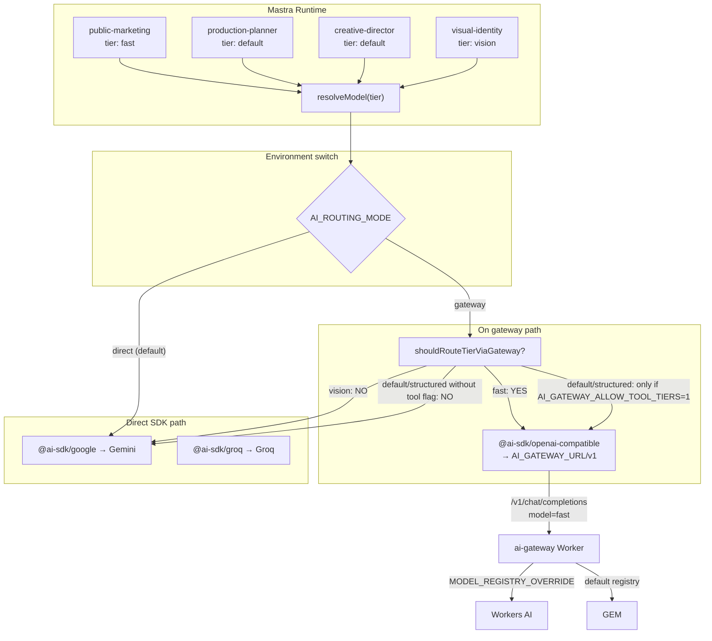

# Audit: Mastra Studio Google Provider Display + Gateway Routing Plan

**Date:** 2026-07-11 (corrected 2026-07-12)
**Verified ref:** `ca5a077` (origin/main, PR #317 merged) + `d0d82792` (PR #328 — PR-Agent deployed)
**Worker live:** `https://ai-gateway.sk-498.workers.dev`
**Mastra docs verified:** [Cloudflare Workers AI provider](https://mastra.ai/llms.txt) — Tools column **misleadingly empty**

---

## ⚠️ CORRECTION (2026-07-12): Workers AI DOES support function/tool calling

The original audit relied on the Mastra docs [model capabilities table](https://mastra.ai/llms.txt), which shows an empty Tools column for all 22 Workers AI models. **This table is incomplete.** Cloudflare's own documentation confirms that Workers AI supports function/tool calling on selected models via the standard OpenAI-compatible API.

**Official Cloudflare sources:**
- [Function calling overview](https://developers.cloudflare.com/workers-ai/features/function-calling/) — "models can receive a list of `tools`, choose a tool, and return structured arguments"
- [Traditional function calling](https://developers.cloudflare.com/workers-ai/features/function-calling/traditional/) — OpenAI-compatible `tools` → `tool_calls` flow
- [Model catalog](https://developers.cloudflare.com/workers-ai/models/) — models labeled **Function calling**
- [`@cf/openai/gpt-oss-120b`](https://developers.cloudflare.com/workers-ai/models/gpt-oss-120b/) — "Function calling: Yes", output schema explicitly includes `tool_calls[]`

**Models supporting function calling on Workers AI:** 16+ models including `@cf/openai/gpt-oss-120b`, `@cf/meta/llama-4-scout-17b-16e-instruct`, `@cf/meta/llama-3.3-70b-instruct-fp8-fast`, `@cf/qwen/qwen3-30b-a3b-fp8`, `@cf/moonshotai/kimi-k2.7-code`, `@cf/google/gemma-4-26b-a4b-it`, and more.

**Impact on this audit:** The conclusion that workers AI cannot serve tool-bearing agents **is no longer valid**. The actual gap is:
1. The gateway's `ChatCompletionRequest` interface lacks `tools`/`tool_choice` fields
2. The Workers AI provider (`providers/workers-ai.ts`) doesn't forward tools
3. The current `MODEL_REGISTRY_OVERRIDE` uses Llama 3.1 8B (no function calling)
4. The gateway 502 on POST blocks all routing regardless

**Updated status:** Workers AI tool calling is achievable via the gateway with model selection + provider updates. See Section 5.2 and Appendix D for the corrected analysis.

---

## 1. Executive conclusion

The Google provider shown in Mastra Studio is **expected and correct** for production-planner. It is not a bug, not misleading UI, and not a misconfiguration.

**Why:** `production-planner` uses the `"default"` tier (`resolveModel("default")` at `agents/index.ts:9`), and:

| Factor | Value |
|--------|-------|
| Default `AI_PROVIDER` | `"gemini"` (provider.ts:44) |
| Default `AI_ROUTING_MODE` | `"direct"` (provider.ts:176) |
| `shouldRouteTierViaGateway("default")` | **false** — returns false unless `AI_GATEWAY_ALLOW_TOOL_TIERS=1` (provider.ts:128-135) |
| `resolveModel()` called at module load | `const MODEL = resolveModel("default")` — frozen at import time |

The model is resolved once, at module import time. Mastra Studio correctly displays the resolved model's provider (`google.generative-ai`, model ID `gemini-3.1-flash-lite`).

---

## 2. Current architecture

```mermaid
flowchart TD
    subgraph Mastra["Mastra Runtime"]
        PP["production-planner<br/>model: resolveModel('default')"] 
        PM["public-marketing<br/>model: resolveModel('fast')"]
        CD["creative-director<br/>model: resolveModel('default')"]
        VI["visual-identity<br/>model: resolveModel('vision')"]
        BI["brand-intelligence<br/>model: resolveModel('default')"]
        SD["social-discovery<br/>model: resolveModel('default')"]
        CR["crm-assistant<br/>model: resolveModel('default')"]
        BK["booking<br/>model: resolveModel('default')"]
        MM["model-match<br/>model: resolveModel('default')"]
    end

    subgraph Providers["Direct SDK Providers"]
        GAI["@ai-sdk/google<br/>createGoogleGenerativeAI<br/>gemini-3.1-flash-lite"]
        GROQ["@ai-sdk/groq<br/>(when AI_PROVIDER=groq)"]
    end

    subgraph Gateway["AI Gateway Worker<br/>(separate Cloudflare deployment)"]
        ROUTER["router.ts"]
        REG["model-registry.ts<br/>DEFAULT_REGISTRY:<br/>default→gemini<br/>fast→gemini<br/>structured→gemini<br/>vision→gemini<br/>embedding→workers-ai"]
        WP["providers/workers-ai.ts<br/>OpenAI-compat → Workers AI"]
        GP["providers/gemini.ts<br/>Google AI SDK"]
    end

    PP --> GAI
    CD --> GAI
    PM --> GAI
    VI --> GAI
    BI --> GAI
    SD --> GAI
    CR --> GAI
    BK --> GAI
    MM --> GAI

    Gateway --> WP
    Gateway --> GP
```



**Key insight:** The Cloudflare Gateway Worker and the Mastra agents are **completely disconnected** in the default configuration. Until `AI_ROUTING_MODE=gateway` is set, all Mastra agents use direct SDKs.

---

## 3. Target architecture (what PR #317 enables)



---

## 4. Agent routing matrix

| Agent | File | Tier | Tools | Vision | Current provider | Target (gateway mode) | Safe now? |
|---|---|---|---|---|---|---|---|
| **production-planner** | `agents/index.ts:24` | `default` | 14+ | no | Gemini lite | Direct (tools block) | ✅ direct only |
| **creative-director** | `agents/index.ts:62` | `default` | 0 | no | Gemini lite | Direct (no tools, but default tier) | ✅ direct only |
| **public-marketing** | `agents/public-marketing-agent.ts:7` | `fast` | 0 | no | Gemini lite | **Gateway Workers AI** | ✅ gateway safe |
| **brand-intelligence** | `agents/brand-intelligence-agent.ts:12` | `default` | 5 | no | Gemini lite | Direct (tools block) | ✅ direct only |
| **visual-identity** | `agents/visual-identity.ts:183` | `vision` | 1 | yes | Gemini 3.5-flash | Direct (vision block) | ✅ direct only |
| **social-discovery** | `agents/social-discovery.ts:5` | `default` | 0 | no | Gemini lite | Direct (default tier, no tool flag) | ✅ direct only |
| **model-match** | `agents/model-match-agent.ts:10` | `default` | 0 | no | Gemini lite | Direct (default tier) | ✅ direct only |
| **crm-assistant** | `agents/crm-assistant-agent.ts:7` | `default` | 0 | no | Gemini lite | Direct (default tier) | ✅ direct only |
| **booking** | `agents/booking-agent.ts:9` | `default` | 3 | no | Gemini lite | Direct (tools block) | ✅ direct only |
| **default** (alias) | `agents/index.ts` (via durable) | `default` | 14+ | no | Gemini lite | Direct (same as production-planner) | ✅ direct only |

**Eligible for gateway routing today:** `public-marketing` (tier `fast`, 0 tools). Tool-capable agents could be routed to the gateway if using a function-calling-capable Workers AI model (e.g., `gpt-oss-120b`) and the gateway forwards `tools`/`tool_choice`.

---

## 5. Root-cause report

### 5.1 Why Mastra Studio shows Google

| Layer | File:Line | Detail |
|---|---|---|
| Agent model assignment | `agents/index.ts:9` | `const MODEL = resolveModel("default")` — module-level, evaluated once |
| resolveModel implementation | `lib/ai/provider.ts:116` | Reads `AI_ROUTING_MODE` (default: `"direct"`), falls through to `resolveAiProvider()` |
| resolveAiProvider | `lib/ai/provider.ts:43-49` | Reads `AI_PROVIDER` env var (default: `"gemini"`) |
| createGeminiLanguageModel | `lib/ai/gemini-registry.ts:25-30` | `createGoogleGenerativeAI({ apiKey })(resolveGeminiModel())` |
| Model ID | `lib/ai/gemini-registry.ts:8` | Default: `"gemini-3.1-flash-lite"` |
| Gateway routing guard | `lib/ai/provider.ts:128-135` | `shouldRouteTierViaGateway("default")` returns `false` because `AI_GATEWAY_ALLOW_TOOL_TIERS !== "1"` |
| Module-load binding | `agents/index.ts:9` | `MODEL` is frozen at import — env must be set before Next.js boot |
| Mastra Studio display | — | Shows whatever `model` was assigned to the Agent constructor at module load time |

### 5.2 CORRECTED: Workers AI DOES support function/tool calling on selected models

**Previous conclusion was wrong.** The Mastra docs [capabilities table](https://mastra.ai/llms.txt) shows an empty Tools column for all Workers AI models, but this table is incomplete. Cloudflare's own documentation, model catalog, and API confirm that function/tool calling works on selected models via the standard OpenAI-compatible API.

**Official evidence:**
- [Cloudflare Workers AI — Function Calling](https://developers.cloudflare.com/workers-ai/features/function-calling/): "models can receive a list of `tools`, choose a tool, and return structured arguments"
- [Traditional function calling](https://developers.cloudflare.com/workers-ai/features/function-calling/traditional/): document shows `env.AI.run(model, { messages, tools })` returning `response.tool_calls`
- [Model catalog](https://developers.cloudflare.com/workers-ai/models/): models labeled **Function calling**
- [`@cf/openai/gpt-oss-120b`](https://developers.cloudflare.com/workers-ai/models/gpt-oss-120b/): output schema explicitly includes `▶tool_calls[]` array
- [Embedded function calling](https://developers.cloudflare.com/workers-ai/features/function-calling/embedded/): `@cloudflare/ai-utils` `runWithTools()` (Workers binding only)

**Models supporting Function calling on Workers AI (16+):** `@cf/openai/gpt-oss-120b`, `@cf/openai/gpt-oss-20b`, `@cf/meta/llama-4-scout-17b-16e-instruct`, `@cf/meta/llama-3.3-70b-instruct-fp8-fast`, `@cf/qwen/qwen3-30b-a3b-fp8`, `@cf/moonshotai/kimi-k2.7-code`, `@cf/moonshotai/kimi-k2.6`, `@cf/google/gemma-4-26b-a4b-it`, `@cf/nvidia/nemotron-3-120b-a12b`, `@cf/zhipuai/glm-4.7-flash`, `@cf/zhipuai/glm-5.2`, `@cf/ibm/granite-4.0-h-micro`, `@cf/mistralai/mistral-small-3.1-24b-instruct`, and more.

**Note:** The current `MODEL_REGISTRY_OVERRIDE` uses `@cf/meta/llama-3.1-8b-instruct-fp8` — this model does **not** support function calling. A model swap is needed.

| Component | File | Limitation |
|---|---|---|
| ChatCompletionRequest | `services/cloudflare-worker/src/providers/provider.ts:6-13` | No `tools` or `tool_choice` field in request type |
| Workers AI provider | `services/cloudflare-worker/src/providers/workers-ai.ts:40-83` | Forwards request body as-is — would pass `tools` if included, but type system rejects it |
| Current MODEL_REGISTRY_OVERRIDE | Dash vars / `wrangler.jsonc` | Uses `llama-3.1-8b-instruct-fp8` — **no function calling** |
| Gateway default registry | `model-registry.ts:14-57` | `fast` maps to Gemini, not Workers AI (unless overridden by `MODEL_REGISTRY_OVERRIDE`) |
| Mastra native provider | `cloudflare-workers-ai/@cf/...` (model string) | Path B also depends on Workers AI capability — Path A is strictly better |

### 5.3 Production mode is still disabled

| Gate | Status | Evidence |
|---|---|---|
| `AI_ROUTING_MODE=gateway` in `.env` / Infisical | Not set | Not found in `.env.example`, `.env.local`, or Infisical scoped to Mastra |
| `AI_GATEWAY_ALLOW_TOOL_TIERS=1` | Not set | Not in any environment config |
| Gateway production mode | Off | PR #317 explicitly disables it — safe on-ramp only |

---

## 6. Linear audit

Review of the [AI Platform / LLM Providers](https://linear.app/amo100/project/ai-platform-llm-providers-8088f63224f2/issues) project based on code evidence and existing documentation.

### 6.1 Current state

| Task | Linear ID | Current state | Evidence | Verdict |
|---|---|---|---|---|
| **IPI-454 · CF-AI-001 — AI Gateway — Cloudflare Provider Routing** | IPI-454 | In Review / In Progress | PR #317 merged (`ca5a077`). AC-A through AC-E merged via PRs #279, #302, #310, #312. AC-F now on `main`. AC-G (KV) not started. AC-H (eval) not started. AC-I (prod deploy) blocked on IPI-472. AC-J (E2E) not verified in browser. | **Keep** — update AC-F as Done; promote AC-J to active |
| **IPI-485 · MASTRA-CF-001 — Mastra Provider Gateway Cutover** | IPI-485 | Backlog | Correctly blocked — requires AC-J evidence + tool bridge before agents can be cut over. No code started. | **Keep Backlog** — correct status |
| **IPI-508 · CF-UJ-008 — Journey test: Marketing/operator fast chat (gateway)** | IPI-508 | In Progress (planned) | J08 doc exists at `user-journeys/08-marketing-operator-chat.md`. Precondition: `AI_ROUTING_MODE=gateway` + Worker running. PR #317 merged — first code prerequisite met. | **Keep** — promote to active after IPI-472 |
| **IPI-472 · INFRA-001 — Cloudflare Worker Deployment Pipeline** | IPI-472 | In Progress | Worker live at `https://ai-gateway.sk-498.workers.dev`. Dashboard Builds connected. No prod DNS cutover. Mastra still on Vercel. | **Keep** — does NOT need changes for Mastra provider cutover |
| **IPI-461 · CF-AI-004 — AI Provider Adapter** | IPI-461 | Done | PR #310 merged. `provider-adapter.ts` exists with chat/stream/structured/embed. Runtime adapter + health. Embed still fails (separate task IPI-491/492). | **Keep Done** — adapter owns REST client, not Mastra wiring |

### 6.2 Task corrections

| Task | Correction |
|---|---|
| IPI-454 | Move AC-F to Done (PR #317 merged). Update description: "AC-F merged in PR #317. AC-G (KV registry) deferred. AC-J now active — needs browser E2E proof with `public-marketing` agent. AC-I needs IPI-472." |
| IPI-485 | No change. Status: Backlog correct. Dependency chain: IPI-454 AC-J → tool bridge investigation → IPI-485. Add note: "Do NOT start until (a) gateway tools support is verified or (b) a tool bridge is built in the Worker." |
| IPI-508 | Precondition met (PR #317 on main). Next step: proceed with browser verification after IPI-472 provides remote Worker. |
| IPI-472 | No change needed for Mastra provider. Keep as infrastructure track. |
| IPI-461 | Keep Done. No reopen needed — the adapter is the non-Mastra REST path. |

### 6.3 Gaps

| Gap | Impact | Suggested task |
|---|---|---|---|
| No tool bridge in Worker | Tool-bearing agents can't use gateway despite Workers AI supporting function calling | **NEW TASK: CF-AI-011 — Workers AI Tool Calling —** Add `tools`/`tool_choice` to `ChatCompletionRequest`, forward in Workers AI provider, swap `MODEL_REGISTRY_OVERRIDE` to a function-calling-capable model (e.g., `gpt-oss-120b`) |
| No E2E browser journey verified | AC-J unproven | IPI-508 active — target: browser proof with `public-marketing` agent |
| No env config for gateway mode | No production gateway routing | Add `AI_ROUTING_MODE` to Infisical scoped to Mastra/CopilotKit runtime |
| PR #317 env vars not documented | Operators don't know what to set | Update `.env.example` with `AI_ROUTING_MODE`, `AI_GATEWAY_URL`, `AI_GATEWAY_API_KEY`, `AI_MODEL_*` vars |

---

## 7. Implementation plan

### Task A: Verify marketing/operator chat through gateway (J08) — HIGHEST PRIORITY

**Purpose:** Prove the first real Mastra → Cloudflare AI Gateway product path

**Files:** No code changes needed. Test execution only.

**Dependencies:** IPI-472 (remote Worker) or local Wrangler (`:8787`)

**AC:**
- Set `AI_ROUTING_MODE=gateway`, `AI_GATEWAY_URL=http://127.0.0.1:8787`
- `public-marketing` agent (`fast` tier) routes through Worker
- Stream tokens return to CopilotKit UI
- Worker logs show request with `model=fast` and `x-ipix-routing=gateway`
- `resolveProviderOptions` is empty on gateway path (no Gemini options leaked)
- Direct mode recovery works (`AI_ROUTING_MODE=direct`)
- Unit: `resolveModel("fast")` returns `provider="ipix-ai-gateway.chat"` when `AI_ROUTING_MODE=gateway`

**Rollback:** Delete env vars, restart Mastra

**Verification:** `npm test` + curl `AI_GATEWAY_URL/v1/chat/completions` + browser CopilotKit chat

---

### Task B: Document `AI_ROUTING_MODE` env vars

**Purpose:** Operators need to know what to set and when

**Files:** `app/.env.example`, `tasks/cloudflare/todo.md`

**AC:**
- `.env.example` documents: `AI_ROUTING_MODE`, `AI_GATEWAY_URL`, `AI_GATEWAY_API_KEY`, `AI_GATEWAY_ALLOW_TOOL_TIERS`, `AI_MODEL_DEFAULT`, `AI_MODEL_FAST`, `AI_MODEL_STRUCTURED`, `AI_MODEL_VISION`
- Each var has purpose, default, and example

**Dependencies:** None

---

### Task C (CORRECTED): Add `tools`/`tool_choice` forwarding to Worker

**Purpose:** Enable tool-bearing agents to use the gateway

**Status: 🟡 Active — Workers AI supports function calling on selected models. Needs implementation.**

**CORRECTION (2026-07-12):** The original audit concluded Workers AI doesn't support tool calling (based on Mastra docs empty Tools column). Cloudflare's own docs confirm it DOES work via the standard OpenAI-compatible API on selected models. See Section 5.2.

**Files:**
- `services/cloudflare-worker/src/providers/provider.ts` — add `tools` and `tool_choice` to `ChatCompletionRequest`
- `services/cloudflare-worker/src/providers/workers-ai.ts` — forward tools to Workers AI
- `services/cloudflare-worker/src/router.ts` — pass tools through

**Implementation steps (7-stage test):**
1. Select a Workers AI model marked "Function calling" (e.g., `@cf/openai/gpt-oss-120b`)
2. Update `ChatCompletionRequest` interface to include `tools` and `tool_choice`
3. Update Workers AI provider to forward these fields
4. Update `MODEL_REGISTRY_OVERRIDE` to use the function-calling-capable model
5. Verify Mastra → gateway → Workers AI tool-calling end-to-end
6. Add Gemini fallback for models without function calling
7. Verify tool result round-trip (send tools → receive tool_calls → execute → send result → final response)

**Models with Function calling on Workers AI:** `gpt-oss-120b`, `gpt-oss-20b`, `llama-4-scout-17b-16e-instruct`, `llama-3.3-70b-instruct-fp8-fast`, `qwen3-30b-a3b-fp8`, `kimi-k2.7-code`, `kimi-k2.6`, `gemma-4-26b-a4b-it`, `nemotron-3-120b-a12b`, `glm-4.7-flash`, `glm-5.2`, `granite-4.0-h-micro`, `mistral-small-3.1-24b-instruct`

**First candidate:** `@cf/openai/gpt-oss-120b` — confirmed Function calling: Yes, 128K context, $0.35/M input, $0.75/M output.

**Out of scope for this task:** Embedded function calling via `@cloudflare/ai-utils` (Workers binding only, not REST API). Use **traditional** function calling (REST-compatible, standard OpenAI format).

---

### Task D (CORRECTED): Workers AI tool support investigation

**Result: 🟢 Workers AI supports function calling on selected models — Cloudflare docs confirmed.**

**CORRECTION (2026-07-12):** The original investigation relied on the Mastra docs [model capabilities table](https://mastra.ai/llms.txt), which shows an empty Tools column for all Workers AI models. **This table is misleading/incomplete.** Cloudflare's own documentation confirms:

| Path | Tools supported? | Evidence |
|---|---|---|
| Path A — Gateway Worker → Workers AI | **Yes (needs implementation)** | Workers AI OpenAI-compat endpoint accepts `tools` and returns `tool_calls` on supported models. `ChatCompletionRequest` in Worker currently lacks the fields — add them. |
| Path B — Mastra `cloudflare-workers-ai` provider | **Unknown (prefer Path A)** | Mastra docs show empty Tools column, but Mastra may use a different API path. Path A (gateway) is the canonical path — build there. |
| Direct Gemini (status quo) | **Yes** | `@ai-sdk/google` supports tool declarations, tool_choice, tool_calls — stays as fallback |

**Conclusion:** Workers AI CAN serve tool-bearing agents if:
1. The gateway `ChatCompletionRequest` is extended with `tools`/`tool_choice`
2. A function-calling-capable model replaces Llama 3.1 8B in the registry
3. The gateway 502 is fixed (missing `GEMINI_API_KEY` not relevant — gateway should use Workers AI, not Gemini)

**Recommendation:** Create **CF-AI-011 — Workers AI Tool Calling** task. Implement Path A with `gpt-oss-120b` as first candidate. Keep direct Gemini as fallback for models/tiers that don't support function calling.

---

### Task E: Gateway mode env in Infisical

**Purpose:** Enable production gateway routing

**Files:** Infisical project config (not in repo)

**Values to set:**
- `AI_ROUTING_MODE=gateway` — scoped to Mastra/CopilotKit runtime
- `AI_GATEWAY_URL=https://ai-gateway.sk-498.workers.dev`
- `AI_GATEWAY_API_KEY` — matching Worker auth
- `AI_GATEWAY_ALLOW_TOOL_TIERS=0` or absent (do NOT set to 1)

**Dependencies:** Task A verified

**Rollback:** `AI_ROUTING_MODE=direct`

---

## 8. AC-J E2E plan (J08 execution)

Based on `tasks/cloudflare/user-journeys/08-marketing-operator-chat.md`.

### Setup

```bash
# Start Worker locally
cd services/cloudflare-worker && npx wrangler dev --port 8787

# Start Mastra with gateway mode
cd app && AI_ROUTING_MODE=gateway AI_GATEWAY_URL=http://127.0.0.1:8787 npm run dev
```

### Evidence checklist

| Check | Method | Expected |
|---|---|---|
| `resolveModel("fast")` returns gateway client | Unit test | `provider === "ipix-ai-gateway.chat"` |
| Worker receives `model=fast` | Worker logs | Request model field = `"fast"` |
| Streaming response | Browser CopilotKit | Tokens stream, no error |
| No Gemini options leaked | Worker or env | Gateway path has empty providerOptions |
| Direct mode works | `AI_ROUTING_MODE=direct` restart | Same chat returns from Gemini |
| Worker 502 handled | Kill Worker, retry chat | Clear error, no crash |
| No tool/vision regression | Run existing agent tests | All pass |
| Production gateway mode not enabled | Check `AI_GATEWAY_ALLOW_TOOL_TIERS` | Not set or explicitly "0" |

---

## 9. Risks and blockers

| Risk | Category | Level | Impact | Mitigation |
|---|---|---|---|---|---|
| Workers AI tool calling not yet implemented in gateway | 🟡 risk | High | Tool-bearing agents can't use gateway until tools/choice are forwarded + model swapped | **CORRECTED (2026-07-12):** Workers AI DOES support function calling on 16+ models. Create CF-AI-011 to add `tools`/`tool_choice` forwarding and swap to a function-calling-capable model like `gpt-oss-120b`. |
| Module-load model binding prevents per-request gateway switching | 🟡 risk | Medium | Env must be set before boot | Document in env docs; runtime reload not possible |
| Dual registries (app vs Worker) diverge | 🟡 risk | Medium | Wrong model selected | Add CI test that Worker `/health` returns consistent registry |
| No remote Worker journey verified | 🟡 risk | High | AC-J not fully provable | IPI-472 needed for remote smoke |
| Public-facing Worker without auth | 🟡 risk | Medium | Unauthorized inference | `AI_GATEWAY_API_KEY` check must be enabled in production Worker |
| Mastra Studio still shows Google for tool agents | 🟢 expected | Low | Cosmetic only — tool agents correctly stay on Gemini | Document as expected; no code change needed |
| Embeddings still fail on gateway | 🟡 risk | Low | IPI-491/492 tasks exist, not a Mastra block | Use direct embeddings or wait for fixes |
| Path B (Mastra Cloudflare provider) bypasses gateway | ⚪ deferred | Low | Path A is strictly better for centralized routing | Only revisit if Workers AI adds a feature the gateway can't forward |

---

## 10. Final recommendation

**Single next task to execute:**

### Task A — Verify marketing/operator chat through the gateway (J08 E2E execution)

**Why this task:** It tests the **only** currently gateway-eligible path (`public-marketing`, `fast` tier, zero tools). PR #317 merged this capability. Before enabling any other agent through the gateway, the `fast` path must be proven end-to-end in a browser.

**What it proves:**
- The `@ai-sdk/openai-compatible` → Worker → Workers AI path works
- Streaming through CopilotKit + Mastra
- `resolveProviderOptions` is correctly empty on gateway path
- Direct fallback works
- The tier key `"fast"` (not a Gemini model ID) is on the wire

**What it does NOT do:**
- Switch production-planner to Workers AI (blocked until CF-AI-011 tool bridge is implemented)
- Enable production gateway mode
- Create new infrastructure

**Execution:** Use existing local Wrangler (`:8787`) or wait for IPI-472 remote Worker. No new code needed — only testing and documentation.

---

## Appendix B: Vision capability note

The Mastra docs list one Workers AI model with Image support:

| Model | Context | Image | Tools |
|---|---|---|---|
| `@cf/meta/llama-3.2-11b-vision-instruct` | 128K | ✅ | ❌ |

This model is **not suitable** for iPix's `visual-identity` agent because:
1. **No tool support on this model** — `llama-3.2-11b-vision-instruct` is NOT marked "Function calling". A different vision + tool-capable model would be needed (e.g., `llama-4-scout-17b-16e-instruct` supports both Vision and Function calling)
2. **Quality gap** — Gemini 3.5-flash is far superior for brand visual analysis
3. **Our gateway doesn't forward image content** — the Worker's `ChatCompletionRequest` has no `ImagePart` support

**Defer vision migration** until (a) Workers AI tool calling is proven (CF-AI-011), (b) a vision + tool-capable model is selected, and (c) the gateway is upgraded to handle multimodal requests.

---

## Appendix C: Path A vs Path B — corrected comparison (with official Mastra docs evidence)

| Dimension | Path A — Gateway Worker (`@ai-sdk/openai-compatible`) | Path B — Mastra native `cloudflare-workers-ai` |
|---|---|---|
| **Tools support** | 🟡 Needs implementation (Worker lacks `tools` field — Cloudflare API supports it) | ❌ Unknown (Mastra docs show empty Tools column — likely incomplete) |
| **Centralized routing** | ✅ Single gateway for all providers | ❌ Bypasses gateway, fragmented |
| **Observability** | ✅ Worker logs + `x-request-id` | ❌ No gateway-level observability |
| **Vision** | ❌ Not implemented | ✅ Image column has 1 model (`llama-3.2-11b-vision-instruct`) but no tools |
| **Fast tier (no tools)** | ✅ Works (PR #317 path) | ✅ Would work (same underlying API) |
| **Env vars needed** | `AI_GATEWAY_URL`, `AI_GATEWAY_API_KEY` | `CLOUDFLARE_API_KEY`, `CLOUDFLARE_ACCOUNT_ID` |
| **Rollback** | ✅ Flip `AI_ROUTING_MODE=direct` | ✅ Change model string |
| **Implementation status** | 🟢 Merged (PR #317) | ⚪ Not started |
| **Model selection** | Tier keys via gateway registry | Model string `cloudflare-workers-ai/@cf/...` |

**Verdict: Path A is strictly superior** for every dimension except vision (where neither path is production-ready for iPix). Path B would duplicate the gateway's provider logic without solving any current limitation.

---

## Appendix: Key files reference

| File | Role |
|---|---|
| `app/src/lib/ai/provider.ts` | Core provider resolver — `resolveModel()`, `resolveAiProvider()`, `resolveAiRoutingMode()`, `shouldRouteTierViaGateway()`, `createGatewayLanguageModel()` |
| `app/src/lib/ai/gemini-registry.ts` | Gemini model config — `createGeminiLanguageModel()`, `resolveGeminiModel()`, `resolveProviderOptions()` |
| `app/src/lib/ai/provider-adapter.ts` | Non-Mastra REST client for gateway (chat/stream/structured/embed) |
| `app/src/lib/ai/types.ts` | Shared types — `AiProvider`, `GroqModelTier`, `ModelTier`, `ModelRegistry` |
| `app/src/lib/ai/model-registry.ts` | Static model registry (not wired into runtime) |
| `app/src/mastra/models.ts` | Re-exports bridge from `lib/ai/provider` to mastra agents |
| `app/src/mastra/agents/index.ts` | Agent definitions — `productionPlannerAgent`, `creativeDirectorAgent` |
| `app/src/mastra/agents/public-marketing-agent.ts` | `publicMarketingAgent` — only agent using `resolveModel("fast")` |
| `services/cloudflare-worker/src/router.ts` | Gateway Worker HTTP router — `/v1/chat/completions`, `/v1/embeddings`, `/health` |
| `services/cloudflare-worker/src/model-registry.ts` | Worker-side model registry (DEFAULT_REGISTRY) + `resolveModelEntry()` |
| `services/cloudflare-worker/src/providers/workers-ai.ts` | Workers AI provider implementation |
| `services/cloudflare-worker/src/providers/gemini.ts` | Gemini provider implementation (Worker-side) |
| `services/cloudflare-worker/src/providers/provider.ts` | Shared types — `ChatCompletionRequest`, `AiProvider`, `ProviderConfig` |
