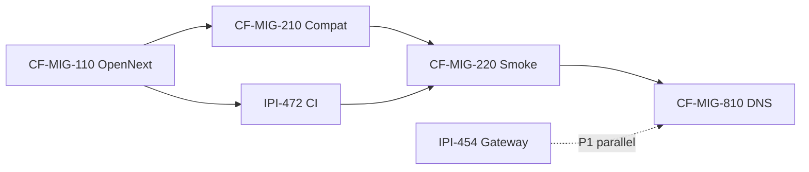
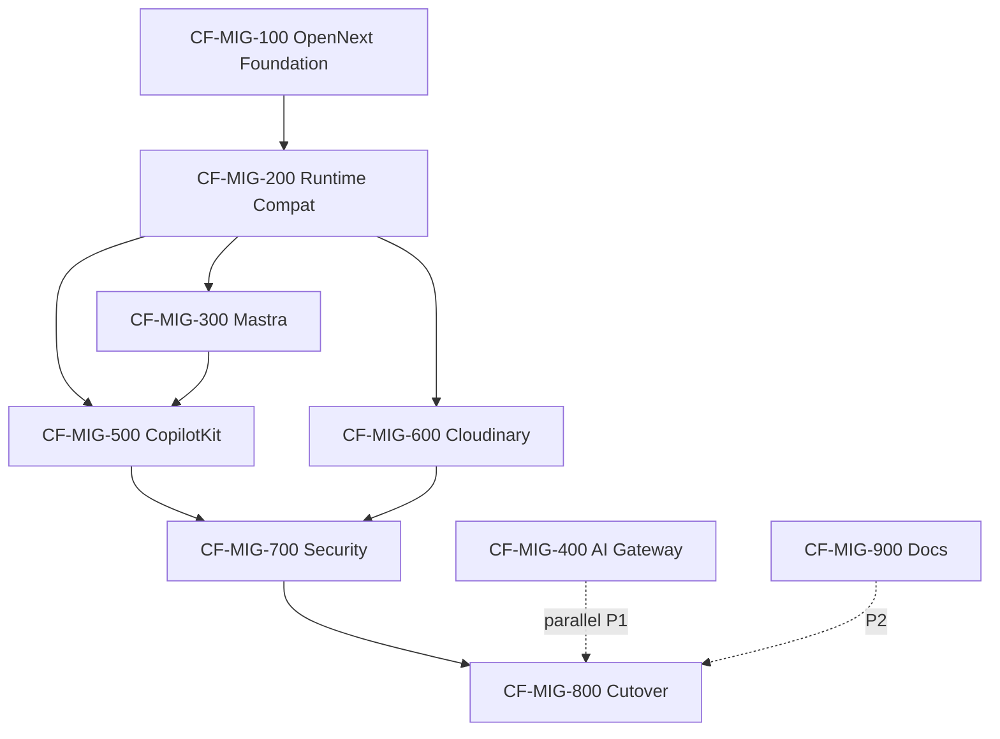

# CF-MIG — Vercel → Cloudflare Workers (Linear epic breakdown)

> **SSOT:** [`plan-migrate.md`](./plan-migrate.md) — this file is the detailed breakdown reference. Use the **lean track** (5 issues) for Linear import; full 33-issue track is archived below.

**Date:** 2026-07-08  
**Status:** Ready for Linear import  
**Project:** [AI Platform — LLM Providers](https://linear.app/amo100/project/ai-platform-llm-providers-8088f63224f2/issues)  
**Linear specs:** [`linear/issues/IPI-CF-MIG-*.md`](../../linear/issues/)  
**Plan SSOT:** [`plan-migrate.md`](./plan-migrate.md)

---

## ⚡ Lean track (recommended)

Official [Next.js on Workers](https://developers.cloudflare.com/workers/framework-guides/web-apps/nextjs/) path is ~6 steps: OpenNext + Wrangler → preview → env → deploy → custom domain → decommission Vercel. iPix adds **3 runtime fixes** (Hono, groq FS, OAuth) and **1 smoke gate** before DNS.

**Do not create 33 Linear issues.** Use **1 epic + 5 new issues** (+ reuse existing IPI for AI Gateway).

| ID | Title | Merges (full track) | PR |
|----|-------|---------------------|-----|
| **CF-MIG-110** | OpenNext foundation (scaffold, scripts, env matrix) | 101–103 | PR-1 |
| **CF-MIG-111** | CI OpenNext build | 104 · extends IPI-472 | PR-3 |
| **CF-MIG-210** | Runtime compat (Hono, groq JSON, OAuth, bundle check) | 201–203, 205 | PR-2 |
| **CF-MIG-220** | Preview smoke gate (Mastra, CopilotKit SSE, Cloudinary, APIs) | 301–303, 501–502, 601–603, 702 | PR-4 |
| **CF-MIG-810** | Cutover + rollback + Vercel decommission | 703, 801–803 | PR-6 (ops) |
| *(reuse)* **IPI-454/461/463** | AI Gateway (not blocking DNS) | 401–404 | PR-5 |
| *(reuse)* **IPI-468** | Security audit (partial) | 701 | parallel |

**Defer** (no Linear issue — do in PR or post-cutover): 204 node audit, 304/503 benchmarks, 704 observability, 901–903 docs (update `plan-migrate.md` in docs PR).

---

## Full track (reference only — too granular for Linear)

9 epics · 33 issues — expand if you need the detailed breakdown

The sections below retain the full decomposition for planning. **Import Lean track above into Linear.**

---

## Summary (full track)

| Metric | Value |
|--------|------:|
| Epics | **9** (CF-MIG-100 … 900) |
| Issues | **33** (CF-MIG-101 … 903) |
| P0 epics (DNS path) | 6 (100, 200, 300, 500, 700, 800) |
| P1 parallel | 400 (AI Gateway), 600 (Cloudinary) |
| P2 | 900 (Documentation) |

**Principle:** One concern per PR — scaffold PR ≠ compat PR ≠ AI Gateway PR. Docs-only PRs separate from code.

**Existing Linear reuse (do not duplicate):**

| CF-MIG | Maps to |
|--------|---------|
| CF-MIG-401 | **IPI-454** · CF-AI-001 AI Gateway |
| CF-MIG-402 | **IPI-461** · CF-AI-004 Provider Adapter |
| CF-MIG-403/404 | **IPI-463** · CF-AI-008 Failover |
| CF-MIG-104 | **IPI-472** · INFRA-001 (partial — extend AC) |
| CF-MIG-701 | **IPI-468** · SEC-001 (partial) |
| CF-MIG-203 | **IPI-125** · OPS-001 OAuth URLs (related) |

Create **new** Linear issues for CF-MIG-101–103, 201–205, 301–304, 501–503, 601–603, 702–704, 801–803, 901–903 unless merged into epics above.

---

## Dependency graph

---

## Recommended implementation order

| Order | Epic | Priority | DNS blocker? |
|------:|------|:--------:|:------------:|
| 1 | CF-MIG-100 · OpenNext Foundation | 🔴 P0 | Yes |
| 2 | CF-MIG-200 · Runtime Compatibility | 🔴 P0 | Yes |
| 3 | CF-MIG-300 · Mastra Compatibility | 🔴 P0 | Yes |
| 4 | CF-MIG-500 · CopilotKit Validation | 🔴 P0 | Yes |
| 5 | CF-MIG-700 · Security & Production Readiness | 🔴 P0 | Yes |
| 6 | CF-MIG-800 · Production Cutover | 🔴 P0 | Final |
| 7 | CF-MIG-400 · AI Gateway Integration | 🟡 P1 | No — parallel after 100 |
| 8 | CF-MIG-600 · Cloudinary & Assets | 🟡 P1 | Partial — webhook in 603 |
| 9 | CF-MIG-900 · Documentation | ⚪ P2 | No |

**DNS cutover (CF-MIG-802)** requires green: 101–104, 201–203, 301–303, 502, 602–603, 702–703, 801.

---

# Epic 1 — CF-MIG-100 · OpenNext Foundation & Cloudflare Runtime

**Goal:** Existing Next.js app runs on Cloudflare Workers with **no application behavior changes**.

**Linear:** Create epic `CF-MIG-100` · Labels: `CLOUDFLARE`, `INFRA`, `OPENNEXT`

---

### CF-MIG-101 · OpenNext Scaffold & Wrangler Configuration

**Priority:** P0 · **Estimate:** S · **PR:** 1 (infra only)

**Deliverables**

- Install `@opennextjs/cloudflare` + `wrangler` in `app/`
- Create `app/wrangler.jsonc` (`main: .open-next/worker.js`, assets binding)
- Create `app/open-next.config.ts` (`defineCloudflareConfig()`)
- Enable `nodejs_compat` + current `compatibility_date`

**Acceptance criteria**

- [ ] `opennextjs-cloudflare build` completes in `app/`
- [ ] No changes to `app/src/**` application logic
- [ ] Vercel path unchanged: `npm run build` still green in CI

**Verify:** `cd app && npm run lint && npm run build`

**Refs:** [Cloudflare Next.js guide](https://developers.cloudflare.com/workers/framework-guides/web-apps/nextjs/)

---

### CF-MIG-102 · Build Scripts & Developer Experience

**Priority:** P0 · **Estimate:** S · **PR:** 1 (same PR as 101 if ≤200 LOC)

**Deliverables**

- Scripts: `cf:preview`, `cf:deploy`, `cf:typegen`
- `app/README` or `tasks/cloudflare/migration/` dev commands section
- Document: `dev` = Next Turbopack; `cf:preview` = workerd runtime

**Acceptance criteria**

- [ ] `npm run cf:preview` serves app locally in Workers runtime
- [ ] `npm run cf:typegen` generates `cloudflare-env.d.ts`

---

### CF-MIG-103 · Cloudflare Environment Configuration

**Priority:** P0 · **Estimate:** M · **PR:** 1 or docs-only follow-up

**Deliverables**

- Build vs runtime env matrix (see `plan-migrate.md` §5)
- Workers Builds: build variables for `NEXT_PUBLIC_*`, `SITE_URL`, `OPERATOR_AUTH_ENABLED`
- Wrangler secrets for `DATABASE_URL`, `GEMINI_API_KEY`, `GROQ_API_KEY`, etc.
- Runbook snippet: `wrangler secret bulk` (never commit)

**Acceptance criteria**

- [ ] Matrix lists each var as Build / Runtime / Both
- [ ] OpenNext build succeeds on Workers Builds with documented vars
- [ ] No secrets in repo diff

**Refs:** [OpenNext env vars](https://opennext.js.org/cloudflare/howtos/env-vars#workers-builds)

---

### CF-MIG-104 · GitHub Actions Cloudflare Preview Pipeline

**Priority:** P0 · **Estimate:** M · **PR:** CI-only · **Extends:** IPI-472

**Deliverables**

- CI job: `opennextjs-cloudflare build` on PRs touching `app/`
- Optional: Workers Builds preview deploy (requires CF token secret)
- Fail fast before merge if Worker build breaks

**Acceptance criteria**

- [ ] PR touching `app/` runs CF build job
- [ ] `services/cloudflare-worker` dry-run remains in CI (existing)
- [ ] Document rollback if CF build fails on main

---

# Epic 2 — CF-MIG-200 · Runtime Compatibility

**Goal:** Remove Vercel-specific runtime assumptions.

**Blocked by:** CF-MIG-100

---

### CF-MIG-201 · Replace Hono Vercel Adapter

**Priority:** P0 · **Estimate:** S · **PR:** 2

**Scope:** `app/src/app/api/copilotkit/[[...slug]]/route.ts`

Replace `hono/vercel` with `hono/cloudflare-workers` (or platform-neutral fetch export).

**Acceptance criteria**

- [ ] CopilotKit route loads under `cf:preview`
- [ ] Existing vitest mocks updated
- [ ] `npm test` green

---

### CF-MIG-202 · Remove Runtime Filesystem Dependencies

**Priority:** P0 · **Estimate:** S · **PR:** 2

**Scope:** `app/src/lib/ai/provider.ts` — `readFileSync(config/groq-models.json)`

Replace with one of:

1. **Preferred:** static JSON import at build time (bundled)
2. Env `GROQ_MODELS_JSON` (Workers Builds)
3. KV binding (later — IPI-454 AC-G)

**Acceptance criteria**

- [ ] No `node:fs` read of groq config at module load on Worker path
- [ ] `resolveGroqModelId()` behavior unchanged (unit tests pass)
- [ ] `cf:preview` agent route does not 500 on boot

---

### CF-MIG-203 · OAuth & Authentication Compatibility

**Priority:** P0 · **Estimate:** S · **PR:** 2 · **Related:** IPI-125

**Scope**

- `app/src/app/auth/callback/route.ts` — trust `*.workers.dev` + prod domain
- Supabase Auth redirect URLs updated for preview + prod Worker hosts
- `src/proxy.ts` operator gate unchanged behavior

**Acceptance criteria**

- [ ] OAuth round-trip on `*.workers.dev` preview
- [ ] No login loop after callback
- [ ] Supabase dashboard redirect URLs documented

---

### CF-MIG-204 · Node Compatibility Audit

**Priority:** P1 · **Estimate:** M · **PR:** docs-only

Audit `app/src/**` for: `Buffer`, Streams, `crypto`, `fs`, `path`, `child_process`, `process`.

**Deliverable:** `tasks/cloudflare/migration/node-compat-audit.md` with pass/fail per API.

**Acceptance criteria**

- [ ] Every `node:*` import in server paths cataloged
- [ ] Blockers flagged for CF-MIG-201/202 follow-up

---

### CF-MIG-205 · Bundle Size & Runtime Audit

**Priority:** P1 · **Estimate:** S · **PR:** 2 gate or docs

**Deliverables**

- Post-build size of `.open-next/worker.js` + assets
- Cold start note from `cf:preview`
- List top 5 bundle contributors (`@mastra/*`, `@ai-sdk/*`, etc.)

**Acceptance criteria**

- [ ] Size documented vs [Workers limits](https://developers.cloudflare.com/workers/platform/limits/)
- [ ] If over limit: split plan documented (defer Mastra standalone)

---

# Epic 3 — CF-MIG-300 · Mastra Compatibility

**Goal:** In-process Mastra works on OpenNext Worker (Phase 1 — no `@mastra/deployer-cloudflare` split).

**Blocked by:** CF-MIG-200

---

### CF-MIG-301 · Mastra Runtime Validation

**Priority:** P0 · **Estimate:** M

Validate on `cf:preview`:

- All 8 agents register (`getMastra()`)
- Tool execution (read-only tools)
- `DATABASE_URL` stub at CI build unchanged

**Acceptance criteria**

- [ ] Agent list API or CopilotKit local agents returns expected ids
- [ ] No top-level `getMastra()` in route modules (existing guard)

---

### CF-MIG-302 · PostgresStore Worker Validation

**Priority:** P0 · **Estimate:** M

Verify `@mastra/pg` via Supabase pooler (:6543):

- Connection under load
- Pool exhaustion symptoms
- Reconnection after idle

**Acceptance criteria**

- [ ] 10 sequential agent turns without PG errors
- [ ] Hyperdrive spike logged as follow-up if connections fail

---

### CF-MIG-303 · Workflow Suspend / Resume Testing

**Priority:** P0 · **Estimate:** M

Validate HITL workflows:

- `shoot-wizard` suspend/resume
- `brand-intelligence` approve/resume routes

**Acceptance criteria**

- [ ] Full workflow path on preview URL
- [ ] Resume endpoints return 200 with valid state

---

### CF-MIG-304 · Mastra Load Testing

**Priority:** P1 · **Estimate:** M

Stress: concurrent agent sessions, workflow + chat overlap.

**Acceptance criteria**

- [ ] Document max concurrent turns before degradation
- [ ] No unhandled rejections in Worker logs

---

# Epic 4 — CF-MIG-400 · AI Gateway Integration

**Goal:** Single inference path via `services/cloudflare-worker` (P1 — **not blocking DNS**).

**Reuse Linear:** IPI-454, IPI-461, IPI-463

---

### CF-MIG-401 · Deploy AI Gateway Worker

**Priority:** P1 · **Maps to:** IPI-454

**Acceptance criteria**

- [ ] Prod deploy `services/cloudflare-worker`
- [ ] `/health` + `/v1/chat/completions` live on subdomain
- [ ] 5 existing tests green

---

### CF-MIG-402 · Provider Adapter Integration

**Priority:** P1 · **Maps to:** IPI-461

Replace direct `@ai-sdk/google` / `@ai-sdk/groq` in Mastra with `@ai-sdk/openai-compatible` → Gateway URL.

**Acceptance criteria**

- [ ] `provider-adapter.ts` (or equivalent) on main
- [ ] Feature flag `AI_GATEWAY_URL` for shadow mode
- [ ] Unit tests for adapter

---

### CF-MIG-403 · Shadow Traffic

**Priority:** P1 · **Estimate:** M

Run direct providers vs Gateway; compare outputs (non-prod).

**Acceptance criteria**

- [ ] Diff report for 20 golden prompts
- [ ] No regression on structured JSON tiers

---

### CF-MIG-404 · AI Gateway Failover

**Priority:** P1 · **Maps to:** IPI-463

Verify Workers AI → Gemini fallback, retries, 503 behavior.

---

# Epic 5 — CF-MIG-500 · CopilotKit Validation

**Goal:** AG-UI SSE reliable on Workers before DNS.

**Blocked by:** CF-MIG-200, CF-MIG-301

---

### CF-MIG-501 · CopilotKit Worker Compatibility

**Priority:** P0 · **Estimate:** M

End-to-end: UI → `/api/copilotkit` → MastraAgent → model call.

**Acceptance criteria**

- [ ] Default agent responds on preview
- [ ] Thread persistence behavior documented (license token + auth flag)

---

### CF-MIG-502 · SSE Streaming Validation

**Priority:** P0 · **Estimate:** M · **DNS gate**

Stress test:

- Long multi-turn conversation
- Client disconnect / reconnect
- Tool call mid-stream

**Acceptance criteria**

- [ ] 3+ turns without Error 1102 / stream truncate
- [ ] Observability MCP or wrangler tail captures failures

---

### CF-MIG-503 · Agent Performance Benchmark

**Priority:** P1 · **Estimate:** M

Compare Vercel preview vs Workers preview: TTFB, token throughput, p95 turn latency.

**Deliverable:** `tasks/cloudflare/migration/benchmark-copilotkit.md`

---

# Epic 6 — CF-MIG-600 · Cloudinary & Assets

**Priority:** P1 · **Blocked by:** CF-MIG-100

---

### CF-MIG-601 · next/image Compatibility

Verify OpenNext + Cloudinary `remotePatterns`. Fallback: direct Cloudinary URLs / `next-cloudinary`.

---

### CF-MIG-602 · Cloudinary Upload Validation

Sign upload + commit flow on preview.

---

### CF-MIG-603 · Webhook Validation

**Priority:** P1 · **DNS gate (partial)**

Verify `app/src/app/api/assets/cloudinary/webhook/route.ts`:

- `next/after()` DNA trigger fires
- Idempotent webhook handling

---

# Epic 7 — CF-MIG-700 · Security & Production Readiness

**Blocked by:** CF-MIG-500, CF-MIG-600 (partial)

---

### CF-MIG-701 · Environment & Secret Audit

**Maps to:** IPI-468 (partial)

- No `GEMINI_API_KEY` / `GROQ_API_KEY` in client bundle
- `check-client-env.mjs` green
- Workers secrets vs build vars audit

---

### CF-MIG-702 · Production Smoke Tests

**Priority:** P0 · **DNS gate**

Checklist on preview URL:

- [ ] Login + OAuth
- [ ] `/app` dashboard
- [ ] CopilotKit chat
- [ ] Asset upload
- [ ] Cloudinary webhook
- [ ] Marketing chat
- [ ] Key API routes (`/api/brands`, `/api/bookings`)

---

### CF-MIG-703 · Rollback Plan

**Priority:** P0 · **DNS gate**

Document:

- DNS revert to Vercel
- Supabase OAuth URL revert
- Secret/env rollback
- 48h monitoring criteria

**Deliverable:** `tasks/cloudflare/migration/rollback-runbook.md`

---

### CF-MIG-704 · Observability & Monitoring

Worker logs, AI Gateway metrics (if deployed), error alerts.

**Tools:** Cloudflare observability MCP, wrangler tail

---

# Epic 8 — CF-MIG-800 · Production Cutover

**Blocked by:** CF-MIG-702, CF-MIG-703

---

### CF-MIG-801 · Workers Preview Verification

Sign-off checklist — all P0 gates from epics 100–700.

---

### CF-MIG-802 · DNS Cutover

Custom domain on Workers; update Supabase Auth; 48h monitor.

**Do not start until CF-MIG-502 green.**

---

### CF-MIG-803 · Vercel Decommission

After 48h stable: remove Vercel project, archive env docs, update README.

---

# Epic 9 — CF-MIG-900 · Documentation

**Priority:** P2 · Can start early for diagrams; runbook finalized after 800.

---

### CF-MIG-901 · Migration Runbook

Step-by-step — consolidate `plan-migrate.md` + this file for operators.

---

### CF-MIG-902 · Architecture Diagrams

Mermaid: current, target, AI flow, deploy, auth, request lifecycle, Gateway routing.

**Note:** Partial diagrams already in `plan-migrate.md` — extend, don't duplicate.

---

### CF-MIG-903 · Operations Guide

Deploy, rollback, debug, monitoring, incident response.

---

## PR mapping (one concern per PR)

| PR | Issues | Max scope |
|----|--------|-----------|
| PR-1 | CF-MIG-101, 102, 103 | OpenNext scaffold + env docs |
| PR-2 | CF-MIG-201, 202, 203, 205 | Runtime compat |
| PR-3 | CF-MIG-104 | CI only |
| PR-4 | CF-MIG-301–303, 501, 502 | Validation (may split if >500 LOC) |
| PR-5 | CF-MIG-401, 402 | AI Gateway (IPI-454/461) |
| PR-6 | CF-MIG-702–703, 801–802 | Cutover docs + DNS (ops) |
| PR-docs | CF-MIG-901–903, 204 | Docs only |

---

## Linear import checklist

- [ ] Create epic CF-MIG-100 … CF-MIG-900 (9 epics)
- [ ] Create 33 child issues with IDs above
- [ ] Link CF-MIG-401/402/404 to existing IPI-454, IPI-461, IPI-463
- [ ] Extend IPI-472 description with CF-MIG-104 scope
- [ ] Mark IPI-469 Done; revert IPI-461 to Todo until on main
- [ ] Milestone: **CF-MIG · Vercel→Workers**
- [ ] Labels: `CLOUDFLARE`, `INFRA`, `OPENNEXT`, `MASTRA`, `COPILOTKIT`

---

## Issue count

**9 epics · 33 issues** — each sized for independent implement, verify, review, merge.

| Epic | Issues |
|------|-------:|
| CF-MIG-100 | 4 |
| CF-MIG-200 | 5 |
| CF-MIG-300 | 4 |
| CF-MIG-400 | 4 |
| CF-MIG-500 | 3 |
| CF-MIG-600 | 3 |
| CF-MIG-700 | 4 |
| CF-MIG-800 | 3 |
| CF-MIG-900 | 3 |
| **Total** | **33** |

---

## Task-verifier verdict (2026-07-08)

| Track | Issues | Spec /100 | Execution /100 | Composite | Safe? |
|-------|-------:|----------:|---------------:|----------:|-------|
| **Lean (7)** | 5 new + 2 IPI reuse | 88 | 75 | **82** | 🟡 after Linear create |
| **Full (33)** | 33 new | 72 | 55 | **62** | 🔴 over-engineered |

**Verdict:** **No — you do not need 33 tasks.** Lean track matches official docs + iPix blockers without audit-the-audit sprawl.

### Official docs vs iPix

| Source | Steps | Applies to iPix? |
|--------|------:|:----------------:|
| [migrate-vercel.md](./migrate-vercel.md) (static/SPA) | 4 | ❌ wrong guide for Next.js |
| [Next.js on Workers](https://developers.cloudflare.com/workers/framework-guides/web-apps/nextjs/) | 6–8 | ✅ primary |
| iPix-only blockers (disk probe ✅) | +3 | Hono, groq FS, OAuth |

Disk probe: no `wrangler.jsonc` / `open-next.config.ts`; `hono/vercel` present — migration not started.

### Full-track issues to drop or merge

| Issue | Verdict | Reason |
|-------|---------|--------|
| 102 separate from 101 | 🟡 Merge | Same PR, &lt;50 LOC |
| 103 separate | 🟡 Merge | Env matrix = section in 110 |
| 204 Node audit | ⚪ Defer | Checklist inside 210, not its own issue |
| 301–304 Mastra (4 issues) | 🔴 Merge | One smoke checklist in 220 |
| 501–503 CopilotKit (3) | 🔴 Merge | 502 is the only DNS gate; 503 post-cutover |
| 601–603 Cloudinary (3) | 🔴 Merge | Rows in 220 smoke |
| 701 + 704 | Reuse IPI-468 | Don't duplicate SEC epic |
| 901–903 Docs (3) | 🔴 Merge | One docs PR; diagrams already in plan-migrate |
| 400 AI Gateway (4) | Reuse IPI | Already in Linear |

### Lean issue acceptance (summary)

**CF-MIG-110** — `opennextjs-cloudflare build` green; `cf:preview` script; env matrix doc; no `app/src` changes.

**CF-MIG-210** — No `hono/vercel`; no runtime FS for groq JSON; OAuth on `*.workers.dev`; bundle size noted.

**CF-MIG-220** — Single checklist: login, `/app`, CopilotKit 3-turn SSE, workflow resume, webhook `after()`, marketing chat.

**CF-MIG-810** — Rollback runbook + DNS only after 220 green + 48h monitor.

**CF-MIG-111** — CI job on `app/` PRs; extends IPI-472 (don't duplicate epic).
