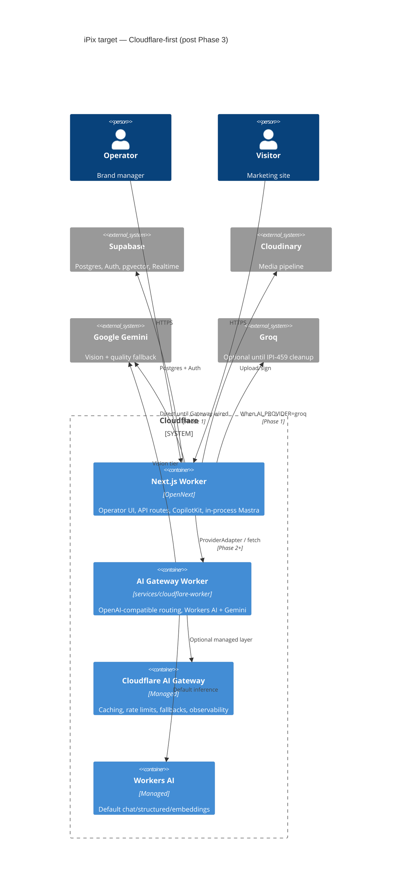
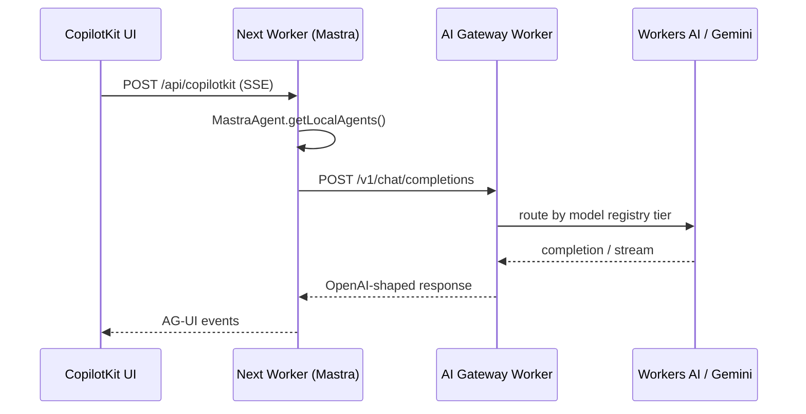
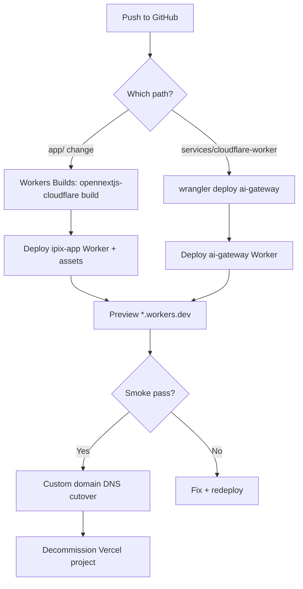
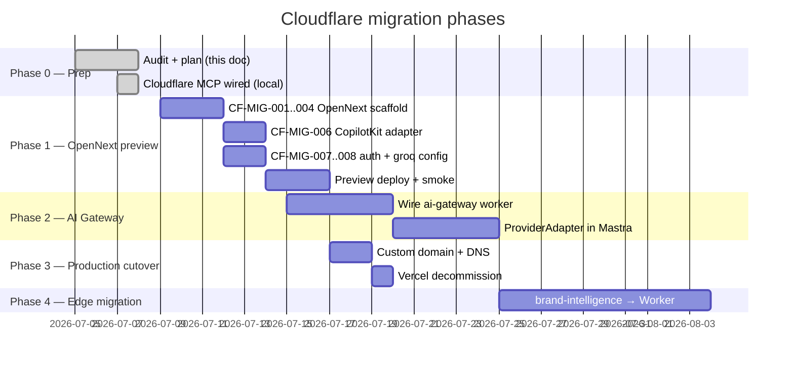

# Vercel → Cloudflare Workers Migration Plan (Next.js + Mastra + AI)

**Date:** 2026-07-08  
**Status:** Draft — audit complete, implementation not started  
**Scope:** `app/` (Next.js 16 operator app), in-process Mastra, CopilotKit, Groq/Gemini inference, existing `services/cloudflare-worker/` AI Gateway  
**Supersedes (partially):** CF-000 §3 “Vercel hosts Next.js” — this plan moves the operator app to Workers via OpenNext while keeping Supabase + Cloudinary as SSOT.

---

## Executive summary

| Question | Answer |
|----------|--------|
| **Best target runtime?** | **Cloudflare Workers + OpenNext** (`@opennextjs/cloudflare`), not Pages / not `next-on-pages` |
| **Mastra placement?** | **Phase 1:** keep Mastra co-located inside the Next.js Worker (same as today on Vercel). **Phase 2+:** evaluate standalone `@mastra/deployer-cloudflare` only if CPU/memory limits force a split |
| **AI inference path?** | **Short term:** keep `resolveModel()` (Gemini + Groq). **Medium term:** route all inference through `services/cloudflare-worker` + native Cloudflare AI Gateway (Workers AI default, Gemini vision fallback) per CF-000 |
| **Groq on Cloudflare?** | Code is wired (GROQ-002–004 ✅); CF platform decision doc says eventual cleanup (IPI-459). **Do not remove Groq during infra migration** — prove parity first (IPI-360 golden eval) |
| **Biggest blockers** | (1) No OpenNext/wrangler in `app/` yet, (2) `hono/vercel` CopilotKit adapter, (3) runtime `node:fs` for `config/groq-models.json`, (4) AI Gateway worker not wired to Mastra/Edge |

**Recommendation:** Phased migration — add OpenNext preview on a branch while Vercel stays production; wire AI Gateway in parallel; DNS cutover only after CopilotKit + Mastra + auth smoke on `*.workers.dev`.

---

## 1. Current architecture audit

### 1.1 Deployment & runtime (today)

| Component | Location | Runtime | Notes |
|-----------|----------|---------|-------|
| Next.js operator app | `app/` | **Vercel** (Fluid Compute / Node) | Next 16.1.2, Turbopack dev, `next build` prod |
| Mastra (8 agents, 2 workflows) | `app/src/mastra/` | **In-process** with Next API routes | `PostgresStore` via `DATABASE_URL` (Supabase pooler :6543) |
| CopilotKit AG-UI | `/api/copilotkit/[[...slug]]` | Vercel route handler | Uses `hono/vercel` + `MastraAgent.getLocalAgents()` |
| Network gate | `app/src/proxy.ts` | Next.js 16 proxy (not `middleware.ts`) | Supabase session refresh + operator auth gate |
| AI provider abstraction | `app/src/lib/ai/provider.ts` | Server-only | Default `AI_PROVIDER=gemini`; Groq tiers via `config/groq-models.json` (runtime `node:fs`) |
| Supabase Edge — brand-intelligence | `supabase/functions/brand-intelligence/` | Deno | Groq + Gemini fallback (GROQ-003 ✅) |
| Cloudflare AI Gateway worker | `services/cloudflare-worker/` | Workers (`wrangler.jsonc`) | OpenAI-compatible `/v1/chat/completions`; Gemini + Workers AI providers; **not wired to prod** |
| CI | `.github/workflows/ci.yml` | GitHub Actions | `app/` lint + build + test; no Cloudflare preview job |

**No `vercel.json` in repo** — config lives in Vercel dashboard. No `wrangler.jsonc` or `open-next.config.ts` under `app/`.

### 1.2 Vercel-specific code (must change or verify)

| File / pattern | Risk on Workers | Action |
|----------------|-----------------|--------|
| `hono/vercel` in CopilotKit route | 🔴 High | Switch to `hono/cloudflare-workers` or platform-neutral fetch export |
| `auth/callback/route.ts` trusts `*.vercel.app` | 🟡 Medium | Add `*.workers.dev` + production custom domain |
| `provider.ts` `readFileSync(config/groq-models.json)` | 🟡 Medium | Bundle JSON at build time or KV/env override (Workers has no persistent FS) |
| `next/after()` in Cloudinary webhook | 🟢 Low | [Supported on OpenNext Cloudflare](https://developers.cloudflare.com/workers/framework-guides/web-apps/nextjs/) |
| `next/image` + Cloudinary remotePatterns | 🟡 Medium | Verify OpenNext image path; fallback Cloudflare Images transforms |
| `serverExternalPackages: @mastra/pg, @libsql` | 🟡 Medium | Confirm OpenNext bundles externals correctly with `nodejs_compat` |
| Long-lived CopilotKit SSE streams | 🟡 Medium | Workers CPU/time limits — load-test agent turns on preview |

### 1.3 AI / Groq / Gemini inventory

```
┌─────────────────────────────────────────────────────────────────┐
│                        INFERENCE PATHS (3)                       │
├─────────────────────────────────────────────────────────────────┤
│  A. Mastra agents  → resolveModel() → @ai-sdk/google | @ai-sdk/groq │
│  B. Edge brand-intelligence → shared LLM (Groq + Gemini fallback)   │
│  C. ai-gateway worker → gemini | workers-ai (OpenAI-compatible)     │
└─────────────────────────────────────────────────────────────────┘
```

| Layer | Default | Env keys | SSOT |
|-------|---------|----------|------|
| Mastra / app | Gemini (`gemini-3.1-flash-lite`) | `AI_PROVIDER`, `GEMINI_API_KEY`, `GROQ_*` | `config/groq-models.json` |
| Edge BI | Groq primary, Gemini fallback | Same + edge secrets | `config/groq-models.json` |
| CF worker | Workers AI + Gemini | `GEMINI_API_KEY`, `CLOUDFLARE_*` | `services/cloudflare-worker/src/model-registry.ts` |

**Prod gates (Groq):** GROQ-005–007 still open — do not treat Groq removal (IPI-459) as part of this infra migration.

**Platform AI decision (`ai-provider-decision.md`):** Workers AI + AI Gateway long-term; Groq deprioritized. **Code reality:** Groq fully integrated in app + edge. Migration plan keeps both paths working until golden eval (IPI-360) and AI Gateway wiring (IPI-454).

### 1.4 Mastra storage (Cloudflare-compatible ✅)

```typescript
// app/src/mastra/storage.ts — already external Postgres, not LibSQL file
PostgresStore({ connectionString: process.env.DATABASE_URL })
```

[Mastra Cloudflare guide](https://mastra.ai/guides/deployment/cloudflare): ephemeral Worker FS → **must use remote DB**. iPix already uses Supabase Postgres — no LibSQL file migration needed.

**Optional later:** Hyperdrive for connection pooling from Workers to Supabase (CF-000 currently says skip; re-evaluate if connection exhaustion appears under load).

### 1.5 API surface (25 route handlers)

Critical paths for migration smoke:

- `/api/copilotkit/*` — agent SSE (highest risk)
- `/api/workflows/*` — Mastra HITL workflows
- `/api/assets/cloudinary/webhook` — `after()` background DNA trigger
- `/api/marketing-chat/*`, `/api/marketing-lead` — public marketing
- Auth: `/auth/callback`, `src/proxy.ts` operator gate

---

## 2. Target architecture

### 2.1 C4 container — after migration



### 2.2 Inference sequence — target state (Phase 2)



### 2.3 Deployment flow



---

## 3. Gap analysis — what is needed

### 3.1 Next.js on Workers (OpenNext) — **not started**

Per [Cloudflare Next.js guide](https://developers.cloudflare.com/workers/framework-guides/web-apps/nextjs/) and [Vercel→Workers migration](https://developers.cloudflare.com/workers/static-assets/migration-guides/vercel-to-workers/):

| # | Task | Files / commands | Linear (proposed) |
|---|------|------------------|-------------------|
| CF-MIG-001 | Add `@opennextjs/cloudflare` + `wrangler` devDep to `app/` | `app/package.json` | INFRA-001 / new IPI |
| CF-MIG-002 | Add `app/wrangler.jsonc` (`main: .open-next/worker.js`, `nodejs_compat`, assets binding) | new file | — |
| CF-MIG-003 | Add `app/open-next.config.ts` with `defineCloudflareConfig()` | new file | — |
| CF-MIG-004 | Add scripts: `cf:preview`, `cf:deploy`, `cf:typegen` | `app/package.json` | — |
| CF-MIG-005 | Workers Builds: set build + deploy commands, **mirror all Vercel env vars** | Cloudflare dashboard | — |
| CF-MIG-006 | Replace `hono/vercel` → `hono/cloudflare-workers` (or dual export) | `app/src/app/api/copilotkit/[[...slug]]/route.ts` | — |
| CF-MIG-007 | Auth callback: trust `*.workers.dev` + prod domain | `auth/callback/route.ts` | OPS-001 related |
| CF-MIG-008 | Groq registry: stop runtime FS — import JSON or `wrangler `[`vars`](https://developers.cloudflare.com/workers/wrangler/configuration/) | `provider.ts`, build step | IPI-428 follow-up |
| CF-MIG-009 | Document env matrix (see §5) + `wrangler secret bulk` runbook | `tasks/cloudflare/migration/` | — |
| CF-MIG-010 | CI job: `npm run cf:preview` or build-only on PR | `.github/workflows/ci.yml` | — |

**Do not** run `npm create cloudflare -- --framework=next` — convert existing `app/` in place ([cloudflare-vercel.md](./cloudflare-vercel.md)).

### 3.2 Mastra on Cloudflare

| Option | Pros | Cons | Recommendation |
|--------|------|------|----------------|
| **A. In-process (OpenNext Worker)** | Zero agent changes; matches Vercel today; CopilotKit local agents | Worker bundle size + CPU limits | **Phase 1 default** |
| **B. `@mastra/deployer-cloudflare` standalone** | Isolated scaling; dedicated `/api/agents` | Immature deployer; split auth/CopilotKit wiring; 2 Workers to operate | **Defer** until OpenNext limits proven |

[Mastra Cloudflare deployer](https://mastra.ai/guides/deployment/cloudflare):

```typescript
// Future Option B only — NOT Phase 1
import { CloudflareDeployer } from '@mastra/deployer-cloudflare'
// Requires wrangler secrets; storage MUST be remote (already is)
```

**Mastra checklist for Workers:**

- [x] `DATABASE_URL` → Supabase Postgres (not LibSQL file)
- [ ] Verify `@mastra/pg` + `pg` native bindings under `nodejs_compat`
- [ ] Guard `getMastra()` — never top-level in route modules (already documented in CLAUDE.md)
- [ ] `CI=true` build stub when `DATABASE_URL` unset (already in `storage.ts`)
- [ ] Load-test workflow suspend/resume + HITL on preview Worker

### 3.3 AI consolidation (parallel track — not blocking DNS cutover)

| # | Task | Depends on |
|---|------|------------|
| CF-AI-WIRE-001 | Deploy `services/cloudflare-worker` to prod subdomain | IPI-454 |
| CF-AI-WIRE-002 | Add `@ai-sdk/openai-compatible` client in `provider.ts` pointing at Gateway Worker | CF-AI-WIRE-001, IPI-461 |
| CF-AI-WIRE-003 | Feature flag `AI_GATEWAY_URL` — shadow traffic before cutover | IPI-463 failover |
| CF-AI-WIRE-004 | Migrate `brand-intelligence` edge fn → Worker (IPI-455) | Phase 2 |
| CF-AI-WIRE-005 | Groq cleanup (IPI-459) | After IPI-360 golden eval |

### 3.4 What stays unchanged

- **Supabase** — Postgres, Auth, RLS, pgvector, Realtime
- **Cloudinary** — media pipeline
- **Repo layout** — no second Next app; keep `services/cloudflare-worker` separate Worker
- **Groq registry SSOT** — `config/groq-models.json` (delivery mechanism changes, not content)

---

## 4. Phased execution plan



### Phase 0 — Prep ✅ (this document)

- Audit complete
- MCP reference: `tasks/cloudflare/cursor-mcp-cloudflare.json`
- Official refs bookmarked (below)

### Phase 1 — OpenNext preview (P0)

**Goal:** Same app on `https://ipix-app.<account>.workers.dev` with Vercel still prod.

1. Branch `ipi/cf-mig-opennext` in worktree
2. Install OpenNext + wrangler; add config files per [manual setup](https://developers.cloudflare.com/workers/framework-guides/web-apps/nextjs/)
3. Fix platform-specific adapters (CopilotKit, auth)
4. Fix groq config bundling (no runtime FS)
5. `npm run cf:preview` locally, then Workers Builds preview
6. **Verification gate** (§6) — all green before Phase 3

### Phase 2 — AI Gateway wiring (P1, parallel)

**Goal:** Single inference path per CF-000 / `deep-architecture-review.md`.

1. Production deploy `ai-gateway` Worker
2. Point Mastra `resolveModel()` at Gateway via OpenAI-compatible SDK (config-only change)
3. Keep Gemini direct as fallback until eval suite (IPI-462) passes

### Phase 3 — DNS cutover (P0 after Phase 1 gate)

1. Custom domain on Workers ([routing docs](https://developers.cloudflare.com/workers/configuration/routing/custom-domains/))
2. Update Supabase Auth redirect URLs + OAuth (IPI-125)
3. Monitor 48h; then delete Vercel project

### Phase 4 — Edge → Worker migration (P1)

1. IPI-455 brand-intelligence
2. IPI-456 DNA (deferred)
3. IPI-459 Groq cleanup after golden eval

---

## 5. Environment variables migration

Copy from Vercel → Cloudflare Workers Builds **Build variables and secrets** ([OpenNext env guide](https://opennext.js.org/cloudflare/howtos/env-vars#workers-builds)).

### Required for Next Worker (minimum smoke)

| Variable | Public? | Used by |
|----------|---------|---------|
| `NEXT_PUBLIC_SUPABASE_URL` | Yes | Client + SSR |
| `NEXT_PUBLIC_SUPABASE_ANON_KEY` | Yes | Client + SSR |
| `DATABASE_URL` | Secret | Mastra PostgresStore |
| `GEMINI_API_KEY` | Secret | Mastra agents (default) |
| `GROQ_API_KEY` | Secret | When `AI_PROVIDER=groq` |
| `AI_PROVIDER` | Build + runtime | Provider selection |
| `GROQ_MODEL_*` | Optional | Tier overrides |
| `SUPABASE_SERVICE_ROLE_KEY` | Secret | Server admin routes |
| `CLOUDINARY_*` | Mixed | Media routes |
| `COPILOTKIT_LICENSE_TOKEN` | Secret | Thread persistence |
| `OPERATOR_AUTH_ENABLED` | Build | Auth gate + env inlining |
| `SITE_URL` | Build | OAuth redirects |

```bash
# From app/ after wrangler configured
npx wrangler secret bulk .env.local   # strip comments; never commit
```

### AI Gateway Worker (separate wrangler project)

| Variable | Notes |
|----------|-------|
| `GEMINI_API_KEY` | Vision / fallback |
| `CLOUDFLARE_API_TOKEN` | Workers AI API |
| `CLOUDFLARE_ACCOUNT_ID` | Workers AI API |
| `MODEL_REGISTRY_OVERRIDE` | Optional KV substitute |

---

## 6. Verification matrix

Run in worktree before each PR. **One concern per PR** — infra scaffold PR ≠ AI wiring PR.

### Phase 1 — OpenNext (app/)

```bash
cd app
npm run lint && npm run typecheck && npm test
npm run build                              # existing Vercel path — must stay green
npm run cf:preview                         # new — Workers runtime smoke
```

Manual smoke on preview URL:

- [ ] `/login` + OAuth callback (Supabase)
- [ ] `/app` operator shell (auth gate)
- [ ] CopilotKit agent turn (default agent)
- [ ] Brand intelligence workflow start/resume
- [ ] Cloudinary webhook (DNA `after()` fires)
- [ ] Marketing chat (public route)

### Phase 2 — AI Gateway

```bash
cd services/cloudflare-worker
npm test
npx wrangler deploy --dry-run
curl -X POST $GW/v1/chat/completions -d '{"model":"default","messages":[...]}'
```

### Regression — existing CI (unchanged until cutover)

```bash
cd app && npm run lint && npm run build && npm test
infisical run -- npm run supabase:verify
infisical run -- npm run supabase:verify-rls
```

---

## 7. Risk register

| Risk | Severity | Mitigation |
|------|----------|------------|
| CopilotKit SSE exceeds Worker CPU/time | High | Load test; consider Durable Objects session pinning later |
| `@mastra/pg` connection storm from Workers | Medium | Supabase pooler :6543; evaluate Hyperdrive |
| `groq-models.json` FS read fails on Worker | High | CF-MIG-008 — static import or env JSON |
| OpenNext + Next 16.1 edge cases | Medium | Pin adapter version; track [OpenNext CF docs](https://opennext.js.org/cloudflare) |
| Dual provider abstractions drift | Medium | Phase 2 Gateway wiring; delete direct SDK calls in Phase 4 |
| Groq prod flip without eval | High | Keep IPI-360/361 gates; infra migration ≠ provider migration |
| Mixed docs + code in one PR | Blocking | Separate PRs per repo rule |

---

## 8. Decision log (reconciled)

| Decision | Source | This plan |
|----------|--------|-----------|
| Workers not Pages for Next.js | cloudflare-vercel.md, CF docs | ✅ Adopt OpenNext on Workers |
| Vercel keeps Next.js | CF-000 §3 (2026-07-07) | ⚠️ **Superseded** — user direction is full CF migration |
| Groq removed from roadmap | ai-provider-decision.md | ⏳ Deferred until IPI-459 after eval; keep working during mig |
| Mastra stays on app host | cf-ai-migration-research.md | ✅ Phase 1 in-process; standalone deployer deferred |
| AI Gateway before edge migration | deep-architecture-review.md | ✅ Phase 2 parallel |
| pgvector stays | CF-000 | ✅ No Vectorize migration in this plan |

---

## 9. Linear / task mapping (lean track — canonical)

**Task-verifier verdict:** Lean track **82** composite vs Full 33-issue track **62** — import lean only.

**Structure:** 1 epic + **5 new CF-MIG issues** + reuse existing IPI (no duplicates).

| ID | Title | Priority | Phase | Issue spec |
|----|-------|----------|-------|------------|
| **Epic** | CF-MIG · Vercel → Cloudflare Workers | Urgent | — | Linear parent |
| **CF-MIG-110** | OpenNext foundation — scaffold, scripts, env matrix | Urgent | 1 | [`IPI-CF-MIG-110-opennext-foundation.md`](../../../linear/issues/IPI-CF-MIG-110-opennext-foundation.md) |
| **CF-MIG-111** | CI OpenNext build — extend deployment pipeline | Urgent | 1 | [`IPI-CF-MIG-111-ci-opennext-build.md`](../../../linear/issues/IPI-CF-MIG-111-ci-opennext-build.md) |
| **CF-MIG-210** | Runtime compatibility — Hono, Groq JSON, OAuth, bundle gate | Urgent | 1 | [`IPI-CF-MIG-210-runtime-compat.md`](../../../linear/issues/IPI-CF-MIG-210-runtime-compat.md) |
| **CF-MIG-220** | Preview smoke gate — Mastra, CopilotKit SSE, Cloudinary, APIs | Urgent | 1 | [`IPI-CF-MIG-220-preview-smoke-gate.md`](../../../linear/issues/IPI-CF-MIG-220-preview-smoke-gate.md) |
| **CF-MIG-810** | Production cutover — DNS, rollback, Vercel decommission | High | 3 | [`IPI-CF-MIG-810-production-cutover.md`](../../../linear/issues/IPI-CF-MIG-810-production-cutover.md) |

**Reuse (no new issues):**

| Existing | Use for |
|----------|---------|
| **IPI-472** · INFRA-001 | Workers Builds / deploy pipeline (extends CF-MIG-111) |
| **IPI-454** · CF-AI-001 | AI Gateway Worker prod wiring |
| **IPI-461** · CF-AI-004 | Provider adapter layer |
| **IPI-463** · CF-AI-008 | AI provider failover & rollback |
| **IPI-468** · SEC-001 | Security architecture & secrets |
| **IPI-125** · OPS-001 | OAuth redirect URLs at cutover (CF-MIG-810) |
| **IPI-428** | ✅ groq JSON build-time path (runtime FS → CF-MIG-210) |

**Dependency order:**

```text
CF-MIG-110 → CF-MIG-111 ─┐
CF-MIG-110 → CF-MIG-210 ─┼→ CF-MIG-220 → CF-MIG-810
IPI-472 (parallel CI) ───┘
IPI-454/461/463 (P1 parallel, not DNS blockers)
```

**PR mapping (~4 code + 1 ops):** PR-1 (110) · PR-2 (210) · PR-3 (111 + IPI-472) · PR-4 (220 validation) · PR-5 (IPI-454 gateway) · PR-6 ops (810)

**Deferred (not Linear issues):** node audit, load benchmarks, observability tickets, 3 doc issues → update this doc in a docs-only PR.

**Full 33-issue breakdown (reference only):** [`notes-1.md`](./notes-1.md) § archived `<details>`.

Update [`tasks/cloudflare/todo.md`](../todo.md) when Phase 1 branch opens.

---

## 10. MCP & tooling

Use during implementation (merge `tasks/cloudflare/cursor-mcp-cloudflare.json` → `.cursor/mcp.json`, OAuth once):

| MCP server | Use when |
|------------|----------|
| `cloudflare-docs` | OpenNext flags, limits, compatibility |
| `cloudflare-workers-bindings` | wrangler.jsonc bindings (KV for model registry) |
| `cloudflare-workers-builds` | Preview deploy failures |
| `cloudflare-observability` | CopilotKit 1102 / CPU errors post-cutover |
| `cloudflare-ai-gateway` | Inference routing debug |
| `user-mastra` | Deployer + storage patterns |

---

## 11. Official references

- [Next.js on Cloudflare Workers (OpenNext)](https://developers.cloudflare.com/workers/framework-guides/web-apps/nextjs/)
- [Migrate from Vercel to Workers](https://developers.cloudflare.com/workers/static-assets/migration-guides/vercel-to-workers/)
- [Deploy Mastra to Cloudflare](https://mastra.ai/guides/deployment/cloudflare)
- [OpenNext Cloudflare adapter](https://opennext.js.org/cloudflare)
- Internal: [cloudflare-vercel.md](./cloudflare-vercel.md), [Migrate-Vercel-to-Cloudflare-Workers.md](./Migrate-Vercel-to-Cloudflare-Workers.md), [cf-000-platform-architecture.md](../plan/cf-000-platform-architecture.md)

---

## 12. Immediate next actions

1. **Linear:** Epic + CF-MIG-110/111/210/220/810 under [AI Platform — LLM Providers](https://linear.app/amo100/project/ai-platform-llm-providers-8088f63224f2/issues) — specs in `linear/issues/IPI-CF-MIG-*.md`
2. **Worktree** `ipi/cf-mig-110-opennext` — CF-MIG-110 only (OpenNext scaffold, no app logic)
3. **Parallel:** IPI-454 prod deploy of `services/cloudflare-worker` (P1, not DNS blocker)
4. **Do not** DNS cutover until CF-MIG-220 smoke passes on `*.workers.dev`
5. **Fix stale Linear:** IPI-472 description (include OpenNext CI); IPI-461 status (adapter not on main)
