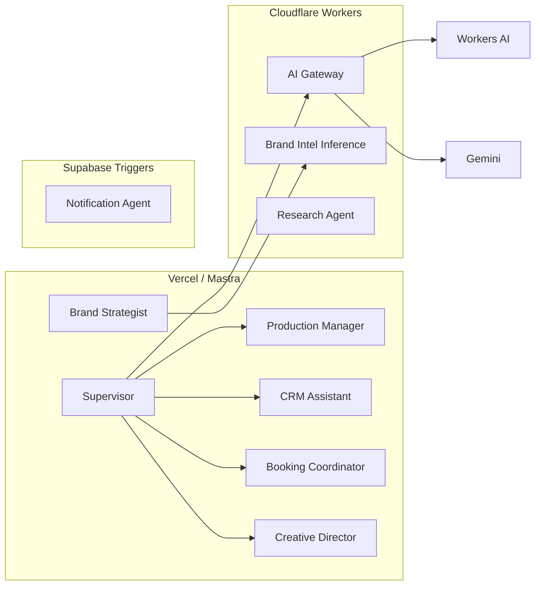
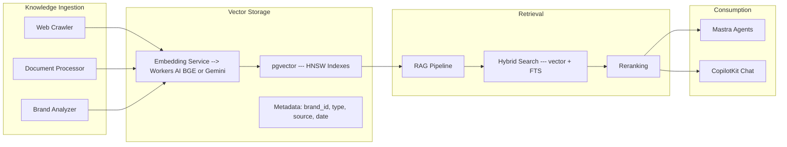

# Deep Architecture & AI Strategy Review — iPix / Lumina Studio

**Date:** 2026-07-08
**Author:** Architecture Review
**Status:** Draft
**Supersedes:** scattered architecture decisions in `tasks/cloudflare/plan/`

---

## Executive Summary

iPix has a robust but fragmented AI architecture. **8 Mastra agents** with 30+ tools, **2 Mastra workflows** with HITL gates, **2 AI-powered Supabase Edge Functions**, a **built but unwired Cloudflare AI Gateway Worker**, and **3 parallel provider abstractions** (Mastra-side, Edge-side, Worker-side). The RAG/pgvector infrastructure is schema-ready but **completely unwired** — no agent uses vector search.

**Current AI maturity:** ~45/100 — foundation exists, production flow does not.

### Key Findings

| Finding | Severity | Action |
|---------|:--------:|--------|
| 3 parallel provider abstractions (Mastra, Edge, Worker) | 🔴 P0 | Consolidate to one: AI Gateway Worker |
| AI Gateway built but **NOT wired to production** | 🔴 P0 | Wire via `@ai-sdk/openai-compatible` |
| RAG/pgvector schema-ready but **no agent uses it** | 🟡 P1 | SEARCH-001 then wire to agents |
| Prompts hardcoded inline in 8/9 agents | 🟡 P1 | Extract to prompt registry (IPI-473) |
| Tools scattered in 12+ files, no central registry | 🟡 P1 | Centralize (IPI-465) |
| 11 mis-prioritized Linear issues | 🟡 P1 | Reprioritize per this review |
| 70 AI-related Linear issues, 17 canceled, 30 backlog | 🟢 Info | Current trajectory is good |
| Groq fully removed from roadmap | 🟢 Good | Decision confirmed |
| Mastra + Cloudflare Agents SDK are complementary | 🟢 Good | Keep both, clarify boundaries |
| Cloudflare Worker (ai-gateway) has 5 tests passing | 🟢 Good | MVP done, needs production wiring |

### Recommended Architecture (Simplified)

```
Browser → CopilotKit (Chat UI) → Mastra Agents (Orchestration)
                                    ↓
Mastra Agents → ProviderAdapter.chat() → AI Gateway Worker (Routing)
                    ↓                        ↓
              Tool Registry → Supabase/pgvector/Cloudinary
```

**Three simplification wins:**
1. **One inference path** — all agents call `ProviderAdapter.chat()` → AI Gateway → provider. Kill 2 of 3 parallel abstractions.
2. **One tool registry** — all tools defined once, categorized by danger level (read/tool/HITL).
3. **One vector store** — pgvector stays default. Vectorize evaluated only if clear win.

---

## Phase 1 — Current System Architecture

### Architecture Diagram

```mermaid
C4Context
  Person(operator, "Operator", "Brand manager, creative director")
  System_Boundary(browser, "Browser") {
    System_Ext(nextjs, "Next.js :3002 (Vercel)")
  }
  System_Boundary(vercel, "Vercel") {
    Container(copilotkit, "CopilotKit Runtime", "AG-UI SSE")
    Container(mastra, "Mastra Registry", "8 agents, 2 workflows")
    Container(api, "Next.js API Routes", "bookings, shoots, brands, etc.")
  }
  System_Boundary(cloudflare, "Cloudflare Workers") {
    Container(gateway, "AI Gateway", "Provider routing, built but unwired")
  }
  System_Boundary(supabase, "Supabase") {
    ContainerDb(pg, "PostgreSQL + pgvector", "Brands, shoots, CRM, bookings, talent")
    ContainerDb(edge, "Edge Functions", "brand-intelligence, audit-asset-dna, webhooks")
  }
  System_Ext(cloudinary, "Cloudinary", "Media pipeline")
  System_Ext(gemini, "Gemini API", "Primary LLM")
  System_Ext(workersai, "Workers AI", "Secondary LLM (unused)")

  operator --> nextjs
  nextjs --> copilotkit
  copilotkit --> mastra
  mastra --> api
  mastra --> gateway
  gateway --> gemini
  gateway --> workersai
  api --> pg
  mastra -.-> edge
  edge --> gemini
  nextjs --> cloudinary
```

### What Exists Today

| Layer | Status | Details |
|-------|:------:|---------|
| **Mastra Agents** | ✅ 8 agents | `production-planner`, `creative-director`, `visual-identity`, `social-discovery`, `brand-intelligence`, `model-match`, `crm-assistant`, `booking` + 1 public |
| **Mastra Workflows** | ✅ 2 workflows | `shoot-wizard` (3-gate HITL), `brand-intelligence` (7-step HITL) |
| **CopilotKit** | ✅ v2 | AG-UI protocol, MastraAgent.getLocalAgents(), route-aware agent routing |
| **Provider Abstraction** | ⚠️ 3 parallel | Mastra (`@ai-sdk/google`), Edge (`npm:@google/genai`), Worker (OpenAI-compatible) |
| **AI Gateway Worker** | 🟡 Built, not wired | Gemini + Workers AI providers, 5 tests, no production traffic |
| **Edge Functions (AI)** | 🟡 2 active | brand-intelligence (666 lines, Gemini+Groq), audit-asset-dna (406 lines, Gemini vision) |
| **Edge Functions (non-AI)** | ✅ 5 functions | health, edge-test, capture-lead, start-brand-crawl, firecrawl-webhook |
| **pgvector / RAG** | 🟡 Schema ready, unused | pgvector enabled, HNSW indexes, embedding columns, search RPCs — **no agent uses them** |
| **Prompts** | ❌ Hardcoded inline | 8/9 agents have hardcoded system prompts in agent definition files |
| **Tool Registry** | ❌ Scattered | Tools in 12+ files, no central registry, no danger-level classification |
| **Cloudflare Workers AI** | 🟡 Available, unused | Models selected (Llama 3.1, Mistral Small, Llama 4 Scout, BGE) but no traffic |

---

## Phase 2 — Linear AI Issue Audit

### Summary (70 issues analyzed)

| Metric | Count |
|--------|------:|
| **Total AI-related issues** | 70 |
| **Canceled** | 17 (24%) |
| **Done** | 17 (24%) |
| **In Progress / In Review** | 6 (9%) |
| **Todo / Backlog** | 30 (43%) |
| **P0 (Urgent)** | 10 |
| **P1 (High)** | 7 |
| **Recommend Cancel/Archive** | 8 |
| **Mis-prioritized** | 11 |
| **Missing dependency links** | 6+ |

### Key Findings

**Duplicate scope (3 groups to resolve):**
1. **RAG overscoping** — IPI-141 (umbrella) + IPI-142/143/144 (sub-tasks) + IPI-177 (SEARCH-002). Cancel IPI-141, consolidate SEARCH-002 into SEARCH-001.
2. **pgvector splintering** — IPI-40 (brand embeddings) + IPI-143 (Mastra RAG) + IPI-323 (booking embeddings). All touch pgvector but have no shared strategy.
3. **Search eval duplication** — IPI-474 (SEARCH-001) + IPI-177 (SEARCH-002). Merge into SEARCH-001.

**Missing issues (6 gaps):**
1. **Mastra → AI Gateway wiring** — IPI-454 has AC-F ("Wire into Mastra agents") as unchecked but no separate issue tracks it.
2. **CopilotKit V2 safe-to-ship verify** — GROQ-005 was canceled, no replacement.
3. **Edge Function migration plan (non-AI)** — Only BI and DNA have migration issues. capture-lead, firecrawl-webhook, start-brand-crawl, edge-test need planning.
4. **AI observability dashboard** — IPI-460 logs costs but no UI to view them.
5. **E2E RAG pipeline integration** — RAG tasks split across 4+ issues with no integration sequence.
6. **Firecrawl migration decision** — Will firecrawl-webhook stay on Supabase or move to Workers?

**Wrong priorities (11 issues):**
- IPI-468 (SEC-001) P0→P2 — blocks nothing until pipeline exists
- IPI-473 (AGENT-003) P1→P3 — prompt registry is nice-to-have
- IPI-467 (AGENT-006) P1→P3 — browser automation doesn't block anything
- IPI-466 (AGENT-005) P1→P3 — MCP strategy is aspirational
- IPI-475 (AI-CHAT-001) P2→P1 — cross-cutting refactor affecting all operator pages
- IPI-80 (Campaign Image Agent) P3→Cancel — no campaign UI exists

**Missing dependencies (6+ links):**
- IPI-473 (Prompt Registry) → needs IPI-471 + IPI-465
- IPI-470 (Workflows) → needs IPI-471 + IPI-465
- IPI-467 (Browser Auto) → needs IPI-469 (CF platform decision)
- IPI-142/143/144 (RAG) → needs IPI-474 (SEARCH-001 vector strategy)
- IPI-380 (AI Digital Twin) → needs IPI-40 (embeddings)

### Recommended Sequencing

```
PHASE 0 (Now — ship doc tasks):
  IPI-471 AGENT-001 → ship ✓ (doc done)
  IPI-465 AGENT-002 → ship ✓ (registry design pending)
  IPI-469 CF-000 → ship ✓ (doc done)
  IPI-472 INFRA-001 → START (blocks everything else)
  IPI-468 SEC-001 → DERATE to P2

PHASE 1 (Week 2):
  IPI-472 INFRA-001 → ship
  IPI-454 AI Gateway → ship (incl. AC-F: Mastra wiring)
  IPI-457 Provider Types → ship
  IPI-461 Provider Adapter → ship
  → ONE inference path operational ←

PHASE 2 (Week 3-4):
  IPI-455 Migrate Brand Intelligence → START
  IPI-460 Cost Tracking → with Gateway landed
  IPI-462 Eval Suite → with Gateway landed
  IPI-475 AI-CHAT-001 → START

PHASE 3 (Week 5-6):
  IPI-474 SEARCH-001 → complete (unblocks RAG)
  IPI-463 Failover → after eval
  IPI-473 Prompt Registry → after tool registry

PHASE 4 (Week 7+):
  IPI-142/143/144 MASTRA-RAG (after vector decision)
  IPI-470 Workflow Orchestration
  IPI-466 MCP Strategy
  IPI-467 Browser Automation

DEFERRED:
  IPI-456 Asset DNA to CF (wait for vision eval)
  IPI-458 NVIDIA NIM (evaluation only)
  IPI-459 Groq Cleanup (after all migrations)
  IPI-177 → Merge into IPI-474
  IPI-141 → Cancel (umbrella, covered by sub-tasks)
  IPI-80 → Cancel (no campaign UI)
```

---

## Phase 3 — Official Documentation Research

### CopilotKit (docs.copilotkit.ai)

**Architecture:** Three-layer stack — Frontend (React hooks + components), Runtime (server handler), Agent (any AG-UI backend). Connected by open AG-UI protocol (16 event types, transport-agnostic).

**Generative UI — 6 primitives:**
1. **Components as Tools** — `useComponent` registers React components as agent-callable tools
2. **Tool Call Rendering** — `useRenderTool` wraps backend tool calls in custom UI cards
3. **State Rendering** — subscribe to agent state stream
4. **Reasoning** — render thinking tokens inline
5. **A2UI** — declarative UI from agent-emitted JSONL schema
6. **MCP Apps** — embed MCP-server UI in sandboxed iframes

**Key hooks for iPix:**
- `useFrontendTool` — client-side functions agent invokes (already using: navigateTo, setActiveBrand)
- `useAgentContext` — expose route/brand context to agents (already using)
- `useHumanInTheLoop` / `useInterrupt` — HITL for agent tool calls

**Recommendation for iPix:** Current v2 wiring is correct. Add `useComponent` for generative UI cards (e.g., DNA score cards rendered by brand-intelligence agent). No migration needed.

### Mastra (mastra.ai/docs)

**Supervisor Pattern** (v1.8.0+): Supervisor agent coordinates subagents via `agents: {}` config. Delegation hooks (`onDelegationStart`, `onDelegationComplete`), memory isolation, background subagents, task completion scoring, tool approval propagation.

**Workflow Engine:** `createWorkflow()` + `createStep()` with `suspend()/resume()`, parallel forks, conditional branches, `sleep()`/`sleepUntil()`, state sharing, time travel debugging.

**Memory Systems (3 types):**
1. **Message history** — thread-scoped, configurable storage
2. **Semantic recall** — RAG-based vector search on past messages (supports pgvector, Vectorize, 15+ adapters)
3. **Working memory** — persistent structured data (templates or Zod schemas)

**Cloudflare Deployment:** `@mastra/deployer-cloudflare` bundles Mastra server into a Worker. Supports KV, D1, R2, Queues bindings. Ephemeral filesystem — storage must be remote. **Recommendation:** Keep Mastra on Vercel for now. Workers deployer is useful for lightweight standalone agents but not for the main orchestration layer.

**Workers AI Provider:** 22 models available. Auth via `CLOUDFLARE_API_TOKEN` + `CLOUDFLARE_ACCOUNT_ID`. Uses OpenAI-compatible endpoint.

**Mastra + Cloudflare Gateway integration:** Use `@ai-sdk/openai-compatible` with base URL pointing to AI Gateway's `/v1/chat/completions`. Zero agent code changes needed — only provider config.

### Cloudflare (developers.cloudflare.com)

**Agents SDK:** `Agent` class extends `DurableObject` — durable identity, state, SQLite, WebSocket, scheduling, fibers, email. Tools: browser automation, sandbox, AI Search, MCP, payments. Client SDK: `AgentClient`, `useAgent`, `useAgentChat`.

**Key insight:** Agents SDK is **lower-level infrastructure** (Durable Objects + SQLite state), not a replacement for Mastra's higher-level agent framework. They are **complementary**. Use Agents SDK for: long-running stateful agent sessions, WebSocket real-time chat, agents needing persistent SQLite state. Use Mastra for: workflow orchestration, evals, memory abstraction, multi-agent coordination.

**Browser Run** (formerly Browser Rendering, renamed April 2026): Quick Actions API — screenshot, PDF, markdown, content, scrape, JSON, links, snapshot, crawl. REST API + Workers binding. Integrated with Agents SDK as `browser_execute` tool.

**Workflows:** `WorkflowEntrypoint` + `step.do()`, `step.sleep()`, `step.waitForApproval()` for HITL. Simpler than Mastra workflows — no parallel forks, no foreach, no time travel. Use for simple background processing; use Mastra for complex multi-step orchestration.

**AI Gateway:** REST API, 4 endpoint types, caching, rate limiting, guardrails, DLP, spend limits, model fallback, realtime WebSockets. Supports OpenAI, Anthropic, Google, Workers AI providers. **Already built in this project** — just needs production wiring.

### Supabase (supabase.com/docs)

**pgvector:** Full support with IVFFlat and HNSW indexes. Hybrid search (vector + full-text). RLS applies to vector queries. Edge Functions can generate embeddings via any LLM API.

**Edge Function Limits:** 10ms CPU (Free), 50ms (Pro), 100ms (Team); 256MB memory; 15s timeout (Free/Pro), 900s (Team). Invocation: 500K/month free.

**Realtime:** Broadcast, Presence, Postgres Changes. Postgres Changes with RLS filtering for notifications.

### Cross-Platform Comparison

| Capability | Mastra | Cloudflare Agents SDK | CopilotKit |
|------------|--------|---------------------|------------|
| Agent framework | High-level (supervisor, tools, memory, evals) | Low-level (DO-based, durable identity) | Frontend-only (hooks + runtime) |
| Workflows | Rich (steps, HITL, foreach, parallel, time travel) | Simple (do, sleep, waitForApproval) | N/A |
| Memory | 3 types built-in (msg history, semantic, working) | SQLite in DO (manual) | Via Enterprise platform |
| Multi-agent | Supervisor pattern with delegation hooks | Manual routing between DOs | Runtime routing + any backend |
| Evals | 20+ built-in scorers, CI integration | Not built-in | Not built-in |
| Vector DB | 17 adapters (pgvector, Vectorize, etc.) | Vectorize (managed) | N/A |
| MCP | Via `@mastra/mcp` | Native (MCPAgent + MCP client) | Via CopilotRuntime mcpApps |
| Deployment | Vercel, Cloudflare, Netlify, Workers | Cloudflare Workers (native) | Any runtime |

---

## Phase 4 — Architecture Review

### Should Mastra Remain?

**YES.** Mastra provides:
- **8 agents already built** — rewriting them all is months of work
- **2 production workflows** with HITL gates (shoot-wizard, brand-intelligence)
- **Memory abstraction** — PlannerMemory already used by production-planner
- **Evals framework** — 20+ scorers for quality gates
- **Supervisor pattern** for multi-agent coordination (not yet used, but available)
- **17 vector store adapters** including pgvector (already installed) and Vectorize
- **MCP support** via `@mastra/mcp`

**Remove Mastra only if:** You want to rebuild everything from scratch on Cloudflare Agents SDK + Workflows. This would take 3-6 months and lose evals, memory abstraction, and supervisor pattern.

### Should Cloudflare Agents SDK Replace Parts of Mastra?

**Partially — for specific use cases.** Use Agents SDK for:
- **Long-running stateful agent sessions** — Durable Objects keep state across hours/days
- **WebSocket real-time chat** — native DO WebSocket support
- **Agents needing persistent SQLite state** — DO SQLite (1GB/instance)
- **Browser automation agents** — `browser_execute` tool integrated with Agents SDK

**Keep on Mastra:**
- All existing agents (no rewrite needed)
- Workflow orchestration with HITL (Mastra's workflow engine is richer)
- Evals and quality gates
- Memory abstraction (semantic recall + working memory)
- Multi-agent supervisor coordination

**Coexistence pattern:**
```
CopilotKit → Mastra Agent (primary orchestration)
                ↓
           Cloudflare Agent (specialized sub-agent, e.g., browser automation)
```

### Should Cloudflare Workflows Replace Mastra Workflows?

**NO for complex workflows.** Mastra workflows support parallel forks, foreach loops, conditional branches, time travel debugging, and nested workflows — Cloudflare Workflows don't. Use Mastra workflows for shoot-wizard (3-gate HITL with 6 steps) and brand-intelligence (7-step parallel fan-out).

**YES for simple background processing.** Use Cloudflare Workflows for: cost log export, batch notification processing, scheduled report generation — anything that's a linear sequence without complex branching.

### Should Workers AI Replace Some Model Calls?

**YES as primary default.** Workers AI is:
- Free tier: 10K neurons/day
- Pricing: $0.011/1K neurons (~$0.05/M tokens for Llama 3.1-8B)
- Models: 22+ including Llama 3.1-8B (fast chat), Mistral Small 3.1 (structured), Llama 4 Scout (vision), BGE (embeddings)

**Transition plan:**
1. Wire AI Gateway to production → Mastra agents call Gateway
2. Set Gateway default provider to Workers AI
3. Keep Gemini as fallback for: vision tasks, structured output quality, any eval failure
4. Remove Groq (already decided, IPI-459)

### Where Are Responsibilities Duplicated?

1. **🔴 3 Parallel Provider Abstractions**
   - `app/src/lib/ai/provider.ts` — Mastra-side (Gemini via `@ai-sdk/google`, Groq via lazy `require`)
   - `supabase/functions/_shared/llm/` — Edge-side (Gemini via `npm:@google/genai`, Groq via raw `fetch`)
   - `services/cloudflare-worker/src/providers/` — Worker-side (Gemini + Workers AI via raw fetch)
   - **Fix:** Consolidate to AI Gateway Worker. Mastra calls Gateway via `@ai-sdk/openai-compatible`. Edge functions migrate to Workers (IPI-455). Kill the Edge-side abstraction entirely.

2. **🟡 Mastra PostgresStore + Supabase PostgreSQL**
   - `app/src/mastra/storage.ts` uses `@mastra/pg` for workflow/memory storage
   - Supabase PostgreSQL is also system of record for business data
   - Currently separate connections — fine for now, but could share the pool in future

3. **🟡 Paginated list RPCs in Supabase + Client-side filtering in React**
   - Some lists paginate server-side (bookings), others fetch-all + client-filter (brand list)
   - Not a duplication per se, but inconsistent pattern

4. **🟢 AI Gateway (Worker) + Mastra resolveModel() — Complementary, not duplicate**
   - Gateway handles provider routing + caching + rate limiting
   - Mastra handles model tier selection + agent model config
   - Gateway is the network layer, Mastra is the application layer

### What Should Move?

| Component | From | To | When |
|-----------|------|----|:----:|
| AI inference calls | Mastra direct SDK | Via AI Gateway Worker | IPI-454 AC-F |
| Brand Intelligence | Supabase Edge Function | Cloudflare Worker | IPI-455 |
| Prompts | Hardcoded in agents | Prompt registry (KV) | IPI-473 |
| Tools | Scattered files | Central tool registry | IPI-465 |
| Cost logging | Not implemented | ai_agent_logs via Gateway | IPI-460 |

### What Should Stay?

| Component | Location | Rationale |
|-----------|----------|-----------|
| Mastra agents | Vercel | 8 agents, 2 workflows, evals, memory |
| CopilotKit | Vercel + Next.js | Chat UI, frontend tools, AG-UI runtime |
| All business data | Supabase PostgreSQL | System of record, RLS, Realtime, pgvector |
| Auth | Supabase Auth | PKCE, RLS, OAuth |
| Media pipeline | Cloudinary | Upload, transform, deliver |
| pgvector | Supabase | Already enabled, schema exists, Mastra supports natively |
| Non-AI edge functions | Supabase | Firecrawl webhook, capture-lead — low value to move |

### What Should Be Removed?

| Component | Action | Rationale |
|-----------|--------|-----------|
| Groq code paths | Remove | Provider volatility, never reached production |
| `config/groq-models.json` | Remove | Replaced by AI Gateway model registry |
| Edge `_shared/llm/` abstraction | Remove | After BI migration, no edge function needs LLM routing |
| IPI-141 (RAG umbrella) | Cancel | Covered by sub-tasks |
| IPI-177 (SEARCH-002) | Merge into IPI-474 | Duplicate scope |
| IPI-80 (Campaign Image Agent) | Cancel | No campaign UI, no product owner |
| IPI2-123 (MATCH-001) | Recreate on IPI team | Orphaned on old team |
| IPI-468 (SEC-001) | Derate to P2 | Not blocking anything |

---

## Phase 5 — Expert Agent Architecture

### Agent Organization

```mermaid
flowchart TD
    SUP[Supervisor Agent]
    SUP --> PHOTO[Photography Expert]
    SUP --> FASHION[Fashion Expert]
    SUP --> JEWELRY[Jewelry Expert]
    SUP --> CREATIVE[Creative Director]
    SUP --> CAMPAIGN[Campaign Strategist]
    SUP --> SOCIAL[Social Media Expert]
    SUP --> BRAND[Brand Strategist]
    SUP --> EQUIP[Equipment Advisor]
    SUP --> LIGHT[Lighting Expert]
    SUP --> RETOUCH[Retouching Expert]
    SUP --> VIDEO[Video Expert]
    SUP --> MKT[Maketplace Expert]
    SUP --> AMAZON[Amazon Expert]
    SUP --> SHOPIFY[Shopify Expert]
    SUP --> SEO[SEO Expert]
    SUP --> WRITER[Content Writer]
    SUP --> ANALYTICS[Analytics Expert]
    SUP --> BOOKING[Booking Coordinator]
    SUP --> PROD[Production Manager]
    SUP --> CASTING[Casting Director]
    SUP --> TALENT[Talent Expert]
    SUP --> CS[Customer Success]
    SUP --> ADMIN[Admin Agent]

    style SUP fill:#1E293B,color:#fff,stroke:#E87C4D
    style PHOTO fill:#333,color:#fff
    style FASHION fill:#333,color:#fff
    style CREATIVE fill:#333,color:#fff
    style BRAND fill:#333,color:#fff
    style PROD fill:#333,color:#fff
    style TALENT fill:#333,color:#fff
```



### Supervisor Agent

| Property | Value |
|----------|-------|
| **Purpose** | Route operator requests to the right expert agent, aggregate responses, maintain conversation coherence |
| **Responsibility** | Intent classification, agent routing, response composition, escalation handling |
| **Tools** | `routeToAgent`, `aggregateResponses`, `escalateToHuman` |
| **Workflows** | Intent resolution (classify → route → respond) |
| **Model tier** | `default` (fast classification), `structured` (complex routing decisions) |
| **Memory** | Full conversation history — all sub-agent interactions |
| **Knowledge sources** | Agent capability catalog, routing rules |
| **Runtime** | Mastra on Vercel (supervisor pattern via delegation hooks) |
| **Database tables** | `ai_agent_logs` (routing decisions, latency) |

### Photography Expert

| Property | Value |
|----------|-------|
| **Purpose** | Advise on photography techniques, shot composition, camera settings for fashion/product shoots |
| **Responsibilities** | Recommend camera/lens, shot composition guidance, lighting setup advice, technique troubleshooting |
| **Tools** | `lookupShotReferences`, `recommendCameraSetup`, `explainLightingSetup` |
| **Workflows** | Shoot planning advisory |
| **Model** | `default` |
| **Memory** | Session context |
| **Knowledge sources** | Photography reference library, equipment specs, past shoot data |
| **Screens** | Shoot Wizard (Shot List step), Shoot Detail (Notes tab) |
| **Database tables** | `shoots`, `shot_references` |

### Fashion Expert

| Property | Value |
|----------|-------|
| **Purpose** | Provide fashion-specific guidance: styling, trends, garment care, brand alignment |
| **Responsibilities** | Style recommendations, trend analysis, brand voice consistency, garment selection advice |
| **Tools** | `analyzeBrandStyle`, `suggestOutfit`, `checkBrandAlignment` |
| **Workflows** | Creative direction advisory |
| **Model** | `default` |
| **Memory** | Session context |
| **Knowledge sources** | Brand DNA profiles, fashion trend database, lookbook references |
| **Screens** | Brand Detail (DNA scores), Shoot Wizard (Creative Brief step) |
| **Database tables** | `brands.ai_profile`, `brand_scores` |

### Jewelry Expert

| Property | Value |
|----------|-------|
| **Purpose** | Specialized advice for jewelry photography: lighting techniques, reflection management, product styling |
| **Responsibilities** | Macro photography guidance, reflection/highlight management, jewelry styling suggestions |
| **Tools** | `recommendJewelryLighting`, `suggestMacroSetup` |
| **Workflows** | Jewelry shoot advisory |
| **Model** | `default` |
| **Memory** | Session context |
| **Knowledge sources** | Jewelry photography guides, equipment recommendations |
| **Screens** | Shoot Wizard (when shoot type = jewelry/macro product) |
| **Database tables** | `shoots` |

### Creative Director (Existing: `creative-director`)

| Property | Value |
|----------|-------|
| **Purpose** | Turn brand DNA and campaign objectives into creative briefs, moodboards, and visual direction |
| **Responsibilities** | Creative brief generation, moodboard creation, visual direction, brand storytelling |
| **Tools** | `generateCreativeBrief`, `createMoodboard`, `analyzeVisualDirection` (currently: none) |
| **Workflows** | Creative direction workflow (future) |
| **Model** | `default` (currently `gemini-3.1-flash-lite`) |
| **Memory** | MastraMemory (currently configured, consider PlannerMemory for brief progression) |
| **Knowledge sources** | Brand DNA, campaign objectives, past shoot results, creative playbooks |
| **Screens** | Campaigns (SCR-07), Brand Detail (Creative Brief), Shoot Wizard |
| **Database tables** | `brands`, `brand_scores`, `campaigns`, `shoots` |
| **Current state** | ✅ Exists as Mastra agent. ❌ No tools assigned (urgent gap). Need to add `generateCreativeBrief`, `createMoodboard` tools. |

### Campaign Strategist

| Property | Value |
|----------|-------|
| **Purpose** | Plan and optimize multi-channel campaigns: set objectives, define deliverables, track performance |
| **Responsibilities** | Campaign brief creation, channel selection, deliverable planning, KPI tracking |
| **Tools** | `createCampaignBrief`, `planChannelDeliverables`, `trackCampaignKpis` |
| **Workflows** | Campaign planning (future, needs Campaigns UI) |
| **Model** | `default` (brief generation), `structured` (deliverable planning) |
| **Memory** | Campaign session context |
| **Knowledge sources** | Campaign templates, channel specs, past campaign data |
| **Screens** | Campaigns (SCR-07), Campaign Detail (SCR-17) |
| **Database tables** | `campaigns`, `campaign_deliverables` |
| **Current state** | 🔴 Not built. Campaigns UI is 5% stub. Backend schema deployed (IPI-268). |

### Social Media Expert (Existing pattern: `social-discovery`)

| Property | Value |
|----------|-------|
| **Purpose** | Discover, analyze, and recommend social media content strategy across channels |
| **Responsibilities** | Social channel discovery, content calendar planning, platform-specific optimization, hashtag/tag research |
| **Tools** | `discoverSocialChannels` (exists), `planContentCalendar`, `recommendHashtags`, `analyzeSocialPerformance` |
| **Workflows** | Social media content planning |
| **Model** | `default` |
| **Memory** | Session context |
| **Knowledge sources** | Social media best practices, brand-specific channel data, platform specs |
| **Screens** | Brand Detail (Social Profiles), Content Calendar |
| **Database tables** | `brands.ai_profile` (social channels stored in profile) |
| **Current state** | ✅ `social-discovery` agent exists with `discoverSocialChannels` tool. Needs expanded toolset. |

### Brand Strategist (Existing: `brand-intelligence`)

| Property | Value |
|----------|-------|
| **Purpose** | Analyze brand identity, extract DNA scores, and provide competitive brand intelligence |
| **Responsibilities** | Brand URL analysis, DNA scoring, competitive analysis, brand voice extraction |
| **Tools** | `startBrandAnalysis` (exists), `getBrandProfile` (exists), `getBrandScores` (exists), `explainPillar` (exists), `approveDraft` (exists) |
| **Workflows** | Brand intelligence (7-step HITL, exists) |
| **Model** | `default` (profile extraction), `structured` (DNA scoring). After IPI-455: Workers AI default, Gemini fallback |
| **Memory** | MastraMemory (exists), crawl results cache |
| **Knowledge sources** | Crawl results, brand URLs, competitive brand data |
| **Screens** | Command Center, Brand List, Brand Detail, Brand Onboarding |
| **Database tables** | `brands`, `brand_scores`, `brand_crawls`, `brand_crawl_results`, `brand_graph_nodes` |
| **Current state** | ✅ Fully built. 5 tools, 7-step HITL workflow. IPI-455 will migrate inference to Cloudflare Worker. |

### Equipment Advisor

| Property | Value |
|----------|-------|
| **Purpose** | Recommend photography/video equipment based on shoot type, budget, and brand requirements |
| **Responsibilities** | Camera/lens recommendations, lighting equipment selection, accessory suggestions |
| **Tools** | `recommendEquipment`, `checkEquipmentAvailability` |
| **Workflows** | Equipment planning (part of shoot planning) |
| **Model** | `default` |
| **Memory** | Session context |
| **Knowledge sources** | Equipment catalog, shoot-type-to-equipment mapping, rental prices |
| **Screens** | Shoot Wizard (equipment step — future) |
| **Database tables** | None yet (equipment data not modeled) |
| **Current state** | 🔴 Not built. Low priority — equipment recommendations can be handled by the production-planner agent initially. |

### Content Writer

| Property | Value |
|----------|-------|
| **Purpose** | Create and optimize product descriptions, ad copy, social posts, and campaign content |
| **Responsibilities** | Product description writing, ad copy creation, email copy, SEO-optimized content |
| **Tools** | `writeProductDescription`, `generateAdCopy`, `optimizeForSeo` |
| **Workflows** | Content generation (approval flow) |
| **Model** | `default` (general writing), `structured` (SEO-optimized) |
| **Memory** | Brand voice context |
| **Knowledge sources** | Brand guidelines, product data, SEO keyword database |
| **Screens** | Amazon Optimization, Shopify Optimization, Product Linking |
| **Database tables** | `commerce_product_links` |
| **Current state** | 🔴 Not built. Post-MVP. |

### Booking Coordinator (Existing: `booking`)

| Property | Value |
|----------|-------|
| **Purpose** | Draft booking requests, check talent availability, and manage the booking lifecycle |
| **Responsibilities** | Availability checking, quote drafting, booking request creation (HITL), schedule management |
| **Tools** | `checkTalentAvailability` (exists), `draftBookingQuote` (exists), `createBookingDraft` (exists) |
| **Workflows** | Booking request (needs SCR-21 UI) |
| **Model** | `default` |
| **Memory** | Session context (none currently — should add MastraMemory) |
| **Knowledge sources** | Talent profiles, rate cards, availability calendars |
| **Screens** | Booking Wizard (SCR-21), Booking Detail (SCR-22), Matching/Shortlist |
| **Database tables** | `talent.bookings`, `talent.talent_profiles`, `talent.talent_availability` |
| **Current state** | ✅ Agent exists, 3 tools, draft-only verified (IPI-397). UI screens are greenfield. |

### Production Manager (Existing: `production-planner`)

| Property | Value |
|----------|-------|
| **Purpose** | Plan and manage fashion photo shoots end-to-end: type, deliverables, shot list, budget |
| **Responsibilities** | Shoot type recommendation, deliverable planning, shot list generation, budget estimation, crew management |
| **Tools** | `recommendShootType` (exists), `planDeliverables` (exists), `lookupShotReferences` (exists), `lookupChannelSpecs` (exists), `generateShotListDraft` (exists), `estimateShootBudget` (exists), `saveApprovedShootDraft` (exists), `approveShotList` (exists), `explainShootDnaAlerts` (exists) |
| **Workflows** | Shoot wizard (3-gate HITL, exists) |
| **Model** | `default` (planning), `structured` (shot list), `vision` (DNA alerts) |
| **Memory** | PlannerWorkingMemory (exists — best-in-class memory config) |
| **Knowledge sources** | Shot references, channel specs, brand DNA, past shoot data |
| **Screens** | Shoot Wizard (SCR-06), Shoot Detail (SCR-05) |
| **Database tables** | `shoots`, `shoot.shoot_crew` |
| **Current state** | ✅ Best-in-class agent. 10 tools, 3-gate HITL workflow, PlannerMemory. |

### Casting Director

| Property | Value |
|----------|-------|
| **Purpose** | Source and recommend talent models for shoots based on brand requirements and project needs |
| **Responsibilities** | Talent search/filter, shortlist management, casting recommendations |
| **Tools** | `searchTalentByFilters` (exists as model-match), `manageShortlist` (exists), `recommendTalent` |
| **Workflows** | Casting selection (future) |
| **Model** | `default` |
| **Memory** | Session context |
| **Knowledge sources** | Talent profiles, past shoot talent assignments, brand preferences |
| **Screens** | Matching (SCR-09), Talent Profile (SCR-20), Shoot Detail (Crew tab) |
| **Database tables** | `talent.talent_profiles`, `talent.talent_shortlists`, `shoot.shoot_crew` |
| **Current state** | 🟡 `model-match` agent exists with 3 tools. Rename intent to casting director. Expand with `recommendTalent`. |

### Talent Expert

| Property | Value |
|----------|-------|
| **Purpose** | Manage talent profiles, availability, and career data |
| **Responsibilities** | Profile management, availability tracking, rate card management |
| **Tools** | `updateTalentProfile`, `checkAvailability` (exists), `manageRateCard` |
| **Workflows** | Talent onboarding |
| **Model** | `default` |
| **Memory** | Session context |
| **Knowledge sources** | Talent profiles, booking history, performance data |
| **Screens** | Talent Profile (SCR-20), Roster Dashboard (SCR-25) |
| **Database tables** | `talent.talent_profiles`, `talent.talent_availability` |
| **Current state** | 🔴 Not built. Profile management handled manually via DB tools. |

### Remaining Experts (13 more)

Each follows the same pattern. Summary table:

| Expert | Priority | Current State | Uses Existing Agent? |
|--------|:--------:|:-------------:|:--------------------:|
| Lighting Expert | P3 | Not built | No — equipment advisor covers initial needs |
| Retouching Expert | P3 | Not built | No — post-production guide exists in skills |
| Video Expert | P3 | Not built | No — production-planner covers shoot types |
| Marketplace Expert | P3 | Not built | No — post-MVP |
| Amazon Expert | P3 | Not built | No — post-MVP |
| Shopify Expert | P3 | Not built | No — post-MVP |
| SEO Expert | P3 | Not built | No — content writer can handle initial SEO |
| Analytics Expert | P3 | Not built | Needs SCR-16/17 analytics UI |
| Customer Success | P4 | Not built | Way post-MVP |
| Admin Agent | P4 | Not built | Way post-MVP |

**Recommendation:** Build Supervisor + expand existing 8 agents first. Add new agents only when their primary screen/UI exists.

### Runtime Decision Matrix



---

## Phase 6 — Workflow Design

### Workflow Priority Matrix

| Workflow | Status | Priority | Engine | HITL Gates |
|----------|:------:|:--------:|:------:|:----------:|
| Brand Intelligence | ✅ Existing | P0 | Mastra | 2 (profile draft, commit/reject) |
| Shoot Planning | ✅ Existing | P0 | Mastra | 3 (deliverables, shot list, budget) |
| Booking Request | ⚪ UI needed | P1 | Mastra | 1 (operator confirm) |
| Campaign Planning | ⚪ Schema ready | P2 | Mastra | 2 (brief approval, deliverable review) |
| Brand Onboarding | ⚪ Needs design | P1 | Mastra + CF Workflow | 1 (brand profile review) |
| AI Brief Creation | ⚪ Needs design | P1 | Mastra | 1 (creative brief approval) |
| Creative Direction | ⚪ Needs design | P2 | Mastra | 1 (direction approval) |
| Talent Matching | ✅ Agent exists | P2 | Mastra (light) | 0 (read-only recommendations) |
| Casting | ⚪ Needs design | P2 | Mastra | 1 (shortlist approval) |
| Asset DNA Scoring | ⏸ Deferred | P3 | Cloudflare Workflow | 0 (auto-score, batch) |
| Asset Review | ⚪ Needs design | P2 | Mastra | 1 (score acceptance) |
| Product Linking | ⚪ Needs design | P3 | Mastra | 1 (link approval) |
| Amazon Optimization | ⚪ Needs design | P3 | Mastra | 1 (content approval) |
| Shopify Optimization | ⚪ Needs design | P3 | Mastra | 1 (content approval) |
| Social Media Planning | ⚪ Needs design | P2 | Mastra | 1 (content calendar approval) |
| Content Calendar | ⚪ Needs design | P2 | Mastra | 0 (suggestions) / 1 (publish approval) |
| Analytics | ⚪ Needs UI | P3 | Cloudflare Workflow | 0 (auto-generated reports) |

### Workflow: Brand Intelligence (Existing — 7-step HITL)

```
Trigger: Operator adds brand URL → "Analyze this brand"

Steps:
1. validate-brand → checks brand exists, sets crawl_running
2. start-crawl → calls Firecrawl (Supabase Edge → eventually CF Worker)
3. wait-for-crawl → SUSPEND → webhook resumes | 3 retries | timeout → error
4. extract-profile → Workers AI structured output (or Gemini fallback)
5. fan-out-enrichment → parallel social + visual identity (best-effort)
6. save-draft-and-wait → SUSPEND → operator reviews draft
7. commit-or-reject → HITL approve/reject → writes brands + brand_scores

Engine: Mastra Workflow (needs parallel fork at step 5, conditional branches)
```

### Workflow: Shoot Planning (Existing — 3-gate HITL)

```
Trigger: Operator starts "New Shoot" wizard

Steps:
1. recommend-shoot-type → AI suggests type based on brand/channel
2. plan-deliverables → AI proposes deliverables per channel
3. deliverable-gate → SUSPEND → operator approves/edits deliverables
4. generate-shot-list → AI generates shot list from deliverables
5. shot-list-gate → SUSPEND → operator approves/edits shot list  
6. estimate-budget → AI calculates budget from shot list
7. budget-gate → SUSPEND → operator approves budget
8. save-draft → commits to DB

Engine: Mastra Workflow (3 suspend/resume gates, sequential)
```

### Workflow: Booking Request (Needs SCR-21 UI)

```
Trigger: Operator on Talent Profile → "Book this talent"

Steps:
1. check-availability → booking agent checks talent availability
2. draft-quote → AI drafts rate + message (read-only, no DB write)
3. review-quote → SUSPEND → operator reviews/edits quote
4. operator-confirm → createBookingDraft(operatorConfirmed: true)
5. create-booking → create_booking_request RPC → notification to talent
6. talent-responds → async (booking goes to quoted/approved/declined)

Engine: Mastra Workflow (1 suspend for HITL, sequential)
```

### Workflow: AI Brief Creation

```
Trigger: Operator on Brand Detail → "Create a creative brief"

Steps:
1. load-brand-dna → fetches brand.ai_profile + brand_scores
2. load-campaign-context → fetches campaign brief (if any)
3. generate-brief → AI drafts creative brief (brand voice, target audience, visual direction)
4. brief-review → SUSPEND → operator reviews/edits brief
5. save-brief → writes to creative brief table

Engine: Mastra Workflow (1 suspend for HITL)
```

### Workflow: Brand Onboarding

```
Trigger: New user signs up → creates first brand

Steps:
1. create-brand-record → creates brand row with intake_status='pending'
2. ai-assist-onboarding → AI guides operator through brand setup:
   a. Brand URL/name
   b. Brand category/focus
   c. Target channels
3. submit-for-analysis → triggers brand intelligence workflow
4. onboarding-complete → sets brand as active

Engine: Cloudflare Workflow (simple sequential, no complex branching needed)
```

---

## Phase 7 — Screen Impact Analysis

| Screen | Route | AI Assistant | Suggestions | Approvals | Workflows | Artifacts | Chat | Panel |
|--------|:-----:|:------------:|:-----------:|:---------:|:---------:|:---------:|:----:|:-----:|
| **Command Center** | `/app` | production-planner | Upcoming shoots, pending approvals | Booking approvals | Brand analysis | Dashboard | ✅ | Intel |
| **Brand List** | `/app/brand` | brand-intelligence | Brands needing analysis | Draft review | Brand intelligence | Brand cards | ✅ | Intel |
| **Brand Detail** | `/app/brand/[id]` | brand-intelligence | DNA score gaps, enrichment | DNA approval | Brand intelligence | DNA scores, profile | ✅ | Intel |
| **Brand Onboarding** | `/app/onboarding` | brand-intelligence | Next steps, missing info | Profile approval | Brand onboarding | Brand profile | ✅ | Intel |
| **AI Brief** | TBD | creative-director | Brief suggestions | Brief approval | Creative brief | Brief text | ✅ | Intel |
| **Campaigns** | `/app/campaigns` | campaign-agent | Campaign ideas | Brief/deliverable approval | Campaign planning | Campaign brief | ✅ | Intel |
| **Shoot Wizard** | `/app/shoots/new` | production-planner | Shoot type, deliverables | 3 HITL gates | Shoot planning | Shot list, budget | ✅ | Steps |
| **Shoot Detail** | `/app/shoots/[id]` | production-planner | DNA alerts, crew suggestions | Crew approval | — | Status, timeline | ✅ | Intel |
| **Asset Library** | `/app/assets` | creative-director | Asset tagging, organization | Bulk actions | — | Grid/list | ✅ | Intel |
| **Asset Detail** | `/app/assets/[id]` | visual-identity | DNA score, similar assets | Score acceptance | Asset DNA (future) | DNA badge | ✅ | Intel |
| **Product Linking** | `/app/linking` | marketplace-expert | Link suggestions | Link approval | Product linking | Link table | ✅ | Intel |
| **Matching** | `/app/matching` | model-match | Talent recommendations | Shortlist | Talent matching | Talent cards | ✅ | Intel |
| **Talent Profile** | `/app/matching/talent/[id]` | booking | Availability, rate suggestions | — | — | Profile hero | ✅ | Intel |
| **Booking Wizard** | `/app/matching/talent/[id]/book` | booking | Quote draft | Booking approval | Booking request | Quote card | ✅ | Wizard |
| **Booking Detail** | `/app/bookings/[id]` | booking | Status updates, reschedule | Transitions | — | Timeline | ✅ | Intel |
| **Model Dashboard** | `/app/model` | booking | Upcoming bookings | — | — | KPIs | ✅ | Intel |
| **Roster Dashboard** | `/app/roster` | booking | Talent availability | — | — | Talent list | ✅ | Intel |
| **CRM List** | `/app/crm/companies`, `/app/crm/contacts` | crm-assistant | Deal suggestions, activity logging | Stage transitions | — | Table rows | ✅ | Intel |
| **CRM Detail** | `/app/crm/companies/[id]`, `/app/crm/contacts/[id]` | crm-assistant | Activity summaries, deal progression | Activity logging | — | Profile360 | ✅ | Intel |
| **CRM Pipeline** | `/app/crm/pipeline` | crm-assistant | Deal movement suggestions | Stage transitions | — | Pipeline view | ✅ | Intel |
| **Analytics** | `/app/analytics` | analytics-expert | KPI insights, trend detection | — | Analytics reports | Charts | ✅ | Intel |
| **Inbox** | `/app/inbox` | — | Notification grouping | — | — | Activity feed | ❌ | — |
| **Settings** | `/app/settings` | — | — | — | — | Form | ❌ | — |

**Key finding:** Every screen with a chat dock (`✅`) already has CopilotKit integration via the OperatorPanel. The route-agent-map already assigns agents per route. The work is in:
1. Building missing screens (Booking, Talent Profile, Analytics)
2. Adding tool support to agents that have none (creative-director)
3. Wiring AI suggestions per screen context

---

## Phase 8 — Knowledge Architecture

### Current State

| Component | Status | Location |
|-----------|:------:|----------|
| pgvector extension | ✅ Enabled | Supabase |
| HNSW indexes | ✅ 3 indexes | brand_graph_nodes, agent_context_snapshots, talent_profiles |
| Embedding columns | ✅ 3 columns | brands, brand_graph_nodes, talent_profiles |
| Search RPCs | ✅ 2 RPCs | search_brands (vector), search_context_snapshots |
| Embedding models | ✅ Available | Workers AI (BGE-base), Gemini (text-embedding-004) |
| Production RAG pipeline | ❌ Not wired | No agent calls vector search |

### Recommended Architecture



### PostgreSQL Schema (Existing)

```sql
-- agent_context_snapshots (already exists)
CREATE TABLE agent_context_snapshots (
  id uuid PRIMARY KEY DEFAULT gen_random_uuid(),
  org_id uuid NOT NULL REFERENCES organizations(id),
  brand_id uuid REFERENCES brands(id),
  snapshot_type text NOT NULL,
  content text NOT NULL,
  embedding vector(768),
  metadata jsonb DEFAULT '{}',
  created_at timestamptz DEFAULT now()
);
CREATE INDEX idx_agent_context_snapshots_embedding 
  ON agent_context_snapshots 
  USING hnsw (embedding vector_cosine_ops);

-- brand_graph_nodes (already exists)  
CREATE TABLE brand_graph_nodes (
  id uuid PRIMARY KEY DEFAULT gen_random_uuid(),
  brand_id uuid NOT NULL REFERENCES brands(id),
  node_type text NOT NULL,
  label text NOT NULL,
  properties jsonb DEFAULT '{}',
  embedding vector(768),
  created_at timestamptz DEFAULT now()
);
CREATE INDEX idx_brand_graph_nodes_embedding
  ON brand_graph_nodes
  USING hnsw (embedding vector_cosine_ops);
```

### Chunking Strategy

| Content Type | Chunk Size | Overlap | Chunk Strategy |
|-------------|:----------:|:-------:|----------------|
| Brand crawl results | 512 tokens | 64 tokens | Semantic boundary (heading-based) |
| Brand DNA profiles | Full document | — | Single embedding (short documents) |
| Past shoot briefs | 1024 tokens | 128 tokens | Recursive character split |
| Knowledge base articles | 512 tokens | 64 tokens | Recursive character split |
| Campaign docs | 1024 tokens | 128 tokens | Semantic boundary |
| Social media content | Full post | — | Single embedding (short content) |

### RAG Strategy

**Phase 1 (P1 — SEARCH-001):**
- Evaluate pgvector vs Vectorize vs AI Search
- Keep pgvector as default (already enabled, Mastra supports natively)
- Hybrid search: vector cosine similarity + full-text search (tsvector)
- Metadata filtering: brand_id, org_id, type, date range

**Phase 2 (P2 — MASTRA-RAG-001/002/003):**
- Content chunking pipeline (Worker-based)
- Embedding generation via Workers AI BGE (768-dim)
- Mastra semantic recall for agent memory
- Brand knowledge retrieval for brand-intelligence agent

**Phase 3 (P3 — IPI-280/MEM-001):**
- Observational memory (compress old messages into dense observations)
- Graph RAG (traverse brand_graph_nodes + edges)
- Cross-brand knowledge discovery

### Embedding Model Decision

| Model | Dimensions | Provider | Cost | Status |
|-------|:--------:|:--------:|:----:|:------:|
| `@cf/baai/bge-base-en-v1.5` | 768 | Workers AI | $0.067/M | **Default** |
| `text-embedding-004` | 768 | Gemini | $0.10/M | Fallback |
| `@cf/intel/dclm-7b` | 768 | Workers AI | $0.045/M | Future eval |

**Recommendation:** Start with BGE-base (768-dim, matches existing schema). Evaluate Qwen3-embedding when available.

---

## Phase 9 — Model Strategy

### Model per Use Case

| Use Case | Primary Model | Fallback | Cost | Rationale |
|----------|:-------------:|:--------:|:----:|-----------|
| **Chat** (CopilotKit conversations) | Workers AI Llama 3.1-8B | Gemini 3.1 flash-lite | Free/$0.045 | Fast, good conversation quality |
| **Reasoning** (complex planning) | Workers AI Mistral Small 3.1 | Gemini 3.1 flash-lite | $0.35 | 128k context, strong reasoning |
| **Planning** (shoot/budget planning) | Workers AI Mistral Small 3.1 | Gemini 3.1 flash-lite | $0.35 | Structured output for plans |
| **Vision** (DNA scoring, visual ID) | Gemini 3.5 flash | Workers AI Llama 4 Scout | $0.50 | Workers AI vision is limited |
| **OCR** (document processing) | Gemini 3.5 flash | Workers AI Llama 4 Scout | $0.50 | Mature OCR capability |
| **Embeddings** (vector search) | Workers AI BGE-base | Gemini text-embedding-004 | $0.067/M | Matches existing 768-dim schema |
| **Reranking** | None (defer) | — | — | No production need yet |
| **Classification** (intent routing) | Workers AI Llama 3.1-8B | Gemini 3.1 flash-lite | Free/$0.045 | Simple classification, no heavy model needed |
| **Summaries** (crawl results, reports) | Workers AI Mistral Small 3.1 | Gemini 3.1 flash-lite | $0.35 | Long context for long documents |
| **Creative writing** (briefs, copy) | Workers AI Mistral Small 3.1 | Gemini 3.1 flash-lite | $0.35 | Good creative quality |
| **Code generation** | Workers AI Kimi K2.6 | Gemini 3.1 flash-lite | $0.95 | Best agentic coding model |

### Provider Decision Tree

```mermaid
flowchart TD
    QUERY[Agent calls resolveModel(tier)]
    QUERY --> GATEWAY{AI Gateway available?}
    GATEWAY -->|Yes| GATEWAY_ROUTE[Route through AI Gateway]
    GATEWAY -->|No| DIRECT[Direct SDK call]
    GATEWAY_ROUTE --> TIER{Which tier?}
    TIER -->|default / fast| WA[Workers AI - Llama 3.1-8B / Mistral Small]
    TIER -->|structured| WA_STRUCT[Workers AI - Mistral Small 3.1]
    TIER -->|vision| GEMINI_VISION[Gemini 3.5 flash]
    TIER -->|embedding| WA_EMBED[Workers AI - BGE-base]
    WA -->|Eval fails| GEMINI_FALLBACK[Gemini 3.1 flash-lite]
    WA_STRUCT -->|Eval fails| GEMINI_STRUCT[Gemini 3.1 flash-lite with structured config]
    GEMINI_VISION -->|Eval fails| WA_VISION[Workers AI - Llama 4 Scout]
```

### Cost Analysis (Monthly, 100K requests/day)

| Use Case | Workers AI | Gemini | Savings |
|----------|:----------:|:------:|:-------:|
| Chat (100K req, 500 tok/req) | $2.25 | $25.00 | **$22.75** |
| Structured (50K req, 1K tok/req) | $17.50 | $25.00 | **$7.50** |
| Vision (10K req, 1K tok/req) | $0.00 (deferred) | $5.00 | — |
| Embeddings (50K req, 100 tok/req) | $0.34 | $0.50 | **$0.16** |
| **Total monthly** | **~$20.09** | **~$55.50** | **~$35.41** |

**Recommendation:** Workers AI as default saves ~$35/month at current volume. At 10x volume (1M requests/day), savings scale to ~$350/month. Not a game-changer financially, but the free tier (10K neurons/day) makes it zero-cost for MVP.

---

## Phase 10 — New Linear Tasks

### Issues to Create

**1. Mastra → AI Gateway Wiring (add AC-F to IPI-454 or create sub-issue)**

| Field | Value |
|-------|-------|
| **Title** | AI Gateway: Wire Mastra agents via @ai-sdk/openai-compatible |
| **Purpose** | Route all Mastra agent inference through the AI Gateway Worker |
| **User Story** | As an operator, I want all AI calls to go through the AI Gateway so I get caching, rate limiting, and provider fallback |
| **Dependencies** | IPI-454, IPI-461 |
| **AC** | A. ProviderAdapter calls gateway endpoint B. Zero agent code changes C. Gateway fallback works D. 808/808 tests pass |
| **Estimate** | S (4h) |
| **Priority** | P0 |

**2. CopilotKit V2 Production Verification**

| Field | Value |
|-------|-------|
| **Title** | COPILOTKIT-V2-VERIFY: Production readiness audit |
| **Purpose** | Verify CopilotKit v2 wiring is production-safe |
| **User Story** | As an operator, I want the AI chat to be stable and reliable |
| **Dependencies** | None |
| **AC** | A. All routes resolve correct agent B. AG-UI streaming works C. Thread persistence works D. HITL gates function E. Frontend tools execute |
| **Estimate** | S (3h) |
| **Priority** | P1 |

**3. Non-AI Edge Function Migration Plan**

| Field | Value |
|-------|-------|
| **Title** | INFRA-003: Plan remaining Supabase Edge Function migration |
| **Purpose** | Document migration plan for capture-lead, firecrawl-webhook, start-brand-crawl |
| **User Story** | As a platform engineer, I want to know which edge functions to migrate and when |
| **Dependencies** | IPI-472 (deployment pipeline) |
| **AC** | A. Migration decision per function B. Dependency analysis C. Timeline |
| **Estimate** | S (2h) |
| **Priority** | P2 |

**4. AI Cost Dashboard (add to IPI-460 scope)**

| Field | Value |
|-------|-------|
| **Title** | AI Cost Dashboard (add AC to IPI-460 or create sub-issue) |
| **Purpose** | Visualize AI provider costs from ai_agent_logs |
| **User Story** | As an admin, I want to see how much each AI provider costs me |
| **Dependencies** | IPI-460 |
| **AC** | A. Dashboard route exists B. Logs display cost/provider C. Filters by date range D. Aggregate by agent |
| **Estimate** | M (1d) |
| **Priority** | P2 |

### Issues to Cancel/Archive

| Issue | Action | Reason |
|-------|:------:|--------|
| **IPI-141** (AIOR-026 RAG umbrella) | Cancel | Scope fully covered by IPI-142/143/144 |
| **IPI-177** (SEARCH-002) | Merge into IPI-474 | Duplicate of SEARCH-001 |
| **IPI-80** (Campaign Image Agent) | Cancel | No campaign UI, no product owner |
| **IPI-179** (GEMINI-016) | Archive | Already Canceled |
| **IPI-167** (GEMINI-004) | Archive | Already Canceled |
| **IPI-108** (PLT-017) | Archive | Already Canceled |
| **IPI-23** (Epic 4) | Archive | Already Canceled |
| **IPI2-123** (MATCH-001) | Recreate on IPI team | Orphaned on old team |

---

## Phase 11 — Deliverables

### 1. Executive Summary (above)
### 2. Architecture Review (Phase 4)
### 3. Gap Analysis

| Gap | Severity | Fix | Issue |
|-----|:--------:|-----|:----:|
| AI Gateway not wired to production | 🔴 Critical | Wire via @ai-sdk/openai-compatible | IPI-454 AC-F |
| 3 parallel provider abstractions | 🔴 Critical | Consolidate to Gateway only | IPI-454 + IPI-457 + IPI-461 |
| No tool registry | 🟡 High | Centralize tools | IPI-465 |
| No prompt registry | 🟡 High | Extract prompts to KV | IPI-473 |
| pgvector/RAG unwired | 🟡 High | Build RAG pipeline | IPI-474 + IPI-142/143 |
| Creative-director has no tools | 🟡 High | Add tools | Add to agent definition |
| 11 mis-prioritized Linear issues | 🟡 Medium | Reprioritize | Per table in Phase 2 |
| No AI observability UI | 🟡 Medium | Dashboard from ai_agent_logs | IPI-460 expansion |
| Non-AI edge functions have no migration plan | 🟡 Medium | Plan document | New issue |

### 4. Mermaid Diagrams

(See inline diagrams throughout this document:
- Phase 1: C4Context architecture
- Phase 5: Agent organization flowchart
- Phase 5: Runtime decision flow
- Phase 8: Knowledge architecture flow
- Phase 9: Provider decision tree)

### 5. Recommended Architecture

```mermaid
C4Context
  Person(operator, "Operator")
  System_Boundary(vercel, "Vercel") {
    Container(nextjs, "Next.js App", ":3002")
    Container(copilotkit, "CopilotKit Runtime", "AG-UI /v2")
    Container(mastra, "Mastra Agents", "8 agents, 2 workflows, supervisor")
    ContainerDb(tools, "Tool Registry", "Centralized, danger-classified")
  }
  System_Boundary(workers, "Cloudflare Workers") {
    Container(gateway, "AI Gateway", "OpenAI-compatible /v1/chat/completions")
    Container(bi, "Brand Intelligence", "Crawl → structured profile")
    Container(embed, "Embedding Service", "BGE-base → pgvector")
    ContainerDb(asyn, "Queues + Workflows", "Background processing")
  }
  System_Boundary(supabase, "Supabase") {
    ContainerDb(pg, "PostgreSQL + pgvector", "System of record")
    ContainerDb(auth, "Auth", "PKCE + RLS")
    ContainerDb(realtime, "Realtime", "Notifications")
  }
  System_Ext(cloudinary, "Cloudinary", "Media")
  System_Ext(workersai, "Workers AI", "Default LLM")
  System_Ext(gemini, "Gemini API", "Vision + fallback")

  operator --> nextjs
  nextjs --> copilotkit
  copilotkit --> mastra
  mastra --> tools
  mastra --> gateway
  gateway --> workersai
  gateway --> gemini
  mastra --> pg
  bi --> gateway
  embed --> pg
  workers --> supabase
```

**Simplification wins:**
1. **One inference path:** `Agent → ProviderAdapter → AI Gateway → Provider`
2. **One tool registry:** All tools in one place, categorized by danger level
3. **One vector store:** pgvector (default), Vectorize evaluated but not migrated without clear win
4. **One prompt store:** KV-based prompt registry (future, IPI-473)

### 6. Migration Plan

**Phase 0 (Now — docs + design):**
- Ship IPI-471 (Agent Architecture doc) ✅
- Ship IPI-469 (CF-000 Architecture) ✅
- Complete IPI-465 (Tool Registry design)
- Build IPI-472 (Deployment Pipeline)
- Derate IPI-468 (SEC-001) to P2

**Phase 1 (Week 2):**
- IPI-472 → ship (pipeline working)
- IPI-454 → ship all AC including Mastra wiring (AC-F)
- IPI-457 → ship (types consolidated)
- IPI-461 → ship (ProviderAdapter live)
- **VICTORY: ONE INFERENCE PATH**

**Phase 2 (Week 3-4):**
- IPI-455 → Migrate Brand Intelligence to Worker
- IPI-460 → Cost tracking + observability
- IPI-462 → Eval suite (gate provider quality)
- IPI-475 → AI Chat Context Engine (cross-cutting UX improvement)

**Phase 3 (Week 5-6):**
- IPI-474 → SEARCH-001 completes (unblocks all RAG work)
- IPI-463 → Provider failover (based on eval results)
- IPI-473 → Prompt registry (nice-to-have)

**Phase 4 (Week 7+):**
- IPI-142/143/144 → MASTRA-RAG (chunking, embedding, retrieval)
- IPI-470 → Workflow orchestration strategy
- IPI-466 → MCP strategy
- IPI-467 → Browser automation

**Cleanup (ongoing):**
- IPI-459 → Groq cleanup (after all migrations done)
- IPI-456 → Asset DNA to Worker (after vision eval)
- IPI-458 → NVIDIA eval (evaluation only)
- Cancel/archive 8 stale issues per Phase 10

### 7. Expert Agent Catalog (Phase 5)
### 8. Workflow Catalog (Phase 6)
### 9. Screen Impact Matrix (Phase 7)

All documented above.

### 10. Linear Backlog (Phase 10)

### 11. Risks

| Risk | Likelihood | Impact | Mitigation |
|------|:----------:|:------:|------------|
| Workers AI model quality below Gemini for structured output | Medium | High | Eval suite (IPI-462) gates cutover. Keep Gemini fallback. |
| AI Gateway becomes SPOF for all AI calls | Medium | High | Gateway has built-in fallback. Mastra can fall back to direct SDK if Gateway unreachable. |
| pgvector-to-Vectorize migration fails | Low | Medium | Don't migrate unless Vectorize clearly wins on cost+quality (IPI-474). |
| Mastra + Cloudflare Agents SDK coexistence creates confusion | Medium | Medium | Clear decision matrix in this doc: Mastra for workflows/evals/memory, Agents SDK for DO-based real-time agents. |
| Tool registry rewrite breaks existing agents | Low | High | Additive change: new registry alongside existing barrel file, then migrate one agent at a time. |
| Brand Intelligence migration (IPI-455) breaks production | Low | High | Keep old Edge Function running in parallel. Cut over via env flag. Rollback by flipping flag. |
| CopilotKit v2 API changes during migration | Low | Medium | Pin version. v2 API is stable per docs. |

### 12. Recommended Implementation Order

```
NOW (2 days):
  └ Ship IPI-471, IPI-469 (docs done)
  └ Complete IPI-465 (tool registry design)  
  └ Start IPI-472 (deployment pipeline)
  └ Derate IPI-468 to P2

WEEK 2 (7 days):
  └ IPI-472 → ship (pipeline working)
  └ IPI-454 → AI Gateway fully wired (incl. Mastra)
  └ IPI-457 → Types consolidated
  └ IPI-461 → ProviderAdapter implemented
  └ ONE INFERENCE PATH operational ← KEY MILESTONE

WEEK 3-4 (14 days):
  └ IPI-455 → Brand Intelligence on Workers
  └ IPI-460 → Cost tracking + observability
  └ IPI-462 → Eval suite
  └ IPI-475 → Chat context engine

WEEK 5-6 (14 days):
  └ IPI-474 → SEARCH-001 complete
  └ IPI-463 → Provider failover
  └ IPI-473 → Prompt registry (if time)

WEEK 7+ (ongoing):
  └ IPI-142/143/144 → RAG pipeline
  └ IPI-470 → Workflow orchestration
  └ IPI-466 → MCP strategy
  └ IPI-467 → Browser automation
  └ Cleanup: IPI-459, archive stale issues
```

**Total: ~6 weeks to reach simplified architecture + Brand Intelligence on Workers.**
