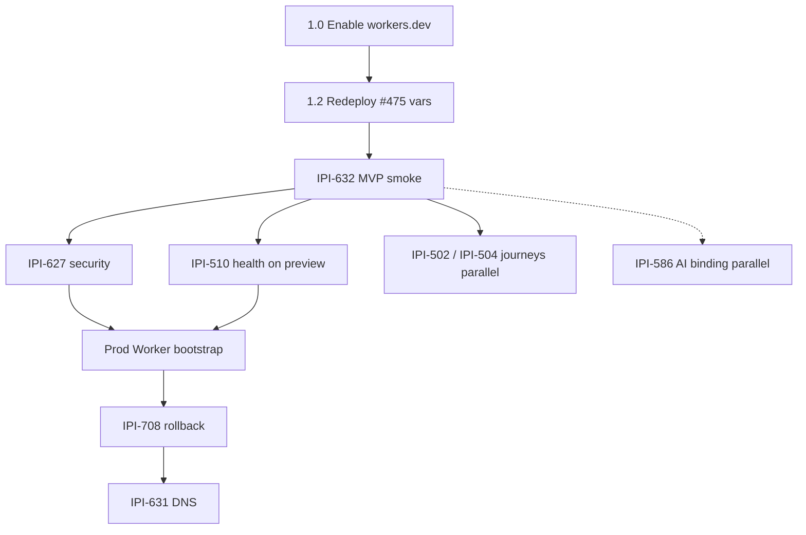

# J18 Cloudflare Implementation Plan (corrected J19)

**Original:** 2026-07-18 · **Corrected:** 2026-07-20 (after [j19-cloudflare-audit.md](j19-cloudflare-audit.md))  
**Purpose:** Ordered execution plan — hosting first, then security, then native AI / Hyperdrive  
**Evidence SSOT:** [`../audits/cloudflare-mastra-hosting-audit.md`](../audits/cloudflare-mastra-hosting-audit.md) · tracker [`j19-cloudflare-audit.md`](j19-cloudflare-audit.md)  
**Stale:** j18 audit % scores and “#475 open” — superseded by j19

---

## Current state snapshot (2026-07-20)

```text
Prod https://www.ipix.co/app → Vercel (NOT Cloudflare)
Preview Worker:     ipix-operator-preview  ✅ uploaded · ❌ workers.dev DISABLED → 1042
Production Worker:  ipix-operator          🔴 does not exist
Version ID:         a3fd7130-6d63-41df-ae3b-e2d29da34816  (pre-#475)
Commit (deployed):  84ea702  ·  main tip: acca2346 (#475 merged)
Remote smoke:       🔴 blocked (no public URL)
PR #475 (IPI-606):  ✅ MERGED · Linear Done · ❌ not redeployed to Worker
Custom ai-gateway:  ✅ live on ai-gateway.sk-498.workers.dev
```

**Plan verdict:** Phase order was right; **missing P0 step** was “enable `workers.dev`.” Without it, bootstrap “success” + empty `preview_url` is a false positive. Phase 2 was over-serialized (journeys don’t all need to be sequential cutover blockers).

---

## Official preference ladder

```text
1. Cloudflare Dashboard / API  → enable workers.dev, verify bindings, Hyperdrive, AI Gateway
2. Wrangler CLI                → versions upload/deploy, secrets, subdomain, rollback
3. OpenNext                    → build + upload passthrough
4. GitHub Actions              → orchestration only (fail if preview_url empty)
5. Official templates/examples
6. Custom scripts              → allowlist, redaction (keep minimal)
```

**SSOT:** Wrangler + GitHub Environments. Dashboard var edits are overwritten on deploy.

---

## Linear corrections needed (do these in Linear)

Do **not** reopen Done issues for code that already merged — file residual ACs as comments or tiny follow-ups.

| Issue | Linear now | Correction | Efficient action |
|-------|------------|------------|------------------|
| **IPI-606** | Done | Code ✅; ops incomplete (no redeploy, no `NEXT_PUBLIC_*` on Worker, orphan diff unverified) | **Comment** residual checklist; keep Done. Move ops into Phase 1.2 below (no new epic) |
| **IPI-472** | Done | Pipeline ✅; claims “preview live” overstated — workers.dev **off** | **Comment** gap; add child AC or **IPI-705** line: fail CI if `preview_url` empty / subdomain disabled |
| **IPI-632** | In Progress | Soft-blocked on 606 merge — **hard-blocked** on workers.dev + redeploy | **Update description**: blocker = subdomain disabled + 1042; URL = `https://ipix-operator-preview.sk-498.workers.dev` once enabled |
| **IPI-627** | Backlog | Correct — after 632 | Keep; blockedBy 632 |
| **IPI-586** | Todo | Plan said “blocked by 632” — **too strict** | Soft-block: needs **reachable** preview (or `wrangler dev`/`preview` local). Can start binding + smoke route **in parallel** once workers.dev is on — don’t wait for full 14-point smoke |
| **IPI-616…623** | Todo/Backlog | Hyperdrive config exists unbound | Keep **after** preview smoke; don’t start now |
| **IPI-594 / 609 / 592** | Backlog | Sequence correct | No change |
| **IPI-631** | Backlog | Correct — last | No change |
| **IPI-510 / 502 / 504** | Backlog | Were listed as **cutover blockers** in series | Demote: **parallel after 632**, only **IPI-510** is a hard pre-cutover health gate; 502/504 = journey confidence, can run in parallel / post-preview |
| **IPI-127 / IPI-718** | In Progress (other agent) | Vercel Mastra/ESM — **out of CF hosting critical path** | Related comment on 632 only: “prod Mastra ≠ CF preview Mastra” |

---

## Phase 1 — Make preview reachable + prove it (NOW)

**Goal:** Public `*.workers.dev` URL → auth + CopilotKit SSE + one agent turn.

| Order | Task | Status | Depends | Exit criteria | Efficient how |
|------:|------|--------|---------|---------------|---------------|
| **1.0** | **Enable workers.dev** on `ipix-operator-preview` | 🔴 P0 | — | API `subdomain.enabled=true`; `curl` ≠ 1042 | Dashboard → Worker → Settings → domains, **or** `wrangler`/`API` subdomain enable. ~5 min. **Do before any smoke.** |
| 1.1 | GitHub Environment `preview` vars | 🟡 | — | `NEXT_PUBLIC_SUPABASE_*`, `NEXT_PUBLIC_APP_URL`, `INTELLIGENCE_*` as **variables** (not secrets) | One Settings pass; skip if already set — verify via next bootstrap bindings |
| 1.2 | **IPI-606 residual** — redeploy + orphan diff | 🟡 ops | 1.0, 1.1 | Bootstrap on `acca2346+`; bindings include `NEXT_PUBLIC_*`; `wrangler secret list` diff vs allowlist | Single `cloudflare-secrets-sync.yml` run `dry_run=false`; no new PR |
| 1.3 | Bootstrap asserts usable URL | ⚪ | 1.0–1.2 | Job fails if `preview_url` empty | One-line CI check (fold into **IPI-472** follow-up / **IPI-705**) |
| 1.4 | **IPI-632** remote smoke | 🔴 | 1.2 | Evidence JSON under `tasks/cloudflare/tests/ipi-632-preview-smoke/` | Manual first (checklist below); automate later (**IPI-707**) |
| 1.5 | **IPI-705** provenance | ⚪ parallel | — | `version_id` + gzip + `startup_time_ms` in artifacts | Don’t block 1.4 |

### IPI-632 smoke (minimum viable — then expand)

**MVP (ship gate):** login → cookie `/api/copilotkit/info` 200 → SSE event → one agent turn → logout/401.

**Full list (same session if MVP green):** health, RLS spot-check, marketing stream, no secret leakage, `startup_time_ms` (warn ≥500ms / fail ≥750ms).

Skip HTML-200-only passes.

---

## Phase 2 — Production readiness (after 1.4 MVP)

**Cutover-critical (serial):**

| Order | Task | Blocks cutover? | Efficient note |
|------:|------|:---------------:|----------------|
| 2.1 | **IPI-627 · CF-SEC-020** | Yes | Route inventory + secret-name audit on live preview |
| 2.2 | **IPI-510 · CF-UJ-011** AI health on **preview** | Yes | Fix Vercel localhost:8787 is **IPI-127 lane**, not this |
| 2.3 | Production bootstrap (`wrangler_env=production`) | Yes | Creates missing `ipix-operator` |
| 2.4 | **IPI-708 · CF-ROLLBACK-001** | Yes | One rehearsal: previous version % |
| 2.5 | **IPI-709 · CF-OBS-001** | Soft | Dashboard Workers analytics + Sentry — don’t invent custom |
| 2.6 | **IPI-631 · CF-MIG-810** DNS | Final | Only after 2.1–2.4 |

**Parallel journeys (not a chain):**

| Task | When |
|------|------|
| **IPI-502** Brand Intelligence | After 1.4, parallel with 2.x |
| **IPI-504** Shoot Planning | After 1.4, parallel with 2.x |



---

## Phase 3 — Bundle / env (parallel, non-blocking)

| Order | Task | When | Efficient how |
|------:|------|------|---------------|
| 3.1 | **IPI-710 · CF-ENV-001** inventory | After 1.2 | Spreadsheet from allowlist — don’t rebuild tooling |
| 3.2 | **IPI-712 · CF-DEPLOY-030** CI ownership | With 1.3 | Workers Builds optional later |
| 3.3 | **IPI-706 · CF-BUNDLE-220** ≤7.5 MiB | After first remote `startup_time_ms` | Measure once on live preview before deep stub work |

---

## Phase 4 — Hyperdrive / Mastra persistence (after preview MVP)

Keep `MASTRA_STORAGE_MODE=noop` until 1.4 green.

| Order | Task | Efficient how |
|------:|------|---------------|
| 4.1 | **IPI-616** ADR | Decide Hyperdrive vs keep noop for preview — config `ipix-supabase-fresh` already exists |
| 4.2–4.6 | **IPI-619…623** | Bind → helper → RLS → canary — **one PR per step**, don’t bundle |

---

## Phase 5 — Native AI (parallel after workers.dev on)

| Order | Task | Efficient how |
|------:|------|---------------|
| 5.1 | **IPI-586** one `env.AI` smoke | Thin internal route only; don’t touch `provider.ts` prod path |
| 5.2 | **IPI-594** agent waves | Per-agent flags; wave PRs |
| 5.3 | **IPI-591** multi-turn verify | After wave 3 code |
| 5.4+ | Eval / failover / cost | Post-launch |

```text
workers.dev on → IPI-586 (parallel with IPI-632)
IPI-586 → IPI-594 waves → IPI-591 → IPI-609 soak → IPI-592 delete ai-gateway
```

---

## Phase 6 — Supabase Edge canary (separate track)

Unchanged: direct AI Gateway REST from Deno — not custom Worker proxy. **Not a hosting blocker.**

---

## Phase 7 — Soak + legacy cleanup

| Order | Task | Gate |
|------:|------|------|
| 7.1 | **IPI-609** soak | After IPI-594 wave 6 |
| 7.2 | **IPI-631** DNS complete | Prod Worker live |
| 7.3 | **IPI-592** delete `ai-gateway` | After IPI-609 |

---

## Work that must NOT start yet

| Task | Reason |
|------|--------|
| IPI-631 DNS | Preview unproven; no prod Worker |
| IPI-592 delete ai-gateway | Soak gate |
| IPI-594 agent migration | Needs IPI-586 |
| Production bootstrap | After IPI-632 MVP + IPI-627 |
| Hyperdrive bind | After IPI-616 ADR + preview MVP |

**May start immediately:** Phase **1.0** (enable workers.dev) — zero code.

---

## Immediate actions (this week) — corrected

```text
□ Enable workers.dev on ipix-operator-preview (Dashboard or API)     ← NEW P0
□ Confirm curl https://ipix-operator-preview.sk-498.workers.dev/login ≠ 1042
□ Verify GitHub Environment preview variables (NEXT_PUBLIC_* + INTELLIGENCE_*)
□ Re-bootstrap: cloudflare-secrets-sync.yml dry_run=false on main (post-#475)
□ wrangler secret list --env preview → allowlist orphan diff
□ IPI-632 MVP smoke → commit evidence JSON
□ Comment Linear: IPI-606 residual / IPI-472 workers.dev gap / IPI-632 blocker
□ (Parallel) IPI-586 AI binding once URL works
```

~~Merge PR #475~~ — **done** (`acca2346`).

---

## Efficiency rules (per task)

| Pattern | Prefer | Avoid |
|---------|--------|-------|
| Reachability | Dashboard toggle workers.dev | Re-debugging OpenNext for 1042 |
| Secrets | One bootstrap workflow run | Hand-editing Dashboard vars |
| Smoke | MVP 5 checks first | 14-item checklist before URL works |
| Journeys | Parallel after MVP | Serial 502→504→510→708 chain |
| Native AI | IPI-586 smoke route | Waiting for full IPI-632 Done |
| Bundle | Measure remote startup once | Premature Service Binding split |
| Vercel Mastra | Leave to IPI-718/127 | Mixing into CF preview PRs |

---

## Success probabilities (corrected)

| Milestone | J18 claimed | J19 evidence |
|-----------|------------:|-------------:|
| Protected preview | 62% → ~85% | **~28% today** → **~80%** after 1.0–1.4 |
| Production cutover | 22% → ~65% | **~12% today** → **~55%** after Phase 2 critical path |

Blocker is **workers.dev + redeploy + smoke**, not architecture.

---

## Related issues

| Issue | Role |
|-------|------|
| [IPI-606](https://linear.app/amo100/issue/IPI-606) | Code Done; ops residual in 1.2 |
| [IPI-472](https://linear.app/amo100/issue/IPI-472) | Pipeline Done; add URL assertion follow-up |
| [IPI-632](https://linear.app/amo100/issue/IPI-632) | **Next** after 1.0–1.2 |
| [IPI-627](https://linear.app/amo100/issue/IPI-627) | After 632 MVP |
| [IPI-586](https://linear.app/amo100/issue/IPI-586) | Parallel once preview reachable |
| [IPI-616](https://linear.app/amo100/issue/IPI-616) | Phase 4 ADR |
| [IPI-631](https://linear.app/amo100/issue/IPI-631) | Final DNS |
| [IPI-127](https://linear.app/amo100/issue/IPI-127) / [IPI-718](https://linear.app/amo100/issue/IPI-718) | Vercel-only — other agent |

---

## Audit inventory (what to trust)

| Doc | Trust |
|-----|-------|
| [`j19-cloudflare-audit.md`](j19-cloudflare-audit.md) + [`../audits/cloudflare-mastra-hosting-audit.md`](../audits/cloudflare-mastra-hosting-audit.md) | **Current** (2026-07-20) |
| [`j18-cloudflare-audit.md`](j18-cloudflare-audit.md) | Historical — % and #475 status **stale** |
| [`04-plan-hosting.md`](04-plan-hosting.md) | Architecture OK; sequence defer to this file |
| Older `docs/audits/*` / `todo.md` hosting % | Superseded where they disagree with j19 |
