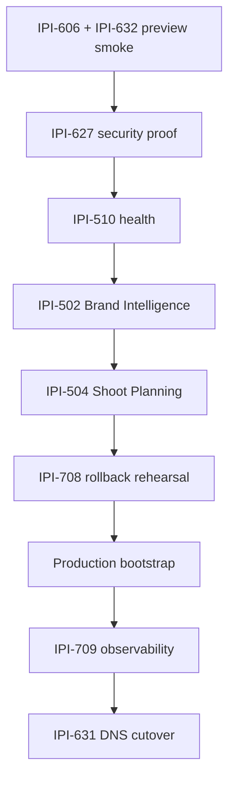

# J18 Cloudflare Implementation Plan

**Date:** 2026-07-18  
**Purpose:** Ordered execution plan reconciled with live Linear, repo, and bootstrap evidence  
**Audit:** [`j18-cloudflare-audit.md`](j18-cloudflare-audit.md) · [`docs/audits/cloudflare-hosting-implementation-audit.md`](../../docs/audits/cloudflare-hosting-implementation-audit.md)

---

## Current state snapshot

```text
Preview Worker:     ipix-operator-preview  ✅ deployed
Production Worker:  ipix-operator          🔴 not deployed
Version ID:         a3fd7130-6d63-41df-ae3b-e2d29da34816
Commit (deployed):  84ea702 (main bootstrap 2026-07-18)
Bundle gzip:        8454 KiB (~8.26 MiB) — passes 9.0 MiB gate, below 7.5 MiB target
Remote smoke:       🔴 not run (IPI-632)
PR #475 (IPI-606):  OPEN — CI green, mergeable
```

---

## Official preference ladder

Use before writing or keeping custom code:

```text
1. Cloudflare Dashboard     → verify Workers, bindings, Hyperdrive, observability
2. Wrangler CLI             → versions upload/deploy, secrets, rollback, dry-run, metafile
3. OpenNext                 → build, upload passthrough
4. GitHub Actions           → orchestration only
5. Official templates/examples
6. Custom scripts             → allowlist, redaction, validation (already minimal)
```

**SSOT rule:** Wrangler config + GitHub Environments own values. Dashboard edits to vars are overwritten on deploy.

---

## Phase 1 — Protected preview hosting (NOW)

**Goal:** Prove the remote preview Worker matches local dev for auth, CopilotKit, SSE, and one agent turn.

| Order | Task | Status | Depends on | Exit criteria |
|------:|------|--------|------------|---------------|
| 1.1 | **Operator:** GitHub Environment `preview` variables | 🔴 unverified | — | `INTELLIGENCE_API_URL`, `INTELLIGENCE_GATEWAY_WS_URL` set |
| 1.2 | **IPI-606 · CF-SEC-010** — Connect Infisical Secrets | 🟡 In Progress | — | PR #475 merged; orphan secret diff; three-path docs complete |
| 1.3 | Re-bootstrap preview | ⚪ | 1.1, 1.2 | `cloudflare-secrets-sync.yml` dry_run=false; new version_id recorded |
| 1.4 | **IPI-632 · CF-MIG-220** — Protected Preview Smoke | ⚪ Todo | 1.3 (soft: 1.2) | Remote SSE + agent turn + logout; evidence JSON committed |
| 1.5 | **IPI-705 · CF-PERF-001** — Deploy provenance | ⚪ Backlog | — (parallel) | `WRANGLER_OUTPUT_FILE_PATH`; gzip + startup_time_ms artifacts |

### IPI-632 smoke checklist (required — not HTML-200-only)

1. Worker version matches expected commit
2. Public health endpoint responds
3. Login succeeds (Supabase OAuth on `*.workers.dev`)
4. Auth cookies refresh
5. Protected route rejects unauthenticated access
6. Protected route accepts authenticated access
7. `GET /api/copilotkit/info` → 200 + expected agents
8. CopilotKit SSE stream opens
9. Marketing chat stream opens
10. One real agent turn completes
11. Supabase RLS behavior correct
12. Logout succeeds
13. Errors contain no exposed credentials
14. Remote `startup_time_ms` recorded (warn ≥500ms, fail ≥750ms)

**Automate next:** IPI-707 · CF-SMOKE-001 (Playwright in CI)

---

## Phase 2 — Production readiness (after Phase 1)

| Order | Task | Status | Blocks cutover? |
|------:|------|--------|:---------------:|
| 2.1 | **IPI-627 · CF-SEC-020** — Deployment Security Proof | Backlog | Yes |
| 2.2 | **IPI-510 · CF-UJ-011** — AI Health / Readiness | Backlog | Yes |
| 2.3 | **IPI-502 · CF-UJ-002** — Brand Intelligence journey | Backlog | Yes |
| 2.4 | **IPI-504 · CF-UJ-004** — Shoot Planning journey | Backlog | Yes |
| 2.5 | **IPI-708 · CF-ROLLBACK-001** — Rollback rehearsal | Backlog | Yes |
| 2.6 | Production bootstrap (`wrangler_env=production`) | ⚪ | Yes |
| 2.7 | **IPI-709 · CF-OBS-001** — Observability baseline | Backlog | Yes |
| 2.8 | **IPI-631 · CF-MIG-810** — DNS cutover + rollback | Backlog | Final gate |



---

## Phase 3 — Environment and bundle (parallel after 1.4)

| Order | Task | Linear | Priority |
|------:|------|--------|----------|
| 3.1 | Authoritative env inventory | **IPI-710 · CF-ENV-001** | High — after IPI-606 |
| 3.2 | Config ownership in CI | **IPI-712 · CF-DEPLOY-030** | High — with #475 |
| 3.3 | Bundle reduction ≤7.5 MiB | **IPI-706 · CF-BUNDLE-220** | Urgent — headroom tight |

**Bundle investigation order (IPI-706):**

1. Sentry server instrumentation
2. Mermaid, Cytoscape, KaTeX SSR
3. `@copilotkit/web-inspector`
4. Broad Mastra imports
5. Duplicate route chunks
6. Telemetry dependencies
7. Service Binding split — **only after** local reductions measured

```bash
# Official measurement (both envs)
cd app && npm run build:cf
npx wrangler deploy --dry-run --env preview --metafile bundle-preview.json
npx wrangler deploy --dry-run --env production --metafile bundle-production.json
```

---

## Phase 4 — Hyperdrive and Mastra persistence (post-preview)

**Do not block first preview.** Current mode: `MASTRA_STORAGE_MODE=noop`.

| Order | Task | Notes |
|------:|------|-------|
| 4.1 | **IPI-616 · CF-DB-001** — Storage ADR | Blocks IPI-619, IPI-628 |
| 4.2 | **IPI-619 · CF-DB-005** — Hyperdrive binding | Config `ipix-supabase-fresh` already exists |
| 4.3 | **IPI-620 · CF-DB-006** — Query helper | |
| 4.4 | **IPI-621 · CF-DB-007** — RLS tests | |
| 4.5 | **IPI-624 · CF-DB-010** — Monitoring | |
| 4.6 | **IPI-623 · CF-DB-009** — One workload canary | |

---

## Phase 5 — Cloudflare-native AI routing (post-preview)

| Order | Task | Sequence |
|------:|------|----------|
| 5.1 | **IPI-586 · CF-AI-003** — One Workers AI smoke | After IPI-632 |
| 5.2 | **IPI-594 · CF-MIG-230** — Migrate Mastra agents (waves 0–7) | After IPI-586 |
| 5.3 | **IPI-591 · CF-TEST-010** — Multi-turn tool calling verify | After IPI-594 wave 3 |
| 5.4 | **IPI-462 · CF-AI-006** — Provider eval suite | Post-launch |
| 5.5 | **IPI-463 · CF-AI-008** — Failover (partial: ai-gateway live) | Reconcile AC |
| 5.6 | **IPI-460 · CF-AI-010** — Cost tracking | Post-launch |

```text
IPI-586 → IPI-594 waves 0-2 → wave 3 impl → IPI-591 verify → waves 4-7 → IPI-609 soak → IPI-592 delete ai-gateway
```

---

## Phase 6 — Supabase Edge canary (parallel track, not hosting blocker)

Corrected 2026-07-18: direct AI Gateway REST from Deno — **not** custom `services/cloudflare-worker/` proxy.

| Order | Task | PR shape |
|------:|------|----------|
| 6.1 | **IPI-695 · CF-EDGE-001** — ADR addendum | Docs |
| 6.2 | **IPI-697 · CF-EDGE-003** — REST client + BI wire | Code (unit verified) |
| 6.3 | **IPI-699 · CF-EDGE-005** — Secrets + canary + rollback | Ops-only |
| 6.4 | **IPI-698 · CF-EDGE-004** — DNA vision eval | After BI canary |
| 6.5 | **IPI-455 · CF-EDGE-B** — Full BI Worker port | Parked; cancel-gate after 6.3 |

**Superseded:** IPI-456 · CF-DNA → duplicate of IPI-698

Parent epic: **IPI-694 · CF-EDGE-AI**

---

## Phase 7 — Soak and legacy cleanup (production-gated)

| Order | Task | Gate |
|------:|------|------|
| 7.1 | **IPI-609 · CF-MIG-230-SOAK** — Zero-legacy-traffic audit | After IPI-594 wave 6; min 7-day observation |
| 7.2 | **IPI-631 · CF-MIG-810** — DNS cutover complete | Production live |
| 7.3 | **IPI-592 · CF-MIG-820** — Delete ai-gateway Worker | After IPI-609 Done |

**Never delete ai-gateway until:** replacement traffic verified, zero-legacy evidence, rollback independent of legacy Worker.

---

## Work that must NOT start yet

| Task | Reason |
|------|--------|
| IPI-631 DNS cutover | Preview unproven; journeys missing |
| IPI-592 delete ai-gateway | IPI-609 soak gate |
| IPI-594 agent migration | Blocked by IPI-586 |
| IPI-586 Workers AI smoke | Blocked by IPI-632 (protected preview first) |
| Production bootstrap | After IPI-632 + IPI-627 minimum |

---

## Immediate actions (this week)

```text
□ Merge PR #475 (IPI-606) — CI already green
□ Set GitHub Environment preview variables
□ wrangler secret list --env preview → diff vs allowlist → delete orphans
□ Re-bootstrap preview with dry_run=false
□ Execute IPI-632 manual smoke → save evidence to tasks/cloudflare/tests/ipi-632-preview-smoke/
□ File IPI-606 Done only after smoke passes with correct vars
```

---

## Success probabilities

| Milestone | Probability | After corrections |
|-----------|------------:|------------------:|
| Protected preview | 62% today | **~85%** after Phase 1 |
| Production cutover | 22% today | **~65%** after Phase 2 complete |

Architecture is not the blocker — **operational validation and env ownership** are.

---

## Related Linear issues (user-provided links)

| Issue | Role in plan |
|-------|--------------|
| [IPI-606](https://linear.app/amo100/issue/IPI-606) | Phase 1.2 — secrets (active) |
| [IPI-632](https://linear.app/amo100/issue/IPI-632) | Phase 1.4 — smoke (next after 606) |
| [IPI-616](https://linear.app/amo100/issue/IPI-616) | Phase 4.1 — ADR |
| [IPI-586](https://linear.app/amo100/issue/IPI-586) | Phase 5.1 — Workers AI smoke |
| [IPI-694](https://linear.app/amo100/issue/IPI-694) | Phase 6 parent — Edge AI |
| [IPI-697](https://linear.app/amo100/issue/IPI-697) | Phase 6.2 — BI client |
| [IPI-699](https://linear.app/amo100/issue/IPI-699) | Phase 6.3 — Edge canary |
| [IPI-595](https://linear.app/amo100/issue/IPI-595) | Gateway auth (related, not preview blocker) |
| [IPI-648](https://linear.app/amo100/issue/IPI-648) | Shiki bundle (related to IPI-706) |
| [IPI-515](https://linear.app/amo100/issue/IPI-515) | Unrelated epic (PR agent) — out of hosting scope |
| [IPI-659](https://linear.app/amo100/issue/IPI-659) | Unrelated (PR agent config) — out of hosting scope |
