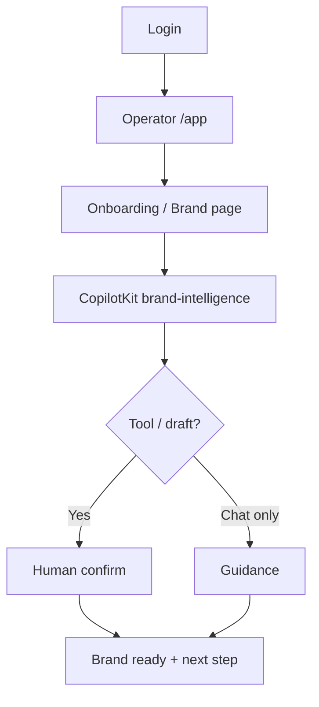
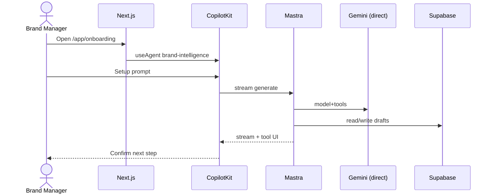
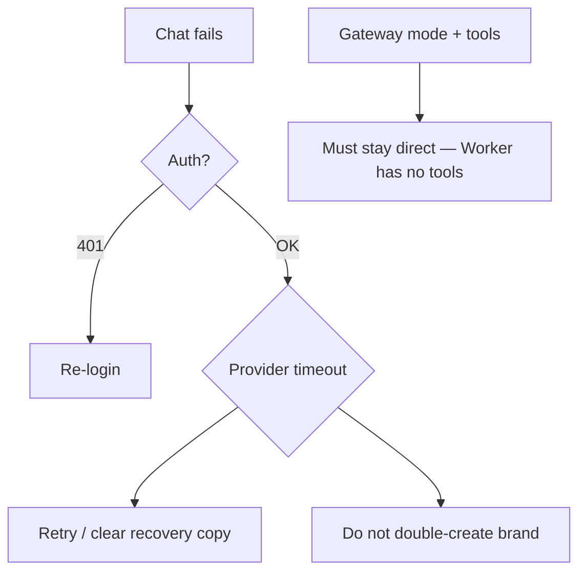

# 01 — AI onboarding

## When to test

**Linear:** [IPI-501 · CF-UJ-001 — Journey test](https://linear.app/amo100/issue/IPI-501) · Parent [IPI-500 · CF-UJ-000](https://linear.app/amo100/issue/IPI-500)

After onboarding + brand-intelligence CopilotKit MVP is developed (direct Gemini). Do not wait for gateway tools.

**Rule:** Execute this plan when the feature/use case above is developed enough to demo — not before. Do not mark Production Verified without remote Worker (IPI-472).


## 1. Purpose

A new brand operator signs up, creates or joins a brand workspace, and uses the AI assistant to complete first-run setup (profile, crawl kickoff, next-step guidance) without guessing what to do next.

## 2. Real-world persona

**Brand Manager** (primary) · **Operator** (secondary)

## 3. User journey

1. Open marketing site → **Login** (`/(marketing)/login`).
2. Supabase Auth PKCE → land in operator hub (`/app/*`).
3. Navigate to **onboarding** or **brand** surface (`/app/onboarding`, `/app/brand`).
4. CopilotKit sidebar resolves agent via `route-agent-map` → **`brand-intelligence`**.
5. User asks “help me set up my brand” / clicks guided CTA.
6. Agent may call tools (read brand, start crawl, draft fields) — **draft-first**, human confirms.
7. Outcome: brand row populated, crawl started or brief draft saved, clear next step shown.

## 4. Tech stack mapping

| Layer | Technology |
|-------|------------|
| User interface | Next.js App Router · CopilotKit v2 |
| Agent reasoning | Mastra `brand-intelligence` |
| AI routing | **Default: direct Gemini** · Gateway only if `AI_ROUTING_MODE=gateway` **and** tier allowlisted (tools → keep direct) |
| AI providers | Gemini (structured/default) |
| Data | Supabase PostgreSQL (`brands`, profiles, membership) |
| Auth | Supabase Auth |
| Files/images | Cloudinary (logo/assets if uploaded) |
| Crawl | Firecrawl + edge `start-brand-crawl` / `brand-intelligence` |
| Observability | App logs · Worker logs only if gateway path used |
| Tests | Vitest · Playwright (planned) |

**Flags:** tools · streaming · structured output · **not** vision · **not** embeddings (unless later RAG)

## 5. Mermaid diagrams

### User journey



### System architecture

```mermaid
flowchart LR
  UI[Next.js + CopilotKit] --> CK[/api/copilotkit]
  CK --> M[Mastra brand-intelligence]
  M -->|default| G[Gemini direct]
  M -.->|gateway+allowlist| W[CF AI Gateway Worker]
  M --> SB[(Supabase)]
  M --> EF[Edge brand-intelligence / crawl]
```

### Sequence



### Failure / fallback



## 6. Preconditions

- `NEXT_PUBLIC_SUPABASE_URL`, `NEXT_PUBLIC_SUPABASE_ANON_KEY`, server Supabase keys
- `GEMINI_API_KEY` (direct path)
- Optional gateway: `AI_ROUTING_MODE`, `AI_GATEWAY_BASE_URL`, `AI_GATEWAY_API_KEY` — **do not enable tool tiers**
- Authenticated user with brand membership (or create-brand permission)
- Seed brand fixture for QA (`qa@ipix.test`)
- CopilotKit runtime up (`/api/copilotkit`)
- Feature: operator chat enabled on onboarding routes

## 7. Test scenarios

| Scenario | Expect |
|----------|--------|
| Happy path | Guidance + optional draft fields; no silent fail |
| Validation | Missing brand name / URL rejected before crawl |
| Permissions/RLS | User A cannot mutate User B brand |
| Gateway unavailable | If forced gateway: clear error; default direct unaffected |
| Provider timeout | Recovery message; no orphan crawl jobs |
| Malformed AI | Schema reject; user-visible error |
| Empty state | First-run empty brand → guided prompts |
| Duplicate submit | Idempotent brand create / single crawl |
| Cancel | Abort stream; no partial commit without confirm |
| Mobile | Sidebar usable; no dead-end |
| A11y | Chat controls keyboard reachable |
| Recovery | Retry after 5xx |

## 8. Real-runtime verification

| Level | Status |
|-------|--------|
| Unit Verified | 🟡 agent/tool unit tests exist partially |
| Build Verified | 🟡 app CI |
| Local Runtime Verified | 🟡 chat works on **direct**; gateway+tools **not** proven |
| Remote Preview Verified | ⚪ |
| Production Verified | ⚪ |

## 9. Success criteria

- Correct agent id `brand-intelligence` on onboarding/brand routes  
- Stream reaches CopilotKit UI  
- No secrets in client payloads  
- Supabase writes only after confirm / allowed tool path  
- RLS blocks cross-tenant  
- Latency: first token &lt; 5s typical on direct (measure; don’t invent SLA)  
- If gateway: request id in logs when Worker used  

## 10. Checklist

- [ ] Env + QA user  
- [ ] Seed brand / empty brand fixture  
- [ ] Unit: route-agent-map onboarding → BI  
- [ ] Integration: CopilotKit smoke  
- [ ] Browser: first-run script  
- [ ] Cloudflare proof: N/A unless gateway  
- [ ] Supabase: membership + RLS probe  
- [ ] Observability: correlation id if gateway  
- [ ] Cleanup: delete test brand  
- [ ] Sign-off  

## 11. Failure points and blockers

- Tool calling unsupported on Worker → **cannot** cut over BI tools via gateway  
- Registry drift agent id vs `useAgent`  
- Incomplete seed / Firecrawl secrets  
- Missing `data-testid` on onboarding CTAs  
- Direct-provider bypass is **current design**, not a bug  
- **IPI-455** Migrate Brand Intelligence to Cloudflare — Backlog  

## 12. Automation opportunities

| Test | Target |
|------|--------|
| Route → agent map | Vitest |
| First-run chat | Playwright |
| RLS brand isolation | Supabase SQL / CI web015 |
| Health before onboarding | Wrangler + `/api/ai/health` smoke |
| Nightly | Scheduled smoke login + one chat turn |

**Blocking Linear:** **IPI-454 · CF-AI-001 — AI Gateway — Cloudflare Provider Routing** (AC-J) · **IPI-485 · MASTRA-CF-001 — Mastra Provider Gateway Cutover**
