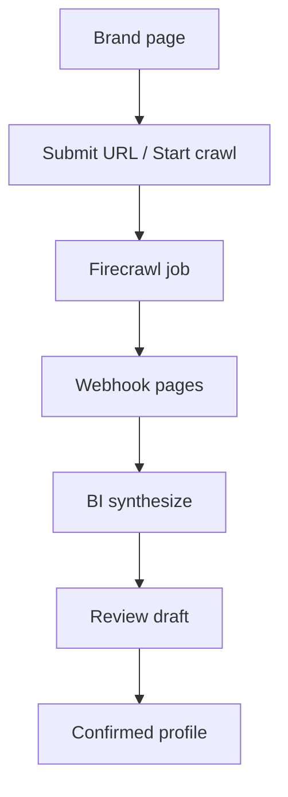
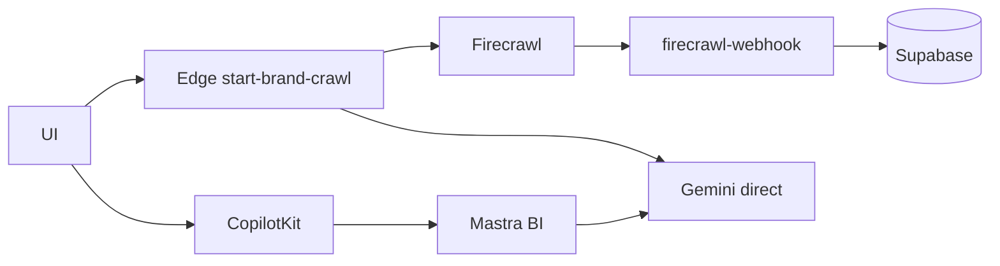
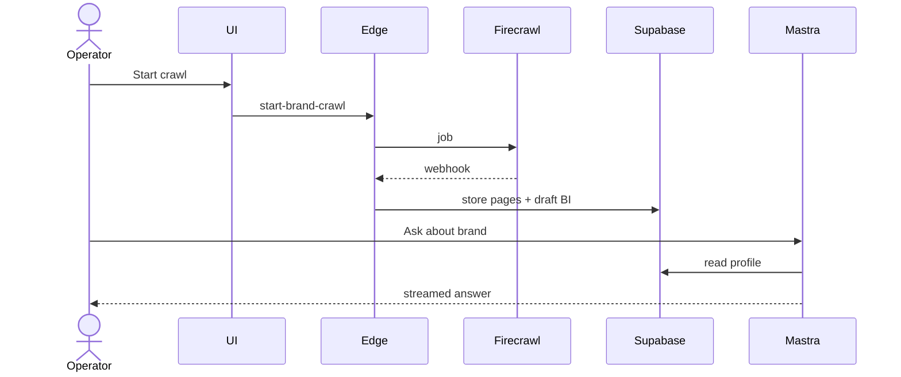
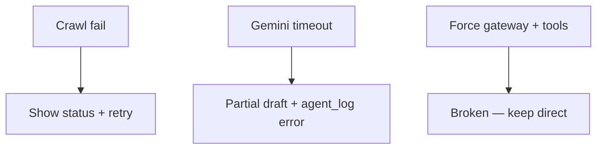

# 02 — AI Brand Intelligence

## When to test

**Linear:** [IPI-502 · CF-UJ-002 — Journey test](https://linear.app/amo100/issue/IPI-502) · Parent [IPI-500 · CF-UJ-000](https://linear.app/amo100/issue/IPI-500)

When crawl + BI panel are demoable; re-run after IPI-455 CF migrate.

**Rule:** Execute this plan when the feature/use case above is developed enough to demo — not before. Do not mark Production Verified without remote Worker (IPI-472).

## 1. Purpose

Operator runs brand discovery (crawl + AI synthesis) so the workspace has a living brand profile (voice, audience, competitors, DNA signals) usable by downstream agents.

## 2. Real-world persona

**Operator** · **Brand Manager**

## 3. User journey

1. Authenticated → `/app/brand` or Brand Hub.
2. Enter brand URL / trigger **Start crawl** (UI or CopilotKit).
3. Edge `start-brand-crawl` / Firecrawl webhook → pages stored.
4. Edge `brand-intelligence` and/or Mastra **`brand-intelligence`** agent synthesize profile.
5. Operator reviews draft intelligence panel; confirms / edits.
6. Downstream: brief, DNA, planner consume stored profile.

## 4. Tech stack mapping

| Layer | Technology |
|-------|------------|
| UI | Next.js · CopilotKit (`brand-intelligence`) |
| Agent | Mastra BI agent + tools |
| Edge | Supabase Edge `brand-intelligence`, `start-brand-crawl`, `firecrawl-webhook` |
| AI path | **Gemini direct** (edge + Mastra); Cloudflare migrate = **IPI-455** Backlog |
| Gateway | Not required for crawl; chat may use gateway only for non-tool `fast` |
| Data | Supabase brand intelligence tables |
| Auth | Supabase Auth + edge `resolveAuth` |
| Files | Cloudinary / crawled assets |
| Observability | Edge logs · `insertAgentLog` |
| Tests | `npm run supabase:verify-brand-intelligence` · Vitest |

**Flags:** tools · structured output · streaming (chat) · long-running crawl · **not** Worker vision

## 5. Mermaid diagrams

### User journey

### System architecture

### Sequence

### Failure / fallback

## 6. Preconditions

- Firecrawl API secret in Supabase Edge  
- `GEMINI_API_KEY` edge + app  
- Brand row + membership  
- Webhook URL configured for Firecrawl  
- Optional: `AI_ROUTING_MODE=direct` for tool chat  
- Fixture brand URL allowlisted for QA  

## 7. Test scenarios

| Scenario | Expect |
|----------|--------|
| Happy path | Crawl → pages → BI draft → UI panel |
| Validation | Invalid URL rejected |
| RLS | Cross-brand read blocked |
| Gateway down | Crawl/edge unaffected; chat if gateway-only fails |
| Provider timeout | Edge safe error; no corrupt JSON overwrite |
| Malformed AI | Schema validation reject |
| Empty | No crawl yet → empty state CTA |
| Duplicate crawl | Debounce / single active job |
| Cancel | Cancel job if supported; else document gap |
| Mobile / a11y | Panel readable |
| Recovery | Re-run BI on existing pages |

## 8. Real-runtime verification

| Level | Status |
|-------|--------|
| Unit | 🟡 |
| Build | 🟡 |
| Local Runtime | 🟡 (`supabase:verify-brand-intelligence` when secrets present) |
| Remote Preview | ⚪ CF path |
| Production | ⚪ CF migrate not done |

## 9. Success criteria

- Crawl job id persisted  
- BI draft schema-valid  
- Agent log row on failure  
- Chat agent id matches registry  
- No client AI keys  
- Cloudflare Worker **not** required for crawl success today  

## 10. Checklist

- [ ] Edge secrets  
- [ ] QA brand URL  
- [ ] Unit schema parsers  
- [ ] Integration verify-brand-intelligence  
- [ ] Browser: start crawl + panel  
- [ ] CF runtime: N/A until IPI-455  
- [ ] RLS probe  
- [ ] Logs / agent_log  
- [ ] Cleanup crawl artifacts  
- [ ] Sign-off  

## 11. Failure points and blockers

- **IPI-455** Migrate Brand Intelligence to Cloudflare — Backlog  
- Worker tools / long jobs not designed for BI yet  
- Incomplete seed pages  
- Webhook env mismatch  
- Dual Gemini paths (edge vs Mastra)  

## 12. Automation opportunities

- Vitest: BI schema  
- Playwright: crawl trigger + panel  
- Supabase SQL: draft row asserts  
- Scheduled: health + one BI smoke brand  
- CI: `supabase:verify-brand-intelligence` with Infisical  

**Blocking:** **IPI-455** · **IPI-454 · CF-AI-001** AC-J for chat path
