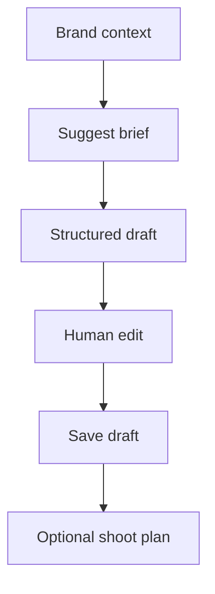
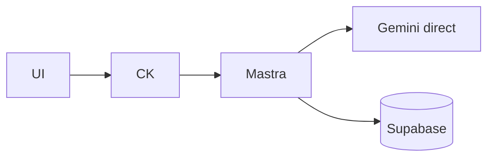
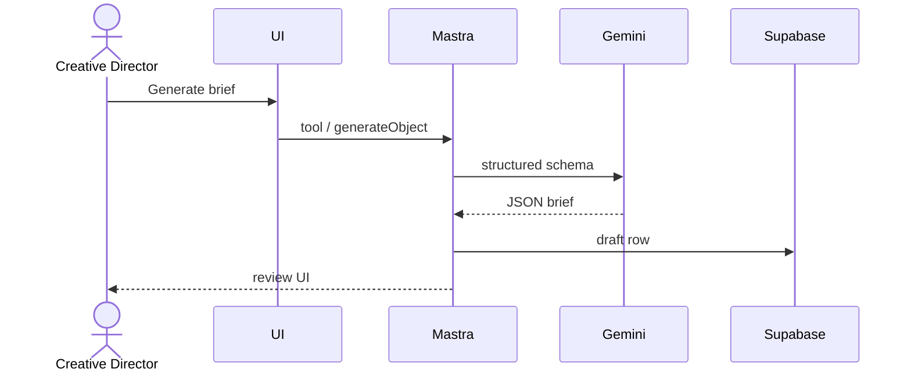
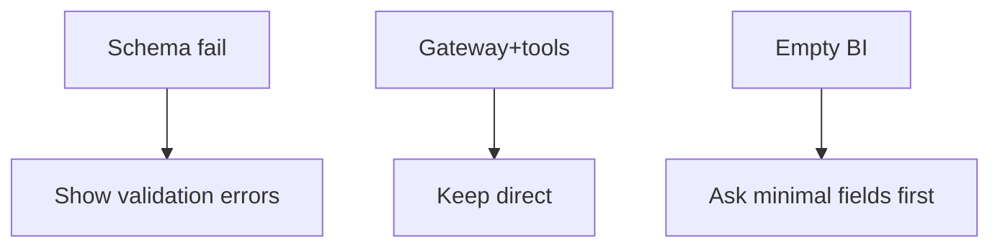

# 03 — AI brand brief generation

## When to test

**Linear:** [IPI-503 · CF-UJ-003 — Journey test](https://linear.app/amo100/issue/IPI-503) · Parent [IPI-500 · CF-UJ-000](https://linear.app/amo100/issue/IPI-500)

When brief generate UI / CD structured draft ships; keep direct until Worker tools exist.

**Rule:** Execute this plan when the feature/use case above is developed enough to demo — not before. Do not mark Production Verified without remote Worker (IPI-472).

## 1. Purpose

Creative lead turns brand context into a shoot/campaign **brief** (objectives, audience, deliverables, tone) as a reversible AI draft for human approval.

## 2. Real-world persona

**Creative Director** · **Brand Manager**

## 3. User journey

1. Open brand or campaign context with BI profile present (or minimal inputs).
2. Trigger **Suggest shoot brief** / CopilotKit on brand/campaign routes (`creative-director` or BI tools).
3. Agent/tool returns structured brief draft.
4. User edits in UI → saves draft → optional promote to shoot plan.

## 4. Tech stack mapping

| Layer | Technology |
|-------|------------|
| UI | Next.js · CopilotKit |
| Agent | Mastra `creative-director` / BI tools (`suggestShootBrief` class) |
| AI | Gemini **direct** · structured output |
| Gateway | Blocked for tool tiers unless experimental allowlist (**do not enable**) |
| Data | Supabase briefs / campaigns |
| Auth | Supabase |
| Tests | Vitest schema · Playwright draft flow |

**Flags:** structured output · tools · streaming · **not** vision (unless moodboard later)

## 5. Mermaid diagrams

## 6. Preconditions

- Brand intelligence or manual brand fields  
- `GEMINI_API_KEY`  
- Auth + brand membership  
- Brief schema version known  
- `AI_ROUTING_MODE=direct` recommended  

## 7. Test scenarios

Happy path · missing brand context · RLS · gateway forced fail · timeout · malformed JSON · empty BI · duplicate brief versions · cancel mid-stream · mobile · a11y · recovery re-generate without clobbering confirmed brief  

## 8. Real-runtime verification

| Level | Status |
|-------|--------|
| Unit | 🟡 |
| Build | 🟡 |
| Local Runtime | 🟡 direct only |
| Remote / Prod CF | ⚪ |

## 9. Success criteria

- JSON passes brief schema  
- Draft flag set (not auto-published)  
- Correlation in logs if any gateway hop  
- No duplicate confirmed briefs on double-click  

## 10. Checklist

- [ ] Schema fixture  
- [ ] Seed brand with BI  
- [ ] Unit schema  
- [ ] Integration tool.execute  
- [ ] Browser generate→edit→save  
- [ ] CF N/A  
- [ ] RLS  
- [ ] Observability  
- [ ] Cleanup drafts  
- [ ] Sign-off  

## 11. Failure points and blockers

- Tool tiers on gateway experimental / unsafe  
- **IPI-485 · MASTRA-CF-001 — Mastra Provider Gateway Cutover**  
- Missing test ids on brief form  

## 12. Automation opportunities

Vitest schema · Playwright brief CTA · CI gate on schema package · scheduled smoke generate-only (no save)
