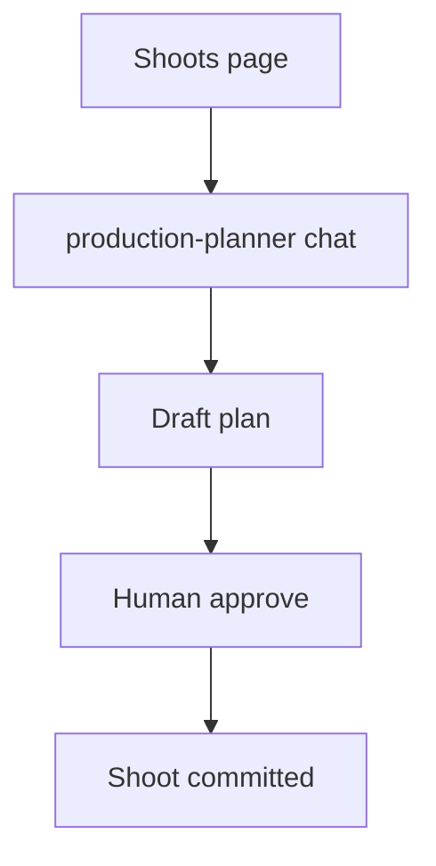
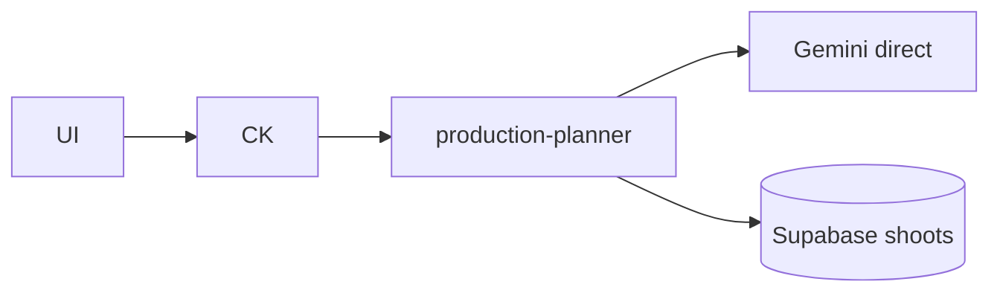
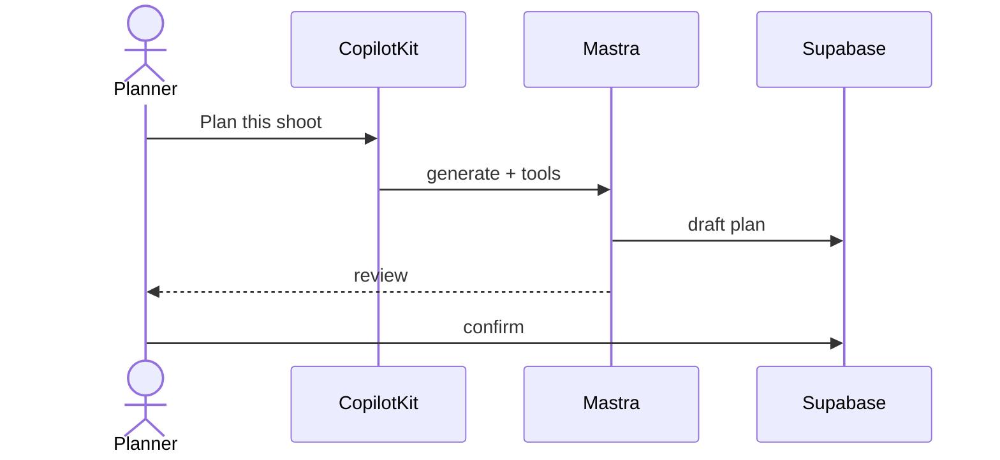
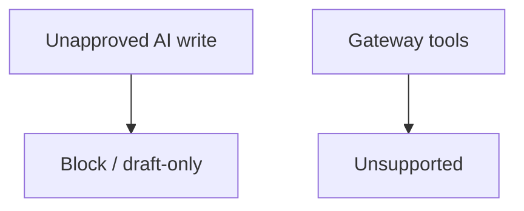

# 04 — Shoot planning workflow

## When to test

**Linear:** [IPI-504 · CF-UJ-004 — Journey test](https://linear.app/amo100/issue/IPI-504) · Parent [IPI-500 · CF-UJ-000](https://linear.app/amo100/issue/IPI-500)

When production-planner shoot draft→approve path ships.

**Rule:** Execute this plan when the feature/use case above is developed enough to demo — not before. Do not mark Production Verified without remote Worker (IPI-472).

## 1. Purpose

Production planner turns a brief into a shoot plan (timeline, roles, locations, deliverables) with AI assistance, then commits only after human approval.

## 2. Real-world persona

**Production Planner**

## 3. User journey

1. `/app/shoots` (or shoot detail) → CopilotKit agent **`production-planner`**.
2. Provide brief / campaign context.
3. Agent proposes plan structure (tools may read/write drafts).
4. Planner edits → approve → shoot record updated.
5. Optional handoff to booking / CRM.

## 4. Tech stack mapping

| Layer | Technology |
|-------|------------|
| UI | Next.js · CopilotKit |
| Agent | Mastra `production-planner` |
| AI | Gemini **direct** + tools |
| Gateway | **Not** for tool path |
| Data | Supabase shoots / plans |
| Auth | Supabase |
| Related | **IPI-282 · SHOOT-AI-004B** DNA via Worker — Backlog, separate |

**Flags:** tools · structured · streaming · HITL  

## 5. Mermaid diagrams

## 6. Preconditions

- Shoot + brand fixtures  
- `GEMINI_API_KEY`  
- Operator auth  
- Agent id sync: registry = `production-planner` = `useAgent`  

## 7. Test scenarios

Happy path · invalid dates · RLS · gateway+tools fail · timeout · malformed plan JSON · empty shoot · duplicate plan version · cancel · mobile · a11y · recovery  

## 8. Real-runtime verification

🟡 Local direct · ⚪ CF gateway · ⚪ Production  

## 9. Success criteria

- Draft-only until confirm  
- No cross-brand shoot mutation  
- Stream UI works  
- Agent id match  

## 10. Checklist

- [ ] Seed shoot  
- [ ] Unit planner schema  
- [ ] Integration tools  
- [ ] Browser plan flow  
- [ ] CF N/A  
- [ ] RLS  
- [ ] Logs  
- [ ] Cleanup  
- [ ] Sign-off  

## 11. Failure points and blockers

Worker tools missing · **IPI-282** DNA pipeline separate · HITL gaps  

## 12. Automation opportunities

Vitest schemas · Playwright approve gate · SQL no-unapproved-writes assert
