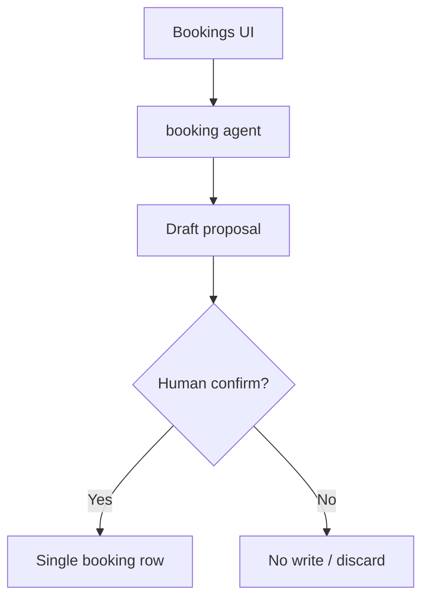
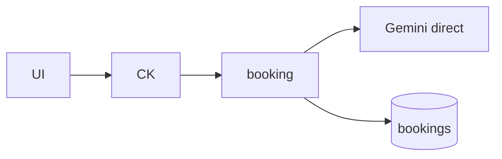
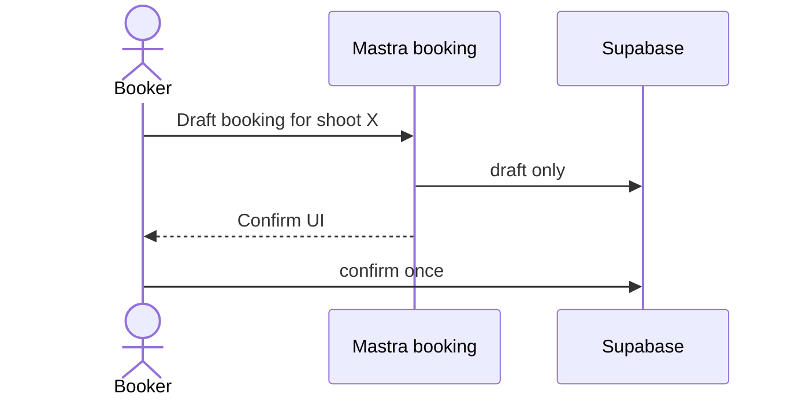
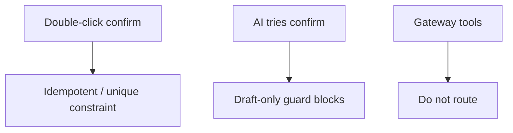

# 05 — Booking workflow

## When to test

**Linear:** [IPI-505 · CF-UJ-005 — Journey test](https://linear.app/amo100/issue/IPI-505) · Parent [IPI-500 · CF-UJ-000](https://linear.app/amo100/issue/IPI-500)

When booking draft-only + human confirm UI ships (highest-risk).

**Rule:** Execute this plan when the feature/use case above is developed enough to demo — not before. Do not mark Production Verified without remote Worker (IPI-472).

## 1. Purpose

Booker uses AI to draft talent/crew bookings against a shoot without creating confirmed bookings until a human gate passes (draft-only guard).

## 2. Real-world persona

**Booker** · **Talent Manager**

## 3. User journey

1. `/app/bookings` or model/roster routes → agent **`booking`** (also `model-match` where mapped).
2. Ask for availability / shortlist / draft booking.
3. Agent tools propose drafts; UI shows confirm.
4. On confirm: booking row created once; notifications optional.
5. Cancel/reject leaves no confirmed booking.

## 4. Tech stack mapping

| Layer | Technology |
|-------|------------|
| UI | Next.js · CopilotKit |
| Agent | Mastra `booking` · `model-match` |
| AI | Gemini **direct** + tools |
| Gateway | **Unsupported** for tools — keep direct |
| Data | Supabase bookings / roster |
| Auth | Supabase + operator auth on APIs |
| Tests | Vitest draft-only guards |

**Flags:** tools · HITL · streaming · **critical: no auto-confirm**

## 5. Mermaid diagrams

## 6. Preconditions

- Shoot + talent fixtures  
- Draft-only policy enforced in tools/routes  
- `GEMINI_API_KEY`  
- Auth roles: booker/operator  

## 7. Test scenarios

Happy draft→confirm · validation missing shoot · RLS · gateway tools · timeout mid-draft · malformed · empty roster · **duplicate booking** · cancel · mobile · a11y · recovery  

## 8. Real-runtime verification

🟡 Local direct · ⚪ Gateway · ⚪ Production CF  

## 9. Success criteria

- Zero confirmed bookings without explicit confirm  
- No duplicate booking for same shoot+talent  
- RLS blocks other brands  
- Clear recovery copy on AI failure  

## 10. Checklist

- [ ] Seed shoot/talent  
- [ ] Unit draft-only  
- [ ] Integration booking tool  
- [ ] Browser confirm once  
- [ ] CF N/A  
- [ ] SQL uniqueness  
- [ ] Logs  
- [ ] Cleanup bookings  
- [ ] Sign-off  

## 11. Failure points and blockers

Draft-only regressions · Worker tools · missing test ids · **IPI-471 · AGENT-001** architecture  

## 12. Automation opportunities

Vitest guard · Playwright double-submit · SQL assert count=1 · CI gate on booking tests
