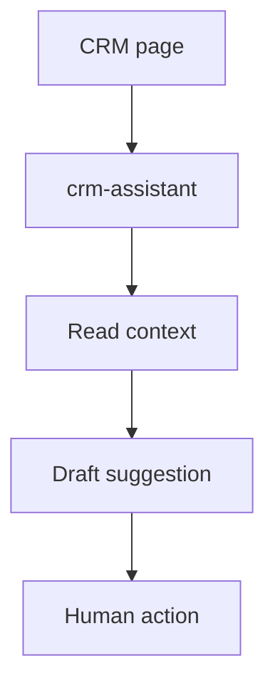
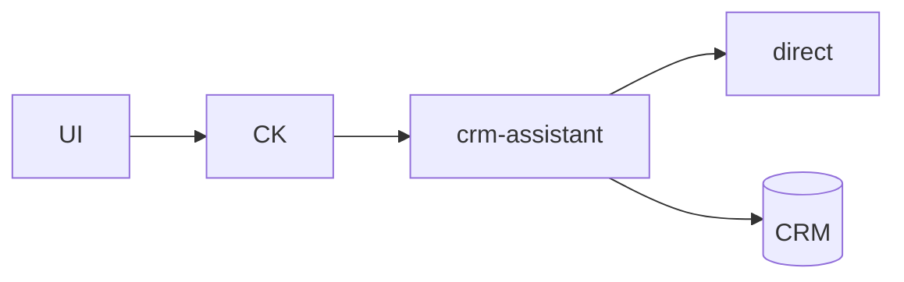
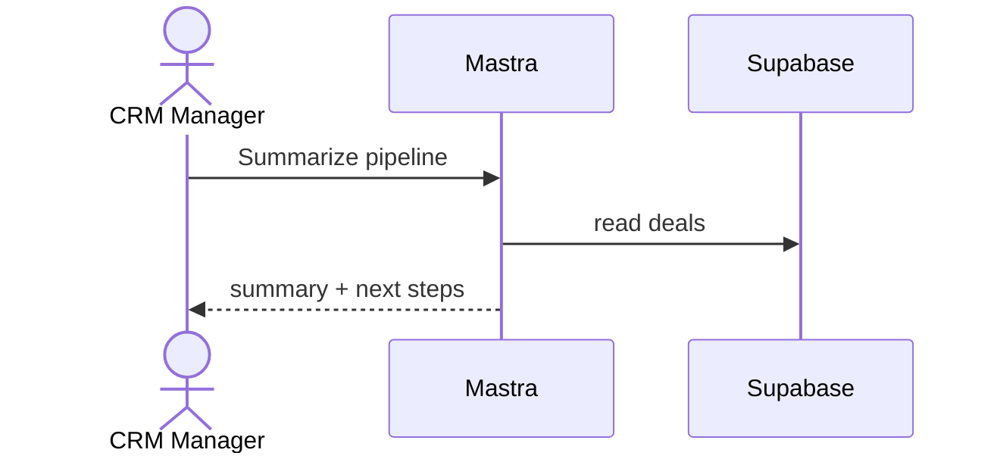
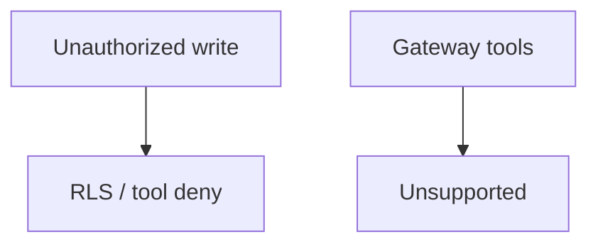

# 06 — CRM workflow

## When to test

**Linear:** [IPI-506 · CF-UJ-006 — Journey test](https://linear.app/amo100/issue/IPI-506) · Parent [IPI-500 · CF-UJ-000](https://linear.app/amo100/issue/IPI-500)

When crm-assistant is wired on CRM routes.

**Rule:** Execute this plan when the feature/use case above is developed enough to demo — not before. Do not mark Production Verified without remote Worker (IPI-472).

## 1. Purpose

CRM manager uses AI to triage deals/contacts, draft follow-ups, and suggest next actions without inventing unauthorized CRM mutations.

## 2. Real-world persona

**CRM Manager** · **Operator**

## 3. User journey

1. `/app/crm` (or deals) → CopilotKit **`crm-assistant`**.
2. Ask “summarize open deals” / “draft email for contact X”.
3. Agent reads CRM context (tools) → drafts copy / task suggestions.
4. Human sends/saves; AI does not silently close deals.

## 4. Tech stack mapping

| Layer | Technology |
|-------|------------|
| UI | Next.js · CopilotKit |
| Agent | Mastra `crm-assistant` |
| AI | Gemini **direct** + tools |
| Gateway | Keep **direct** for tools |
| Data | Supabase CRM tables / deals |
| Auth | Supabase |
| Observability | Agent logs |

**Flags:** tools · streaming · structured drafts  

## 5. Mermaid diagrams

## 6. Preconditions

- CRM seed deals/contacts  
- Membership  
- `GEMINI_API_KEY`  
- Agent id `crm-assistant` synced  

## 7. Test scenarios

Happy summary · invalid deal id · RLS · gateway · timeout · malformed · empty pipeline · duplicate task create · cancel · mobile · a11y · recovery  

## 8. Real-runtime verification

🟡 Local direct · ⚪ CF · ⚪ Prod  

## 9. Success criteria

- Read paths work; writes gated  
- No cross-tenant deal leak  
- Stream UI  
- No secrets in drafts  

## 10. Checklist

- [ ] Seed CRM  
- [ ] Unit tools  
- [ ] Integration  
- [ ] Browser  
- [ ] CF N/A  
- [ ] RLS  
- [ ] Logs  
- [ ] Cleanup  
- [ ] Sign-off  

## 11. Failure points and blockers

Incomplete CRM schema · tool gateway · missing fixtures  

## 12. Automation opportunities

Vitest · Playwright one-turn summary · SQL RLS · scheduled smoke
