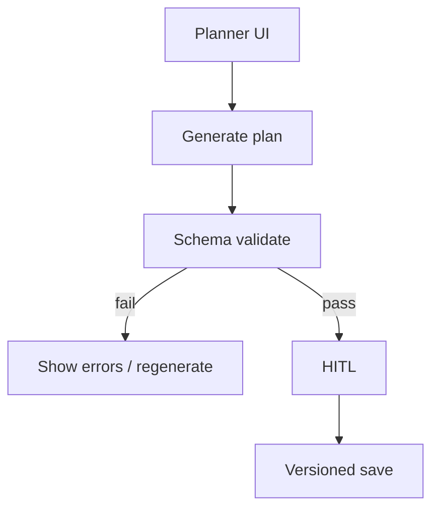
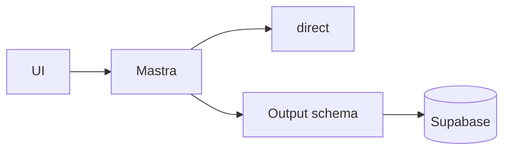
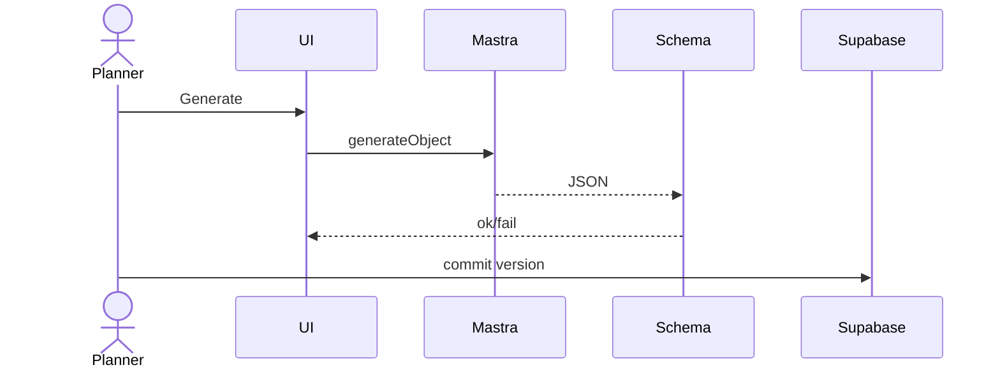
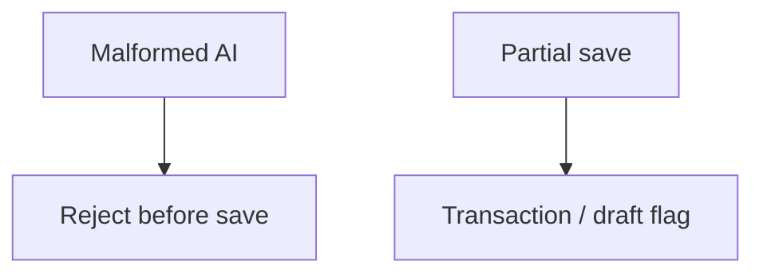

# 07 — Planner workflow

## When to test

**Linear:** [IPI-507 · CF-UJ-007 — Journey test](https://linear.app/amo100/issue/IPI-507) · Parent [IPI-500 · CF-UJ-000](https://linear.app/amo100/issue/IPI-500)

When planner schema validation + HITL commit ships.

**Rule:** Execute this plan when the feature/use case above is developed enough to demo — not before. Do not mark Production Verified without remote Worker (IPI-472).

## 1. Purpose

End-to-end **content/production planner** loop: inputs → AI plan artifact → validation → human commit (distinct from single-shoot chat: engine + schemas + HITL).

## 2. Real-world persona

**Production Planner** · **Creative Director**

## 3. User journey

1. Open planner surface (campaign/shoot planner UI).
2. Supply goals, channels, dates, brand DNA constraints.
3. Mastra planner / `production-planner` generates structured plan.
4. Client/server schema validation (`zod` / output schemas).
5. HITL: accept, edit, or reject.
6. Persist plan version; optional spawn booking/CRM tasks.

## 4. Tech stack mapping

| Layer | Technology |
|-------|------------|
| UI | Next.js · CopilotKit |
| Agent | Mastra planner agents + schemas |
| AI | Gemini **direct** · structured |
| Gateway | Not for tool/structured-critical path until proven |
| Data | Supabase plans / campaigns |
| Auth | Supabase |
| Tests | Vitest schema · planner output validation |

**Flags:** structured output · tools · HITL · streaming  

## 5. Mermaid diagrams

## 6. Preconditions

- Campaign + brand fixtures  
- Known output schema version  
- `GEMINI_API_KEY`  
- HITL UI present  

## 7. Test scenarios

Happy · validation fail · RLS · gateway · timeout · malformed · empty inputs · duplicate version · cancel · mobile · a11y · recovery  

## 8. Real-runtime verification

🟡 Local · ⚪ CF gateway · ⚪ Prod  

## 9. Success criteria

- Invalid JSON never persists as committed  
- Version monotonic  
- Latency measured for generate  
- Logs include request correlation when available  

## 10. Checklist

- [ ] Schema fixture  
- [ ] Unit validation  
- [ ] Integration generateObject  
- [ ] Browser HITL  
- [ ] CF N/A  
- [ ] RLS  
- [ ] Observability  
- [ ] Cleanup versions  
- [ ] Sign-off  

## 11. Failure points and blockers

Schema drift · **IPI-473 · AGENT-003 — Shared Prompt Registry** · gateway structured unproven  

## 12. Automation opportunities

Vitest golden plans · Playwright HITL · CI schema package · scheduled generate-only
