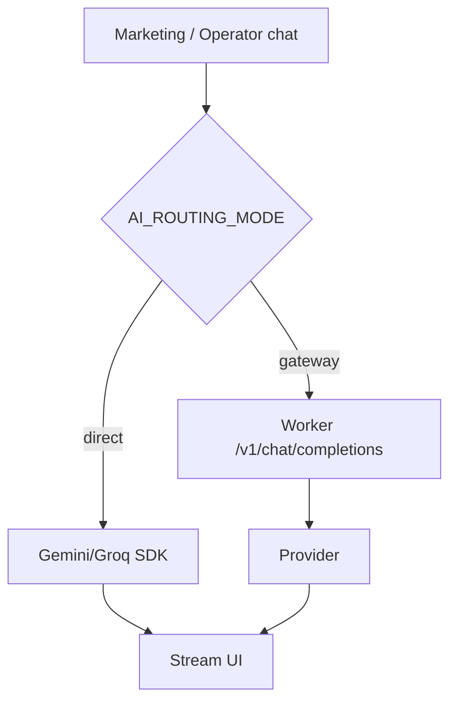
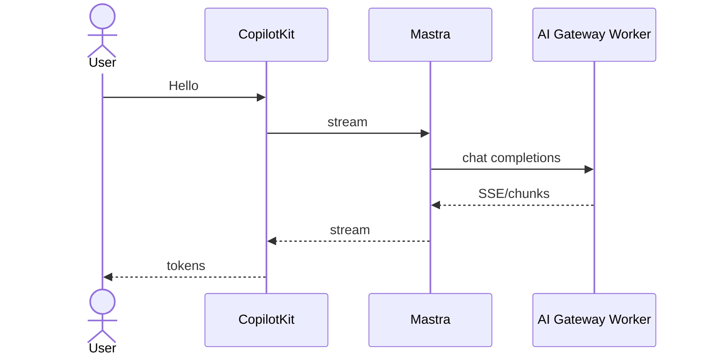
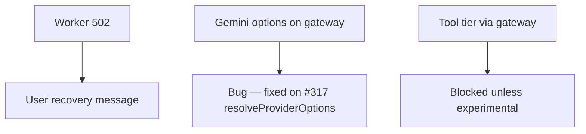

# 08 — Marketing & operator chat (gateway-capable)

## When to test

**Linear:** [IPI-508 · CF-UJ-008 — Journey test](https://linear.app/amo100/issue/IPI-508) · Parent [IPI-500 · CF-UJ-000](https://linear.app/amo100/issue/IPI-500)

As soon as IPI-454 AC-F + gateway env; required before AC-J Done. Also regression direct mode.

**Rule:** Execute this plan when the feature/use case above is developed enough to demo — not before. Do not mark Production Verified without remote Worker (IPI-472).


## 1. Purpose

Prove the **first real Mastra → Cloudflare AI Gateway** product path: public marketing chat and lightweight operator turns on the **`fast`** tier without tools.

## 2. Real-world persona

**Prospect** (marketing) · **Operator** (in-app quick ask)

## 3. User journey

1. Marketing page with CopilotKit **`public-marketing`** (tier `fast`) **or** operator chat on a non-tool turn.
2. User sends a short message.
3. With `AI_ROUTING_MODE=gateway`: Mastra `resolveModel('fast')` → OpenAI-compatible client → Worker `/v1/chat/completions` → Workers AI / configured provider.
4. Stream tokens back to CopilotKit UI.
5. Outcome: answer visible; Worker logs show request; no Gemini options leaked on gateway path.

## 4. Tech stack mapping

| Layer | Technology |
|-------|------------|
| UI | Next.js · CopilotKit v2 |
| Agent | Mastra `public-marketing` (`fast`) |
| AI routing | **Cloudflare AI Gateway Worker** when gateway mode |
| Providers | Workers AI (via Worker) · fallback per Worker config |
| Direct fallback | Gemini/Groq if `AI_ROUTING_MODE=direct` |
| Auth | Public marketing may be anon; operator needs session |
| Observability | Worker logs · `x-request-id` |
| Tests | Vitest resolveModel · Wrangler curl · Playwright |

**Flags:** streaming · **no tools** · **no vision** · gateway allowlist `fast` only  

## 5. Mermaid diagrams



```mermaid
flowchart LR
  UI --> CK[/api/copilotkit]
  CK --> M[Mastra]
  M -->|gateway| W[CF Worker]
  W --> AI[Workers AI]
  M -->|direct| G[Gemini]
```





## 6. Preconditions

- `AI_ROUTING_MODE=gateway` set **before** Next/Mastra boot  
- `AI_GATEWAY_BASE_URL` (e.g. `http://127.0.0.1:8787/v1`)  
- `AI_GATEWAY_API_KEY` matching Worker  
- Wrangler `ai-gateway` on `:8787` **or** remote Worker after **IPI-472**  
- Do **not** set `AI_GATEWAY_ALLOW_TOOL_TIERS=1` for normal tests  
- Marketing route wired to `public-marketing`  

## 7. Test scenarios

| Scenario | Expect |
|----------|--------|
| Happy gateway | Tokens stream; Worker 200 |
| Happy direct | Works without Worker |
| Validation | Empty message rejected |
| Permissions | Operator routes require auth |
| Gateway unavailable | Clear error; optional document fallback |
| Provider timeout | Worker/app error envelope |
| Provider fallback | Per Worker policy if configured |
| Malformed | Sanitized error (**IPI-495** chat parity still open) |
| Empty state | Placeholder CTA |
| Duplicate submit | No double charge / single turn |
| Cancel | Abort stream |
| Mobile / a11y | Chat usable |
| Recovery | Retry |

## 8. Real-runtime verification

| Level | Status |
|-------|--------|
| Unit | 🟡 #317 tests |
| Build | 🟡 |
| Local Runtime | 🟡 stand-in `resolveModel`+`generateText`; **browser UJ not run** |
| Remote Preview | ⚪ until IPI-472 |
| Production | ⚪ |

## 9. Success criteria

- Request reaches Worker in gateway mode  
- Tier key `fast` (not raw Gemini model id) on wire  
- `resolveProviderOptions` empty on gateway path  
- Streaming to CopilotKit  
- No API keys in browser  
- Logs: request id  

## 10. Checklist

- [ ] Wrangler up  
- [ ] Env before boot  
- [ ] Unit resolveModel  
- [ ] Curl UJ-HEALTH + chat  
- [ ] Playwright marketing chat  
- [ ] Cloudflare runtime proof  
- [ ] Compare direct vs gateway  
- [ ] Observability  
- [ ] Cleanup  
- [ ] Sign-off  

## 11. Failure points and blockers

- Module-load model binding  
- **IPI-472 · INFRA-001**  
- **IPI-454 · CF-AI-001** AC-J / #317 merge  
- Chat error envelope **IPI-495 · CF-AI-004e**  
- Missing Playwright test ids  

## 12. Automation opportunities

| Test | Target |
|------|--------|
| resolveModel gateway | Vitest CI |
| Worker chat | Wrangler integration |
| Marketing one-turn | Playwright |
| Nightly gateway smoke | Scheduled |
| Gate | CI job with `AI_ROUTING_MODE=gateway` + wrangler |

**First journey to automate (recommended):** this document (J08).
