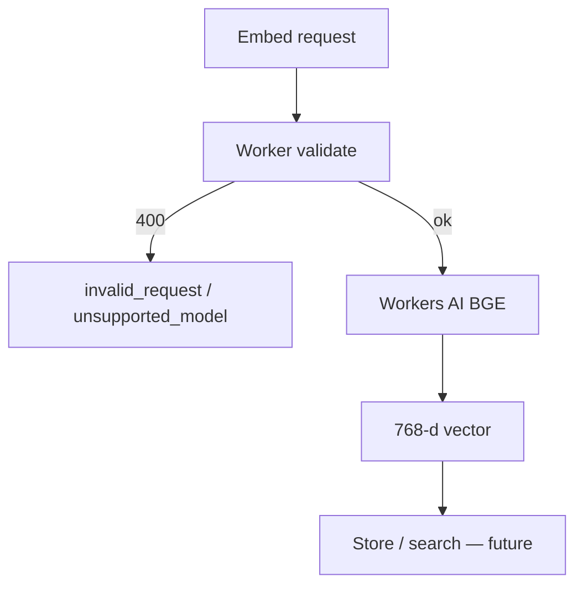
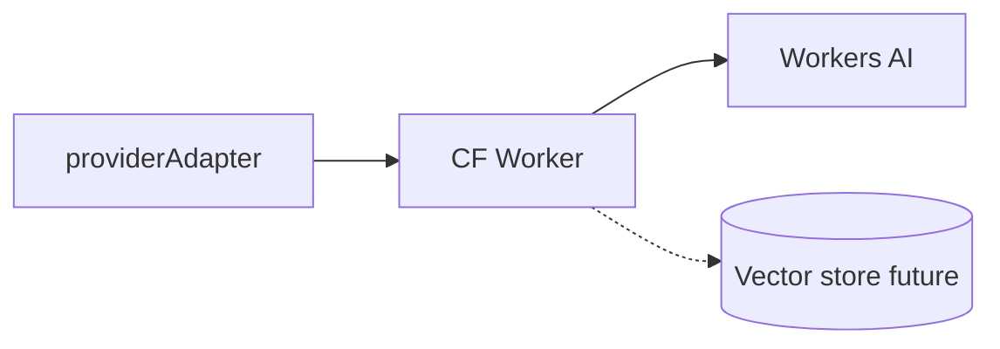
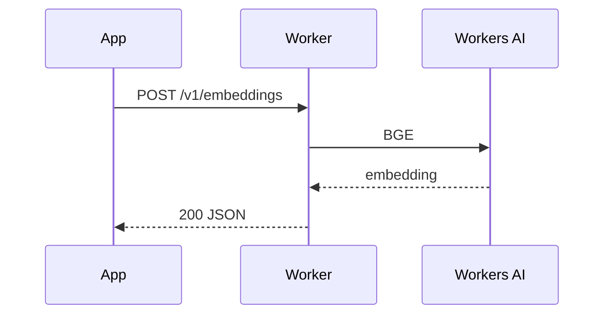
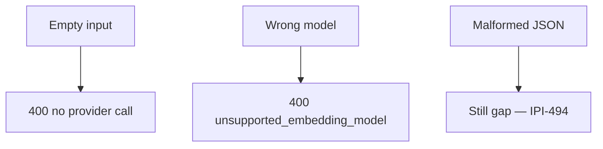

# 09 — AI embeddings & asset search

## When to test

**Linear:** [IPI-509 · CF-UJ-009 — Journey test](https://linear.app/amo100/issue/IPI-509) · Parent [IPI-500 · CF-UJ-000](https://linear.app/amo100/issue/IPI-500)

Now for embed contracts; product search after IPI-474; remote after IPI-472.

**Rule:** Execute this plan when the feature/use case above is developed enough to demo — not before. Do not mark Production Verified without remote Worker (IPI-472).

## 1. Purpose

Generate embeddings for text/assets and (eventually) retrieve similar assets via vector search — foundation for AI asset search.

## 2. Real-world persona

**Operator** (search) · **Engineer** (pipeline)

## 3. User journey

1. App or script calls `providerAdapter.embed` / Worker `POST /v1/embeddings`.
2. Worker validates model + input (**IPI-492 · CF-AI-004c**).
3. Workers AI BGE returns **768-d** vectors.
4. Future: store in Vectorize/pgvector (**IPI-474 · SEARCH-001**) → UI similarity search.
5. Today: contract + adapter proven; **product search UI may be incomplete**.

## 4. Tech stack mapping

| Layer | Technology |
|-------|------------|
| Caller | Next.js server / adapter / scripts |
| AI routing | Cloudflare AI Gateway Worker `/v1/embeddings` |
| Providers | Workers AI BGE |
| Data (future) | Vectorize / Supabase vectors — **IPI-474** Backlog |
| Auth | Worker API key |
| Tests | Vitest · Wrangler live UJ-EMBED |
| Observability | Worker logs |

**Flags:** embeddings · **no** chat tools · batch embed  

## 5. Mermaid diagrams

## 6. Preconditions

- Wrangler AI binding  
- `AI_GATEWAY_API_KEY`  
- Supported embed model id per Worker allowlist  
- For product UI: vector table + RLS (may be missing)  

## 7. Test scenarios

Happy single/batch · empty · unsupported model · gateway down · timeout · malformed JSON (**IPI-494**) · empty corpus search · duplicate index · cancel · N/A mobile for API · recovery  

## 8. Real-runtime verification

| Level | Status |
|-------|--------|
| Unit | 🟢 |
| Build | 🟢 Worker |
| Local Runtime | 🟢 UJ-EMBED / #319 |
| Remote Preview | ⚪ |
| Production | ⚪ |
| Product search UX | ⚪ / 🟡 |

## 9. Success criteria

- 768-d output  
- 400 on bad input (no provider burn)  
- Sanitized errors  
- No secrets in response  
- Future: RLS on vectors  

## 10. Checklist

- [ ] Wrangler  
- [ ] Curl UJ-EMBED  
- [ ] Unit contracts  
- [ ] Adapter tests  
- [ ] Browser search when UI exists  
- [ ] CF runtime proof  
- [ ] Vector store verify  
- [ ] Observability  
- [ ] Cleanup vectors  
- [ ] Sign-off  

## 11. Failure points and blockers

- **IPI-474 · SEARCH-001 — AI Search & Vector Architecture**  
- **IPI-472 · INFRA-001** remote  
- **IPI-494 · CF-AI-004d** malformed JSON  
- **IPI-498 · CF-AI-004g** adopt AiGatewayError at call sites  
- Direct Gemini embed bypass if any leftover  

## 12. Automation opportunities

Vitest + Wrangler in CI · scheduled embed smoke · SQL vector count · Playwright search when UI ships
