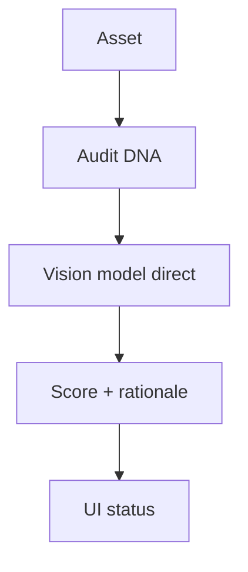
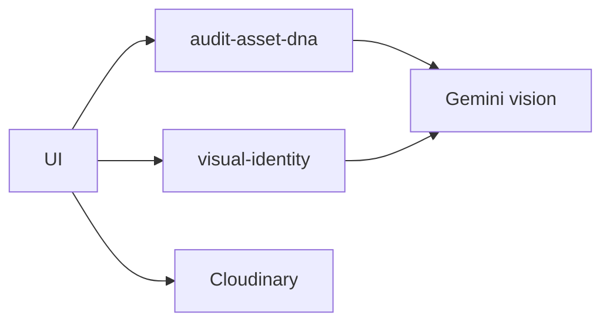
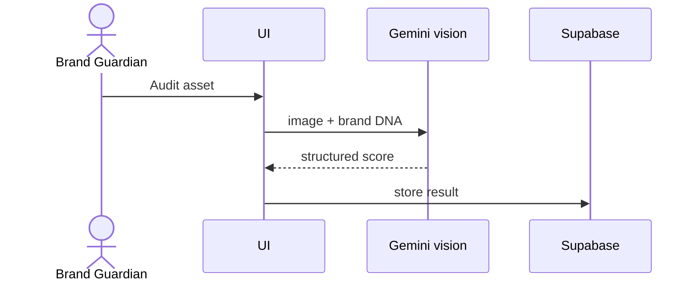
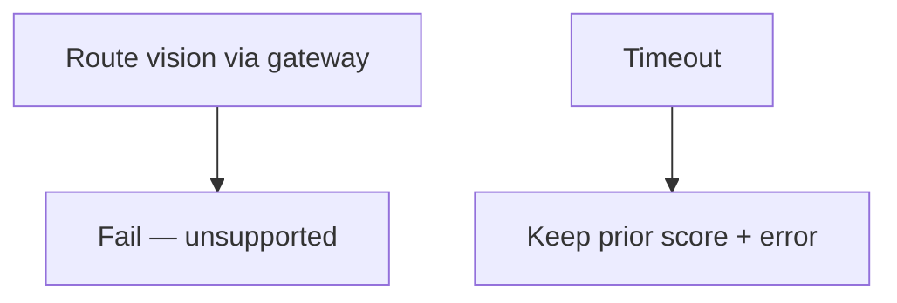

# 10 — Visual DNA analysis

## When to test

**Linear:** [IPI-511 · CF-UJ-010 — Journey test](https://linear.app/amo100/issue/IPI-511) · Parent [IPI-500 · CF-UJ-000](https://linear.app/amo100/issue/IPI-500)

When asset DNA audit UI ships; vision always direct; CF path only after IPI-456.

**Rule:** Execute this plan when the feature/use case above is developed enough to demo — not before. Do not mark Production Verified without remote Worker (IPI-472).

## 1. Purpose

Score assets against brand visual DNA (approved / review / blocked) so operators catch off-brand creative before publish.

## 2. Real-world persona

**Brand Guardian** · **Creative Director**

## 3. User journey

1. Upload/select asset in `/app/assets` (or DNA panel).
2. Trigger audit: edge `audit-asset-dna` and/or Mastra **`visual-identity`** (vision tier).
3. Model inspects image → structured compliance result.
4. UI shows DNA status colors; human overrides if needed.
5. Optional: shoot DNA pipeline (**IPI-282 · SHOOT-AI-004B** Backlog).

## 4. Tech stack mapping

| Layer | Technology |
|-------|------------|
| UI | Next.js · assets / DNA UI |
| Agent | Mastra `visual-identity` (**vision**) |
| Edge | `audit-asset-dna` · Gemini |
| AI path | **Gemini direct vision** — Worker **has no ImageParts** |
| Gateway | **Must not** route vision |
| Files | Cloudinary |
| Data | Supabase asset DNA fields |
| Migrate CF | **IPI-456** Migrate Asset DNA Scoring to Cloudflare — Backlog |

**Flags:** vision · structured · tools optional · **not** gateway  

## 5. Mermaid diagrams

## 6. Preconditions

- Cloudinary asset URL  
- Brand DNA profile  
- `GEMINI_API_KEY`  
- Vision-capable model in registry  
- `AI_ROUTING_MODE` irrelevant for vision (always direct)  

## 7. Test scenarios

Happy approved/review/blocked · missing image · RLS · gateway forced (expect bypass/fail documented) · timeout · malformed score · empty gallery · duplicate audit · cancel · mobile · a11y · recovery  

## 8. Real-runtime verification

🟡 Local edge/Mastra direct · 🔴 CF vision path · ⚪ Prod CF  

## 9. Success criteria

- Score enum valid  
- Rationale shown  
- No gateway hop for vision  
- Cloudinary URL not leaking secrets  

## 10. Checklist

- [ ] Sample assets  
- [ ] Unit score schema  
- [ ] Edge verify DNA scripts  
- [ ] Browser audit  
- [ ] Assert no Worker vision call  
- [ ] RLS  
- [ ] Logs  
- [ ] Cleanup  
- [ ] Sign-off  

## 11. Failure points and blockers

- **IPI-456** · **IPI-282**  
- Vision ≠ gateway  
- Incomplete DNA seed  

## 12. Automation opportunities

Vitest schema · Playwright audit button · edge verify script in CI · never Wrangler vision until supported
