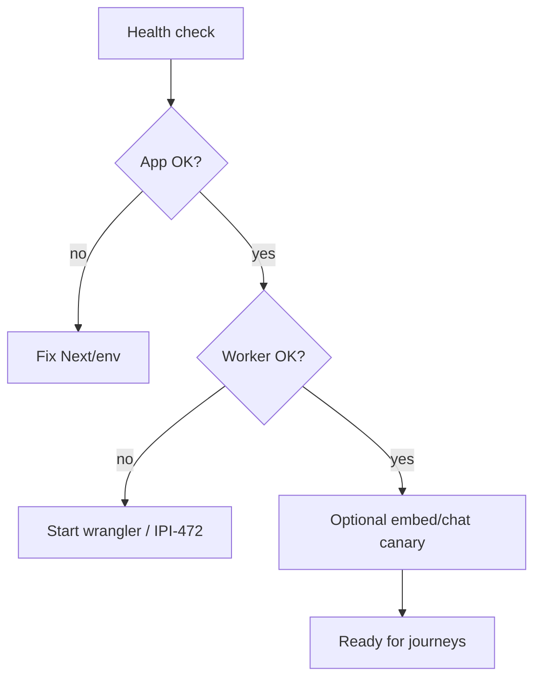
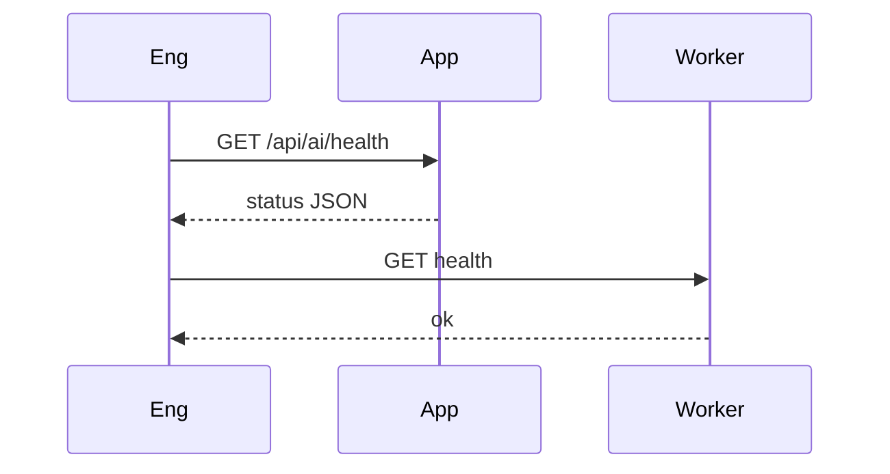
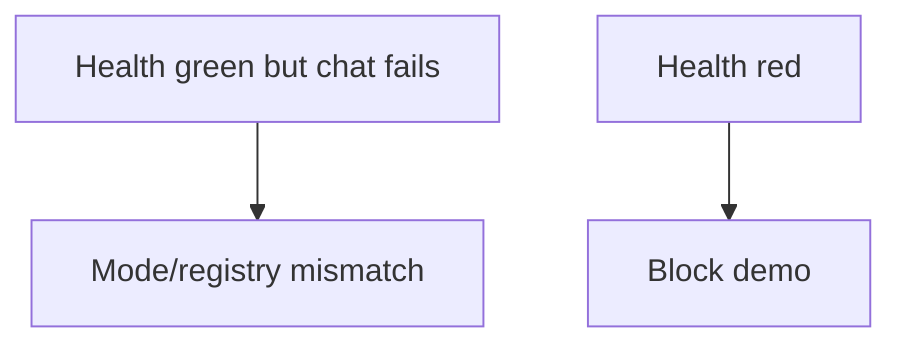

# 11 — Operator AI health / readiness check

## When to test

**Linear:** [IPI-510 · CF-UJ-011 — Journey test](https://linear.app/amo100/issue/IPI-510) · Parent [IPI-500 · CF-UJ-000](https://linear.app/amo100/issue/IPI-500)

Continuous — every AI/Worker PR and before demos. Does not wait for product features.

**Rule:** Execute this plan when the feature/use case above is developed enough to demo — not before. Do not mark Production Verified without remote Worker (IPI-472).


## 1. Purpose

Before any AI journey, prove the stack is alive: app health endpoint, Worker health, auth to gateway, and (optionally) embed/chat canaries — so failures are infra, not “AI is dumb.”

## 2. Real-world persona

**Engineer** · **On-call Operator**

## 3. User journey

1. Hit `GET /api/ai/health` (app) and/or Worker health route.
2. Optionally run UJ-HEALTH / UJ-EMBED from [`../tests/worker-user-journeys.md`](../tests/worker-user-journeys.md).
3. Interpret: direct vs gateway mode, missing keys, Worker down.
4. Gate deploys / demos on green readiness.

## 4. Tech stack mapping

| Layer | Technology |
|-------|------------|
| UI/API | Next.js `/api/ai/health` |
| Worker | Cloudflare AI Gateway health |
| Providers | Indirect (health may not call LLM) |
| Observability | Cloudflare logs · CI |
| Tests | Curl · Vitest · Wrangler |

**Flags:** readiness · no user PII  

## 5. Mermaid diagrams



```mermaid
flowchart LR
  Eng --> App[/api/ai/health]
  Eng --> W[Worker health]
  App -.-> W
```





## 6. Preconditions

- App runnable  
- For gateway proof: Wrangler + keys  
- Document expected JSON shape of health  

## 7. Test scenarios

Happy both green · app up Worker down · missing `AI_GATEWAY_*` · wrong API key · timeout · malformed health JSON · empty body · duplicate probes · N/A cancel · mobile N/A · recovery after restart  

## 8. Real-runtime verification

| Level | Status |
|-------|--------|
| Unit | 🟡 |
| Local Runtime | 🟢 (repeated in audits) |
| Remote Preview | 🟡 partial — see `../tests/ipi-510-health/2026-07-20-preview-health.json` (`AI_GATEWAY_URL` set; same-zone fetch 404) |
| Production | ⚪ (still Vercel) |

## 9. Success criteria

- Deterministic status fields  
- No secrets in health body  
- CI can fail closed on red  
- Correlation with Worker version when remote  

## 10. Checklist

- [ ] Document health contract  
- [ ] Local curl script  
- [ ] Unit parse  
- [ ] CI smoke job  
- [ ] Wrangler health  
- [ ] Remote after IPI-472  
- [ ] Observability  
- [ ] On-call runbook link  
- [ ] Sign-off  

## 11. Failure points and blockers

- Preview Worker → `ai-gateway` via public `*.workers.dev` URL returns **404** without a **service binding** (Cloudflare same-zone rule)  
- Unset `AI_GATEWAY_URL` falls back to `http://localhost:8787`  
- Health may not reflect Mastra module-load env  
- Dual registries  
- Green health ≠ CopilotKit browser proof (still need J08 / IPI-632 residuals)  

## 12. Automation opportunities

CI gate every PR touching `services/cloudflare-worker` or `app/src/lib/ai` · scheduled smoke · Wrangler integration · page the on-call on prod red
