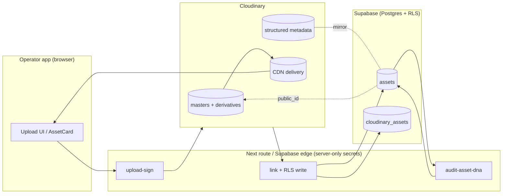
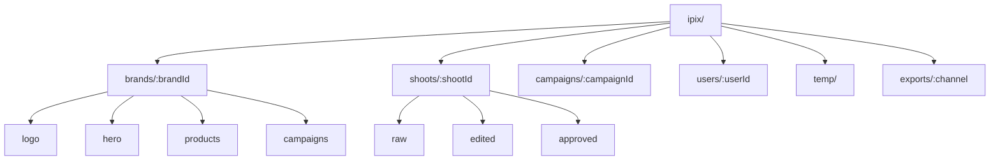
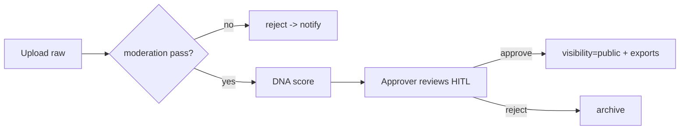

# Cloudinary Architecture — iPix / FashionOS

Canonical architecture for the operator media pipeline. Pairs with the phased roadmap in
[`phases/`](./phases/) and the screen-level media map in
[`MEDIA-MAP.md`](../design-docs/plan/MEDIA-MAP.md). Stack status lives in
[`cloudinary-plan.md`](./cloudinary-plan.md).

> Scope = **operator assets** (brand/shoot/campaign media). Mercur catalog images are a
> separate concern under a separate folder prefix and are **out of scope** here.

---

## 0. Live environment (verified via Cloudinary MCP — 2026-06-30)

| Fact | Value | Implication |
|------|-------|-------------|
| Plan | **Free** (25 credits, `cloudinary_ai` limit 200, object-detection 5000) | AI add-ons (bg-removal/moderation) likely **not enabled**; gate AI MVP scope (see §9) |
| Existing assets | **260 resources / 116 derived / ~60 MB** | account is **shared** with a legacy "Fashionistas" project |
| Existing folders | **47, all legacy** (`Fashionistas/*`, `ecommerce/*`, `runway`, `products`, …) | no `ipix/`/`brands/`/`shoots/` namespace exists → `ipix/` namespace is **mandatory** to avoid collision |
| Folder mode | **dynamic** (folders returned as entities with `external_id`) | §2 corrected: set `asset_folder` at sign time; do **not** assume fixed-folder mode |
| Media limits (live) | image ≤ **10 MB** / **25 MP**; video ≤ **100 MB**; raw ≤ **10 MB**; asset ≤ 50 MP | use as the signed-upload constraints in 074a |

> **Action:** for production, use a **dedicated product environment / sub-account** rather than this
> shared Free-tier cloud, and enable required add-ons before Phase 3 AI work.

---

## 1. Source-of-truth boundary — Supabase vs Cloudinary

| Concern | Owner | Notes |
|--------|:-----:|-------|
| Raw bytes, derivatives, CDN delivery | **Cloudinary** | masters + transformations + video |
| Asset relationships (brand/shoot/campaign), approval state, DNA score | **Supabase** | `assets`, `cloudinary_assets`, RLS |
| Authorization (who can read/write) | **Supabase RLS** | Cloudinary has no per-row tenant auth |
| Search by business metadata | **Both** | Supabase for app queries · Cloudinary structured metadata for media-tool/MCP search |
| Signing upload + delivery | **Server** (Next route / edge) | `CLOUDINARY_API_SECRET` server-only |

**Rule:** Supabase is the authorization + relational SoT. Cloudinary is the media SoT. The
`cloudinary_public_id` is the join key. Never authorize from Cloudinary alone.



---

## 2. Folder strategy (design before uploads)

Namespaced under `ipix/` to separate operator media from the 47 legacy folders already in this
shared cloud (§0) and from Mercur catalog. The environment is in **dynamic-folder mode** (verified
via MCP), so set `asset_folder` at sign time server-side; the client cannot override it. Folder is
an entity independent of `public_id` — do not encode authorization in the path.

```
ipix/
  brands/{brandId}/logo
  brands/{brandId}/hero
  brands/{brandId}/products
  brands/{brandId}/campaigns
  shoots/{shootId}/raw
  shoots/{shootId}/edited
  shoots/{shootId}/approved
  campaigns/{campaignId}
  users/{userId}
  temp/                      # unprocessed / pre-approval; lifecycle-expire
  exports/{channel}/         # generated channel deliverables (ig, tiktok, amazon, shopify)
```

**Reconciled (2026-06-30):** this tree is canonical. `MEDIA-MAP.md` and the IPI-257 074a sign route
now reference it (old `{brandId}/assets/{assetId}` pattern retired). Freeze before first upload.



---

## 3. Metadata model

Supabase is the SoT; Cloudinary **structured metadata** mirrors a search-relevant subset so the
Asset Management / Analysis MCP servers and Media Library can filter.

| Field | Type | SoT | Mirror to Cloudinary SMD? | Notes |
|-------|------|:---:|:---:|-------|
| `brandId` | uuid | Supabase | ✅ | tenant scope |
| `shootId` | uuid | Supabase | ✅ | nullable |
| `campaignId` | uuid | Supabase | ✅ | nullable |
| `designerId` | uuid | Supabase | ➖ | optional |
| `season` | enum | Supabase | ✅ | e.g. `SS26` |
| `status` | enum | Supabase | ✅ | `draft/processing/ready/archived` |
| `approval` | enum | Supabase | ✅ | `pending/approved/rejected` (HITL) |
| `ai_score` (`dna_match`) | numeric | Supabase | ➖ | from `audit-asset-dna` |
| `platform` | enum[] | Supabase | ✅ | target channels |
| `visibility` | enum | Supabase | ✅ | `private/authenticated/public` → delivery type |
| `copyright` | text | Supabase | ➖ | |
| `license` | enum | Supabase | ➖ | usage rights |

**Rule:** `visibility` drives Cloudinary delivery type — `private/authenticated` until
`approval=approved`, then `public`. Mirror writes go through the **Structured Metadata MCP** or
SDK at link time; never trust client-supplied metadata for authorization.

---

## 4. Asset & video model

- **Master**: one immutable upload per asset (`resource_type` image|video|raw).
- **Derivatives**: produced via **named transformations** only (see §6) — never inline strings.
- **Versioning**: re-uploads create a new `public_id` (or Cloudinary version); `assets` row keeps
  history via `cloudinary_assets` link rows; never overwrite an approved master.
- **Video**: `f_auto,q_auto` + adaptive bitrate streaming (HLS/DASH) for shoot/UGC video; poster
  frame via `so_auto`. Player = Cloudinary Video Player (see [`16-cloudinary-video.md`](./16-cloudinary-video.md)).

**Live schema reality (verified):** the `cloudinary_assets` table exists but is minimal (`id`,
`asset_id` unique, `public_id` unique, `secure_url`, `resource_type`, `width`, `height`, `folder`,
timestamps) and its RLS is **stale** — scoped via `assets.shoot_id → shoots.designer_id`, which
breaks now that `shoot_id` is nullable. **074b** extends columns (`brand_id`, `delivery_type`,
`version`, `status`, `approval`, `moderation_status`, `dna_score`, `metadata`, …) and re-scopes RLS
to **brand owner** (`assets.brand_id → brands.user_id`). Exact SQL + rollback: **IPI-257 Contract §1**.

---

## 5. Stakeholder workflows (role × asset)

| Role | Reads | Creates / writes | Approves | Primary screens |
|------|-------|------------------|:--------:|-----------------|
| Fashion Designer | brand + shoot assets | upload refs | — | Brand Detail, Shoots |
| Photographer | shoot raw | upload raw | — | Shoot Detail |
| Videographer | shoot raw video | upload video | — | Shoot Detail |
| Stylist | shoot edited | tag, annotate | — | Shoot Detail |
| Model / Agency | shared selects | — (view) | — | Channel Preview (shared) |
| Brand (owner) | all brand media | upload, organize | ✅ | Brand Detail, Assets |
| Marketing team | campaign assets | export to channels | — | Campaigns, Channel Preview |
| Social media mgr | exports | publish | — | Channel Preview |
| Approver / Brand Guardian | drafts + DNA | — | ✅ HITL | IntelligencePanel / ApprovalQueue (IPI-244) |
| Administrator | all | manage presets, metadata fields, webhooks | ✅ | Admin / env-config (MCP) |

Approval gate (HITL) is enforced in Supabase (`approval` + IPI-244) and reflected by Cloudinary
`visibility`/delivery type — no public delivery before approval.



---

## 6. Transformations (named presets, per MEDIA-MAP)

Always end with `f_auto` then `q_auto`. Define as **named transformations** (one SoT, managed via
Environment Config MCP); components consume the name, never inline strings. Responsive via srcset /
`w_auto,dpr_auto`.

| Preset | Use | Params (draft) |
|--------|-----|----------------|
| `brand-cover` | BrandCard / list | `c_fill,w_400,h_300,g_auto/f_auto/q_auto` |
| `asset-tile` | grid thumb | `c_thumb,w_120,h_120,g_auto/f_auto/q_auto` |
| `asset-masonry` | Assets library | `c_limit,w_600/f_auto/q_auto` |
| `channel-ig` | Channel Preview | safe-zone from `/api/media/specs` `/f_auto/q_auto` |
| `channel-tiktok` | Channel Preview | `c_fill,ar_9:16,g_auto` |
| `hitl-diff` | before/after | side-by-side derivative URLs |

Authoritative syntax: add the Cloudinary `cloudinary_transformation_rules.md` as doc context +
the `cloudinary-transformations` skill when generating any URL.

---

## 7. LLM MCP integration (build/ops-time vs runtime)

**Important:** Cloudinary MCP servers are **AI-agent / build-and-ops tooling** (used by Cursor/Claude
to configure the environment, author presets/metadata fields, run analysis, build MediaFlows). They
are **not** the production runtime path. Runtime app uploads/delivery use the **Node SDK** (server
routes / edge) and the **React SDK** (display). Keep the two lanes separate.

| MCP server | Used by (agent/dev) | When |
|------------|---------------------|------|
| `cloudinary-asset-mgmt` | dev + Creative Director research | upload/search/derive during build + ops |
| `cloudinary-env-config` | dev / admin | author upload presets, **named transformations**, webhooks, streaming profiles |
| `cloudinary-smd` | dev / admin | define structured-metadata fields + conditional rules (§3) |
| `cloudinary-analysis` | Visual Identity, Brand Intelligence (build-time experiments) | auto-tagging, moderation, object detection (OAuth only) |
| `cloudinary-mediaflows` | dev / admin | author automation flows (see [`15-cloudinary-mediaflows.md`](./15-cloudinary-mediaflows.md)) |

| App agent | Cloudinary touchpoint | Path |
|-----------|----------------------|------|
| Visual Identity (Mastra) | `uploadToCloudinary()` + tagging | Node SDK (server) |
| Creative Director | reads brand/asset derivatives for suggestions | delivery URLs |
| Brand Intelligence | crawl imagery → palette | edge + analysis (build-time) |
| Production Planner | shoot asset coverage | reads metadata via Supabase |
| CopilotKit | surfaces results, never calls Cloudinary directly | via Mastra tools |
| Gemini | DNA scoring (`audit-asset-dna`) consumes delivery URL | edge |

Remote MCP endpoints (OAuth): `asset-management`, `environment-config`, `structured-metadata`,
`analysis` (`/sse`, OAuth-only), `mediaflows`. Analysis does **not** support API-key auth.

---

## 8. Security model

- `CLOUDINARY_API_SECRET` / `API_KEY` server-only; **no** `NEXT_PUBLIC_CLOUDINARY*`; SDK never in a client component.
- **Signed uploads only** — no open unsigned preset. Signature computed server-side; `asset_folder`/format/size constrained at sign time. Enforce live limits (§0): image ≤ 10 MB / 25 MP, video ≤ 100 MB, raw ≤ 10 MB.
- **Signed/authenticated delivery** for `visibility != public` (pre-approval assets).
- Webhooks verify Cloudinary signature before any DB write.
- Optional moderation add-on gate (WebPurify / AWS Rek) before public delivery.
- RLS on `cloudinary_assets` + `assets` (brand/org scoped); edge writes use service-role.

---

## 9. Measurable readiness (repeatable rubric)

Replace subjective scores with checklists. Readiness = `Low` if any Core item missing.

```text
Cloudinary readiness
✓ cloudinary_assets schema        ✗ Node SDK in app/package.json
✓ assets.cloudinary_public_id     ✗ signed upload endpoint (074a)
✓ audit-asset-dna edge deployed   ✗ RLS verified on cloudinary_assets (074b)
~ uploadToCloudinary (env-gated)  ✗ webhook sync (074c/h)
                                  ✗ named transformations (074f)
                                  ✗ MediaFlows automation (074g)
                                  ✗ moderation gate
Estimated readiness: LOW (account connected + 260 legacy assets, but 0 in ipix/ namespace,
0 rows in cloudinary_assets, no signed-upload/webhook/RLS path)

DAM readiness
✗ folder strategy enforced  ✗ structured metadata fields  ✗ search  ✗ tagging
Estimated readiness: LOW

AI readiness
✓ DNA edge   ~ auto-tagging (analysis MCP, not wired)  ✗ moderation  ✗ bg removal  ✗ visual search
Estimated readiness: PARTIAL

Security
✓ env server-only by convention  ✗ signed upload enforced  ✗ RLS verified  ✗ webhook verify
Estimated readiness: PARTIAL
```

---

## 10. IPI-257 sub-task split (074a–h)

One concern per PR. `257a–h` are sub-deliverables of Linear **IPI-257**; create as Linear
sub-issues only on go-ahead (do not auto-proliferate).

| Sub | Scope | Depends | PR type |
|-----|-------|---------|---------|
| 074b | `cloudinary_assets` column extension + **brand-scoped RLS** (existing shoot RLS stale) | — | migration-only (FIRST) |
| 074b2 | SDK + env wiring (`cloudinary` in `app/package.json`, server) | 074b | code |
| 074a | Signed upload API route | 074b2 | code |
| 074c | Link upload → `assets` + brand scope (+ webhook verify) | 074a | code |
| 074h | Webhook sync back to Supabase | 074c | code |
| 074d | DNA audit trigger (`audit-asset-dna`) | 074c | edge |
| 074f | Named transform presets + delivery | 074b2 | code/config |
| 074e | Channel readiness transforms (IG/TikTok/Amazon) | 074f | code |
| 074g | MediaFlows automation (auto-tag, variants, moderation) | 074d,074f | config |

Then integrate into screens: IPI-248 (Assets), IPI-271 (Brand Detail), IPI-273 (Shoots List),
IPI-249 (Campaigns), IPI-269 (Channel Preview).

---

## 11. Verification checklist (Done gate for the epic)

```text
[ ] Upload image (signed)        [ ] Unauthorized upload blocked (401)
[ ] Upload video                 [ ] Cross-brand RLS blocked
[ ] Metadata saved (Supabase + SMD mirror)
[ ] Asset searchable             [ ] Transformation URLs work (f_auto,q_auto)
[ ] Responsive images (srcset)   [ ] AI analysis / tagging works
[ ] Background removal works     [ ] Moderation gate enforced
[ ] Webhook updates Supabase     [ ] DNA score populated
[ ] RLS enforced (verify-rls)    [ ] Secret-guard grep clean (0 client refs)
[ ] Playwright passes            [ ] Browser verification complete
```

---

## 12. Existing doc index (was unlinked — now canonical)

| Doc | Topic | Phase |
|-----|-------|------|
| [`cloudinary-plan.md`](./cloudinary-plan.md) | stack status + tasks | — |
| [`09-cloudinary-integration.md`](./09-cloudinary-integration.md) | infra/upload | Core |
| [`04-media-library.md`](./04-media-library.md) | DAM/library | Core/Advanced |
| [`16-cloudinary-video.md`](./16-cloudinary-video.md) | video + player | Advanced |
| [`17-cloudinary-ai-enhancements.md`](./17-cloudinary-ai-enhancements.md) | bg removal, tagging, scoring | Advanced |
| [`18-cloudinary-overlays-branding.md`](./18-cloudinary-overlays-branding.md) | overlays/watermark | Advanced |
| [`15-cloudinary-mediaflows.md`](./15-cloudinary-mediaflows.md) | automation | MCP |
| [`19-cloudinary-analytics.md`](./19-cloudinary-analytics.md) | analytics/monitoring | Advanced |
| [`23-ugc-video-creator.md`](./23-ugc-video-creator.md) | UGC video | Advanced |
| [`24-360-spin-videos.md`](./24-360-spin-videos.md) | 360 spin | Advanced |

---

## 13. Implementation contracts (canonical → IPI-257)

The full **implementation-ready contracts** (request/response, SQL, signature algorithms) live in
[`docs/linear/issues/IPI-257-cloudinary-pipeline.md`](../../docs/linear/issues/IPI-257-cloudinary-pipeline.md)
under *Implementation Contracts (rev3)*. Canonical summary:

### 13.1 Delivery × approval mapping (the "no public before approval" rule, made concrete)

| State | Cloudinary `type` | How operators preview | On transition |
|-------|-------------------|----------------------|---------------|
| draft / pending | `authenticated` | signed URL, `auth_token` **TTL 600 s**, brand-owner only | — |
| approved (HITL, IPI-244) | `upload` (public) | public + channel exports | `update_access_mode`→public **+ `invalidate:true`** |
| rejected | `authenticated` / archived | none public | revocable |

### 13.2 Webhook (verified vs official notifications doc)

Headers `X-Cld-Timestamp` + `X-Cld-Signature` (legacy **HMAC-SHA1**, verify with `CLOUDINARY_API_SECRET`);
newer `X-Cld-Signature_v2` (EdDSA) under `auth_scheme`. Verify with `valid_for=300 s` (SDK default 7200 s),
idempotency on `notification_id`, ACK 2xx fast or Cloudinary retries. Events: `upload`, `eager`,
`moderation`, async tagging, `delete`.

### 13.3 Failure & recovery (canonical)

- **Orphans:** nightly reconcile `ipix/**` (asset-mgmt MCP `search-assets`) vs `cloudinary_assets`;
  `ipix/temp/**` > 24 h auto-delete; missing-master rows → `status='archived'`.
- **Rollback:** additive-only migrations with a down (IPI-257 §1d); 0 rows today = nil risk.
- **Monitoring:** credits/bandwidth via `get-usage-details` MCP, alert at 80 % of Free-plan 25 credits;
  stuck-`processing` watch.
- **Audit:** `insertAgentLog` on sign / link / approval / webhook / moderation (actor + brand_id + public_id).

### 13.4 The 7 contracts (in IPI-257)

1. `cloudinary_assets` schema (columns + indexes + RLS + migration + rollback) · 2. Signed Upload API ·
3. Webhook · 4. Environment & Security (`.env.example`, Infisical, CI secret guard) ·
5. Approval & Delivery · 6. Transformations (named/responsive/video/versioning/caching) ·
7. Failure & Recovery.
