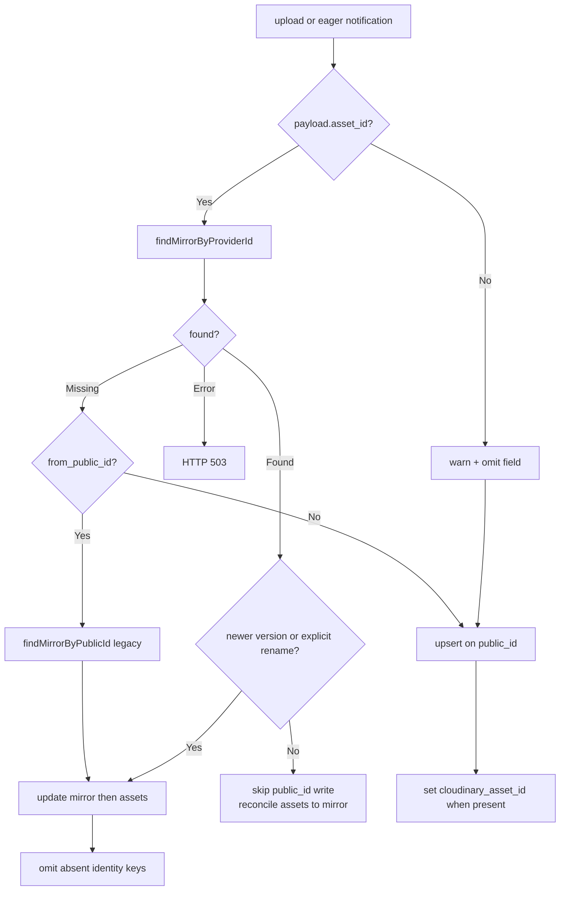
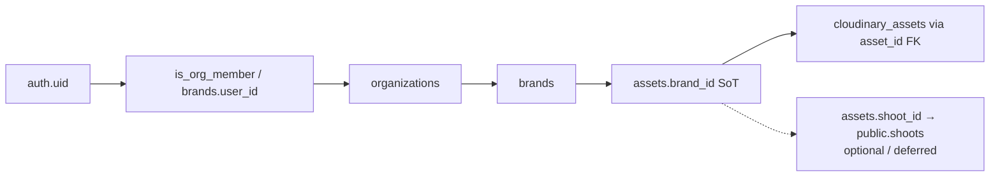
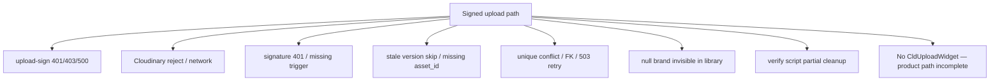

# Cloudinary + Supabase Deep Audit

**Date:** 2026-07-16  
**Branch:** `ai/ipi-641-cloudinary-asset-id` @ `cce6307c`  
**PR:** https://github.com/amo-tech-ai/lumina-studio/pull/421  
**Supabase project:** `nvdlhrodvevgwdsneplk`  
**Cloudinary cloud (public):** `dzqy2ixl0`  
**Skills used:** `cloudinary`, `ipix-supabase`, `task-verifier`, `lean`  
**Skills missing in repo:** `migration-reviewer`, `security-reviewer` (substituted with Supabase Advisors + schema SQL + PR review thread verification)

**Method:** Dashboard/MCP → CLI/SQL → repo code → official docs patterns → focused tests.  
**No code or Linear mutations in this audit.**

**Execution plan (corrected):** [`new-plan.md`](./new-plan.md) — rename trigger = recommended spike (not automatic P0); Realtime out of immediate Cloudinary plan.

---

## Executive verdict

| Question | Answer |
| --- | --- |
| Will the **complete** Cloudinary + Supabase setup succeed? | **Partial.** Ingest + identity (PR #421) can succeed after merge + deploy + QA upload. **Operator upload UI is missing** (IPI-433). Shoot-linked ownership is ADR-only (IPI-524 follow-up). |
| Is PR #421 safe to merge? | **Yes, conditionally** — CI core gates green; Codacy ACTION_REQUIRED; AGENTS #1 migration/code mix is process debt (migration already applied remotely). |
| Biggest production gap | **0 / 5** live mirrors have `cloudinary_asset_id` populated; schema ready, webhook identity code **not on prod** until merge/deploy. |

---

## Evidence probes (this run)

| Probe | Result |
| --- | --- |
| `gh pr view 421` | OPEN, MERGEABLE, 8 commits, 6 files |
| CI | `app-build` ✅ · `booking-gate` ✅ · `supabase-web015` ✅ · Codacy ❌ fail · Bugbot skipping |
| Cloudinary MCP presets | `ipix-signed-upload`: **signed** (`unsigned:false`), `type=authenticated`, `overwrite:false`, eager 600/1200/1600 |
| Cloudinary MCP triggers | **upload** + **delete** → `https://www.ipix.co/api/assets/cloudinary/webhook` (legacy_hmac). **No `rename` trigger. No `eager` trigger.** |
| Supabase MCP counts | `cloudinary_assets`: 5 total, **5 null provider id**, 1 ready; `assets`: 25, **14 null brand**; 1 asset with cld id and no mirror; 4 public_id join anomalies (legacy fashionos) |
| Migration `ipi641_cloudinary_asset_id` | Applied as `20260716182739` |
| Indexes | Partial unique `cloudinary_assets_cloudinary_asset_id_uidx`; unique `public_id`; unique `asset_id` FK; brand indexes present |
| Realtime publication | `assets` / `cloudinary_assets` / `shoots` / `brands` **not** in `pg_publication_tables` |
| Focused tests | 116 passed (webhook 42 + upload-sign 21 + pipeline 47 + get-assets 6) |
| Live QA upload | **Not executed against prod** — prod webhook lacks PR #421 identity writes; would not prove non-null `cloudinary_asset_id`. Post-merge required. |
| ADR IPI-524 | Present locally: `tasks/cloudinary/ipi-524-shoot-ownership-adr.md` (Accepted; **untracked / not in PR #421**) |

---

## System diagrams (actual implementation)

### System flow

```mermaid
flowchart LR
  UI["Assets UI<br/>read-only today"]
  SignRoute["POST /api/assets/upload-sign"]
  Cloudinary["Cloudinary<br/>type=authenticated<br/>preset ipix-signed-upload"]
  Webhook["POST /api/assets/cloudinary/webhook<br/>upload + delete triggers"]
  IdentityMapper["mapProviderIdentity<br/>provider id → version"]
  Supabase["assets + cloudinary_assets<br/>service role"]
  AssetsUI["listAssets → /app/assets"]

  UI -.->|"IPI-433 missing"| SignRoute
  SignRoute --> Cloudinary
  Cloudinary -->|"upload/delete webhooks"| Webhook
  Webhook --> IdentityMapper
  IdentityMapper --> Supabase
  Supabase --> AssetsUI
```



### Identity decision (PR #421)



### Authorization path



**Live RLS note:** `assets` also retains legacy **shoot-designer** policies (`authenticated_*_assets` via `shoots.designer_id`). Postgres ORs permissive policies → access if **either** brand-org **or** shoot-designer matches. Null-brand + null-shoot rows stay hidden from library SELECT.

### Failure points



---

## Status table

| Status | Area | Evidence | Risk | Required fix |
| --- | --- | --- | --- | --- |
| 🟢 | Cloudinary preset `ipix-signed-upload` | MCP: signed, `type=authenticated`, overwrite false, eager sizes | Low | None for MVP |
| 🟢 | Webhook URL on prod | Triggers → `https://www.ipix.co/api/assets/cloudinary/webhook` | Low | Keep secret rotation documented |
| 🟡 | Webhook event coverage | Only **upload** + **delete** triggers; code handles eager; **no rename trigger** | Medium — renames rely on later upload/eager or `from_public_id` | Add Console trigger for `rename` (and optionally `eager`) |
| 🟢 | API secret not in browser | Sign/webhook/signed-url server-only; client uses `NEXT_PUBLIC_CLOUDINARY_CLOUD_NAME` | Low | Document server vars in `.env.example` |
| 🟢 | Schema column + partial unique | Migration applied; index live | Low | — |
| 🔴 | Identity population | **0/5** rows have `cloudinary_asset_id` | High until post-merge upload | Merge #421 → deploy → QA upload → optional backfill |
| 🟡 | Legacy / fashionos rows | 4 processing mirrors null brand/version; 1 asset without mirror | Medium data debt | Backfill or archive fashionos leftovers |
| 🟡 | Dual assets RLS | Brand-org + shoot-designer policies both active | Medium confusion | Document; eventually retire shoot-designer path after SHOOT-ARCH-002 |
| 🟢 | Null-brand library policy | RLS hides null `brand_id` (intentional for IPI-435 v1) | Low if documented | Keep explicit in IPI-435 |
| 🟢 | Webhook identity logic (PR #421) | Provider-first, rename order, 503, stale guards, legacy delete null-id | Low after deploy | Merge + live proof |
| 🔴 | Upload UI | No `CldUploadWidget`; assets workspace read-only | **Blocker for product upload** | IPI-433 |
| 🟡 | Shoot ownership | ADR Option B accepted; webhook still nulls brand on shoot folders; no `assets.shoot_id` write | Medium | Docs PR for ADR; SHOOT-ARCH-002 later |
| 🟢 | Search SoT | No Cloudinary Search in app code; `listAssets` Supabase-first | Low | IPI-435 filters only |
| 🟢 | Realtime unpublished | Confirmed not in publication — matches ADR | Low | Document; don’t enable without plan |
| 🩶 | AGENTS #1 PR mix | Migration + app code in one PR; migration already remote | Process | Accept with PR note or split follow-ups |
| 🟡 | Env docs | Root `.env.example` only has `NEXT_PUBLIC_CLOUDINARY_CLOUD_NAME` | Medium ops | Document full server set |
| 🟡 | Codacy on PR | Check fail / ACTION_REQUIRED | Process | Approve or fix Codacy findings |
| 🟢 | Focused unit tests | 116 passed this run | Low | Keep pre-push gate |
| 🟡 | Live E2E identity proof | Not run on prod (code not deployed) | High for “Done” claim | Post-merge `verify:cloudinary-pipeline` + assert non-null id |

---

## Scores

| Category | Score | Notes |
| --- | --- | --- |
| Cloudinary configuration | **82**/100 | Preset + prod webhook solid; missing rename/eager triggers |
| Supabase schema | **78**/100 | Correct additive design; live data all-null identity |
| RLS and security | **72**/100 | Brand-org path good; dual shoot policies + null-brand hide |
| Webhook correctness | **88**/100 | PR #421 hardening strong; rename event type not wired |
| Upload flow | **42**/100 | Sign route ready; **no operator UI** |
| Search/assets integration | **80**/100 | Supabase-first; library read-only; stale comment in get-assets |
| Realtime/shoot integration | **58**/100 | ADR correct; not implemented in webhook/UI; Realtime off |
| Tests | **90**/100 | Unit/synthetic strong; live identity QA pending deploy |
| Deployment readiness | **68**/100 | Prod webhook URL live; identity code pending merge |
| **Overall production readiness** | **68**/100 | Ingest/identity nearly ready; product upload path incomplete |

---

## Area deep-dives

### 1. Cloudinary configuration

| Check | Status |
| --- | --- |
| Cloud name | `dzqy2ixl0` (public default + MCP env) |
| Preset signed | ✅ `unsigned: false` |
| `type=authenticated` | ✅ preset + upload-sign always set |
| Overwrite | ✅ `false` (safe with unique_filename) |
| Eager | ✅ async 600/1200/1600 limit + f_auto/q_auto in preset string |
| Webhook auth | ✅ legacy_hmac; app verifies with notification secret fallback |
| Rename notifications | 🔴 not subscribed |
| Eager notifications | 🟡 code supports; Console trigger absent (upload may still carry eager completion separately depending on Cloudinary settings) |
| Secret in browser | ✅ not exposed |

### 2. Supabase schema

| Object | Status |
| --- | --- |
| `cloudinary_asset_id` nullable text | ✅ |
| Partial unique index | ✅ |
| Reuse `version` (no `cloudinary_version`) | ✅ matches IPI-641 intent |
| `asset_id` FK → `assets.id` unique | ✅ (1:1 mirror) |
| `public_id` unique | ✅ |
| Archived uniqueness | Unique on provider id includes archived — OK because rename updates same row |
| Backfill | 🔴 not done (all null) |

### 3. RLS

| Path | Status |
| --- | --- |
| Brand/org SELECT/INSERT/UPDATE assets | ✅ org-aware |
| cloudinary_assets ca_* via parent brand | ✅ |
| anon denied | ✅ `using false` |
| Service-role webhook | ✅ bypasses RLS (admin client) |
| Shoot-designer legacy policies | 🟡 still present — OR with brand policies |
| Policy column indexes | ✅ `assets_brand_id_idx`, `idx_cloudinary_assets_brand` |

### 4. Webhook + identity (PR #421)

Strengths: provider-first lookup, mirror-before-assets, 503 on partial rename, stale public_id regression guard, legacy null-identity delete, `from_public_id` recovery, shared mapper, verifier asserts identity.

Gaps: `notification_type=rename` ignored; Console has no rename trigger; prod DB still all-null identity.

### 5. Upload flow

```text
[MISSING] CldUploadWidget
   → ✅ POST /api/assets/upload-sign
   → ✅ Cloudinary authenticated upload
   → ✅ webhook (upload/delete)
   → ✅ Supabase rows
   → ✅ read-only /app/assets
```

Ready = Supabase `cloudinary_assets.status=ready` (pipeline verifier model). Callback success alone is not treated as library ready in UI (UI has no upload).

### 6. Search / library

`listAssets` is Supabase-only. No Cloudinary Search. Null-brand hidden by RLS (14 rows). Good for IPI-435 brand-only v1.

### 7. Realtime / shoot

ADR Option B accepted. Realtime unpublished (verified). Shoot folders → null brand in webhook. `assets.shoot_id` never set by webhook. Follow-up: **SHOOT-ARCH-002** (named in ADR; not necessarily a Linear issue yet).

### 8. Environment

| Variable | Required | Documented in root `.env.example` |
| --- | --- | --- |
| `NEXT_PUBLIC_CLOUDINARY_CLOUD_NAME` | Yes | ✅ |
| `CLOUDINARY_CLOUD_NAME` | Yes (server) | ❌ |
| `CLOUDINARY_API_KEY` | Yes | ❌ |
| `CLOUDINARY_API_SECRET` | Yes | ❌ |
| `CLOUDINARY_NOTIFICATION_API_SECRET` | Recommended | ❌ |
| `CLOUDINARY_UPLOAD_PRESET` | Hardcoded `ipix-signed-upload` | N/A |
| `NEXT_PUBLIC_SUPABASE_URL` | Yes | ✅ (app) |
| `SUPABASE_SERVICE_ROLE_KEY` | Yes (webhook) | server only |

---

## Answers

### 1. Will the complete Cloudinary + Supabase setup succeed?

**Not yet as a full product path.**  
**Ingest + identity can succeed** after merge/deploy/QA.  
**Operator upload cannot succeed** until IPI-433.  
**Shoot-linked authz** waits on SHOOT-ARCH-002.

### 2. Is PR #421 safe to merge?

**Yes, with conditions:**
- Accept AGENTS #1 process debt (migration already applied remotely — safest order already happened).
- Resolve Codacy ACTION_REQUIRED.
- Immediately after deploy: one real upload proving non-null `cloudinary_asset_id` + matching `version`.

### 3. Critical blockers before merge

1. 🩶 Codacy gate (process) — approve/fix  
2. 🩶 Human ack of mixed migration/code PR (not a runtime blocker)

### 4. Critical blockers before production “identity Done”

1. 🔴 Merge + deploy webhook with PR #421  
2. 🔴 Live QA upload with non-null `cloudinary_asset_id`  
3. 🟡 Optional Admin backfill for existing ready row(s)  
4. 🟡 Add Cloudinary **rename** webhook trigger (or accept upload-only rename path)

### 5. Improvements that can wait

- IPI-433 brand-only upload UI  
- IPI-435 search filters  
- SHOOT-ARCH-002 shoot folder → brand resolution + `assets.shoot_id`  
- Fashionos mirror cleanup  
- Eager trigger if needed for async completion UX  
- Docs-only PR for IPI-524 ADR  
- Retire dual shoot-designer RLS policies  

### 6. Exact files / tasks to update (post-audit work — not done now)

| Item | Path / issue |
| --- | --- |
| Identity webhook | `app/src/app/api/assets/cloudinary/webhook/route.ts` (in #421) |
| Pipeline verifier | `app/scripts/verify-cloudinary-pipeline.mjs` (in #421) |
| Migration | `supabase/migrations/20260716182711_ipi641_cloudinary_asset_id.sql` (applied) |
| Upload UI (next) | IPI-433 — assets workspace + `CldUploadWidget` |
| ADR publish | `tasks/cloudinary/ipi-524-shoot-ownership-adr.md` → docs-only PR |
| Env docs | `.env.example` / `app/.env.example` |
| Stale comment | `app/src/lib/assets/get-assets.ts` org-aware note |
| Cloudinary Console | Add `rename` (and optionally `eager`) notification triggers |

### 7. Recommended next execution order

```text
1. Merge PR #421 (after Codacy)
2. Confirm Vercel prod deploy of webhook
3. Run verify:cloudinary-pipeline (or one signed QA upload)
4. Assert cloudinary_asset_id + version non-null on ready row
5. Optional: Admin backfill remaining null identities
6. Console: add rename webhook trigger → www.ipix.co webhook
7. Docs-only PR: IPI-524 ADR
8. IPI-433 brand-only upload UI (parallel with IPI-435 search)
9. Later: SHOOT-ARCH-002 shoot-linked ingest
```

### 8. Whether any new Linear issue is truly required

| Proposed | Required? | Why |
| --- | --- | --- |
| **CLD-BACKFILL-001** — Admin backfill `cloudinary_asset_id` | **Yes** (small) | Live DB 0% populated; rename safety for legacy ready row |
| **CLD-HOOK-RENAME-001** — Console rename trigger + handler for `notification_type=rename` | **Yes** (small) | Official rename payloads use `to_public_id`/`from_public_id`; currently ignored |
| **CLD-ENV-DOC-001** — Document server Cloudinary env vars | Optional | Ops hygiene |
| IPI-433 / IPI-435 | **Already exist** — do not recreate | Product path |
| SHOOT-ARCH-002 | Named in ADR — create only when scheduling shoot work | Avoid premature ticket |
| IPI-524 docs PR | No new Linear if IPI-524 already Done — just ship docs commit | Process |

---

## Linear plan (do not create yet — approval gate)

When approved, create **at most two** small issues:

1. **CLD-BACKFILL-001** — One-shot Admin API backfill of `cloudinary_assets.cloudinary_asset_id` for non-archived rows; verify partial unique; no UI.  
2. **CLD-HOOK-RENAME-001** — Add Cloudinary `rename` notification trigger to prod webhook URL; handle `to_public_id`/`from_public_id`/`asset_id` in webhook (map into existing rename path); tests.

Do **not** open tickets for: AGENTS split (comment on #421), fashionos cleanup (fold into backfill), or Realtime (explicit non-goal).

---

## Lean / velocity notes (from `/lean` lens)

- PR #421 accumulated **8 commits** of Bugbot ping-pong — prefer bundling review fixes before push when possible.  
- Pre-push full vitest (~1450 tests, ~15–45s) is healthy.  
- Mixing migration + app in one PR slowed review; migration-first is already satisfied remotely — note and move on.

---

## Official reference alignment

| Topic | Alignment |
| --- | --- |
| Cloudinary `asset_id` immutable / `public_id` renamable | ✅ modeled |
| Rename webhook shape (`from_public_id`, `to_public_id`) | 🟡 partial — code has `from_public_id` on upload path; no `rename` event handler/trigger |
| Signed upload + authenticated type | ✅ |
| Supabase RLS as authz SoT | ✅ brand path |
| Realtime requires publication + RLS | ✅ unpublished deliberately |

---

## Appendix — PR #421 file set

```text
supabase/migrations/20260716182711_ipi641_cloudinary_asset_id.sql
app/src/app/api/assets/cloudinary/webhook/route.ts
app/src/app/api/assets/cloudinary/webhook/route.test.ts
app/src/types/supabase.ts
app/scripts/verify-cloudinary-pipeline.mjs
app/scripts/verify-cloudinary-pipeline.test.mjs
```

---

*End of audit. Evidence-first; no code or Linear mutations performed.*
