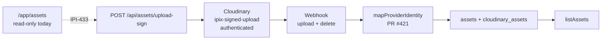
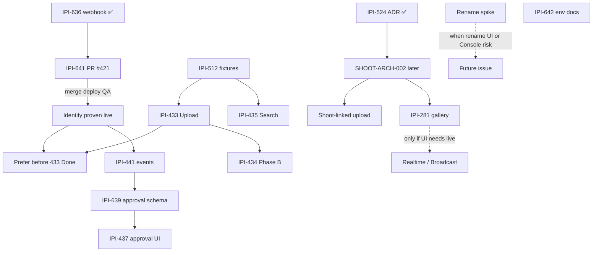
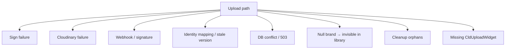

# Cloudinary Execution Plan

**Updated:** 2026-07-16 (aligned to deep audit + corrections)  
**Evidence:** [`cloudinary-supabase.md`](./cloudinary-supabase.md)  
**Linear view:** https://linear.app/amo100/view/cloudinary-808929b1a5da  
**IPI-641 tip:** `ai/ipi-641-cloudinary-asset-id` @ `cce6307c` · [PR #421](https://github.com/amo-tech-ai/lumina-studio/pull/421)  
**Cloud:** `dzqy2ixl0` · **Supabase:** `nvdlhrodvevgwdsneplk`

**Corrections vs raw audit §7–8:**  
• Rename webhook trigger = **recommended spike**, not automatic P0.  
• Realtime = **out of this plan** until a gallery UI needs it (poll for IPI-433).  
• Do **not** create CLD-BACKFILL / CLD-HOOK-RENAME until justified after IPI-641 Done + rename spike.

---

## Verdict (from audit, operationalized)

| Question | Plan answer |
| --- | --- |
| Complete Cloudinary + Supabase succeed? | **Partial** — ingest/identity after merge+QA; operator upload needs **IPI-433**; shoot ingest needs **SHOOT-ARCH-002** |
| PR #421 safe to merge? | **Yes, conditionally** — core CI green; Codacy ACTION_REQUIRED; AGENTS #1 mix = process debt (migration already remote) |
| Biggest gap now | **0 / 5** mirrors have `cloudinary_asset_id`; identity code not on prod until deploy |
| Overall readiness (audit) | **68 / 100** — ingest nearly ready; upload UI incomplete |

---

## Reverified live claims

| Claim | Probe | Result |
| --- | --- | --- |
| PR #421 | `gh` | ✅ OPEN, MERGEABLE · tip `cce6307c` |
| Provider identity | Supabase SQL | 🔴 **0 / 5** with `cloudinary_asset_id`; **1** ready null |
| Null brand assets | Supabase SQL | 🟡 **14 / 25** null `brand_id`; **2** with `cloudinary_public_id` |
| Preset `ipix-signed-upload` | Cloudinary MCP | ✅ signed, `type=authenticated`, overwrite false, eager 600/1200/1600 |
| Triggers | Cloudinary MCP | ✅ **upload** + **delete** → `https://www.ipix.co/api/assets/cloudinary/webhook` (`additive`, `legacy_hmac`) |
| Rename / eager triggers | Cloudinary MCP | ⚪ neither configured (docs support both) |
| Realtime publication | Supabase SQL | ✅ none for `assets` / `cloudinary_assets` / `shoots` / `brands` |
| Upload UI | repo | 🔴 zero `CldUploadWidget` |
| App rename path | repo | ⚪ no `uploader.rename` / rename UI |
| Migration | remote | ✅ `ipi641_cloudinary_asset_id` applied |
| IPI-641 / 433 / 435 | Linear | In Review · In Progress · In Progress |
| IPI-524 / 636 | Linear | ✅ Done (ADR Option B · real webhook proof) |
| Env docs | `.env.example` | 🟡 public cloud name only |

---

## Actual system path



**Authz SoT:** `assets.brand_id` (org membership). Shoot link optional (`assets.shoot_id → public.shoots`).  
**Dual RLS note:** brand-org policies **OR** legacy shoot-designer policies — document; retire after SHOOT-ARCH-002.  
**Ready:** `cloudinary_assets.status = ready` — never widget `onSuccess` alone.

---

## Workstream table

| Priority | Linear task | Verified problem | Exact next steps | Tests | Blocker? |
| --- | --- | --- | --- | --- | --- |
| **P0** | [IPI-641](https://linear.app/amo100/issue/IPI-641) | Identity in PR #421; prod all-null provider ids | Codacy → merge → deploy → 1 signed QA upload → assert `cloudinary_asset_id` + matching `version` → no duplicate row → cleanup → **decide** backfill for 1 ready null | webhook Vitest · `verify:cloudinary-pipeline` · post-deploy SQL | 🔴 Yes — for identity Done |
| **P0** | [IPI-433](https://linear.app/amo100/issue/IPI-433) | No upload UI | `CldUploadWidget` → existing sign route → Cloudinary → webhook → **poll Supabase** → ready. Brand-only. No custom uploader. No secret in browser. | Playwright happy/retry/cancel · a11y · brand ownership on sign | Soft prefer 641 deployed first |
| **P1** | [IPI-435](https://linear.app/amo100/issue/IPI-435) | No search/filters/URL state | Extend `listAssets`; RLS first; null-brand hidden + copy; stable sort/pagination; URL filters; **no Cloudinary Search v1**; [IPI-512](https://linear.app/amo100/issue/IPI-512) fixtures | Unit · EXPLAIN · authz E2E | 🟡 Thin data — fixtures OK |
| **P2** | [IPI-642](https://linear.app/amo100/issue/IPI-642) *(reuse)* | Server env undocumented | Document `CLOUDINARY_CLOUD_NAME`, `API_KEY`, `API_SECRET`, `NOTIFICATION_API_SECRET` | Doc review | No |
| **P2 eval** | *no issue yet* | Rename can desync `public_id` | Spike **A** app rename+DB write vs **B** Console `rename` trigger. Prefer A when we own UI. | Spike + one fixture | No — not merge blocker |
| **P2 eval** | *fold into 641 Done* | Legacy null identities | After forward proof: Admin backfill **or** forward-only with counts | SQL counts | Optional |
| **Later** | **SHOOT-ARCH-002** *(create when scheduled)* | Shoot folders → null brand; no `shoot_id` write | ADR follow-up: `public.shoots.brand_id` + ingest | Migration + RLS + ingest | Shoot path / [IPI-281](https://linear.app/amo100/issue/IPI-281) only |
| **Not now** | Realtime | Unpublished by design | Poll in 433; revisit with 281; Broadcast at scale | — | ❌ Do not create |

---

## Gates: merge vs identity Done vs product

| Gate | Must have | Nice / later |
| --- | --- | --- |
| **Merge #421** | Codacy resolved or approved; human ack AGENTS #1 (migration already applied) | — |
| **Identity Done (641)** | Deployed webhook · live upload · non-null `cloudinary_asset_id` · version match · cleanup · backfill decision recorded | Fashionos archive |
| **Product upload usable** | IPI-433 brand-only ready | 641 identity on those rows |
| **Shoot-linked upload** | SHOOT-ARCH-002 | Realtime only with IPI-281 |

---

## Immediate / Next / Later / Not required

```text
Immediate
  • IPI-641: Codacy → merge PR #421 → confirm prod deploy
  • One real signed QA upload (or verify:cloudinary-pipeline against prod)
  • Assert non-null cloudinary_asset_id + version · no duplicate · cleanup
  • Record backfill decision (skip / one-shot Admin / schedule counts)

Next
  • IPI-433 brand-only Upload Workspace (widget + poll)
  • IPI-435 search in parallel (Supabase-first listAssets)
  • IPI-642 env docs (or same PR hygiene)
  • Docs-only commit: IPI-524 ADR (local file → main; no new Linear)

Later
  • Rename spike → Linear issue only after path A/B chosen
  • Optional eager trigger if async completion UX needs it
  • SHOOT-ARCH-002 when shoot work is scheduled
  • Fashionos / orphan mirror cleanup
  • Retire dual shoot-designer RLS after shoot cutover
  • IPI-638 · IPI-637 · 641→441→639→437
  • IPI-281 (+ Realtime) with shoot gallery only

Not required now
  • Automatic rename-webhook Linear issue
  • Realtime issue for /app/assets
  • Cloudinary Search v1
  • Custom / unsigned uploader
  • Duplicate CLD-BACKFILL / CLD-HOOK-RENAME / CLD-ENV-DOC tickets
```

---

## Dependency diagram



IPI-435 is **not** hard-blocked by identity — it can start in parallel. IPI-433 can start UI work now; Done should prefer post-641 deploy so ready rows carry provider ids.

---

## Workstream details

### 1. Finish IPI-641

```text
Codacy → merge → deploy → QA upload → assert identity → cleanup → backfill decision
```

| Step | Pass |
| --- | --- |
| Merge | Codacy OK; note migration already on remote |
| Deploy | Prod webhook runs PR #421 `mapProviderIdentity` |
| QA | Cloudinary upload 200 + webhook 2xx |
| Identity | `cloudinary_asset_id IS NOT NULL` |
| Version | Matches notification / upload `version` |
| Rows | One mirror; no orphan duplicate |
| Cleanup | Fixture gone |
| Backfill | Written decision for remaining nulls (1 ready today) |

**Files (PR #421):**  
`webhook/route.ts` · `webhook/route.test.ts` · `verify-cloudinary-pipeline.mjs` · migration `20260716182711_ipi641_cloudinary_asset_id.sql` · `types/supabase.ts`

**Do not mark Done** on synthetic tests alone.

### 2. Start IPI-433 (brand-only)

```text
CldUploadWidget → /api/assets/upload-sign → Cloudinary → webhook → poll Supabase → ready
```

| Rule | Required |
| --- | --- |
| Widget | Official `next-cloudinary` only |
| Secret | Never in browser |
| Ready | Supabase confirm, not callback |
| Scope | `ipix/brands/{brandId}/…` until SHOOT-ARCH-002 |
| Recovery | Retry (new sig), cancel pre-ready, refresh rehydrate |
| a11y | Labels, keyboard, live status, errors |
| Live updates | **Poll** — no Realtime |

### 3. Start IPI-435

| Rule | Required |
| --- | --- |
| Entry | Extend `listAssets` — no second library |
| Authz | User client + RLS before filters |
| Null brand | Hidden (14 rows); empty-state copy |
| Sort/page | `created_at DESC, id DESC` + URL params |
| Search | Supabase only in v1 |
| Indexes | Reuse `assets_brand_id_idx`, tags GIN, etc. — EXPLAIN before new |
| Hygiene | Fix stale org-aware comment in `get-assets.ts` if touched |

### 4. Follow-ups — create Linear only when justified

| Candidate | Create now? | Gate |
| --- | --- | --- |
| Provider-id backfill script | **No** | Decide inside IPI-641; open only if ops grows past one Admin pass |
| Rename sync | **No** | Spike A vs B first (docs: rename changes `public_id`; account has no rename trigger; app has no rename UI) |
| Env docs | **No new issue** | IPI-642 |
| SHOOT-ARCH-002 | **Not yet** | When scheduling shoot ingest |
| Eager trigger | **No** | Only if UX waits on eager completion |
| Realtime for assets library | **No** | IPI-281 later; prefer Broadcast at scale |
| Fashionos cleanup | **No** | Fold into backfill / archive pass |

#### Rename (recommended, not mandatory)

1. **Path A (prefer when app owns rename):** server `uploader.rename` → update `assets` + `cloudinary_assets` in same request.  
2. **Path B (Console / Media Library):** add `event_type=rename` trigger; handle `notification_type=rename` (`from_public_id` / `to_public_id` / `asset_id`). PR #421 already recovers via `from_public_id` on upload-shaped events — extend only if spike shows a gap.

---

## Failure points to design against



---

## Completed foundations

| Task | Status |
| --- | --- |
| IPI-432 · E2E smoke | ✅ |
| IPI-276 · Org RLS | ✅ |
| IPI-431 · Upload-sign tests | ✅ |
| IPI-430 · Preset / metadata | ✅ |
| IPI-636 · Real webhook delivery | ✅ |
| IPI-524 · Shoot ADR Option B | ✅ (docs commit still needed) |
| IPI-514 / IPI-493 brand reconcile | ✅ (null-brand leftovers intentional for v1) |

---

## Active product sequence

```text
IPI-641 merge/deploy/QA
  → IPI-433 brand upload  ∥  IPI-435 search  ∥  IPI-642 env docs
  → rename spike only if rename UI or Console rename risk
  → SHOOT-ARCH-002 when shoot work scheduled
  → IPI-441 → IPI-639 → IPI-437
  → IPI-281 (+ Realtime) only with shoot gallery
```

---

## Efficiency rules

1. Dashboard / MCP before code  
2. Reuse Linear issues — **no duplicates**  
3. Official SDK / widget before custom upload  
4. Poll for upload ready; Realtime only with proven UI need  
5. Rename trigger = post-spike recommendation, not automatic P0  
6. Evidence in [`cloudinary-supabase.md`](./cloudinary-supabase.md) before changing this plan  

---

## Archive

| Doc | Role |
| --- | --- |
| [`cloudinary-supabase.md`](./cloudinary-supabase.md) | Deep audit evidence + scores |
| [`ipi-524-shoot-ownership-adr.md`](./ipi-524-shoot-ownership-adr.md) | Accepted Option B ADR |
| [`cloudinary-plan.md`](./cloudinary-plan.md) | Long-form media OS design |
| [`todo.md`](./todo.md) | Short checklist mirror |
