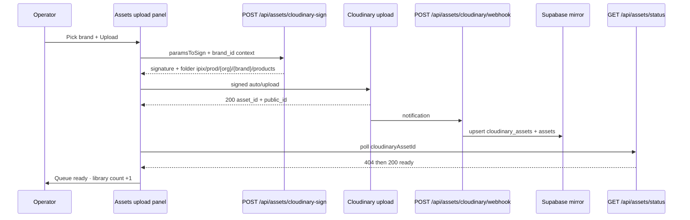
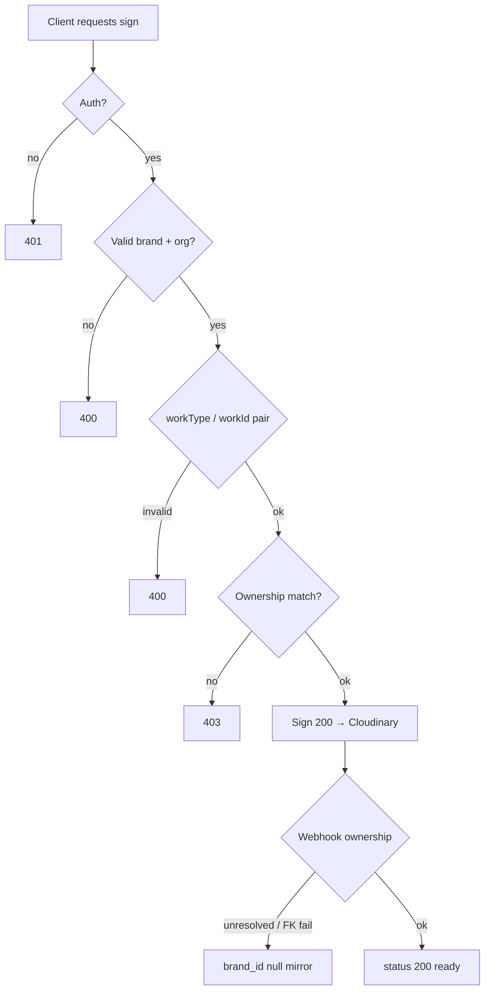

# IPI-60 · CLD-004B — Post-Merge Verification

**Date:** 2026-07-22  
**PR:** https://github.com/amo-tech-ai/lumina-studio/pull/543 (merged)  
**Follow-up Linear:** [**IPI-757 · CLD-004C — Post-merge DAM follow-ups**](https://linear.app/amo100/issue/IPI-757/ipi-60-cld-004c-post-merge-dam-follow-ups-placeholder-purge-ownership)

## Verdict

**PASS** (production verified with follow-up)

Real browser path succeeded end-to-end. Console `upload-sign` 400/403 lines were **intentional negative probes**, not widget failures.

## Environment

| Field | Value |
|---|---|
| Deployment URL | https://www.ipix.co |
| main SHA | `807eb8b9` |
| PR merge SHA | `807eb8b9c31912127b0c719034f9fde8463869ab` |
| Vercel Production | `ipix-operator-ncj1508v8-mdeai.vercel.app` (Ready, aliased to www.ipix.co) |
| DAM folder env observed | `prod` (via Vercel `VERCEL_ENV`; wrangler `DAM_ENV=prod` is for Workers) |
| Cloudinary cloud | `dzqy2ixl0` |
| Browser | Chrome DevTools MCP (Chrome 150, Linux) |
| QA brand | QA Test Brand — IPI-404 parity check (`db1f728d-bee1-430e-a3e7-0c601da74ce7`) |
| CI on merge | success |

## Results

| Test | Result | Evidence |
|---|---|---|
| Widget signing | PASS | `POST /api/assets/cloudinary-sign` → **200** (reqid 230) |
| Real Cloudinary upload | PASS | `POST …/dzqy2ixl0/auto/upload` → **200** (reqid 232) |
| Taxonomy folder | PASS | `ipix/prod/00000000-0000-0000-0000-000000000001/db1f728d-…/products` |
| Context ownership | PASS | `env=prod\|org_id=0000…0001\|brand_id=db1f728d-…\|work_type=products` |
| Webhook persistence | PASS | status **404 → 200**; library **11 → 12** assets |
| Supabase mirror | PASS | `cloudinary_assets` + `assets` rows with matching `brand_id` (then deleted) |
| Cross-brand rejection | PASS | foreign shoot/campaign `workId` → **403** (intentional probes) |
| WorkType/workId validation | PASS | missing/forbidden pairs → **400** (intentional probes) |
| Org injection | PASS | attacker `org_id` stripped; server folder kept `0000…0001` |
| Cancellation cleanup | PASS | close widget without file → no stuck “uploading” row |
| Dry-run audit | PASS | 1 compliant · 271 legacy · **0 malformed** |
| Cleanup | PARTIAL | Supabase rows deleted; Cloudinary left `placeholder:true`/`bytes:0` ghost |

## Happy-path evidence (widget — not upload-sign)



```text
POST /api/assets/cloudinary-sign          200
POST api.cloudinary.com/.../auto/upload  200
GET  /api/assets/status?…                 404 then 200
UI   "ipi-60-cld-004b-postmerge-…" → ready · 12 assets
```

- **public_id:** `ipix/prod/00000000-0000-0000-0000-000000000001/db1f728d-bee1-430e-a3e7-0c601da74ce7/products/ipi-60-cld-004b-postmerge-1784688471_jc04eg`
- **cloudinary asset_id:** `7de8b6abf4c51097ea25fbc2330a6c7c`
- **delivery type:** `authenticated`

## Failure points (code + live)



| # | Failure | Effect | Severity |
|---|---|---|---|
| 1 | Pair / brand / org validation on sign routes | **400** | Expected guard |
| 2 | Shoot/campaign not owned by brand | **403** | Expected guard (#543) |
| 3 | Webhook no ownership / FK retry | `cloudinary_assets.brand_id` **null** | 🟡 hygiene |
| 4 | Status before webhook / after cleanup | **404** | Expected |
| 5 | Cloudinary destroy leaves placeholder | Ghost listing | 🟡 IPI-757 A1 |
| 6 | Duplicate ownership queries on `upload-sign` | Extra DB round-trip | 🟡 IPI-757 B1 |

## Live Supabase (`nvdlhrodvevgwdsneplk` · 2026-07-22)

| Check | Result |
|---|---|
| Project | ACTIVE_HEALTHY |
| `brands.org_id` null | **0** |
| QA brand + org | present |
| CLD-004B fixture rows | **0** (cleaned) |
| Orphan brand FK on `cloudinary_assets` | **0** |
| `cloudinary_assets` | **9** total · **2** with brand · **7** null brand |
| `anon_select_cloudinary_assets` | `USING false` (deny — not a leak) |

Null-brand inventory: 4× legacy `fashionos/assets/*` (`processing`), 2× fake `11111111-…` proof folders, 1× archived `ipi-60-realworld-fixture-…` under taxonomy `qa-fixtures`. Tracked as **IPI-757 C2**.

## Console 400/403 — not a regression

Assets UI signs via **`/api/assets/cloudinary-sign`**. After the happy path, verification intentionally called **`/api/assets/upload-sign`** with bad pairs. Chrome logs those as failed resources.

| Status | Request body (relevant) | Response |
|---|---|---|
| 400 | `workType: "shoots"` (no workId) | `workId is required for workType "shoots"` |
| 400 | `workType: "campaigns"` (no workId) | `workId is required for workType "campaigns"` |
| 403 | `workType: "shoots", workId: aaaaaaaa-…` | `Shoot does not belong to the requested brand` |
| 403 | `workType: "campaigns", workId: bbbbbbbb-…` | `Campaign does not belong to the requested brand` |

Initial `/api/assets/status` **404** during the happy path was webhook lag (~seconds), then **200**. Later 404 after cleanup is expected (mirror deleted).

Preload CSS warnings and `ipi641-audit…` 404 are unrelated noise.

## Focused unit tests (post-merge main)

```text
6 files · 171 passed
taxonomy · sign-upload · upload-sign · cloudinary-sign · webhook · dry-run-parity
```

## Failures / residuals

1. **Cloudinary Admin delete leaves zero-byte placeholder**  
   - Step: `uploader.destroy` / `delete_resources` / `delete_resources_by_asset_ids` all return `deleted`/`ok`  
   - Actual: resource still listed with `placeholder: true`, `bytes: 0`  
   - Severity: Low (not serving pixels; Supabase mirror removed)  
   - Fix: Console/Media purge → **CLD-004C A1**

2. **Duplicate ownership queries on upload-sign** (pre-existing design) → **CLD-004C B1**

## Final recommendation

**Production verified with follow-up** — ship stands; track placeholder purge + optional dedupe/E2E under CLD-004C.
