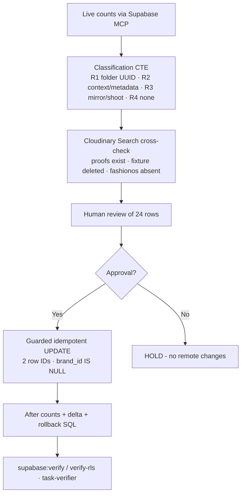

# IPI-767 · CLD-DATA-HYGIENE-001 — Dry-run report (2026-08-05)

**Status: APPLIED 2026-08-05 (human approval recorded on IPI-767; migration pushed via `supabase db push --linked`; after-counts verified live)

Branch: `ipi/767-assets-brand-hygiene` · Project: `nvdlhrodvevgwdsneplk` (remote-only, verified via Supabase MCP)

## 1. Fresh live counts (2026-08-05 · Supabase MCP)

| Check | 2026-07-22 (issue) | 2026-08-05 (live) | Delta |
| -- | -- | -- | -- |
| `cloudinary_assets` total | 8 | **8** | 0 |
| `cloudinary_assets.brand_id` null | 7 | **7** | 0 |
| `cloudinary_assets.brand_id` set | 1 | **1** | 0 |
| `assets` total | 32 | **36** | +4 |
| `assets.brand_id` null | 17 | **17** | 0 |
| `assets.brand_id` set | 15 | **19** | +4 |
| `brands.org_id` null | 0 | **0** | 0 |

## 2. Deterministic rules used (only)

| Rule | Evidence | Applies to |
| -- | -- | -- |
| **R1** | Exact valid brand UUID in Cloudinary folder path (joined against `brands.id`) | reconcile candidates |
| **R2** | Exact valid brand UUID in context / structured metadata (Cloudinary Search + `metadata` jsonb probed) | 0 matches |
| **R3** | Unique mirror relationship (`cloudinary_assets.asset_id → assets.id`) carries folder evidence; shoot-linked rows → leave (legacy `shoots` has no `brand_id`, per IPI-513/IPI-524) | fixture + legacy seeds |
| **R4** | No valid evidence / fake UUID / demo seeds → leave or delete-needs-signoff (no weak heuristics, no mass assignment) | proofs, demo seeds |

Cross-check source order used: Supabase MCP → Cloudinary Search MCP (`public_id` prefix queries) → context/metadata probes. Cloudinary CLI/CSV export not needed (only 3 distinct evidence classes; MCP returned complete results).

## 3. Classification table (24 null rows)

### reconcile (2) — proposed updates in `20260805000000_assets_brand_hygiene.sql`

| Row ID | Table | Current brand | Proposed brand | Evidence | Reason |
| -- | -- | -- | -- | -- | -- |
| `2531dbdd-407d-4189-96ad-d9d8275cedc8` | assets | null | `db1f728d-bee1-430e-a3e7-0c601da74ce7` (QA brand) | mirror folder `ipix/dev/0000…0001/db1f728d-…/qa-fixtures` | R1 + R3: exact valid brand UUID in folder path of its mirror |
| `8b13a8d6-9f51-42be-8295-6c987b4635a5` | cloudinary_assets | null | `db1f728d-bee1-430e-a3e7-0c601da74ce7` (QA brand) | folder `ipix/dev/0000…0001/db1f728d-…/qa-fixtures` | R1: exact valid brand UUID in folder path |

Notes: `db1f728d-…` verified present in `public.brands` (2026-08-05). Asset `ipi-60-realworld-fixture-20260720T164824Z` is **archived** in DB and **deleted in Cloudinary** (Search MCP `public_id:ipi-60-realworld-fixture*` → 0). Backfill is deterministic, harmless (archived row), and makes the fixture's ownership auditable.

### delete-needs-signoff (4) — no action taken; product sign-off required

| Row ID | Table | Evidence | Reason |
| -- | -- | -- | -- |
| `bece4e2d-a010-4563-af73-e0d2bc83c835` | assets | `ipix/brands/11111111-…/products/ipi433-widget-sign-proof_zw8yg6` | IPI-433 widget-sign proof; brand `11111111-…` does not exist → FK would fail |
| `071da378-18dd-4743-929f-4d6355739c09` | assets | `ipix/brands/11111111-…/products/ipi433-widget-sign-proof2_bc7ql6` | same |
| `c4ca2263-5cab-4c36-ab24-a4c28092ca67` | cloudinary_assets | `ipix/brands/11111111-…/products` | same (mirror) |
| `a599cf58-41c2-4a63-89cb-5a711330541d` | cloudinary_assets | `ipix/brands/11111111-…/products` | same (mirror) |

Cloudinary cross-check: both proofs exist (`context.brand_id: 11111111-…`, 70 bytes, 1×1 px, type `authenticated`). No brand matches → cannot reconcile. Recommend delete of proofs + mirrors after sign-off (IPI-757 C2 carries the same decision).

### leave (18) — no change

| Class | n | Reason |
| -- | -- | -- |
| `fashionos/assets/*` mirrors | 4 | Pre-iPix legacy, stuck `processing`; not present in this Cloudinary account (Search MCP → 0) |
| shoot-linked legacy seeds (`storage.example.com`, `storage.googleapis.com`) | 6 | R3: `shoot_id` set, legacy `shoots` has no brand_id → IPI-524 |
| Cloudinary demo seeds (`res.cloudinary.com/demo/*/sample.jpg`) | 8 | R4: no ownership evidence; not this account's assets |
| — | — | 18 total |

## 4. Updates (applied 2026-08-05 after human approval)

Idempotent guarded migration `supabase/migrations/20260805000000_assets_brand_hygiene.sql` (APPLIED — recorded in `supabase_migrations`):

- `UPDATE assets SET brand_id = 'db1f728d-…' WHERE id = '2531dbdd-…' AND brand_id IS NULL`
- `UPDATE cloudinary_assets SET brand_id = 'db1f728d-…' WHERE id = '8b13a8d6-…' AND brand_id IS NULL`
- Guard contract: only approved row IDs · `brand_id IS NULL` predicate (never overwrites) · no DELETE · idempotent (re-run = 0 rows).

Expected after counts: `cloudinary_assets` 7 null → **6 null** · `assets` 17 null → **16 null**. Row delta: +1 each table.

**Actual after-counts (live query, Supabase MCP, 2026-08-05): `cloudinary_assets` null 6 ✅ · `assets` null 16 ✅ · `cloudinary_assets` set 2 ✅ · `assets` set 20 ✅ — both target rows now carry `db1f728d-bee1-430e-a3e7-0c601da74ce7` ✅.**

## 5. Rollback SQL (documented, not run)

```sql
update public.assets set brand_id = null where id = '2531dbdd-407d-4189-96ad-d9d8275cedc8' and brand_id = 'db1f728d-bee1-430e-a3e7-0c601da74ce7';
update public.cloudinary_assets set brand_id = null where id = '8b13a8d6-9f51-42be-8295-6c987b4635a5' and brand_id = 'db1f728d-bee1-430e-a3e7-0c601da74ce7';
```

## 6. RLS results

`pg_policies` (Supabase MCP, 2026-08-05):

- `assets`: `anon_select_assets` → `USING false` (denied) · `assets_select`/`assets_update` → brand-org (`is_org_member`) OR shoot designer · `assets_insert` open (service-role path)
- `cloudinary_assets`: `anon_select_cloudinary_assets` → `USING false` (denied) · `ca_select/update/delete_via_brand` → join `assets → brands` with org checks

**No RLS change required** — policies evaluate `brand_id` at query time; backfilling the 2 approved rows only makes them visible to the correct org. `npm run supabase:verify-rls` could not run locally: `.env.local` fails Supabase CLI parsing (pre-existing `LegacyDbConfigLoadError`, unrelated to this task) and `infisical` CLI is not initialized in this environment — remote-state verification performed via MCP (equivalents listed above).

## 7. Constraint decision (AC6)

**NOT NULL deferred.** After apply, 6 `cloudinary_assets` + 16 `assets` legitimate null rows remain (legacy FashionOS, shoot-linked per IPI-524, demo seeds). No constraint change in this issue.

## 8. Files changed (branch `ipi/767-assets-brand-hygiene`)

- `supabase/migrations/20260805000000_assets_brand_hygiene.sql` — guarded migration, **APPLIED 2026-08-05**
- `tasks/cloudinary/tests/ipi-767-classification.sql` — read-only classification CTE (rerunnable)
- `tasks/cloudinary/tests/ipi-767-brand-hygiene-dry-run-report.md` — this report

Untouched: UI, upload-sign, Cloudinary signing, Playwright, e2e (per IPI-767 non-goals).

## 9. Next step

✅ Completed: human approval (2026-08-05) → migration applied (`supabase db push --linked`) → after counts recorded above (match prediction exactly) → CLI verification passed (`migration list --linked` in sync, `db push --dry-run` showed exactly 1 migration). Pending: PR review + merge, then `In Progress → Done` on Linear.

## Appendix — workflow


