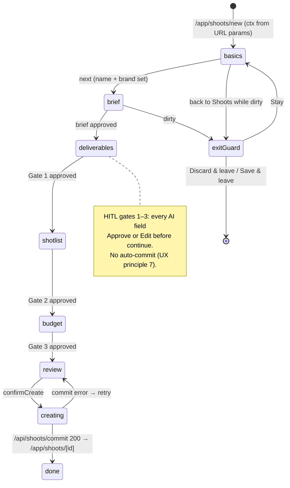
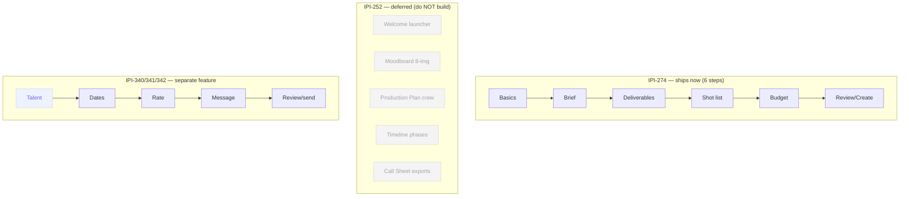
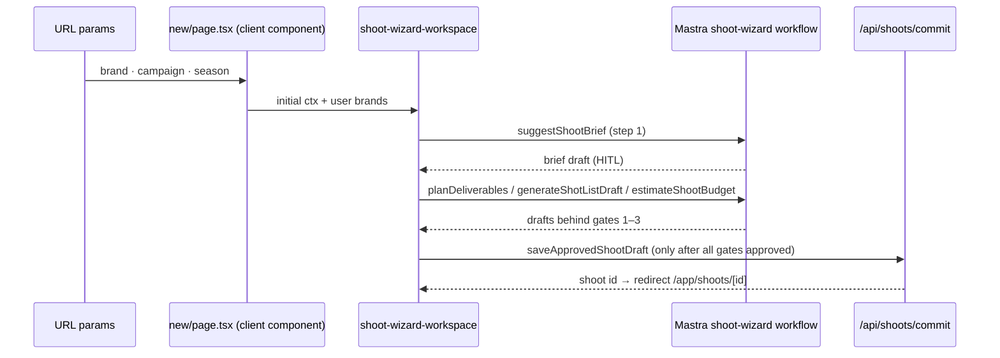

# Shoot Wizard — wireframe + conversion map

> **Scope contract (read first, obey literally):**
> **IPI-274 is a visual reskin of the existing 6-step shoot wizard only.** Preserve all existing
> behavior. Do **not** add new steps, backend logic, AI tools, API routes, schema/migrations, or the
> booking flow. "Done" means visual parity with the DC chrome — **not** feature expansion.
>
> The DC HTML shows a **10-step** shoot flow **plus** a **5-step booking** flow (toggled by the
> `flow` prop). Production ships **6 steps** now (IPI-274). The 4 extra DC steps and the booking flow
> are **deferred / separate issues** — see §0 scope lock. Do not build what this doc marks ➖ deferred.
> Building the whole DC is the single biggest way to repeat the IPI-383 mistakes: over-scope, then
> mismatch. Every AI-row / gate / commit detail below is documented as **existing behavior to
> preserve**, not new work — see §0.3.

**DC:** [`Shoot Wizard.v2.image-first.dc.html`](../../../Universal%20design%20prompt/Shoot%20Wizard.v2.image-first.dc.html) · serve on `:8765`
**React:** `/app/shoots/new` · `:3002`
**Template:** [`dc-to-react-plan-template.md`](../../dc-to-react-plan-template.md)
**Decision of record:** [`IPI-252-wizard-step-decision.md`](../IPI-252-wizard-step-decision.md)
**Mistakes source:** [`../../audit/checklist.md`](../../audit/checklist.md) — §0.1 below folds each one into a guardrail

---

## 0. Prove + scope lock (do before any worktree)

### 0.1 Mistakes carried forward (from IPI-383 audit/checklist.md — do not repeat)

| # | Past mistake | Guardrail for this build |
|---|--------------|--------------------------|
| 1 | Edited/wrote a file before `Read`-ing its exact path | `Read` every file before Edit/Write. Never assume a path — `graphify query` then Read. |
| 2 | Ran `tsc`/tests before `npm ci` in a fresh worktree | First command in the worktree is `npm ci` (or `npm install`). Baseline-green before writing code. |
| 3 | Selection test asserted on a node the workspace **publishes** to the panel, not one it renders → needed `DetailSink` | Any test for panel/dock preview must render the provider + a sink that renders `detail` (copy `shoots-list-workspace.test.tsx`). |
| 4 | Test mocked only the component's own CSS module, not the shared base module | Mock **every** CSS module the tree imports (`*.module.css` + shared `shoots-list-intel.module.css` etc.) with the Proxy stub. |
| 5 | Bash cwd silently resets to `/home/sk/ipix` between calls | Use absolute paths or `cd <worktree> && …` in one command. Never assume cwd persisted. |
| 6 | Stale worktree regression — local branch was behind remote; a commit would have reverted a shipped feature | Before editing: `git fetch && git status` vs `origin/<branch>`; check open PRs (`gh pr list`). Rebase/reset to remote first. |
| 7 | Crammed everything into `aria-label`, overriding visible detail (reviewer pushback) | Concise `aria-label` for the accessible **name** + `aria-describedby` → `className="sr-only"` summary for detail. Never one giant label. |
| 8 | Brittle exact-string name assertions broke on copy tweaks | Assert accessible names by prefix regex (`/^Select …/`), not `===`. |
| 9 | `<Link>` to the current route as a "retry" — a no-op that never re-fetches | Retry re-runs the server fetch: `"use client"` + `useRouter().refresh()`. Mock `next/navigation` in tests. |
| 10 | Read exit code `0` from a piped test run that had actually failed | Read the actual test output, not just the tail/exit-code notification. |

### 0.2 Scope lock (IPI-252 decision of record)

| Track | Steps | Owner | Ship |
|-------|------:|-------|------|
| **Production wizard chrome** | **6** | IPI-274 | **This work** — chrome + tokens + dock context only |
| DC extra shoot steps (Moodboard, Production Plan, Timeline, Call Sheet) | +4 | IPI-252 | Deferred — optional expansion PR |
| Booking flow (`flow=booking`, 5 steps) | 5 | IPI-340/341/342 | Separate booking-request feature — **out of scope here** |

**6 steps that ship (map to Mastra workflow `shoot-wizard.ts`):**

| # | Step | HITL gate | Mastra tool | DC step it renders |
|---|------|-----------|-------------|--------------------|
| 0 | Basics | — | brand + channels | STEP 2 Basics |
| 1 | Brief | — | `suggestShootBrief` | STEP 3 Creative Brief |
| 2 | Deliverables | Gate 1 | `planDeliverables` | (DC folds into brief/plan) |
| 3 | Shot list | Gate 2 | `generateShotListDraft` | STEP 5 Shot List |
| 4 | Budget | Gate 3 | `estimateShootBudget` | STEP 7 Budget |
| 5 | Review / create | commit | `saveApprovedShootDraft` → `/api/shoots/commit` | STEP 10 Review & Create |

**➖ Deferred DC steps (build only under IPI-252, not now):** STEP 1 Welcome (3-card launcher),
STEP 4 Moodboard (8-image lock/regen grid), STEP 6 Production Plan (crew/resources),
STEP 8 Timeline (phase dependencies), STEP 9 Call Sheet (arrival times + exports).

### 0.3 Existing behavior (preserve) vs new work (this PR)

The wizard **already works end-to-end**. Everything in the left column is done — this PR only restyles.

| Existing — **preserve, do not touch logic** | New in IPI-274 — visual only |
|----------------------------------------------|------------------------------|
| 6-step state machine (`step 0…5`) in `new/page.tsx` | DC chrome: workspace shell + stepper rail |
| Mastra workflow `mastra/workflows/shoot-wizard.ts` | Tokenized CSS module (replaces inline styles) |
| 3 HITL gates + approval cards (`hitl/*ApprovalCard.tsx`) | AI-row / gate visual parity (behavior unchanged) |
| `suggestShootBrief` + `/api/shoots/suggest-brief` | Responsive layout (rail → top stepper) |
| Commit → `/api/shoots/commit` → `/app/shoots/[shootId]` | Modals restyle (edit/confirm/exit) — reuse dialog primitive |
| `shoot-wizard-context.tsx` | — |
| OperatorPanel shell / nav / intel / dock | — |

**No backend changes.** No migrations, no new tables (do **not** assume `shoot_intake_drafts` or any
new draft table), no new API routes, no new Mastra steps/tools, no schema/type regen. The UI must use
only the state and endpoints already present in `/app/shoots/new`.

### 0.3a File inventory (verified 2026-07-05 — the contract)

**May edit (chrome only):**

| Path | Today | This PR |
|------|-------|---------|
| `app/src/app/(operator)/app/shoots/new/page.tsx` | 824-line `"use client"` monolith, inline styles, steps 0–5 | Restyle to DC; extract inline styles → CSS module; keep all handlers/state |
| `app/src/components/shoot/shoot-wizard.module.css` | ❌ does not exist | **Create** — DC layout + stepper + AI-row tokens |
| `app/src/components/shoot/hitl/DeliverableApprovalCard.tsx` | ✅ works | Restyle only — no prop/logic change |
| `app/src/components/shoot/hitl/ShotListApprovalCard.tsx` | ✅ works | Restyle only |
| `app/src/components/shoot/hitl/BudgetApprovalCard.tsx` | ✅ works | Restyle only |

**Must NOT edit:**

`app/src/mastra/workflows/shoot-wizard.ts` · `app/src/app/api/shoots/commit/route.ts` ·
`app/src/app/api/shoots/suggest-brief/route.ts` · `app/src/app/api/shoots/[shootId]/route.ts` ·
`app/src/components/shoot/shoot-wizard-context.tsx` (unless a pure className swap) · any
`(operator)/layout.tsx` / shell / nav / intel / dock file · any `supabase/migrations/*` · `app/src/types/supabase.ts`.

> **Note:** current `new/page.tsx` is a client component (`"use client"` + `createBrowserClient`),
> **not** the RSC pattern. That is intentional for an interactive wizard — do **not** "fix" it into an
> RSC + `loading.tsx` refactor. Reskin in place; architecture change is out of scope.

### 0.3b Acceptance criteria (this PR is done when)

```text
□ Wizard still has exactly 6 steps (0 Basics … 5 Review) — none added/removed
□ All 3 HITL gates still block "continue" until every AI field is approved/edited
□ Brief autogen, deliverables, shot list, budget, commit → /app/shoots/[id] all still work
□ Operator shell / nav / intel / dock untouched
□ No hardcoded DC demo data (no "Nike", no STATE/flow switcher)
□ No backend/schema/route/workflow change in the diff
□ Visual parity vs DC at 1440 · 1024 · 390 (screenshots attached)
□ lint · test · tsc · build green
```

### 0.4 Data-source table (per shipped step)

| Block | Data source | Empty | Error | Image slot |
|-------|-------------|-------|-------|-----------|
| Basics: brand/campaign/season | URL params `?brand=&campaign=&season=` → else user's brands query | prompt to pick brand | inline field error | none |
| Basics: "Suggested plan" rows | `suggestShootBrief` draft | hide card until generated | AI error banner + retry | none |
| Brief rows | `suggestShootBrief` (AI draft, HITL) | "Generate brief" CTA | AI error + retry | before/after: **decorative** direction thumbs |
| Deliverables rows (Gate 1) | `planDeliverables` (HITL) | "Plan deliverables" CTA | AI error + retry | none |
| Shot list | `generateShotListDraft` (HITL) | "Generate shots" CTA | AI error + retry | per-shot thumb: **decorative** until asset exists |
| Budget bars | `estimateShootBudget` (HITL) | hide until generated | AI error + retry | none |
| Review summary | assembled draft state | n/a (always after prior steps) | commit error + retry | none |

### 0.5 Negative rules

- No fake AI output — every AI field is a **draft behind a HITL gate**, never auto-committed (UX principle 7).
- No demo `STATE`/`flow` switcher in production. The DC `flow` prop and `sendResult` enum are prototype-only.
- Do not read `ctx` from anything but real URL params + the user's session; no hardcoded "Nike".
- Do not rebuild NavSidebar / IntelligencePanel / OperatorChatDock — the DC bottom "Production Planner" dock maps to the **existing** dock.
- Image slots in brief/shot list are decorative direction thumbs until a real asset is linked — never present a fallback image as an uploaded asset.
- No `min-h-screen` / legacy hex inside the workspace.

---

## 1. Wireframe (center workspace column only)

```text
┌─ OperatorPanel.main ─────────────────────────────────────────────────────┐
│ ┌─ shoot-wizard workspace (.wz-content) max-width 1000px, centered ─────┐ │
│ │ ┌─ sidebar rail 266px ─┬─ step panel 1fr ──────────────────────────┐ │ │
│ │ │ Stepper (6 dots)     │  H2 step title + subtitle                 │ │ │
│ │ │  ● Basics            │  ┌ ctxLocked carry-over banner (step 0) ┐ │ │ │
│ │ │  ● Brief             │  │ brand · campaign · season (unlockCtx)│ │ │ │
│ │ │  ○ Deliverables ⛨G1  │  └───────────────────────────────────────┘ │ │ │
│ │ │  ○ Shot list  ⛨G2    │  step body (form / AI draft rows / grid)  │ │ │
│ │ │  ○ Budget     ⛨G3    │  ┌ AI field row: value + chip + Approve/ │ │ │
│ │ │  ○ Review            │  │  Edit/Why (confidence on Why)         │ │ │
│ │ │                      │  └───────────────────────────────────────┘ │ │ │
│ │ │                      │  [Back]      [Approve & continue / Create] │ │ │
│ │ └──────────────────────┴───────────────────────────────────────────┘ │ │
│ └───────────────────────────────────────────────────────────────────────┘ │
│ ┌─ OperatorChatDock — "Production Planner" (shell, do NOT rebuild) ──────┐ │
│ │ greeting / streaming lines · quick-action chips · input               │ │
│ └───────────────────────────────────────────────────────────────────────┘ │
└───────────────────────────────────────────────────────────────────────────┘
```

Modals (portal, shared): Edit brief · Edit shot · Confirm create · Exit-with-unsaved. Toast (`role=status aria-live=polite`) bottom-center.

### 1a. Step flow (shipped 6-step machine)



### 1b. Scope vs deferred (do not build the greyed nodes)



### 1c. Zone spec (from DC inspect — fill exact px during Phase 2)

| Zone | DC selector / value | CSS module target |
|------|---------------------|-------------------|
| Workspace | `.wz-content` max-width 1000px · pad `30px 28px 36px` · `margin:0 auto` | `.wizard` / `.wizardInner` |
| Sidebar rail | grid `266px 1fr` | `.wizardGrid` |
| Stepper item | dot + label, active/done/todo states | `.stepItem*` |
| Step header | H2 `--fs-xl`/600 + `--fs-sm` secondary subtitle | `.stepTitle`, `.stepSubtitle` |
| Carry-over banner | `ctxLocked` box, brand/campaign/season, unlock link | `.ctxBanner` |
| AI field row | value + confidence chip + Approve/Edit/Why | `.aiRow`, `.aiChip`, `.aiActions` |
| Why panel | confidence % + evidence, `--color-bg-subtle` | `.whyPanel` |
| Footer actions | Create (46px) · Save draft · Back | `.wizardFooter` |
| Chat dock | shell — reuse, do not restyle | (OperatorChatDock) |

### 1d. Responsive (locked behavior)

DC preview is 1440×900, workspace fixed 1000px. Lock the collapse so mobile isn't guessed:

| Width | Layout |
|-------|--------|
| ≥1025 desktop | Left rail `266px` + step panel `1fr` (DC exact) |
| 1024 tablet | Compact left rail (icons + short labels) + panel |
| ≤720 mobile | **Stepper becomes a horizontal top rail; single-column step form below.** No left rail, no right-side custom panel inside the wizard. |

The horizontal-top-stepper collapse is **not literally in the DC** (DC is desktop-only at 1440) →
mark it "needs design approval", not "error". Never stack the operator nav above the wizard content.

---

## 2. §5 Reuse audit (before creating anything)

- [ ] Existing wizard step component + stepper under `components/shoot/` (reskin, don't recreate)
- [ ] `mastra/workflows/shoot-wizard.ts` — reuse all 6 steps + 3 gates, add nothing
- [ ] HITL approval card pattern — reuse intelligence-panel approval components
- [ ] AI "Why / confidence" row — check `intelligence-panel` for an existing explainable-recommendation row before building
- [ ] `OperatorChatDock` — the DC "Production Planner" dock is this, already built
- [ ] Edit modal — check for an existing dialog primitive (base-ui) before hand-rolling
- [ ] Toast — existing app toast, not a new one
- [ ] `sr-only` utility (Tailwind built-in) for a11y summaries
- [ ] Status/confidence color tokens in `tokens.css`

Log findings even when "nothing exists." ≥80% match → extend, don't duplicate.

### 2a. Token audit (fill from DC `:root`)

| DC value | Token |
|----------|-------|
| `--fs-xl` step title | `--font-size-xl` |
| `--fs-sm` subtitle/body | `--font-size-sm` |
| `--color-action` `#111` | `--color-action` |
| `--radius-md`, `--card-radius` | same |
| confidence colors (`f.confColor`) | map to `--color-approved/warn/*` |

---

## 3. Component map

Reality: steps 0–5 today live **inline** in the one `new/page.tsx`. Reskin them there; only extract a
component when a chunk is reused or the file gets unwieldy. **Reuse rule:** search first
(`grep`/`graphify`); if nothing exists, create the **smallest local component** and record why in the PR.

| DC region | Where it is today | Action | Notes |
|-----------|-------------------|--------|-------|
| `.wz-content` shell + grid | `new/page.tsx` root | Reskin in place + new `shoot-wizard.module.css` | keep step/draft state as-is |
| Stepper rail | inline in `new/page.tsx` | Reskin; extract `WizardStepper` **only if** reused | 6 items, gate icons |
| Step header + `ctxLocked` banner | inline | Reskin | reads existing URL-param ctx; no new component unless it grows |
| AI field row (Approve/Edit/Why) | `hitl/*ApprovalCard.tsx` | **Reuse — restyle only** | search these first; do not build a new `AiDraftRow` |
| Steps 0–5 bodies | inline `step === n` blocks | Reskin in place | wired to existing handlers/tools |
| Edit / confirm / exit modals | check `components/**` for base-ui dialog | Reuse dialog primitive; if none, smallest local modal + record why | `dirty` guard already in state |
| Toast | check for existing app toast | Reuse; if none, smallest local toast + record why | |
| Bottom "Production Planner" dock | `OperatorChatDock` | **Reuse — never rebuild** | |
| STEP 1 Welcome, 4 Moodboard, 6 Plan, 8 Timeline, 9 Call Sheet | — | **Defer (IPI-252)** | do not build |
| Booking flow B1–B5 | — | **Separate (IPI-340/341/342)** | do not build |

Never rebuild `OperatorShell`, `NavSidebar`, `IntelligencePanel`, `OperatorChatDock`.

### 3a. Data flow



---

## 4. States checklist (every step)

- [ ] populated (AI draft present)
- [ ] pre-generation (CTA to generate — real empty, not fake values)
- [ ] loading / streaming (dock stream lines; per-step skeleton)
- [ ] AI error + retry (retry re-calls the tool — no silent no-op)
- [ ] gate-incomplete (cannot continue until every AI field approved/edited — DC `bkNotAllReviewed` pattern)
- [ ] commit error + retry (review step; `onRetrySend` equivalent)
- [ ] dirty-exit guard (leave with unsaved → modal)

### 4a. Behavior regression checklist (a reskin must not break these)

Manually re-run after styling — same account, real flow, not fixtures:

- [ ] Back moves to the previous step; Continue advances
- [ ] Each of the 3 gates blocks Continue until every AI field is approved/edited
- [ ] Edit a draft field → save persists; Approve marks it reviewed
- [ ] Brief autogen still fires on entering step 1 with channels set
- [ ] Commit creates the shoot and redirects to `/app/shoots/[id]`
- [ ] Dirty-exit warning appears when leaving with unsaved changes
- [ ] No console errors; network calls hit the **existing** endpoints only

---

## 5. Accessibility checklist

- [ ] Stepper: current step `aria-current="step"`; completed vs todo conveyed non-visually
- [ ] AI row buttons: concise `aria-label` (e.g. `Approve rate`) + `aria-describedby` → `sr-only` value/confidence (mistake #7)
- [ ] "Why" disclosure: proper expanded/collapsed semantics, confidence read out
- [ ] Modals: focus trap, `Esc` closes, focus returns to trigger, labelled dialog
- [ ] Toast: `role="status" aria-live="polite"` (already in DC)
- [ ] Keyboard: Back/Continue reachable; visible focus ring (no bare `outline:none`)
- [ ] Assert names by prefix regex in tests (mistake #8)

---

## 6. Commit order (one concern per commit)

| # | Commit | Files | Verify |
|---|--------|-------|--------|
| 1 | Workspace shell + stepper CSS (6 steps, no data) | `shoot-wizard-workspace.tsx`, `*.module.css` | static vs DC `:8765` @1440 |
| 2 | AI approval-card restyle + Why panel | reuse `hitl/{Deliverable,ShotList,Budget}ApprovalCard.tsx` | side-by-side row parity |
| 3 | Per-step bodies wired to existing Mastra tools | step components | each gate blocks continue |
| 4 | Modals (edit/confirm/exit) + dirty guard | reuse dialog | manual toggle |
| 5 | States (pre-gen, error+retry, commit error) | workspace | toggle each |
| 6 | Tests + parity report | `*.test.tsx`, QA doc | lint · test · tsc · build green |

Each commit is code-only. The plan doc + any Linear notes are **separate docs-only commits** (CLAUDE.md hard rule).

---

## 7. Verification gate

```bash
cd app && npm ci        # fresh worktree first (mistake #2)
npm run lint
npm test                # read actual output, not just exit code (mistake #10)
npx tsc --noEmit
CI=true npm run build
```

Browser parity: DC `:8765` (serve `Universal design prompt/`) vs app `:3002` as `qa@ipix.test`, at 1440 + 1024 + 390. Drive each state via props/tests, screenshot → `docs/qa/screenshots/2026-07-05/shoot-wizard/`.

Before editing anything (mistake #6):
```bash
cd <worktree> && git fetch && git status   # vs origin/<branch>
gh pr list --head <branch>                  # no stale/superseding PR
```

---

## 8. Out of scope (explicit)

- DC STEP 1/4/6/8/9 (Welcome, Moodboard, Production Plan, Timeline, Call Sheet) → **IPI-252**
- Booking flow (`flow=booking`, B1–B5) → **IPI-340/341/342** booking-request feature
- Any new Mastra step or gate — reuse the 6-step workflow as-is
- Shell / nav / intel panel / chat dock restyle
- Seeding, migrations, RLS — none required (wizard reads existing brand + writes via existing commit endpoint)

---

## 9. Parity report (fill at sign-off — score by category, not one number)

| Category | Score | Notes |
|----------|------:|-------|
| Layout | | |
| Components | | |
| Typography | | |
| States | | |
| Responsive | | |
| Accessibility | | |
| Performance | | |
| **Overall** | | |

Fill [`report-template.md`](../../../../.claude/skills/design-to-production/references/report-template.md); attach both DC and React screenshots; readiness 🟢/🟡/🔴; honest known gaps.

---

## Related

- [`IPI-252-wizard-step-decision.md`](../IPI-252-wizard-step-decision.md) — 6-vs-10 decision of record
- [`shoots-list-dc-conversion.md`](./shoots-list-dc-conversion.md) · [`shoot-detail-dc-conversion.md`](./shoot-detail-dc-conversion.md)
- [`../../audit/checklist.md`](../../audit/checklist.md) — IPI-383 mistakes folded into §0.1
- [`lessons-from-brand-parity.md`](../lessons-from-brand-parity.md)
- [`.claude/skills/design-to-production/SKILL.md`](../../../../.claude/skills/design-to-production/SKILL.md)
