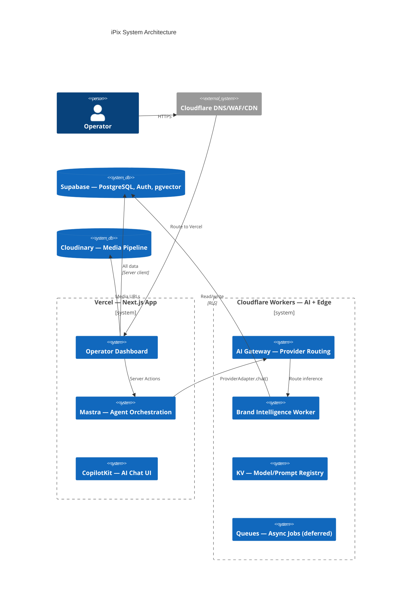

# 01 — System Architecture

**Type:** C4Context

```mermaid
C4Context
  title iPix System Architecture

  Person(user, "Operator")

  System_Ext(dns, "Cloudflare DNS/WAF/CDN")

  Boundary(vercel, "Vercel — Next.js App") {
    System(nextjs, "Operator Dashboard")
    System(mastra, "Mastra — Agent Orchestration")
    System(copilotkit, "CopilotKit — AI Chat UI")
  }

  Boundary(cloudflare, "Cloudflare Workers — AI + Edge") {
    System(gateway, "AI Gateway — Provider Routing")
    System(bi, "Brand Intelligence Worker")
    System(kv, "KV — Model/Prompt Registry")
    System(queues, "Queues — Async Jobs (deferred)")
  }

  SystemDb(supabase, "Supabase — PostgreSQL, Auth, pgvector")
  SystemDb(cloudinary, "Cloudinary — Media Pipeline")

  Rel(user, dns, "HTTPS")
  Rel(dns, nextjs, "Route to Vercel")
  Rel(nextjs, mastra, "Server Actions")
  Rel(mastra, gateway, "ProviderAdapter.chat()")
  Rel(gateway, bi, "Route inference")
  Rel(bi, supabase, "Read/write", "RLS")
  Rel(nextjs, supabase, "All data", "Server client")
  Rel(nextjs, cloudinary, "Media URLs")

  UpdateLayoutConfig($c4ShapeInRow="3", $c4BoundaryInRow="2")
```
