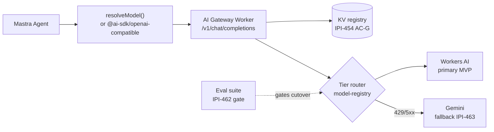
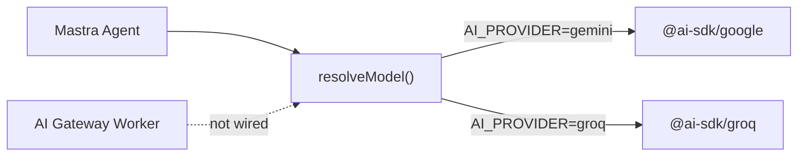
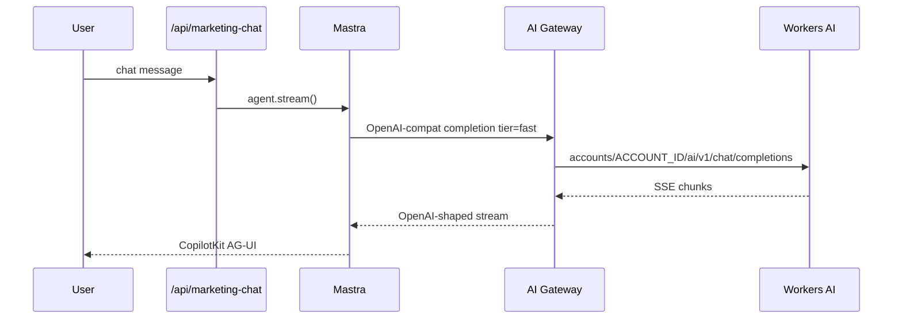

# 02 — AI Provider Flow

**Type:** flowchart + sequence + journey  
**Verified:** 2026-07-09 — [full report](../cloudflare/audits/ipi-454-457-462-463-verification.md)

## Target architecture (post IPI-454 F + 457 + 463)

## Today on main (forensic)

## Sequence — happy path after wire

