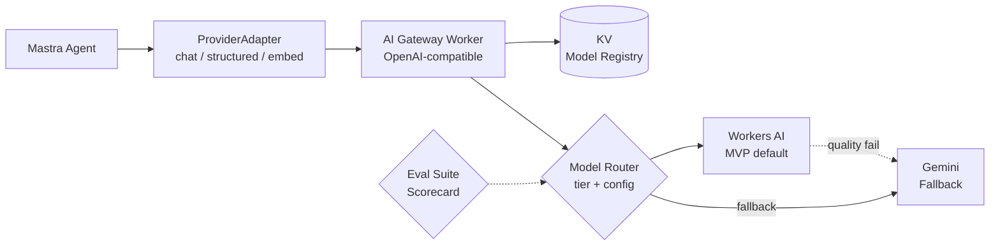

# 02 — AI Provider Flow

**Type:** flowchart + sequence

```mermaid
flowchart LR
  Agent["Mastra Agent"]
  Adapter["ProviderAdapter\nchat / structured / embed"]
  Gateway["AI Gateway Worker\nOpenAI-compatible"]
  Router{"Model Router\ntier + config"}
  WorkersAI["Workers AI\nMVP default"]
  Gemini["Gemini\nFallback"]
  KV[("KV\nModel Registry")]
  Eval{"Eval Suite\nScorecard"}

  Agent --> Adapter
  Adapter --> Gateway
  Gateway --> KV
  Gateway --> Router
  Router --> WorkersAI
  Router -->|fallback| Gemini
  WorkersAI -.->|quality fail| Gemini
  Eval -.-> Router
```
