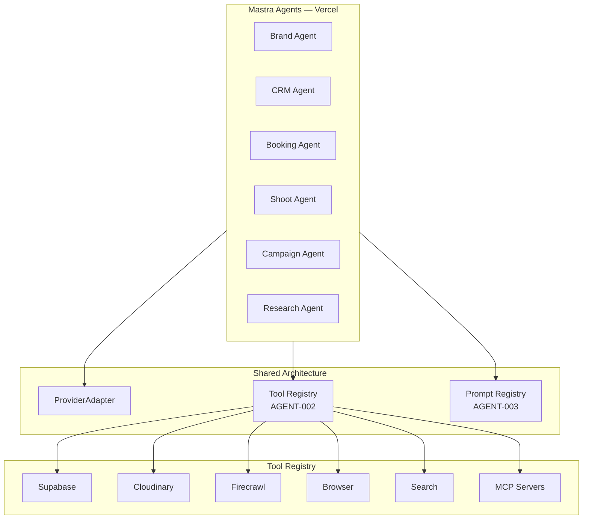

# 03 — Agent/Tool Architecture

**Type:** flowchart

```mermaid
flowchart TD
  subgraph Agents ["Mastra Agents — Vercel"]
    BA["Brand Agent"]
    CA["CRM Agent"]
    BoA["Booking Agent"]
    SA["Shoot Agent"]
    CgA["Campaign Agent"]
    RA["Research Agent"]
  end

  subgraph Registry ["Shared Architecture"]
    PA["ProviderAdapter"]
    TR["Tool Registry\nAGENT-002"]
    PR["Prompt Registry\nAGENT-003"]
  end

  subgraph Tools ["Tool Registry"]
    SDB["Supabase"]
    CL["Cloudinary"]
    FC["Firecrawl"]
    BR["Browser"]
    SR["Search"]
    MCP["MCP Servers"]
  end

  Agents --> PR
  Agents --> TR
  Agents --> PA
  TR --> SDB & CL & FC & BR & SR & MCP
```
