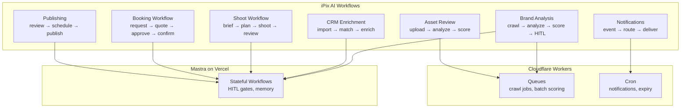

# 04 — Workflow Architecture

**Type:** flowchart

```mermaid
flowchart TD
  subgraph Workflows ["iPix AI Workflows"]
    BW["Brand Analysis\ncrawl → analyze → score → HITL"]
    CW["CRM Enrichment\nimport → match → enrich"]
    SW["Shoot Workflow\nbrief → plan → shoot → review"]
    BkW["Booking Workflow\nrequest → quote → approve → confirm"]
    NW["Notifications\nevent → route → deliver"]
    PW["Publishing\nreview → schedule → publish"]
    AW["Asset Review\nupload → analyze → score"]
  end

  subgraph Orchestration ["Mastra on Vercel"]
    Mastra["Stateful Workflows\nHITL gates, memory"]
  end

  subgraph Async ["Cloudflare Workers"]
    Queues["Queues\ncrawl jobs, batch scoring"]
    Cron["Cron\nnotifications, expiry"]
  end

  BW --> Queues & Mastra
  CW --> Mastra
  SW --> Mastra
  BkW --> Mastra
  NW --> Cron
  PW --> Mastra
  AW --> Queues
```
