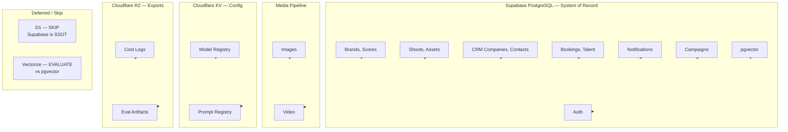

# 05 — Data/Storage Decision Map

**Type:** flowchart

```mermaid
flowchart TD
  subgraph Supabase ["Supabase PostgreSQL — System of Record"]
    B["Brands, Scores"]
    S["Shoots, Assets"]
    CRM["CRM Companies, Contacts"]
    BK["Bookings, Talent"]
    N["Notifications"]
    C["Campaigns"]
    V["pgvector"]
    A["Auth"]
  end

  subgraph Cloudinary ["Media Pipeline"]
    IMG["Images"]
    VID["Video"]
  end

  subgraph CFKV ["Cloudflare KV — Config"]
    MR["Model Registry"]
    PR["Prompt Registry"]
  end

  subgraph R2 ["Cloudflare R2 — Exports"]
    CL["Cost Logs"]
    EA["Eval Artifacts"]
  end

  subgraph Skip ["Deferred / Skip"]
    D1["D1 — SKIP\nSupabase is SSOT"]
    VEC["Vectorize — EVALUATE\nvs pgvector"]
  end

  B & S & CRM & BK & N & C & V & A --> Supabase
  IMG & VID --> Cloudinary
  MR & PR --> CFKV
  CL & EA --> R2
```
