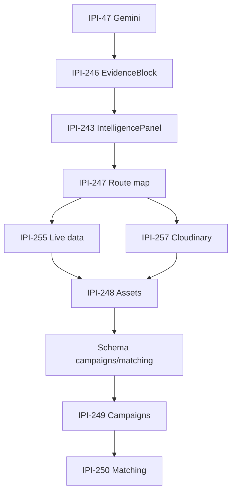

# Master Dependencies

Onboarding map: **spec → Linear → code artifact → screens**, per stack layer, with **Type · Skills · Blocked By · Required Stack · Verification**.

**Linear footer template:** [`LINEAR-ISSUE-FOOTER.md`](./LINEAR-ISSUE-FOOTER.md) — paste on every DESIGN V2 + AI Intelligence issue.

**Linear SSOT:** [DESIGN V2 project](https://linear.app/amo100/project/design-v2-operator-react-parity-e276f28e26a0) · [AI INTELLIGENCE project](https://linear.app/amo100/project/ai-intelligence-fe1f696f58be)

**Do not start** a row until all **Hard blocked by** issues are Done or explicitly waived in Linear.

**Blocker types** (see [`task-corrections-2026-06-30.md`](../../audit/task-corrections-2026-06-30.md)):

| Type | Meaning | Linear |
|------|---------|--------|
| **Hard** | Work cannot start | `blockedBy` relation |
| **Soft** | Parallel scaffold OK; full AC waits | description note · `relatedTo` |
| **Informational** | Context only | `relatedTo` only |

**Agent SSOT:** [`AGENT-MAP.md`](../../design-docs/plan/AGENT-MAP.md) — route → Mastra agent names must match everywhere.

---

## Integration status (use instead of binary Done)

| Stage | Symbol | Meaning |
|-------|:------:|---------|
| Prototype | ⚪ | DC / spike / doc only |
| Implemented | 🔵 | Code merged, not wired E2E |
| Integrated | 🟡 | Works in app, partial or mock data |
| Verified | 🟢 | lint + build + test + browser |
| Production | ⭐ | proof_bundle + Linear Done |

---

## Stack dependency matrix (features)

| Feature | CopilotKit | Mastra | Gemini | Supabase | Cloudinary | Primary owner |
|---------|:----------:|:------:|:------:|:--------:|:----------:|---------------|
| **EvidenceBlock** | UI modal | — | Structured output | score rows | — | CopilotKit |
| **IntelligencePanel** | Sidebar + context | agent bridge | — | brand/scores/assets | thumb URLs | CopilotKit |
| **Route-agent map** | `useAgent` | registry keys | — | — | — | Mastra |
| **Assets workspace** | panel + chat | creative-director | DNA explain | `assets` RLS | upload + delivery | Supabase + Cloudinary |
| **Matching** | panel + chat | social-discovery | fit ranking | `creators`, `shortlists` | — | Mastra + Supabase |
| **Campaigns** | panel + chat | creative-director | generation | `campaigns`, `deliverables` | assets | Mastra + Supabase |
| **Shoot Detail** | context | production-planner | — | shoot RPCs | refs | Frontend |
| **Brand crawl** | — | brand-intelligence wf | edge BI | crawl tables | — | Supabase + Gemini |

---

## Feature blocked-by chains (vertical)

### Campaigns

```text
Supabase schema (campaigns + deliverables)     IPI-268
        ↓
Edge / API routes (read + HITL write)
        ↓
Mastra creative-director wiring                IPI-261 · IPI-156
        ↓
EvidenceBlock                                  IPI-246
        ↓
React /app/campaigns                           IPI-249
```

### Matching

```text
Supabase schema (creators + shortlists + invites)   IPI-268
        ↓
Mastra social-discovery wiring                       IPI-262
        ↓
Route-agent map (/app/matching)                      IPI-247
        ↓
EvidenceBlock                                        IPI-246
        ↓
React /app/matching                                  IPI-250
```

### Assets

```text
Cloudinary pipeline (074a–f)                   IPI-257
        ↓
EvidenceBlock                                  IPI-246
        ↓
Route-agent map (/app/assets)                  IPI-247
        ↓
React /app/assets                              IPI-248
```

---

## Owner stack (P0 register)

| Linear | Spec | Owner stack | Type | Route → agent (AGENT-MAP) |
|--------|------|-------------|------|---------------------------|
| [IPI-246](https://linear.app/amo100/issue/IPI-246) | DESIGN-046 | CopilotKit | Frontend | 5 screens (explain modal) |
| [IPI-243](https://linear.app/amo100/issue/IPI-243) | DESIGN-032 | CopilotKit | Frontend | all OperatorShell |
| [IPI-247](https://linear.app/amo100/issue/IPI-247) | DESIGN-070 | Mastra | AI | map parity |
| [IPI-47](https://linear.app/amo100/issue/IPI-47) | AI-009 | Gemini | AI | — |
| [IPI-107](https://linear.app/amo100/issue/IPI-107) | registry CI | Gemini | Infrastructure | — |
| [IPI-268](https://linear.app/amo100/issue/IPI-268) | schema | Supabase | Database | — |
| [IPI-257](https://linear.app/amo100/issue/IPI-257) | DESIGN-074 | Cloudinary | Backend | — |
| [IPI-248](https://linear.app/amo100/issue/IPI-248) | DESIGN-057 | Supabase + Cloudinary | Frontend | `/app/assets` |
| [IPI-249](https://linear.app/amo100/issue/IPI-249) | DESIGN-058 | Supabase + Mastra | Frontend | `/app/campaigns` |
| [IPI-250](https://linear.app/amo100/issue/IPI-250) | DESIGN-059 | Supabase + Mastra | Frontend | `/app/matching` |
| [IPI-261](https://linear.app/amo100/issue/IPI-261) | DESIGN-077 | Mastra | AI | `/app/assets` → creative-director |
| [IPI-262](https://linear.app/amo100/issue/IPI-262) | DESIGN-078 | Mastra | AI | `/app/preview` → visual-identity |
| [IPI-263](https://linear.app/amo100/issue/IPI-263) | DESIGN-079 | Mastra | AI | `/app/matching` → social-discovery |
| [IPI-156](https://linear.app/amo100/issue/IPI-156) | CAMP-001 | Mastra | AI | `/app/campaigns` → creative-director |

---

## Verification matrix (by milestone)

| Milestone | Manual | Browser | Playwright | Task verifier | Visual QA | Production ⭐ |
|-----------|:------:|:-------:|:----------:|:-------------:|:---------:|:-------------:|
| EvidenceBlock IPI-246 | ✅ | ✅ | component test | ✅ | vs DC modal | proof_bundle |
| IntelligencePanel IPI-243 | ✅ | ✅ | partial | ✅ | panel layout | after IPI-255 |
| Route map IPI-247 | — | ✅ per route | unit test | ✅ | — | grep + browser |
| Assets IPI-248 | ✅ | ✅ | journey | ✅ | masonry vs DC | after 257 |
| Campaigns IPI-249 | ✅ | ✅ | journey | ✅ | cards vs DC | after IPI-268 |
| Mobile IPI-264 | ✅ | ✅ 4 BP | matrix spec | ✅ | — | MOBILE-VERIFICATION.md |
| QA epic IPI-258 | — | ✅ | DESIGN-081 | ✅ | DESIGN-082 | staging smoke |

**Evidence paths:** `docs/ecommerce/evidence/YYYY-MM-DD/<slug>/` · `tasks/todo.md` proof_bundle column

---

## Task types (filter in Linear + docs)

| Type | Use when |
|------|----------|
| **Design** | DC prototype, handoff, tokens, wireframes — no `app/` ship |
| **Frontend** | React UI in `app/` — components, pages, shell |
| **Backend** | Next.js API routes, RPC callers, server logic |
| **AI** | Mastra agents, tools, workflows, prompts, CopilotKit wiring |
| **Database** | Migrations, RLS, schema, Supabase edge fn |
| **Infrastructure** | Auth, CI, env, deploy, licenses |
| **QA** | Playwright, a11y, mobile matrix, visual regression |
| **Documentation** | API-MAP, AGENT-MAP, plans — no production diff |

---

## Critical path — cannot begin until…

Single spine for operator MVP. Parallel work off this path is allowed only when **Blocked by** is empty for your row.

```text
IPI-47  Gemini foundation (partial — IPI-107 closes CI/registry)
   ↓
IPI-246  EvidenceBlock.tsx  (DESIGN-046)
   ↓
IPI-243  IntelligencePanel  (DESIGN-032)
   ↓
IPI-247  Route-agent map  (DESIGN-070)  ← parallel with 243 after 246
   ↓
IPI-255  Live intel data  (DESIGN-071)
   ∥
IPI-257  Cloudinary pipeline  (DESIGN-074)  ← parallel with 255; blocks upload only
   ↓
IPI-248  Assets workspace  (DESIGN-057)  ← read-only scaffold before 257 OK
   ↓
[schema]  campaigns + matching tables  ← IPI-268
   ↓
IPI-249  Campaigns  (DESIGN-058)
   ↓
IPI-250  Matching  (DESIGN-059)
```

**Parallel lanes (after CopilotKit v2 foundation — IPI-110/112 Done):**

| Lane | Start when | Issue |
|------|------------|-------|
| Shoot Detail | Shell exists | [IPI-209](https://linear.app/amo100/issue/IPI-209) — EvidenceBlock on Assets tab after IPI-246 |
| Mobile + a11y | IntelPanel scaffold | [IPI-264](https://linear.app/amo100/issue/IPI-264) · [IPI-253](https://linear.app/amo100/issue/IPI-253) |
| Agent wiring | Route map Done | [IPI-259–263](https://linear.app/amo100/issue/IPI-259) |



---

## Stack chains

### EvidenceBlock (explainability spine)

```text
DESIGN-046  (DC component — ✅ on 5 screens)
     ↓
IPI-246     Linear · DESIGN V2
     ↓
~~IPI-267~~  Canceled · duplicateOf IPI-246
     ↓
app/src/components/evidence-block/evidence-block.tsx   ← not shipped
     ↓
Screens (explain modal on each):
  · Brand Detail     /app/brand/[id]     DESIGN-043
  · Assets           /app/assets         DESIGN-057 · IPI-248
  · Matching         /app/matching       DESIGN-059 · IPI-250
  · Campaigns        /app/campaigns      DESIGN-058 · IPI-249
  · Channel Preview  /app/preview        DESIGN-060
```

| Step | Blocked by |
|------|------------|
| IPI-246 EvidenceBlock | IPI-47 (structured score payload) · optional waiver if mock data |
| Wire 5 screens | IPI-246 merged |
| IPI-152 DNA explain agent | IPI-246 · IPI-129 |

---

### Gemini

```text
IPI-47   AI-009 foundation          In Review (partial)
     ↓
IPI-107  Registry + CI gate          In Review
     ↓
Surfaces:
  · supabase/functions/_shared/gemini.ts     ✅ edge
  · app/src/mastra/models.ts                 ✅ Mastra
  · audit-asset-dna · brand-intelligence     ✅ edge fns
     ↓
Consumers:
  · IPI-246 EvidenceBlock (structured evidence)
  · IPI-152 DNA-002 agent
  · DESIGN-075–079 agent prompts
  · DESIGN-074d DNA tagging
  · IPI-25 prompt v2
```

| Task | Type | Skills | Blocked by |
|------|------|--------|------------|
| [IPI-47](https://linear.app/amo100/issue/IPI-47) | AI | gemini, ipix-task-lifecycle | — |
| [IPI-107](https://linear.app/amo100/issue/IPI-107) | Infrastructure | gemini, task-verifier | IPI-47 partial OK |
| [IPI-246](https://linear.app/amo100/issue/IPI-246) | Frontend | design-md, frontend-design, gemini | IPI-47 · IPI-107 waived or Done |
| [IPI-152](https://linear.app/amo100/issue/IPI-152) | AI | gemini, mastra, task-verifier | IPI-246 · IPI-129 |

---

### CopilotKit v2

```text
IPI-112  v2 runtime foundation        ✅ Done
     ↓
IPI-110  Operator panel + sidebar    ✅ Done
     ↓
IPI-114  Real auth in runtime        ✅ Done
     ↓
IPI-243  IntelligencePanel           In Progress · DESIGN-032
     ↓
IPI-244  HITL write in panel         Todo · DESIGN-072 slice
     ↓
IPI-197  Contextual sidebar all routes  Todo · design ✅ code 🔴
     ↓
IPI-127  Prod license + smoke        In Progress
```

| Task | Type | Skills | Blocked by |
|------|------|--------|------------|
| [IPI-243](https://linear.app/amo100/issue/IPI-243) | Frontend | copilotkit, frontend-design, design-md | IPI-242 ✅ · IPI-255 live data (phase B) |
| [IPI-247](https://linear.app/amo100/issue/IPI-247) | AI | copilotkit, mastra, task-verifier | IPI-51 ✅ |
| [IPI-255](https://linear.app/amo100/issue/IPI-255) | Frontend | copilotkit, ipix-supabase, design-md | IPI-243 |
| [IPI-197](https://linear.app/amo100/issue/IPI-197) | AI | copilotkit, mastra | IPI-243 · IPI-247 |

---

### Mastra

```text
IPI-48   Runtime in Next.js          ✅ Done
     ↓
IPI-129  Postgres storage             ✅ Done
     ↓
IPI-135  Agent memory                 ✅ Done
     ↓
IPI-113  Tool registry (10 tools)     ✅ Done
     ↓
IPI-247  route-agent-map.ts parity    Todo · DESIGN-070
     ↓
IPI-259–263  Per-agent route wiring   Todo · DESIGN-075–079
     ↓
IPI-138  In-app MCP registry          Todo · post-MVP P10
```

| Task | Type | Skills | Blocked by |
|------|------|--------|------------|
| [IPI-247](https://linear.app/amo100/issue/IPI-247) | AI | mastra, copilotkit, graphify | IPI-51 · agents registered |
| [IPI-259](https://linear.app/amo100/issue/IPI-259) | AI | mastra, gemini, fashion-production | IPI-247 |
| [IPI-260](https://linear.app/amo100/issue/IPI-260) | AI | mastra, gemini, ipix-supabase | IPI-247 · IPI-130 ✅ |
| [IPI-261](https://linear.app/amo100/issue/IPI-261) | AI | mastra, gemini | IPI-247 |
| [IPI-137](https://linear.app/amo100/issue/IPI-137) | AI | mastra, task-verifier | IPI-113 ✅ |

**Known gap (IPI-247):** `/app/assets` → `production-planner` (target `creative-director`); `/app/matching` → `production-planner` (target `social-discovery`); `/app/onboarding` → `production-planner` (target `brand-intelligence`); missing `/app/preview` → `visual-identity`. See AGENT-MAP.

---

### Supabase

```text
Platform MVP schema + RLS           ✅
     ↓
IPI-126  BI migration push          ✅
     ↓
Shoot RPCs + commit                 ✅ IPI-228
     ↓
IPI-209  Shoot detail reads         In Progress
     ↓
IPI-268  campaigns + matching schema   Todo · blocks IPI-249 · IPI-250
     ↓
IPI-255  Live panel APIs            Todo
IPI-244  HITL persist               Todo
STR-001–003  Stripe schema          Todo
```

| Task | Type | Skills | Blocked by |
|------|------|--------|------------|
| [IPI-209](https://linear.app/amo100/issue/IPI-209) | Frontend | ipix-supabase, feature-dev, fashion-production | Shoot RPCs ✅ |
| [IPI-255](https://linear.app/amo100/issue/IPI-255) | Backend | ipix-supabase, create-migration | IPI-243 |
| [IPI-249](https://linear.app/amo100/issue/IPI-249) | Frontend | ipix-supabase, feature-dev, design-md | [IPI-268](https://linear.app/amo100/issue/IPI-268) · IPI-246 · IPI-247 |
| [IPI-250](https://linear.app/amo100/issue/IPI-250) | Frontend | ipix-supabase, mastra, design-md | [IPI-268](https://linear.app/amo100/issue/IPI-268) · IPI-246 · IPI-247 |
| [IPI-268](https://linear.app/amo100/issue/IPI-268) | Database | ipix-supabase, create-migration, task-verifier | — (soft: IPI-248 context) |

---

### Cloudinary

```text
DESIGN-018  MEDIA-MAP.md            ✅ stub
     ↓
IPI-257     DESIGN-074 epic         Todo (074a–f)
     ↓
074a  Signed upload API
074b  cloudinary_assets + RLS
074c  Link assets ↔ brand
074d  audit-asset-dna trigger
074e  Transforms / delivery URLs
074f  Channel preview delivery
     ↓
IPI-248  Assets workspace           Todo · DESIGN-057 · read-only OK before 074a
IPI-151  DNA gallery                Todo · blocked IPI-209
```

| Task | Type | Skills | Blocked by |
|------|------|--------|------------|
| [IPI-257](https://linear.app/amo100/issue/IPI-257) | Backend | cloudinary, ipix-supabase, create-migration | — |
| [IPI-248](https://linear.app/amo100/issue/IPI-248) | Frontend | cloudinary, frontend-design, design-md | IPI-257 soft (upload) |
| [IPI-184](https://linear.app/amo100/issue/IPI-184) | Database | cloudinary, fashion-production | Independent seed · not full pipeline |

---

## Master task register (P0 + DV2 spine)

Filter keys: **Type** · **Skills** · **Blocked by** · **Linear**

| Spec | Linear | Type | Skills | Blocked by | Deliverable |
|------|--------|------|--------|------------|-------------|
| DESIGN-046 | [IPI-246](https://linear.app/amo100/issue/IPI-246) | Frontend | design-md, frontend-design, gemini, task-verifier | IPI-47 partial | `evidence-block.tsx` |
| DESIGN-032 | [IPI-243](https://linear.app/amo100/issue/IPI-243) | Frontend | copilotkit, frontend-design, design-md | IPI-242 ✅ · IPI-255 live data | IntelligencePanel |
| DESIGN-054 | [IPI-209](https://linear.app/amo100/issue/IPI-209) | Frontend | feature-dev, fashion-production, copilotkit, design-md | Shoot RPCs ✅ · IPI-246 soft (Assets tab) | Shoot Detail 9 tabs |
| DESIGN-070 | [IPI-247](https://linear.app/amo100/issue/IPI-247) | AI | mastra, copilotkit, graphify | IPI-51 ✅ | `route-agent-map.ts` |
| DESIGN-071 | [IPI-255](https://linear.app/amo100/issue/IPI-255) | Backend | ipix-supabase, copilotkit, design-md | IPI-243 · IPI-247 | Live panel APIs |
| DESIGN-072 | [IPI-244](https://linear.app/amo100/issue/IPI-244) | Frontend | mastra, ipix-supabase, task-verifier | IPI-243 | HITL persist |
| DESIGN-057 | [IPI-248](https://linear.app/amo100/issue/IPI-248) | Frontend | cloudinary, frontend-design, design-md | IPI-246 · IPI-247 · IPI-257 soft (upload) | Assets workspace |
| DESIGN-058 | [IPI-249](https://linear.app/amo100/issue/IPI-249) | Frontend | feature-dev, mastra, design-md | IPI-268 · IPI-246 · IPI-247 | Campaigns workspace |
| DESIGN-059 | [IPI-250](https://linear.app/amo100/issue/IPI-250) | Frontend | mastra, frontend-design, design-md | IPI-268 · IPI-246 · IPI-247 | Matching workspace |
| DESIGN-060 | [IPI-269](https://linear.app/amo100/issue/IPI-269) | Frontend | frontend-design, cloudinary, design-md | IPI-246 · IPI-247 | Channel Preview DV2 |
| DESIGN-074 | [IPI-257](https://linear.app/amo100/issue/IPI-257) | Backend | cloudinary, ipix-supabase | — (parallel w/ IPI-255) | Upload → delivery pipeline |
| DESIGN-075 | [IPI-259](https://linear.app/amo100/issue/IPI-259) | AI | mastra, gemini, fashion-production | IPI-247 | production-planner · `/app/shoots` |
| DESIGN-076 | [IPI-260](https://linear.app/amo100/issue/IPI-260) | AI | mastra, gemini, ipix-supabase | IPI-247 · IPI-130 ✅ | brand-intelligence · brand/onboarding |
| DESIGN-077 | [IPI-261](https://linear.app/amo100/issue/IPI-261) | AI | mastra, gemini | IPI-247 · IPI-248/IPI-246 soft | creative-director · `/app/assets` |
| DESIGN-078 | [IPI-262](https://linear.app/amo100/issue/IPI-262) | AI | mastra, copilotkit | IPI-247 · IPI-246 soft | visual-identity · `/app/preview` |
| DESIGN-079 | [IPI-263](https://linear.app/amo100/issue/IPI-263) | AI | mastra, gemini | IPI-247 · IPI-268 · IPI-246 soft | social-discovery · `/app/matching` |
| CAMP-001 | [IPI-156](https://linear.app/amo100/issue/IPI-156) | AI | mastra, gemini | IPI-247 · IPI-268 | creative-director · `/app/campaigns` |
| DESIGN-045 | [IPI-251](https://linear.app/amo100/issue/IPI-251) | Frontend | frontend-design, copilotkit | IPI-243 | Mobile shell |
| DESIGN-086 | [IPI-253](https://linear.app/amo100/issue/IPI-253) | QA | accessibility, agent-browser | — | a11y ≥85 gate |
| DESIGN-081 | [IPI-258](https://linear.app/amo100/issue/IPI-258) | QA | agent-browser, gen-test | Core screens | Playwright epic |
| Mobile matrix | [IPI-264](https://linear.app/amo100/issue/IPI-264) | QA | agent-browser, accessibility | — (soft: IPI-243) | MOBILE-VERIFICATION.md |
| AI-009 | [IPI-47](https://linear.app/amo100/issue/IPI-47) | AI | gemini, ipix-task-lifecycle | — | `_shared/gemini.ts` · **In Review** |
| Schema DV2 | [IPI-268](https://linear.app/amo100/issue/IPI-268) | Database | ipix-supabase, create-migration, task-verifier | — (soft: IPI-248 context) | campaigns + matching migrations |
| Registry CI | [IPI-107](https://linear.app/amo100/issue/IPI-107) | Infrastructure | gemini, task-verifier | IPI-47 partial | CI model allowlist |
| AIOR-002 | [IPI-110](https://linear.app/amo100/issue/IPI-110) | AI | copilotkit, mastra | IPI-48 ✅ | Operator panel ✅ |
| BI-001 | [IPI-24](https://linear.app/amo100/issue/IPI-24) | Database | firecrawl, ipix-supabase | — | Crawl pipeline ✅ |
| DESIGN-016 | — | Documentation | ipix-supabase, graphify | — | API-MAP stub ✅ |
| DESIGN-017 | — | Documentation | mastra, copilotkit, gemini | — | AGENT-MAP stub ✅ |
| DESIGN-018 | — | Documentation | cloudinary, ipix-supabase | — | MEDIA-MAP stub ✅ |

---

## Component dependency map

Shared components — changing one row affects multiple screens. Source: AGENT-MAP · handoff/11.

| Component | Spec | Used by | Linear enabler |
|-----------|------|---------|----------------|
| EvidenceBlock | DESIGN-046 | Brand Detail · Assets · Campaigns · Matching · Channel Preview | [IPI-246](https://linear.app/amo100/issue/IPI-246) |
| IntelligencePanel | DESIGN-032 | All OperatorShell routes | [IPI-243](https://linear.app/amo100/issue/IPI-243) |
| AssetCard | DESIGN-042 | Assets · Shoot Detail Assets tab | [IPI-248](https://linear.app/amo100/issue/IPI-248) · [IPI-209](https://linear.app/amo100/issue/IPI-209) |
| CampaignCard | DESIGN-043 | Campaigns | [IPI-249](https://linear.app/amo100/issue/IPI-249) |
| FilterBar | DESIGN-041 | Assets · Campaigns · Matching | workspace issues |
| BottomNav / BottomSheet | DESIGN-045 | Mobile ≤1024px | [IPI-251](https://linear.app/amo100/issue/IPI-251) |
| HITL persist | DESIGN-072 | Panel writes · approvals | [IPI-244](https://linear.app/amo100/issue/IPI-244) |

---

## React parity checklist (screen × verification)

| Screen | Route | Linear | Prototype | React | Browser | Playwright | Mobile |
|--------|-------|--------|:---------:|:-----:|:-------:|:----------:|:------:|
| Shoot Detail | `/app/shoots/[id]` | IPI-209 | ✅ | 🔵 | 🔴 | ⚪ | ⚪ |
| Assets | `/app/assets` | IPI-248 | ✅ | 🔵 | 🟡 | ⚪ | ⚪ |
| Campaigns | `/app/campaigns` | IPI-249 | ✅ | 🔵 | 🟡 | ⚪ | ⚪ |
| Matching | `/app/matching` | IPI-250 | ✅ | 🔵 | 🟡 | ⚪ | ⚪ |
| Channel Preview | `/app/preview` | IPI-269 | ✅ | 🟡 | 🟡 | ⚪ | ⚪ |
| Brand Detail | `/app/brand/[id]` | — | ✅ | 🟡 | 🟡 | ⚪ | ⚪ |

Full matrix + journeys: [IPI-264](https://linear.app/amo100/issue/IPI-264) · [MOBILE-VERIFICATION.md](../../design-docs/design/MOBILE-VERIFICATION.md)

---

## Dependency verification (spine tasks)

Every spine issue must include: **owner · priority · blockedBy · blocks · skills · MCP · verification · AC**.

| Field | Spine status (2026-06-30) |
|-------|:--------------------------:|
| Assignee | ✅ S K on Batch 1–3 core |
| Priority | ✅ |
| Hard blockedBy | ✅ verified vs Linear |
| Blocks | ✅ |
| Skills + MCP footer | ✅ template v2.0 |
| Verification checklist | 🟡 IPI-270/271 optional |
| Acceptance criteria | ✅ |

Mirror issues (execute canonical only):

- **IPI-267 · DESIGN-046 EvidenceBlock React Port** → duplicateOf **IPI-246 · DESIGN-046 EvidenceBlock**
- **IPI-266 · MOBILE-QA-001** → duplicateOf **IPI-264 · Mobile Verification**

---

## MCP + skills (execution footer)

Every PR should cite:

| Layer | MCP (dev) | Skill |
|-------|-----------|-------|
| Schema | Supabase MCP | ipix-supabase, create-migration |
| UI | browser MCP | frontend-design, design-md |
| AI runtime | Mastra MCP, Gemini docs MCP | mastra, copilotkit, gemini |
| Crawl ops | Firecrawl MCP | firecrawl |
| Done gate | — | task-verifier |

Full maps: [`skill-map.md`](./skill-map.md) · [`mcp-plan.md`](./mcp-plan.md)

---

## Execution footer matrix (2026-06-30)

Standard footer: [`LINEAR-ISSUE-FOOTER.md`](./LINEAR-ISSUE-FOOTER.md) v2.0 — same structure on every issue.

| IPI | Batch | Footer | Deps verified | BlockedBy verified |
|-----|-------|:------:|:-------------:|:------------------:|
| [IPI-246](https://linear.app/amo100/issue/IPI-246) | 1 Core | ✅ | ✅ | ✅ |
| [IPI-243](https://linear.app/amo100/issue/IPI-243) | 1 Core | ✅ | ✅ | ✅ |
| [IPI-247](https://linear.app/amo100/issue/IPI-247) | 1 Core | ✅ | ✅ | ✅ |
| [IPI-255](https://linear.app/amo100/issue/IPI-255) | 1 Core | ✅ | ✅ | ✅ |
| [IPI-257](https://linear.app/amo100/issue/IPI-257) | 1 Core | ✅ | ✅ | ✅ |
| [IPI-209](https://linear.app/amo100/issue/IPI-209) | 1 Core | ✅ | ✅ | ✅ |
| [IPI-197](https://linear.app/amo100/issue/IPI-197) | 2 AI+Design | ✅ | ✅ | ✅ |
| [IPI-248](https://linear.app/amo100/issue/IPI-248) | 2 AI+Design | ✅ | ✅ | ✅ |
| [IPI-249](https://linear.app/amo100/issue/IPI-249) | 2 AI+Design | ✅ | ✅ | ✅ |
| [IPI-250](https://linear.app/amo100/issue/IPI-250) | 2 AI+Design | ✅ | ✅ | ✅ |
| [IPI-261](https://linear.app/amo100/issue/IPI-261) | 2 AI+Design | ✅ | ✅ | ✅ |
| [IPI-269](https://linear.app/amo100/issue/IPI-269) | 2 AI+Design | ✅ | ✅ | ✅ |
| [IPI-268](https://linear.app/amo100/issue/IPI-268) | 2 Schema | ✅ | ✅ | ✅ |
| [IPI-258](https://linear.app/amo100/issue/IPI-258) | 3 QA | ✅ | ✅ | ✅ |
| [IPI-264](https://linear.app/amo100/issue/IPI-264) | 3 QA | ✅ | ✅ | ✅ |
| [IPI-253](https://linear.app/amo100/issue/IPI-253) | 3 QA | ✅ | ✅ | ✅ |
| [IPI-107](https://linear.app/amo100/issue/IPI-107) | 3 Platform | ✅ | ✅ | ✅ |
| [IPI-47](https://linear.app/amo100/issue/IPI-47) | 3 Platform | ✅ | ✅ | ✅ |

**Implementation batches** (execute in order within batch; Batch 2 after Batch 1 spine unblocked):

```text
Batch 1 — Core blockers:  246 · 247 · 243 · 209 · 255 ∥ 257   (246+247 before 243; 255 ∥ 257 parallel)
Batch 2 — AI & Design:    197 · 248 · 268 · 249 · 250 · 261 · 269
Batch 3 — QA & Platform:  258 · 264 · 253 · 107 · 47
```

---

## Maintenance

1. **New Linear issue** → add row to Master task register + Execution footer matrix + update stack chain if it blocks others.
2. **Merge PR** → update **Blocked by** on unblocked children in Linear (relation or description).
3. **Schema gap** → create Database issue before Frontend workspace issues (campaigns/matching).
4. **Linear issues** → append footer from [`LINEAR-ISSUE-FOOTER.md`](./LINEAR-ISSUE-FOOTER.md); set `blockedBy` relations in Linear.

**Changelog**

| Date | Change |
|------|--------|
| 2026-06-30 | v1.6.1 — pass 3 Linear: IPI-244 blockedBy · soft gates 264/261/268 · IPI-258 QA scope · assignees |
| 2026-06-30 | v1.6 — audit 94/100 · blocker types · component map · React parity · agent register 077–079 · full task names |
| 2026-06-30 | v1.5 — P0 pass 2: 255∥257 parallel · IPI-269 register · canceled 267/266 · deps 248/249/251/260 |
| 2026-06-30 | v1.4 — Linear sync: deps corrected · IPI-269 created · owners assigned · audit 92/100 |
| 2026-06-30 | v1.2 — execution footer matrix · batch order · standardized footer v2 |
| 2026-06-30 | v1.1 — stack matrix, status ladder, verification matrix, owner stack, IPI-268, LINEAR-ISSUE-FOOTER |
| 2026-06-30 | v1.0 — initial spine, stack chains, type/skills/blocked-by register |
