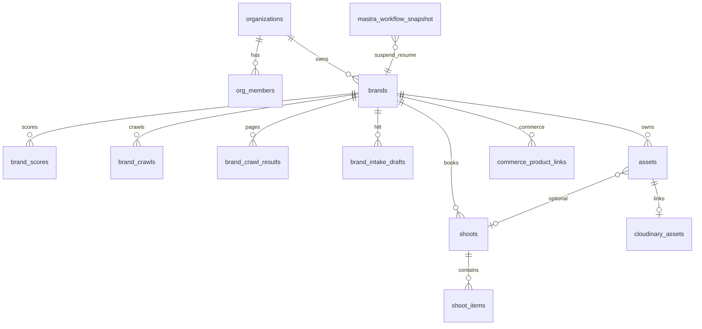
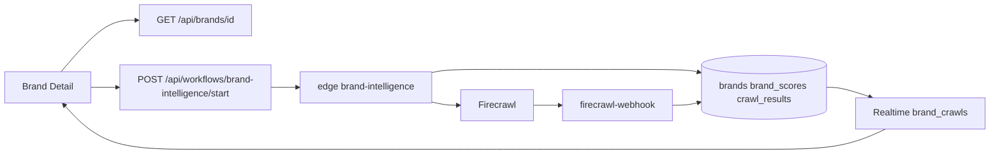

# Supabase Audit — Report #1 (awaiting approval)

> **Workflow:** Audit #1 of 4 · canonical path: `tasks/intelligence/audits/`. Do **not** update `supabase-plan.md` until approved.

## Executive summary

| Metric | Value |
|--------|------:|
| **Accuracy score** | **84/100** |
| **Verdict** | **Needs fixes** (core path usable; campaigns/matching blocked) |
| **Live connection** | 🟢 MCP connected · **120** migrations applied |
| **Migrations in repo vs remote** | 🟡 partial — `get_shoot_detail_rpc` synced on **`origin/main`** (PR #150); **074b not on remote** (PR #154 open) |
| **DESIGN V2 screen coverage** | 7/11 screens have adequate schema · 2 blocked (Campaigns/Matching) · 2 partial |

Supabase is the **correct foundation** for auth, brand intelligence, shoots, and Mastra persistence. The main gaps are **missing product tables** (`campaigns`, `matching`), **stale `cloudinary_assets` RLS**, and **org-member RLS lag** vs newer brand tables.

---

## Recommended audit run order (all 4 prompts)

Run **one at a time**; each produces a report → approval → plan doc update.

| # | Prompt | Why this order | Phase |
|---|--------|----------------|-------|
| **1** | **Supabase** ← *this report* | Data/auth/RLS foundation everything else depends on | **Core (MVP)** |
| 2 | Gemini | Edge + structured output contracts sit on Supabase tables | **Core (MVP)** |
| 3 | Mastra | Agents/workflows consume Supabase + Gemini | **Core + Post-MVP** |
| 4 | CopilotKit | UI shell wires to Mastra; last because it depends on agent/data truth | **Core + Post-MVP** |

**Post-MVP / Advanced** (separate from these four audits): Stripe schema (STR-001), brand graph production use, Shopify/Amazon sync tables, MediaFlows.

---

## Live MCP verification (2026-06-30)

| Check | Result |
|-------|--------|
| Project | Remote-only `nvdlhrodvevgwdsneplk` ✅ |
| `list_tables` | **106** public tables · all RLS enabled *(audit v1 said 95 — undercount)* |
| `list_migrations` | **120** applied · latest: `20260630120000_get_shoot_detail_rpc` |
| `list_edge_functions` | 12 deployed (6 MVP + 6 legacy FashionOS) |
| `list_storage_buckets` | *(prior audit)* **0 buckets** — Cloudinary boundary ✅ |
| Campaign/matching SQL | **0 tables** matching `%campaign%`, `%match%`, `%creator%` |
| Security advisors | **225** lints *(snapshot — re-run after PR #154)*: 36 INFO (RLS no policy — intentional chatbot/mastra), 187 WARN (pg_graphql exposure on legacy tables), **2 ERROR**: `shoot_portfolio_view`, `shot_type_references_view` |

**Not yet on remote:** `20260630052200_cloudinary_assets_extend_and_brand_rls` (PR #154 — 074b).

---

## Phase assignment (Supabase work)

### Core (MVP) — ship before DESIGN V2 parity proofs

| Deliverable | Status | Linear |
|-------------|:------:|--------|
| Platform MVP schema + org layer | 🟢 | IPI-126 ✅ |
| Brand intelligence v2 + crawl tables | 🟢 | IPI-26 ✅ |
| Shoot schema + `commit_shoot_draft` RPC | 🟢 | IPI2-117 ✅ |
| Mastra PG persistence + RLS hardening | 🟢 | IPI-227 ✅ |
| Assets brand-scoped RLS (`assets.brand_id`) | 🟢 | `20260618090000` |
| Media spec tables (`platforms`, `image_specs`) | 🟢 | — |
| Edge MVP set (BI, crawl, DNA, health) | 🟢 | — |
| Realtime crawl progress (Brand Detail) | 🟡 | IPI-31 partial |
| **`cloudinary_assets` extend + brand RLS** | 🟡 | **IPI-257 / 074b** PR #154 |
| Shoot detail RPC + page | 🟡 | IPI-209 ✅ shell on `origin/main` (PR #150); 6/9 tabs scaffold |

### Post-MVP (automation / workspace tables)

| Deliverable | Status | Linear |
|-------------|:------:|--------|
| **Campaigns + matching schema** | 🔴 | **IPI-268** (blocks IPI-249, IPI-250) |
| Shoot detail tab APIs (9 joins) | 🟡 | IPI-210–217 (IPI-209 shell ✅) |
| HITL persist (`brand_intake_drafts` → approvals queue) | 🟡 | IPI-244 |
| API-MAP completion | ⚪ | DESIGN-016 |
| Org-member RLS alignment (`is_org_member`) | 🟡 | follow-up (assets + cloudinary_assets) |

### Advanced (Later)

| Deliverable | Status | Linear |
|-------------|:------:|--------|
| Stripe checkout tables | 🔴 | STR-001–003 |
| Brand graph production queries | ⚪ | GRAPH-001 tables exist, 0 rows |
| Shopify/Amazon media link tables | ⚪ | schema exists, 0 rows, out of MVP |
| Context engineering (`agent_context_snapshots`) | ⚪ | 0 rows |
| Legacy event/fashion-show cluster (40+ tables) | 🟡 | 0 rows — ignore for MVP |

---

## Screen → Supabase map (DESIGN V2)

| Screen | Route | Tables (live) | API / Edge | Agent | RLS | Realtime | Linear | Dot |
|--------|-------|---------------|------------|-------|-----|----------|--------|:---:|
| Command Center | `/app` | `brands`, `brand_scores`, `shoots` | client reads | production-planner | brand owner / org partial | ⚪ none planned | DESIGN-050 | 🟡 |
| Brand List | `/app/brand` | `brands`, `brand_scores` | `GET /api/brands` | brand-intelligence | `brands_select_org` | ⚪ | **IPI-272** · DESIGN-052 | 🟡 |
| Brand Detail | `/app/brand/[id]` | `brands`, `brand_scores`, `brand_crawl_results`, `brand_crawls`, `assets` | `GET /api/brands/[id]` · BI workflow | brand-intelligence | org + brand owner | 🟢 crawl channel | **IPI-271** · DESIGN-051 | 🟡 |
| Shoots List | `/app/shoots` | `shoots`, `brands` | client reads | production-planner | shoot owner + brand | ⚪ | IPI-273 | 🟡 |
| Shoot Detail | `/app/shoots/[id]` | `shoots`, `shoot_items`, `assets`, `shoot_assets` | **`get_shoot_detail` RPC** (remote + repo) | production-planner | shoot + brand | ⚪ | **IPI-209** ✅ · tab fill IPI-210+ | 🟡 |
| Shoot Wizard | `/app/shoots/new` | `shoots`, `brands`, drafts | `commit_shoot_draft` · workflows | production-planner | brand owner | ⚪ | IPI-274 | 🟡 |
| Assets | `/app/assets` | `assets`, `cloudinary_assets`, `brand_scores` | `GET /api/brands/[id]/assets` (brand-scoped) | creative-director* | assets ✅ · cloudinary 🔴 stale | ⚪ | IPI-248 · IPI-257 | 🟡 |
| Campaigns | `/app/campaigns` | **`campaigns` missing** | — | creative-director | — | ⚪ | **IPI-268** → IPI-249 | 🔴 |
| Matching | `/app/matching` | **`matches`/creators missing** | — | social-discovery | — | ⚪ | **IPI-268** → IPI-250 | 🔴 |
| Channel Preview | `/app/preview` | `platforms`, `image_specs`, `assets` | `GET /api/media/specs` | visual-identity* | brand-scoped assets | ⚪ | IPI-269 | 🟡 |
| Onboarding | `/app/onboarding` | `brands`, `brand_intake_drafts` | BI workflow start/resume | brand-intelligence | brand owner | ⚪ | IPI-46 | 🟢 |

\* Route map fixed on **`origin/main`** (IPI-247 ✅) — not a Supabase issue; audits #2–4 should drop “reopen IPI-247”.

---

## Agent → data map

| Agent / workflow | Primary tables | Edge / API | Durability |
|------------------|--------------|------------|:----------:|
| brand-intelligence | `brands`, `brand_scores`, `brand_crawl_results`, `brand_crawls`, `brand_intake_drafts` | edge `brand-intelligence`, `start-brand-crawl`, `firecrawl-webhook` | workflow snapshots |
| production-planner | `shoots`, `brands`, shot refs | `commit_shoot_draft`, shoot wizard wf | durable |
| creative-director | `assets`, `brand_scores` (+ future `campaigns`) | Mastra tools | durable |
| visual-identity | `assets`, `platforms`, `image_specs`, `cloudinary_assets` | Cloudinary upload (Mastra) | partial |
| social-discovery | `brand_social_channels`, `brand_competitors` (+ future matching) | Mastra tools | ⚪ |
| audit-asset-dna | `assets`, `cloudinary_assets` | edge `audit-asset-dna` | — |

---

## Errors and red flags

| # | Issue | Severity | Fix |
|---|-------|:--------:|-----|
| 1 | **`campaigns` / matching tables missing** | 🔴 | IPI-268 migration-first |
| 2 | **Shoot Detail tab APIs incomplete** (3/9 tabs live) | 🟡 | IPI-210–217 follow-ups; IPI-209 Done is correct |
| 3 | **`cloudinary_assets` RLS stale** (shoot-scoped; nullable `shoot_id`) | 🔴 | Merge PR #154 (074b) · IPI-257 In Progress |
| 4 | **074b migration not on remote** | 🟠 | Merge PR #154; IPI-225 Done covers earlier drift only |
| 5 | **Org-member RLS gap**: `assets`/`cloudinary_assets` use `brands.user_id`, not `is_org_member(org_id)` | 🟡 | Follow-up PR after 074b |
| 6 | **Assets API brand-scoped only** — global library needs route | 🟡 | IPI-248 + API-MAP |
| 7 | **225 security lints** — pg_graphql exposes legacy tables to anon/auth | 🟡 | MVP: document; Later: restrict GraphQL |
| 8 | **2 ERROR** security definer views: `shoot_portfolio_view`, `shot_type_references_view` | 🟠 | Fix grants/search_path or document waiver (SUPA-ADVISOR follow-up) |
| 9 | **Duplicate Linear**: CLD-001/002/003 vs IPI-257 | 🟡 | Consolidate under IPI-257 parent |
| 10 | **Stale doc links** in API-MAP → `../../../ai/supabase-plan.md` | 🟡 | Point to `tasks/intelligence/plans/supabase-plan.md` |

---

## Missing schema (DESIGN V2 blockers)

```text
campaigns              — IPI-268
campaign_deliverables  — IPI-268 (or embedded JSON — decide in migration spec)
matches / creators     — IPI-268
shortlists / invites   — IPI-268
approvals (dedicated)  — today: brand_intake_drafts + workflow snapshots; IPI-244 may add queue table
activity feed          — Command Center; optional materialized view or table
portfolio_summary      — Command Center aggregation; may be RPC not table
```

---

## Missing / weak RLS

| Table | Issue | Action |
|-------|-------|--------|
| `cloudinary_assets` | Shoot-scoped policies broken | 074b brand join (PR #154) |
| `assets` | Org editors blocked | `is_org_member` follow-up |
| Future `campaigns` | Not created | IPI-268 must include RLS day-1 |
| `chatbot_*`, many `mastra_*` | RLS enabled, no policies | **Intentional** service-role only (IPI-241 doc) |

---

## Missing indexes / triggers (non-blocking)

- `cloudinary_assets`: brand_id, approval, status indexes in 074b ✅
- Campaign/matching: define with IPI-268 migration
- Command Center aggregations: consider RPC vs client-side N+1 reads

---

## Edge function scope

| Function | JWT | MVP? | Notes |
|----------|:---:|:----:|-------|
| `brand-intelligence` | ✅ | ✅ | Core BI |
| `start-brand-crawl` | ✅ | ✅ | Firecrawl kickoff |
| `firecrawl-webhook` | ❌ | ✅ | Signature verify required |
| `audit-asset-dna` | ✅ | ✅ | DNA pipeline |
| `capture-lead` | ❌ | ✅ | Marketing chatbot |
| `health` / `edge-test` | mixed | ✅ | Ops |
| Legacy (`generate-event-draft`, etc.) | mixed | ❌ | FashionOS — do not extend |

---

## Storage vs Cloudinary boundary

| Layer | Status | Rule |
|-------|:------:|------|
| Supabase Storage | **0 buckets** ✅ | Correct — operator media = Cloudinary |
| `assets` / `cloudinary_assets` | metadata only | `public_id` join key |
| Mercur catalog | separate Postgres | not Supabase |

Official ref: [Supabase Storage](https://supabase.com/docs/guides/storage) — not used for operator MVP by design.

---

## Linear task review

### Keep / active

| Issue | Role | Phase |
|-------|------|-------|
| **IPI-268** | Campaigns + matching schema | Post-MVP blocker |
| **IPI-257** | Cloudinary pipeline (074b in PR #154) | Core |
| **IPI-209** | Shoot detail RPC + page | Core |
| **IPI-244** | HITL approval persist | Post-MVP |
| **IPI-248** | Assets workspace (consumes Supabase + Cloudinary) | Core UI |

### Duplicates / consolidate

| Issue | Action |
|-------|--------|
| IPI2-59 CLD-001, IPI2-60 CLD-002, IPI2-61 CLD-003, IPI2-64 CLD-006 | Link as sub-tasks of **IPI-257** or close as duplicates |
| SAN-* venue/event schema issues | Out of iPix MVP scope |

### Missing (do not create until this report approved)

| Proposed | Purpose |
|----------|---------|
| IPI-XXX · SUPA-ORG-RLS | Align `assets` + `cloudinary_assets` to `is_org_member` |

---

## Corrected architecture (summary)

```text
Browser (operator)
  → Supabase Auth (PKCE, SSR @supabase/ssr)
  → RLS-scoped reads/writes (brand owner + org member*)
  → Next API routes (service-role for admin reads where needed)
  → Edge functions (Gemini, Firecrawl, DNA) — server secrets only
  → Mastra Postgres (workflow snapshots, threads, messages)
  → Cloudinary (media bytes — not Supabase Storage)

* org member RLS = follow-up; today mostly brand.user_id
```

---

## Mermaid — core ERD (MVP tables)



---

## Mermaid — Brand Detail data flow



---

## Measurable score breakdown

| Area | Score | Notes |
|------|------:|-------|
| Architecture | 90 | auth/RLS/edge/Mastra foundation correct |
| Supabase best-practice alignment | 88 | RLS on new tables; edge auth context; advisor awareness |
| Screen / data mapping | 80 | IPI-272 Brand List fix; campaigns/matching still missing |
| RLS / security accuracy | 84 | cloudinary stale; org gap; 2 named ERROR views |
| Freshness after Batch 1 | 82 | IPI-209/247/243/255 merged; 074b + IPI-268 remain |
| Actionability | 88 | clear P0 order: PR #154 → IPI-268 → SUPA-ORG-RLS |
| **Overall** | **84** | needs fixes, not blocked for brand/shoot/onboarding |

---

## Final verdict

**Needs fixes** — safe to continue **brand / onboarding / shoot wizard / shoot detail shell** on current schema. **Blocked** for Campaigns and Matching until **IPI-268** lands. **Merge PR #154 (074b)** before Cloudinary upload pipeline. Shoot Detail shell shipped (IPI-209 ✅); tab depth is Post-MVP.

---

## Linear reconciliation (2026-06-30 — Supabase MCP + Linear MCP)

**Projects reviewed:** [DESIGN V2](https://linear.app/amo100/project/design-v2-operator-react-parity-e276f28e26a0/issues) · [AI INTELLIGENCE](https://linear.app/amo100/project/ai-intelligence-fe1f696f58be/issues)

**Baseline:** verify against **`origin/main`**, not stale worktrees. Audits #2–4 ran on pre-merge branch — several “IPI-247 false Done” claims are **wrong on main**.

### Audit corrections (Supabase scope)

| Audit v1 claim | MCP + Linear truth | Action |
|----------------|-------------------|--------|
| 95 public tables | **106** tables, all RLS on | Update count only |
| Shoot Detail 🔴 no page on main | Page + RPC + migration on **`origin/main`** (PR #150) | 🟡 not 🔴; IPI-209 **Done** correct |
| Migration drift (get_shoot_detail) | Synced on main; IPI-225 **Done** (2026-06-28) | Remove as blocker; new gap = **074b not remote** |
| Reopen IPI-247 | Route map fixed on main | **Do not reopen** — fix Mastra/CopilotKit audits instead |
| campaigns/matching missing | SQL 0 rows; IPI-268 **Todo** High | ✅ Correct — P0 migration |
| cloudinary RLS stale | Policies still shoot→designer join | ✅ Correct — merge PR #154 |
| org-member RLS gap | `assets` uses `brands.user_id` only | ✅ Correct — no Linear issue yet |
| Brand List → IPI-271 | Should be **IPI-272** · DESIGN-052 | ✅ Fixed in screen map |

### Linear state — keep / change

| Issue | Linear | Verdict |
|-------|--------|---------|
| **IPI-268** SUPA-DV2-001 | Todo · blocks IPI-249/250/156/263 | ✅ Correct P0; move to In Progress when branch opens |
| **IPI-257** 074b | In Progress · PR #154 open | ✅ Correct — merge migration-only first |
| **IPI-209** Shoot Detail | Done · PR #150 | ✅ Correct — follow-ups IPI-210–217 for tabs |
| **IPI-247** Route map | Done · PR #147 | ✅ Correct on **origin/main** |
| **IPI-249/250** | Backlog · blocked by IPI-268 | ✅ Correct dependency chain |
| **IPI-183** shoot schema | Done (AI INTELLIGENCE) | ✅ Aligns with live shoot tables |
| **IPI-151** DNA gallery | Todo · blocked on cloudinary pipeline | ✅ Keep blocked until 074b |
| **IPI-156** creative-director campaigns | Todo · blocked by IPI-268 | ✅ Correct |
| **IPI-86** SHOOT-UX-003 | Duplicate of IPI-209 | ✅ Good dedup |
| **IPI-85** vs **IPI-273** | Overlap shoots list (AI vs DESIGN V2) | 🟡 Consolidate UX ownership — not schema |
| **Org-member RLS** | No issue | 🟡 Create follow-up (e.g. SUPA-ORG-RLS) after 074b |

### Still true (MCP 2026-06-30)

- **120** migrations applied · latest `20260630120000_get_shoot_detail_rpc`
- **0** `%campaign%` / `%match%` / `%creator%` tables
- **`cloudinary_assets`**: 5 policies via `assets.shoot_id → shoots.designer_id`; no `brand_id` column on remote
- **0** storage buckets (Cloudinary boundary intact)
- **`get_shoot_detail` RPC** exists on remote

### Recommended Linear edits (review only — not executed)

1. **Do not** reopen IPI-247 or IPI-209.
2. **Start** IPI-268 when ready (`ipi/268-campaigns-matching-schema`).
3. **Merge** PR #154 → mark IPI-257 074b checkbox → push remote.
4. **Add** org-member RLS follow-up issue (post-074b).
5. **Optional:** link IPI-268 to AI INTELLIGENCE project (currently DESIGN V2 only — acceptable).

---

## On approval — planned doc updates

1. Update `tasks/intelligence/plans/supabase-plan.md` with this score, phase table, and screen map.
2. Refresh `tasks/data/supabase-live-audit.md` (migration count 120, security lint summary).
3. Fix API-MAP stale `supabase-plan` link (docs-only, separate PR).
4. Proceed to **Audit #2: Gemini** (`prompt-gemeni.md`).

---

## Sources

- Supabase MCP: `list_tables`, `list_migrations`, `list_edge_functions`, `execute_sql`, `get_advisors`
- Repo: `supabase/migrations/`, `app/src/lib/supabase/`, `app/src/app/api/`
- Design: `tasks/design-docs/plan/API-MAP.md`, `AGENT-MAP.md`
- Prior: `tasks/data/supabase-live-audit.md`
- Official: [RLS](https://supabase.com/docs/guides/database/postgres/row-level-security) · [Edge Functions](https://supabase.com/docs/guides/functions) · [Realtime](https://supabase.com/docs/guides/realtime) · [Database Linter](https://supabase.com/docs/guides/database/database-linter)
