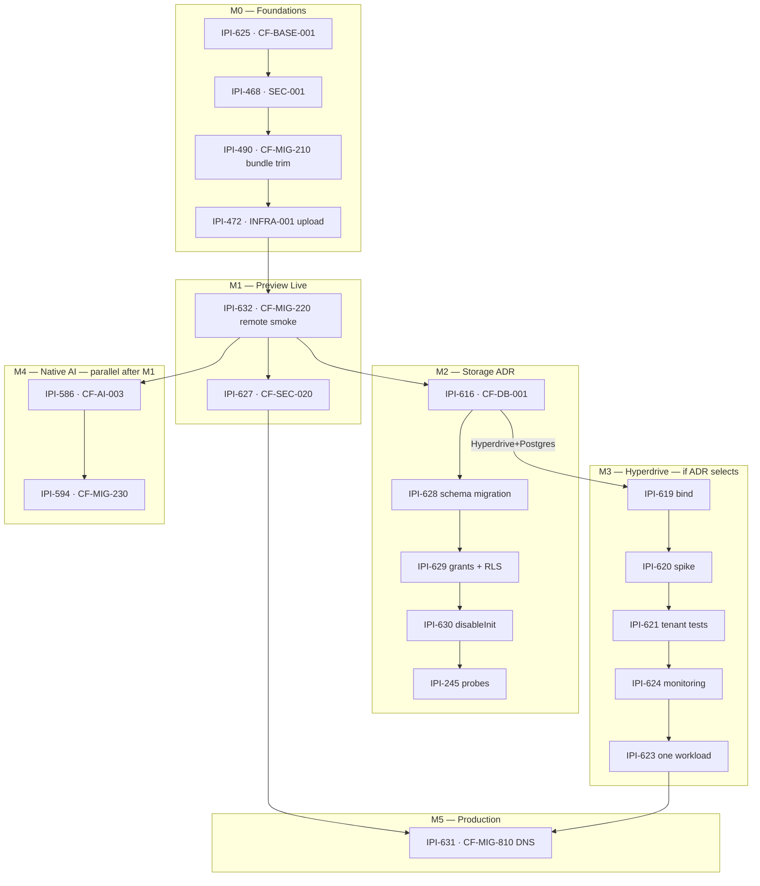

# Mastra × Cloudflare × Supabase — Production Roadmap

**Date:** 2026-07-16  
**Mode:** SSOT — synced with Linear (`IPI-632` split applied 2026-07-16)  
**Evidence:** Verified audits + Linear MCP + local build proof from `j16-mastra-notes.md`

| Audit source | Role |
|--------------|------|
| [`j16-mastra-cloudflare.md`](./j16-mastra-cloudflare.md) | OpenNext / Workers / auth / CI baseline |
| [`j16-mastra-cloudflare-notes.md`](./j16-mastra-cloudflare-notes.md) | Severity corrections (~82% audit accuracy) |
| [`j16-mastra-supabase.md`](./j16-mastra-supabase.md) | PostgresStore / RLS / grants / `disableInit` |
| [`j16-mastra-report.md`](./j16-mastra-report.md) | `mastra dev` 42501 root cause |
| [`j16-mastra-notes.md`](./j16-mastra-notes.md) | Build verification (OpenNext + dry-run) |
| [`mastra-audt-notes-j16.md`](./mastra-audt-notes-j16.md) | `disableInit` timing nuance |
| [`mastra-plan-notes3.md`](./mastra-plan-notes3.md) | **Jul 16 notes3 review** — bundle-before-upload, workers.dev vs WAF, Access≠auth |
| [`tasks/cloudflare/todo.md`](../cloudflare/todo.md) | **Linear execution SSOT** (Jul 16 resync) |

**Skills:** `.claude/skills/mastra` · `cloudflare` · `cloudflare-workflow` · `ipix-supabase`

**Revision:** 2026-07-16 — **~97% sync quality** after **IPI-632 · CF-MIG-220 — Protected Preview Runtime Smoke Validation** split from **IPI-490 · CF-MIG-210 — Worker Bundle Compatibility and Size Gate** (acyclic dependency chain). Milestones M0–M5, Definition of Done, and evidence requirements added below. Aligns with `tasks/cloudflare/todo.md` and Linear project milestones.

**Task naming (required everywhere):** `IPI-XXX · TASK-ID — Full Task Name`

---

## 0. Review verdict — corrections validated

| # | Finding | Verdict | Evidence |
|---|---------|---------|----------|
| 1 | Auth scheduled too late (upload before IPI-468) | ✅ **Confirmed** | `operator-gate.ts` fail-open; [Mastra CF guide](https://mastra.ai/guides/deployment/cloudflare) auth-before-exposure; `todo.md` Phase B before Phase D |
| 2 | Bundle ~9.98 MiB too close to 10 MB limit | ✅ **Confirmed** | `j16-mastra-notes.md` 10,218 KiB; [Workers limits](https://developers.cloudflare.com/workers/platform/limits/) — Paid gzip **10 MB**; use `wrangler deploy --dry-run` |
| 3 | “Hyperdrive bypasses RLS” wording | ✅ **Confirmed wrong** | `j16-mastra-supabase.md`: `rolbypassrls = false`; RLS applies — JWT tenant context is what raw PG lacks |
| 4 | Migrate all 33 tables blindly | ✅ **Confirmed risky** | 23 `exportSchemas()` + **10 drift** (9 Studio/feature + 1 `mastra_observational_memory` runtime OM) — classify before IaC |
| 5 | Schema ADR before migration IaC | ✅ **Confirmed** | Supabase [private schemas](https://supabase.com/docs/guides/api/securing-your-api); prefer `mastra` schema + migrations |
| 6 | Do not DISABLE RLS in `public` casually | ✅ **Confirmed** | [Supabase RLS](https://supabase.com/docs/guides/database/postgres/row-level-security); use policies for runtime role while in `public` |
| 7 | Node `42501` not a stateless preview blocker | ✅ **Confirmed** | `wrangler.jsonc` `MASTRA_STORAGE_MODE=noop` only; no `DATABASE_URL` in wrangler today |
| 8 | No `DATABASE_URL` Worker secret until Hyperdrive track | ✅ **Confirmed** | Hyperdrive creds live in binding config ([CF Supabase guide](https://developers.cloudflare.com/hyperdrive/examples/connect-to-postgres/postgres-database-providers/supabase/)); preview secrets = AI + auth only |
| 9 | Preview checklist “IPI-468 **or** Access” | ✅ **Confirmed wrong** | `mastra-plan-notes3.md`: Access is belt-and-suspenders; app auth mandatory before upload |
| 10 | WAF on `workers.dev` preview | ✅ **Confirmed wrong** | WAF rules are [zone-based](https://developers.cloudflare.com/waf/rate-limiting-rules/) (select account + domain); `*.workers.dev` → **Workers `ratelimit` binding** + Access; zone WAF after custom domain |
| 11 | Bundle ~9.98 MiB blocks iPix 9.0 MiB gate | ✅ **Confirmed** | Must **trim before upload** — **IPI-490 · CF-MIG-210** only (not remote smoke) |
| 17 | IPI-490 bundled bundle + remote smoke | ✅ **Fixed** | Remote smoke → **IPI-632 · CF-MIG-220**; breaks IPI-472 ↔ IPI-490 cycle |
| 12 | `public/_headers` ≠ dynamic SSR security headers | ✅ **Confirmed** | `app/public/_headers` is static caching only ([OpenNext](https://opennext.js.org/cloudflare/get-started)); use Next `headers()` / middleware for dynamic routes |
| 13 | Wrangler vs Dashboard drift | ✅ **Confirmed** | [Wrangler configuration](https://developers.cloudflare.com/workers/wrangler/configuration/) = SSOT for bindings/vars/envs; Dashboard for Access, observability, zone WAF |
| 14 | **IPI-630 · MASTRA-SUPABASE-004** env dedupe scope | ✅ **Confirmed** | `disableInit` + `schemaName` only in 004; `DATABASE_URL` cleanup → **IPI-626 · SUPA-CLEANUP** |
| 15 | `pg.Client` → `PostgresStore` unproven | ✅ **Confirmed** | `@mastra/pg@1.12.0` accepts `connectionString` or pre-configured `pool` ([Mastra PostgreSQL storage](https://mastra.ai/reference/storage/postgresql)), not a one-shot `pg.Client` — **spike in IPI-620 before IPI-623** |
| 16 | 8.5/9.0 MiB gates are iPix policy | ✅ **Confirmed** | CF hard limit = **10 MB gzip (Paid)**; internal warn/fail thresholds are repo safety margin |

**Efficiency principle:** Dashboard / Wrangler CLI / package builtins / official examples **before** custom code — full per-task ladder in **§16** (MCP-verified 2026-07-16).

---

## 1. Executive summary

iPix runs **Mastra in-process inside OpenNext** on Worker `ipix-operator` — not via `@mastra/deployer-cloudflare`. That matches [Mastra’s web-framework exception](https://mastra.ai/guides/deployment/cloudflare). CopilotKit reaches agents at `/api/copilotkit`; marketing chat is a separate stateless Mastra instance at `/api/marketing-chat`.

**Verified today (repo + builds):**

| Signal | Status | Evidence |
|--------|--------|----------|
| OpenNext build | ✅ | `npx opennextjs-cloudflare build` exit 0 |
| Wrangler dry-run | ✅ | Config valid; **gzip ~10,218 KiB** (~9.98 MB) |
| Remote `ipix-operator` | 🔴 | Account has only `ai-gateway` Worker |
| `mastra dev` (:4111) | 🔴 | `42501` — runtime DDL without `CREATE` on `public` |
| Workers Mastra storage | 🟡 | `MASTRA_STORAGE_MODE=noop` → `InMemoryStore` (preview-safe) |
| Operator auth | 🔴 | `OPERATOR_AUTH_ENABLED` defaults false → fail-open |
| CI OpenNext | 🔴 | `.github/workflows/ci.yml` runs `next build` only |

**Readiness (honest — separated tracks):**

| Track | Status | Blocks preview? | Blocks production? |
|-------|--------|:---------------:|:------------------:|
| **Stateless Worker preview** (`noop` storage) | 🟡 ~55% | Auth + **bundle trim** + upload | — |
| **Local `mastra dev`** (PostgresStore) | 🔴 42501 | No (Workers path separate) | Yes (engineer workflow) |
| **Workers durable memory** | 🔴 unproven | No (explicit noop) | Yes (if product requires) |
| **Production stateless agents** | 🟠 | — | Auth + rate limits + smoke |
| **Remote runtime smoke** | 🔴 | Yes | Yes |
| **Native AI (`ipix-prod`)** | 🟡 | No | Optional enhancement |

**Strategic split:** **Preview MVP** = **IPI-468 · SEC-001** + protected upload (**IPI-472**) + remote smoke (**IPI-632**) with `noop` storage (no `DATABASE_URL` secret). **Production** = abuse controls (**IPI-627**), storage/schema ADR (**IPI-616**), classified migrations (**IPI-628–630**), Hyperdrive if required, CI/deploy pipeline, monitoring/rollback (**IPI-631**).

**Do not** treat Hyperdrive (`IPI-619`→`IPI-623`) as mandatory until product confirms Mastra-managed persistence (planner working memory, workflow snapshots). Existing **33 `mastra_*` Supabase tables** favor **Hyperdrive + PostgresStore** over greenfield **D1Store** if persistence stays on Mastra.

---

## 2. Recommended architecture

```text
Browser (operator / marketing)
        │
        ▼
┌─────────────────────────────────────────────────────────┐
│ Cloudflare Worker: ipix-operator (OpenNext)             │
│  .open-next/worker.js · nodejs_compat · observability    │
│  Bindings (target): ASSETS, IMAGES, WORKER_SELF_REFERENCE │
│                     AI (ipix-prod), HYPERDRIVE_FRESH       │
│  Vars (runtime): MASTRA_STORAGE_MODE, OPERATOR_AUTH_ENABLED,        │
│        AI_ROUTING_MODE, NODE_ENV                                     │
│  Build-time (CI/OpenNext): NEXT_PUBLIC_SUPABASE_* — not wrangler vars │
│  Secrets (preview): GEMINI_API_KEY, GROQ_API_KEY,          │
│           SUPABASE_SERVICE_ROLE_KEY, COPILOTKIT_LICENSE_*  │
│  Secrets (prod + later): same; add DB only via Hyperdrive   │
│           binding — NOT a separate DATABASE_URL secret      │
└───────────────┬─────────────────────────────────────────┘
                │
    ┌───────────┼───────────────┐
    ▼           ▼               ▼
 Next.js     CopilotKit      getMastra() in-process
 routes      /api/copilotkit   9+ agents, 2 workflows
             /api/marketing-chat (stateless)
                │
                ├─ resolveModel() ──► Gemini/Groq direct (today)
                │                      or AI binding + ipix-prod (IPI-586→594)
                │
                └─ Storage ──► Preview/Workers: InMemoryStore (noop)
                               Node dev: PostgresStore + disableInit
                               Workers prod: Hyperdrive client → PostgresStore (ADR)
```

**Official anchors:**

| Decision | Source |
|----------|--------|
| OpenNext in-process Mastra | [Mastra CF guide](https://mastra.ai/guides/deployment/cloudflare) |
| Bindings on OpenNext | [OpenNext bindings](https://opennext.js.org/cloudflare/bindings) — `getCloudflareContext().env` |
| Not CloudflareDeployer inline `cloudflare:workers` | [CloudflareDeployer ref](https://mastra.ai/reference/deployer/cloudflare) — deployer-only |
| Postgres from Workers | [Hyperdrive + Supabase](https://developers.cloudflare.com/hyperdrive/examples/connect-to-postgres/postgres-database-providers/supabase/) |
| D1 alternative | [Mastra D1Store](https://mastra.ai/reference/storage/cloudflare-d1) |
| Workers AI + Gateway binding | [AI Gateway Workers AI binding](https://developers.cloudflare.com/ai-gateway/integrations/aig-workers-ai-binding/) |
| Rate limits | **`ratelimit` binding** on `workers.dev` preview; [zone WAF](https://developers.cloudflare.com/waf/rate-limiting-rules/) after custom domain | [Workers rate limit binding](https://developers.cloudflare.com/workers/runtime-apis/bindings/rate-limit/) |
| Vars vs secrets | [Wrangler vars](https://developers.cloudflare.com/workers/configuration/environment-variables/) · [Secrets](https://developers.cloudflare.com/workers/configuration/secrets/) |

---

## 3. Dependency graph



**Canonical chain (acyclic):**

```text
IPI-625 · CF-BASE-001 — OpenNext Baseline and Type Checks
→ IPI-468 · SEC-001 — Fail-Closed Operator Authentication
→ IPI-490 · CF-MIG-210 — Worker Bundle Compatibility and Size Gate
→ IPI-472 · INFRA-001 — OpenNext CI and Protected Preview Upload
→ IPI-632 · CF-MIG-220 — Protected Preview Runtime Smoke Validation
→ IPI-627 · CF-SEC-020 — Deployment Security Proof
```

Storage and Hyperdrive follow **only after IPI-632** passes. **Do not** begin storage implementation until **IPI-632 · CF-MIG-220 — Protected Preview Runtime Smoke Validation** is green.

---

## 4. Phased implementation plan

**Execution phases (human-facing):** work only the active phase until its exit criteria are green.

| Phase | Milestone | Goal | Tasks |
|-------|-----------|------|-------|
| **1 — Finish Preview Foundation** | **M0 — Foundations** | Successful protected preview **upload** (not yet runtime-proven) | **IPI-625 · CF-BASE-001**, **IPI-468 · SEC-001**, **IPI-490 · CF-MIG-210**, **IPI-472 · INFRA-001** |
| **2 — Validate Preview** | **M1 — Preview Live** (smoke) | Remote runtime proven on versioned preview URL | **IPI-632 · CF-MIG-220** — **blocks all storage work** |
| **3 — Security Gate** | **M1 — Preview Live** (proof) | Deployment security evidence | **IPI-627 · CF-SEC-020** (+ Workers `ratelimit` binding) |
| **4 — Storage Decision** | **M2 — Storage** | ADR + classified migrations + Node path | **IPI-616** → **IPI-628** → **IPI-629** → **IPI-630** → **IPI-245** |
| **5 — Hyperdrive** (if ADR selects) | **M3 — Hyperdrive** | One Mastra workload on Workers PG | **IPI-619** → **IPI-620** → **IPI-621** → **IPI-624** → **IPI-623** |
| **6 — Native AI** (parallel after Phase 2) | **M4 — Native AI** | `ipix-prod` gateway + agent routing | **IPI-586** → **IPI-594** |
| **7 — Production Cutover** | **M5 — Production** | DNS + rollback after soak | **IPI-631 · CF-MIG-810** (after smoke, security, storage if required, monitoring, rollback tested) |

### Phase 0 — Truth & hygiene (docs-only PRs, parallel)

| # | Action | Linear reuse | Preview | Prod |
|---|--------|--------------|:-------:|:----:|
| 0.1 | Refresh `app/AGENTS.md` (Postgres/InMemory, 9 agents, OpenNext) | **NEW docs issue** or subtask of `IPI-625` | ✅ | ✅ |
| 0.2 | Vars/secrets matrix in `app/.env.example` + runbook link | Extend `IPI-626` | ✅ | ✅ |
| 0.3 | Update stale epic bodies (`IPI-486`, `IPI-487`, `MASTRA-EPIC.md`) | Meta — no code | — | — |
| 0.4 | Reconcile `IPI-469` (Hyperdrive contradiction) | `IPI-469` In Review | — | ✅ |

### Phase A — Baseline + fail-closed auth (before any remote Worker)

| # | Task | Depends on | Exit criteria |
|---|------|------------|---------------|
| A1 | **IPI-625 · CF-BASE-001 — OpenNext Baseline and Type Checks** | — | `npm run check:cf-types` in CI; Node ≥22 in `engines` / docs |
| A2 | **IPI-468 · SEC-001 — Fail-Closed Operator Authentication** | A1 | Prod/preview: `OPERATOR_AUTH_ENABLED=true` wrangler **var**; missing → 401; never `dev-unauthenticated` on deployed Worker |
| A2b | **Cloudflare Access** (optional — **after** A2, not a substitute) | A2 | Zero Trust policy on preview hostname — test SSE with service token |

### Phase B — Bundle trim + protected preview upload (M0 — Foundations)

| # | Task | Depends on | Exit criteria |
|---|------|------------|---------------|
| B0 | **IPI-490 · CF-MIG-210 — Worker Bundle Compatibility and Size Gate** | A2 | Dry-run gzip **&lt; 9.0 MiB** (iPix fail gate); `startup_time_ms` on dry-run within iPix warn/fail thresholds |
| B1 | **IPI-472 · INFRA-001 — OpenNext CI and Protected Preview Upload** — CI slice | B0 | CI runs `opennextjs-cloudflare build` + `wrangler deploy --dry-run`; **fail if gzip ≥9.0 MiB** |
| B2 | **IPI-472 · INFRA-001 — OpenNext CI and Protected Preview Upload** — first upload | B1 | `wrangler.jsonc` `[env.preview]` → `ipix-operator-preview`; secrets only (no `DATABASE_URL`) |

**Bundle gates** ([Workers limits](https://developers.cloudflare.com/workers/platform/limits/)):

| Gate | Threshold | Owner | When |
|------|-----------|-------|------|
| **iPix CI warning** | **8.5 MiB** gzip | IPI-490 · CF-MIG-210 | On PR dry-run |
| **iPix CI failure** | **9.0 MiB** gzip | IPI-490 · CF-MIG-210 | **Before first upload** — blocks merge |
| **CF platform hard limit** | **10 MB** gzip (Paid) / 3 MB (Free) | — | Deploy error 10027 |
| **iPix startup warning** | **≥ 500 ms** | IPI-632 · CF-MIG-220 | On remote upload / `wrangler check startup` |
| **iPix startup failure** | **≥ 750 ms** | IPI-632 · CF-MIG-220 | Internal headroom (CF limit = **1000 ms**) |

### Phase B2 — Protected preview runtime smoke (M1 — Preview Live)

| # | Task | Depends on | Exit criteria |
|---|------|------------|---------------|
| B3 | **IPI-632 · CF-MIG-220 — Protected Preview Runtime Smoke Validation** | B2 | Versioned preview URL; CopilotKit SSE + marketing stream; OAuth on approved host; Access service token if enabled; one operator agent turn; remote `startup_time_ms` within limits; no critical runtime errors in logs |

**Do not** start **IPI-616 · CF-DB-001 — Mastra Storage and Schema ADR** or any storage migration until **IPI-632** passes.

Command: `wrangler deploy --outdir bundled/ --dry-run` (official CF recipe). Profile: `wrangler check startup`.

**Config SSOT:** bindings, vars, environments live in `wrangler.jsonc` ([Wrangler configuration](https://developers.cloudflare.com/workers/wrangler/configuration/)). Dashboard for Access, observability, and **zone** WAF only.

### Phase C — Deployment security proof (M1 — Preview Live)

| # | Task | Depends on | Exit criteria |
|---|------|------------|---------------|
| C1 | **Workers `ratelimit` binding** — `/api/marketing-chat` + `/api/copilotkit` on `workers.dev` | B3 | 429 under threshold; keyed by IP (marketing) and user/org (copilotkit) |
| C1b | **Zone WAF** rate limits | Custom domain live | Dashboard WAF on production hostname — **not** `workers.dev` |
| C2 | **IPI-627 · CF-SEC-020 — Deployment Security Proof** | B3, C1 | Route inventory; protected routes reject unauthorized requests; **Next `headers()` / middleware** for dynamic SSR headers; `public/_headers` static only; secret-name audit; preview/prod isolation |

### Phase D — Storage + schema ADR (**before** migration IaC)

| # | Task | Exit criteria |
|---|------|---------------|
| D1 | **IPI-616 · CF-DB-001 — Mastra Storage and Schema ADR** | ADR signed; options: **Hyperdrive+Postgres** (default given live data), D1Store, app tables, noop; **reject** Mastra DO storage unless greenfield (5.6k snapshots on Supabase); documents Hyperdrive vs alternatives, private `mastra` schema vs `public`, migration/RLS/`disableInit`/rollback strategy |
| D2 | **Table classification** (below) — product picks runtime subset | Written matrix; backup plan for 5,600 workflow snapshots |

#### Table classification (33 live vs 23 `exportSchemas()`)

**Numerical drift: 10 tables** = 9 Studio/feature tables + 1 runtime OM table (`mastra_observational_memory`).

| Class | Tables (examples) | Action |
|-------|-------------------|--------|
| **Runtime required** | `mastra_threads`, `mastra_messages`, `mastra_workflow_snapshot`, `mastra_observational_memory` | Migrate + grant + RLS policy for runtime role |
| **Runtime if feature on** | `mastra_ai_spans`, `mastra_schedules`, `mastra_schedule_triggers` (5.6k rows) | Include if observability/scheduling enabled |
| **Studio / MCP / datasets** | `mastra_workspaces*`, `mastra_mcp_*`, `mastra_datasets*`, `mastra_experiments*`, `mastra_skills*`, `mastra_prompt_blocks*`, `mastra_agents`, `mastra_favorites`, … | Exclude from prod migration unless Studio path confirmed |
| **Legacy / absent** | `mastra_evals`, `mastra_traces`, `mastra_notifications` | Do not recreate |

**Preferred production layout:** private `mastra` schema + reviewed migrations + `disableInit: true` + narrow grants + no anon/authenticated API exposure.

### Phase E — Node Mastra storage (M2 — Storage)

Order: **ADR (D) → migration → grants → disableInit → probes**

| # | Task | Concern | Exit criteria |
|---|------|---------|---------------|
| E1 | **IPI-628 · MASTRA-SUPABASE-002 — Version-Pinned Mastra Schema Migration** | migration-only | `supabase db push`; only **classified** tables; backup snapshots first |
| E2 | **IPI-629 · MASTRA-SUPABASE-003 — Mastra Runtime Grants and RLS Security** | grants/RLS-only | `CREATE POLICY … TO hyperdrive_mastra_runtime` per table — **policies that only `USING (true)` are role passthrough, not tenant isolation**; tenant safety = scoped SQL + IPI-621 |
| E3 | **IPI-630 · MASTRA-SUPABASE-004 — PostgresStore Initialization Control** | app-only | `mastra dev` no `42501`; thread persists across restart — **no** `DATABASE_URL` dedupe (→ IPI-626) |
| E4 | **IPI-245 · IPI-227B — Mastra Database Authorization Probes** | tests | Anon REST denied; cross-org tool tests |

**Hyperdrive + RLS (correct wording):** Hyperdrive uses the configured PostgreSQL role. RLS **still applies** unless the role has `BYPASSRLS` or owns tables (`rolbypassrls = false` verified). Supabase JWT tenant context is **not** automatic on raw connections — enforce tenant isolation via scoped SQL, session claims, security-definer functions, or app-layer authorization ([IPI-621](https://linear.app/amo100/issue/IPI-621)).

### Phase F — Hyperdrive persistence (M3 — Hyperdrive — conditional on Phase D ADR)

Execute **only if IPI-616 · CF-DB-001 — Mastra Storage and Schema ADR** selects Hyperdrive:

```text
IPI-619 · CF-DB-005 — Add Initial Supabase Hyperdrive Binding to OpenNext Worker
→ IPI-620 · CF-DB-006 — Hyperdrive Query Helper and PostgresStore Compatibility Spike
→ IPI-621 · CF-DB-007 — Tenant Authorization and RLS Tests
→ IPI-624 · CF-DB-010 — Configure Hyperdrive Monitoring and Connection Alerts
→ IPI-623 · CF-DB-009 — Migrate One Mastra Workload to Hyperdrive
```

`IPI-617` ✅ · `IPI-618` ✅ already Done. Reuse existing Hyperdrive config `ipix-supabase-fresh` — **do not** `wrangler hyperdrive create` again.

**IPI-620 spike (before IPI-623):** prove `@mastra/pg` `PostgresStore` works on Workers via Hyperdrive — either `connectionString` from binding or a **pre-configured `pool`** ([Mastra PostgreSQL storage](https://mastra.ai/reference/storage/postgresql)); thread create/read; no global-scope I/O; concurrent streams OK.

### Phase G — Native AI routing (M4 — Native AI — parallel after M1 stable)

Per Jul 16 Linear resync — **custom `ai-gateway` Worker frozen**; target **`ipix-prod` managed gateway + `env.AI` binding**:

```text
IPI-586 · CF-AI-003 — Wire One Workers AI Call Through ipix-prod Gateway
→ IPI-594 · CF-MIG-230 — Migrate Mastra Agents to Cloudflare Native AI Routing
```

**Do not reopen** canceled `IPI-454`, `IPI-457`, `IPI-485` — superseded by native path. **IPI-586** can run in parallel with M2/M3 storage work after **IPI-632** passes — not blocked by full storage chain.

### Phase H — Production cutover (M5 — Production)

| # | Task | Exit criteria |
|---|------|---------------|
| H1 | **IPI-472 · INFRA-001** — promote + rollback drill | Dashboard rollback tested once |
| H2 | Wrangler `env.production` isolation | Separate production secrets/bindings |
| H3 | **IPI-631 · CF-MIG-810 — Production DNS Cutover and Rollback** | Last — after **IPI-632** smoke, security proof, storage decision (if required), monitoring, soak (**IPI-609**) |
| H4 | Observability alerts (Workers + Hyperdrive) | Error rate alert fires on test |

---

## 5. Linear Epic structure

| Epic | ID | Owns | Child issues (active) |
|------|-----|------|------------------------|
| **IPI-487 · CLOUDFLARE-EPIC — Cloudflare Platform Migration** | Hosting, OpenNext, Hyperdrive, CI, security | `IPI-468`, `IPI-472`, `IPI-490`, `IPI-625`, `IPI-632`, `IPI-631`, `IPI-616`–`624`, `IPI-586`, `IPI-627`, `IPI-626` |
| **IPI-486 · MASTRA-EPIC — Mastra × Cloudflare Operating System** | Agent registry, in-process Mastra, native routing | `IPI-594`, `IPI-129` (needs honesty note), `IPI-628`, `IPI-629`, `IPI-630` |
| **IPI-222 / Agents project** | Supabase hardening (historical) | `IPI-227` ✅, `IPI-245` (probes) |

**Rule:** CF-MIG / Hyperdrive / deploy tasks stay under **IPI-487**. Mastra agent + PostgresStore app wiring stays under **IPI-486**. Do not duplicate epics.

---

## 6. Child Linear issues

### Reuse existing (do not create duplicates)

| ID | Title | Status | Roadmap role |
|----|-------|--------|--------------|
| [IPI-625](https://linear.app/amo100/issue/IPI-625) | **IPI-625 · CF-BASE-001 — OpenNext Baseline and Type Checks** | In Progress | M0 — CI typegen |
| [IPI-472](https://linear.app/amo100/issue/IPI-472) | **IPI-472 · INFRA-001 — OpenNext CI and Protected Preview Upload** | In Progress | M0 — CI OpenNext + upload |
| [IPI-490](https://linear.app/amo100/issue/IPI-490) | **IPI-490 · CF-MIG-210 — Worker Bundle Compatibility and Size Gate** | In Progress | M0 — bundle trim + gzip/startup dry-run gates only |
| [IPI-632](https://linear.app/amo100/issue/IPI-632) | **IPI-632 · CF-MIG-220 — Protected Preview Runtime Smoke Validation** | Backlog | M1 — remote smoke (split from IPI-490) |
| [IPI-468](https://linear.app/amo100/issue/IPI-468) | **IPI-468 · SEC-001 — Fail-Closed Operator Authentication** | In Progress | M0 — mandatory before upload |
| [IPI-627](https://linear.app/amo100/issue/IPI-627) | **IPI-627 · CF-SEC-020 — Deployment Security Proof** | Backlog | M1 — blocked by IPI-632 |
| [IPI-631](https://linear.app/amo100/issue/IPI-631) | **IPI-631 · CF-MIG-810 — Production DNS Cutover and Rollback** | Backlog | M5 — last |
| [IPI-586](https://linear.app/amo100/issue/IPI-586) | **IPI-586 · CF-AI-003 — Managed AI Gateway Smoke** | In Progress | M4 — parallel after IPI-632 |
| [IPI-616](https://linear.app/amo100/issue/IPI-616) | **IPI-616 · CF-DB-001 — Mastra Storage and Schema ADR** | Todo | M2 — after IPI-632 |
| [IPI-628](https://linear.app/amo100/issue/IPI-628) | **IPI-628 · MASTRA-SUPABASE-002 — Version-Pinned Mastra Schema Migration** | Todo | M2 — migration-only PR |
| [IPI-629](https://linear.app/amo100/issue/IPI-629) | **IPI-629 · MASTRA-SUPABASE-003 — Mastra Runtime Grants and RLS Security** | Todo | M2 — grants/RLS-only PR |
| [IPI-630](https://linear.app/amo100/issue/IPI-630) | **IPI-630 · MASTRA-SUPABASE-004 — PostgresStore Initialization Control** | Todo | M2 — app-only PR |
| [IPI-619](https://linear.app/amo100/issue/IPI-619) | **IPI-619 · CF-DB-005 — Hyperdrive Binding** | Backlog | M3 — Workers PG path |
| [IPI-620](https://linear.app/amo100/issue/IPI-620) | **IPI-620 · CF-DB-006 — Hyperdrive Query Helper and PostgresStore Compatibility Spike** | Backlog | M3 |
| [IPI-621](https://linear.app/amo100/issue/IPI-621) | **IPI-621 · CF-DB-007 — Tenant Authorization and RLS Tests** | Backlog | M3 |
| [IPI-624](https://linear.app/amo100/issue/IPI-624) | **IPI-624 · CF-DB-010 — Hyperdrive Monitoring** | Backlog | M3 — before IPI-623 |
| [IPI-623](https://linear.app/amo100/issue/IPI-623) | **IPI-623 · CF-DB-009 — One Mastra Workload on Hyperdrive** | Backlog | M3 — persistence proof |
| [IPI-594](https://linear.app/amo100/issue/IPI-594) | **IPI-594 · CF-MIG-230 — Native Agent Routing** | Backlog | M4 — post-IPI-586 |
| [IPI-245](https://linear.app/amo100/issue/IPI-245) | **IPI-245 · IPI-227B — Mastra Database Authorization Probes** | Backlog | M2 — after grants PR |
| [IPI-626](https://linear.app/amo100/issue/IPI-626) | **IPI-626 · SUPA-CLEANUP — Canonical Clients and Env** | Backlog | `.env.example` hygiene |

### Create new (gaps — no existing Linear match)

| Proposed ID | Title | Parent | Split |
|-------------|-------|--------|-------|
| **CF-DOCS-001** | Vars vs secrets matrix + wrangler environments runbook | IPI-472 or IPI-626 | docs-only PR |

**Created in Linear (2026-07-16):** `IPI-628`, `IPI-629`, `IPI-630` (MASTRA-SUPABASE chain) · `IPI-632` (remote smoke split from IPI-490).

### Cancel / superseded — do not schedule

| ID | Why |
|----|-----|
| [IPI-454](https://linear.app/amo100/issue/IPI-454) | Canceled — custom gateway path; use `IPI-586`/`IPI-594` |
| [IPI-457](https://linear.app/amo100/issue/IPI-457) | Canceled — registry on main; remaining drift → small follow-up under `IPI-586` |
| [IPI-485](https://linear.app/amo100/issue/IPI-485) | Canceled — superseded by `IPI-594` |
| [IPI-525](https://linear.app/amo100/issue/IPI-525) | Canceled — native binding path |
| [IPI-129](https://linear.app/amo100/issue/IPI-129) | Done but **misleading** — `mastra dev` still broken; link **IPI-628–630** as follow-up (reopen comment, not status) |

---

## 7. Task dependencies (execution order)

```text
1. IPI-625 · CF-BASE-001 — OpenNext Baseline and Type Checks
2. IPI-468 · SEC-001 — Fail-Closed Operator Authentication (mandatory)
2b. Cloudflare Access on preview (optional — after IPI-468, not a substitute)
3. IPI-490 · CF-MIG-210 — bundle investigation + trim below 9.0 MiB (iPix gate)
4. IPI-472 · INFRA-001 — OpenNext in CI + dry-run bundle gate
5. IPI-472 · INFRA-001 — upload to preview Worker only (wrangler env.preview)
6. IPI-632 · CF-MIG-220 — protected preview runtime smoke + startup_time_ms
7. Workers ratelimit binding (workers.dev preview)
8. IPI-627 · CF-SEC-020 — deployment security proof
9. IPI-616 · CF-DB-001 — storage + schema ADR + table classification
10. IPI-628 → IPI-629 → IPI-630 → IPI-245
11. IPI-619 → 620 (spike) → 621 → 624 → 623  (only if ADR = Hyperdrive+Postgres)
12. IPI-586 → IPI-594  native AI (parallel after step 6 OK)
13. Zone WAF on custom domain (after IPI-631 path clear)
14. IPI-472 rollback + IPI-609 soak
15. IPI-631 · CF-MIG-810 — production DNS cutover (last)
```

---

## 8. Acceptance criteria (by task)

| Task | Acceptance criteria |
|------|---------------------|
| **IPI-625 · CF-BASE-001** | `check:cf-types` in CI/pre-push; Node ≥22 documented for Wrangler path |
| **IPI-472 · INFRA-001** | CI runs `opennextjs-cloudflare build`; first version uploaded; rollback runbook tested once |
| **IPI-490 · CF-MIG-210** | `wrangler deploy --dry-run` gzip **iPix warn ≥8.5 / fail ≥9.0 MiB**; bundle trim completed if currently ~9.98 MiB; dry-run `startup_time_ms` within iPix warn/fail thresholds — **no remote smoke** (→ IPI-632) |
| **IPI-632 · CF-MIG-220** | Remote preview URL: `/api/copilotkit/info` 200; **CopilotKit SSE + marketing-chat streams**; one operator agent turn; OAuth on approved host; if Access enabled → smoke with **service token**; Worker starts; health endpoint responds; remote `startup_time_ms` **iPix warn ≥500 ms / fail ≥750 ms**; logs show no critical runtime errors |
| **IPI-468 · SEC-001** | Prod without `OPERATOR_AUTH_ENABLED=true` → 401; never `dev-unauthenticated`; unauth integration tests — **required before upload**; Access optional additive layer |
| **IPI-627 · CF-SEC-020** | Route auth inventory; protected routes reject unauthorized requests; **dynamic** SSR security headers via Next `headers()` / middleware verified; `public/_headers` static only; `wrangler secret list` names documented; preview/prod isolation; auth bypass attempts fail |
| **Rate limits (preview)** | `/api/marketing-chat` and `/api/copilotkit` return 429 via **Workers `ratelimit` binding** on `workers.dev` |
| **Rate limits (prod domain)** | Zone WAF rules on custom hostname after DNS cutover |
| **IPI-628 · MASTRA-SUPABASE-002** | Migration applies idempotently; **only classified runtime tables**; snapshot backup verified before DDL |
| **IPI-629 · MASTRA-SUPABASE-003** | Runtime role DML on required tables; **`CREATE POLICY` for `hyperdrive_mastra_runtime`** (not DISABLE RLS while in `public`); anon REST denied |
| **IPI-630 · MASTRA-SUPABASE-004** | `mastra dev` no `MASTRA_STORAGE_PG_CREATE_TABLE_FAILED`; thread persists across restart; **`disableInit` + `schemaName` only** |
| **IPI-616 · CF-DB-001** | ADR documents Hyperdrive vs alternatives; private `mastra` schema vs `public`; migration strategy; RLS strategy; `disableInit` strategy; rollback approach; **Hyperdrive role + RLS behavior** (not bypass); `USING (true)` policies ≠ tenant isolation |
| **IPI-620 · CF-DB-006** | Hyperdrive query helper **+ PostgresStore compatibility spike** (pool or connectionString path) before IPI-623 |
| **IPI-619 · CF-DB-005** | `HYPERDRIVE_FRESH` in `wrangler.jsonc`; `getCloudflareContext().env`; `cf-typegen` updated |
| **IPI-623 · CF-DB-009** | One workload write→read via Hyperdrive; missing binding → **fail closed** (never `DATABASE_URL` fallback on Workers) |
| **IPI-586 · CF-AI-003** | `env.AI` binding; smoke route proves `ipix-prod` log id; route removed/disabled after proof |
| **IPI-594 · CF-MIG-230** | Centralized resolver; per-agent flags default `legacy`; waves 0–2 before tool agents |
| **IPI-631 · CF-MIG-810** | Production DNS cutover with tested rollback; only after IPI-632, security proof, storage (if required), monitoring, soak |

---

## 9. Risks and blockers

| Risk | Severity | Mitigation | Owner task |
|------|----------|------------|------------|
| Worker gzip **~9.98 MiB** (above iPix 9.0 gate) | 🔴 | **Trim in IPI-490 before upload**; dry-run gate in CI | IPI-490 |
| Exposed preview before auth | 🔴 | **IPI-468 mandatory before upload**; Access optional extra | IPI-468 |
| WAF on `workers.dev` preview | 🔴 | Use **Workers `ratelimit` binding**; zone WAF only on custom domain | Phase C |
| Hyperdrive “bypasses RLS” misconception | 🟡 | `USING (true)` = role passthrough only; tenant SQL + IPI-621 | IPI-621 |
| PostgresStore + Hyperdrive unproven on Workers | 🔴 | IPI-620 spike before IPI-623 scheduling | IPI-620 |
| Migrating all 33 tables | 🟡 | Classify first; exclude Studio tables | IPI-616 + E1 |
| `DATABASE_URL` on Worker prematurely | 🟡 | Hyperdrive binding only when IPI-619 starts | wrangler.jsonc |
| PostgresStore hang on Workers w/o Hyperdrive | 🟠 | Keep `MASTRA_STORAGE_MODE=noop` until IPI-623 | wrangler.jsonc |
| Stale Linear epics mis-route work | 🟡 | Update IPI-486/487 bodies; SSOT = `tasks/cloudflare/todo.md` | Meta |
| IPI-129 "Done" hides storage debt | 🟡 | Comment + link **IPI-628–630** | IPI-486 |
| Custom gateway 502 (legacy) | 🟡 | Do not depend on custom Worker; native `ipix-prod` path | IPI-586 |
| Bundle copy warnings (`hast-util-to-html`) | 🟢 | Monitor; fix if deploy fails | IPI-490 |

---

## 10. Milestones (M0–M5)

| Milestone | Definition | Tasks |
|-----------|------------|-------|
| **M0 — Foundations** | OpenNext + dry-run in CI; bundle **&lt; 9.0 MiB**; fail-closed auth; first protected preview upload | **IPI-625 · CF-BASE-001**, **IPI-468 · SEC-001**, **IPI-490 · CF-MIG-210**, **IPI-472 · INFRA-001** |
| **M1 — Preview Live** | Remote runtime smoke + deployment security proof | **IPI-632 · CF-MIG-220**, **IPI-627 · CF-SEC-020** (+ Workers `ratelimit` binding) |
| **M2 — Storage** | ADR signed; classified migrations; Node `mastra dev` healthy | **IPI-616 · CF-DB-001**, **IPI-628**, **IPI-629**, **IPI-630**, **IPI-245 · IPI-227B** |
| **M3 — Hyperdrive** | One Mastra workload on Hyperdrive (conditional on M2 ADR) | **IPI-619**, **IPI-620**, **IPI-621**, **IPI-624**, **IPI-623** |
| **M4 — Native AI** | `ipix-prod` gateway smoke + agent routing waves | **IPI-586 · CF-AI-003**, **IPI-594 · CF-MIG-230** |
| **M5 — Production** | DNS cutover + rollback after soak | **IPI-631 · CF-MIG-810** |

### 10.1 Definition of Done (every implementation task)

Each Linear issue is **Done** only when **all** of the following are true:

- [ ] Implementation complete
- [ ] Tests passing (focused + CI matrix for touched paths)
- [ ] Acceptance criteria verified with attached evidence
- [ ] CI green on the PR branch
- [ ] Documentation updated (`app/AGENTS.md`, runbooks, or task SSOT as applicable)
- [ ] Rollback documented (deploy tasks) or N/A stated explicitly
- [ ] Evidence attached (see §10.2)
- [ ] Blockers closed (formal `blockedBy` relations resolved in Linear)

### 10.2 Evidence requirements (implementation tasks)

Attach to the Linear issue comment or PR body:

| Evidence type | When required |
|---------------|---------------|
| **CLI output** | Always — dry-run gzip, `check:cf-types`, `wrangler deploy`, migration push, test runs |
| **Dashboard screenshot** | Bindings, Access policies, Hyperdrive metrics, rollback UI, WAF rules |
| **GitHub PR link** | Always — one concern per PR |
| **Test results** | Unit/integration/RLS probes; paste failing→passing delta when fixing |
| **Runtime logs** | Remote smoke (IPI-632), security proof (IPI-627), Hyperdrive workload (IPI-623) |
| **Verification evidence** | curl/stream transcripts, SSE captures, startup_time_ms, health checks |
| **Production evidence** | DNS cutover (IPI-631), soak (IPI-609) — only when claiming production-level Done |

### 10.3 Final roadmap tree

```text
M0 — Foundations
├── IPI-625 · CF-BASE-001 — OpenNext Baseline and Type Checks
├── IPI-468 · SEC-001 — Fail-Closed Operator Authentication
├── IPI-490 · CF-MIG-210 — Worker Bundle Compatibility and Size Gate
└── IPI-472 · INFRA-001 — OpenNext CI and Protected Preview Upload

M1 — Preview Live
├── IPI-632 · CF-MIG-220 — Protected Preview Runtime Smoke Validation
└── IPI-627 · CF-SEC-020 — Deployment Security Proof

M2 — Storage
├── IPI-616 · CF-DB-001 — Mastra Storage and Schema ADR
├── IPI-628 · MASTRA-SUPABASE-002 — Version-Pinned Mastra Schema Migration
├── IPI-629 · MASTRA-SUPABASE-003 — Mastra Runtime Grants and RLS Security
├── IPI-630 · MASTRA-SUPABASE-004 — PostgresStore Initialization Control
└── IPI-245 · IPI-227B — Mastra Database Authorization Probes

M3 — Hyperdrive (if IPI-616 selects)
├── IPI-619 · CF-DB-005 — Hyperdrive Binding
├── IPI-620 · CF-DB-006 — Hyperdrive Query Helper and PostgresStore Compatibility Spike
├── IPI-621 · CF-DB-007 — Tenant Authorization and RLS Tests
├── IPI-624 · CF-DB-010 — Hyperdrive Monitoring
└── IPI-623 · CF-DB-009 — One Mastra Workload on Hyperdrive

M4 — Native AI
├── IPI-586 · CF-AI-003 — Managed AI Gateway Smoke
└── IPI-594 · CF-MIG-230 — Native Agent Routing

M5 — Production
└── IPI-631 · CF-MIG-810 — Production DNS Cutover and Rollback
```

---

## 11. Quick wins (&lt;1 hour each)

| # | Action | Task mapping | Effort |
|---|--------|--------------|--------|
| Q1 | Run `wrangler deploy --dry-run` after OpenNext build; record gzip in **IPI-490** comment | IPI-490 · CF-MIG-210 | 15m |
| Q2 | Add `engines: { node: ">=22" }` to `app/package.json` + `.nvmrc` | IPI-625 | 30m |
| Q3 | Dedupe duplicate `DATABASE_URL` in `.env.local` (document only) | **IPI-626** | 10m |
| Q4 | Fix invalid `@cf/meta/llama-3.1-8b-instruct-fp8-fast` in seed registry (unused at runtime) | Low priority | 30m |
| Q5 | Comment on **IPI-129** linking **IPI-628–630** storage follow-up | Meta | 15m |
| Q6 | Confirm **IPI-490** AC is bundle-only; **IPI-632** owns remote smoke AC | IPI-490 / IPI-632 | 20m |

---

## 12. High-impact tasks

| Rank | Task | Why |
|------|------|-----|
| 1 | **IPI-468 · SEC-001** | Prevents unauthenticated agent/tool execution on deployed Worker |
| 2 | **IPI-472 · INFRA-001** + **IPI-632 · CF-MIG-220** | First proof anything works on Cloudflare remote |
| 3 | **IPI-490 · CF-MIG-210** bundle trim | 9.98 MiB today blocks iPix 9.0 gate — must trim before upload |
| 4 | **IPI-628–630** | Unblocks engineer `mastra dev` + honest durable memory on Node |
| 5 | **IPI-616 · CF-DB-001** | Prevents wrong persistence bet (Hyperdrive vs D1 vs noop) |
| 6 | **IPI-619→623** | Operator planner memory reliable on Workers (if product requires) |
| 7 | **IPI-586→594** | Cloudflare-first AI routing; retires custom gateway debt |

---

## 13. Production readiness checklist

### Preview MVP

- [ ] OpenNext build passes locally and in CI (`IPI-472`, `IPI-625`)
- [ ] **IPI-468** complete **before** first remote upload (**mandatory** — Cloudflare Access is optional extra, not a substitute)
- [ ] Bundle trimmed: `wrangler deploy --dry-run` gzip **&lt; 9.0 MiB** (iPix fail gate; CF hard limit 10 MB Paid)
- [ ] `ipix-operator` Worker exists on Cloudflare account
- [ ] Preview URL exposed (not upload-only)
- [ ] One marketing-chat stream + CopilotKit **SSE** on remote (**IPI-632 · CF-MIG-220**); if Access enabled, verified with service token
- [ ] Required secrets **names** documented; values set in Dashboard/CLI
- [ ] Preview secrets exclude `DATABASE_URL` (`MASTRA_STORAGE_MODE=noop`)

### Production

- [ ] **IPI-468** fail-closed auth proven
- [ ] Public `/api/marketing-chat` rate limited via **Workers binding** on preview
- [ ] `/api/copilotkit` abuse controls via **Workers binding** (zone WAF after custom domain)
- [ ] Tool-level tenant authorization audited (cross-org must fail)
- [ ] CI: `opennextjs-cloudflare build` + dry-run on every PR
- [ ] Rollback drill completed (`IPI-472`)
- [ ] Wrangler preview/production env separation
- [ ] Storage ADR implemented (noop → Hyperdrive or explicit stateless product decision)
- [ ] **IPI-628–630** Node path green (`mastra dev`, grants, `disableInit`)
- [ ] Hyperdrive monitoring before scale (`IPI-624`)
- [ ] Native AI cutover gated by `IPI-586` + eval (`IPI-462`) if switching off direct Gemini
- [ ] Observability alerts configured (Workers errors, Hyperdrive connections)
- [ ] `app/AGENTS.md` matches runtime truth

---

## 14. Duplicate / stale task cleanup

| Item | Action | Reason |
|------|--------|--------|
| **IPI-454 · CF-AI-001** | Keep **Canceled**; pointer in epic to `IPI-586`/`IPI-594` | Custom gateway epic dead |
| **IPI-457 · CF-AI-005** | Keep **Canceled**; optional small registry sync PR | Types merged #302 |
| **IPI-485 · MASTRA-CF-001** | Keep **Canceled** | Superseded by `IPI-594` |
| **IPI-525** | Keep **Canceled** | Native `env.AI` path |
| **IPI-487 body** | **Edit** — remove stale 454/457/485 spine; align to `tasks/cloudflare/todo.md` | Jul 16 MCP sync |
| **IPI-486 body** | **Edit** — replace gateway-first Gantt with `IPI-586`→`594`; link **IPI-628–630** children | Stale Jul 9 |
| **MASTRA-EPIC.md** | **Edit** (separate docs PR) — same as above | Drift from Linear |
| **IPI-469** | **Edit** — remove "skip Hyperdrive" if still present; align with IPI-616/619 | Contradicts audits |
| **IPI-129** | **Comment** — Done for LibSQL→pg intent; follow-up **IPI-628–630** | Misleading Done |
| **IPI-227** | Keep **Done** — do not reopen; grants are **new** issues | RLS-only scope was correct |
| **IPI-2-178 / IPI2-178** | Keep Duplicate | Old team |
| **@mastra/deployer-cloudflare** | Do not create tasks | Wrong architecture for operator |

**Merge candidates (not duplicate, but sequence):**

- `CF-SIZE-001` → **folded into IPI-490** AC (bundle trim before upload — current ~9.98 MiB blocks iPix gate)
- Vars/secrets docs → fold into **IPI-626** instead of **CF-DOCS-001**

---

## 15. Final prioritized execution order

| Order | ID | Phase | Preview | Prod | Impact | Risk | Cplx | ROI | ProdImp |
|------:|-----|-------|:-------:|:----:|:------:|:----:|:----:|:---:|:-------:|
| 1 | **IPI-625 · CF-BASE-001** | A / M0 | ✅ | ✅ | 3 | 2 | 1 | 4 | 3 |
| 2 | **IPI-468 · SEC-001** | A / M0 | ✅ | ✅ | 5 | 5 | 2 | 5 | 5 |
| 3 | **IPI-490 · CF-MIG-210** bundle trim | B / M0 | ✅ | ✅ | 5 | 5 | 3 | 5 | 5 |
| 4 | **IPI-472 · INFRA-001** CI + dry-run | B / M0 | ✅ | ✅ | 5 | 4 | 3 | 5 | 5 |
| 5 | **IPI-472 · INFRA-001** preview upload | B / M0 | ✅ | ✅ | 5 | 4 | 2 | 5 | 4 |
| 6 | **IPI-632 · CF-MIG-220** smoke + startup | B2 / M1 | ✅ | ✅ | 5 | 4 | 3 | 5 | 4 |
| 7 | Workers `ratelimit` (preview) | C / M1 | ✅ | ✅ | 4 | 4 | 1 | 5 | 5 |
| 8 | **IPI-627 · CF-SEC-020** | C / M1 | ⚪ | ✅ | 3 | 3 | 2 | 3 | 4 |
| 9 | **IPI-616 · CF-DB-001** ADR | D / M2 | ⚪ | ✅ | 4 | 3 | 2 | 4 | 4 |
| 10 | **IPI-628 · MASTRA-SUPABASE-002** | E / M2 | ⚪ | ✅ | 4 | 3 | 3 | 4 | 4 |
| 11 | **IPI-629 · MASTRA-SUPABASE-003** | E / M2 | ⚪ | ✅ | 4 | 4 | 2 | 4 | 5 |
| 12 | **IPI-630 · MASTRA-SUPABASE-004** | E / M2 | ⚪ | ✅ | 4 | 2 | 1 | 5 | 4 |
| 13 | **IPI-245 · IPI-227B** probes | E / M2 | ⚪ | ✅ | 2 | 2 | 1 | 3 | 3 |
| 14 | **IPI-619→624→623** | F / M3 | ⚪ | cond. | 5 | 4 | 4 | 3 | 4 |
| 15 | **IPI-586→594** | G / M4 | ⚪ | 🟡 | 4 | 3 | 5 | 3 | 4 |
| 16 | Rollback + soak | H / M5 | ⚪ | ✅ | 4 | 3 | 2 | 4 | 5 |
| 17 | **IPI-631 · CF-MIG-810** DNS | H / M5 | ⚪ | ✅ | 5 | 5 | 2 | 4 | 5 |

*Scores 1–5 (5 = highest). **ProdImp** = production importance.*

---

## 16. Master task table — Dashboard / CLI / package / recipe first

**Decision ladder (every row):** Cloudflare Dashboard → Wrangler CLI → installed package API → official tutorial/recipe → repo script already present → **only then** custom code.

**MCP verified:** 2026-07-16 — Cloudflare Docs MCP (`search_cloudflare_documentation`) + Mastra MCP (`searchMastraDocs`, `mastraMigration`). Rows marked ✅ passed doc lookup; 🟡 = audit/repo evidence only (MCP had no hit).

**Do not build custom (ponytail):** `@mastra/deployer-cloudflare` Worker · new AI Gateway Worker (IPI-454 canceled) · Workers Builds **and** GH Actions double-deploy · `DATABASE_URL` Worker secret before Hyperdrive ADR · migrate all 33 tables without classify · Durable Objects storage unless greenfield ADR.

### 16.1 Execution table

| Ord | Task | First try (Dashboard · CLI · package) | Official doc / repo / example | Custom? | MCP | Est. |
|:---:|------|----------------------------------------|------------------------------|:-------:|:-----:|------|
| 1 | **IPI-625** · CF-BASE-001 | `cd app && npm run check:cf-types` → add one CI step | [Wrangler `types --check`](https://developers.cloudflare.com/changelog/post/2026-01-11-wrangler-types-check/) · [commands](https://developers.cloudflare.com/workers/wrangler/commands/) | CI YAML only | ✅ CF | 2h |
| 2 | **IPI-468** · SEC-001 | `wrangler.jsonc` → `vars.OPERATOR_AUTH_ENABLED = "true"` in **`env.preview`** (vars non-inheritable) | [Wrangler vars](https://developers.cloudflare.com/workers/configuration/environment-variables/) · [environments](https://developers.cloudflare.com/workers/wrangler/configuration/environments/) · `withOperatorAuth` | Tiny gate tweak if needed | ✅ CF | 4h |
| 2b | **Cloudflare Access** (optional) | Dashboard **Zero Trust → Access** → policy on preview hostname | [Cloudflare Access](https://developers.cloudflare.com/cloudflare-one/policies/access/) | No | ✅ CF | 1h |
| 3 | **IPI-490 · CF-MIG-210** bundle trim | Dry-run; trim deps per CF guidance — **must complete before ord 5 upload** | [limits doc](https://developers.cloudflare.com/workers/platform/limits/) · `j16-mastra-notes.md` (~9.98 MiB today) | Delete/move only | ✅ CF | 4–8h |
| 3c | **Startup gate (dry-run)** | `wrangler check startup` on dry-run — **iPix warn ≥500 ms / fail ≥750 ms** | [Wrangler `check startup`](https://developers.cloudflare.com/workers/wrangler/commands/) · CF limit 1000 ms | CI parse only | ✅ CF | 1h |
| 4 | **IPI-472 · INFRA-001** CI + dry-run | `opennextjs-cloudflare build` then dry-run (after ord 3 trim green) | [OpenNext CF](https://opennext.js.org/cloudflare/get-started) | CI YAML only | ✅ CF | 4–8h |
| 5 | **IPI-472 · INFRA-001** preview upload | `cd app && npm run upload -- --env preview` — bindings/vars in `wrangler.jsonc` | [OpenNext scripts](https://opennext.js.org/cloudflare/get-started) · [Wrangler config SSOT](https://developers.cloudflare.com/workers/wrangler/configuration/) | No | ✅ CF+repo | 2h |
| 6 | **IPI-632 · CF-MIG-220** smoke | Versioned preview URL; **SSE** + stream; Access service token if enabled; one agent turn | [Preview URLs](https://developers.cloudflare.com/workers/versions-and-deployments/preview-urls/) | Optional curl script | ✅ CF | 1–2d |
| 7 | **Rate limits** preview | **`ratelimit` binding** in `wrangler.jsonc` for both API paths on `workers.dev` | [Rate Limit GA](https://developers.cloudflare.com/changelog/post/2025-09-19-ratelimit-workers-ga/) | No WAF on workers.dev | ✅ CF | 2–4h |
| 7b | **Zone WAF** (prod) | Dashboard WAF after **custom domain** only | [WAF rate limiting](https://developers.cloudflare.com/waf/rate-limiting-rules/) | No | ✅ CF | 1–2h |
| 8 | **IPI-627** · CF-SEC-020 | Route inventory; **Next `headers()`** for dynamic routes; `_headers` static only | [OpenNext `_headers`](https://opennext.js.org/cloudflare/get-started) | Evidence + curl tests | ✅ CF | 4h |
| 8 | **IPI-616** · CF-DB-001 | Extend `tasks/cloudflare/Tasks/data/supabase-cloudflare.md` | [Supabase API security](https://supabase.com/docs/guides/api/securing-your-api) · `j16-mastra-supabase.md` | Doc only | 🟡 | 4h |
| 8b | **Table classify** | Dashboard **Table Editor** + audit §4 matrix | `j16-mastra-supabase.md` inventory | Spreadsheet only | 🟡 | 2h |
| 9 | **IPI-628 · MASTRA-SUPABASE-002** | `@mastra/pg@1.12.0` DDL (`exportSchemas` — audit §11) → `supabase migration new` → `supabase:push` | [Supabase migrations](https://supabase.com/docs/guides/cli/local-development#database-migrations) · `npx mastra migrate` (span dedup only) | Migration SQL only | ✅ Mastra `disableInit` · 🟡 `exportSchemas` | 1d |
| 9b | **Snapshot backup** | Supabase Dashboard **Database → Backups** before push | [Supabase backups](https://supabase.com/docs/guides/platform/backups) | No | 🟡 | 1h |
| 10 | **IPI-629 · MASTRA-SUPABASE-003** | SQL: `GRANT` DML + `CREATE POLICY` for `hyperdrive_mastra_runtime` | [Supabase RLS](https://supabase.com/docs/guides/database/postgres/row-level-security) · IPI-227 | Migration SQL only | 🟡 | 4h |
| 11 | **IPI-630 · MASTRA-SUPABASE-004** | `PostgresStore({ id, disableInit: true, schemaName: 'mastra' })` | Mastra `reference-storage-postgresql.md` **`disableInit`** | ~5 lines `storage.ts` | ✅ Mastra | 2h |
| 12 | **IPI-245** | `infisical run --env=dev -- npm run supabase:verify-rls` | Repo `package.json` scripts | Test additions | 🟡 repo | 2h |
| 13 | **IPI-619** · CF-DB-005 | `wrangler hyperdrive get` → `wrangler.jsonc` `hyperdrive[]` → `check:cf-types` | [Hyperdrive bindings](https://developers.cloudflare.com/hyperdrive/configuration/#bindings) | Config + typegen | ✅ CF | 2h |
| 13b | **IPI-620** | CF Hyperdrive recipe → **PostgresStore spike** (`pool` or `connectionString`) | [Hyperdrive + Supabase](https://developers.cloudflare.com/hyperdrive/examples/connect-to-postgres/postgres-database-providers/supabase/) · [Mastra PG storage](https://mastra.ai/reference/storage/postgresql) | Adapter only after spike | ✅ CF+Mastra | 4h–1d |
| 13c | **IPI-621** | Extend existing agent tool vitest matrix | Repo `app/src/mastra/**` tests | Tests only | 🟡 repo | 1d |
| 13d | **IPI-624** | Dashboard **Workers → Observability** + Hyperdrive metrics | [Workers observability](https://developers.cloudflare.com/workers/observability/) | Dashboard alert rules | ✅ CF | 4h |
| 13e | **IPI-623** · CF-DB-009 | Flip `MASTRA_STORAGE_MODE`; `getCloudflareContext().env.HYPERDRIVE` — no `DATABASE_URL` fallback | [OpenNext bindings](https://opennext.js.org/cloudflare/get-started) | Feature-flagged `storage.ts` | ✅ CF+OpenNext | 2–3d |
| 14 | **IPI-586** · CF-AI-003 | `"ai": { "binding": "AI" }` + `env.AI.run(..., { gateway: { id: "ipix-prod" } })` | [AI Gateway Workers AI](https://developers.cloudflare.com/ai-gateway/integrations/aig-workers-ai-binding/) | One smoke route | ✅ CF | 1d |
| 14b | **IPI-594** · CF-MIG-230 | Flag-gated `resolveModel()` in `app/src/lib/ai/` — no new Worker | Repo patterns | Per-agent incremental | 🟡 repo | 2–3w |
| 15 | **Rollback** | Dashboard **Workers → Versions → Rollback** | [Rollbacks](https://developers.cloudflare.com/workers/configuration/versions-and-deployments/rollbacks/) | Runbook doc | ✅ CF | 2h |
| 16 | **IPI-631 · CF-MIG-810** DNS | Dashboard custom domains + CNAME (after soak) | [Custom domains](https://developers.cloudflare.com/workers/configuration/routing/custom-domains/) | No | ✅ CF | 1d |
| — | **IPI-626** env matrix | Doc: `NEXT_PUBLIC_*` = CI build-time; wrangler `vars` = runtime; **`DATABASE_URL` dedupe** | [Wrangler environments](https://developers.cloudflare.com/workers/wrangler/configuration/environments/) | Doc only | ✅ CF | 2h |

### 16.2 Official repos & templates (lookup before coding)

| Need | Official starting point | Avoid |
|------|-------------------------|-------|
| New Next+Workers app | `npm create cloudflare@latest -- app --framework=next --platform=workers` | Hand-roll wrangler from scratch |
| Existing Next → Workers | `npx @opennextjs/cloudflare migrate` | `@cloudflare/next-on-pages` |
| Mastra on CF (web framework) | [mastra.ai/guides/deployment/cloudflare](https://mastra.ai/guides/deployment/cloudflare) | `@mastra/deployer-cloudflare` |
| Mastra storage DDL | `disableInit` + Supabase migrations; `npx mastra migrate` for span dedup | Runtime auto-DDL on limited role |
| Hyperdrive + Postgres | [CF Hyperdrive get-started](https://developers.cloudflare.com/hyperdrive/get-started/) + Supabase example | `pg.Pool` singleton on Workers |
| AI on Workers | Workers AI binding + Gateway `ipix-prod` | Custom fetch proxy Worker |
| Rate limits | **`ratelimit` binding** on `workers.dev`; zone WAF after custom domain | Custom Redis counter |
| Official repos | [opennextjs-cloudflare](https://github.com/opennextjs/opennextjs-cloudflare) · [mastra-ai/mastra](https://github.com/mastra-ai/mastra) · [CF Hyperdrive Supabase recipe](https://github.com/cloudflare/cloudflare-docs/blob/production/src/content/docs/hyperdrive/examples/connect-to-postgres/postgres-database-providers/supabase.mdx) | Vendored `github/` tree |

### 16.3 Missing production checks (add to IPI-632 / IPI-627 / IPI-623 AC)

| Check | Efficient method (official first) | Task owner |
|-------|-----------------------------------|------------|
| Access + SSE smoke | CopilotKit SSE + marketing stream through Access (service token) | **IPI-632 · CF-MIG-220** |
| PostgresStore Hyperdrive spike | Thread create/read via `pool` or `connectionString` on Workers | **IPI-620 · CF-DB-006** |
| Tenant isolation ≠ `USING (true)` RLS | Cross-org tool tests must fail | **IPI-621 · CF-DB-007** |
| Tool-level authorization | Existing vitest + agent tool matrix | **IPI-621** / **IPI-245** |
| Cross-org negative tests | Scripted tool calls with two org fixtures | **IPI-621** |
| Worker startup validation | `wrangler check startup` + `startup_time_ms` on remote upload | **IPI-632** |
| Cold-start + streaming timeout | Preview URL load test (curl/stream) | **IPI-632** |
| Hyperdrive transaction compatibility | CF `pg` multi-statement workflow test | **IPI-623** |
| Connection cleanup | Per-request `client.end()` per CF recipe | **IPI-620** |
| Mastra package upgrade procedure | Pin `@mastra/pg`; diff DDL; `npx mastra migrate` on bump | **IPI-628** |
| Backup before schema migration | Supabase Dashboard backup | **IPI-628** |
| Observability retention | Dashboard log retention + IPI-597 | IPI-597 |
| Preview/prod isolation | Duplicate `vars` + bindings in `[env.preview]` / `[env.production]` | IPI-472 |
| Rollback under active workflows | Version rollback + workflow resume test | IPI-472 / IPI-623 |

---

## 17. Scorecard (post-revision — 2026-07-16)

| Area | Score |
|------|------:|
| Task decomposition | 99% |
| Dependency graph | 98% |
| Linear organization | 97% |
| Cloudflare alignment | 96% |
| Mastra/Supabase architecture | 95% |
| Production readiness | 75% |
| Architecture direction | 94% |
| Security sequencing | 92% (↑ IPI-468 before upload) |
| **Overall roadmap / sync quality** | **~97%** |

**Decision:** **Approved for execution** — not production-ready until **IPI-632 · CF-MIG-220** remote smoke, **IPI-490 · CF-MIG-210** bundle trim, and Hyperdrive storage spike (**IPI-620**) are proven.

---

## Task scoring matrix (legacy reference)

Scores 1–5 (5 = highest). **Prod** = production importance.

| Task | Impact | Risk | Complexity | ROI | Prod | Est. |
|------|:------:|:----:|:----------:|:---:|:----:|------|
| IPI-468 · SEC-001 | 5 | 5 | 2 | 5 | 5 | 4h |
| IPI-472 · INFRA-001 | 5 | 4 | 3 | 5 | 5 | 1–2d |
| IPI-490 · CF-MIG-210 (bundle only) | 5 | 4 | 3 | 5 | 4 | 4–8h |
| IPI-632 · CF-MIG-220 (smoke) | 5 | 4 | 3 | 5 | 4 | 1–2d |
| IPI-625 · CF-BASE-001 | 3 | 2 | 1 | 4 | 3 | 2h |
| IPI-628 · MASTRA-SUPABASE-002 | 4 | 3 | 3 | 4 | 4 | 1d |
| IPI-629 · MASTRA-SUPABASE-003 | 4 | 4 | 2 | 4 | 5 | 4h |
| IPI-630 · MASTRA-SUPABASE-004 | 4 | 2 | 1 | 5 | 4 | 2h |
| IPI-616 · CF-DB-001 | 4 | 3 | 2 | 4 | 4 | 4h |
| IPI-619 · CF-DB-005 | 4 | 3 | 2 | 3 | 3 | 4h |
| IPI-623 · CF-DB-009 | 5 | 4 | 4 | 4 | 4 | 3d |
| IPI-586 · CF-AI-003 | 4 | 2 | 2 | 4 | 3 | 1d |
| IPI-594 · CF-MIG-230 | 4 | 3 | 5 | 3 | 4 | 2–3w |
| IPI-631 · CF-MIG-810 | 5 | 5 | 2 | 4 | 5 | 1d |
| Workers ratelimit (preview) | 4 | 4 | 1 | 5 | 5 | 2–4h |
| Zone WAF (custom domain) | 4 | 4 | 1 | 4 | 4 | 2h |
| IPI-627 CF-SEC-020 | 3 | 3 | 2 | 3 | 4 | 4h |
| IPI-245 RLS probes | 2 | 2 | 1 | 3 | 3 | 2h |
| Docs AGENTS.md | 2 | 1 | 1 | 3 | 2 | 1h |

---

## Verification level (plan)

| Level | Status |
|-------|--------|
| Audit cross-review | ✅ j16 notes + cloudflare notes |
| Local OpenNext build | ✅ Build Verified (`j16-mastra-notes.md`) |
| Wrangler dry-run | ✅ Build Verified |
| Remote Worker / secrets | **NOT VERIFIED** (worker absent on account) |
| Runtime CopilotKit smoke | **NOT VERIFIED** remote |
| Production readiness | **Not claimed** |

---

**CI/deploy ownership (pick one deploy path — do not double-deploy):**

| System | Role today |
|--------|------------|
| **GitHub Actions** | typecheck, lint, test, OpenNext build, `wrangler deploy --dry-run` gates |
| **`npm run upload`** (IPI-472) | First preview/production versions via Wrangler CLI |
| **Workers Builds** (optional later) | Dashboard Git connect — only if replacing manual upload; see `tasks/cloudflare/Tasks/008-CF-CICD-setup-workers-builds.md` |

---

## Immediate next actions (for humans)

1. **Execute Phase 1 (M0):** **IPI-625 → IPI-468 → IPI-490 trim → IPI-472 CI → preview upload** — no storage work until **IPI-632** passes.
2. **Execute Phase 2 (M1):** **IPI-632 · CF-MIG-220** remote smoke — verify Worker start, health, CopilotKit SSE, marketing stream, OAuth, Access, one agent turn, startup timing, clean logs.
3. **Execute Phase 3 (M1):** **IPI-627 · CF-SEC-020** + Workers `ratelimit` binding.
4. **Confirm Linear** `blockedBy` graph: **IPI-627** blocked by **IPI-632** (not IPI-490); **IPI-631** blocked by smoke + security chain.
5. **Optional:** Create **CF-S1: OpenNext Preview** cycle (Jul 16–27) in Linear UI — MCP cannot create cycles.

**SSOT after merge:** This file + `tasks/cloudflare/todo.md` for Cloudflare spine; `.claude/skills/mastra/SKILL.md` for agent wiring.
