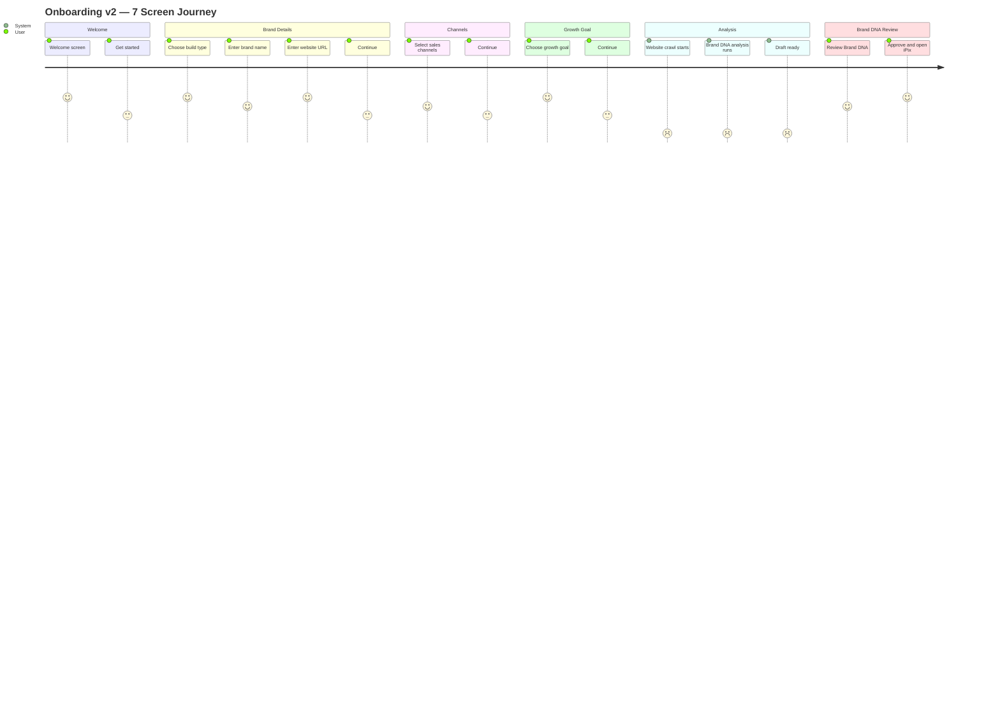
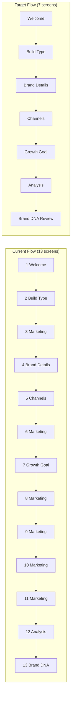
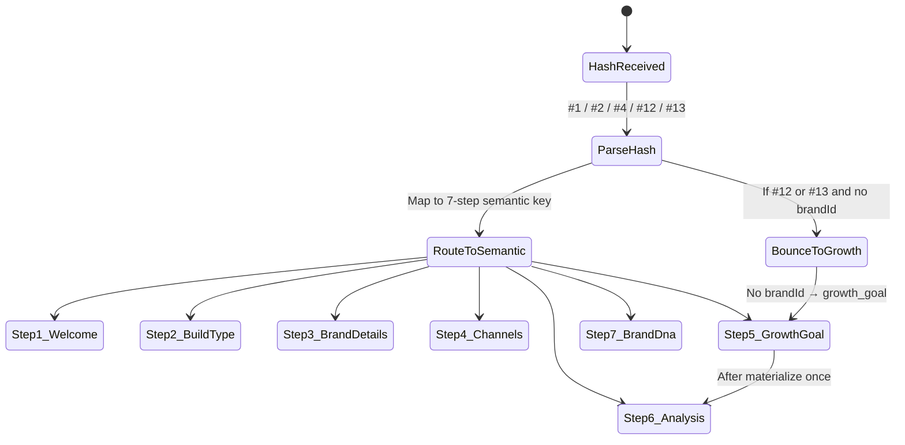
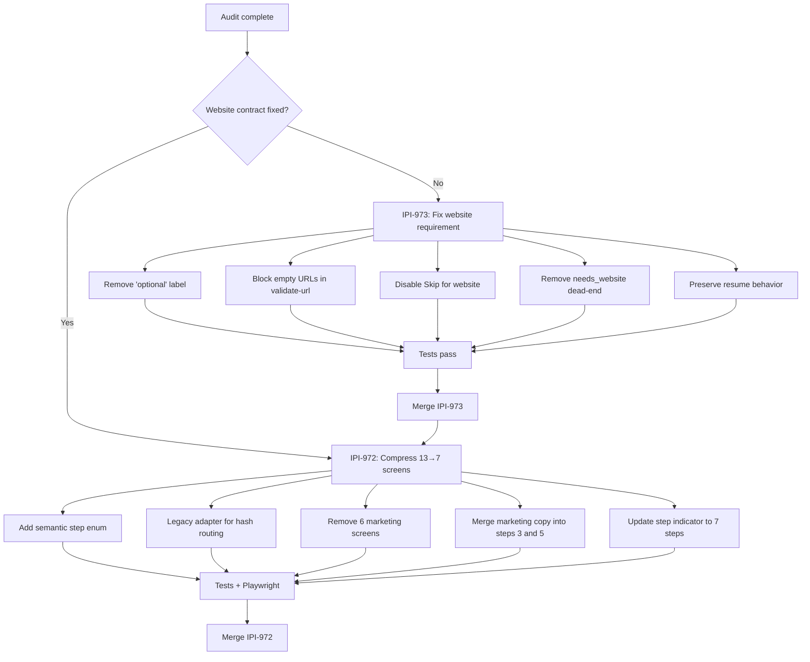

# Onboarding Optimization Plan — 13 to 7 Screens (2026-06-25)

## Objective
Compress the 13-screen onboarding flow to 7 useful steps, removing 6 marketing-only interstitials while preserving all input collected and consumed by Brand DNA.

## Priority: Website Contract Fix MUST COME FIRST

See IPI-989 · ONB2-WEB-REQ-001 — the website contract must be fixed before measuring the shorter flow. The 7-screen compression (IPI-972) is blocked on it.

- **Linear issue:** https://linear.app/amo100/issue/IPI-989
- **Parent:** IPI-831 · ONB2-EPIC-001 — Onboarding v2 Delivery
- **Blocks:** IPI-972 · ONB2-UX-OPT-001

## Target Flow (7 Screens)

| Step | Semantic Key | Old Screen(s) | Component | Collects |
|------|-------------|---------------|-----------|----------|
| 1 | welcome | 1 | MarketingScreen | none |
| 2 | build_type | 2 | BuildTypeQuestion | build |
| 3 | brand_details | 3–4 | BrandDetailsQuestion | brandName, websiteUrl |
| 4 | channels | 5 | SalesChannelsQuestion | listed |
| 5 | growth_goal | 6–7 | GrowthPreferenceQuestion | grow |
| 6 | analysis | 12 | AnalysisProgressScreen | none (server-driven) |
| 7 | brand_dna | 13 | BrandDnaPayoffScreen | none |

## Legacy Mapping (Critical)

```
old 1     → welcome
old 2     → build_type
old 3–4   → brand_details
old 5     → channels
old 6–11  → growth_goal   (no brand_id yet — must return to growth_goal and materialize once)
old 12    → analysis
old 13    → brand_dna
```

**Critical constraint:** Screens 12–13 require a materialized `brandId`. If a user lands on old screen 12 or 13 via hash but has no `brandId`, they must be bounced to `growth_goal` (step 5), NOT directly to `analysis` (step 6). The analysis screen then materializes the brand via `onCommitAnalysis`.

## Implementation Sequence

### Phase 1: Website Contract (IPI-989 · ONB2-WEB-REQ-001) — BLOCKER
1. Remove "optional" wording from `BrandDetailsQuestion` website label
2. Remove Skip for website (screen 4 Skip currently clears both brandName AND websiteUrl)
3. Explain why website is required for crawl-backed Brand DNA
4. Make `ctaDisabled` block blank URLs on screen 4
5. Remove the `needsWebsite` dead-end in `AnalysisProgressScreen`
6. Update `validate-url.ts` to reject empty strings
7. Preserve resume behavior

### Phase 2: Semantic Step Routing (ONB2-UX-OPT-001 / IPI-972)
1. Define semantic step keys enum
2. Create legacy adapter: map old screen numbers → new semantic steps
3. Remove marketing screens 3, 6, 8, 9, 10, 11 from render
4. Merge old 3 into brand_details (absorb marketing copy into step 3 header)
5. Merge old 6 into growth_goal (absorb marketing copy into step 5 header)
6. Update `useOnboardingSession` to use semantic steps
7. Update hash parsing to handle both semantic keys and legacy numbers
8. Update step indicator for 7 steps

### Phase 3: Tests
1. Unit tests for semantic step routing + legacy adapter
2. Legacy resume tests (hash #12, #13, #4)
3. Fresh 7-screen journey
4. Analysis remains server-driven
5. Brand DNA approval waits for durable ready
6. Browser Back/Forward/hash tests
7. Playwright: mobile 390px + reduced motion

## Files to Change

### Phase 1 (Website Contract)
- `app/src/lib/onboarding/navigation.ts` — `ctaDisabled`, `canSkip`, add website-required constant
- `app/src/components/onboarding/questions/brand-details-question.tsx` — remove "optional" label, explain requirement, remove Skip
- `app/src/components/onboarding/analysis-progress-screen.tsx` — remove `needsWebsite` dead-end
- `app/src/lib/onboarding/validate-url.ts` — reject empty string
- `app/src/lib/onboarding/validate-url.test.ts` — add empty string test
- `app/src/lib/onboarding/navigation.test.ts` — update ctaDisabled/canSkip tests

### Phase 2 (13→7 Compression)
- `app/src/lib/onboarding/navigation.ts` — add semantic step enum, legacy adapter
- `app/src/lib/onboarding/use-onboarding-session.ts` — use semantic steps
- `app/src/components/onboarding/onboarding-flow.tsx` — update renderScreen switch
- `app/src/components/onboarding/step-indicator.tsx` — 7-step indicator
- `app/src/lib/onboarding/use-screen-history.ts` — handle semantic steps in URL hash

### Phase 3 (Tests)
- `app/src/components/onboarding/onboarding-flow.test.tsx`
- `app/src/lib/onboarding/navigation.test.ts`
- `app/src/components/onboarding/onboarding-history.test.tsx`

## Constraints Preserved
- No DB migration (removal-only compression)
- Legacy resume via `draft_answers` JSON
- Analysis screen remains server-status driven
- Brand DNA approval waits for durable ready (`scores_complete`/`draft_ready`/`ready`)
- Channels persisted but not consumed (kept as-is, not a priority yet)
- No removed marketing screens rendered

---

## User Journey Map



## Current vs Target Flow Comparison



## Legacy Adapter Mapping



## Implementation Workflow



## Tech Stack

| Layer | Technology | File Location |
|-------|-----------|---------------|
| **Framework** | Next.js 16 App Router | `app/src/app/(onboarding)/onboarding/` |
| **State** | React hooks + URL hash | `app/src/lib/onboarding/use-onboarding-session.ts` |
| **Routing** | Next.js App Router + custom hash | `app/src/lib/onboarding/use-screen-history.ts` |
| **Persistence** | Supabase Postgres (`onboarding_sessions.draft_answers`) | `app/src/lib/onboarding/session-draft.ts` |
| **Backend** | Supabase Edge Functions (Deno) | `supabase/functions/` |
| **AI Provider** | Cloudflare Workers AI via gateway | `supabase/functions/brand-intelligence/` |
| **URL Validation** | Custom zod-style validator | `app/src/lib/onboarding/validate-url.ts` |
| **Testing** | Vitest + Playwright | `app/src/**/*.test.*` + `e2e/` |
| **Styling** | Tailwind CSS + CSS variables | `app/src/app/(onboarding)/onboarding/onboarding.css` |
| **Design Source** | Zeely v2 DC | `Universal-design-prompt-4/Pages/Onboarding.v2.zeely.dc.html` |