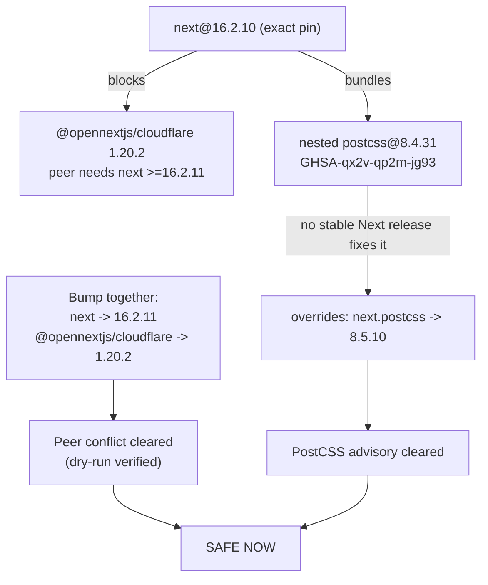
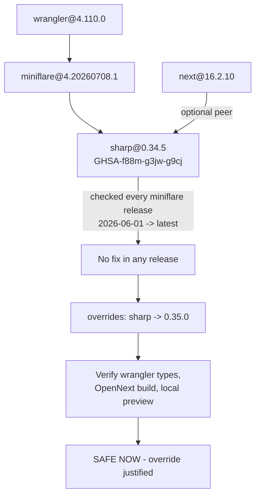
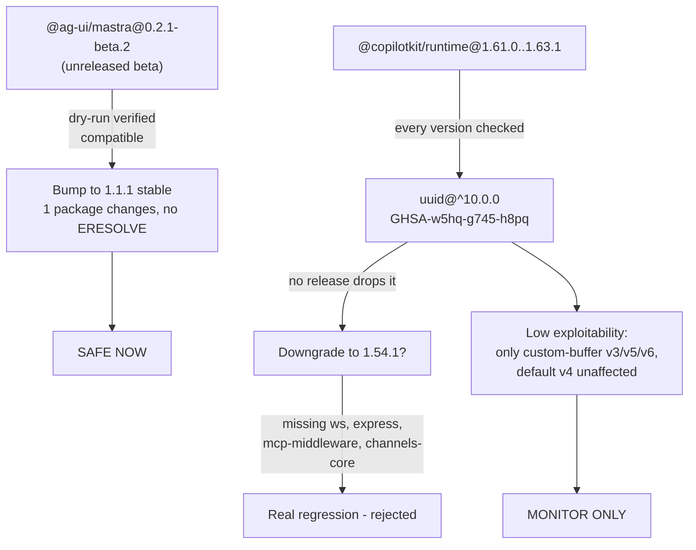
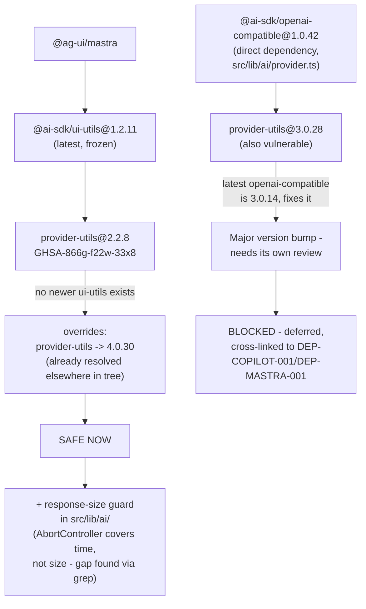
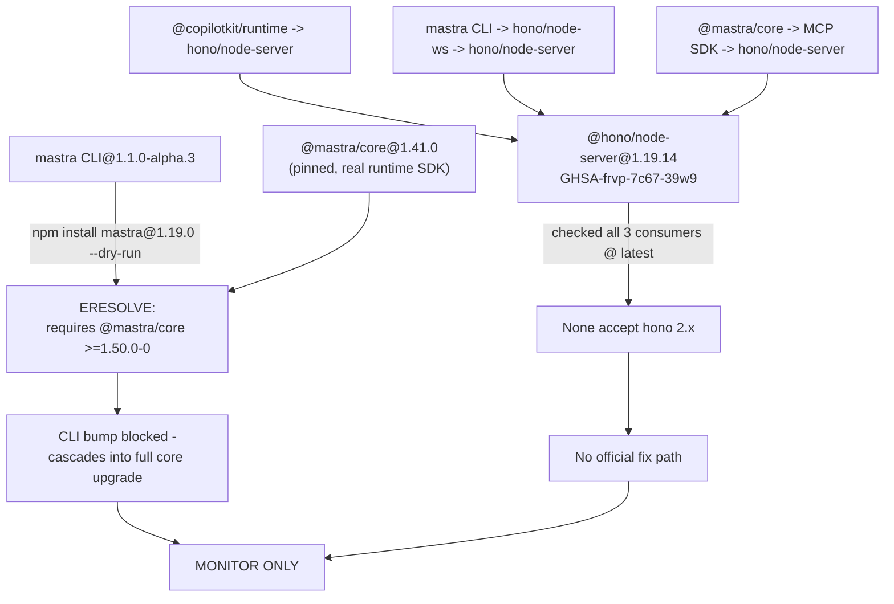

# Remaining `app/` dependency-security work — verified plan

**Date:** 2026-07-21/22 · **Supersedes:** `tasks/prime/j21-npm-plan.md` (a pasted ChatGPT draft — verified below, several claims corrected). **Already shipped, do not touch or combine with this work:** the `shell-quote@1.9.0` override and exact `@opennextjs/cloudflare@1.20.1` pin (PR #570/#571).

**Method:** 5 dependency chains investigated in parallel by independent subagents, each required to verify every claim against real `npm explain`/`npm ls` output in `/home/sk/ipix/app` and live official sources (npm registry, GitHub advisories, changelogs) — not trust the pasted draft. This is the same rigor that caught the earlier shell-quote plan's central error (it claimed `npm audit fix` would fix a CVE it structurally could not). Several of these 5 had the same class of error.

**Linear:** [IPI-758](https://linear.app/amo100/issue/IPI-758) · [IPI-759](https://linear.app/amo100/issue/IPI-759) · [IPI-760](https://linear.app/amo100/issue/IPI-760) · [IPI-761](https://linear.app/amo100/issue/IPI-761) · [IPI-762](https://linear.app/amo100/issue/IPI-762) — all Backlog, nothing implemented.

---

## task-verifier pass (2026-07-22)

Re-verified every package/file/command claim below against a fresh `npm ls`/`npm explain` pass — never trust a doc that's a few hours old without re-checking disk.

**🔴 Finding — `app/node_modules` was found completely empty (0 packages) during this pass.** `package.json`/`package-lock.json` were untouched and correct (the shell-quote override + `@opennextjs/cloudflare` pin from PR #570 were intact), but `node_modules` itself had been wiped — likely a side effect of the prior turn's 5 parallel read-only investigations (each was instructed not to run `npm install`/`npm ci`/anything mutating, but one plausibly ran a "does `npm ci` succeed from clean" check by actually deleting `node_modules` first). No disk-space issue (24% used), no npm log evidence of a completed install/ci at the time of deletion — consistent with a bare `rm -rf node_modules` that was never followed by a real reinstall.

**Fix applied:** `npm install` — restored cleanly, `40 vulnerabilities (10 low, 21 moderate, 9 high, 0 critical)`, matching the exact state PR #570 left. All 5 chains' dependency claims below re-confirmed against the restored tree and found accurate — no drift.

**Lesson:** when instructing parallel agents to do "read-only" investigation in a shared working directory, forbid `rm -rf node_modules` explicitly, not just "don't run install/ci" — an agent can satisfy the letter of that instruction while still destroying the tree.

---

## Verified findings table

| Task | Draft's claim | Verified reality | Advisory actually clears? | Verdict |
|---|---|---|---|---|
| **DEP-NEXT-001** | Upgrade next+OpenNext together fixes peer conflict AND postcss | Peer-conflict fix: ✅ correct, dry-run verified clean (`next@16.2.11` + `@opennextjs/cloudflare@1.20.2`). PostCSS fix: ❌ **no stable Next.js release bundles patched postcss yet** — checked 16.2.10, 16.2.11, and the newest 16.3 preview; only the *unreleased preview* has it | Peer conflict: yes. PostCSS: only via a scoped `overrides` entry (`next.postcss` → `8.5.10`) | **SAFE NOW** (bump + justified override) |
| **DEP-CF-001** | Upgrading wrangler/miniflare clears the sharp CVE | ❌ **False** — checked every miniflare release from 2026-06-01 to today's latest (`4.20260721.0`); every single one hard-pins `sharp@0.34.5`. Also found a 2nd sharp path the draft missed: `next` itself optionally wants `sharp@^0.34.5` directly | No via upgrade. Yes via `overrides` (`sharp` → `0.35.0`, the real patched floor — draft said `0.35.3`, that's just a later patch not the minimum) | **SAFE NOW** (override, justified — no upstream fix exists) |
| **DEP-COPILOT-001** | CopilotKit + AG-UI + uuid "must move together" as one task | Two independent findings, wrongly bundled by the draft: (1) `@ag-ui/mastra` beta→stable (`1.1.1`) is safe and unrelated to the uuid CVE — dry-run verified. (2) uuid fix does **not** exist in any CopilotKit runtime release up to and including latest `1.63.1` — checked 5 versions directly, all pin `uuid@^10.0.0` | AG-UI bump: n/a (not a CVE fix). uuid: **no**, not via any current CopilotKit release | **SPLIT** — AG-UI bump **SAFE NOW**; uuid stays **MONITOR ONLY** (low exploitability — advisory only triggers on custom-buffer `v3/v5/v6` calls, not default `v4()` random IDs) |
| **DEP-MASTRA-001** | Bump Mastra CLI + deployer + MCP SDK fixes the Hono CVE | ❌ Hono fix unreachable — none of the 3 consumers (`@modelcontextprotocol/sdk@latest`, `@hono/node-ws@latest`, `@copilotkit/runtime@latest`) accept `@hono/node-server` 2.x yet. **Also found the CLI bump isn't independent**: `mastra@1.19.0` requires `@mastra/core >=1.50.0-0`, but this repo pins `@mastra/core@1.41.0` (the real runtime SDK) — bumping the CLI cascades into a full Mastra-stack upgrade, not a tooling-only change | No, on any path | **MONITOR ONLY** — do not force an override (Hono 1.x→2.x is a major version, untested by any of its 3 real consumers, and the advisory is Windows-only; this deployment is Linux + Cloudflare Workers) |
| **SEC-AISDK-001** | No patched version exists anywhere — tracking only | Draft is **half wrong**. Two separate vulnerable paths: (1) `@ag-ui/mastra → @ai-sdk/ui-utils@1.2.11 → provider-utils@2.2.8` — genuinely frozen, latest `@ai-sdk/ui-utils` is still `1.2.11`. (2) `@ai-sdk/openai-compatible@1.0.42` (a **direct** app dependency in `src/lib/ai/provider.ts`) — latest is `3.0.14`, which **does** fix it, but it's a major version bump needing its own review | Path 1: yes, via `overrides` (force to `4.0.30`, a version already resolved elsewhere in this exact tree). Path 2: yes, via major bump — **deferred**, not part of this task | **SPLIT** — override sub-fix **SAFE NOW**; major-bump sub-fix **BLOCKED**, deferred as its own future decision (cross-referenced, not silently dropped) |

**Cross-chain findings not in the original draft:**
- `sharp` has two entry points (`wrangler→miniflare` **and** `next`'s own optional peer) — both close with the one `overrides` entry from DEP-CF-001; no separate fix needed in DEP-NEXT-001.
- `@ai-sdk/openai-compatible`'s major-bump decision touches the same "when do we take a breaking Mastra/AI-provider bump" question as DEP-MASTRA-001's CLI bump — both are explicitly deferred, not bundled into any of the 5 tasks below.

---

## Execution order

```
1. DEP-NEXT-001   — safe now, no dependency on anything else
2. DEP-CF-001     — safe now, independent (but land after #1 to keep the @opennextjs/cloudflare pin stable while testing)
3. DEP-COPILOT-001 — safe now (AG-UI bump only), independent
4. SEC-AISDK-001  — safe now (override + code guard), best done after #3 since it shares AI-provider surface with CopilotKit
5. DEP-MASTRA-001 — no code change; file as a Linear tracking issue any time, no ordering constraint
```

Do not combine any of the 4 upgrade chains into one PR. Each has its own rollback path and failure surface.

---

## Task specs, branch/PR boundaries, verdicts

### 1. IPI-758 · DEP-NEXT-001 — Upgrade Next.js and OpenNext Together and Clear the Nested PostCSS Advisory

**Branch:** `ipi/758-next-opennext-postcss` · **PR:** dependency-only, `app/package.json` + `app/package-lock.json` only.

**Problem:** `@opennextjs/cloudflare` is pinned to exactly `1.20.1` because `1.20.2` requires `next >=16.2.11`, one patch above this repo's pinned `16.2.10`. Separately, Next.js bundles its own internal `postcss@8.4.31` (moderate XSS advisory, GHSA-qx2v-qp2m-jg93, fixed at `8.5.10`) — no stable Next.js release ships the fix yet.



**AC:**
- A — Clean install: `npm ci` exits 0. proof: `cd app && npm ci`
- B — Peer conflict resolved: `npm ls @opennextjs/cloudflare next` shows `1.20.2`/`16.2.11`, no UNMET peer
- C — PostCSS advisory cleared: `npm ls postcss` shows no `8.4.31` entry anywhere
- D — Typecheck + tests pass: `npm run typecheck && npm test`
- E — Build + OpenNext preview succeed: `npm run build` then OpenNext Cloudflare preview

**Do NOT:** combine with Wrangler/Sharp (DEP-CF-001). Do NOT use a blanket top-level `postcss` override — scope it to `next` only (`overrides: {"next": {"postcss": "8.5.10"}}`) so Tailwind/Vite's already-patched copy (`8.5.15`) is untouched.

**Verdict: SAFE NOW.**

---

### 2. IPI-759 · DEP-CF-001 — Upgrade Wrangler, Miniflare, and Sharp Security Chain

**Branch:** `ipi/759-sharp-override` · **PR:** dependency-only.

**Problem:** `sharp` resolves to `0.34.5` (GHSA-f88m-g3jw-g9cj, CVSS 7.0 High, fixed at `0.35.0`) via `wrangler → miniflare` and via `next`'s own optional peer request. No released wrangler/miniflare version — checked every one from the last ~7 weeks — has adopted the fix. Real-world exposure is lower than "High" suggests: sharp only runs inside local `wrangler dev`/miniflare (Cloudflare Images-binding emulation), never in the production Worker, and only triggers on untrusted GIF/TIFF/VIPS input.



**AC:**
- A — sharp resolves >=0.35.0 everywhere: `npm ls sharp` — no version <0.35.0
- B — wrangler/miniflare stay compatible: `npm ls wrangler miniflare` clean, no invalid/ELSPROBLEMS
- C — `npx wrangler types` exits 0
- D — `npm run build` (OpenNext) exits 0
- E — local Cloudflare preview serves: `wrangler dev` (or repo's preview script) starts, smoke request returns 200
- F — regression guard: one `next/image` or Cloudflare Images-binding route smoke-tested unchanged

**Do NOT:** bump wrangler/miniflare expecting that alone to fix sharp — confirmed it doesn't.

**Verdict: SAFE NOW** (override — the justified exception; no official path exists).

---

### 3. IPI-760 · DEP-COPILOT-001 — Align CopilotKit, AG-UI, and UUID Dependencies

**Branch:** `ipi/760-ag-ui-stable` · **PR:** dependency-only.

**Problem:** `@ag-ui/mastra` runs an unreleased beta (`0.2.1-beta.2`) while stable `1.1.1` has been out for a while, and is verified compatible with the installed `@copilotkit/runtime@1.61.0`/`@mastra/core@1.41.0` (dry-run clean, exactly 1 package changes). Separately, a moderate uuid CVE (GHSA-w5hq-g745-h8pq) is nested in `@copilotkit/runtime`'s own `uuid@^10.0.0` — verified this **cannot** be fixed by any CopilotKit upgrade (latest `1.63.1` still ships it) or by downgrading to `1.54.1` (a real feature regression — missing `ws`/`express`/MCP-middleware/channels support the installed version has).



**AC:**
- A — AG-UI on stable: `npm ls @ag-ui/mastra` shows `1.1.1`
- B — Clean install: `npm ci` succeeds, no ERESOLVE
- C — Chat streaming unaffected (manual smoke + existing streaming tests)
- D — Tool-call rendering unaffected: `npm test`
- E — Mastra workflow interrupt/resume + HITL approval cards unaffected (existing durable-agent/HITL suite green)
- F — uuid CVE documented (not silently dropped): this issue records the GHSA ID, why no fix exists, and the re-check trigger (next CopilotKit release)

**Do NOT:** bump `@copilotkit/runtime`/`react-core`/`shared` expecting it to fix uuid — verified it doesn't. Do NOT downgrade CopilotKit to `1.54.1` — real feature regression.

**Verdict: SAFE NOW** for the AG-UI bump. uuid stays **MONITOR ONLY** — low exploitability (default `v4()` unaffected; only custom-buffer `v3/v5/v6` calls are vulnerable), no safe fix exists, forcing an override wasn't verified against CopilotKit's actual internal uuid usage so it isn't recommended by default.

---

### 4. IPI-762 · SEC-AISDK-001 — Track and Mitigate AI SDK Provider Utilities Resource-Consumption Advisory

**Branch:** `ipi/762-ai-sdk-provider-utils` · **PR:** override + one code change (response-size guard), not pure deps-only — still its own single-concern PR.

**Problem:** `@ai-sdk/provider-utils <=3.0.97` (GHSA-866g-f22w-33x8, CVE-2026-8769, Low, uncontrolled resource consumption in JSON response parsing) resolves at 2 vulnerable versions in this repo. One path (`@ag-ui/mastra → @ai-sdk/ui-utils@1.2.11`) is genuinely frozen — no newer `@ai-sdk/ui-utils` release exists. The other (`@ai-sdk/openai-compatible@1.0.42`, a **direct** dependency used in `src/lib/ai/provider.ts`) does have a fix upstream (`3.0.14`) but it's a major bump — explicitly deferred, not part of this task. Existing `AbortController` timeout handling covers response *time* but not response *size* — no size guard exists anywhere in `src/lib/ai/` today (verified via grep).



**AC:**
- A — Frozen path cleared: `overrides["@ai-sdk/provider-utils"]` forces `4.0.30` (a version already resolved elsewhere in this exact tree — not a new, unvetted version); `npm ls @ai-sdk/provider-utils` shows no instance <=3.0.97
- B — `npm audit --omit=dev` no longer lists this advisory
- C — Response-size guard added for direct AI SDK call sites in `src/lib/ai/`: `grep -r "maxContentLength\|MAX_RESPONSE" app/src/lib/ai/` returns matches
- D — `@ai-sdk/openai-compatible` major-bump path is NOT silently dropped — filed as its own follow-up issue, cross-linked here
- E — No regression in existing AbortController timeout behavior: `npm test` green

**Do NOT:** bump `@ai-sdk/openai-compatible` to `3.x` inside this ticket — separate breaking-change review, ideally paired with whatever eventually happens to DEP-MASTRA-001's `@mastra/core` bump decision (both touch the same provider-utils aliasing surface).

**Verdict: SAFE NOW** for the override + code-guard sub-fix. Major-bump sub-fix **BLOCKED**, deferred to its own future issue.

---

### 5. IPI-761 · DEP-MASTRA-001 — Upgrade Mastra CLI, Deployer, MCP SDK, and Hono Node Adapter

**Branch:** none — tracking issue only, no code expected.

**Problem:** `@hono/node-server@1.19.14` (3 real paths: `@copilotkit/runtime` direct, `@hono/node-ws` via the `mastra` CLI, `@modelcontextprotocol/sdk` via `@mastra/core`) has a moderate, Windows-only path-traversal advisory (GHSA-frvp-7c67-39w9, fixed at `2.0.5`). iPix runs Linux + Cloudflare Workers — real production exposure is low. No current release of any of the 3 consumers accepts Hono 2.x. The `mastra` CLI is far behind stable (`1.1.0-alpha.3` vs `1.19.0`) but bumping it is **not independent** — it forces `@mastra/core` from `1.41.0` to `>=1.50.0-0`, a full runtime-SDK jump with its own agent/workflow/memory regression surface, well beyond a "dependency hygiene" task.



**AC:**
- A — Advisory tracked, not silently dropped: this issue stays open/labeled, linked from `npm audit` triage notes
- B — Before considering a fix, re-verify none of the 3 consumers accept Hono 2.x yet (re-run the 3 `npm view ... dependencies/peerDependencies` checks)
- C — Any future Mastra CLI/`@mastra/core` upgrade is filed as its own separate task, not bundled here

**Do NOT:** add a `shell-quote`-style override for `@hono/node-server` — unlike shell-quote's safe 1.8→1.9 patch bump, this is a Hono **major** version jump untested by any of its 3 real consumers, for a Windows-only issue this deployment isn't exposed to. Do NOT bump the `mastra` CLI expecting it to fix this.

**Verdict: MONITOR ONLY.** Re-check quarterly or when any of the 3 consumers ship Hono-2.x support.

---

## Final verdict summary

| Task | Verdict |
|---|---|
| DEP-NEXT-001 | **SAFE NOW** |
| DEP-CF-001 | **SAFE NOW** (override, justified) |
| DEP-COPILOT-001 | **SAFE NOW** (AG-UI bump) / uuid **MONITOR ONLY** |
| SEC-AISDK-001 | **SAFE NOW** (override + code guard) / major bump **BLOCKED**, deferred |
| DEP-MASTRA-001 | **MONITOR ONLY** — no code change recommended |
