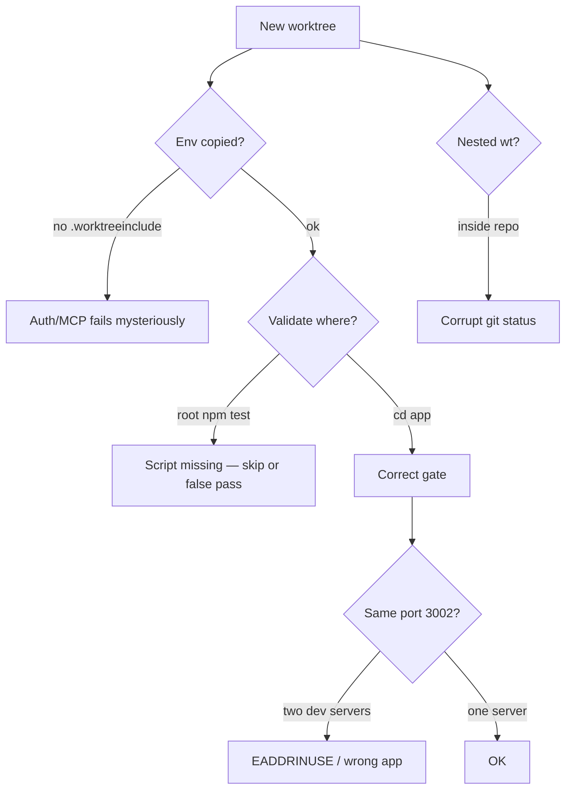

# worktrees skill — audit (2026-07-06)

**Skill:** [`.claude/skills/worktrees/`](../../.claude/skills/worktrees/)  
**Grade:** **B (78/100)** before fixes → **A- (90/100)** after P0 patch

---

## Scorecard

| Dimension | Before | After | Notes |
|-----------|-------:|------:|-------|
| Structure / progressive disclosure | 90 | 90 | SKILL + 3 refs — good split |
| Link integrity | 100 | 100 | 0 broken relative links |
| **iPix command accuracy** | **45** | **92** | Was wrong root `npm run lint/test/build` |
| Repo script integration | 40 | 95 | Added `worktree:add` · `worktree:audit` |
| Safety rails | 88 | 90 | Forensic audit, backup, leak guard strong |
| Sibling skill wiring | 55 | 88 | Now links pr-workflow + task-verifier |
| Env bootstrap | 50 | 85 | Added `.worktreeinclude` (was missing on disk) |
| **Weighted (iPix)** | **78** | **90** | |

---

## Red flags (errors)

| Sev | Finding | Impact |
|-----|---------|--------|
| 🔴 | **Validation at repo root** — skill said `npm run lint/typecheck/test/build` at root | Agents run failing/missing scripts; false confidence |
| 🔴 | **Contradicted itself on `app/`** — claimed no `test` script | `app/package.json` has `test`, `lint`, `typecheck`, `build` |
| 🔴 | **`.worktreeinclude` missing** — CLAUDE.md + `worktree-add.mjs` expect it | New worktrees lack `.env.local` → Supabase/Infisical failures |
| 🟡 | **Repo scripts undocumented** — `npm run worktree:add` / `worktree:audit` | Manual `git worktree add` bypasses guards + env copy |
| 🟡 | **Never push to `main` not stated** | CLAUDE.md hard rule absent from skill |
| 🟡 | **13 active worktrees** (tracker) vs ~3–4 cap | Duplicate IPI-274 trees, nested `.claude/worktrees/` |
| 🟡 | **Infisical omitted** from supabase verify in worktree gate | `supabase:verify*` needs secrets |
| 🟡 | **Port `:3002` not named** | Operator dev collides silently |

---

## Failure points



1. **Env gap** — worktree without `.env.local` → Linear MCP / Supabase / QA login fail with opaque errors.
2. **Wrong verify directory** — root has only `supabase:verify*` + playwright; operator code needs `cd app`.
3. **Parallel IPI same screen** — tracker shows IPI-274 ×2, IPI-372 shoots — collision without `worktree:audit` first.
4. **`[gone]` remote branches** — audit marks stale-dirty 🔴; `--force` remove loses unpushed commits.
5. **Main checkout dirty** — tracker: 1088 uncommitted on `main` — worktree isolation doesn't protect main from agent edits there.
6. **Phantom nested paths** — `.claude/worktrees/*` inside repo (1.6G each) — gitignored but disk-heavy.

---

## P0 fixes — applied ✅

- [x] Validation → area matrix (`app/` vs `supabase/` vs legacy `src/`)
- [x] Document `npm run worktree:add` · `worktree:audit`
- [x] Merge gate → pr-workflow verify-matrix + task-verifier
- [x] Hard rule: never push to `main`
- [x] Create [`.worktreeinclude`](../../.worktreeinclude) (`.env.local`, `app/.env.local`)
- [x] Fix `ipix-ops.md` PR-split validation link

---

## P1 improvements (recommended)

| # | Action |
|---|--------|
| 1 | **`worktree:audit` before every add** — add to task-verifier Phase 5b MUST for multi-step tasks |
| 2 | **Port map in SKILL** — `app/` → 3002; second wt → 3003 or don't run dual dev |
| 3 | **`clean-gone` command** — link [.claude/commands/clean-gone.md](../../.claude/commands/clean-gone.md) in weekly tidy |
| 4 | **Branch naming lint** — flag `ipi/ipi-348-…` double prefix (seen in tracker) |
| 5 | **Disk budget** — note ~1.6G per wt with `app/node_modules`; cap drives tidy ritual |
| 6 | **`graphify update`** after wt work if >10 files moved (CLAUDE.md) |

---

## P2 improvements

| # | Action |
|---|--------|
| 7 | `evals/worktrees-eval.yaml` — triggers: "parallel branches", "isolated workspace" |
| 8 | Extend `worktree-audit.mjs` — flag duplicate Linear ID across branches |
| 9 | Negative trigger in YAML: "don't use for read-only git show" (already in prose) |

---

## Operator checklist (copy before new wt)

```bash
# 1. Audit first
npm run worktree:audit

# 2. Create (preferred)
npm run worktree:add -- IPI-NNN short-slug
cd ../wt-ipi-NNN-short-slug

# 3. Verify env
test -f .env.local && test -f app/.env.local && echo env ok

# 4. Baseline app gate
cd app && npm ci && npm run lint && npm run typecheck && npm test

# 5. If supabase touched
cd ../.. && infisical run -- npm run supabase:verify-rls

# 6. Before PR
#    pr-workflow verify-matrix + task-verifier report
#    NEVER push to main — ipi/* branch only
```

---

## Live repo snapshot (2026-07-06)

From [`docs/development/worktree-tracker.md`](../../docs/development/worktree-tracker.md):

- **Health:** 80/100 · **13 worktrees** · **0 orphans**
- **Risk:** main has 1088 uncommitted files; IPI-274 duplicated across two paths
- **Safe delete:** none flagged (all dirty or active)

---

## Related

- Skills P0: [`jul6-audit.md`](./jul6-audit.md)
- task-verifier MUST: [`skills-compliance-ipix.md`](../../.claude/skills/task-verifier/references/skills-compliance-ipix.md) (`worktrees` row)
