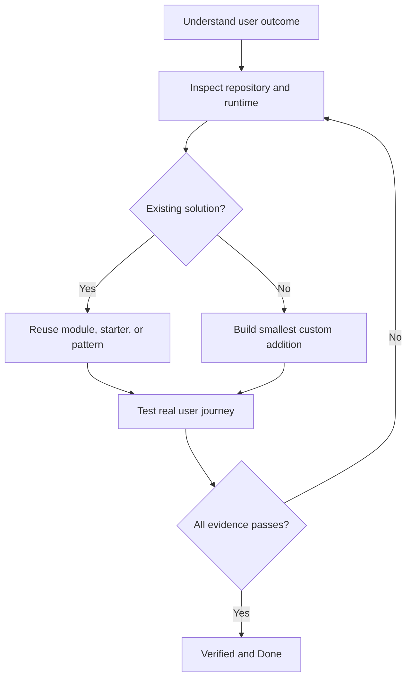
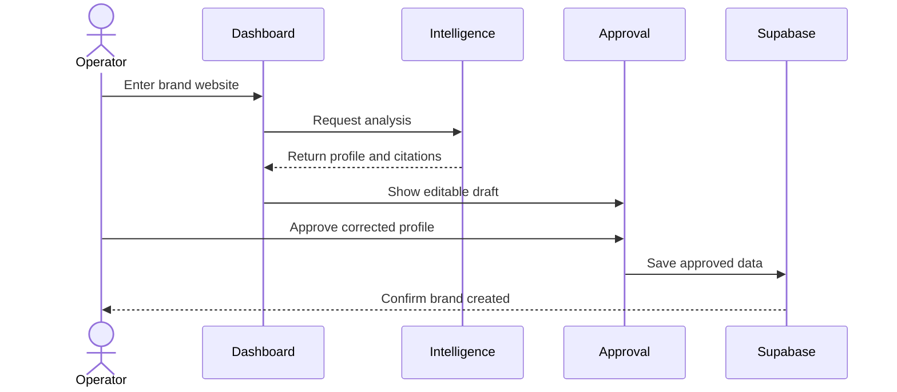

## Recommended Linear task standard

Yes—add the following structure to every engineering task. The core strategy is:

> Understand the user outcome → inspect what exists → reuse proven solutions → implement the smallest change → verify the real workflow.

## 1. Improve the task title

Use:

```text
IPI-XXX · TASK-ID — Plain-English User or System Outcome
```

Avoid titles that only describe technology.

Weak:

```text
IPI-454 · CF-AI-001 — AI Gateway
```

Better:

```text
IPI-454 · CF-AI-001 — Route Every iPix AI Request Through One Observable Gateway
```

Real-world meaning:

> When an operator generates a campaign, every AI request uses the same controlled gateway so failures, costs, providers, and fallbacks can be monitored.

Another example:

```text
IPI-23 · UI-002 — Let an Operator Create and Approve a Brand Profile From a Website
```

This is easier to understand than simply “Brand Intake Screen.”

---

## 2. Put this implementation prompt at the top

```markdown
## Implementation prompt

Complete this task using the following process:

1. Read the entire task, parent project, dependencies, linked specifications, and AGENTS.md.
2. Inspect the current repository and confirm the reported gap still exists.
3. Identify the real user journey and expected observable outcome.
4. Check whether another task, component, service, migration, or pull request already solves it.
5. Inspect the relevant vendor dashboard to confirm current configuration and runtime state.
6. Use the official CLI to inspect, scaffold, test, generate types, or validate configuration.
7. Search official documentation, official GitHub repositories, starters, templates, modules, tutorials, and recipes.
8. Select the smallest proven solution that fits the existing architecture.
9. Prefer existing components, SDKs, modules, workflows, and repository patterns before custom code.
10. Record why the selected solution is faster, safer, or simpler than the alternatives.
11. Implement only the required scope. Do not redesign unrelated systems.
12. Run unit, integration, security, build, and user-journey tests relevant to the change.
13. Verify the real authenticated workflow in a browser or preview environment.
14. Compare the result against every acceptance criterion.
15. Provide the PR, tests, preview evidence, logs, risks, rollback instructions, and follow-up tasks.

Do not mark the task Done because code exists. Mark it Done only when the observable workflow is proven.
```

---

## 3. Required Linear task description

```markdown
## Purpose

Explain the problem in simple language.

## Real-world example

Describe how a real operator, brand, photographer, customer, or system encounters the problem.

## User outcome

After completion, the user can:

## User journey

1. User starts at:
2. User performs:
3. System responds:
4. User confirms:
5. System saves or completes:

## Current state and evidence

- What currently happens:
- Repository evidence:
- Dashboard/runtime evidence:
- Source of truth:
- Date verified:

## Faster implementation review

- Existing iPix code that can be reused:
- Official module or starter:
- Official repository/example:
- Dashboard capability:
- CLI capability:
- Custom code still required:
- Why this is the smallest safe solution:

## Scope

### In scope

- 

### Out of scope

- 

## Tech stack

| Layer | Technology | Purpose |
|---|---|---|
| UI | React/Next.js/CopilotKit | User interaction |
| Agent | Mastra | Multi-step orchestration |
| Data | Supabase/Postgres | System of record |
| Hosting | Cloudflare Workers | Runtime and deployment |
| Media | Cloudinary | Image and video delivery |
| Commerce | Mercur/Medusa/Stripe | Products and payments |

Remove rows that do not apply.

## Skills and MCPs

- Required skills:
- Required MCP servers:
- Required dashboard:
- Required CLI:
- Browser verification:
- Why each is needed:

## Implementation steps

1. Inspect:
2. Reuse/scaffold:
3. Implement:
4. Test:
5. Preview:
6. Verify:
7. Document:

## Acceptance criteria

- [ ] Main user outcome works
- [ ] Expected failure behavior works
- [ ] Authentication and tenant isolation are preserved
- [ ] Existing behavior has not regressed
- [ ] Required automated tests pass
- [ ] Authenticated browser journey passes
- [ ] Preview or live runtime evidence is attached
- [ ] Rollback procedure is documented

## Dependencies

- Blocks:
- Blocked by:
- Related:
- Parent project:
- Milestone:

## Security and data

- Source of truth:
- Read authorization:
- Write authorization:
- RLS impact:
- Secrets involved:
- Audit/logging requirements:

## Verification evidence

- PR:
- Commit SHA:
- CI:
- Unit/integration tests:
- Browser/E2E:
- Preview:
- Dashboard/runtime evidence:
- Logs/observability:
- Follow-up issues:
```

## 4. Efficient implementation workflow



The key rule is that custom code is the final option—not the starting point.

## 5. User-journey diagram example

For `IPI-23 · UI-002 — Let an Operator Create and Approve a Brand Profile From a Website`:



Every UI task should describe the journey. Use Mermaid when the workflow crosses systems, contains approvals, or has important failure branches.

---

## 6. Skills, MCPs, dashboards, and CLIs

| Task type | Skills/tools | Dashboard | CLI | Verification |
| --- | --- | --- | --- | --- |
| Linear planning | Linear skill \+ Linear MCP | Linear | Optional API scripts | Relations, milestone and status |
| GitHub/PR | GitHub skill/MCP | GitHub Actions | `gh` | PR checks and review threads |
| Cloudflare | Cloudflare, Workers best practices, Wrangler | Workers, AI Gateway, logs | `wrangler` | Preview Worker and logs |
| Supabase | Supabase \+ Postgres best practices | Table Editor, Auth, Logs | `supabase` | Schema, RLS, generated types |
| Mastra | Project Mastra skill \+ official docs | Mastra Studio | Project scripts | Workflow, suspend/resume, storage |
| CopilotKit | Project CopilotKit skill \+ examples | Application UI | App scripts | Authenticated agent journey |
| UI | React/Next.js skills | Preview deployment | Build/test scripts | Playwright browser test |
| Cloudinary | Cloudinary tools | Media Library | SDK/test scripts | Ownership and delivery URL |

Important Supabase rule: its official MCP documentation says the MCP is intended for development and testing—not direct production-data access.

---

## 7. “Reuse before custom code” checklist

Every task should prove that these were checked:

- [ ] Existing iPix component or service
- [ ] Existing dependency already installed
- [ ] Vendor dashboard feature
- [ ] Official CLI scaffold or generator
- [ ] Official SDK/module
- [ ] Official starter/template
- [ ] Official GitHub example
- [ ] Maintained community example, if official examples are insufficient
- [ ] Custom code required only for the remaining gap
- [ ] Selected example is active and not archived

One important correction: the standalone CopilotKit Mastra repositories referenced in older plans are now archived. Use the active CopilotKit monorepo examples instead:

- [https://github.com/CopilotKit/CopilotKit/tree/main/examples/canvas/mastra](https://github.com/CopilotKit/CopilotKit/tree/main/examples/canvas/mastra)
- [https://github.com/CopilotKit/CopilotKit/tree/main/examples/integrations/mastra](https://github.com/CopilotKit/CopilotKit/tree/main/examples/integrations/mastra)

---

## 8. Official sources each task should consult

### Linear

- Issue creation and templates: [https://linear.app/docs/creating-issues](https://linear.app/docs/creating-issues)
- Parent and sub-issues: [https://linear.app/docs/parent-and-sub-issues](https://linear.app/docs/parent-and-sub-issues)
- Dependencies and relations: [https://linear.app/docs/issue-relations](https://linear.app/docs/issue-relations)
- Linear MCP workflows: [https://linear.app/docs/mcp](https://linear.app/docs/mcp)

### Cloudflare

- Next.js on Workers: [https://developers.cloudflare.com/workers/framework-guides/web-apps/nextjs/](https://developers.cloudflare.com/workers/framework-guides/web-apps/nextjs/)
- Automatic project configuration: [https://developers.cloudflare.com/workers/framework-guides/automatic-configuration/](https://developers.cloudflare.com/workers/framework-guides/automatic-configuration/)
- GitHub Actions deployment: [https://developers.cloudflare.com/workers/ci-cd/external-cicd/github-actions/](https://developers.cloudflare.com/workers/ci-cd/external-cicd/github-actions/)
- OpenNext adapter repository: [https://github.com/opennextjs/opennextjs-cloudflare](https://github.com/opennextjs/opennextjs-cloudflare)
- OpenNext documentation: [https://opennext.js.org/cloudflare](https://opennext.js.org/cloudflare)

### Mastra and CopilotKit

- Mastra workflows: [https://mastra.ai/docs/workflows/overview](https://mastra.ai/docs/workflows/overview)
- Mastra tools: [https://mastra.ai/docs/agents/using-tools](https://mastra.ai/docs/agents/using-tools)
- Mastra approval: [https://mastra.ai/docs/agents/agent-approval](https://mastra.ai/docs/agents/agent-approval)
- Mastra templates: [https://mastra.ai/templates](https://mastra.ai/templates)
- Mastra repository: [https://github.com/mastra-ai/mastra](https://github.com/mastra-ai/mastra)
- CopilotKit integration: [https://mastra.ai/guides/build-your-ui/copilotkit/overview](https://mastra.ai/guides/build-your-ui/copilotkit/overview)
- Mastra UI examples: [https://github.com/mastra-ai/ui-dojo](https://github.com/mastra-ai/ui-dojo)

### Supabase

- CLI: [https://supabase.com/docs/guides/local-development/cli/getting-started](https://supabase.com/docs/guides/local-development/cli/getting-started)
- MCP: [https://supabase.com/docs/guides/ai-tools/mcp](https://supabase.com/docs/guides/ai-tools/mcp)
- Edge Functions: [https://supabase.com/docs/guides/functions](https://supabase.com/docs/guides/functions)
- CLI repository: [https://github.com/supabase/cli](https://github.com/supabase/cli)
- GitHub Action: [https://github.com/supabase/setup-cli](https://github.com/supabase/setup-cli)

## Final recommendation

Add this task-quality gate:

> A Linear task cannot move to Ready until it includes a clear outcome, user journey, current-state evidence, dependencies, reuse research, implementation steps, security impact, acceptance criteria, and verification plan.

And add this completion gate:

> Merged means the code landed. Verified means the real workflow passed. Done means verification evidence and rollback instructions are attached.